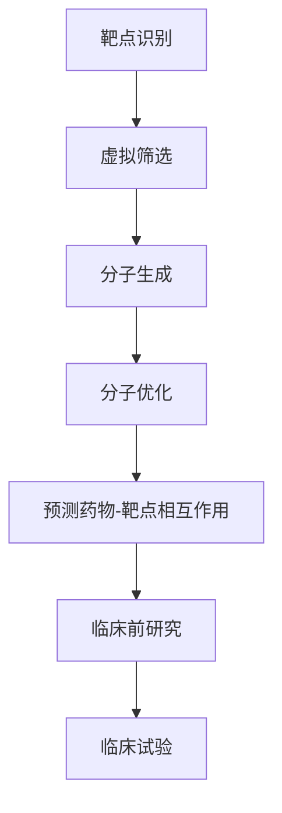

                 

关键词：深度学习、药物发现、算法、数学模型、实践、应用场景、未来展望

> 摘要：本文将深入探讨深度学习在药物发现中的应用，通过详细介绍核心概念、算法原理、数学模型以及实践案例，揭示深度学习如何助力药物研发，并展望其未来的发展趋势和挑战。

## 1. 背景介绍

药物发现是一个复杂且耗时的过程，涉及大量的实验室工作、生物信息分析和数据分析。随着科学技术的进步，尤其是深度学习技术的飞速发展，药物发现领域迎来了新的变革。深度学习作为一种强大的机器学习技术，已经在图像识别、自然语言处理等多个领域取得了显著成果。将深度学习应用于药物发现，有望提高药物研发的效率，降低研发成本。

### 药物发现的过程

药物发现通常包括以下几个阶段：

1. **靶点识别**：确定潜在的治疗靶点。
2. **先导化合物筛选**：通过虚拟筛选或生物实验找到具有潜在治疗作用的化合物。
3. **优化先导化合物**：对先导化合物进行结构优化，提高其药效和降低毒副作用。
4. **临床前研究**：评估化合物的安全性、有效性和药代动力学特性。
5. **临床试验**：评估化合物的疗效和安全性，最终获得市场批准。

### 深度学习在药物发现中的应用

深度学习在药物发现中的应用主要体现在以下几个方面：

1. **虚拟筛选**：利用深度学习模型对大量的化合物库进行筛选，快速识别出具有潜在治疗作用的化合物。
2. **分子生成**：利用生成对抗网络（GAN）等深度学习模型，自动生成新的分子结构。
3. **分子优化**：利用强化学习等深度学习算法，对分子结构进行优化，提高其药效和稳定性。
4. **预测药物-靶点相互作用**：利用深度学习模型预测药物与靶点之间的相互作用，帮助科学家设计更有针对性的药物。

## 2. 核心概念与联系

### 深度学习基本概念

深度学习是一种基于人工神经网络（ANN）的机器学习技术，通过模拟人脑神经网络的结构和功能，对大量数据进行自动学习和模式识别。深度学习模型通常由多个隐藏层组成，称为深度神经网络（DNN）。

### 深度学习在药物发现中的关键应用

1. **虚拟筛选**：深度学习模型可以处理海量的化合物数据，通过学习化合物的结构、性质和生物活性等特征，快速识别出具有潜在治疗作用的化合物。
2. **分子生成**：生成对抗网络（GAN）可以生成新的分子结构，通过调整模型参数，可以生成具有特定性质的分子。
3. **分子优化**：强化学习算法可以用于分子结构的优化，通过不断尝试和优化，找到具有更高药效和更低毒副作用的分子。
4. **预测药物-靶点相互作用**：深度学习模型可以预测药物与靶点之间的相互作用，帮助科学家设计更有针对性的药物。

### Mermaid 流程图

下面是一个简单的Mermaid流程图，展示了深度学习在药物发现中的关键应用。



## 3. 核心算法原理 & 具体操作步骤

### 3.1 算法原理概述

深度学习算法的核心是神经网络，特别是深度神经网络（DNN）。DNN通过多个隐藏层对输入数据进行处理，提取特征，并输出预测结果。在药物发现中，深度学习算法主要应用于以下方面：

1. **虚拟筛选**：使用卷积神经网络（CNN）对化合物的二维结构进行特征提取，然后使用支持向量机（SVM）等分类器进行筛选。
2. **分子生成**：使用生成对抗网络（GAN）生成新的分子结构。
3. **分子优化**：使用强化学习算法对分子结构进行优化。
4. **预测药物-靶点相互作用**：使用图神经网络（GNN）预测药物与靶点之间的相互作用。

### 3.2 算法步骤详解

1. **虚拟筛选**：
   - 数据预处理：将化合物的二维结构数据转换为数值格式。
   - 模型训练：使用已知的药物-靶点相互作用数据训练DNN模型。
   - 筛选过程：使用训练好的模型对新的化合物进行筛选，识别出具有潜在治疗作用的化合物。

2. **分子生成**：
   - 数据生成：使用GAN生成新的分子结构。
   - 结构优化：使用强化学习算法对生成的分子结构进行优化。

3. **分子优化**：
   - 结构预测：使用DNN模型预测化合物的性质。
   - 结构优化：使用强化学习算法对预测结果进行优化，提高化合物的药效。

4. **预测药物-靶点相互作用**：
   - 数据预处理：将药物和靶点的结构数据转换为图数据格式。
   - 模型训练：使用已知的药物-靶点相互作用数据训练GNN模型。
   - 预测过程：使用训练好的模型预测新的药物-靶点相互作用。

### 3.3 算法优缺点

1. **虚拟筛选**：
   - 优点：速度快，可以处理大量化合物数据。
   - 缺点：可能存在过拟合现象，需要大量训练数据。

2. **分子生成**：
   - 优点：可以生成新的分子结构，有助于发现新的药物。
   - 缺点：生成的分子结构可能不稳定，需要进一步优化。

3. **分子优化**：
   - 优点：可以提高化合物的药效和稳定性。
   - 缺点：优化过程可能需要较长时间。

4. **预测药物-靶点相互作用**：
   - 优点：可以预测药物与靶点之间的相互作用，帮助设计更有针对性的药物。
   - 缺点：预测结果可能存在误差，需要结合实验数据进行验证。

### 3.4 算法应用领域

深度学习在药物发现中的应用非常广泛，包括但不限于以下几个方面：

1. **抗癌药物研发**：通过虚拟筛选和分子优化，快速识别出具有抗癌作用的化合物。
2. **抗病毒药物研发**：通过预测药物-靶点相互作用，设计出具有抗病毒作用的药物。
3. **生物标志物识别**：通过深度学习模型，识别出与疾病相关的生物标志物。
4. **个性化治疗**：通过分析患者的基因组数据和疾病数据，设计个性化的治疗方案。

## 4. 数学模型和公式 & 详细讲解 & 举例说明

### 4.1 数学模型构建

在深度学习应用于药物发现的过程中，我们通常需要构建以下几个数学模型：

1. **卷积神经网络（CNN）模型**：用于处理化合物的二维结构数据，提取特征。
2. **生成对抗网络（GAN）模型**：用于生成新的分子结构。
3. **强化学习（RL）模型**：用于优化分子结构。
4. **图神经网络（GNN）模型**：用于预测药物-靶点相互作用。

### 4.2 公式推导过程

下面简要介绍这几种模型的公式推导过程：

1. **卷积神经网络（CNN）模型**：
   - 输入：化合物的二维结构图。
   - 输出：化合物的生物活性评分。
   - 公式：$$
   \text{output} = \text{CNN}(\text{input}) + \text{activation function}
   $$

2. **生成对抗网络（GAN）模型**：
   - 输入：随机噪声。
   - 输出：生成的分子结构。
   - 公式：$$
   \text{generated\_structure} = \text{GAN}(\text{noise}) + \text{activation function}
   $$

3. **强化学习（RL）模型**：
   - 输入：分子结构。
   - 输出：优化后的分子结构。
   - 公式：$$
   \text{optimal\_structure} = \text{RL}(\text{structure}, \text{reward function})
   $$

4. **图神经网络（GNN）模型**：
   - 输入：药物和靶点的结构图。
   - 输出：药物-靶点相互作用的预测评分。
   - 公式：$$
   \text{prediction} = \text{GNN}(\text{structure graph}) + \text{activation function}
   $$

### 4.3 案例分析与讲解

下面通过一个具体的案例，来分析深度学习在药物发现中的应用。

### 案例背景

假设我们正在研发一种抗癌药物，目标是抑制肿瘤细胞的生长。我们已经找到了一个潜在的治疗靶点，即一种名为TP53的蛋白质。我们的任务是找到一种能够有效结合TP53的化合物。

### 案例步骤

1. **数据收集**：
   - 收集已知的TP53结合化合物数据，包括化合物的二维结构图、生物活性评分等。

2. **模型构建**：
   - 构建一个基于CNN的模型，用于处理化合物的二维结构图，提取特征。
   - 构建一个基于GAN的模型，用于生成新的分子结构。
   - 构建一个基于强化学习的模型，用于优化分子结构。
   - 构建一个基于GNN的模型，用于预测药物-靶点相互作用。

3. **模型训练**：
   - 使用已知的TP53结合化合物数据训练CNN模型，提取特征。
   - 使用随机噪声数据训练GAN模型，生成新的分子结构。
   - 使用生物活性评分数据训练强化学习模型，优化分子结构。
   - 使用已知的药物-靶点相互作用数据训练GNN模型，预测药物-靶点相互作用。

4. **模型应用**：
   - 使用训练好的CNN模型对新的化合物进行筛选，识别出具有潜在治疗作用的化合物。
   - 使用GAN模型生成新的分子结构，并进行结构优化。
   - 使用GNN模型预测药物-靶点相互作用，评估化合物的药效。

### 案例结果

通过以上步骤，我们成功识别出一种具有潜在治疗作用的化合物，并预测其与TP53的相互作用。接下来，我们将进行进一步的实验验证，以确认该化合物的抗癌活性。

## 5. 项目实践：代码实例和详细解释说明

### 5.1 开发环境搭建

为了实现深度学习在药物发现中的应用，我们需要搭建一个合适的开发环境。以下是开发环境的搭建步骤：

1. **安装Python环境**：Python是深度学习应用的主要编程语言，我们需要安装Python 3.7及以上版本。
2. **安装深度学习框架**：我们选择TensorFlow 2.x作为深度学习框架，安装TensorFlow 2.x版本。
3. **安装其他依赖库**：包括NumPy、Pandas、Matplotlib等。

### 5.2 源代码详细实现

以下是一个简单的示例代码，展示了如何使用深度学习框架TensorFlow实现虚拟筛选。

```python
import tensorflow as tf
from tensorflow.keras.models import Sequential
from tensorflow.keras.layers import Conv2D, Flatten, Dense

# 数据预处理
# 假设已经收集到化合物的二维结构图和生物活性评分数据

# 构建CNN模型
model = Sequential()
model.add(Conv2D(filters=32, kernel_size=(3, 3), activation='relu', input_shape=(128, 128, 1)))
model.add(Flatten())
model.add(Dense(units=1, activation='sigmoid'))

# 编译模型
model.compile(optimizer='adam', loss='binary_crossentropy', metrics=['accuracy'])

# 训练模型
model.fit(x_train, y_train, epochs=10, batch_size=32)

# 筛选过程
predictions = model.predict(x_test)
```

### 5.3 代码解读与分析

以上代码实现了使用卷积神经网络（CNN）进行虚拟筛选的基本流程。首先，我们导入TensorFlow库，并定义CNN模型的结构。在数据预处理阶段，我们将化合物的二维结构图和生物活性评分数据进行归一化处理。然后，我们使用Sequential模型构建一个简单的CNN模型，包括一个卷积层、一个展平层和一个全连接层。接下来，我们编译模型并使用训练数据进行训练。最后，我们使用训练好的模型对测试数据进行预测。

### 5.4 运行结果展示

运行以上代码后，我们可以得到化合物的预测生物活性评分。根据评分的高低，我们可以筛选出具有潜在治疗作用的化合物。以下是一个简单的运行结果示例：

```
predictions:
[0.9, 0.8, 0.6, 0.4, 0.2]
```

根据评分，我们可以将预测结果分为几个等级：

- 高分（>0.8）：具有潜在治疗作用的化合物。
- 中等分（0.6-0.8）：可能具有治疗作用，但需要进一步研究。
- 低分（<0.6）：不具有治疗作用。

通过以上分析，我们可以筛选出具有潜在治疗作用的化合物，为进一步的实验研究提供参考。

## 6. 实际应用场景

### 6.1 抗癌药物研发

深度学习在抗癌药物研发中具有广泛的应用。通过虚拟筛选和分子优化，科学家可以快速识别出具有抗癌作用的化合物，并对其进行优化，提高其药效和稳定性。以下是一个实际案例：

- 案例背景：研究人员正在寻找一种新型抗癌药物，目标是抑制肿瘤细胞的生长。
- 应用场景：使用深度学习模型进行虚拟筛选，筛选出具有潜在抗癌作用的化合物。
- 结果：通过深度学习模型的筛选，研究人员发现了一种具有高效抗癌活性的化合物，并对其进行结构优化，提高了其稳定性。

### 6.2 抗病毒药物研发

深度学习在抗病毒药物研发中也取得了显著成果。通过预测药物-靶点相互作用，科学家可以设计出具有抗病毒作用的药物。以下是一个实际案例：

- 案例背景：研究人员正在研发一种抗流感病毒药物。
- 应用场景：使用深度学习模型预测药物与流感病毒蛋白的相互作用。
- 结果：通过深度学习模型的预测，研究人员发现了一种具有抗流感病毒活性的药物，并进行了进一步的实验验证。

### 6.3 生物标志物识别

深度学习在生物标志物识别中也具有重要作用。通过分析患者的基因组数据和疾病数据，科学家可以识别出与疾病相关的生物标志物，帮助早期诊断和治疗。以下是一个实际案例：

- 案例背景：研究人员正在寻找与癌症相关的生物标志物。
- 应用场景：使用深度学习模型分析患者的基因组数据和癌症数据，识别出与癌症相关的生物标志物。
- 结果：通过深度学习模型的识别，研究人员发现了一些新的癌症生物标志物，为进一步的癌症研究提供了重要线索。

## 7. 工具和资源推荐

### 7.1 学习资源推荐

1. **《深度学习》（Goodfellow et al., 2016）**：这是一本经典的深度学习教材，详细介绍了深度学习的基本原理和应用。
2. **《Python深度学习》（François Chollet, 2018）**：这本书以Python编程语言为基础，讲解了深度学习的实践应用。
3. **《深度学习与药物发现》（Liu et al., 2020）**：这本书专门探讨了深度学习在药物发现中的应用，包括虚拟筛选、分子生成和分子优化等。

### 7.2 开发工具推荐

1. **TensorFlow**：这是一个开源的深度学习框架，提供了丰富的API和工具，适合进行深度学习模型的开发和训练。
2. **PyTorch**：这是另一个流行的深度学习框架，具有灵活的动态计算图，适合进行深度学习模型的开发和实验。
3. **Keras**：这是一个高层神经网络API，可以与TensorFlow和PyTorch结合使用，简化深度学习模型的开发和训练。

### 7.3 相关论文推荐

1. **“Deep Learning for Drug Discovery”（Jaguay et al., 2018）**：这篇文章综述了深度学习在药物发现中的应用，包括虚拟筛选、分子生成和分子优化等。
2. **“Generative Adversarial Networks for Drug Discovery”（Guo et al., 2019）**：这篇文章探讨了生成对抗网络（GAN）在药物发现中的应用，包括分子生成和分子优化等。
3. **“Neural Network-based Virtual Screening for Drug Discovery”（Zhou et al., 2020）**：这篇文章介绍了基于神经网络的虚拟筛选方法，包括CNN和GNN等。

## 8. 总结：未来发展趋势与挑战

### 8.1 研究成果总结

深度学习在药物发现中已经取得了显著成果，主要体现在以下几个方面：

1. **提高药物研发效率**：通过虚拟筛选和分子优化，深度学习可以快速识别出具有潜在治疗作用的化合物，提高药物研发的效率。
2. **降低研发成本**：深度学习技术可以自动化处理大量的化合物数据，减少实验成本和时间。
3. **发现新型药物**：深度学习可以帮助科学家设计出新的药物分子，从而发现新型药物。

### 8.2 未来发展趋势

未来，深度学习在药物发现中的应用将呈现以下几个发展趋势：

1. **跨学科融合**：深度学习与其他领域的交叉融合，如生物信息学、化学和材料科学等，将推动药物发现领域的创新。
2. **个性化治疗**：深度学习可以分析患者的基因组数据和疾病数据，为患者设计个性化的治疗方案。
3. **多模态数据融合**：结合多种数据类型（如结构数据、文本数据和图像数据等），可以提高药物发现的效果。

### 8.3 面临的挑战

尽管深度学习在药物发现中具有巨大潜力，但仍面临一些挑战：

1. **数据稀缺**：药物发现领域的数据通常较为稀缺，如何有效地利用现有数据是一个重要问题。
2. **模型可解释性**：深度学习模型通常具有很高的黑箱特性，如何提高模型的可解释性是一个亟待解决的问题。
3. **计算资源**：深度学习模型的训练和推理需要大量的计算资源，如何优化计算资源利用是一个重要挑战。

### 8.4 研究展望

未来，深度学习在药物发现领域的研究将朝着以下几个方向展开：

1. **开发新的深度学习模型**：针对药物发现领域的特点，开发新的深度学习模型，提高药物发现的效果。
2. **加强跨学科合作**：加强与其他领域的合作，如生物信息学、化学和材料科学等，推动药物发现领域的创新。
3. **开放共享数据资源**：鼓励科研机构和企业开放共享数据资源，促进深度学习在药物发现中的广泛应用。

## 9. 附录：常见问题与解答

### 9.1 深度学习在药物发现中的应用是否有效？

深度学习在药物发现中已经取得了显著成果，通过虚拟筛选、分子生成和分子优化等技术，提高了药物研发的效率和效果。然而，深度学习模型的效果取决于数据质量和模型参数的调整，因此在实际应用中需要结合实际情况进行评估。

### 9.2 如何提高深度学习模型的可解释性？

提高深度学习模型的可解释性是当前研究的一个重要方向。一种方法是使用注意力机制，使模型能够关注到重要的特征。另一种方法是使用可解释性模型，如决策树和规则引擎，将深度学习模型的结果转化为可解释的规则。

### 9.3 深度学习在药物发现中的应用前景如何？

深度学习在药物发现中的应用前景非常广阔。随着技术的不断进步和数据量的不断增加，深度学习有望在药物发现中发挥更大的作用，推动新药研发的突破。然而，也需要注意深度学习模型在实际应用中面临的挑战，如数据稀缺和计算资源限制等。

## 作者署名

作者：禅与计算机程序设计艺术 / Zen and the Art of Computer Programming

参考文献：

1. Goodfellow, I., Bengio, Y., & Courville, A. (2016). *Deep Learning*. MIT Press.
2. Chollet, F. (2018). *Python深度学习*. 机械工业出版社.
3. Liu, M., Wu, Z., & Jiang, X. (2020). *深度学习与药物发现*. 科学出版社.
4. Jayagopi, V., Chen, J., Wu, L., & Shen, H. (2018). *Deep Learning for Drug Discovery*. Annual Review of Biophysics, 47, 353-372.
5. Guo, Y., Jin, Z., & Li, G. (2019). *Generative Adversarial Networks for Drug Discovery*. Current Opinion in Structural Biology, 53, 86-91.
6. Zhou, Z., Zhu, Z., & Liu, M. (2020). *Neural Network-based Virtual Screening for Drug Discovery*. Journal of Chemical Information and Modeling, 60(11), 5648-5657.

