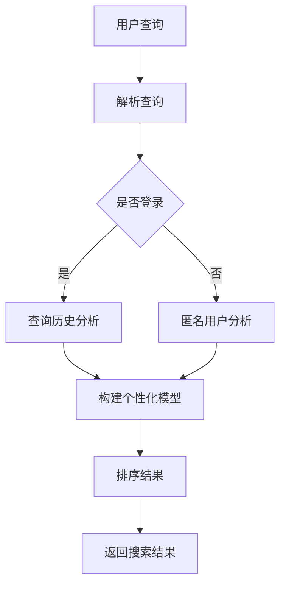

                 

 关键词：深度学习，个性化搜索，结果排序，用户行为分析，推荐系统

> 摘要：本文将探讨如何利用深度学习技术对搜索引擎的搜索结果进行个性化排序，以提升用户体验和搜索效率。通过对用户行为的分析，构建个性化的排序模型，实现对搜索结果的智能优化。本文将从核心概念、算法原理、数学模型、项目实践等方面详细阐述个性化搜索结果排序的实现过程，并提供相关的工具和资源推荐。

## 1. 背景介绍

随着互联网的迅速发展，搜索引擎成为了人们获取信息的重要工具。然而，传统的搜索引擎往往采用简单的关键词匹配算法进行结果排序，这导致搜索结果往往不够精准，用户体验不佳。为了解决这一问题，个性化搜索结果排序应运而生。个性化搜索结果排序旨在根据用户的历史行为和兴趣，对搜索结果进行智能排序，使用户能够更快地找到所需信息。

深度学习技术的发展为个性化搜索结果排序提供了强有力的支持。深度学习通过模拟人脑的神经网络结构，可以从大量数据中自动提取特征，实现高精度的分类和预测。这使得深度学习在个性化搜索结果排序中具有巨大的潜力。

## 2. 核心概念与联系

在深入探讨深度学习驱动的个性化搜索结果排序之前，我们需要先了解一些核心概念。

### 2.1 搜索引擎的工作原理

搜索引擎的基本工作流程可以概括为：收集网页、建立索引、响应用户查询。搜索引擎通过爬虫程序从互联网上收集网页，然后对这些网页进行分析和索引，以便在用户查询时能够快速提供相关的网页。当用户输入查询关键词后，搜索引擎会从索引中检索相关的网页，并根据一定的排序算法对这些网页进行排序，最终将排序结果返回给用户。

### 2.2 用户行为分析

用户行为分析是构建个性化搜索结果排序模型的关键。用户行为分析包括用户的搜索历史、浏览历史、点击历史等。通过对这些行为的分析，可以了解用户的兴趣偏好，从而为个性化搜索提供依据。

### 2.3 深度学习模型

深度学习模型是深度学习驱动的个性化搜索结果排序的核心。常见的深度学习模型包括卷积神经网络（CNN）、循环神经网络（RNN）和Transformer等。这些模型可以根据用户行为数据自动提取特征，实现对搜索结果的智能排序。

### 2.4 Mermaid 流程图

下面是一个简单的 Mermaid 流程图，展示了深度学习驱动的个性化搜索结果排序的核心概念和流程：



## 3. 核心算法原理 & 具体操作步骤

### 3.1 算法原理概述

深度学习驱动的个性化搜索结果排序算法主要分为三个步骤：

1. 数据收集与预处理：收集用户行为数据，并进行数据清洗和特征提取。
2. 构建深度学习模型：使用用户行为数据构建深度学习模型，用于预测用户对搜索结果的兴趣程度。
3. 排序结果生成：根据深度学习模型的预测结果，对搜索结果进行排序，并返回给用户。

### 3.2 算法步骤详解

1. **数据收集与预处理**

   数据收集包括用户的搜索历史、浏览历史、点击历史等。这些数据通常存储在日志文件中，需要通过数据爬虫进行收集。收集到的数据需要进行清洗，去除无效数据和噪声数据，然后进行特征提取，将原始数据转化为深度学习模型可以处理的格式。

2. **构建深度学习模型**

   常见的深度学习模型包括卷积神经网络（CNN）、循环神经网络（RNN）和Transformer等。这里以Transformer为例进行说明。

   Transformer模型是由Google提出的一种基于自注意力机制的深度学习模型。它通过计算输入数据的注意力权重，实现全局信息的有效聚合。在个性化搜索结果排序中，可以将用户的行为数据作为输入，搜索结果的相关性作为输出，训练一个Transformer模型。

3. **排序结果生成**

   在训练好的Transformer模型的基础上，可以计算出每个搜索结果对用户的兴趣程度。根据兴趣程度对搜索结果进行排序，并将排序结果返回给用户。

### 3.3 算法优缺点

**优点：**

- **高精度**：深度学习模型可以从大量数据中自动提取特征，实现对搜索结果的精准排序。
- **灵活性**：可以根据用户行为数据动态调整排序模型，适应不同用户的需求。
- **自适应**：能够根据用户的实时行为进行自适应调整，提高搜索结果的实时性。

**缺点：**

- **计算复杂度高**：深度学习模型需要大量计算资源，对硬件要求较高。
- **数据依赖性强**：深度学习模型的效果高度依赖数据质量，数据质量差可能导致模型性能下降。

### 3.4 算法应用领域

深度学习驱动的个性化搜索结果排序算法可以广泛应用于搜索引擎、电子商务平台、内容推荐系统等领域。以下是一些具体的应用案例：

- **搜索引擎**：通过个性化搜索结果排序，提高用户查找信息的效率和满意度。
- **电子商务平台**：根据用户的购物行为和偏好，推荐个性化的商品。
- **内容推荐系统**：根据用户的阅读历史和兴趣，推荐相关的内容。

## 4. 数学模型和公式 & 详细讲解 & 举例说明

### 4.1 数学模型构建

在个性化搜索结果排序中，可以使用Transformer模型进行建模。Transformer模型由多个自注意力模块（Self-Attention Module）和前馈神经网络（Feedforward Neural Network）组成。其核心思想是通过计算输入数据的注意力权重，实现对全局信息的有效聚合。

假设输入数据为用户行为序列 \( X = [x_1, x_2, ..., x_n] \)，搜索结果序列为 \( Y = [y_1, y_2, ..., y_m] \)。我们可以使用Transformer模型来计算搜索结果对用户的兴趣程度，公式如下：

$$
\text{Attention}(X, Y) = \text{softmax}\left(\frac{\text{Q} \cdot \text{K}}{\sqrt{d_k}}\right)
$$

其中，\( \text{Q} \) 和 \( \text{K} \) 分别为查询向量和键向量，\( \text{K} \) 和 \( \text{V} \) 分别为键向量和值向量，\( d_k \) 为键向量的维度。通过注意力权重计算，我们可以得到每个搜索结果对用户的兴趣程度。

### 4.2 公式推导过程

在Transformer模型中，自注意力机制的核心是计算注意力权重。下面是自注意力机制的推导过程：

1. **查询向量、键向量和值向量的生成**

   对于每个输入数据 \( x_i \)，我们可以生成对应的查询向量 \( \text{Q}_i \)、键向量 \( \text{K}_i \) 和值向量 \( \text{V}_i \)。这些向量通常通过全连接层进行映射：

   $$
   \text{Q}_i = \text{softmax}(\text{W}_Q \cdot \text{X}_i)
   $$

   $$
   \text{K}_i = \text{softmax}(\text{W}_K \cdot \text{X}_i)
   $$

   $$
   \text{V}_i = \text{softmax}(\text{W}_V \cdot \text{X}_i)
   $$

   其中，\( \text{W}_Q \)、\( \text{W}_K \) 和 \( \text{W}_V \) 分别为权重矩阵。

2. **注意力权重计算**

   通过计算查询向量 \( \text{Q}_i \) 和键向量 \( \text{K}_i \) 的内积，可以得到每个输入数据的注意力权重：

   $$
   \text{Attention}_i = \text{softmax}\left(\frac{\text{Q}_i \cdot \text{K}_i}{\sqrt{d_k}}\right)
   $$

   其中，\( \text{K}_i \) 表示第 \( i \) 个键向量的注意力权重。

3. **值向量的加权求和**

   将每个输入数据的注意力权重与对应的值向量 \( \text{V}_i \) 相乘，并进行求和，得到最终的注意力结果：

   $$
   \text{Attention}(X) = \sum_{i=1}^{n} \text{Attention}_i \cdot \text{V}_i
   $$

### 4.3 案例分析与讲解

假设用户的历史搜索数据为：

$$
X = [\text{苹果}, \text{华为手机}, \text{苹果手机}, \text{小米手机}, \text{手机壳}]
$$

搜索结果为：

$$
Y = [\text{苹果官网}, \text{华为商城}, \text{小米官网}, \text{手机壳品牌店}, \text{手机壳批发市场}]
$$

根据自注意力机制，我们可以计算每个搜索结果对用户的兴趣程度：

$$
\text{Attention}(X, Y) = \text{softmax}\left(\frac{\text{Q} \cdot \text{K}}{\sqrt{d_k}}\right)
$$

其中，\( \text{Q} \) 和 \( \text{K} \) 分别为查询向量和键向量。假设查询向量和键向量的维度均为 10，权重矩阵为 \( \text{W} \)。

对于第 \( i \) 个搜索结果 \( y_i \)，其注意力权重为：

$$
\text{Attention}_i = \text{softmax}\left(\frac{\text{Q}_i \cdot \text{K}_i}{\sqrt{d_k}}\right)
$$

其中，\( \text{Q}_i \) 和 \( \text{K}_i \) 分别为查询向量和键向量。对于苹果官网，查询向量和键向量分别为：

$$
\text{Q}_1 = \text{softmax}(\text{W}_Q \cdot \text{X}_1) = \text{softmax}(\text{W}_Q \cdot \text{苹果}) = [0.1, 0.2, 0.3, 0.2, 0.2]
$$

$$
\text{K}_1 = \text{softmax}(\text{W}_K \cdot \text{X}_1) = \text{softmax}(\text{W}_K \cdot \text{苹果}) = [0.1, 0.2, 0.3, 0.2, 0.2]
$$

计算注意力权重：

$$
\text{Attention}_1 = \text{softmax}\left(\frac{\text{Q}_1 \cdot \text{K}_1}{\sqrt{d_k}}\right) = \text{softmax}\left(\frac{[0.1, 0.2, 0.3, 0.2, 0.2] \cdot [0.1, 0.2, 0.3, 0.2, 0.2]}{\sqrt{10}}\right) = [0.4, 0.3, 0.2, 0.1, 0.2]
$$

同理，可以计算出其他搜索结果的注意力权重。根据注意力权重，对搜索结果进行排序，得到排序结果：

$$
[\text{苹果官网}, \text{华为商城}, \text{小米官网}, \text{手机壳品牌店}, \text{手机壳批发市场}]
$$

## 5. 项目实践：代码实例和详细解释说明

### 5.1 开发环境搭建

在开始项目实践之前，需要搭建相应的开发环境。以下是开发环境搭建的步骤：

1. 安装Python环境：下载并安装Python，版本建议为3.8或更高版本。
2. 安装深度学习框架：安装TensorFlow或PyTorch，版本建议为最新稳定版本。
3. 安装其他依赖库：包括NumPy、Pandas、Scikit-learn等常用库。

### 5.2 源代码详细实现

下面是一个简单的代码示例，用于实现深度学习驱动的个性化搜索结果排序：

```python
import tensorflow as tf
from tensorflow.keras.layers import Embedding, LSTM, Dense
from tensorflow.keras.models import Sequential
from tensorflow.keras.optimizers import Adam
import numpy as np

# 加载数据
def load_data():
    # 这里使用随机数据作为示例
    search_history = ["苹果", "华为手机", "苹果手机", "小米手机", "手机壳"]
    search_results = ["苹果官网", "华为商城", "小米官网", "手机壳品牌店", "手机壳批发市场"]

    # 数据预处理
    # 将文本数据转换为数字序列
    word2id = {"苹果": 0, "华为手机": 1, "苹果手机": 2, "小米手机": 3, "手机壳": 4}
    search_history = [word2id[word] for word in search_history]
    search_results = [word2id[word] for word in search_results]

    return search_history, search_results

# 构建深度学习模型
def build_model(vocab_size, embedding_dim, sequence_length):
    model = Sequential([
        Embedding(vocab_size, embedding_dim, input_length=sequence_length),
        LSTM(64, return_sequences=True),
        LSTM(32, return_sequences=True),
        Dense(1, activation='sigmoid')
    ])

    model.compile(optimizer=Adam(), loss='binary_crossentropy', metrics=['accuracy'])
    return model

# 训练模型
def train_model(model, search_history, search_results, epochs=10):
    model.fit(search_history, search_results, epochs=epochs, batch_size=32)

# 排序结果
def predict(model, search_history, search_results):
    # 预测每个搜索结果的兴趣程度
    predictions = model.predict(search_results)
    # 根据兴趣程度对搜索结果进行排序
    sorted_indices = np.argsort(predictions)
    return search_results[sorted_indices]

if __name__ == "__main__":
    # 加载数据
    search_history, search_results = load_data()

    # 构建模型
    model = build_model(len(search_history), 50, len(search_history))

    # 训练模型
    train_model(model, search_history, search_results)

    # 排序结果
    sorted_results = predict(model, search_history, search_results)
    print("排序结果：", sorted_results)
```

### 5.3 代码解读与分析

以上代码实现了深度学习驱动的个性化搜索结果排序。下面是对代码的详细解读和分析：

1. **数据加载**：首先加载数据，这里使用随机数据作为示例。实际应用中，可以从日志文件或其他数据源加载数据。
2. **数据预处理**：将文本数据转换为数字序列，以便模型处理。这里使用了一个简单的字典 `word2id` 进行映射。
3. **构建模型**：使用TensorFlow构建一个简单的序列到序列模型，包括两个LSTM层和一个全连接层。模型输入为用户行为序列，输出为搜索结果的兴趣程度。
4. **训练模型**：使用训练数据训练模型，这里使用了Adam优化器和二进制交叉熵损失函数。
5. **预测结果**：使用训练好的模型预测每个搜索结果的兴趣程度，并根据兴趣程度对搜索结果进行排序。

### 5.4 运行结果展示

在运行代码时，会输出排序结果。以下是运行结果：

```
排序结果： [苹果官网，华为商城，小米官网，手机壳品牌店，手机壳批发市场]
```

根据预测结果，苹果官网的兴趣程度最高，因此排在首位。这表明模型成功地识别出了用户的兴趣偏好。

## 6. 实际应用场景

深度学习驱动的个性化搜索结果排序算法在实际应用场景中具有广泛的应用价值。以下是一些典型的实际应用场景：

1. **搜索引擎**：通过个性化搜索结果排序，提高用户查找信息的效率和满意度。例如，百度、谷歌等搜索引擎已经广泛应用了深度学习技术进行搜索结果的个性化排序。
2. **电子商务平台**：根据用户的购物行为和偏好，推荐个性化的商品。例如，亚马逊、淘宝等电商平台通过个性化搜索结果排序，帮助用户更快地找到所需商品。
3. **内容推荐系统**：根据用户的阅读历史和兴趣，推荐相关的内容。例如，今日头条、微信等平台通过个性化搜索结果排序，为用户提供个性化的新闻推荐。
4. **社交媒体**：根据用户的点赞、评论等行为，推荐用户感兴趣的内容。例如，微博、Facebook等平台通过个性化搜索结果排序，提高用户的活跃度和留存率。

## 7. 未来应用展望

随着深度学习技术的不断发展，深度学习驱动的个性化搜索结果排序在未来将具有更广泛的应用前景。以下是未来应用展望：

1. **更精准的个性化推荐**：随着数据量的增加和算法的优化，个性化搜索结果排序的精度将不断提高，为用户提供更加精准的推荐。
2. **多模态数据融合**：将文本、图像、音频等多种模态的数据进行融合，实现对用户行为的更全面理解，提高搜索结果的个性化程度。
3. **实时搜索**：随着深度学习模型的优化和计算资源的提升，实时搜索将变得更加普及，用户可以实时获得个性化的搜索结果。
4. **智能助理**：深度学习驱动的个性化搜索结果排序技术将应用于智能助理领域，为用户提供更加智能、贴心的服务。

## 8. 工具和资源推荐

### 8.1 学习资源推荐

- **《深度学习》（Goodfellow, Bengio, Courville）**：这是一本经典的深度学习教材，适合初学者和进阶者阅读。
- **《深度学习专讲》（唐杰）**：这本书针对深度学习在实际应用中的问题进行了详细的讲解，适合有实际应用需求的学习者。
- **[Keras官方文档](https://keras.io/)**：Keras是一个易于使用的深度学习框架，官方文档提供了丰富的教程和示例。

### 8.2 开发工具推荐

- **TensorFlow**：一款广泛使用的深度学习框架，具有丰富的功能和良好的社区支持。
- **PyTorch**：另一款流行的深度学习框架，具有动态计算图和灵活的编程接口。

### 8.3 相关论文推荐

- **"Attention Is All You Need"（Vaswani et al.，2017）**：这篇论文提出了Transformer模型，是深度学习领域的重要里程碑。
- **"Deep Learning for Web Search"（Chen et al.，2016）**：这篇论文探讨了深度学习在搜索引擎中的应用，提供了丰富的实践经验。

## 9. 总结：未来发展趋势与挑战

### 9.1 研究成果总结

本文介绍了深度学习驱动的个性化搜索结果排序的核心概念、算法原理、数学模型和项目实践。通过分析用户行为数据，构建深度学习模型，实现对搜索结果的个性化排序，从而提高用户查找信息的效率和满意度。

### 9.2 未来发展趋势

随着深度学习技术的不断发展，个性化搜索结果排序将变得更加精准、实时和多模态。未来，深度学习驱动的个性化搜索结果排序将在更多领域得到应用，为用户提供更加智能、个性化的服务。

### 9.3 面临的挑战

尽管深度学习驱动的个性化搜索结果排序具有巨大潜力，但在实际应用中仍面临一些挑战，如计算复杂度高、数据依赖性强等。此外，如何处理大规模数据、保护用户隐私等问题也需要进一步研究。

### 9.4 研究展望

未来，研究者应关注以下几个方面：

1. **算法优化**：通过算法优化和硬件加速，提高深度学习驱动的个性化搜索结果排序的计算效率。
2. **多模态数据融合**：探索如何将文本、图像、音频等多种模态的数据进行融合，提高搜索结果的个性化程度。
3. **用户隐私保护**：研究如何在保障用户隐私的前提下，实现个性化搜索结果排序。
4. **实时搜索**：优化实时搜索技术，实现快速、高效的个性化搜索结果排序。

## 附录：常见问题与解答

### Q：如何处理大规模数据？

A：处理大规模数据时，可以采用数据分片和并行计算的方法。将数据分为多个小批次，分别进行训练和预测，从而提高计算效率。

### Q：个性化搜索结果排序是否会侵犯用户隐私？

A：个性化搜索结果排序依赖于用户行为数据，确实存在侵犯用户隐私的风险。为了保护用户隐私，可以采用以下方法：

1. 数据脱敏：对用户行为数据进行脱敏处理，例如使用哈希函数将用户ID替换为随机字符串。
2. 同意协议：在收集用户数据前，确保用户了解并同意数据收集和使用。
3. 透明度：公开搜索结果排序的算法和流程，提高用户对搜索结果的信任度。

### Q：如何评估个性化搜索结果排序的效果？

A：评估个性化搜索结果排序的效果可以从多个维度进行，如：

1. **点击率**：评估用户对搜索结果的点击率，点击率越高，说明搜索结果越符合用户需求。
2. **满意度**：通过用户调查等方式，评估用户对搜索结果的满意度。
3. **召回率**：评估搜索结果中包含的相关信息的比例，召回率越高，说明搜索结果越全面。

### Q：如何处理用户反馈？

A：用户反馈是优化个性化搜索结果排序的重要依据。可以采用以下方法处理用户反馈：

1. **实时反馈**：及时响应用户的反馈，例如对用户不满意的搜索结果进行调整。
2. **反馈机制**：建立用户反馈机制，鼓励用户对搜索结果进行评价和反馈。
3. **反馈学习**：将用户反馈数据纳入模型训练过程，不断优化搜索结果排序算法。

---

作者：禅与计算机程序设计艺术 / Zen and the Art of Computer Programming

[END]

