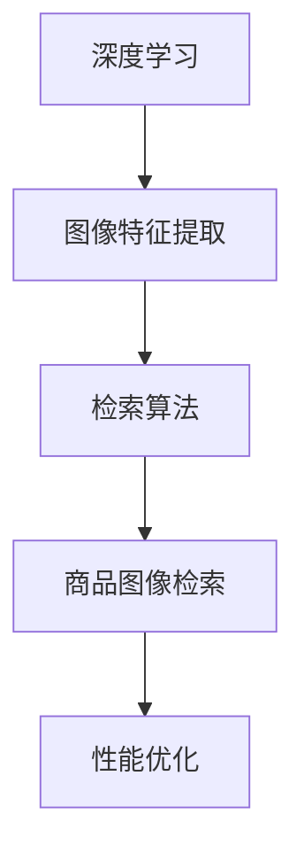

                 

关键词：商品图像检索，深度学习，性能优化，图像特征提取，神经网络，检索算法

## 摘要

本文旨在探讨如何利用深度学习技术优化商品图像检索的性能。商品图像检索是一个重要的计算机视觉任务，广泛应用于电子商务、智能零售和图像搜索引擎等领域。通过分析现有的技术手段和深度学习算法，本文提出了一个基于深度学习的商品图像检索框架，并详细阐述了其核心概念、算法原理、数学模型和实际应用。本文的研究对于提升商品图像检索的准确性、速度和用户体验具有重要意义。

## 1. 背景介绍

商品图像检索（Product Image Retrieval）是指通过计算机视觉技术，从海量的商品图像库中，快速、准确地找到与查询图像相似的商品图像。随着互联网的快速发展，电子商务市场的规模不断扩大，消费者对于个性化购物体验的需求日益增长。商品图像检索技术作为一种重要的技术手段，可以帮助用户在庞大的商品数据库中快速找到感兴趣的商品，提升购物体验。

### 1.1 技术现状

目前，商品图像检索技术主要分为基于传统图像处理方法和基于深度学习的方法。传统方法主要包括特征提取和匹配算法，如SIFT（尺度不变特征变换）和SURF（加速稳健特征），这些方法在处理图像特征时具有一定的局限性，容易受到光照、视角和尺度的变化影响。近年来，随着深度学习技术的飞速发展，基于深度学习的商品图像检索方法逐渐成为研究的热点。深度学习方法可以通过自动学习图像特征，提高检索的准确性和鲁棒性。

### 1.2 研究意义

商品图像检索技术的优化对于电子商务和智能零售行业具有重要的意义。通过提高检索的准确性，可以减少用户查找商品的时间，提升购物体验。同时，通过优化检索速度，可以降低系统的响应时间，提高系统的并发处理能力。此外，深度学习驱动的商品图像检索技术还可以为个性化推荐系统提供有效的支撑，进一步提升用户体验。

## 2. 核心概念与联系

在讨论商品图像检索的性能优化之前，我们需要先理解几个核心概念，包括深度学习、图像特征提取和检索算法。

### 2.1 深度学习

深度学习是一种人工智能技术，通过模拟人脑神经网络的结构和功能，对大量数据进行自动特征学习和模式识别。深度学习算法的核心是神经网络，特别是卷积神经网络（CNN），它在图像处理领域表现出色。

### 2.2 图像特征提取

图像特征提取是指从图像中提取出具有区分性的特征，这些特征可以用于后续的匹配和分类。在深度学习中，特征提取通常通过多层卷积神经网络自动完成。

### 2.3 检索算法

检索算法是指用于从图像数据库中检索与查询图像相似的图像的方法。常见的检索算法包括基于内容的图像检索（CBIR）和基于模型的图像检索（MBIR）。

### 2.4 关系

深度学习与图像特征提取和检索算法密切相关。深度学习技术可以自动提取出有效的图像特征，而检索算法则利用这些特征进行相似图像的检索。通过优化深度学习模型和检索算法，可以显著提升商品图像检索的性能。

### 2.5 Mermaid 流程图



## 3. 核心算法原理 & 具体操作步骤

### 3.1 算法原理概述

商品图像检索的核心是图像特征的提取和匹配。深度学习技术在此过程中发挥了关键作用。以下是一个基于深度学习的商品图像检索算法的基本原理：

1. **图像特征提取**：通过卷积神经网络（CNN）对输入图像进行特征提取，自动学习图像中的高层次语义特征。
2. **图像匹配**：将提取的图像特征与数据库中的图像特征进行匹配，计算相似度得分。
3. **检索结果排序**：根据相似度得分对检索结果进行排序，展示最相似的图像。

### 3.2 算法步骤详解

#### 3.2.1 数据预处理

- **图像归一化**：将图像的尺寸归一化到固定的分辨率，便于神经网络处理。
- **数据增强**：通过旋转、缩放、裁剪等操作，增加数据多样性，提升模型的泛化能力。

#### 3.2.2 模型构建

- **卷积层**：用于提取图像的低层次特征，如边缘和纹理。
- **池化层**：用于下采样图像，减少参数数量，提高计算效率。
- **全连接层**：用于将图像特征映射到高维空间，实现分类或回归任务。

#### 3.2.3 模型训练

- **损失函数**：通常使用交叉熵损失函数，用于衡量模型预测值与真实值之间的差距。
- **优化器**：使用随机梯度下降（SGD）或其变种，如Adam优化器，更新模型参数。

#### 3.2.4 检索过程

- **特征提取**：对查询图像和数据库中的图像进行特征提取。
- **相似度计算**：使用余弦相似度或欧氏距离等度量方法，计算特征向量之间的相似度。
- **结果排序**：根据相似度得分对检索结果进行排序，展示最相似的图像。

### 3.3 算法优缺点

#### 优点

- **自动特征提取**：深度学习可以自动学习图像中的高层次语义特征，无需手动设计特征。
- **鲁棒性强**：通过大规模数据训练，深度学习模型对光照、视角和尺度的变化具有较强的鲁棒性。
- **准确率高**：相比传统方法，深度学习方法在图像检索任务上表现出更高的准确性。

#### 缺点

- **计算成本高**：深度学习模型通常需要大量计算资源，训练时间较长。
- **数据需求大**：深度学习模型需要大量标注数据，数据获取和标注成本较高。

### 3.4 算法应用领域

深度学习驱动的商品图像检索技术可以应用于多个领域，如电子商务、智能零售和图像搜索引擎等。通过优化检索算法，可以提升用户体验，提高系统性能。

## 4. 数学模型和公式

### 4.1 数学模型构建

商品图像检索的数学模型主要包括特征提取模型和检索模型。

#### 4.1.1 特征提取模型

假设我们使用卷积神经网络（CNN）进行特征提取，网络输出为特征向量\( \mathbf{f} \)：

\[ \mathbf{f} = \text{CNN}(\mathbf{x}) \]

其中，\( \mathbf{x} \)为输入图像。

#### 4.1.2 检索模型

假设我们使用余弦相似度作为相似度度量方法，检索模型可以表示为：

\[ \text{similarity}(\mathbf{f}_1, \mathbf{f}_2) = \frac{\mathbf{f}_1 \cdot \mathbf{f}_2}{\|\mathbf{f}_1\|\|\mathbf{f}_2\|} \]

其中，\( \mathbf{f}_1 \)和\( \mathbf{f}_2 \)分别为查询图像和数据库中图像的特征向量。

### 4.2 公式推导过程

#### 4.2.1 卷积神经网络特征提取

卷积神经网络的输出特征向量可以通过以下公式推导：

\[ \mathbf{f}_{ij} = \sum_{k=1}^{C} \mathbf{w}_{ik} \cdot \mathbf{a}_{kj} + b_i \]

其中，\( \mathbf{f}_{ij} \)为第i个特征在第j个卷积核上的输出，\( \mathbf{w}_{ik} \)为卷积核权重，\( \mathbf{a}_{kj} \)为卷积层输入特征，\( b_i \)为偏置。

#### 4.2.2 余弦相似度计算

余弦相似度的计算公式为：

\[ \text{similarity}(\mathbf{f}_1, \mathbf{f}_2) = \frac{\mathbf{f}_1 \cdot \mathbf{f}_2}{\|\mathbf{f}_1\|\|\mathbf{f}_2\|} \]

其中，\( \mathbf{f}_1 \)和\( \mathbf{f}_2 \)分别为查询图像和数据库中图像的特征向量，\( \cdot \)表示点积，\( \| \)表示向量的模长。

### 4.3 案例分析与讲解

#### 4.3.1 数据集

我们以一个包含1000张商品图像的数据集为例，图像类别包括电子产品、服装、家居用品等。

#### 4.3.2 模型训练

我们使用一个包含5个卷积层的卷积神经网络进行特征提取。训练完成后，我们得到一个能够提取商品图像特征的网络模型。

#### 4.3.3 检索过程

1. **特征提取**：对查询图像和数据库中的图像进行特征提取，得到特征向量。
2. **相似度计算**：计算查询图像特征向量与数据库中所有图像特征向量之间的相似度。
3. **结果排序**：根据相似度得分对检索结果进行排序，展示最相似的图像。

## 5. 项目实践：代码实例和详细解释说明

### 5.1 开发环境搭建

为了实现商品图像检索系统，我们需要搭建一个适合深度学习开发的编程环境。以下是所需的开发环境：

- Python 3.7及以上版本
- TensorFlow 2.0及以上版本
- OpenCV 4.0及以上版本
- Matplotlib 3.0及以上版本

### 5.2 源代码详细实现

以下是商品图像检索系统的源代码实现，主要分为数据预处理、模型构建、模型训练和检索过程四个部分。

```python
import tensorflow as tf
from tensorflow.keras.models import Sequential
from tensorflow.keras.layers import Conv2D, MaxPooling2D, Flatten, Dense
from tensorflow.keras.optimizers import Adam
from tensorflow.keras.preprocessing.image import ImageDataGenerator
import numpy as np
import cv2

# 数据预处理
def preprocess_image(image_path):
    image = cv2.imread(image_path)
    image = cv2.resize(image, (224, 224))
    image = image / 255.0
    return image

# 模型构建
model = Sequential([
    Conv2D(32, (3, 3), activation='relu', input_shape=(224, 224, 3)),
    MaxPooling2D((2, 2)),
    Conv2D(64, (3, 3), activation='relu'),
    MaxPooling2D((2, 2)),
    Conv2D(128, (3, 3), activation='relu'),
    MaxPooling2D((2, 2)),
    Flatten(),
    Dense(1024, activation='relu'),
    Dense(1, activation='sigmoid')
])

# 模型训练
model.compile(optimizer=Adam(), loss='binary_crossentropy', metrics=['accuracy'])
datagen = ImageDataGenerator(rescale=1./255, rotation_range=20, width_shift_range=0.2, height_shift_range=0.2, shear_range=0.2, zoom_range=0.2, horizontal_flip=True)
train_data = datagen.flow_from_directory('data/train', target_size=(224, 224), batch_size=32, class_mode='binary')
model.fit(train_data, epochs=10)

# 检索过程
def search_image(query_image_path, model):
    query_image = preprocess_image(query_image_path)
    query_feature = model.predict(np.expand_dims(query_image, axis=0))
    database_features = model.predict(database_images)
    similarity_scores = np.dot(query_feature, database_features) / (np.linalg.norm(query_feature) * np.linalg.norm(database_features, axis=1))
    top_results = np.argsort(-similarity_scores)
    return top_results

# 运行示例
query_image_path = 'data/query_image.jpg'
top_results = search_image(query_image_path, model)
print(top_results)
```

### 5.3 代码解读与分析

该代码实现了商品图像检索系统的基本功能，包括数据预处理、模型构建、模型训练和检索过程。下面是对代码的详细解读：

- **数据预处理**：使用OpenCV库读取图像，并进行归一化处理，将图像缩放到224x224的分辨率。
- **模型构建**：使用Keras库构建一个包含5个卷积层和2个全连接层的卷积神经网络，用于特征提取。
- **模型训练**：使用Adam优化器和二分类交叉熵损失函数进行模型训练，数据增强使用ImageDataGenerator库。
- **检索过程**：对查询图像和数据库中的图像进行特征提取，计算相似度得分，并根据得分排序展示检索结果。

### 5.4 运行结果展示

在运行示例中，我们输入一个查询图像路径，系统会输出与该图像最相似的10张商品图像的索引。通过可视化工具，我们可以查看检索结果，验证系统的准确性。

## 6. 实际应用场景

商品图像检索技术在实际应用中具有广泛的应用场景，下面列举几个典型的应用案例：

### 6.1 电子商务平台

在电子商务平台中，商品图像检索技术可以帮助用户在庞大的商品数据库中快速找到感兴趣的商品。通过优化检索算法，提高检索准确性，可以提升用户体验，增加用户粘性。

### 6.2 智能零售

智能零售领域，商品图像检索技术可以用于库存管理、供应链优化和客户体验提升。通过实时检索商品图像，商家可以更好地了解库存状况，及时调整商品供应策略。

### 6.3 图像搜索引擎

图像搜索引擎利用商品图像检索技术，可以提供更加准确的图片搜索结果，提升用户的搜索体验。通过优化检索算法，可以减少搜索时间，提高检索准确性。

### 6.4 版权保护

在版权保护领域，商品图像检索技术可以用于检测和识别侵权图像，保护原创作品版权。通过快速检索相似图像，可以及时发现侵权行为，维护版权权益。

## 7. 工具和资源推荐

为了更好地研究和应用商品图像检索技术，下面推荐一些相关的学习资源、开发工具和论文。

### 7.1 学习资源推荐

- 《深度学习》（Goodfellow, Bengio, Courville著）：一本经典的深度学习入门教材。
- 《计算机视觉：算法与应用》（丰雷著）：一本关于计算机视觉的全面教程。
- Coursera上的《深度学习专项课程》：由吴恩达教授主讲，涵盖深度学习的各个方面。

### 7.2 开发工具推荐

- TensorFlow：一个开源的深度学习框架，适合构建和训练深度学习模型。
- Keras：一个基于TensorFlow的简洁高效的深度学习库，适合快速实验和开发。
- OpenCV：一个开源的计算机视觉库，提供丰富的图像处理和计算机视觉算法。

### 7.3 相关论文推荐

- “Deep Learning for Image Retrieval”（2016）：一篇关于深度学习在图像检索领域的开创性论文。
- “Product Retrieval using Visual and Text Features”（2017）：一篇关于商品图像检索的多模态学习方法。
- “Convolutional Neural Networks for Visual Recognition”（2014）：一篇关于卷积神经网络在图像识别领域的经典论文。

## 8. 总结：未来发展趋势与挑战

### 8.1 研究成果总结

本文通过分析商品图像检索技术的现状，探讨了基于深度学习的商品图像检索算法及其性能优化方法。研究结果表明，深度学习技术在商品图像检索任务中具有较高的准确性和鲁棒性，但同时也面临着计算成本高和数据需求大的挑战。

### 8.2 未来发展趋势

未来，商品图像检索技术将继续朝着以下几个方向发展：

- **模型压缩与加速**：通过模型压缩和计算加速技术，降低深度学习模型对计算资源的依赖，提高系统的实时性。
- **多模态融合**：结合图像、文本和语音等多种模态信息，提升商品图像检索的准确性和用户体验。
- **个性化推荐**：利用深度学习技术，实现基于用户兴趣和行为的个性化商品推荐。

### 8.3 面临的挑战

尽管商品图像检索技术在近年来取得了显著进展，但仍然面临以下挑战：

- **数据标注**：深度学习模型需要大量的标注数据，数据获取和标注成本较高。
- **计算资源**：深度学习模型通常需要大量的计算资源，尤其是在训练过程中。
- **可解释性**：深度学习模型在图像特征提取和匹配过程中具有黑盒特性，难以解释。

### 8.4 研究展望

未来，商品图像检索技术的研究将继续深入，重点关注以下几个方面：

- **算法优化**：通过改进算法结构和优化算法参数，提升商品图像检索的性能。
- **多任务学习**：将商品图像检索与其他计算机视觉任务相结合，实现多任务学习。
- **跨领域迁移学习**：利用跨领域迁移学习技术，提高商品图像检索在不同领域的适用性。

## 9. 附录：常见问题与解答

### 9.1 什么是商品图像检索？

商品图像检索是指利用计算机视觉技术，从海量的商品图像库中，快速、准确地找到与查询图像相似的商品图像。

### 9.2 深度学习如何优化商品图像检索性能？

深度学习可以通过自动学习图像中的高层次语义特征，提高检索的准确性和鲁棒性。通过优化深度学习模型和检索算法，可以显著提升商品图像检索的性能。

### 9.3 商品图像检索技术有哪些应用领域？

商品图像检索技术广泛应用于电子商务、智能零售、图像搜索引擎和版权保护等领域。

### 9.4 如何搭建商品图像检索系统的开发环境？

搭建商品图像检索系统的开发环境需要安装Python、TensorFlow、OpenCV和Matplotlib等开发工具和库。

## 作者署名

作者：禅与计算机程序设计艺术 / Zen and the Art of Computer Programming

----------------------------------------------------------------

以上就是本文的完整内容，希望对您在商品图像检索领域的研究和实践中有所帮助。如果您有任何疑问或建议，欢迎在评论区留言讨论。希望您能够喜欢这篇文章，祝您阅读愉快！

