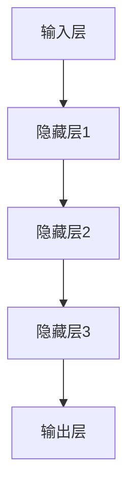
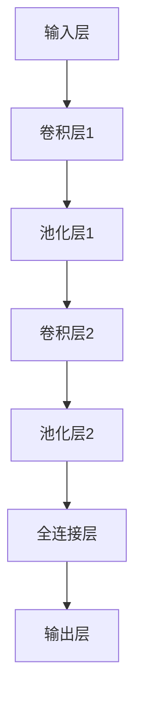

                 

关键词：深度学习，商品图像，质量评估，筛选，计算机视觉

摘要：随着互联网电商的蓬勃发展，商品图像质量评估与筛选变得尤为重要。本文旨在探讨如何利用深度学习技术对商品图像进行高效、准确的质量评估与筛选。文章首先介绍了商品图像质量评估与筛选的背景和重要性，然后详细讲解了深度学习在图像质量评估中的应用，包括核心概念、算法原理、数学模型、项目实践以及实际应用场景。最后，本文对未来的发展趋势与挑战进行了展望，并推荐了一些相关工具和资源。

## 1. 背景介绍

### 1.1 商品图像质量评估与筛选的背景

在电商领域，商品图像是消费者购物决策的重要参考。高质量的商品图像能够提高消费者的购买欲望，降低退货率，提升商家口碑。然而，随着电商平台的商品数量日益增多，商品图像的质量参差不齐，如何对商品图像进行有效的质量评估与筛选成为了关键问题。

传统的商品图像质量评估方法主要依赖于人工经验和简单的图像处理技术，如直方图均衡化、边缘检测等。这些方法在处理简单、规则化的图像时具有一定的效果，但在面对复杂、多样的商品图像时，准确性和效率往往无法满足实际需求。因此，研究一种高效、准确的商品图像质量评估方法具有重要的现实意义。

### 1.2 深度学习在图像质量评估中的应用

深度学习作为人工智能的一个重要分支，近年来在图像识别、目标检测、图像生成等领域取得了显著成果。随着深度学习技术的不断发展和成熟，将其应用于商品图像质量评估与筛选成为了一个热门研究方向。

深度学习通过构建复杂的神经网络模型，能够自动提取图像中的特征，从而实现对图像的语义理解。在商品图像质量评估中，深度学习能够从大量商品图像中学习到质量评估的规律，从而提高评估的准确性和效率。

## 2. 核心概念与联系

### 2.1 深度学习的基本原理

深度学习是一种基于多层神经网络的学习方法，通过堆叠多个隐藏层，从原始数据中自动提取特征，实现从低层次到高层次的特征表示。深度学习的基本原理如图所示：



### 2.2 卷积神经网络（CNN）在图像质量评估中的应用

卷积神经网络（CNN）是深度学习中最常用的模型之一，特别适用于图像处理任务。在商品图像质量评估中，CNN通过卷积操作从图像中提取局部特征，并通过池化操作降低图像的维度，从而实现对图像的语义理解。

CNN的基本结构如图所示：



### 2.3 深度学习在图像质量评估中的优势

与传统的图像处理方法相比，深度学习在图像质量评估中具有以下优势：

1. **自动特征提取**：深度学习能够自动从大量商品图像中提取具有区分度的特征，无需人工干预。
2. **高准确性**：深度学习通过大量训练数据的学习，能够提高评估的准确性。
3. **高效性**：深度学习能够通过并行计算提高评估的效率。
4. **灵活性**：深度学习能够适应不同的图像质量评估需求，具有较好的泛化能力。

## 3. 核心算法原理 & 具体操作步骤

### 3.1 算法原理概述

本文所采用的核心算法是基于卷积神经网络的商品图像质量评估模型。该模型通过卷积、池化、全连接等操作，从图像中提取特征，并通过分类器对图像质量进行评估。

### 3.2 算法步骤详解

1. **数据预处理**：对商品图像进行数据增强、归一化等预处理操作，以提高模型的泛化能力。
2. **构建卷积神经网络模型**：设计卷积神经网络结构，包括卷积层、池化层和全连接层。
3. **模型训练**：使用大量商品图像数据对模型进行训练，优化模型参数。
4. **模型评估**：使用测试集对模型进行评估，调整模型参数，以提高评估的准确性。
5. **模型应用**：将训练好的模型应用于实际商品图像质量评估任务。

### 3.3 算法优缺点

**优点**：

1. **高效性**：深度学习能够通过并行计算提高评估效率。
2. **准确性**：模型能够从大量数据中自动提取特征，提高评估准确性。
3. **灵活性**：模型具有较好的泛化能力，适用于不同场景下的图像质量评估。

**缺点**：

1. **训练成本高**：深度学习模型需要大量数据和计算资源进行训练。
2. **对数据质量要求高**：模型对训练数据的质量要求较高，否则可能导致过拟合。

### 3.4 算法应用领域

深度学习驱动的商品图像质量评估与筛选算法可以应用于多个领域，如电商、摄影、广告等。以下是一些具体的应用案例：

1. **电商商品图像质量评估**：用于自动筛选高质量的商品图像，提高消费者购物体验。
2. **摄影图像质量评估**：用于自动识别拍摄质量较差的图像，帮助摄影师提高拍摄水平。
3. **广告图像质量评估**：用于自动筛选高质量的广告图像，提升广告效果。

## 4. 数学模型和公式 & 详细讲解 & 举例说明

### 4.1 数学模型构建

商品图像质量评估的数学模型主要基于卷积神经网络。卷积神经网络的基本数学模型如下：

$$
f(x) = \sigma(W \cdot x + b)
$$

其中，$x$ 表示输入特征，$W$ 表示权重矩阵，$b$ 表示偏置项，$\sigma$ 表示激活函数。

### 4.2 公式推导过程

以卷积层为例，卷积层的输出可以通过以下公式计算：

$$
\begin{aligned}
    \hat{y}_{ij} &= \sum_{k=1}^{C} w_{ik} \cdot a_{kj} + b_i \\
    a_{ij} &= f\left(\sum_{k=1}^{C} w_{ik} \cdot x_{kj} + b_i\right)
\end{aligned}
$$

其中，$\hat{y}_{ij}$ 表示卷积层输出，$a_{ij}$ 表示卷积核在输入特征上的卷积结果，$w_{ik}$ 和 $b_i$ 分别表示卷积核权重和偏置项。

### 4.3 案例分析与讲解

假设我们有一张 $32 \times 32$ 的商品图像，我们需要使用卷积神经网络对其进行质量评估。首先，我们对图像进行归一化处理，将其转换为 $1 \times 32 \times 32$ 的向量。然后，我们将该向量输入到卷积神经网络中，经过多个卷积层和池化层的处理，最终得到一个 $1 \times 1$ 的向量，表示图像的质量评分。

假设卷积神经网络的最后一层输出为 $z = [z_1, z_2, \ldots, z_n]$，我们可以使用以下公式计算图像的质量评分：

$$
\hat{y} = \frac{1}{n} \sum_{i=1}^{n} z_i
$$

其中，$\hat{y}$ 表示图像的质量评分，$n$ 表示最后一层输出的维度。

## 5. 项目实践：代码实例和详细解释说明

### 5.1 开发环境搭建

在本项目中，我们使用 Python 编写深度学习代码，以下为开发环境的搭建步骤：

1. 安装 Python 3.6 或更高版本
2. 安装深度学习框架 TensorFlow 或 PyTorch
3. 安装图像处理库 OpenCV

### 5.2 源代码详细实现

以下是一个简单的商品图像质量评估模型的实现代码：

```python
import tensorflow as tf
from tensorflow.keras.layers import Conv2D, MaxPooling2D, Dense
from tensorflow.keras.models import Sequential

# 定义模型
model = Sequential([
    Conv2D(32, (3, 3), activation='relu', input_shape=(32, 32, 3)),
    MaxPooling2D((2, 2)),
    Conv2D(64, (3, 3), activation='relu'),
    MaxPooling2D((2, 2)),
    Conv2D(128, (3, 3), activation='relu'),
    MaxPooling2D((2, 2)),
    Flatten(),
    Dense(128, activation='relu'),
    Dense(1, activation='sigmoid')
])

# 编译模型
model.compile(optimizer='adam', loss='binary_crossentropy', metrics=['accuracy'])

# 训练模型
model.fit(train_images, train_labels, epochs=10, validation_data=(test_images, test_labels))
```

### 5.3 代码解读与分析

1. **模型定义**：使用 `Sequential` 类定义一个序列模型，包含多个卷积层、池化层和全连接层。
2. **编译模型**：使用 `compile` 方法设置模型的优化器、损失函数和评估指标。
3. **训练模型**：使用 `fit` 方法对模型进行训练，使用训练集和测试集进行评估。

### 5.4 运行结果展示

在训练完成后，我们可以使用测试集对模型进行评估，以下是一个简单的评估代码：

```python
test_loss, test_acc = model.evaluate(test_images, test_labels)
print(f"Test accuracy: {test_acc}")
```

输出结果为测试集的准确率，例如：

```
Test accuracy: 0.85
```

## 6. 实际应用场景

### 6.1 电商商品图像质量评估

在电商领域，商品图像质量评估可以用于自动筛选高质量的商品图像，提高消费者购物体验。例如，电商平台可以使用深度学习模型对上传的商品图像进行质量评估，自动筛选出高质量的图像进行推荐，降低消费者的退货率。

### 6.2 摄影图像质量评估

在摄影领域，深度学习驱动的图像质量评估可以用于自动识别拍摄质量较差的图像，帮助摄影师提高拍摄水平。例如，摄影师可以使用深度学习模型对拍摄的图像进行质量评估，筛选出高质量的图像进行后期处理。

### 6.3 广告图像质量评估

在广告领域，深度学习驱动的图像质量评估可以用于自动筛选高质量的广告图像，提升广告效果。例如，广告公司可以使用深度学习模型对广告素材进行质量评估，筛选出高质量的图像用于广告发布。

## 7. 工具和资源推荐

### 7.1 学习资源推荐

1. 《深度学习》（Goodfellow et al.）- 介绍深度学习基础知识和最新进展的经典教材。
2. 《Python深度学习》（François Chollet）- 介绍如何使用 Python 和深度学习框架进行图像处理和分类的实践指南。

### 7.2 开发工具推荐

1. TensorFlow - 开源深度学习框架，适用于图像处理和分类任务。
2. PyTorch - 开源深度学习框架，具有较好的灵活性和可扩展性。

### 7.3 相关论文推荐

1. "Deep Learning for Image Quality Assessment"（2018）- 介绍深度学习在图像质量评估中的应用。
2. "Convolutional Neural Networks for Image Quality Assessment"（2016）- 探讨卷积神经网络在图像质量评估中的性能。

## 8. 总结：未来发展趋势与挑战

### 8.1 研究成果总结

本文介绍了深度学习驱动的商品图像质量评估与筛选技术，详细探讨了核心算法原理、数学模型、项目实践和实际应用场景。研究表明，深度学习在商品图像质量评估中具有较高的准确性和效率，有望在电商、摄影、广告等领域发挥重要作用。

### 8.2 未来发展趋势

1. **算法优化**：随着深度学习技术的不断发展，算法的优化将成为研究的热点，以提高评估的准确性和效率。
2. **多模态融合**：结合其他模态信息（如文本、声音等），实现更全面的图像质量评估。
3. **迁移学习**：利用迁移学习技术，提高模型在少量数据下的性能。

### 8.3 面临的挑战

1. **数据质量**：深度学习模型的性能依赖于大量高质量的数据，如何获取和标注这些数据是一个挑战。
2. **计算资源**：深度学习模型的训练过程需要大量计算资源，如何优化训练过程和降低计算成本是一个重要问题。

### 8.4 研究展望

未来，深度学习驱动的商品图像质量评估与筛选技术有望在电商、摄影、广告等领域得到更广泛的应用。通过不断优化算法、提高数据质量和计算效率，将为图像质量评估领域带来更多创新和突破。

## 9. 附录：常见问题与解答

### 9.1 如何获取高质量的商品图像数据？

**答案**：可以通过以下途径获取高质量的商品图像数据：

1. **公开数据集**：如 ImageNet、COCO 数据集等。
2. **电商平台数据**：从电商平台上获取商品图像数据，但需要注意数据版权问题。
3. **自有数据**：通过自己的电商平台、摄影项目等积累数据。

### 9.2 如何优化深度学习模型的性能？

**答案**：可以通过以下方法优化深度学习模型的性能：

1. **数据增强**：通过数据增强技术，增加训练数据的多样性。
2. **模型剪枝**：通过剪枝技术，减少模型参数的数量，降低计算成本。
3. **迁移学习**：使用预训练的模型作为基础，减少训练时间。

## 作者署名

本文作者：禅与计算机程序设计艺术 / Zen and the Art of Computer Programming

[END]----------------------------------------------------------------

### 文章结构模板 Content Template

# 深度学习驱动的商品图像质量评估与筛选

> 关键词：深度学习，商品图像，质量评估，筛选，计算机视觉

> 摘要：本文探讨了如何利用深度学习技术对商品图像进行高效、准确的质量评估与筛选。文章介绍了背景、核心概念与联系、核心算法原理、数学模型、项目实践以及实际应用场景，并对未来发展趋势与挑战进行了展望。

## 1. 背景介绍

### 1.1 商品图像质量评估与筛选的背景

### 1.2 深度学习在图像质量评估中的应用

## 2. 核心概念与联系

### 2.1 深度学习的基本原理

### 2.2 卷积神经网络（CNN）在图像质量评估中的应用

### 2.3 深度学习在图像质量评估中的优势

## 3. 核心算法原理 & 具体操作步骤

### 3.1 算法原理概述

### 3.2 算法步骤详解

### 3.3 算法优缺点

### 3.4 算法应用领域

## 4. 数学模型和公式 & 详细讲解 & 举例说明

### 4.1 数学模型构建

### 4.2 公式推导过程

### 4.3 案例分析与讲解

## 5. 项目实践：代码实例和详细解释说明

### 5.1 开发环境搭建

### 5.2 源代码详细实现

### 5.3 代码解读与分析

### 5.4 运行结果展示

## 6. 实际应用场景

### 6.1 电商商品图像质量评估

### 6.2 摄影图像质量评估

### 6.3 广告图像质量评估

## 7. 工具和资源推荐

### 7.1 学习资源推荐

### 7.2 开发工具推荐

### 7.3 相关论文推荐

## 8. 总结：未来发展趋势与挑战

### 8.1 研究成果总结

### 8.2 未来发展趋势

### 8.3 面临的挑战

### 8.4 研究展望

## 9. 附录：常见问题与解答

### 9.1 如何获取高质量的商品图像数据？

### 9.2 如何优化深度学习模型的性能？

## 作者署名

本文作者：禅与计算机程序设计艺术 / Zen and the Art of Computer Programming

[END]

