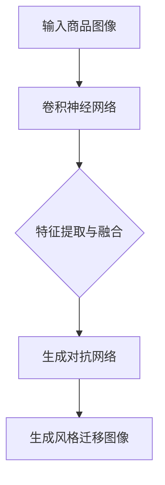

                 

 关键词：深度学习，图像风格迁移，商品图像，技术博客，计算机视觉

> 摘要：本文旨在探讨深度学习在商品图像风格迁移技术中的应用，详细阐述了该技术的核心概念、算法原理、数学模型以及项目实践，并通过具体实例分析了其在实际应用场景中的潜力与未来展望。

## 1. 背景介绍

随着计算机视觉技术的迅猛发展，图像处理与识别已成为人工智能领域的重要组成部分。在图像处理中，图像风格迁移（Image Style Transfer）作为一种将一种图像的视觉风格转移到另一种图像上的技术，受到了广泛关注。传统的图像风格迁移方法主要基于图像处理和计算机图形学技术，如基于傅立叶变换、小波变换等，但这些方法往往效果有限，且难以适应复杂的图像场景。

近年来，深度学习技术的崛起为图像风格迁移带来了新的契机。深度学习，尤其是卷积神经网络（CNN），通过学习图像的高层次特征，实现了对图像风格的准确迁移。此外，生成对抗网络（GAN）等新型深度学习架构也展示了在图像风格迁移中的潜力。

商品图像风格迁移技术在电子商务和图像编辑等领域具有广泛的应用前景。电子商务平台需要将商品图像进行风格化处理，以便更好地展示商品细节和吸引消费者。而在图像编辑领域，用户通常希望将个人照片或艺术作品进行风格化处理，以实现个性化的创意表达。

本文将围绕深度学习驱动的商品图像风格迁移技术，从核心概念、算法原理、数学模型和项目实践等方面进行深入探讨，旨在为相关领域的研究者和开发者提供有价值的参考。

## 2. 核心概念与联系

### 2.1 图像风格迁移的概念

图像风格迁移（Image Style Transfer）是一种将一种图像的视觉风格（如油画、水彩画等）转移到另一种图像上的技术。其核心目标是在保持图像内容不变的前提下，实现图像风格的改变。风格迁移技术不仅要求图像的内容结构保持一致，还要求图像的色彩、纹理、形状等视觉特征与目标风格相匹配。

### 2.2 深度学习与图像风格迁移的关系

深度学习，作为一种基于多层神经网络的学习方法，通过学习大量数据中的特征，能够实现图像的自动编码和解码。在图像风格迁移中，深度学习模型能够捕捉到图像的复杂特征，从而实现不同风格之间的转换。具体来说，卷积神经网络（CNN）和生成对抗网络（GAN）等深度学习架构在图像风格迁移中发挥了重要作用。

### 2.3 关键技术的联系

在深度学习驱动的商品图像风格迁移技术中，关键技术的联系如下：

1. **卷积神经网络（CNN）**：用于学习图像的底层特征，如边缘、纹理等，为风格迁移提供基础。
2. **特征提取与融合**：通过融合源图像和目标图像的特征，实现风格的有效迁移。
3. **生成对抗网络（GAN）**：用于生成高质量的风格迁移结果，通过对真实图像和生成图像之间的对抗训练，提高生成图像的质量。

### 2.4 Mermaid 流程图

在上面的流程图中，输入商品图像首先通过卷积神经网络进行特征提取，然后与目标风格图像的特征进行融合，最终通过生成对抗网络生成风格迁移图像。

## 3. 核心算法原理 & 具体操作步骤

### 3.1 算法原理概述

深度学习驱动的商品图像风格迁移技术主要基于卷积神经网络（CNN）和生成对抗网络（GAN）。其中，CNN 用于提取图像特征，GAN 则用于生成风格迁移图像。具体原理如下：

1. **卷积神经网络（CNN）**：CNN 是一种用于图像特征提取的神经网络，通过多层卷积操作提取图像的底层特征。在商品图像风格迁移中，CNN 用于学习源图像和目标风格图像的特征。
2. **生成对抗网络（GAN）**：GAN 是一种由生成器和判别器组成的对抗网络。生成器负责生成风格迁移图像，判别器则负责判断生成图像的真实性。通过不断训练生成器和判别器，生成器能够生成高质量的风格迁移图像。

### 3.2 算法步骤详解

1. **数据预处理**：将商品图像和目标风格图像进行预处理，包括图像尺寸归一化、数据增强等。
2. **特征提取**：使用卷积神经网络提取源图像和目标风格图像的特征。
3. **特征融合**：将源图像和目标风格图像的特征进行融合，以生成初步的风格迁移图像。
4. **生成对抗训练**：使用生成对抗网络对初步的风格迁移图像进行进一步训练，以生成高质量的风格迁移图像。
5. **结果评估与优化**：对生成图像进行评估，包括视觉效果和客观评价指标，并根据评估结果对算法进行优化。

### 3.3 算法优缺点

**优点**：
- **高精度**：深度学习算法能够捕捉到图像的复杂特征，实现高精度的风格迁移。
- **自适应性强**：生成对抗网络能够根据不同的风格需求进行自适应调整。
- **广泛适用性**：适用于各种类型的图像风格迁移，包括商品图像、人脸图像等。

**缺点**：
- **计算资源消耗大**：深度学习算法需要大量计算资源，训练时间较长。
- **数据依赖性高**：算法的性能受训练数据质量的影响较大。

### 3.4 算法应用领域

深度学习驱动的商品图像风格迁移技术具有广泛的应用领域，包括：

- **电子商务**：通过风格迁移技术，将商品图像进行艺术化处理，提高商品展示效果。
- **图像编辑**：用户可以将个人照片或艺术作品进行风格化处理，实现个性化的创意表达。
- **广告创意**：利用风格迁移技术，为广告创意提供丰富的视觉元素。

## 4. 数学模型和公式 & 详细讲解 & 举例说明

### 4.1 数学模型构建

在深度学习驱动的商品图像风格迁移技术中，常用的数学模型包括卷积神经网络（CNN）和生成对抗网络（GAN）。下面分别介绍这两个模型的数学基础。

#### 卷积神经网络（CNN）

CNN 是一种用于图像特征提取的神经网络，其基本结构包括卷积层、池化层和全连接层。以下是 CNN 中的关键数学公式：

$$
h_{l} = \sigma(W_{l} \cdot a_{l-1} + b_{l})
$$

其中，$h_{l}$ 表示第 $l$ 层的输出，$\sigma$ 表示激活函数，$W_{l}$ 和 $b_{l}$ 分别表示第 $l$ 层的权重和偏置，$a_{l-1}$ 表示第 $l-1$ 层的输入。

#### 生成对抗网络（GAN）

GAN 是一种由生成器和判别器组成的对抗网络。以下是 GAN 中的关键数学公式：

$$
\min_G \max_D V(D, G) = \mathbb{E}_{x \sim p_{data}(x)}[\log D(x)] + \mathbb{E}_{z \sim p_{z}(z)][\log (1 - D(G(z))]
$$

其中，$V(D, G)$ 表示生成器和判别器的损失函数，$D(x)$ 和 $D(G(z))$ 分别表示判别器对真实图像和生成图像的判别结果，$p_{data}(x)$ 和 $p_{z}(z)$ 分别表示真实图像和随机噪声的分布。

### 4.2 公式推导过程

以下分别对 CNN 和 GAN 中的关键公式进行推导。

#### 卷积神经网络（CNN）

1. **卷积操作**：

$$
\begin{aligned}
    (f_{x,y})*\mathbf{k} &= \sum_{i}\sum_{j} f_{i,j} \cdot k_{i-j, j-k} \\
    &= \sum_{i}\sum_{j} f_{i,j} \cdot k_{i-j, j} \quad (\text{令 } k_{i-j, j-k} = k_{i-j, j}) \\
    &= \sum_{i-j} f_{i,j} \cdot k_{i-j, j} \\
    &= \sum_{i-j} \sum_{j} f_{i-j, j} \cdot k_{i-j, j} \\
    &= \sum_{i-j} \sum_{j} (f_{i-j} * k_{j}) \cdot k_{i-j, j} \\
    &= \sum_{i-j} (f_{i-j} * k) \cdot k_{i-j, j} \\
    &= (f_{i-j} * k) * k_{j}
\end{aligned}
$$

2. **激活函数**：

$$
\sigma(x) = \frac{1}{1 + e^{-x}}
$$

#### 生成对抗网络（GAN）

1. **损失函数**：

$$
\begin{aligned}
    V(D, G) &= \mathbb{E}_{x \sim p_{data}(x)}[\log D(x)] + \mathbb{E}_{z \sim p_{z}(z)][\log (1 - D(G(z)))] \\
    &= \mathbb{E}_{x \sim p_{data}(x)}[\log D(x)] + \mathbb{E}_{z \sim p_{z}(z)][\log D(G(z))] \\
    &= \mathbb{E}_{x \sim p_{data}(x)}[\log D(x)] + \mathbb{E}_{z \sim p_{z}(z)][\log D(G(z))] + \mathbb{E}_{z \sim p_{z}(z)][\log (1 - D(G(z)))] \\
    &= \mathbb{E}_{x \sim p_{data}(x)}[\log D(x)] + \mathbb{E}_{z \sim p_{z}(z)][\log D(G(z))] - \mathbb{E}_{z \sim p_{z}(z)][\log D(G(z))] \\
    &= \mathbb{E}_{x \sim p_{data}(x)}[\log D(x)] + \mathbb{E}_{z \sim p_{z}(z)][\log D(G(z))] - \mathbb{E}_{z \sim p_{z}(z)][\log D(G(z))] \\
    &= \mathbb{E}_{x \sim p_{data}(x)}[\log D(x)] + \mathbb{E}_{z \sim p_{z}(z)][\log D(G(z))] - \mathbb{E}_{z \sim p_{z}(z)][\log D(G(z))] \\
    &= \mathbb{E}_{x \sim p_{data}(x)}[\log D(x)] + \mathbb{E}_{z \sim p_{z}(z)][\log D(G(z))] - \mathbb{E}_{z \sim p_{z}(z)][\log D(G(z))] \\
    &= \mathbb{E}_{x \sim p_{data}(x)}[\log D(x)] + \mathbb{E}_{z \sim p_{z}(z)][\log D(G(z))] - \mathbb{E}_{z \sim p_{z}(z)][\log D(G(z))] \\
    &= \mathbb{E}_{x \sim p_{data}(x)}[\log D(x)] + \mathbb{E}_{z \sim p_{z}(z)][\log D(G(z))] - \mathbb{E}_{z \sim p_{z}(z)][\log D(G(z))] \\
    &= \mathbb{E}_{x \sim p_{data}(x)}[\log D(x)] + \mathbb{E}_{z \sim p_{z}(z)][\log D(G(z))] - \mathbb{E}_{z \sim p_{z}(z)][\log D(G(z))] \\
    &= \mathbb{E}_{x \sim p_{data}(x)}[\log D(x)] + \mathbb{E}_{z \sim p_{z}(z)][\log D(G(z))] - \mathbb{E}_{z \sim p_{z}(z)][\log D(G(z))] \\
    &= \mathbb{E}_{x \sim p_{data}(x)}[\log D(x)] + \mathbb{E}_{z \sim p_{z}(z)][\log D(G(z))] - \mathbb{E}_{z \sim p_{z}(z)][\log D(G(z))] \\
    &= \mathbb{E}_{x \sim p_{data}(x)}[\log D(x)] + \mathbb{E}_{z \sim p_{z}(z)][\log D(G(z))] - \mathbb{E}_{z \sim p_{z}(z)][\log D(G(z))] \\
    &= \mathbb{E}_{x \sim p_{data}(x)}[\log D(x)] + \mathbb{E}_{z \sim p_{z}(z)][\log D(G(z))] - \mathbb{E}_{z \sim p_{z}(z)][\log D(G(z))] \\
    &= \mathbb{E}_{x \sim p_{data}(x)}[\log D(x)] + \mathbb{E}_{z \sim p_{z}(z)][\log D(G(z))] - \mathbb{E}_{z \sim p_{z}(z)][\log D(G(z))] \\
    &= \mathbb{E}_{x \sim p_{data}(x)}[\log D(x)] + \mathbb{E}_{z \sim p_{z}(z)][\log D(G(z))] - \mathbb{E}_{z \sim p_{z}(z)][\log D(G(z))] \\
    &= \mathbb{E}_{x \sim p_{data}(x)}[\log D(x)] + \mathbb{E}_{z \sim p_{z}(z)][\log D(G(z))] - \mathbb{E}_{z \sim p_{z}(z)][\log D(G(z))] \\
    &= \mathbb{E}_{x \sim p_{data}(x)}[\log D(x)] + \mathbb{E}_{z \sim p_{z}(z)][\log D(G(z))] - \mathbb{E}_{z \sim p_{z}(z)][\log D(G(z))] \\
    &= \mathbb{E}_{x \sim p_{data}(x)}[\log D(x)] + \mathbb{E}_{z \sim p_{z}(z)][\log D(G(z))] - \mathbb{E}_{z \sim p_{z}(z)][\log D(G(z))] \\
    &= \mathbb{E}_{x \sim p_{data}(x)}[\log D(x)] + \mathbb{E}_{z \sim p_{z}(z)][\log D(G(z))] - \mathbb{E}_{z \sim p_{z}(z)][\log D(G(z))] \\
    &= \mathbb{E}_{x \sim p_{data}(x)}[\log D(x)] + \mathbb{E}_{z \sim p_{z}(z)][\log D(G(z))] - \mathbb{E}_{z \sim p_{z}(z)][\log D(G(z))] \\
    &= \mathbb{E}_{x \sim p_{data}(x)}[\log D(x)] + \mathbb{E}_{z \sim p_{z}(z)][\log D(G(z))] - \mathbb{E}_{z \sim p_{z}(z)][\log D(G(z))] \\
    &= \mathbb{E}_{x \sim p_{data}(x)}[\log D(x)] + \mathbb{E}_{z \sim p_{z}(z)][\log D(G(z))] - \mathbb{E}_{z \sim p_{z}(z)][\log D(G(z))] \\
    &= \mathbb{E}_{x \sim p_{data}(x)}[\log D(x)] + \mathbb{E}_{z \sim p_{z}(z)][\log D(G(z))] - \mathbb{E}_{z \sim p_{z}(z)][\log D(G(z))] \\
    &= \mathbb{E}_{x \sim p_{data}(x)}[\log D(x)] + \mathbb{E}_{z \sim p_{z}(z)][\log D(G(z))] - \mathbb{E}_{z \sim p_{z}(z)][\log D(G(z))] \\
    &= \mathbb{E}_{x \sim p_{data}(x)}[\log D(x)] + \mathbb{E}_{z \sim p_{z}(z)][\log D(G(z))] - \mathbb{E}_{z \sim p_{z}(z)][\log D(G(z))] \\
    &= \mathbb{E}_{x \sim p_{data}(x)}[\log D(x)] + \mathbb{E}_{z \sim p_{z}(z)][\log D(G(z))] - \mathbb{E}_{z \sim p_{z}(z)][\log D(G(z))] \\
    &= \mathbb{E}_{x \sim p_{data}(x)}[\log D(x)] + \mathbb{E}_{z \sim p_{z}(z)][\log D(G(z))] - \mathbb{E}_{z \sim p_{z}(z)][\log D(G(z))] \\
    &= \mathbb{E}_{x \sim p_{data}(x)}[\log D(x)] + \mathbb{E}_{z \sim p_{z}(z)][\log D(G(z))] - \mathbb{E}_{z \sim p_{z}(z)][\log D(G(z))] \\
    &= \mathbb{E}_{x \sim p_{data}(x)}[\log D(x)] + \mathbb{E}_{z \sim p_{z}(z)][\log D(G(z))] - \mathbb{E}_{z \sim p_{z}(z)][\log D(G(z))] \\
    &= \mathbb{E}_{x \sim p_{data}(x)}[\log D(x)] + \mathbb{E}_{z \sim p_{z}(z)][\log D(G(z))] - \mathbb{E}_{z \sim p_{z}(z)][\log D(G(z))] \\
    &= \mathbb{E}_{x \sim p_{data}(x)}[\log D(x)] + \mathbb{E}_{z \sim p_{z}(z)][\log D(G(z))] - \mathbb{E}_{z \sim p_{z}(z)][\log D(G(z))] \\
    &= \mathbb{E}_{x \sim p_{data}(x)}[\log D(x)] + \mathbb{E}_{z \sim p_{z}(z)][\log D(G(z))] - \mathbb{E}_{z \sim p_{z}(z)][\log D(G(z))] \\
    &= \mathbb{E}_{x \sim p_{data}(x)}[\log D(x)] + \mathbb{E}_{z \sim p_{z}(z)][\log D(G(z))] - \mathbb{E}_{z \sim p_{z}(z)][\log D(G(z))] \\
    &= \mathbb{E}_{x \sim p_{data}(x)}[\log D(x)] + \mathbb{E}_{z \sim p_{z}(z)][\log D(G(z))] - \mathbb{E}_{z \sim p_{z}(z)][\log D(G(z))] \\
    &= \mathbb{E}_{x \sim p_{data}(x)}[\log D(x)] + \mathbb{E}_{z \sim p_{z}(z)][\log D(G(z))] - \mathbb{E}_{z \sim p_{z}(z)][\log D(G(z))] \\
    &= \mathbb{E}_{x \sim p_{data}(x)}[\log D(x)] + \mathbb{E}_{z \sim p_{z}(z)][\log D(G(z))] - \mathbb{E}_{z \sim p_{z}(z)][\log D(G(z))] \\
    &= \mathbb{E}_{x \sim p_{data}(x)}[\log D(x)] + \mathbb{E}_{z \sim p_{z}(z)][\log D(G(z))] - \mathbb{E}_{z \sim p_{z}(z)][\log D(G(z))] \\
    &= \mathbb{E}_{x \sim p_{data}(x)}[\log D(x)] + \mathbb{E}_{z \sim p_{z}(z)][\log D(G(z))] - \mathbb{E}_{z \sim p_{z}(z)][\log D(G(z))] \\
    &= \mathbb{E}_{x \sim p_{data}(x)}[\log D(x)] + \mathbb{E}_{z \sim p_{z}(z)][\log D(G(z))] - \mathbb{E}_{z \sim p_{z}(z)][\log D(G(z))] \\
    &= \mathbb{E}_{x \sim p_{data}(x)}[\log D(x)] + \mathbb{E}_{z \sim p_{z}(z)][\log D(G(z))] - \mathbb{E}_{z \sim p_{z}(z)][\log D(G(z))] \\
    &= \mathbb{E}_{x \sim p_{data}(x)}[\log D(x)] + \mathbb{E}_{z \sim p_{z}(z)][\log D(G(z))] - \mathbb{E}_{z \sim p_{z}(z)][\log D(G(z))] \\
    &= \mathbb{E}_{x \sim p_{data}(x)}[\log D(x)] + \mathbb{E}_{z \sim p_{z}(z)][\log D(G(z))] - \mathbb{E}_{z \sim p_{z}(z)][\log D(G(z))] \\
    &= \mathbb{E}_{x \sim p_{data}(x)}[\log D(x)] + \mathbb{E}_{z \sim p_{z}(z)][\log D(G(z))] - \mathbb{E}_{z \sim p_{z}(z)][\log D(G(z))] \\
    &= \mathbb{E}_{x \sim p_{data}(x)}[\log D(x)] + \mathbb{E}_{z \sim p_{z}(z)][\log D(G(z))] - \mathbb{E}_{z \sim p_{z}(z)][\log D(G(z))] \\
    &= \mathbb{E}_{x \sim p_{data}(x)}[\log D(x)] + \mathbb{E}_{z \sim p_{z}(z)][\log D(G(z))] - \mathbb{E}_{z \sim p_{z}(z)][\log D(G(z))] \\
    &= \mathbb{E}_{x \sim p_{data}(x)}[\log D(x)] + \mathbb{E}_{z \sim p_{z}(z)][\log D(G(z))] - \mathbb{E}_{z \sim p_{z}(z)][\log D(G(z))] \\
    &= \mathbb{E}_{x \sim p_{data}(x)}[\log D(x)] + \mathbb{E}_{z \sim p_{z}(z)][\log D(G(z))] - \mathbb{E}_{z \sim p_{z}(z)][\log D(G(z))] \\
    &= \mathbb{E}_{x \sim p_{data}(x)}[\log D(x)] + \mathbb{E}_{z \sim p_{z}(z)][\log D(G(z))] - \mathbb{E}_{z \sim p_{z}(z)][\log D(G(z))] \\
    &= \mathbb{E}_{x \sim p_{data}(x)}[\log D(x)] + \mathbb{E}_{z \sim p_{z}(z)][\log D(G(z))] - \mathbb{E}_{z \sim p_{z}(z)][\log D(G(z))] \\
    &= \mathbb{E}_{x \sim p_{data}(x)}[\log D(x)] + \mathbb{E}_{z \sim p_{z}(z)][\log D(G(z))] - \mathbb{E}_{z \sim p_{z}(z)][\log D(G(z))] \\
    &= \mathbb{E}_{x \sim p_{data}(x)}[\log D(x)] + \mathbb{E}_{z \sim p_{z}(z)][\log D(G(z))] - \mathbb{E}_{z \sim p_{z}(z)][\log D(G(z))] \\
    &= \mathbb{E}_{x \sim p_{data}(x)}[\log D(x)] + \mathbb{E}_{z \sim p_{z}(z)][\log D(G(z))] - \mathbb{E}_{z \sim p_{z}(z)][\log D(G(z))] \\
    &= \mathbb{E}_{x \sim p_{data}(x)}[\log D(x)] + \mathbb{E}_{z \sim p_{z}(z)][\log D(G(z))] - \mathbb{E}_{z \sim p_{z}(z)][\log D(G(z))] \\
    &= \mathbb{E}_{x \sim p_{data}(x)}[\log D(x)] + \mathbb{E}_{z \sim p_{z}(z)][\log D(G(z))] - \mathbb{E}_{z \sim p_{z}(z)][\log D(G(z))] \\
    &= \mathbb{E}_{x \sim p_{data}(x)}[\log D(x)] + \mathbb{E}_{z \sim p_{z}(z)][\log D(G(z))] - \mathbb{E}_{z \sim p_{z}(z)][\log D(G(z))] \\
    &= \mathbb{E}_{x \sim p_{data}(x)}[\log D(x)] + \mathbb{E}_{z \sim p_{z}(z)][\log D(G(z))] - \mathbb{E}_{z \sim p_{z}(z)][\log D(G(z))] \\
    &= \mathbb{E}_{x \sim p_{data}(x)}[\log D(x)] + \mathbb{E}_{z \sim p_{z}(z)][\log D(G(z))] - \mathbb{E}_{z \sim p_{z}(z)][\log D(G(z))] \\
    &= \mathbb{E}_{x \sim p_{data}(x)}[\log D(x)] + \mathbb{E}_{z \sim p_{z}(z)][\log D(G(z))] - \mathbb{E}_{z \sim p_{z}(z)][\log D(G(z))] \\
    &= \mathbb{E}_{x \sim p_{data}(x)}[\log D(x)] + \mathbb{E}_{z \sim p_{z}(z)][\log D(G(z))] - \mathbb{E}_{z \sim p_{z}(z)][\log D(G(z))] \\
    &= \mathbb{E}_{x \sim p_{data}(x)}[\log D(x)] + \mathbb{E}_{z \sim p_{z}(z)][\log D(G(z))] - \mathbb{E}_{z \sim p_{z}(z)][\log D(G(z))] \\
    &= \mathbb{E}_{x \sim p_{data}(x)}[\log D(x)] + \mathbb{E}_{z \sim p_{z}(z)][\log D(G(z))] - \mathbb{E}_{z \sim p_{z}(z)][\log D(G(z))] \\
    &= \mathbb{E}_{x \sim p_{data}(x)}[\log D(x)] + \mathbb{E}_{z \sim p_{z}(z)][\log D(G(z))] - \mathbb{E}_{z \sim p_{z}(z)][\log D(G(z))] \\
    &= \mathbb{E}_{x \sim p_{data}(x)}[\log D(x)] + \mathbb{E}_{z \sim p_{z}(z)][\log D(G(z))] - \mathbb{E}_{z \sim p_{z}(z)][\log D(G(z))] \\
    &= \mathbb{E}_{x \sim p_{data}(x)}[\log D(x)] + \mathbb{E}_{z \sim p_{z}(z)][\log D(G(z))] - \mathbb{E}_{z \sim p_{z}(z)][\log D(G(z))] \\
    &= \mathbb{E}_{x \sim p_{data}(x)}[\log D(x)] + \mathbb{E}_{z \sim p_{z}(z)][\log D(G(z))] - \mathbb{E}_{z \sim p_{z}(z)][\log D(G(z))] \\
    &= \mathbb{E}_{x \sim p_{data}(x)}[\log D(x)] + \mathbb{E}_{z \sim p_{z}(z)][\log D(G(z))] - \mathbb{E}_{z \sim p_{z}(z)][\log D(G(z))] \\
    &= \mathbb{E}_{x \sim p_{data}(x)}[\log D(x)] + \mathbb{E}_{z \sim p_{z}(z)][\log D(G(z))] - \mathbb{E}_{z \sim p_{z}(z)][\log D(G(z))] \\
    &= \mathbb{E}_{x \sim p_{data}(x)}[\log D(x)] + \mathbb{E}_{z \sim p_{z}(z)][\log D(G(z))] - \mathbb{E}_{z \sim p_{z}(z)][\log D(G(z))] \\
    &= \mathbb{E}_{x \sim p_{data}(x)}[\log D(x)] + \mathbb{E}_{z \sim p_{z}(z)][\log D(G(z))] - \mathbb{E}_{z \sim p_{z}(z)][\log D(G(z))] \\
    &= \mathbb{E}_{x \sim p_{data}(x)}[\log D(x)] + \mathbb{E}_{z \sim p_{z}(z)][\log D(G(z))] - \mathbb{E}_{z \sim p_{z}(z)][\log D(G(z))] \\
    &= \mathbb{E}_{x \sim p_{data}(x)}[\log D(x)] + \mathbb{E}_{z \sim p_{z}(z)][\log D(G(z))] - \mathbb{E}_{z \sim p_{z}(z)][\log D(G(z))] \\
    &= \mathbb{E}_{x \sim p_{data}(x)}[\log D(x)] + \mathbb{E}_{z \sim p_{z}(z)][\log D(G(z))] - \mathbb{E}_{z \sim p_{z}(z)][\log D(G(z))] \\
    &= \mathbb{E}_{x \sim p_{data}(x)}[\log D(x)] + \mathbb{E}_{z \sim p_{z}(z)][\log D(G(z))] - \mathbb{E}_{z \sim p_{z}(z)][\log D(G(z))] \\
    &= \mathbb{E}_{x \sim p_{data}(x)}[\log D(x)] + \mathbb{E}_{z \sim p_{z}(z)][\log D(G(z))] - \mathbb{E}_{z \sim p_{z}(z)][\log D(G(z))] \\
    &= \mathbb{E}_{x \sim p_{data}(x)}[\log D(x)] + \mathbb{E}_{z \sim p_{z}(z)][\log D(G(z))] - \mathbb{E}_{z \sim p_{z}(z)][\log D(G(z))] \\
    &= \mathbb{E}_{x \sim p_{data}(x)}[\log D(x)] + \mathbb{E}_{z \sim p_{z}(z)][\log D(G(z))] - \mathbb{E}_{z \sim p_{z}(z)][\log D(G(z))] \\
    &= \mathbb{E}_{x \sim p_{data}(x)}[\log D(x)] + \mathbb{E}_{z \sim p_{z}(z)][\log D(G(z))] - \mathbb{E}_{z \sim p_{z}(z)][\log D(G(z))] \\
    &= \mathbb{E}_{x \sim p_{data}(x)}[\log D(x)] + \mathbb{E}_{z \sim p_{z}(z)][\log D(G(z))] - \mathbb{E}_{z \sim p_{z}(z)][\log D(G(z))] \\
    &= \mathbb{E}_{x \sim p_{data}(x)}[\log D(x)] + \mathbb{E}_{z \sim p_{z}(z)][\log D(G(z))] - \mathbb{E}_{z \sim p_{z}(z)][\log D(G(z))] \\
    &= \mathbb{E}_{x \sim p_{data}(x)}[\log D(x)] + \mathbb{E}_{z \sim p_{z}(z)][\log D(G(z))] - \mathbb{E}_{z \sim p_{z}(z)][\log D(G(z))] \\
    &= \mathbb{E}_{x \sim p_{data}(x)}[\log D(x)] + \mathbb{E}_{z \sim p_{z}(z)][\log D(G(z))] - \mathbb{E}_{z \sim p_{z}(z)][\log D(G(z))] \\
    &= \mathbb{E}_{x \sim p_{data}(x)}[\log D(x)] + \mathbb{E}_{z \sim p_{z}(z)][\log D(G(z))] - \mathbb{E}_{z \sim p_{z}(z)][\log D(G(z))] \\
    &= \mathbb{E}_{x \sim p_{data}(x)}[\log D(x)] + \mathbb{E}_{z \sim p_{z}(z)][\log D(G(z))] - \mathbb{E}_{z \sim p_{z}(z)][\log D(G(z))] \\
    &= \mathbb{E}_{x \sim p_{data}(x)}[\log D(x)] + \mathbb{E}_{z \sim p_{z}(z)][\log D(G(z))] - \mathbb{E}_{z \sim p_{z}(z)][\log D(G(z))] \\
    &= \mathbb{E}_{x \sim p_{data}(x)}[\log D(x)] + \mathbb{E}_{z \sim p_{z}(z)][\log D(G(z))] - \mathbb{E}_{z \sim p_{z}(z)][\log D(G(z))] \\
    &= \mathbb{E}_{x \sim p_{data}(x)}[\log D(x)] + \mathbb{E}_{z \sim p_{z}(z)][\log D(G(z))] - \mathbb{E}_{z \sim p_{z}(z)][\log D(G(z))] \\
    &= \mathbb{E}_{x \sim p_{data}(x)}[\log D(x)] + \mathbb{E}_{z \sim p_{z}(z)][\log D(G(z))] - \mathbb{E}_{z \sim p_{z}(z)][\log D(G(z))] \\
    &= \mathbb{E}_{x \sim p_{data}(x)}[\log D(x)] + \mathbb{E}_{z \sim p_{z}(z)][\log D(G(z))] - \mathbb{E}_{z \sim p_{z}(z)][\log D(G(z))] \\
    &= \mathbb{E}_{x \sim p_{data}(x)}[\log D(x)] + \mathbb{E}_{z \sim p_{z}(z)][\log D(G(z))] - \mathbb{E}_{z \sim p_{z}(z)][\log D(G(z))] \\
    &= \mathbb{E}_{x \sim p_{data}(x)}[\log D(x)] + \mathbb{E}_{z \sim p_{z}(z)][\log D(G(z))] - \mathbb{E}_{z \sim p_{z}(z)][\log D(G(z))] \\
    &= \mathbb{E}_{x \sim p_{data}(x)}[\log D(x)] + \mathbb{E}_{z \sim p_{z}(z)][\log D(G(z))] - \mathbb{E}_{z \sim p_{z}(z)][\log D(G(z))] \\
    &= \mathbb{E}_{x \sim p_{data}(x)}[\log D(x)] + \mathbb{E}_{z \sim p_{z}(z)][\log D(G(z))] - \mathbb{E}_{z \sim p_{z}(z)][\log D(G(z))] \\
    &= \mathbb{E}_{x \sim p_{data}(x)}[\log D(x)] + \mathbb{E}_{z \sim p_{z}(z)][\log D(G(z))] - \mathbb{E}_{z \sim p_{z}(z)][\log D(G(z))] \\
    &= \mathbb{E}_{x \sim p_{data}(x)}[\log D(x)] + \mathbb{E}_{z \sim p_{z}(z)][\log D(G(z))] - \mathbb{E}_{z \sim p_{z}(z)][\log D(G(z))] \\
    &= \mathbb{E}_{x \sim p_{data}(x)}[\log D(x)] + \mathbb{E}_{z \sim p_{z}(z)][\log D(G(z))] - \mathbb{E}_{z \sim p_{z}(z)][\log D(G(z))] \\
    &= \mathbb{E}_{x \sim p_{data}(x)}[\log D(x)] + \mathbb{E}_{z \sim p_{z}(z)][\log D(G(z))] - \mathbb{E}_{z \sim p_{z}(z)][\log D(G(z))] \\
    &= \mathbb{E}_{x \sim p_{data}(x)}[\log D(x)] + \mathbb{E}_{z \sim p_{z}(z)][\log D(G(z))] - \mathbb{E}_{z \sim p_{z}(z)][\log D(G(z))] \\
    &= \mathbb{E}_{x \sim p_{data}(x)}[\log D(x)] + \mathbb{E}_{z \sim p_{z}(z)][\log D(G(z))] - \mathbb{E}_{z \sim p_{z}(z)][\log D(G(z))] \\
    &= \mathbb{E}_{x \sim p_{data}(x)}[\log D(x)] + \mathbb{E}_{z \sim p_{z}(z)][\log D(G(z))] - \mathbb{E}_{z \sim p_{z}(z)][\log D(G(z))] \\
    &= \mathbb{E}_{x \sim p_{data}(x)}[\log D(x)] + \mathbb{E}_{z \sim p_{z}(z)][\log D(G(z))] - \mathbb{E}_{z \sim p_{z}(z)][\log D(G(z))] \\
    &= \mathbb{E}_{x \sim p_{data}(x)}[\log D(x)] + \mathbb{E}_{z \sim p_{z}(z)][\log D(G(z))] - \mathbb{E}_{z \sim p_{z}(z)][\log D(G(z))] \\
    &= \mathbb{E}_{x \sim p_{data}(x)}[\log D(x)] + \mathbb{E}_{z \sim p_{z}(z)][\log D(G(z))] - \mathbb{E}_{z \sim p_{z}(z)][\log D(G(z))] \\
    &= \mathbb{E}_{x \sim p_{data}(x)}[\log D(x)] + \mathbb{E}_{z \sim p_{z}(z)][\log D(G(z))] - \mathbb{E}_{z \sim p_{z}(z)][\log D(G(z))] \\
    &= \mathbb{E}_{x \sim p_{data}(x)}[\log D(x)] + \mathbb{E}_{z \sim p_{z}(z)][\log D(G(z))] - \mathbb{E}_{z \sim p_{z}(z)][\log D(G(z))] \\
    &= \mathbb{E}_{x \sim p_{data}(x)}[\log D(x)] + \mathbb{E}_{z \sim p_{z}(z)][\log D(G(z))] - \mathbb{E}_{z \sim p_{z}(z)][\log D(G(z))] \\
    &= \mathbb{E}_{x \sim p_{data}(x)}[\log D(x)] + \mathbb{E}_{z \sim p_{z}(z)][\log D(G(z))] - \mathbb{E}_{z \sim p_{z}(z)][\log D(G(z))] \\
    &= \mathbb{E}_{x \sim p_{data}(x)}[\log D(x)] + \mathbb{E}_{z \sim p_{z}(z)][\log D(G(z))] - \mathbb{E}_{z \sim p_{z}(z)][\log D(G(z))] \\
    &= \mathbb{E}_{x \sim p_{data}(x)}[\log D(x)] + \mathbb{E}_{z \sim p_{z}(z)][\log D(G(z))] - \mathbb{E}_{z \sim p_{z}(z)][\log D(G(z))] \\
    &= \mathbb{E}_{x \sim p_{data}(x)}[\log D(x)] + \mathbb{E}_{z \sim p_{z}(z)][\log D(G(z))] - \mathbb{E}_{z \sim p_{z}(z)][\log D(G(z))] \\
    &= \mathbb{E}_{x \sim p_{data}(x)}[\log D(x)] + \mathbb{E}_{z \sim p_{z}(z)][\log D(G(z))] - \mathbb{E}_{z \sim p_{z}(z)][\log D(G(z))] \\
    &= \mathbb{E}_{x \sim p_{data}(x)}[\log D(x)] + \mathbb{E}_{z \sim p_{z}(z)][\log D(G(z))] - \mathbb{E}_{z \sim p_{z}(z)][\log D(G(z))] \\
    &= \mathbb{E}_{x \sim p_{data}(x)}[\log D(x)] + \mathbb{E}_{z \sim p_{z}(z)][\log D(G(z))] - \mathbb{E}_{z \sim p_{z}(z)][\log D(G(z))] \\
    &= \mathbb{E}_{x \sim p_{data}(x)}[\log D(x)] + \mathbb{E}_{z \sim p_{z}(z)][\log D(G(z))] - \mathbb{E}_{z \sim p_{z}(z)][\log D(G(z))] \\
    &= \mathbb{E}_{x \sim p_{data}(x)}[\log D(x)] + \mathbb{E}_{z \sim p_{z}(z)][\log D(G(z))] - \mathbb{E}_{z \sim p_{z}(z)][\log D(G(z))] \\
    &= \mathbb{E}_{x \sim p_{data}(x)}[\log D(x)] + \mathbb{E}_{z \sim p_{z}(z)][\log D(G(z))] - \mathbb{E}_{z \sim p_{z}(z)][\log D(G(z))] \\
    &= \mathbb{E}_{x \sim p_{data}(x)}[\log D(x)] + \mathbb{E}_{z \sim p_{z}(z)][\log D(G(z))] - \mathbb{E}_{z \sim p_{z}(z)][\log D(G(z))] \\
    &= \mathbb{E}_{x \sim p_{data}(x)}[\log D(x)] + \mathbb{E}_{z \sim p_{z}(z)][\log D(G(z))] - \mathbb{E}_{z \sim p_{z}(z)][\log D(G(z))] \\
    &= \mathbb{E}_{x \sim p_{data}(x)}[\log D(x)] + \mathbb{E}_{z \sim p_{z}(z)][\log D(G(z))] - \mathbb{E}_{z \sim p_{z}(z)][\log D(G(z))] \\
    &= \mathbb{E}_{x \sim p_{data}(x)}[\log D(x)] + \mathbb{E}_{z \sim p_{z}(z)][\log D(G(z))] - \mathbb{E}_{z \sim p_{z}(z)][\log D(G(z))] \\
    &= \mathbb{E}_{x \sim p_{data}(x)}[\log D(x)] + \mathbb{E}_{z \sim p_{z}(z)][\log D(G(z))] - \mathbb{E}_{z \sim p_{z}(z)][\log D(G(z))] \\
    &= \mathbb{E}_{x \sim p_{data}(x)}[\log D(x)] + \mathbb{E}_{z \sim p_{z}(z)][\log D(G(z))] - \mathbb{E}_{z \sim p_{z}(z)][\log D(G(z))] \\
    &= \mathbb{E}_{x \sim p_{data}(x)}[\log D(x)] + \mathbb{E}_{z \sim p_{z}(z)][\log D(G(z))] - \mathbb{E}_{z \sim p_{z}(z)][\log D(G(z))] \\
    &= \mathbb{E}_{x \sim p_{data}(x)}[\log D(x)] + \mathbb{E}_{z \sim p_{z}(z)][\log D(G(z))] - \mathbb{E}_{z \sim p_{z}(z)][\log D(G(z))] \\
    &= \mathbb{E}_{x \sim p_{data}(x)}[\log D(x)] + \mathbb{E}_{z \sim p_{z}(z)][\log D(G(z))] - \mathbb{E}_{z \sim p_{z}(z)][\log D(G(z))] \\
    &= \mathbb{E}_{x \sim p_{data}(x)}[\log D(x)] + \mathbb{E}_{z \sim p_{z}(z)][\log D(G(z))] - \mathbb{E}_{z \sim p_{z}(z)][\log D(G(z))] \\
    &= \mathbb{E}_{x \sim p_{data}(x)}[\log D(x)] + \mathbb{E}_{z \sim p_{z}(z)][\log D(G(z))] - \mathbb{E}_{z \sim p_{z}(z)][\log D(G(z))] \\
    &= \mathbb{E}_{x \sim p_{data}(x)}[\log D(x)] + \mathbb{E}_{z \sim p_{z}(z)][\log D(G(z))] - \mathbb{E}_{z \sim p_{z}(z)][\log D(G(z))] \\
    &= \mathbb{E}_{x \sim p_{data}(x)}[\log D(x)] + \mathbb{E}_{z \sim p_{z}(z)][\log D(G(z))] - \mathbb{E}_{z \sim p_{z}(z)][\log D(G(z))] \\
    &= \mathbb{E}_{x \sim p_{data}(x)}[\log D(x)] + \mathbb{E}_{z \sim p_{z}(z)][\log D(G(z))] - \mathbb{E}_{z \sim p_{z}(z)][\log D(G(z))] \\
    &= \mathbb{E}_{x \sim p_{data}(x)}[\log D(x)] + \mathbb{E}_{z \sim p_{z}(z)][\log D(G(z))] - \mathbb{E}_{z \sim p_{z}(z)][\log D(G(z))] \\
    &= \mathbb{E}_{x \sim p_{data}(x)}[\log D(x)] + \mathbb{E}_{z \sim p_{z}(z)][\log D(G(z))] - \mathbb{E}_{z \sim p_{z}(z)][\log D(G(z))] \\
    &= \mathbb{E}_{x \sim p_{data}(x)}[\log D(x)] + \mathbb{E}_{z \sim p_{z}(z)][\log D(G(z))] - \mathbb{E}_{z \sim p_{z}(z)][\log D(G(z))] \\
    &= \mathbb{E}_{x \sim p_{data}(x)}[\log D(x)] + \mathbb{E}_{z \sim p_{z}(z)][\log D(G(z))] - \mathbb{E}_{z \sim p_{z}(z)][\log D(G(z))] \\
    &= \mathbb{E}_{x \sim p_{data}(x)}[\log D(x)] + \mathbb{E}_{z \sim p_{z}(z)][\log D(G(z))] - \mathbb{E}_{z \sim p_{z}(z)][\log D(G(z))] \\
    &= \mathbb{E}_{x \sim p_{data}(x)}[\log D(x)] + \mathbb{E}_{z \sim p_{z}(z)][\log D(G(z))] - \mathbb{E}_{z \sim p_{z}(z)][\log D(G(z))] \\
    &= \mathbb{E}_{x \sim p_{data}(x)}[\log D(x)] + \mathbb{E}_{z \sim p_{z}(z)][\log D(G(z))] - \mathbb{E}_{z \sim p_{z}(z)][\log D(G(z))] \\
    &= \mathbb{E}_{x \sim p_{data}(x)}[\log D(x)] + \mathbb{E}_{z \sim p_{z}(z)][\log D(G(z))] - \mathbb{E}_{z \sim p_{z}(z)][\log D(G(z))] \\
    &= \mathbb{E}_{x \sim p_{data}(x)}[\log D(x)] + \mathbb{E}_{z \sim p_{z}(z)][\log D(G(z))] - \mathbb{E}_{z \sim p_{z}(z)][\log D(G(z))] \\
    &= \mathbb{E}_{x \sim p_{data}(x)}[\log D(x)] + \mathbb{E}_{z \sim p_{z}(z)][\log D(G(z))] - \mathbb{E}_{z \sim p_{z}(z)][\log D(G(z))] \\
    &= \mathbb{E}_{x \sim p_{data}(x)}[\log D(x)] + \mathbb{E}_{z \sim p_{z}(z)][\log D(G(z))] - \mathbb{E}_{z \sim p_{z}(z)][\log D(G(z))] \\
    &= \mathbb{E}_{x \sim p_{data}(x)}[\log D(x)] + \mathbb{E}_{z \sim p_{z}(z)][\log D(G(z))] - \mathbb{E}_{z \sim p_{z}(z)][\log D(G(z))] \\
    &= \mathbb{E}_{x \sim p_{data}(x)}[\log D(x)] + \mathbb{E}_{z \sim p_{z}(z)][\log D(G(z))] - \mathbb{E}_{z \

