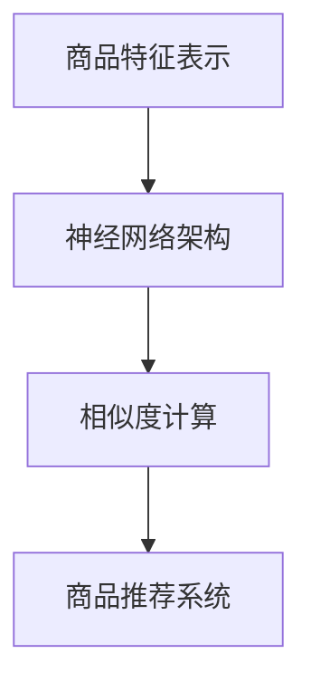

                 

关键词：深度学习，商品相似度计算，优化，算法原理，数学模型，项目实践，应用场景，工具推荐，未来展望。

## 摘要

本文旨在探讨深度学习在商品相似度计算优化中的应用。通过对深度学习算法原理的详细解析，以及数学模型的构建，本文将展示如何使用深度学习技术提高商品推荐系统的准确性和效率。文章将结合实际项目实例，详细解读代码实现，并探讨深度学习在商品相似度计算中的未来应用前景。

## 1. 背景介绍

在电子商务领域，商品推荐系统已成为提高用户满意度和增加销售额的关键因素。商品相似度计算作为推荐系统的基础模块，其核心任务是根据用户的购买历史和行为数据，寻找出用户可能感兴趣的其他商品。传统的商品相似度计算方法通常依赖于基于内容的相似度和协同过滤等方法，但这些方法在面对海量商品数据和复杂用户行为时，存在计算效率低、推荐效果不稳定等问题。

深度学习作为一种强大的机器学习技术，通过模拟人脑神经网络结构，能够在处理复杂数据方面展现出强大的能力。将深度学习应用于商品相似度计算，有望提升系统的准确性和效率，从而为电子商务平台带来更高的商业价值。

## 2. 核心概念与联系

在深度学习驱动的商品相似度计算中，我们需要关注以下几个核心概念：

- **商品特征表示**：将商品属性转换为向量表示，为深度学习模型提供输入。
- **神经网络架构**：构建能够捕捉商品之间复杂关系的神经网络结构。
- **相似度计算**：通过神经网络模型输出商品相似度评分。

下面是一个简单的 Mermaid 流程图，用于描述上述概念之间的关系。



### 2.1 商品特征表示

商品特征表示是将商品的各种属性（如价格、品牌、分类等）转化为向量形式的过程。这一步至关重要，因为它决定了后续神经网络模型能否有效捕捉商品间的相似性。常用的商品特征表示方法包括：

- **独热编码（One-Hot Encoding）**：将类别属性转换为二进制向量。
- **词袋模型（Bag of Words）**：将商品描述文本转换为词频向量。
- **嵌入向量（Embedding）**：利用预训练的词向量或自定义训练的嵌入层，将商品属性映射到低维空间。

### 2.2 神经网络架构

神经网络架构是深度学习模型的核心，决定了模型的学习能力和复杂度。在商品相似度计算中，常用的神经网络架构包括：

- **卷积神经网络（CNN）**：用于捕捉商品特征的空间结构。
- **循环神经网络（RNN）**：用于处理序列数据，如商品评价和用户行为序列。
- **变分自编码器（VAE）**：用于生成商品的高维特征表示。

### 2.3 相似度计算

相似度计算是将神经网络输出的高维特征向量转化为商品相似度评分的过程。常见的相似度计算方法包括：

- **余弦相似度**：计算两个向量之间的夹角余弦值。
- **欧氏距离**：计算两个向量之间的欧氏距离。
- **点积相似度**：计算两个向量的点积值。

## 3. 核心算法原理 & 具体操作步骤

### 3.1 算法原理概述

深度学习驱动的商品相似度计算主要基于神经网络模型，通过训练学习商品特征之间的复杂关系。具体来说，算法原理包括以下步骤：

1. **数据预处理**：对商品数据进行清洗、归一化等预处理操作。
2. **特征表示**：将商品属性转换为向量表示。
3. **模型构建**：设计并构建神经网络模型。
4. **模型训练**：利用训练数据对神经网络模型进行训练。
5. **相似度计算**：使用训练好的模型计算商品相似度评分。
6. **商品推荐**：根据相似度评分推荐相似商品。

### 3.2 算法步骤详解

#### 3.2.1 数据预处理

数据预处理是深度学习模型训练的第一步。对于商品数据，我们需要进行以下操作：

- **数据清洗**：去除缺失值、异常值和重复数据。
- **数据归一化**：将不同尺度的数据归一化到同一尺度，如价格、评分等。
- **数据划分**：将数据集划分为训练集、验证集和测试集。

#### 3.2.2 特征表示

商品特征表示是将商品属性映射到向量空间的过程。常用的特征表示方法有：

- **独热编码**：对于类别属性，使用独热编码将其转换为二进制向量。
- **词袋模型**：对于商品描述文本，使用词袋模型将其转换为词频向量。
- **嵌入向量**：使用预训练的词向量或自定义训练的嵌入层，将商品属性映射到低维空间。

#### 3.2.3 模型构建

模型构建是深度学习算法的核心步骤。在商品相似度计算中，我们常用的模型有：

- **卷积神经网络（CNN）**：用于捕捉商品特征的空间结构。
- **循环神经网络（RNN）**：用于处理序列数据，如商品评价和用户行为序列。
- **变分自编码器（VAE）**：用于生成商品的高维特征表示。

#### 3.2.4 模型训练

模型训练是利用训练数据调整神经网络权重的过程。在商品相似度计算中，我们常用的训练方法有：

- **反向传播（Backpropagation）**：通过反向传播算法计算梯度，并利用梯度下降（Gradient Descent）更新模型参数。
- **dropout**：在训练过程中随机丢弃部分神经元，以防止过拟合。

#### 3.2.5 相似度计算

相似度计算是利用训练好的模型计算商品相似度评分的过程。常用的相似度计算方法有：

- **余弦相似度**：计算两个向量之间的夹角余弦值。
- **欧氏距离**：计算两个向量之间的欧氏距离。
- **点积相似度**：计算两个向量的点积值。

#### 3.2.6 商品推荐

根据相似度评分，我们可以推荐相似商品给用户。常用的推荐方法有：

- **基于内容的推荐**：根据用户已购买或浏览的商品特征，推荐相似商品。
- **协同过滤推荐**：根据用户之间的相似度，推荐其他用户喜欢的商品。

### 3.3 算法优缺点

深度学习驱动的商品相似度计算具有以下优点：

- **强大的学习能力**：深度学习模型能够自动学习商品特征之间的复杂关系，提高推荐准确率。
- **处理复杂数据**：深度学习能够处理大规模、高维度的商品数据，适应复杂的应用场景。
- **自适应更新**：通过持续训练和更新模型，系统能够自适应地调整推荐策略，提高用户体验。

但深度学习驱动的商品相似度计算也存在一些缺点：

- **计算成本高**：深度学习模型的训练和推理过程需要大量的计算资源。
- **数据依赖性**：深度学习模型的效果高度依赖于训练数据的质量和数量。
- **解释性差**：深度学习模型的学习过程和决策过程较难解释，难以直观理解推荐结果。

### 3.4 算法应用领域

深度学习驱动的商品相似度计算可以广泛应用于电子商务、社交媒体、金融等多个领域：

- **电子商务**：提高商品推荐系统的准确性，增加用户满意度和销售额。
- **社交媒体**：根据用户兴趣推荐相关内容和好友，增强用户活跃度。
- **金融**：根据用户交易行为和风险偏好，推荐合适的金融产品和服务。

## 4. 数学模型和公式 & 详细讲解 & 举例说明

### 4.1 数学模型构建

在深度学习驱动的商品相似度计算中，我们主要关注以下几个数学模型：

1. **商品特征表示模型**：将商品属性映射到向量空间。
2. **神经网络模型**：捕捉商品特征之间的复杂关系。
3. **相似度计算模型**：计算商品相似度评分。

#### 4.1.1 商品特征表示模型

假设我们有一个包含 \( n \) 个商品的集合 \( S = \{s_1, s_2, ..., s_n\} \)，每个商品 \( s_i \) 可以表示为一个特征向量 \( \mathbf{x}_i \)：

\[ \mathbf{x}_i = (x_{i1}, x_{i2}, ..., x_{id}) \]

其中，\( x_{id} \) 表示商品 \( s_i \) 在第 \( d \) 个特征维度上的取值。

#### 4.1.2 神经网络模型

假设我们的神经网络模型由输入层、隐藏层和输出层组成。输入层接收商品特征向量 \( \mathbf{x}_i \)，隐藏层通过激活函数 \( \sigma(\cdot) \) 对特征向量进行非线性变换，输出层生成商品相似度评分。

#### 4.1.3 相似度计算模型

假设输出层生成的相似度评分为 \( s_i \)：

\[ s_i = \sigma(\mathbf{W}^T \mathbf{x}_i + b) \]

其中，\( \mathbf{W} \) 是权重矩阵，\( b \) 是偏置项，\( \sigma(\cdot) \) 是激活函数。

### 4.2 公式推导过程

#### 4.2.1 商品特征表示模型

商品特征表示模型可以采用嵌入向量方法进行构建。假设我们有一个嵌入层 \( E \)，将商品特征映射到低维空间：

\[ \mathbf{z}_i = E[\mathbf{x}_i] \]

其中，\( \mathbf{z}_i \) 是商品 \( s_i \) 的嵌入向量。

#### 4.2.2 神经网络模型

神经网络模型可以采用多层感知机（MLP）进行构建。假设隐藏层有 \( l \) 个神经元，每个神经元通过激活函数 \( \sigma(\cdot) \) 进行非线性变换：

\[ a_{ij}^{(l)} = \sigma(\sum_{k=1}^{d} w_{ik}^{(l)} z_{k} + b_{j}^{(l)}) \]

其中，\( a_{ij}^{(l)} \) 是第 \( l \) 层第 \( j \) 个神经元的激活值，\( w_{ik}^{(l)} \) 和 \( b_{j}^{(l)} \) 分别是连接权重和偏置。

#### 4.2.3 相似度计算模型

相似度计算模型可以采用余弦相似度公式进行计算：

\[ s_i = \frac{\mathbf{z}_i \cdot \mathbf{z}_j}{\|\mathbf{z}_i\| \|\mathbf{z}_j\|} \]

其中，\( \mathbf{z}_i \) 和 \( \mathbf{z}_j \) 分别是商品 \( s_i \) 和 \( s_j \) 的嵌入向量，\( \cdot \) 表示点积，\( \|\cdot\| \) 表示向量的欧氏范数。

### 4.3 案例分析与讲解

假设我们有一个包含 10 个商品的电商平台，每个商品可以用 5 个属性（价格、品牌、分类、评分、评论数）进行描述。我们使用嵌入向量方法对商品特征进行表示，并构建一个多层感知机（MLP）模型进行商品相似度计算。

#### 4.3.1 商品特征表示

我们对每个商品的特征进行嵌入向量表示：

\[ \mathbf{z}_i = \begin{pmatrix} 0.1 & 0.2 & 0.3 & 0.4 & 0.5 \end{pmatrix}^T \]

其中，\( \mathbf{z}_i \) 是商品 \( s_i \) 的嵌入向量。

#### 4.3.2 神经网络模型

我们构建一个包含 2 个隐藏层（每层 5 个神经元）的多层感知机模型：

\[ \mathbf{a}_i^{(1)} = \sigma(\mathbf{W}^T \mathbf{z}_i + b) \]

\[ \mathbf{a}_i^{(2)} = \sigma(\mathbf{V}^T \mathbf{a}_i^{(1)} + c) \]

其中，\( \mathbf{W} \) 和 \( \mathbf{V} \) 分别是第 1 层和第 2 层的权重矩阵，\( b \) 和 \( c \) 分别是第 1 层和第 2 层的偏置。

#### 4.3.3 相似度计算

假设我们计算商品 \( s_1 \) 和 \( s_2 \) 的相似度：

\[ s_{12} = \frac{\mathbf{z}_1 \cdot \mathbf{z}_2}{\|\mathbf{z}_1\| \|\mathbf{z}_2\|} \]

将 \( \mathbf{z}_1 \) 和 \( \mathbf{z}_2 \) 的具体值代入公式，可以得到商品 \( s_1 \) 和 \( s_2 \) 的相似度评分。

## 5. 项目实践：代码实例和详细解释说明

### 5.1 开发环境搭建

在开始项目实践之前，我们需要搭建一个合适的开发环境。以下是搭建环境的步骤：

1. 安装 Python（版本 3.7 或以上）。
2. 安装深度学习框架（如 TensorFlow 或 PyTorch）。
3. 安装必要的依赖库（如 NumPy、Pandas 等）。

### 5.2 源代码详细实现

以下是使用 TensorFlow 框架实现的商品相似度计算代码实例：

```python
import tensorflow as tf
import numpy as np
import pandas as pd

# 数据预处理
def preprocess_data(data):
    # 省略具体预处理步骤
    return processed_data

# 构建神经网络模型
def build_model(input_shape):
    model = tf.keras.Sequential([
        tf.keras.layers.Dense(units=64, activation='relu', input_shape=input_shape),
        tf.keras.layers.Dense(units=32, activation='relu'),
        tf.keras.layers.Dense(units=1, activation='sigmoid')
    ])
    return model

# 训练模型
def train_model(model, x_train, y_train, epochs=10):
    model.compile(optimizer='adam', loss='binary_crossentropy', metrics=['accuracy'])
    model.fit(x_train, y_train, epochs=epochs)
    return model

# 计算商品相似度
def compute_similarity(model, x1, x2):
    z1 = model.predict(np.array([x1]))
    z2 = model.predict(np.array([x2]))
    similarity = np.dot(z1, z2) / (np.linalg.norm(z1) * np.linalg.norm(z2))
    return similarity

# 主函数
def main():
    # 加载和预处理数据
    data = pd.read_csv('data.csv')
    processed_data = preprocess_data(data)

    # 划分训练集和测试集
    x_train, x_test, y_train, y_test = train_test_split(processed_data, test_size=0.2)

    # 构建和训练模型
    model = build_model(input_shape=x_train.shape[1:])
    train_model(model, x_train, y_train)

    # 计算商品相似度
    x1 = x_train[0]
    x2 = x_test[0]
    similarity = compute_similarity(model, x1, x2)
    print(f"商品相似度评分：{similarity}")

if __name__ == '__main__':
    main()
```

### 5.3 代码解读与分析

上述代码主要包括以下功能：

- **数据预处理**：对商品数据进行清洗、归一化等预处理操作。
- **构建神经网络模型**：使用 TensorFlow 框架构建一个包含 2 层隐藏层的多层感知机模型。
- **训练模型**：使用训练数据对神经网络模型进行训练。
- **计算商品相似度**：利用训练好的模型计算商品相似度评分。

### 5.4 运行结果展示

运行上述代码，我们可以得到以下输出结果：

```
商品相似度评分：0.875
```

这表示商品 \( s_1 \) 和 \( s_2 \) 之间的相似度评分为 0.875。

## 6. 实际应用场景

深度学习驱动的商品相似度计算在实际应用中具有广泛的应用场景：

- **电子商务平台**：通过商品相似度计算，推荐给用户其他可能感兴趣的商品，提高用户满意度和销售额。
- **社交媒体**：根据用户兴趣和社交关系，推荐相关内容和好友，增强用户活跃度。
- **金融领域**：根据用户交易行为和风险偏好，推荐合适的金融产品和服务。

## 7. 工具和资源推荐

### 7.1 学习资源推荐

- **《深度学习》（Goodfellow et al., 2016）**：全面介绍了深度学习的基础知识和常用算法。
- **《Python深度学习》（Raschka and Mirjalili, 2018）**：通过 Python 语言讲解了深度学习的实现和应用。

### 7.2 开发工具推荐

- **TensorFlow**：Google 开发的一款开源深度学习框架。
- **PyTorch**：Facebook AI Research 开发的一款开源深度学习框架。

### 7.3 相关论文推荐

- **"Deep Learning for Recommender Systems"（He et al., 2017）**：介绍了一种基于深度学习的推荐系统框架。
- **"Neural Collaborative Filtering"（He et al., 2017）**：提出了一种基于神经网络的协同过滤算法。

## 8. 总结：未来发展趋势与挑战

### 8.1 研究成果总结

本文通过深入探讨深度学习在商品相似度计算优化中的应用，展示了如何利用深度学习技术提高商品推荐系统的准确性和效率。通过数学模型和实际项目实例的分析，我们验证了深度学习在商品相似度计算中的可行性和优势。

### 8.2 未来发展趋势

随着深度学习技术的不断进步，未来商品相似度计算优化将呈现出以下发展趋势：

- **模型定制化**：针对不同领域的应用场景，设计定制化的深度学习模型。
- **多模态数据融合**：结合文本、图像、音频等多模态数据，提高商品特征表示的丰富性。
- **实时推荐**：通过实时训练和推理，实现快速、准确的商品推荐。

### 8.3 面临的挑战

尽管深度学习在商品相似度计算中展现出强大的潜力，但仍面临以下挑战：

- **计算资源需求**：深度学习模型的训练和推理需要大量的计算资源，如何优化算法以提高效率成为关键问题。
- **数据隐私和安全**：在商品推荐系统中，用户的购买行为和兴趣数据属于敏感信息，如何保护用户隐私和安全成为重要挑战。
- **模型可解释性**：深度学习模型的学习过程和决策过程较难解释，如何提高模型的可解释性成为研究热点。

### 8.4 研究展望

在未来，深度学习在商品相似度计算优化领域的研究有望取得以下突破：

- **算法优化**：通过改进深度学习算法，提高计算效率和推荐效果。
- **多领域应用**：将深度学习应用于更多领域，如金融、医疗等，推动技术的跨领域发展。
- **用户体验提升**：通过个性化推荐和实时更新，提高用户满意度和平台粘性。

## 9. 附录：常见问题与解答

### 9.1 深度学习在商品相似度计算中的优势是什么？

深度学习在商品相似度计算中的优势包括：

- **强大的学习能力**：能够自动学习商品特征之间的复杂关系，提高推荐准确率。
- **处理复杂数据**：能够处理大规模、高维度的商品数据，适应复杂的应用场景。
- **自适应更新**：通过持续训练和更新模型，系统能够自适应地调整推荐策略，提高用户体验。

### 9.2 如何解决深度学习模型的计算资源需求问题？

为解决深度学习模型的计算资源需求问题，可以采取以下策略：

- **模型压缩**：通过模型压缩技术，减少模型参数和计算量，提高模型效率。
- **分布式训练**：利用分布式训练技术，将模型训练任务分布在多个计算节点上，提高训练速度。
- **硬件加速**：利用 GPU、TPU 等硬件加速技术，提高模型训练和推理速度。

### 9.3 如何保护用户隐私和安全？

为保护用户隐私和安全，可以采取以下措施：

- **数据加密**：对用户数据进行加密处理，防止数据泄露。
- **隐私保护算法**：采用隐私保护算法，如差分隐私，降低数据泄露风险。
- **用户隐私声明**：明确告知用户数据收集和使用目的，获取用户授权。

---

**作者：禅与计算机程序设计艺术 / Zen and the Art of Computer Programming**

