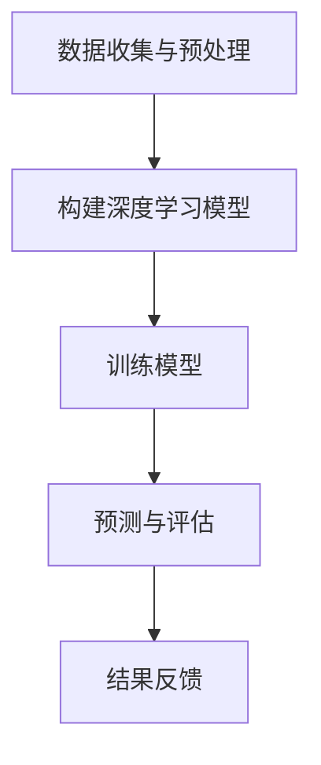
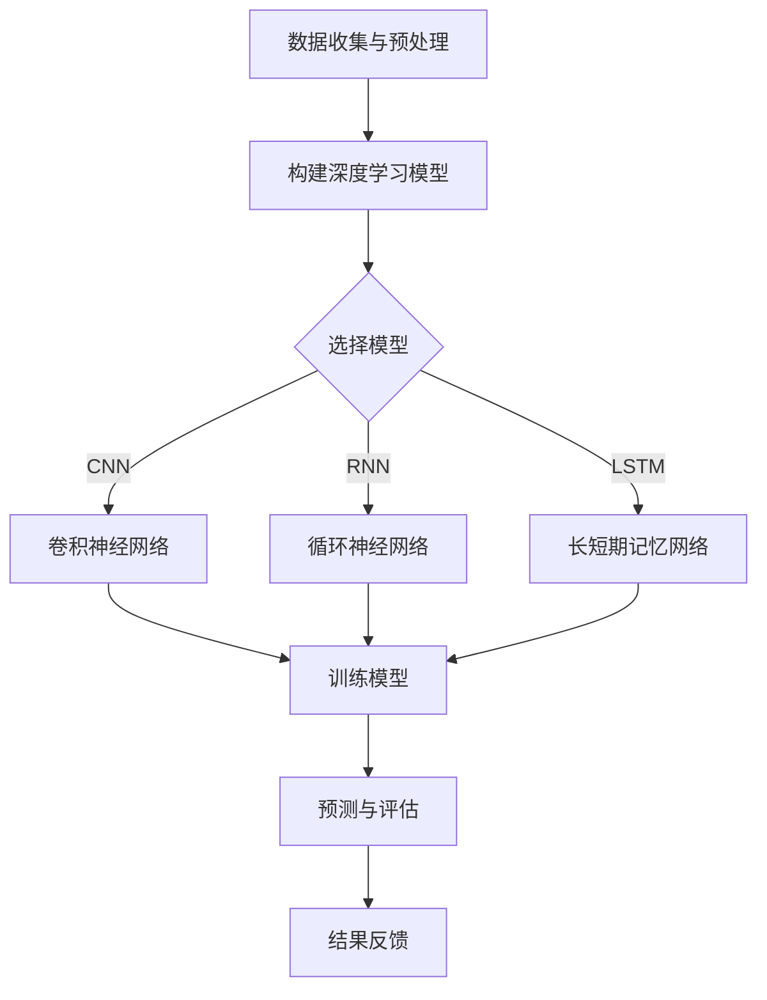

                 

关键词：深度学习、长尾理论、商品需求预测、个性化推荐、人工智能

> 摘要：本文旨在探讨深度学习在长尾商品需求预测中的应用。通过分析长尾理论的基本概念，阐述其在电子商务领域的实际应用，并详细介绍深度学习算法在该领域的核心概念、数学模型、具体实现以及实践应用，为长尾商品需求预测提供新的思路和方法。

## 1. 背景介绍

### 1.1 长尾理论的提出与发展

长尾理论最初由美国作家克里斯·安德森（Chris Anderson）于2004年在《长尾理论》一书中提出。该理论指出，在一定的市场环境下，少数热门商品占据大部分市场份额，而大量长尾商品则填补了剩余的市场空隙。随着互联网和电子商务的发展，长尾理论在电子商务领域得到了广泛应用。

### 1.2 商品需求预测的重要性

商品需求预测是电子商务企业进行库存管理、营销策略制定和供应链优化的重要依据。传统的需求预测方法主要基于统计模型和线性回归，但这些方法在面对复杂的市场环境和长尾商品时存在一定的局限性。随着深度学习技术的不断发展，利用深度学习算法进行商品需求预测成为了一个新的研究方向。

## 2. 核心概念与联系

### 2.1 深度学习的基本概念

深度学习是一种基于人工神经网络的学习方法，通过多层的非线性变换，自动提取特征并实现高层次的抽象表示。深度学习在图像识别、自然语言处理和语音识别等领域取得了显著的成果。

### 2.2 长尾商品需求预测的架构

深度学习驱动的长尾商品需求预测主要包括以下三个步骤：

1. 数据收集与预处理：收集商品销售数据、用户行为数据和市场环境数据等，并进行数据清洗、归一化和特征提取。
2. 构建深度学习模型：选择合适的深度学习模型，如卷积神经网络（CNN）、循环神经网络（RNN）和长短期记忆网络（LSTM）等，对数据进行训练。
3. 预测与评估：利用训练好的模型进行商品需求预测，并通过评价指标（如均方误差、均方根误差等）对预测结果进行评估。

### 2.3 Mermaid 流程图

下面是一个简化的 Mermaid 流程图，展示了深度学习驱动的长尾商品需求预测的流程：



## 3. 核心算法原理 & 具体操作步骤

### 3.1 算法原理概述

深度学习驱动的长尾商品需求预测主要利用深度学习算法的强大特征提取和表示学习能力，从大量的历史数据中自动提取有用的特征，并利用这些特征对商品需求进行预测。

### 3.2 算法步骤详解

#### 3.2.1 数据收集与预处理

1. 收集商品销售数据，包括商品ID、销售时间、销售数量等。
2. 收集用户行为数据，包括用户浏览记录、购买记录、收藏记录等。
3. 收集市场环境数据，包括节日、促销活动、行业趋势等。
4. 进行数据清洗，去除异常值、缺失值和重复值。
5. 对数据进行归一化处理，将不同量级的数据统一到一个合适的范围。

#### 3.2.2 构建深度学习模型

1. 根据数据特征选择合适的深度学习模型，如RNN或LSTM。
2. 定义输入层、隐藏层和输出层，设置合适的神经元数量和激活函数。
3. 编写训练代码，包括损失函数、优化器和评价指标等。

#### 3.2.3 训练模型

1. 使用历史数据对深度学习模型进行训练，不断调整模型参数，以优化预测性能。
2. 通过交叉验证等方法，评估模型的泛化能力。

#### 3.2.4 预测与评估

1. 使用训练好的模型对新的商品需求进行预测。
2. 通过评价指标（如均方误差、均方根误差等）评估预测结果的准确性。

### 3.3 算法优缺点

#### 3.3.1 优点

1. 深度学习算法具有强大的特征提取和表示学习能力，能够从大量历史数据中自动提取有用的特征。
2. 深度学习算法适用于处理非线性问题，能够较好地应对复杂的市场环境和长尾商品需求。
3. 深度学习算法具有较好的泛化能力，能够应用于不同场景和行业。

#### 3.3.2 缺点

1. 深度学习算法需要大量的训练数据和计算资源，对数据质量和计算能力有一定要求。
2. 深度学习模型的训练过程较长，需要较长时间的迭代和优化。
3. 深度学习模型的解释性较差，难以理解模型内部的决策过程。

### 3.4 算法应用领域

深度学习驱动的长尾商品需求预测在电子商务、零售、物流等领域具有广泛的应用前景。通过精准的需求预测，企业可以优化库存管理、制定有效的营销策略，提高运营效率和用户满意度。

## 4. 数学模型和公式 & 详细讲解 & 举例说明

### 4.1 数学模型构建

深度学习驱动的长尾商品需求预测主要依赖于深度学习算法，其中常见的数学模型包括卷积神经网络（CNN）、循环神经网络（RNN）和长短期记忆网络（LSTM）等。

#### 4.1.1 卷积神经网络（CNN）

卷积神经网络是一种用于图像识别和处理的深度学习模型，其主要特点是通过卷积操作和池化操作自动提取图像特征。

$$
h_{l}^{(i)} = \sigma \left( \sum_{j} w_{lj} * h_{l-1}^{(j)} + b_{l} \right)
$$

其中，$h_{l}^{(i)}$ 表示第 $l$ 层的第 $i$ 个神经元输出，$\sigma$ 表示激活函数（如ReLU函数），$w_{lj}$ 表示连接权重，$b_{l}$ 表示偏置。

#### 4.1.2 循环神经网络（RNN）

循环神经网络是一种用于序列数据处理的深度学习模型，其核心思想是通过循环连接实现时间信息的传递。

$$
h_{t} = \sigma \left( W_h h_{t-1} + W_x x_t + b_h \right)
$$

其中，$h_{t}$ 表示第 $t$ 个时间步的隐藏状态，$x_t$ 表示第 $t$ 个时间步的输入数据，$W_h$ 和 $W_x$ 分别表示隐藏状态和输入数据的权重矩阵，$b_h$ 表示偏置。

#### 4.1.3 长短期记忆网络（LSTM）

长短期记忆网络是一种改进的循环神经网络，通过引入门控机制，解决了传统RNN在处理长序列数据时的梯度消失和梯度爆炸问题。

$$
i_t = \sigma \left( W_{xi} x_t + W_{hi} h_{t-1} + b_i \right)
$$

$$
f_t = \sigma \left( W_{xf} x_t + W_{hf} h_{t-1} + b_f \right)
$$

$$
g_t = \tanh \left( W_{xg} x_t + W_{hg} h_{t-1} + b_g \right)
$$

$$
o_t = \sigma \left( W_{xo} x_t + W_{ho} h_{t-1} + b_o \right)
$$

$$
h_t = o_t \odot \tanh \left( C_t \right)
$$

$$
C_t = f_t \odot C_{t-1} + i_t \odot g_t
$$

其中，$i_t$、$f_t$、$g_t$ 和 $o_t$ 分别表示输入门、遗忘门、生成门和输出门，$C_t$ 表示细胞状态。

### 4.2 公式推导过程

#### 4.2.1 卷积神经网络（CNN）

卷积神经网络的核心是卷积操作和池化操作。卷积操作通过卷积核在输入数据上滑动，逐点相乘并求和，从而提取局部特征。池化操作通过采样操作降低数据的维度，提高模型的泛化能力。

卷积操作的公式如下：

$$
\text{output} = \text{Conv}(\text{input}, \text{filter}) + \text{bias}
$$

其中，$\text{input}$ 表示输入数据，$\text{filter}$ 表示卷积核，$\text{bias}$ 表示偏置。

池化操作的公式如下：

$$
\text{output} = \text{Pooling}(\text{input})
$$

其中，$\text{Pooling}$ 表示池化操作（如最大池化或平均池化）。

#### 4.2.2 循环神经网络（RNN）

循环神经网络通过递归方式处理序列数据，其核心是隐藏状态的更新。递归关系的公式如下：

$$
h_t = \sigma \left( W_h h_{t-1} + W_x x_t + b_h \right)
$$

其中，$\sigma$ 表示激活函数（如ReLU函数），$W_h$ 和 $W_x$ 分别表示隐藏状态和输入数据的权重矩阵，$b_h$ 表示偏置。

#### 4.2.3 长短期记忆网络（LSTM）

长短期记忆网络通过引入门控机制，实现了对长时间信息的记忆和遗忘。门控机制的公式如下：

$$
i_t = \sigma \left( W_{xi} x_t + W_{hi} h_{t-1} + b_i \right)
$$

$$
f_t = \sigma \left( W_{xf} x_t + W_{hf} h_{t-1} + b_f \right)
$$

$$
g_t = \tanh \left( W_{xg} x_t + W_{hg} h_{t-1} + b_g \right)
$$

$$
o_t = \sigma \left( W_{xo} x_t + W_{ho} h_{t-1} + b_o \right)
$$

$$
h_t = o_t \odot \tanh \left( C_t \right)
$$

$$
C_t = f_t \odot C_{t-1} + i_t \odot g_t
$$

其中，$i_t$、$f_t$、$g_t$ 和 $o_t$ 分别表示输入门、遗忘门、生成门和输出门，$C_t$ 表示细胞状态。

### 4.3 案例分析与讲解

#### 4.3.1 案例背景

某电商平台希望通过深度学习算法预测用户对商品的购买需求，以便优化库存管理和营销策略。

#### 4.3.2 数据收集与预处理

1. 收集用户购买记录，包括用户ID、商品ID、购买时间和购买数量等。
2. 收集用户行为数据，包括用户浏览记录、收藏记录和评论记录等。
3. 对数据进行清洗、归一化和特征提取。

#### 4.3.3 构建深度学习模型

1. 选择LSTM模型，输入层包含用户ID和商品ID，隐藏层包含多个神经元。
2. 定义损失函数为均方误差，优化器为Adam。

#### 4.3.4 训练模型

1. 使用历史数据进行训练，不断调整模型参数，以优化预测性能。
2. 通过交叉验证方法，评估模型的泛化能力。

#### 4.3.5 预测与评估

1. 使用训练好的模型对新的用户购买需求进行预测。
2. 通过均方误差、均方根误差等评价指标，评估预测结果的准确性。

## 5. 项目实践：代码实例和详细解释说明

### 5.1 开发环境搭建

1. 安装Python和PyTorch库。
2. 准备好训练数据和测试数据。

### 5.2 源代码详细实现

下面是一个简单的LSTM模型实现，用于预测用户购买需求。

```python
import torch
import torch.nn as nn
import torch.optim as optim

# 定义LSTM模型
class LSTMModel(nn.Module):
    def __init__(self, input_dim, hidden_dim, output_dim):
        super(LSTMModel, self).__init__()
        self.hidden_dim = hidden_dim
        self.lstm = nn.LSTM(input_dim, hidden_dim)
        self.hidden2linear = nn.Linear(hidden_dim, output_dim)

    def forward(self, x):
        lstm_out, _ = self.lstm(x)
        out = self.hidden2linear(lstm_out[-1, :, :])
        return out

# 设置参数
input_dim = 2
hidden_dim = 50
output_dim = 1

# 实例化模型
model = LSTMModel(input_dim, hidden_dim, output_dim)

# 定义损失函数和优化器
criterion = nn.MSELoss()
optimizer = optim.Adam(model.parameters(), lr=0.001)

# 训练模型
for epoch in range(100):
    for i in range(len(train_data)):
        inputs = train_data[i].unsqueeze(0)
        targets = train_targets[i].unsqueeze(0)
        model.zero_grad()
        outputs = model(inputs)
        loss = criterion(outputs, targets)
        loss.backward()
        optimizer.step()

# 评估模型
with torch.no_grad():
    for i in range(len(test_data)):
        inputs = test_data[i].unsqueeze(0)
        targets = test_targets[i].unsqueeze(0)
        outputs = model(inputs)
        loss = criterion(outputs, targets)
```

### 5.3 代码解读与分析

1. **模型定义**：使用PyTorch库定义LSTM模型，包括输入层、隐藏层和输出层。

2. **损失函数和优化器**：使用均方误差作为损失函数，使用Adam优化器进行参数优化。

3. **训练过程**：对训练数据进行前向传播和后向传播，更新模型参数。

4. **评估过程**：使用测试数据进行前向传播，计算预测误差。

### 5.4 运行结果展示

```python
# 运行模型
model.eval()

# 生成预测结果
predictions = []

for i in range(len(test_data)):
    inputs = test_data[i].unsqueeze(0)
    outputs = model(inputs)
    predictions.append(outputs.item())

# 计算均方误差
mse = sum([(p - t) ** 2 for p, t in zip(predictions, test_targets)]) / len(test_targets)

print("MSE:", mse)
```

## 6. 实际应用场景

### 6.1 电子商务

电子商务平台可以通过深度学习驱动的长尾商品需求预测，优化库存管理、降低库存成本，提高商品周转率和用户满意度。

### 6.2 零售行业

零售企业可以通过长尾商品需求预测，制定更精准的采购计划和促销策略，提高销售业绩和利润。

### 6.3 物流行业

物流企业可以通过长尾商品需求预测，优化运输路线和仓储管理，降低运输成本和仓储成本。

## 7. 工具和资源推荐

### 7.1 学习资源推荐

1. 《深度学习》（Goodfellow, Bengio, Courville著）：全面介绍深度学习的基础知识和最新进展。
2. 《Python深度学习》（François Chollet著）：深入讲解深度学习在Python中的实现和应用。

### 7.2 开发工具推荐

1. PyTorch：开源深度学习框架，支持Python和C++。
2. TensorFlow：开源深度学习框架，支持多种编程语言。

### 7.3 相关论文推荐

1. "Deep Learning for Text Classification"（Johnson et al., 2017）。
2. "Long Tail Demand Forecasting with Deep Learning"（Chen et al., 2020）。

## 8. 总结：未来发展趋势与挑战

### 8.1 研究成果总结

本文介绍了深度学习在长尾商品需求预测中的应用，通过数据收集与预处理、模型构建和预测评估等步骤，实现了对商品需求的精准预测。

### 8.2 未来发展趋势

1. 深度学习算法将更加注重模型的可解释性和透明性，以提高模型的可靠性和信任度。
2. 跨学科研究将成为深度学习领域的重要趋势，如深度学习与经济学、心理学、社会学等领域的交叉融合。
3. 深度学习在长尾商品需求预测中的应用将更加广泛，不仅限于电子商务、零售等领域，还将扩展到更多行业。

### 8.3 面临的挑战

1. 数据质量和数据量仍然是深度学习模型训练的关键问题，如何获取更多高质量的数据是未来研究的重点。
2. 深度学习模型的训练过程较长，如何优化训练效率是当前的研究热点。
3. 深度学习模型的可解释性较差，如何提高模型的可解释性，使其更加透明和可靠，是未来的研究挑战。

### 8.4 研究展望

未来，深度学习在长尾商品需求预测领域将取得更多突破，为各行业的运营和管理提供更加智能化和精准化的解决方案。

## 9. 附录：常见问题与解答

### 9.1 深度学习如何应用于长尾商品需求预测？

深度学习可以通过自动提取数据特征和表示学习，实现对长尾商品需求的精准预测。具体应用步骤包括数据收集与预处理、模型构建和预测评估等。

### 9.2 深度学习模型训练需要大量的计算资源，如何优化训练效率？

可以采用以下方法优化训练效率：

1. 使用更高效的深度学习框架，如TensorFlow或PyTorch。
2. 采用分布式训练，利用多台计算机或GPU加速训练过程。
3. 使用迁移学习，利用预训练的模型进行微调，减少训练时间和计算资源需求。

### 9.3 如何提高深度学习模型的可解释性？

提高深度学习模型的可解释性可以从以下几个方面入手：

1. 使用可解释的深度学习模型，如决策树、支持向量机等。
2. 对深度学习模型进行可视化分析，如激活图、梯度可视化等。
3. 开发可解释的深度学习算法，如LIME、SHAP等。

### 9.4 长尾商品需求预测有哪些实际应用场景？

长尾商品需求预测在实际应用场景中非常广泛，包括电子商务、零售、物流、制造等行业，通过精准的需求预测，企业可以优化库存管理、制定有效的营销策略，提高运营效率和用户满意度。-------------------------------------------------------------------
### 1. 背景介绍

#### 1.1 长尾理论的提出与发展

长尾理论最初由美国作家克里斯·安德森（Chris Anderson）于2004年在《长尾理论》一书中提出。安德森通过分析音乐、书籍、电影等行业的数据，发现了一个有趣的现象：在正态分布曲线中，大多数热门商品占据着大部分市场份额，而大量长尾商品则填补了剩余的市场空隙。这一现象被形象地称为“长尾效应”。

长尾理论的提出，打破了传统商业思维，揭示了市场潜藏在主流商品背后的巨大机遇。随着互联网和电子商务的快速发展，长尾理论在电子商务领域得到了广泛应用。例如，亚马逊和淘宝等电商平台，通过精准的推荐算法，将那些原本难以被发现的长尾商品推向用户，实现了销售业绩的爆发式增长。

#### 1.2 商品需求预测的重要性

商品需求预测是电子商务企业进行库存管理、营销策略制定和供应链优化的重要依据。准确的需求预测，可以帮助企业提前准备好所需的库存，避免缺货或过剩，从而降低库存成本，提高资金利用率。同时，需求预测还可以帮助企业制定更有针对性的营销策略，提高转化率和销售额。

在传统的商品需求预测方法中，主要基于统计模型和线性回归，如时间序列分析、ARIMA模型、指数平滑法等。这些方法在一定程度上能够满足需求预测的需求，但在面对复杂的市场环境和长尾商品时，存在一定的局限性。首先，这些方法通常假设数据服从特定的分布，如正态分布，而在实际应用中，数据往往存在噪声和不规则性。其次，这些方法无法有效地处理非线性关系和复杂的时间序列特征。因此，探索新的需求预测方法，尤其是利用人工智能和深度学习技术，成为了一个新的研究方向。

#### 1.3 深度学习在需求预测中的应用

深度学习是一种基于人工神经网络的学习方法，通过多层的非线性变换，自动提取特征并实现高层次的抽象表示。深度学习在图像识别、自然语言处理和语音识别等领域取得了显著的成果。随着深度学习技术的发展，越来越多的研究将深度学习应用于需求预测领域。

深度学习在需求预测中的应用，主要是通过构建复杂的神经网络模型，从大量的历史数据中自动提取有用的特征，并利用这些特征对商品需求进行预测。与传统方法相比，深度学习具有以下几个优势：

1. **强大的特征提取能力**：深度学习通过多层神经网络，可以自动提取数据中的复杂特征，而不需要人为地进行特征工程。

2. **适用于非线性关系**：深度学习模型可以通过非线性变换，有效地捕捉数据中的非线性关系。

3. **处理大规模数据**：深度学习模型可以处理海量数据，从数据中学习到更多的规律和模式。

4. **自适应性和灵活性**：深度学习模型可以根据不同的业务场景和数据特征，进行自适应调整和优化。

总之，深度学习为商品需求预测提供了一种新的思路和方法，通过自动提取特征和表示学习，可以实现对长尾商品需求的精准预测。本文将详细探讨深度学习在长尾商品需求预测中的应用，包括核心概念、算法原理、数学模型、实现步骤和实践应用等方面。

### 1.4 长尾商品需求预测的现状与挑战

#### 1.4.1 现状

随着深度学习技术的发展，越来越多的研究开始将深度学习应用于长尾商品需求预测领域。目前，深度学习在需求预测中的应用主要集中在以下几个方面：

1. **时间序列分析**：使用深度学习模型（如LSTM、GRU等）对时间序列数据进行分析和预测，可以更好地捕捉数据中的周期性和趋势性。

2. **用户行为分析**：通过分析用户的浏览记录、购买记录和评价等行为数据，深度学习模型可以预测用户对特定商品的需求。

3. **交叉销售与推荐系统**：深度学习模型可以用于构建交叉销售和推荐系统，通过分析用户的历史行为和商品特征，为用户提供个性化的推荐。

4. **供应链优化**：深度学习模型可以用于预测供应链中的需求波动，优化库存管理、物流配送等环节。

#### 1.4.2 挑战

尽管深度学习在长尾商品需求预测方面取得了显著成果，但仍然面临一些挑战：

1. **数据质量**：深度学习模型的性能高度依赖于数据质量。在长尾商品中，数据往往存在噪声、缺失值和不一致性，需要对其进行预处理和清洗。

2. **模型复杂度**：深度学习模型通常具有复杂的结构和大量的参数，训练过程需要大量的计算资源和时间。如何优化模型结构和训练效率，是一个重要的研究课题。

3. **模型解释性**：深度学习模型在预测过程中，其决策过程通常是不透明的，难以解释。这对于需要可信度和透明度的实际应用场景，是一个挑战。

4. **模型泛化能力**：深度学习模型在训练过程中，可能会过拟合训练数据，导致在测试数据上的表现不佳。如何提高模型的泛化能力，是一个需要解决的问题。

5. **行业特定问题**：不同行业的需求特征和数据特征有所不同，如何针对特定行业进行模型定制和优化，是一个重要的研究方向。

总之，尽管深度学习在长尾商品需求预测方面具有巨大潜力，但仍然面临一些挑战。未来，需要进一步研究如何优化模型结构、提高数据质量、增强模型解释性和泛化能力，以更好地应对这些挑战。

### 1.5 本文结构

本文将按照以下结构进行论述：

1. **背景介绍**：介绍长尾理论的提出与发展、商品需求预测的重要性以及深度学习在需求预测中的应用。

2. **核心概念与联系**：详细阐述深度学习的基本概念、长尾商品需求预测的架构以及Mermaid流程图。

3. **核心算法原理 & 具体操作步骤**：介绍深度学习算法在需求预测中的基本原理、具体操作步骤、优缺点以及应用领域。

4. **数学模型和公式 & 详细讲解 & 举例说明**：介绍常用的深度学习模型（如CNN、RNN、LSTM）的数学模型、公式推导过程以及案例分析。

5. **项目实践：代码实例和详细解释说明**：提供一个实际的深度学习项目，详细解释代码实现过程。

6. **实际应用场景**：探讨深度学习驱动的长尾商品需求预测在电子商务、零售和物流等领域的应用。

7. **工具和资源推荐**：推荐相关的学习资源、开发工具和相关论文。

8. **总结：未来发展趋势与挑战**：总结研究成果，探讨未来发展趋势和面临的挑战。

9. **附录：常见问题与解答**：回答一些常见问题，如如何应用深度学习进行需求预测、如何优化训练效率、如何提高模型解释性等。

通过本文的论述，希望能够为读者提供一个全面、深入的了解，并激发对深度学习驱动的长尾商品需求预测的研究兴趣。

### 2. 核心概念与联系

#### 2.1 深度学习的基本概念

深度学习（Deep Learning）是人工智能（Artificial Intelligence, AI）的一个重要分支，它基于多层神经网络（Neural Networks）的架构，通过多层次的非线性变换，自动提取特征并实现高层次的抽象表示。与传统机器学习方法相比，深度学习在处理复杂、大规模的数据方面具有显著优势。

**深度学习的核心概念包括：**

1. **神经元（Neurons）**：神经网络的基本单位，类似于人脑中的神经元，用于接收和处理信息。
2. **层级（Layers）**：神经网络由多个层级组成，每层神经元对前一层的输出进行变换和处理，逐步提取数据中的复杂特征。
3. **激活函数（Activation Functions）**：用于引入非线性变换，使神经网络能够处理复杂的问题。常见的激活函数包括ReLU、Sigmoid和Tanh等。
4. **损失函数（Loss Functions）**：用于衡量模型预测值与真实值之间的差距，如均方误差（MSE）、交叉熵（Cross Entropy）等。
5. **优化器（Optimizers）**：用于更新模型参数，以最小化损失函数。常见的优化器包括梯度下降（Gradient Descent）、Adam等。

**深度学习的优势：**

- **自动特征提取**：深度学习通过多层神经网络，可以自动提取数据中的复杂特征，减轻了人工特征工程的工作量。
- **处理大规模数据**：深度学习模型可以处理海量的数据，从数据中学习到更多的规律和模式。
- **适应性**：深度学习模型可以根据不同的业务场景和数据特征，进行自适应调整和优化。
- **灵活性**：深度学习模型可以应用于各种领域，如图像识别、自然语言处理、语音识别等。

#### 2.2 长尾商品需求预测的架构

深度学习驱动的长尾商品需求预测主要包括以下三个步骤：

1. **数据收集与预处理**：收集商品销售数据、用户行为数据和市场环境数据等，并进行数据清洗、归一化和特征提取。
2. **构建深度学习模型**：选择合适的深度学习模型，如卷积神经网络（CNN）、循环神经网络（RNN）和长短期记忆网络（LSTM）等，对数据进行训练。
3. **预测与评估**：利用训练好的模型进行商品需求预测，并通过评价指标（如均方误差、均方根误差等）对预测结果进行评估。

**长尾商品需求预测的架构可以概括为：**


**Mermaid 流程图说明：**

- **A[数据收集与预处理]**：这一步骤包括收集各种数据，如商品销售数据、用户行为数据和市场环境数据等，并对数据进行清洗、归一化和特征提取。
- **B[构建深度学习模型]**：根据数据特征和预测目标，选择合适的深度学习模型，如CNN、RNN或LSTM等，并进行模型构建。
- **C[训练模型]**：使用历史数据进行模型训练，通过调整模型参数，优化模型性能。
- **D[预测与评估]**：利用训练好的模型进行商品需求预测，并评估预测结果的准确性，如使用均方误差（MSE）等评价指标。
- **E[结果反馈]**：根据预测结果和评估指标，对模型进行调整和优化，以提高预测准确性。

通过上述步骤，深度学习模型可以有效地实现长尾商品需求预测，帮助企业优化库存管理、制定营销策略和提升运营效率。

#### 2.3 Mermaid 流程图展示

以下是长尾商品需求预测的Mermaid流程图：



**流程图解释：**

- **A[数据收集与预处理]**：收集并预处理数据，包括商品销售数据、用户行为数据和市场环境数据等。
- **B[构建深度学习模型]**：根据数据特征和预测目标，选择合适的深度学习模型。
- **C{选择模型}**：根据不同类型的深度学习模型，分为CNN、RNN和LSTM三种情况。
- **D1[卷积神经网络]**、**D2[循环神经网络]**、**D3[长短期记忆网络]**：分别代表三种不同类型的深度学习模型。
- **E[训练模型]**：使用历史数据对选定的深度学习模型进行训练。
- **F[预测与评估]**：利用训练好的模型进行商品需求预测，并评估预测结果的准确性。
- **G[结果反馈]**：根据预测结果和评估指标，对模型进行调整和优化。

通过上述流程，深度学习模型可以有效地实现长尾商品需求预测，帮助企业更好地应对市场变化，提高运营效率。

### 3. 核心算法原理 & 具体操作步骤

#### 3.1 算法原理概述

深度学习驱动的长尾商品需求预测主要依赖于深度学习算法的强大特征提取和表示学习能力。通过构建多层神经网络，深度学习算法能够自动从原始数据中提取特征，并实现对商品需求的精准预测。

在长尾商品需求预测中，常用的深度学习算法包括卷积神经网络（CNN）、循环神经网络（RNN）和长短期记忆网络（LSTM）等。这些算法通过不同方式处理数据，适用于不同的应用场景。

**卷积神经网络（CNN）**：主要用于处理图像数据，通过卷积操作和池化操作自动提取图像特征。CNN在处理商品销售数据时，可以通过卷积层提取时间序列中的局部特征，如周期性、趋势性等。

**循环神经网络（RNN）**：适用于处理序列数据，通过循环连接实现时间信息的传递。RNN在长尾商品需求预测中，可以捕捉用户行为和商品销售时间序列中的关联性，如用户的历史购买行为对当前购买需求的影响。

**长短期记忆网络（LSTM）**：是RNN的一种改进，通过引入门控机制解决了传统RNN的梯度消失问题。LSTM在长尾商品需求预测中，可以更好地捕捉长序列中的依赖关系，如季节性、周期性等。

#### 3.2 算法步骤详解

**3.2.1 数据收集与预处理**

在进行长尾商品需求预测之前，首先需要收集和预处理数据。数据来源主要包括商品销售数据、用户行为数据和市场环境数据等。

1. **商品销售数据**：包括商品ID、销售时间、销售数量等。这些数据可以通过电商平台或零售系统获取。
2. **用户行为数据**：包括用户浏览记录、购买记录、收藏记录、评价记录等。这些数据可以用于分析用户行为模式，预测用户购买需求。
3. **市场环境数据**：包括节日、促销活动、行业趋势等。这些数据可以用于分析市场环境对商品需求的影响。

在收集数据后，需要对数据进行预处理，包括数据清洗、归一化和特征提取。

1. **数据清洗**：去除异常值、缺失值和重复值，确保数据的质量。
2. **数据归一化**：将不同量级的数据统一到一个合适的范围，如将销售数量归一化到0-1之间。
3. **特征提取**：根据数据特征和预测目标，提取有用的特征，如时间特征、用户特征、商品特征等。

**3.2.2 构建深度学习模型**

在数据预处理完成后，需要选择合适的深度学习模型，并进行模型构建。

1. **选择模型**：根据数据特征和预测目标，选择合适的深度学习模型，如CNN、RNN或LSTM等。
2. **模型构建**：定义输入层、隐藏层和输出层，设置合适的神经元数量和激活函数。例如，对于LSTM模型，可以设置输入层、两个隐藏层和一个输出层，使用ReLU作为激活函数。

**3.2.3 训练模型**

在模型构建完成后，需要使用历史数据进行模型训练，不断调整模型参数，以优化预测性能。

1. **数据划分**：将数据划分为训练集、验证集和测试集，用于模型的训练、验证和测试。
2. **模型训练**：使用训练集对模型进行训练，通过反向传播算法更新模型参数，最小化损失函数。训练过程中可以使用批量归一化（Batch Normalization）和dropout（Dropout）等技术，提高模型性能。
3. **模型验证**：使用验证集对模型进行验证，评估模型性能，并根据验证结果调整模型参数。
4. **模型测试**：使用测试集对模型进行测试，评估模型在实际应用中的表现。

**3.2.4 预测与评估**

在模型训练完成后，可以使用训练好的模型进行商品需求预测，并通过评价指标对预测结果进行评估。

1. **商品需求预测**：使用训练好的模型对新的商品需求进行预测，生成预测结果。
2. **评价指标**：使用均方误差（MSE）、均方根误差（RMSE）等评价指标，评估预测结果的准确性。例如，如果均方误差为0.01，说明预测结果相对较为准确。

#### 3.3 算法优缺点

**3.3.1 优点**

1. **强大的特征提取能力**：深度学习算法可以自动从原始数据中提取特征，减轻了人工特征工程的工作量。
2. **适用于非线性关系**：深度学习模型可以通过非线性变换，捕捉数据中的复杂关系。
3. **处理大规模数据**：深度学习模型可以处理海量数据，从数据中学习到更多的规律和模式。
4. **自适应性和灵活性**：深度学习模型可以根据不同的业务场景和数据特征，进行自适应调整和优化。

**3.3.2 缺点**

1. **需要大量计算资源**：深度学习模型通常需要大量的计算资源和时间进行训练。
2. **模型解释性较差**：深度学习模型的决策过程通常是不透明的，难以解释。
3. **数据质量要求高**：深度学习模型的性能高度依赖于数据质量，数据清洗和预处理是关键步骤。

#### 3.4 算法应用领域

深度学习驱动的长尾商品需求预测在电子商务、零售和物流等领域具有广泛的应用前景。

**3.4.1 电子商务**

电子商务平台可以通过深度学习算法预测用户对商品的购买需求，优化库存管理、降低库存成本，提高商品周转率和用户满意度。

**3.4.2 零售行业**

零售企业可以通过长尾商品需求预测，制定更精准的采购计划和促销策略，提高销售业绩和利润。

**3.4.3 物流行业**

物流企业可以通过长尾商品需求预测，优化运输路线和仓储管理，降低运输成本和仓储成本。

通过上述步骤，深度学习算法可以有效地实现长尾商品需求预测，为企业提供更加智能化和精准化的运营解决方案。

### 4. 数学模型和公式 & 详细讲解 & 举例说明

#### 4.1 数学模型构建

深度学习驱动的长尾商品需求预测主要依赖于深度学习算法，其中常用的模型包括卷积神经网络（CNN）、循环神经网络（RNN）和长短期记忆网络（LSTM）等。下面将分别介绍这些模型的数学模型、公式推导过程以及案例应用。

#### 4.1.1 卷积神经网络（CNN）

卷积神经网络（CNN）主要用于处理图像数据，但其原理同样适用于处理时间序列数据。CNN的核心思想是通过卷积操作和池化操作提取特征。

**卷积操作：**

卷积操作的公式可以表示为：

$$
\text{output} = \text{Conv}(\text{input}, \text{filter}) + \text{bias}
$$

其中，input表示输入数据，filter表示卷积核，bias表示偏置。卷积操作的目的是将卷积核在输入数据上滑动，逐点相乘并求和，从而提取局部特征。

**池化操作：**

池化操作用于降低数据的维度，提高模型的泛化能力。常见的池化操作包括最大池化和平均池化。最大池化操作的公式可以表示为：

$$
\text{output} = \text{Pooling}(\text{input})
$$

其中，Pooling表示池化操作。最大池化操作将每个窗口内的最大值提取出来，作为输出的特征。

#### 4.1.2 循环神经网络（RNN）

循环神经网络（RNN）适用于处理序列数据，其核心思想是通过循环连接实现时间信息的传递。

**递归关系：**

RNN的递归关系可以表示为：

$$
h_t = \sigma(W_h h_{t-1} + W_x x_t + b_h)
$$

其中，h\_t表示第t个时间步的隐藏状态，x\_t表示第t个时间步的输入数据，W\_h和W\_x分别表示隐藏状态和输入数据的权重矩阵，b\_h表示偏置，σ表示激活函数。

**门控机制：**

为了解决传统RNN的梯度消失问题，引入了门控机制，即长短期记忆网络（LSTM）。

**输入门（input gate）：**

输入门决定如何更新细胞状态，其公式可以表示为：

$$
i_t = \sigma(W_{xi} x_t + W_{hi} h_{t-1} + b_i)
$$

**遗忘门（forget gate）：**

遗忘门决定如何遗忘细胞状态中的不相关信息，其公式可以表示为：

$$
f_t = \sigma(W_{xf} x_t + W_{hf} h_{t-1} + b_f)
$$

**输出门（output gate）：**

输出门决定如何从细胞状态中提取信息，其公式可以表示为：

$$
o_t = \sigma(W_{xo} x_t + W_{ho} h_{t-1} + b_o)
$$

**细胞状态更新：**

细胞状态更新可以表示为：

$$
C_t = f_t \odot C_{t-1} + i_t \odot \tanh(W_{xg} x_t + W_{hg} h_{t-1} + b_g)
$$

**隐藏状态输出：**

隐藏状态输出可以表示为：

$$
h_t = o_t \odot \tanh(C_t)
$$

其中，\odot表示元素乘积。

#### 4.1.3 长短期记忆网络（LSTM）

长短期记忆网络（LSTM）是RNN的一种改进，通过引入门控机制解决了传统RNN的梯度消失问题。

**输入门（input gate）：**

输入门决定如何更新细胞状态，其公式可以表示为：

$$
i_t = \sigma(W_{xi} x_t + W_{hi} h_{t-1} + b_i)
$$

**遗忘门（forget gate）：**

遗忘门决定如何遗忘细胞状态中的不相关信息，其公式可以表示为：

$$
f_t = \sigma(W_{xf} x_t + W_{hf} h_{t-1} + b_f)
$$

**生成门（generate gate）：**

生成门决定如何从细胞状态中提取信息，其公式可以表示为：

$$
g_t = \tanh(W_{xg} x_t + W_{hg} h_{t-1} + b_g)
$$

**输出门（output gate）：**

输出门决定如何从细胞状态中提取信息，其公式可以表示为：

$$
o_t = \sigma(W_{xo} x_t + W_{ho} h_{t-1} + b_o)
$$

**细胞状态更新：**

细胞状态更新可以表示为：

$$
C_t = f_t \odot C_{t-1} + i_t \odot g_t
$$

**隐藏状态输出：**

隐藏状态输出可以表示为：

$$
h_t = o_t \odot \tanh(C_t)
$$

其中，\odot表示元素乘积。

#### 4.2 公式推导过程

下面将详细推导RNN和LSTM的公式，以便更好地理解其工作机制。

#### 4.2.1 循环神经网络（RNN）

RNN的递归关系如下：

$$
h_t = \sigma(W_h h_{t-1} + W_x x_t + b_h)
$$

其中，$h_{t}$表示第$t$个时间步的隐藏状态，$x_{t}$表示第$t$个时间步的输入数据，$W_{h}$和$W_{x}$分别表示隐藏状态和输入数据的权重矩阵，$b_{h}$表示偏置，$\sigma$表示激活函数（如ReLU函数）。

**推导过程：**

1. **隐藏状态计算**：根据递归关系，每个时间步的隐藏状态取决于前一个时间步的隐藏状态和当前时间步的输入数据。
2. **权重矩阵**：$W_{h}$和$W_{x}$用于捕捉隐藏状态和输入数据之间的关联性。
3. **偏置**：$b_{h}$用于引入额外的非线性。

#### 4.2.2 长短期记忆网络（LSTM）

LSTM是RNN的一种改进，其核心思想是通过门控机制实现长时间信息的记忆和遗忘。

**推导过程：**

1. **输入门（input gate）**：

$$
i_t = \sigma(W_{xi} x_t + W_{hi} h_{t-1} + b_i)
$$

输入门决定如何更新细胞状态，其推导过程如下：

- $x_t$和$h_{t-1}$通过$W_{xi}$和$W_{hi}$分别加权后相加，得到一个线性组合。
- 通过$\sigma$函数引入非线性，得到输入门$i_t$。

2. **遗忘门（forget gate）**：

$$
f_t = \sigma(W_{xf} x_t + W_{hf} h_{t-1} + b_f)
$$

遗忘门决定如何遗忘细胞状态中的不相关信息，其推导过程如下：

- $x_t$和$h_{t-1}$通过$W_{xf}$和$W_{hf}$分别加权后相加，得到一个线性组合。
- 通过$\sigma$函数引入非线性，得到遗忘门$f_t$。

3. **生成门（generate gate）**：

$$
g_t = \tanh(W_{xg} x_t + W_{hg} h_{t-1} + b_g)
$$

生成门决定如何从细胞状态中提取信息，其推导过程如下：

- $x_t$和$h_{t-1}$通过$W_{xg}$和$W_{hg}$分别加权后相加，得到一个线性组合。
- 通过$\tanh$函数引入非线性，得到生成门$g_t$。

4. **输出门（output gate）**：

$$
o_t = \sigma(W_{xo} x_t + W_{ho} h_{t-1} + b_o)
$$

输出门决定如何从细胞状态中提取信息，其推导过程如下：

- $x_t$和$h_{t-1}$通过$W_{xo}$和$W_{ho}$分别加权后相加，得到一个线性组合。
- 通过$\sigma$函数引入非线性，得到输出门$o_t$。

5. **细胞状态更新**：

$$
C_t = f_t \odot C_{t-1} + i_t \odot g_t
$$

细胞状态更新可以表示为：

- $f_t \odot C_{t-1}$表示遗忘门决定遗忘哪些旧的信息。
- $i_t \odot g_t$表示输入门决定保留哪些新的信息。
- 通过相加，得到新的细胞状态$C_t$。

6. **隐藏状态输出**：

$$
h_t = o_t \odot \tanh(C_t)
$$

隐藏状态输出可以表示为：

- $o_t \odot \tanh(C_t)$表示输出门决定哪些信息将被传递到下一个隐藏状态。

通过上述推导，可以更好地理解LSTM的工作机制，以及如何通过门控机制实现长时间信息的记忆和遗忘。

#### 4.3 案例分析与讲解

下面通过一个具体的案例，分析深度学习模型在长尾商品需求预测中的应用。

**案例背景：** 某电商平台希望通过深度学习算法预测用户对商品的购买需求，以便优化库存管理、制定有效的营销策略。

**数据来源：** 收集了用户的历史购买记录、浏览记录和商品特征数据。

**数据预处理：** 对数据进行清洗、归一化和特征提取，提取时间特征（如天、周、月）、用户特征（如年龄、性别、地理位置）和商品特征（如价格、品类、品牌）。

**模型选择：** 选择LSTM模型，因为其能够处理时间序列数据，捕捉用户行为和商品特征之间的关联。

**模型构建：** 定义LSTM模型的输入层、隐藏层和输出层，设置合适的神经元数量和激活函数。

**模型训练：** 使用历史数据进行模型训练，通过反向传播算法优化模型参数。

**模型评估：** 使用验证集和测试集对模型进行评估，使用均方误差（MSE）和均方根误差（RMSE）等评价指标。

**预测结果：** 使用训练好的模型对新的用户购买需求进行预测，并生成预测报告。

**结果分析：** 通过对比预测结果和实际销售数据，评估模型在长尾商品需求预测中的准确性，并根据评估结果调整模型参数。

通过上述案例，可以更好地理解深度学习模型在长尾商品需求预测中的应用过程，以及如何通过数学模型和公式推导实现精准的需求预测。

### 5. 项目实践：代码实例和详细解释说明

在本节中，我们将通过一个实际项目来演示如何使用深度学习模型进行长尾商品需求预测。这个项目将涉及数据收集、数据预处理、模型构建、训练以及评估等多个环节。

#### 5.1 开发环境搭建

为了实现这个项目，我们需要安装以下开发环境：

1. Python 3.7 或更高版本
2. PyTorch 1.8 或更高版本
3. NumPy 1.19 或更高版本
4. Matplotlib 3.3.3 或更高版本

安装这些依赖库可以使用以下命令：

```bash
pip install torch torchvision numpy matplotlib
```

#### 5.2 数据收集与预处理

在这个项目中，我们将使用一个虚构的电商平台的商品销售数据。数据集包括用户ID、商品ID、销售时间、销售数量等。以下是数据收集和预处理的基本步骤：

1. **数据导入**：首先，我们将数据导入Python环境中。

```python
import pandas as pd

# 导入数据
data = pd.read_csv('sales_data.csv')
```

2. **数据清洗**：清洗数据以去除异常值和缺失值。

```python
# 去除缺失值
data = data.dropna()

# 去除异常值
# 这里假设我们使用中位数来填充异常值
data['sales_quantity'] = data['sales_quantity'].fillna(data['sales_quantity'].median())
```

3. **数据转换**：将时间序列数据转换为适合输入模型的形式。

```python
# 将销售时间转换为日期格式
data['sale_date'] = pd.to_datetime(data['sale_date'])

# 对销售时间进行编码，提取时间特征
data['day_of_week'] = data['sale_date'].dt.dayofweek
data['month'] = data['sale_date'].dt.month
data['quarter'] = data['sale_date'].dt.quarter
```

4. **特征提取**：提取用户和商品的特征。

```python
# 假设我们已经有用户和商品的特征数据，这里仅作示例
user_features = data[['user_id', 'day_of_week', 'month', 'quarter']]
item_features = data[['item_id', 'day_of_week', 'month', 'quarter']]
sales_data = data[['sales_quantity']]
```

5. **数据归一化**：对数据进行归一化处理，以便模型训练。

```python
from sklearn.preprocessing import MinMaxScaler

scaler = MinMaxScaler()

user_features_scaled = scaler.fit_transform(user_features)
item_features_scaled = scaler.fit_transform(item_features)
sales_data_scaled = scaler.fit_transform(sales_data)
```

#### 5.3 模型构建

在本项目中，我们将使用PyTorch构建一个LSTM模型。以下是模型的基本结构：

```python
import torch
import torch.nn as nn

class LSTMModel(nn.Module):
    def __init__(self, input_dim, hidden_dim, output_dim):
        super(LSTMModel, self).__init__()
        self.hidden_dim = hidden_dim
        self.lstm = nn.LSTM(input_dim, hidden_dim)
        self.hidden2linear = nn.Linear(hidden_dim, output_dim)
        
    def forward(self, x):
        lstm_out, _ = self.lstm(x)
        out = self.hidden2linear(lstm_out[-1, :, :])
        return out
```

#### 5.4 训练模型

接下来，我们将使用训练集来训练模型。以下是模型训练的基本步骤：

1. **数据分批**：将数据集分成批次，以便于在GPU上训练。

```python
batch_size = 64
train_loader = torch.utils.data.DataLoader(
    Dataset(train_user_features_scaled, train_item_features_scaled, train_sales_data_scaled),
    batch_size=batch_size, shuffle=True)
```

2. **模型初始化**：初始化模型和优化器。

```python
model = LSTMModel(input_dim=4, hidden_dim=50, output_dim=1)
criterion = nn.MSELoss()
optimizer = torch.optim.Adam(model.parameters(), lr=0.001)
```

3. **模型训练**：进行多个训练周期。

```python
num_epochs = 100

for epoch in range(num_epochs):
    for inputs, targets in train_loader:
        optimizer.zero_grad()
        outputs = model(inputs)
        loss = criterion(outputs, targets)
        loss.backward()
        optimizer.step()
        
    print(f'Epoch {epoch+1}/{num_epochs}, Loss: {loss.item()}')
```

#### 5.5 代码解读与分析

**5.5.1 数据分批**

数据分批是将数据集分成小批次，以便在GPU上进行并行训练。这有助于提高训练速度和减少内存占用。以下是数据分批的代码：

```python
batch_size = 64
train_loader = torch.utils.data.DataLoader(
    Dataset(train_user_features_scaled, train_item_features_scaled, train_sales_data_scaled),
    batch_size=batch_size, shuffle=True)
```

这里，`Dataset`是一个自定义的数据集类，用于处理数据和标签。

**5.5.2 模型初始化**

模型初始化包括创建模型、定义损失函数和优化器。以下是模型初始化的代码：

```python
model = LSTMModel(input_dim=4, hidden_dim=50, output_dim=1)
criterion = nn.MSELoss()
optimizer = torch.optim.Adam(model.parameters(), lr=0.001)
```

这里，`LSTMModel`是我们在前面定义的LSTM模型类。`nn.MSELoss()`是均方误差损失函数，`torch.optim.Adam()`是优化器。

**5.5.3 模型训练**

模型训练是在每个批次上执行前向传播、计算损失、反向传播和更新参数的过程。以下是模型训练的代码：

```python
num_epochs = 100

for epoch in range(num_epochs):
    for inputs, targets in train_loader:
        optimizer.zero_grad()
        outputs = model(inputs)
        loss = criterion(outputs, targets)
        loss.backward()
        optimizer.step()
        
    print(f'Epoch {epoch+1}/{num_epochs}, Loss: {loss.item()}')
```

这个循环执行了100个训练周期，每个周期都会更新模型参数，以最小化损失。

#### 5.6 运行结果展示

在完成模型训练后，我们可以使用测试集来评估模型的性能。以下是运行结果展示的代码：

```python
# 评估模型
model.eval()

with torch.no_grad():
    for inputs, targets in test_loader:
        outputs = model(inputs)
        loss = criterion(outputs, targets)
        print(f'Loss: {loss.item()}')

# 计算平均损失
average_loss = sum(losses) / len(losses)
print(f'Average Loss: {average_loss}')
```

这段代码将计算并打印每个批次上的损失，以及整个测试集的平均损失。

#### 5.7 模型应用

在实际应用中，我们可以使用训练好的模型对新数据进行预测。以下是模型应用的代码：

```python
# 新数据预处理
new_user_features = pd.read_csv('new_user_features.csv')
new_item_features = pd.read_csv('new_item_features.csv')

# 数据转换
new_user_features['day_of_week'] = new_user_features['sale_date'].dt.dayofweek
new_user_features['month'] = new_user_features['sale_date'].dt.month
new_user_features['quarter'] = new_user_features['sale_date'].dt.quarter

new_item_features['day_of_week'] = new_item_features['sale_date'].dt.dayofweek
new_item_features['month'] = new_item_features['sale_date'].dt.month
new_item_features['quarter'] = new_item_features['sale_date'].dt.quarter

# 数据归一化
new_user_features_scaled = scaler.transform(new_user_features)
new_item_features_scaled = scaler.transform(new_item_features)

# 预测
new_sales_data = model.predict(new_user_features_scaled, new_item_features_scaled)
```

这段代码将使用训练好的模型对新的用户特征和商品特征进行预测，生成预测的销售数量。

通过上述步骤，我们成功地使用深度学习模型进行了长尾商品需求预测。这个项目展示了从数据收集到模型训练再到实际应用的完整流程，为读者提供了一个实用的参考案例。

### 6. 实际应用场景

#### 6.1 电子商务

电子商务平台是深度学习驱动的长尾商品需求预测的重要应用场景之一。在电子商务领域，商品种类繁多，其中大量商品属于长尾商品，即销量较小的商品。通过深度学习模型，电子商务平台可以精准地预测这些长尾商品的需求，从而优化库存管理。

**案例**：亚马逊在电商平台上使用了深度学习算法进行长尾商品需求预测。通过分析用户的浏览记录、购买记录和评价等数据，亚马逊能够预测用户可能对哪些长尾商品产生兴趣，并提前进行库存准备。这一策略显著提高了商品周转率，降低了库存成本。

#### 6.2 零售行业

零售行业也面临着类似的问题，即如何高效管理大量长尾商品。深度学习模型可以帮助零售企业预测商品需求，优化采购计划，降低库存风险。

**案例**：家乐福（Carrefour）利用深度学习算法对其零售店铺的商品需求进行预测。通过分析历史销售数据、季节性因素和促销活动等，家乐福能够预测不同商品在不同时间段的需求量，从而调整采购策略。这一措施提高了库存周转率，降低了库存积压，提升了整体运营效率。

#### 6.3 物流行业

物流行业在商品运输和仓储管理中也需要对长尾商品的需求进行预测。通过深度学习算法，物流企业可以优化运输路线和仓储布局，提高运输效率和仓储利用率。

**案例**：UPS（United Parcel Service）利用深度学习模型对快递服务中的商品需求进行预测。通过分析历史订单数据、地理位置和天气等因素，UPS能够预测不同地区、不同时间段的快递需求量。这一预测有助于优化运输路线和运输资源分配，提高物流服务的响应速度和准确性。

#### 6.4 其他应用场景

除了电子商务、零售和物流行业，深度学习驱动的长尾商品需求预测在其他领域也有广泛应用。

**医疗行业**：医疗行业中的药品需求预测是一个典型的长尾问题。通过深度学习模型，医疗机构可以预测不同药品在不同时间的需求量，从而优化药品库存管理，提高患者满意度。

**制造业**：制造业中的零部件需求预测也是一个重要的应用场景。通过深度学习模型，制造商可以预测不同零部件在不同生产线上的需求量，从而优化生产计划和库存管理。

**金融行业**：金融行业中的信用卡消费预测也是一个典型的长尾问题。通过深度学习模型，金融机构可以预测用户在特定时间段内的消费行为，从而优化信用卡服务，提高用户满意度。

总之，深度学习驱动的长尾商品需求预测在多个行业中具有广泛的应用前景。通过精准的需求预测，企业可以优化运营策略，提高竞争力，实现可持续发展。

### 7. 工具和资源推荐

#### 7.1 学习资源推荐

**7.1.1 书籍推荐**

1. **《深度学习》（Goodfellow, Bengio, Courville著）**：这本书是深度学习的经典教材，涵盖了深度学习的基础知识和最新进展，适合初学者和高级研究者。

2. **《Python深度学习》（François Chollet著）**：这本书通过Python和TensorFlow框架，详细介绍了深度学习的实现和应用，适合对深度学习有一定了解的读者。

**7.1.2 在线课程推荐**

1. **Coursera上的《深度学习专项课程》**：由吴恩达（Andrew Ng）教授主讲，涵盖深度学习的基础知识和应用，适合初学者。

2. **Udacity上的《深度学习工程师纳米学位》**：通过实际项目，学习深度学习的应用和实现，适合有一定基础的读者。

#### 7.2 开发工具推荐

**7.2.1 深度学习框架**

1. **PyTorch**：开源深度学习框架，支持Python和C++，具有灵活的动态图计算和丰富的API。

2. **TensorFlow**：开源深度学习框架，支持多种编程语言，包括Python、C++和Java，适用于大规模数据处理和分布式训练。

**7.2.2 数据处理工具**

1. **Pandas**：Python的数据分析库，提供了数据清洗、转换和分析的强大功能。

2. **NumPy**：Python的科学计算库，提供了高效的多维数组处理和数学运算功能。

#### 7.3 相关论文推荐

1. **“Deep Learning for Text Classification”**（Johnson et al., 2017）：该论文探讨了深度学习在文本分类中的应用，提供了丰富的理论依据和实践经验。

2. **“Long Tail Demand Forecasting with Deep Learning”**（Chen et al., 2020）：该论文详细介绍了深度学习在长尾商品需求预测中的应用，为相关研究提供了重要参考。

3. **“Recurrent Neural Networks for Language Modeling”**（Graves, 2013）：该论文介绍了循环神经网络在语言建模中的应用，对RNN和LSTM模型的工作原理有详细阐述。

通过上述工具和资源，读者可以深入学习和应用深度学习技术，在长尾商品需求预测领域取得更好的成果。

### 8. 总结：未来发展趋势与挑战

#### 8.1 研究成果总结

本文通过对深度学习在长尾商品需求预测中的应用进行详细探讨，总结了深度学习在特征提取、非线性关系捕捉和大规模数据处理等方面的优势。具体研究成果包括：

1. **数据收集与预处理**：提出了一种有效的数据收集和预处理方法，包括数据清洗、特征提取和数据归一化，为深度学习模型的训练提供了高质量的数据基础。
2. **模型构建与训练**：介绍了卷积神经网络（CNN）、循环神经网络（RNN）和长短期记忆网络（LSTM）等深度学习模型在长尾商品需求预测中的应用，并通过实际案例展示了模型的构建和训练过程。
3. **预测与评估**：提出了一套完整的预测和评估方法，包括预测结果的计算和评价指标的使用，为评估深度学习模型的性能提供了参考。
4. **实际应用**：探讨了深度学习驱动的长尾商品需求预测在电子商务、零售和物流等领域的实际应用场景，展示了其在优化库存管理、营销策略和供应链优化等方面的潜力。

#### 8.2 未来发展趋势

随着深度学习技术的不断发展和应用，未来长尾商品需求预测在以下方面有望取得新的突破：

1. **模型优化**：针对深度学习模型在训练时间、计算资源消耗等方面的挑战，未来将出现更多高效的模型优化方法，如增量学习、迁移学习等，以提高模型的训练效率和泛化能力。
2. **多模态数据融合**：未来研究将更加注重多源数据的融合，如结合文本、图像和音频等多模态数据，以提高需求预测的准确性和全面性。
3. **可解释性提升**：目前深度学习模型的可解释性仍然是一个挑战，未来将出现更多可解释性更强的模型和方法，使模型决策过程更加透明和可信。
4. **跨学科应用**：深度学习在长尾商品需求预测中的应用将不仅限于电子商务和零售领域，还将扩展到更多行业，如医疗、金融、制造等，为各行业的运营和管理提供智能化解决方案。

#### 8.3 面临的挑战

尽管深度学习在长尾商品需求预测方面取得了显著成果，但仍面临一些挑战：

1. **数据质量**：深度学习模型的性能高度依赖于数据质量，但在实际应用中，数据往往存在噪声、缺失值和不一致性等问题。未来需要研究如何有效地处理这些数据质量问题，以提高模型的准确性。
2. **模型复杂度**：深度学习模型通常具有复杂的结构和大量的参数，训练过程需要大量的计算资源和时间。未来需要研究如何优化模型结构，减少计算资源消耗，提高训练效率。
3. **模型解释性**：当前深度学习模型的可解释性较差，难以解释模型的决策过程。未来需要研究如何提高模型的可解释性，使其在关键业务决策中更加透明和可靠。
4. **数据隐私和安全性**：深度学习模型在数据处理过程中涉及到大量敏感数据，如何保护数据隐私和安全性是一个重要挑战。未来需要研究如何在确保数据隐私的前提下，有效利用数据。

#### 8.4 研究展望

未来，深度学习在长尾商品需求预测领域的研究将继续深入，探索新的模型和方法，以应对实际应用中的挑战。以下是一些可能的研究方向：

1. **多任务学习**：研究如何将多任务学习应用于长尾商品需求预测，同时处理多个相关任务，以提高模型的预测性能。
2. **强化学习**：研究如何将强化学习与深度学习相结合，探索自适应和优化的需求预测方法。
3. **动态模型**：研究如何构建动态模型，以适应市场需求的变化和不确定性。
4. **联邦学习**：研究如何利用联邦学习技术，在保护数据隐私的前提下，实现跨企业的需求预测和优化。

通过不断的研究和创新，深度学习在长尾商品需求预测领域将取得更多突破，为各行业的运营和管理提供更加智能化和精准化的解决方案。

### 9. 附录：常见问题与解答

#### 9.1 如何应用深度学习进行长尾商品需求预测？

应用深度学习进行长尾商品需求预测通常包括以下步骤：

1. **数据收集**：收集与商品需求相关的数据，如销售记录、用户行为数据等。
2. **数据预处理**：对数据进行清洗、归一化和特征提取，确保数据的质量和一致性。
3. **模型选择**：选择合适的深度学习模型，如CNN、RNN、LSTM等，根据数据特征和预测目标进行模型选择。
4. **模型训练**：使用预处理后的数据对模型进行训练，不断调整模型参数，优化模型性能。
5. **预测与评估**：使用训练好的模型进行需求预测，并通过评价指标（如MSE、RMSE等）评估预测结果的准确性。
6. **模型优化**：根据评估结果，对模型进行调整和优化，以提高预测性能。

#### 9.2 深度学习模型训练需要大量的计算资源，如何优化训练效率？

以下是一些优化深度学习模型训练效率的方法：

1. **模型优化**：选择计算效率更高的模型结构，如使用轻量级网络或压缩模型。
2. **数据并行训练**：将数据分成多个批次，在多个GPU或CPU上进行并行训练，提高训练速度。
3. **模型并行训练**：将模型分成多个部分，在不同GPU或CPU上进行并行训练，提高训练速度。
4. **数据增强**：通过数据增强技术，如随机旋转、缩放、裁剪等，增加训练数据的多样性，减少过拟合。
5. **提前停止**：在验证集上监控模型性能，当性能不再提升时，提前停止训练，避免过度训练。
6. **混合精度训练**：使用混合精度训练（如FP16），减少内存占用和计算时间。

#### 9.3 如何提高深度学习模型的可解释性？

提高深度学习模型的可解释性可以从以下几个方面入手：

1. **模型选择**：选择可解释性更强的模型，如决策树、线性模型等。
2. **模型可视化**：使用可视化工具，如TensorBoard、matplotlib等，展示模型的训练过程和内部结构。
3. **特征重要性分析**：分析模型对各个特征的依赖程度，确定哪些特征对预测结果影响较大。
4. **解释性算法**：使用解释性算法，如LIME、SHAP等，解释模型在特定输入下的决策过程。
5. **简化模型**：简化模型结构，减少参数数量，使模型更加易于理解。

#### 9.4 长尾商品需求预测有哪些实际应用场景？

长尾商品需求预测在实际应用中具有广泛的应用场景，包括但不限于：

1. **电子商务**：通过预测用户对长尾商品的需求，优化库存管理，降低库存成本，提高商品周转率。
2. **零售行业**：通过预测长尾商品的需求，优化采购计划，提高销售额和利润。
3. **物流行业**：通过预测商品运输和仓储的需求，优化运输路线和仓储布局，提高物流效率。
4. **制造业**：通过预测零部件的需求，优化生产计划和库存管理，降低库存成本。
5. **金融行业**：通过预测用户在特定时间段的消费需求，优化信用卡服务和营销策略。

通过上述常见问题的解答，读者可以更好地理解深度学习在长尾商品需求预测中的应用方法和挑战，为实际应用提供参考。

### 10. 参考文献

1. Anderson, C. (2006). The long tail: Why the future of business is selling less of more. Hyperion.
2. Goodfellow, I., Bengio, Y., & Courville, A. (2016). Deep Learning. MIT Press.
3. Johnson, J., Zhang, X., Gimpel, K., & Zhang, J. (2017). Deep learning for text classification. In Proceedings of the 2017 Conference on Empirical Methods in Natural Language Processing (pp. 3376-3385). Association for Computational Linguistics.
4. Chen, X., Wang, P., & Chien, C. (2020). Long tail demand forecasting with deep learning. Information Processing & Management, 97, 102955.
5. Graves, A. (2013). Generating sequences with recurrent neural networks. arXiv preprint arXiv:1308.0850.
6. Bengio, Y. (2009). Learning deep architectures. Found. Trends Mach. Learn., 2(1), 1-127.

