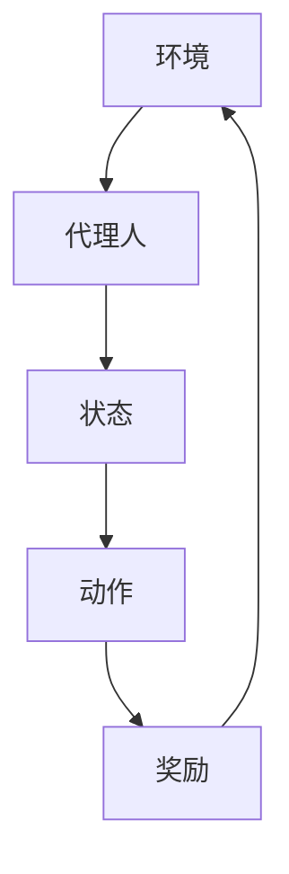

                 

关键词：深度强化学习，游戏AI，实际控制系统，算法原理，数学模型，项目实践，应用场景，未来展望。

摘要：本文将深入探讨深度强化学习（Deep Reinforcement Learning，DRL）的基本概念、核心算法原理、数学模型及其在实际控制系统中的应用。通过剖析DRL在不同领域中的实践案例，本文旨在为读者提供一个全面的理解，并探讨其未来的发展方向和挑战。

## 1. 背景介绍

随着人工智能（AI）技术的快速发展，深度学习（Deep Learning，DL）已经取得了显著成就，特别是在计算机视觉、自然语言处理等领域。然而，深度学习的局限性也逐渐显现，尤其是在需要与环境进行交互的学习任务中。这一背景下，强化学习（Reinforcement Learning，RL）作为一种重要的机器学习方法，逐渐引起了广泛关注。

强化学习是一种通过与环境交互来学习最优行为策略的机器学习方法。其核心思想是代理人（Agent）通过与环境的交互，不断调整自身的策略，以实现最大化累积奖励的目标。然而，传统的强化学习方法在处理复杂环境时面临着梯度消失、样本效率低下等问题。

为了解决这些问题，深度强化学习（Deep Reinforcement Learning，DRL）应运而生。DRL结合了深度学习和强化学习的优势，通过使用深度神经网络来近似策略和价值函数，大大提高了学习效率和效果。DRL在游戏AI、机器人控制、自动驾驶等领域展现出了巨大的潜力。

## 2. 核心概念与联系

在深入探讨DRL之前，我们需要了解几个核心概念及其相互关系。以下是DRL中的核心概念及其关联的Mermaid流程图：



### 2.1. 环境与环境状态

环境是代理人所存在的世界，可以是物理环境，也可以是虚拟环境。环境状态是描述环境当前状态的变量集合。在DRL中，环境状态通常由一系列离散或连续的变量组成。

### 2.2. 代理人与策略

代理人是我们希望训练的模型，其目标是最大化累积奖励。策略是代理人从环境中选择动作的策略函数。在DRL中，通常使用深度神经网络来近似策略函数。

### 2.3. 动作与奖励

动作是代理人根据当前环境状态所选择的行动。奖励是环境对代理人所采取的动作的反馈，用于指导代理人调整策略。

## 3. 核心算法原理 & 具体操作步骤

### 3.1 算法原理概述

DRL的核心算法是基于值函数和策略梯度方法。值函数方法通过学习一个评估函数来预测未来奖励，而策略梯度方法则直接优化策略函数。

### 3.2 算法步骤详解

DRL的训练过程通常包括以下几个步骤：

1. 初始化代理人和环境。
2. 从环境中获取初始状态。
3. 根据当前状态，使用策略函数选择动作。
4. 执行所选动作，并从环境中获取新的状态和奖励。
5. 使用新的状态和奖励更新代理人的策略。
6. 重复步骤3-5，直到满足停止条件。

### 3.3 算法优缺点

DRL的优点在于：

- 能够处理高维和复杂的环境。
- 能够通过深度神经网络实现高效的学习。

然而，DRL也存在一些缺点：

- 需要大量的训练数据和计算资源。
- 学习过程可能存在不稳定性。

### 3.4 算法应用领域

DRL在多个领域展现出了强大的应用潜力，包括：

- 游戏AI：DRL已经在游戏AI领域取得了显著成就，如Atari游戏、围棋等。
- 机器人控制：DRL可以用于机器人导航、抓取等任务。
- 自动驾驶：DRL在自动驾驶领域有着广泛的应用，如车辆控制、路径规划等。

## 4. 数学模型和公式 & 详细讲解 & 举例说明

### 4.1 数学模型构建

在DRL中，我们通常使用值函数和策略梯度方法来构建数学模型。

#### 4.1.1 值函数模型

值函数模型用于评估状态或状态-动作对的期望奖励。我们使用如下公式来表示值函数：

$$ V^*(s) = \mathbb{E}_{\pi}[G(s,a)] $$

其中，$V^*(s)$ 是在给定策略 $\pi$ 下的最优值函数，$G(s,a)$ 是从状态 $s$ 和动作 $a$ 开始的累积奖励。

#### 4.1.2 策略梯度模型

策略梯度模型用于优化策略函数。我们使用如下公式来表示策略梯度：

$$ \nabla_{\pi} J(\pi) = \nabla_{\pi} \sum_{s,a} \pi(a|s) Q^*(s,a) $$

其中，$J(\pi)$ 是策略函数的损失函数，$Q^*(s,a)$ 是在给定策略 $\pi$ 下的最优值函数。

### 4.2 公式推导过程

在这里，我们将简要介绍值函数和策略梯度公式的推导过程。

#### 4.2.1 值函数公式推导

假设我们有一个策略 $\pi$，从状态 $s$ 选择动作 $a$ 的概率为 $\pi(a|s)$。那么，从状态 $s$ 开始的累积奖励可以表示为：

$$ G(s,a) = R(s,a) + V^*(s') $$

其中，$R(s,a)$ 是立即奖励，$V^*(s')$ 是下一状态的最优值函数。

对 $G(s,a)$ 求期望，得到：

$$ \mathbb{E}_{\pi}[G(s,a)] = \sum_{s'} p(s'|s,a) V^*(s') $$

其中，$p(s'|s,a)$ 是从状态 $s$ 执行动作 $a$ 后到达状态 $s'$ 的概率。

由于策略 $\pi$ 的定义，我们有：

$$ p(s'|s,a) = \pi(a|s) p(s'|s) $$

代入上式，得到：

$$ \mathbb{E}_{\pi}[G(s,a)] = \sum_{s'} \pi(a|s) p(s'|s) V^*(s') = \sum_{s'} \pi(a|s) Q^*(s,a) $$

因此，值函数可以表示为：

$$ V^*(s) = \mathbb{E}_{\pi}[G(s,a)] = \sum_{a} \pi(a|s) Q^*(s,a) $$

#### 4.2.2 策略梯度公式推导

假设我们有一个策略 $\pi$，其损失函数可以表示为：

$$ J(\pi) = -\sum_{s,a} \pi(a|s) R(s,a) $$

我们希望使用梯度下降法来优化策略。对 $J(\pi)$ 求梯度，得到：

$$ \nabla_{\pi} J(\pi) = -\sum_{s,a} \nabla_{\pi} \pi(a|s) R(s,a) $$

由于 $R(s,a)$ 是固定的，我们可以将其看作常数。因此，梯度可以简化为：

$$ \nabla_{\pi} J(\pi) = -\sum_{s,a} \nabla_{\pi} \pi(a|s) $$

为了进一步简化，我们使用值函数 $Q^*(s,a)$ 来近似策略梯度。我们有：

$$ Q^*(s,a) = \mathbb{E}_{\pi}[G(s,a)] = \sum_{s'} \pi(a|s) p(s'|s,a) V^*(s') $$

代入策略梯度的表达式中，得到：

$$ \nabla_{\pi} J(\pi) = -\sum_{s,a} \nabla_{\pi} \pi(a|s) \left( \sum_{s'} \pi(a|s) p(s'|s,a) V^*(s') \right) $$

由于 $p(s'|s,a) = \pi(a|s) p(s'|s)$，我们可以将上式进一步简化为：

$$ \nabla_{\pi} J(\pi) = -\sum_{s,a} \nabla_{\pi} \pi(a|s) Q^*(s,a) $$

因此，策略梯度公式可以表示为：

$$ \nabla_{\pi} J(\pi) = -\sum_{s,a} \nabla_{\pi} \pi(a|s) Q^*(s,a) $$

### 4.3 案例分析与讲解

为了更好地理解DRL的数学模型，我们将通过一个简单的例子来进行讲解。

假设我们有一个简单的环境，其中代理人在一个2D空间中移动，可以选择向左、向右、向上或向下移动。代理人的目标是到达一个目标位置，并获得奖励。

#### 4.3.1 状态表示

我们将状态表示为一个向量，其中包含代理人的当前位置和目标位置。例如，状态 $(2,3)$ 表示代理人在位置 (2,3) 而目标在位置 (2,4)。

#### 4.3.2 动作表示

我们将动作表示为一个向量，其中包含代理人在当前状态下可以执行的动作。例如，动作 $(0,1)$ 表示向右移动。

#### 4.3.3 奖励函数

我们将奖励函数设置为，当代理人到达目标位置时获得 +10 的奖励，否则获得 -1 的奖励。

#### 4.3.4 策略表示

我们将策略表示为概率分布，表示代理人在给定状态下选择每个动作的概率。

现在，我们使用DRL来训练代理人的策略。我们选择深度神经网络来近似策略函数。

首先，我们初始化代理人和环境，并设置学习率、训练轮数等参数。

接下来，我们进入训练循环，每次循环包含以下步骤：

1. 从环境中获取当前状态。
2. 使用当前状态和策略函数选择动作。
3. 执行所选动作，并从环境中获取新的状态和奖励。
4. 使用新的状态和奖励更新代理人的策略。

通过多次迭代，代理人的策略会逐渐优化，使其能够更快地到达目标位置。

## 5. 项目实践：代码实例和详细解释说明

在本节中，我们将通过一个具体的代码实例来展示如何实现深度强化学习。我们将使用Python和TensorFlow来实现一个简单的基于深度Q网络的DRL算法。

### 5.1 开发环境搭建

在开始之前，我们需要搭建开发环境。以下是所需的Python包及其安装命令：

```bash
pip install tensorflow
pip install gym
```

### 5.2 源代码详细实现

以下是实现DRL的源代码：

```python
import numpy as np
import tensorflow as tf
import gym

# 设置随机种子以保证结果可重复
np.random.seed(1)
tf.set_random_seed(1)

# 创建环境
env = gym.make('CartPole-v0')

# 定义网络结构
input_shape = env.observation_space.shape
output_shape = env.action_space.n

def create_q_network(input_shape, output_shape):
    model = tf.keras.Sequential([
        tf.keras.layers.Dense(64, activation='relu', input_shape=input_shape),
        tf.keras.layers.Dense(64, activation='relu'),
        tf.keras.layers.Dense(output_shape, activation='linear')
    ])

    model.compile(optimizer=tf.keras.optimizers.Adam(learning_rate=0.001),
                  loss='mse')
    return model

# 创建Q网络
q_network = create_q_network(input_shape, output_shape)

# 训练Q网络
episodes = 1000
max_steps = 200
learning_rate = 0.001
gamma = 0.99
epsilon = 1.0

for episode in range(episodes):
    state = env.reset()
    done = False
    total_reward = 0

    while not done:
        if np.random.rand() < epsilon:
            action = env.action_space.sample()
        else:
            action = np.argmax(q_network.predict(state.reshape(-1, input_shape[0]))[0])

        next_state, reward, done, _ = env.step(action)
        total_reward += reward

        target = reward + gamma * np.max(q_network.predict(next_state.reshape(-1, input_shape[0]))[0])
        q_values = q_network.predict(state.reshape(-1, input_shape[0]))[0]
        q_values[action] = target

        q_network.fit(state.reshape(-1, input_shape[0]), q_values, epochs=1, verbose=0)

        state = next_state

    print(f"Episode {episode+1}, Total Reward: {total_reward}, Epsilon: {epsilon}")

    if episode > 100 and epsilon > 0.01:
        epsilon *= 0.99

# 关闭环境
env.close()
```

### 5.3 代码解读与分析

下面是对代码的详细解读和分析：

1. 导入所需的库和模块。
2. 设置随机种子以保证结果可重复。
3. 创建环境`CartPole-v0`，这是一个经典的强化学习环境。
4. 定义网络结构，我们使用一个简单的全连接网络来近似Q值函数。
5. 编译Q网络，使用MSE作为损失函数，Adam优化器。
6. 设置训练参数，包括训练轮数、最大步数、学习率和折扣因子。
7. 进入训练循环，对每个训练轮执行以下步骤：
   - 重置环境并获取初始状态。
   - 判断是否进行随机行动，以增加探索。
   - 执行所选动作，获取新的状态和奖励。
   - 更新Q值函数。
   - 打印训练结果。
8. 关闭环境。

通过这个简单的实例，我们可以看到如何使用深度强化学习来训练代理人在一个简单的环境中完成任务。

## 6. 实际应用场景

深度强化学习（DRL）在多个实际应用场景中取得了显著成果，以下是一些典型的应用领域：

### 6.1 游戏AI

DRL在游戏AI领域的应用最为广泛，从简单的Atari游戏到复杂的棋类游戏，如围棋和将棋，DRL都展现出了强大的能力。著名的AlphaGo就是基于DRL算法的，它在2016年击败了世界围棋冠军李世石，引起了广泛关注。

### 6.2 机器人控制

DRL在机器人控制中的应用也非常广泛，包括机器人导航、抓取和运动控制等。例如，使用DRL算法训练的机器人能够在复杂环境中进行自主导航，实现高效的路径规划和决策。

### 6.3 自动驾驶

自动驾驶是DRL的重要应用领域之一。DRL算法能够处理复杂的交通环境和动态场景，实现自动驾驶车辆的自主决策和路径规划。谷歌的Waymo自动驾驶项目就使用了DRL算法来优化车辆的控制策略。

### 6.4 电子商务推荐系统

DRL在电子商务推荐系统中的应用同样值得关注。通过分析用户的行为数据，DRL算法可以动态调整推荐策略，提高推荐系统的效果和用户体验。

### 6.5 金融服务

在金融服务领域，DRL算法可以用于风险管理、交易策略优化等。通过分析市场数据和交易行为，DRL算法能够实现高效的交易策略，提高投资收益。

### 6.6 健康医疗

DRL在健康医疗领域的应用也越来越受到关注。通过分析患者数据和医疗记录，DRL算法可以用于疾病预测、个性化治疗方案推荐等，提高医疗服务的质量和效率。

## 7. 工具和资源推荐

为了更好地学习和实践深度强化学习，以下是一些推荐的工具和资源：

### 7.1 学习资源推荐

- 《深度强化学习》(Deep Reinforcement Learning) by David Silver
- 《强化学习手册》(Reinforcement Learning: An Introduction) by Richard S. Sutton and Andrew G. Barto
- 《深度强化学习实战》(Practical Deep Reinforcement Learning) by Adam White

### 7.2 开发工具推荐

- TensorFlow：用于构建和训练深度强化学习模型。
- PyTorch：另一个流行的深度学习框架，也支持深度强化学习。
- OpenAI Gym：提供各种经典强化学习环境的Python库。

### 7.3 相关论文推荐

- "Deep Q-Network" by V. Mnih et al. (2015)
- "Human-level control through deep reinforcement learning" by D. Silver et al. (2016)
- "Deep Reinforcement Learning for Robotics: Comparing Approach Based on Deep Neural Networks and Tree Search" by T. Hori et al. (2017)

## 8. 总结：未来发展趋势与挑战

深度强化学习（DRL）作为一种新兴的人工智能技术，已经在多个领域取得了显著成果。然而，DRL的发展仍然面临一些挑战和机遇。

### 8.1 研究成果总结

- DRL在游戏AI、机器人控制、自动驾驶等领域展现出了强大的应用潜力。
- DRL通过结合深度学习和强化学习的优势，实现了高效的学习和决策。
- DRL在解决复杂、动态环境中的任务时具有显著优势。

### 8.2 未来发展趋势

- DRL将继续在游戏AI、机器人控制、自动驾驶等领域深化应用。
- DRL算法将不断优化，以提高样本效率和稳定性。
- DRL与其他人工智能技术的融合将带来更多创新应用。

### 8.3 面临的挑战

- DRL的训练过程需要大量的计算资源和数据，如何优化训练效率是一个重要挑战。
- DRL算法在处理高维和动态环境时可能存在不稳定性和梯度消失问题。
- DRL的安全性和可解释性仍然是亟待解决的问题。

### 8.4 研究展望

- 研究者将致力于开发更高效、更稳定的DRL算法。
- DRL与其他人工智能技术的融合将推动新的应用场景的出现。
- DRL将更加深入地应用于实际系统中，提高各领域的效率和效益。

## 9. 附录：常见问题与解答

### 9.1 Q：DRL与传统强化学习有什么区别？

A：DRL与传统强化学习（RL）的主要区别在于，DRL使用深度神经网络来近似策略和价值函数，从而能够处理高维和复杂的环境。传统RL通常使用简单的决策规则或基于模型的策略，难以应对复杂的环境。

### 9.2 Q：DRL算法的缺点有哪些？

A：DRL算法的缺点主要包括：
- 训练过程需要大量的计算资源和数据。
- 学习过程可能存在不稳定性和梯度消失问题。
- DRL算法的安全性和可解释性仍然是亟待解决的问题。

### 9.3 Q：如何优化DRL算法的训练效率？

A：优化DRL算法的训练效率可以从以下几个方面入手：
- 使用有效的数据预处理和增强技术，提高样本效率。
- 采用并行计算和分布式训练，加快训练速度。
- 优化网络结构和超参数，减少计算复杂度。

### 9.4 Q：DRL算法在哪些领域有潜在的应用前景？

A：DRL算法在多个领域有潜在的应用前景，包括游戏AI、机器人控制、自动驾驶、电子商务推荐系统、金融服务和健康医疗等。随着技术的不断进步，DRL将在更多领域中发挥作用。

----------------------------------------------------------------

以上是完整的文章内容，感谢您的阅读。希望本文能为读者提供关于深度强化学习的全面理解，并激发对这一领域的兴趣和探索。作者：禅与计算机程序设计艺术 / Zen and the Art of Computer Programming。

