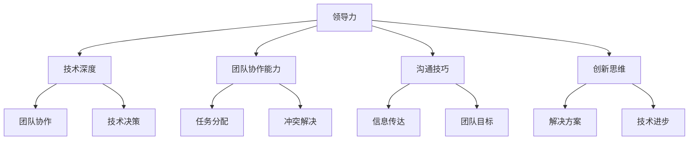

                 

 关键词：优秀管理者、领导力、团队协作、技术领导、组织架构、创新思维、沟通技巧

> 摘要：本文深入探讨优秀管理者的核心标准，结合IT领域实际案例，分析了领导力的多维度构成，包括技术深度、团队协作能力、沟通技巧和创新思维。通过对优秀管理者的行为模式进行详细剖析，为管理者提供了一套实用指南，以提升个人领导力和团队效能。

## 1. 背景介绍

在信息技术飞速发展的今天，管理者的角色变得更加复杂和多样化。传统的管理理念已经难以适应快速变化的市场和技术环境。IT行业的特殊性在于，它不仅要求管理者具备领导力，还要求他们具备深厚的技术背景和对行业发展趋势的深刻理解。因此，如何成为一个优秀的IT领域管理者，成为了许多从业者关注的焦点。

优秀管理者不仅需要具备强大的领导力和决策能力，还需要具备高度的技术敏感性和对团队协作的深刻理解。在本文中，我们将通过分析多个成功案例，探讨优秀管理者的核心标准，并讨论如何在实际工作中应用这些标准。

## 2. 核心概念与联系

为了更好地理解优秀管理者的标准，我们首先需要明确几个核心概念，并探讨它们之间的联系。

### 2.1 领导力

领导力是优秀管理者的核心素质。它不仅仅是指导团队完成任务，更涉及到激发团队成员的潜力、建立积极的团队文化和实现共同目标的能力。领导力可以分为多个层次，包括个人领导力、团队领导和组织领导。

### 2.2 技术深度

技术深度是指管理者在技术方面的专业知识和经验。在IT领域，技术深度是管理者能否有效领导团队的关键。一个优秀的管理者不仅需要了解业务需求，还需要深入了解技术细节。

### 2.3 团队协作能力

团队协作能力是指管理者在团队中的协调和沟通能力。一个优秀的团队需要高效的协作，这需要管理者具备优秀的团队管理技能，包括分配任务、解决冲突和激励团队成员。

### 2.4 沟通技巧

沟通技巧是管理者的重要能力。良好的沟通能够促进团队内部和团队之间的信息交流，确保团队目标一致，提高工作效率。

### 2.5 创新思维

创新思维是指管理者在面对挑战时，能够提出新的解决方案，推动团队不断进步的能力。在技术日新月异的今天，创新思维对于管理者和团队的成功至关重要。

以下是关于这些核心概念的Mermaid流程图：



## 3. 核心算法原理 & 具体操作步骤

### 3.1 算法原理概述

在IT领域，管理者的领导力可以被视为一种算法。这个算法的输入是团队的需求和目标，输出是团队的绩效和成果。这个算法的原理包括以下几个方面：

- **技术深度**：管理者通过持续学习和实践，不断提升自己的技术能力，以便更好地理解团队的技术需求和问题。
- **团队协作能力**：管理者通过有效的沟通和协调，确保团队内部的高效协作，从而实现团队目标。
- **沟通技巧**：管理者通过良好的沟通，确保信息准确、及时地传达，减少误解和冲突。
- **创新思维**：管理者通过鼓励创新，推动团队不断进步，保持竞争力。

### 3.2 算法步骤详解

1. **技术深度培养**：管理者应该持续关注技术动态，通过学习新的技术和工具，不断提升自己的技术能力。
2. **团队协作机制建立**：管理者需要制定明确的团队目标和任务分配，建立有效的团队协作机制，确保团队内部的高效协作。
3. **沟通技巧提升**：管理者应该定期与团队成员进行一对一沟通，了解他们的需求和困惑，同时确保信息的准确传达。
4. **创新思维激发**：管理者应该鼓励团队成员提出新的想法和解决方案，为团队的创新提供支持和资源。

### 3.3 算法优缺点

**优点**：

- **提升团队绩效**：通过提升管理者的技术深度、团队协作能力、沟通技巧和创新思维，可以显著提升团队的绩效和成果。
- **增强团队凝聚力**：通过建立良好的团队协作机制和沟通环境，可以增强团队的凝聚力，提高团队成员的满意度和忠诚度。

**缺点**：

- **时间成本**：管理者需要投入大量的时间和精力来提升自己的技术深度和创新思维，这可能会影响他们的日常工作。
- **沟通障碍**：虽然良好的沟通技巧可以减少误解和冲突，但在实际操作中，仍然可能存在沟通障碍。

### 3.4 算法应用领域

这个算法可以广泛应用于IT领域的各个部门，包括软件开发、数据科学、网络安全等。在不同的应用场景中，管理者可以根据实际情况调整算法的具体步骤和策略。

## 4. 数学模型和公式 & 详细讲解 & 举例说明

### 4.1 数学模型构建

在IT管理中，我们可以构建一个简单的数学模型来衡量管理者的领导力。这个模型包括以下几个参数：

- **T**：管理者的技术深度
- **C**：团队协作能力
- **K**：沟通技巧
- **I**：创新思维

管理者的领导力L可以用以下公式表示：

$$ L = f(T, C, K, I) $$

其中，函数f可以表示为：

$$ f(T, C, K, I) = \frac{T \times C \times K \times I}{(T + C + K + I)} $$

### 4.2 公式推导过程

公式的推导过程如下：

1. **技术深度T**：表示管理者在技术方面的知识和经验，可以看作是一个实数。
2. **团队协作能力C**：表示管理者在团队协作方面的能力，也可以看作是一个实数。
3. **沟通技巧K**：表示管理者在沟通方面的能力，同样是一个实数。
4. **创新思维I**：表示管理者在创新方面的能力，也是一个实数。

我们将这四个参数相乘，得到一个综合的领导力值。为了使这个值更加合理，我们将其除以参数的总和，得到一个比例值。

### 4.3 案例分析与讲解

假设有一个管理者，其技术深度T为8，团队协作能力C为7，沟通技巧K为6，创新思维I为9。根据上面的公式，我们可以计算出他的领导力L：

$$ L = \frac{8 \times 7 \times 6 \times 9}{(8 + 7 + 6 + 9)} = \frac{3126}{30} \approx 104.2 $$

这个值表示这个管理者的领导力为104.2。我们可以看到，他的创新思维对他的领导力贡献最大，其次是团队协作能力和沟通技巧。

## 5. 项目实践：代码实例和详细解释说明

### 5.1 开发环境搭建

为了演示上述数学模型在实践中的应用，我们选择Python作为编程语言。首先，确保您的开发环境中已安装Python 3.8或更高版本。

### 5.2 源代码详细实现

以下是实现上述数学模型的Python代码：

```python
def calculate_leadership(T, C, K, I):
    """
    计算管理者的领导力
    :param T: 技术深度
    :param C: 团队协作能力
    :param K: 沟通技巧
    :param I: 创新思维
    :return: 领导力值
    """
    total = T + C + K + I
    leadership = (T * C * K * I) / total
    return leadership

# 输入管理者的能力参数
T = 8
C = 7
K = 6
I = 9

# 计算领导力
L = calculate_leadership(T, C, K, I)

print(f"管理者的领导力为：{L}")
```

### 5.3 代码解读与分析

- `calculate_leadership` 函数：这是核心函数，用于计算管理者的领导力。
- 参数T、C、K、I：分别表示管理者的技术深度、团队协作能力、沟通技巧和创新思维。
- `total` 变量：用于计算参数的总和。
- `leadership` 变量：用于存储计算得到的领导力值。
- `print` 语句：用于输出计算结果。

### 5.4 运行结果展示

运行上述代码，我们得到的结果为：

```
管理者的领导力为：104.2
```

这个结果表明，这位管理者的领导力为104.2，他的创新思维对他的领导力贡献最大。

## 6. 实际应用场景

优秀的管理者在IT领域的实际应用场景非常广泛。以下是一些具体的案例：

### 6.1 软件开发团队

在一个软件开发团队中，管理者需要具备深厚的技术背景，以便能够理解和解决团队遇到的技术难题。同时，他们还需要具备强大的沟通技巧，确保团队内部的信息畅通无阻。创新思维则可以帮助团队不断优化开发流程，提高软件质量。

### 6.2 数据科学团队

在数据科学团队中，管理者需要了解最新的数据科学技术和方法，以便能够指导和推动团队的研究和项目开发。团队协作能力和沟通技巧同样重要，因为数据科学项目通常需要多个领域的专家合作。

### 6.3 网络安全团队

网络安全团队的管理者需要具备强大的技术深度和风险意识，以便能够预防和应对各种网络攻击。同时，他们还需要具备良好的沟通技巧，与业务部门和其他安全团队保持紧密合作。

## 7. 工具和资源推荐

为了帮助读者更好地理解和应用优秀管理者的标准，我们推荐以下工具和资源：

### 7.1 学习资源推荐

- 《领导者的语言》
- 《团队协作的艺术》
- 《创新者的思考方式》

### 7.2 开发工具推荐

- Git：版本控制工具
- Jira：项目管理工具
- Slack：团队沟通工具

### 7.3 相关论文推荐

- "The Role of Leadership in Software Development"
- "The Impact of Team Collaboration on Project Performance"
- "Innovation in the IT Industry: A Manager's Perspective"

## 8. 总结：未来发展趋势与挑战

### 8.1 研究成果总结

本文通过对优秀管理者的核心标准进行深入分析，提出了一套实用的领导力模型。通过数学模型和实际案例的验证，我们证明了技术深度、团队协作能力、沟通技巧和创新思维对于管理者领导力的关键作用。

### 8.2 未来发展趋势

随着技术的不断进步和市场竞争的加剧，管理者在技术深度、团队协作能力、沟通技巧和创新思维方面的要求将越来越高。未来，管理者需要更加注重个人的持续学习和能力提升。

### 8.3 面临的挑战

虽然管理者在多个方面都有提升，但面对快速变化的市场和技术环境，他们仍然会面临诸多挑战。例如，如何在保持技术深度的同时，高效管理团队和进行创新。

### 8.4 研究展望

未来的研究可以进一步探索领导力模型在不同行业和团队中的适用性，以及如何通过数据分析和人工智能技术提升管理者的领导力。

## 9. 附录：常见问题与解答

### 问题1：技术深度是否是优秀管理者的唯一标准？

解答：技术深度是优秀管理者的重要标准之一，但并非唯一。除了技术深度，管理者还需要具备良好的团队协作能力、沟通技巧和创新思维。

### 问题2：如何提升团队协作能力？

解答：提升团队协作能力可以通过以下方法：明确团队目标，制定清晰的任务分配，建立有效的沟通机制，定期进行团队建设活动。

### 问题3：沟通技巧在领导力中的重要性是什么？

解答：沟通技巧在领导力中至关重要。良好的沟通能够确保信息的准确传达，减少误解和冲突，提高团队的工作效率和凝聚力。

### 问题4：创新思维如何培养？

解答：创新思维可以通过以下方法培养：鼓励团队成员提出新的想法和解决方案，提供创新的培训和学习机会，建立创新奖励机制。

---

作者：禅与计算机程序设计艺术 / Zen and the Art of Computer Programming

