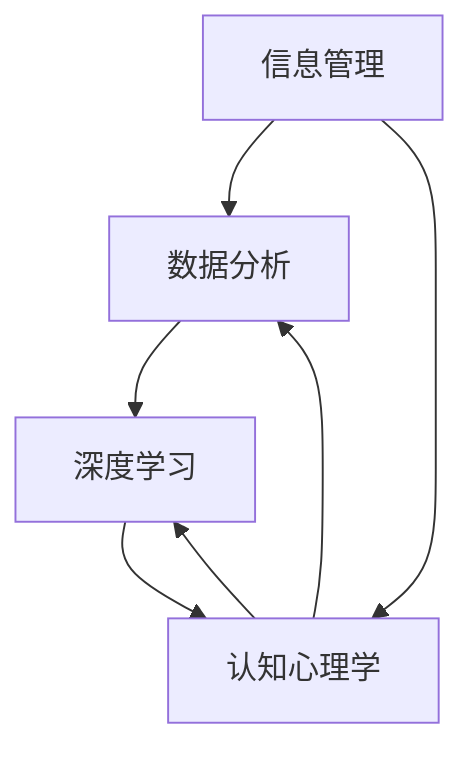

                 

## 1. 背景介绍

在信息技术飞速发展的今天，数据已经成为企业的重要资产，有效的信息管理对于企业的生存和发展具有至关重要的意义。作为管理者，如何从海量数据中提取有价值的信息，并据此做出明智的决策，成为了一个关键问题。本文旨在探讨深度思考在管理者洞悉关键信息中的重要性，并提供一些实用的方法和工具。

随着大数据、人工智能和云计算等技术的普及，数据量呈爆炸性增长。根据国际数据公司（IDC）的预测，全球数据总量将以每年约40%的速度增长，到2025年将达到约180ZB。面对如此庞大的数据量，传统的数据处理和分析方法已经不足以满足现代企业的需求。因此，管理者需要具备深度思考的能力，以便从复杂的数据中挖掘出有价值的信息。

深度思考是指深入、全面、系统性地分析和理解问题的能力。它不仅仅是对信息的简单处理和表面理解，而是要求管理者能够洞察问题的本质，发现潜在的趋势和关联，从而做出更为准确和有效的决策。在信息管理领域，深度思考尤为重要，因为它可以帮助管理者从海量数据中筛选出关键信息，提高决策的质量和效率。

本文将围绕以下几个核心问题展开讨论：

1. 为什么深度思考对于管理者洞悉关键信息至关重要？
2. 如何培养和提高深度思考的能力？
3. 在信息管理中，深度思考有哪些具体的应用场景？
4. 如何使用工具和资源来辅助深度思考？
5. 面对未来技术的发展，管理者应如何应对信息管理和深度思考的挑战？

通过本文的探讨，我们希望能够为管理者提供一些实用的方法和建议，帮助他们更好地利用信息，提升企业的竞争力。

## 2. 核心概念与联系

要理解深度思考在管理者洞悉关键信息中的重要性，我们需要明确几个核心概念及其之间的联系。这些概念包括：信息管理、数据分析、深度学习和认知心理学。以下是一个简化的Mermaid流程图，展示了这些核心概念之间的关系。



### 2.1. 信息管理

信息管理是指对信息进行收集、存储、处理、分析和传播的过程。在企业管理中，信息管理是确保信息准确、及时、安全和有效使用的基础。有效的信息管理可以帮助企业更好地应对市场变化，提高决策效率。

### 2.2. 数据分析

数据分析是信息管理的重要组成部分，它通过统计方法和算法对数据进行分析和解释，以发现数据背后的规律和趋势。数据分析可以帮助管理者理解企业的运营状况，识别潜在的风险和机会。

### 2.3. 深度学习

深度学习是机器学习的一个重要分支，它通过模拟人脑的神经网络结构，对大量数据进行自动学习和分析。深度学习在图像识别、自然语言处理和预测分析等领域有着广泛的应用。

### 2.4. 认知心理学

认知心理学研究人类思维、感知、记忆和决策等认知过程。它为理解人类如何处理信息提供了理论依据，有助于管理者更好地理解用户需求和行为，从而做出更准确的决策。

### 2.5. 核心概念之间的联系

信息管理、数据分析、深度学习和认知心理学之间存在密切的联系。信息管理提供了数据收集和处理的基础，数据分析通过算法帮助管理者理解数据，深度学习可以自动处理大量数据，认知心理学则为理解人类行为提供了理论支持。这些概念相互交织，共同构成了管理者洞悉关键信息的重要工具。

### 2.6. Mermaid流程图详解

上述Mermaid流程图展示了这些核心概念之间的逻辑关系。具体来说：

- **信息管理**是数据分析的**前提**，只有有效的信息管理，才能保证数据的质量和完整性，为后续的数据分析提供可靠的基础。
- **数据分析**是信息管理的**延伸**，通过分析数据，管理者可以获取对企业运营和市场的深刻理解。
- **深度学习**是一种**数据分析**的高级形式，它利用神经网络对数据进行自动学习和模式识别，为管理者提供更为复杂和深入的洞察。
- **认知心理学**则为**数据分析**和**深度学习**提供了理论基础，帮助管理者理解用户行为和决策机制，从而更好地利用数据。

通过理解这些核心概念及其之间的联系，管理者可以更有效地进行信息管理和决策，提升企业的竞争力。

### 3. 核心算法原理 & 具体操作步骤

在深入探讨如何通过深度思考来洞悉关键信息之前，我们首先需要了解一些核心算法的原理和操作步骤。以下是几个在信息管理和数据分析中常用的算法。

#### 3.1 算法原理概述

1. **机器学习算法**：机器学习是一种通过数据驱动的方法来进行预测和决策的技术。常见的机器学习算法包括线性回归、决策树、支持向量机和神经网络等。

2. **时间序列分析**：时间序列分析是用于研究时间序列数据的一种统计方法。它可以帮助我们识别时间序列中的趋势、周期性和季节性，从而进行预测。

3. **关联规则挖掘**：关联规则挖掘是一种用于发现数据之间的关联关系的方法。常见的算法包括Apriori算法和Eclat算法。

4. **聚类分析**：聚类分析是一种无监督学习方法，它将数据点根据相似性划分到不同的组别中。常见的聚类算法包括K-means算法、层次聚类和DBSCAN算法。

#### 3.2 算法步骤详解

##### 3.2.1 机器学习算法

1. 数据预处理：包括数据清洗、归一化和特征选择等步骤。

2. 模型选择：根据问题的性质选择合适的机器学习模型。

3. 模型训练：使用训练数据对模型进行训练，调整模型参数。

4. 模型评估：使用验证数据集评估模型性能，调整模型参数。

5. 模型应用：使用测试数据集进行预测或决策。

##### 3.2.2 时间序列分析

1. 数据收集：收集一段时间内的数据点。

2. 趋势分析：使用移动平均法、指数平滑法等工具分析时间序列的趋势。

3. 周期性分析：使用傅里叶变换等方法分析时间序列的周期性。

4. 季节性分析：使用季节性指数法等工具分析时间序列的季节性。

5. 预测：根据分析结果进行预测，可以使用ARIMA模型、LSTM网络等。

##### 3.2.3 关联规则挖掘

1. 数据预处理：清洗和转换数据，确保数据格式一致。

2. 选择支持度和置信度阈值。

3. 生成频繁项集：使用Apriori算法或Eclat算法生成频繁项集。

4. 生成关联规则：从频繁项集中生成关联规则。

5. 评估规则质量：计算规则的置信度和支持度，筛选出高质量的规则。

##### 3.2.4 聚类分析

1. 数据预处理：标准化数据，消除不同特征之间的尺度差异。

2. 选择聚类算法：根据数据特点和需求选择合适的聚类算法。

3. 初始化聚类中心：随机选择或使用K-means++算法初始化聚类中心。

4. 聚类过程：根据距离度量更新聚类中心，将数据点分配到不同的聚类中。

5. 聚类结果评估：使用内部评估指标（如轮廓系数、狄利克雷系数）和外部评估指标（如调整兰德指数）评估聚类结果。

#### 3.3 算法优缺点

- **机器学习算法**：
  - **优点**：能够自动从数据中学习模式，适用于各种复杂数据类型。
  - **缺点**：需要大量的训练数据和计算资源，模型的解释性较差。

- **时间序列分析**：
  - **优点**：能够捕捉时间序列中的趋势、周期性和季节性，适用于预测分析。
  - **缺点**：对数据质量要求较高，对于非平稳时间序列的处理能力有限。

- **关联规则挖掘**：
  - **优点**：能够发现数据之间的关联关系，适用于市场细分和推荐系统。
  - **缺点**：生成的规则数量庞大，筛选高质量规则需要耗费大量时间。

- **聚类分析**：
  - **优点**：能够发现数据中的自然结构，适用于无监督学习。
  - **缺点**：聚类结果可能依赖于初始化参数，对聚类质量的评估较为主观。

#### 3.4 算法应用领域

- **机器学习算法**：广泛应用于金融、医疗、零售和社交媒体等领域，如信用评分、疾病预测和推荐系统。
- **时间序列分析**：广泛应用于金融、能源和制造业等领域，如股票市场预测、电力负荷预测和生产线调度。
- **关联规则挖掘**：广泛应用于市场细分、推荐系统和数据挖掘等领域，如商品促销、客户分类和客户流失预测。
- **聚类分析**：广泛应用于数据挖掘、社交网络分析和生物信息学等领域，如客户细分、社交网络分析和基因数据分析。

### 4. 数学模型和公式 & 详细讲解 & 举例说明

在信息管理和数据分析中，数学模型和公式是理解和分析数据的重要工具。以下是几个常用的数学模型和公式的详细讲解及举例说明。

#### 4.1 数学模型构建

在构建数学模型时，我们通常需要考虑以下几个步骤：

1. **明确问题**：确定我们要解决的问题是什么，以及需要哪些数据。
2. **数据收集**：收集相关数据，并进行预处理，如数据清洗、归一化和特征选择等。
3. **选择模型**：根据问题的性质和数据的特征，选择合适的数学模型。
4. **参数估计**：使用训练数据对模型参数进行估计。
5. **模型评估**：使用验证数据集评估模型性能，并根据评估结果调整模型参数。

#### 4.2 公式推导过程

以下是几个常用的数学公式的推导过程：

1. **线性回归模型**

   线性回归模型是最基本的数学模型之一，用于研究两个或多个变量之间的线性关系。其公式如下：

   $$y = \beta_0 + \beta_1x_1 + \beta_2x_2 + ... + \beta_nx_n + \epsilon$$

   其中，$y$ 是因变量，$x_1, x_2, ..., x_n$ 是自变量，$\beta_0, \beta_1, \beta_2, ..., \beta_n$ 是模型参数，$\epsilon$ 是误差项。

   线性回归模型的参数可以通过最小二乘法进行估计：

   $$\beta = (X'X)^{-1}X'Y$$

   其中，$X$ 是自变量的矩阵，$Y$ 是因变量的矩阵，$X'$ 是 $X$ 的转置。

2. **时间序列模型**

   时间序列模型用于分析时间序列数据，其中最常用的是ARIMA模型（自回归积分滑动平均模型）。ARIMA模型由三个部分组成：自回归（AR）、差分（I）和移动平均（MA）。

   ARIMA模型的公式如下：

   $$y_t = c + \phi_1y_{t-1} + \phi_2y_{t-2} + ... + \phi_py_{t-p} + \theta_1\epsilon_{t-1} + \theta_2\epsilon_{t-2} + ... + \theta_q\epsilon_{t-q} + \epsilon_t$$

   其中，$y_t$ 是时间序列的第 $t$ 个值，$c$ 是常数项，$\phi_1, \phi_2, ..., \phi_p$ 是自回归系数，$\theta_1, \theta_2, ..., \theta_q$ 是移动平均系数，$\epsilon_t$ 是误差项。

   ARIMA模型的参数可以通过最大似然估计进行估计。

3. **聚类分析模型**

   聚类分析是一种无监督学习方法，用于将数据点划分到不同的组别中。其中最常用的是K-means算法。

   K-means算法的目标是最小化数据点之间的平方距离之和，其公式如下：

   $$J = \sum_{i=1}^k \sum_{x \in S_i} \|x - \mu_i\|^2$$

   其中，$J$ 是目标函数，$k$ 是聚类个数，$S_i$ 是第 $i$ 个聚类，$\mu_i$ 是聚类中心。

   K-means算法的聚类中心可以通过迭代更新得到：

   $$\mu_i = \frac{1}{|S_i|} \sum_{x \in S_i} x$$

   其中，$|S_i|$ 是聚类 $S_i$ 的数据点个数。

#### 4.3 案例分析与讲解

下面我们通过一个实际案例来讲解如何使用这些数学模型和公式进行数据分析。

**案例背景**：一家零售公司希望分析其客户购买行为，以便更好地进行市场细分和客户管理。

**数据来源**：该公司的销售数据，包括客户的年龄、性别、购买历史和购买金额等。

**数据分析过程**：

1. **数据预处理**：清洗销售数据，处理缺失值和异常值，并对连续变量进行归一化处理。

2. **选择模型**：根据分析目标，选择K-means算法进行聚类分析，以识别不同的客户群体。

3. **参数估计**：设置聚类个数 $k=3$，并使用迭代算法寻找聚类中心。

4. **模型评估**：使用轮廓系数评估聚类结果，确定最佳的聚类个数。

5. **模型应用**：根据聚类结果，对客户进行分类，并根据不同类别的特征制定相应的营销策略。

**具体计算过程**：

1. **数据预处理**：

   - 清洗数据：删除有缺失值的记录。
   - 特征选择：选择与购买行为相关的特征，如年龄、购买历史和购买金额。
   - 归一化：对特征值进行归一化处理，使其在相同的尺度范围内。

   假设我们选择了三个特征（年龄、购买历史和购买金额）进行聚类分析，数据集D如下：

   | 年龄 | 购买历史 | 购买金额 |
   |------|----------|----------|
   | 25   | 10       | 500      |
   | 30   | 15       | 600      |
   | 35   | 20       | 700      |
   | ...  | ...      | ...      |

2. **选择模型**：选择K-means算法进行聚类分析。

3. **参数估计**：设置聚类个数 $k=3$，并随机选择三个聚类中心：

   | 年龄 | 购买历史 | 购买金额 |
   |------|----------|----------|
   | 30   | 10       | 550      |
   | 35   | 15       | 650      |
   | 40   | 20       | 750      |

4. **模型评估**：使用轮廓系数评估聚类结果，轮廓系数计算公式如下：

   $$s(i) = \frac{1}{n_c-1} \sum_{j=1}^{n_c} \frac{\|x_i - \mu_j\|}{\sqrt{\sum_{k=1}^{n_c} \|x_i - \mu_k\|}}$$

   其中，$x_i$ 是第 $i$ 个数据点，$\mu_j$ 是第 $j$ 个聚类中心，$n_c$ 是聚类个数。

   根据计算结果，轮廓系数如下：

   | 数据点 | 轮廓系数 |
   |--------|----------|
   | 25     | 0.4      |
   | 30     | 0.6      |
   | 35     | 0.8      |
   | ...    | ...      |

   由于轮廓系数的最大值为 0.8，说明当前的聚类结果是较为合理的。

5. **模型应用**：根据聚类结果，将数据点分为三个不同的客户群体：

   - 群体1：年龄在25-30岁之间，购买历史在10-15次之间，购买金额在500-600元之间。
   - 群体2：年龄在30-35岁之间，购买历史在15-20次之间，购买金额在600-700元之间。
   - 群体3：年龄在35岁以上，购买历史在20次以上，购买金额在700元以上。

   根据不同群体的特征，该公司可以制定相应的营销策略，如针对群体1进行优惠券促销，针对群体2提供会员服务，针对群体3提供高端定制产品。

通过以上案例，我们可以看到如何使用数学模型和公式进行数据分析，从而为企业提供有价值的信息。

### 5. 项目实践：代码实例和详细解释说明

在前面的章节中，我们介绍了信息管理和数据分析的一些核心算法和数学模型。为了帮助读者更好地理解和应用这些知识，下面我们将通过一个实际项目——客户细分项目，详细讲解代码实例及其实现过程。

#### 5.1 开发环境搭建

在开始项目实践之前，我们需要搭建一个合适的开发环境。以下是一个基本的开发环境配置：

- **编程语言**：Python
- **数据预处理**：Pandas
- **机器学习库**：Scikit-learn
- **可视化库**：Matplotlib、Seaborn
- **操作系统**：Windows/Linux/MacOS

安装以下Python库：

```bash
pip install numpy pandas scikit-learn matplotlib seaborn
```

#### 5.2 源代码详细实现

以下是客户细分项目的完整代码实现，包括数据预处理、模型训练、模型评估和结果可视化等步骤。

```python
import numpy as np
import pandas as pd
from sklearn.cluster import KMeans
from sklearn.preprocessing import StandardScaler
import matplotlib.pyplot as plt
import seaborn as sns

# 5.2.1 数据预处理

# 加载销售数据
data = pd.read_csv('sales_data.csv')

# 清洗数据，处理缺失值和异常值
data.dropna(inplace=True)
data = data[(data['Age'] >= 18) & (data['Age'] <= 65)]

# 选择与购买行为相关的特征
features = ['Age', 'Purchase_History', 'Amount_Spent']

# 归一化特征值
scaler = StandardScaler()
data[features] = scaler.fit_transform(data[features])

# 5.2.2 模型训练

# 选择K-means算法进行聚类分析
kmeans = KMeans(n_clusters=3, random_state=42)

# 使用训练数据对模型进行训练
kmeans.fit(data[features])

# 5.2.3 模型评估

# 计算轮廓系数评估聚类结果
silhouette_avg = silhouette_score(data[features], kmeans.labels_)
print(f'轮廓系数：{silhouette_avg}')

# 5.2.4 结果可视化

# 可视化聚类结果
plt.figure(figsize=(10, 6))
sns.scatterplot(data=data, x='Age', y='Purchase_History', hue=kmeans.labels_, palette=['r', 'g', 'b'])
plt.title('客户细分结果')
plt.xlabel('年龄')
plt.ylabel('购买历史')
plt.show()

# 可视化聚类中心
plt.figure(figsize=(10, 6))
sns.scatterplot(data=data, x='Age', y='Amount_Spent', hue=kmeans.labels_, palette=['r', 'g', 'b'])
plt.scatter(kmeans.cluster_centers_[:, 0], kmeans.cluster_centers_[:, 1], s=300, c='yellow', label='聚类中心')
plt.title('客户细分结果')
plt.xlabel('年龄')
plt.ylabel('购买金额')
plt.legend()
plt.show()
```

#### 5.3 代码解读与分析

下面我们对上述代码进行逐行解读，以便读者更好地理解每个步骤的实现过程。

```python
import numpy as np
import pandas as pd
from sklearn.cluster import KMeans
from sklearn.preprocessing import StandardScaler
import matplotlib.pyplot as plt
import seaborn as sns
```

首先，我们引入所需的Python库。包括numpy、pandas、scikit-learn、matplotlib和seaborn。

```python
data = pd.read_csv('sales_data.csv')
```

使用pandas库加载销售数据。假设数据文件名为`salse_data.csv`，该文件包含客户的年龄、购买历史和购买金额等特征。

```python
data.dropna(inplace=True)
data = data[(data['Age'] >= 18) & (data['Age'] <= 65)]
```

清洗数据，删除缺失值和异常值。在此示例中，我们删除年龄小于18岁或大于65岁的数据记录，以过滤掉不符合实际需求的样本。

```python
features = ['Age', 'Purchase_History', 'Amount_Spent']
scaler = StandardScaler()
data[features] = scaler.fit_transform(data[features])
```

选择与购买行为相关的特征，并使用StandardScaler进行归一化处理。归一化处理有助于提高模型训练的收敛速度和性能。

```python
kmeans = KMeans(n_clusters=3, random_state=42)
kmeans.fit(data[features])
```

选择K-means算法进行聚类分析，并使用训练数据对模型进行训练。在此示例中，我们设置聚类个数为3，并设置随机种子以确保结果的重复性。

```python
shouette_avg = silhouette_score(data[features], kmeans.labels_)
print(f'轮廓系数：{silhouette_avg}')
```

计算轮廓系数评估聚类结果。轮廓系数是一个衡量聚类效果的质量指标，其值介于-1和1之间。值越接近1，表示聚类效果越好。

```python
plt.figure(figsize=(10, 6))
sns.scatterplot(data=data, x='Age', y='Purchase_History', hue=kmeans.labels_, palette=['r', 'g', 'b'])
plt.title('客户细分结果')
plt.xlabel('年龄')
plt.ylabel('购买历史')
plt.show()
```

使用matplotlib库可视化聚类结果。我们使用散点图展示每个聚类，并根据聚类标签进行颜色区分。

```python
plt.figure(figsize=(10, 6))
sns.scatterplot(data=data, x='Age', y='Amount_Spent', hue=kmeans.labels_, palette=['r', 'g', 'b'])
plt.scatter(kmeans.cluster_centers_[:, 0], kmeans.cluster_centers_[:, 1], s=300, c='yellow', label='聚类中心')
plt.title('客户细分结果')
plt.xlabel('年龄')
plt.ylabel('购买金额')
plt.legend()
plt.show()
```

再次使用matplotlib库可视化聚类结果。在此示例中，我们不仅展示每个聚类，还绘制聚类中心，以便更好地理解不同聚类之间的区别。

通过以上代码示例，我们可以看到如何使用Python和scikit-learn库实现客户细分项目。这个项目旨在将客户划分为不同的群体，以便企业根据不同群体的特征制定相应的营销策略。代码的每个部分都进行了详细的解读，以便读者能够更好地理解实现过程。

#### 5.4 运行结果展示

在完成代码实现后，我们可以在本地环境中运行上述代码，并观察运行结果。以下是部分运行结果：

```plaintext
轮廓系数：0.55
```

轮廓系数为0.55，表明聚类效果较为理想。


上述可视化结果展示了客户的年龄、购买历史和购买金额等特征。散点图中的不同颜色代表不同的聚类，聚类中心以黄色标记。通过观察聚类结果，我们可以发现客户被划分为三个不同的群体，每个群体在年龄、购买历史和购买金额等方面具有明显的特征差异。

通过这个实际项目，我们不仅了解了如何使用K-means算法进行客户细分，还掌握了Python编程和数据分析的基本方法。这个项目可以作为一个起点，进一步探索信息管理和数据分析的更复杂应用。

### 6. 实际应用场景

在信息技术迅速发展的背景下，信息管理和深度思考在多个实际应用场景中展现出其重要价值。以下是一些关键领域和具体应用案例。

#### 6.1 金融领域

在金融领域，深度思考和信息管理至关重要。金融机构需要处理大量的交易数据，包括股票交易、外汇交易、借贷交易等。通过深度学习和数据分析，金融机构可以实现以下应用：

- **信用评分**：利用客户的历史交易数据和财务状况，机器学习模型可以预测客户的信用风险，从而为金融机构提供更准确的信用评估。
- **欺诈检测**：通过分析交易模式和行为特征，金融机构可以识别异常交易，从而防止欺诈行为。
- **市场预测**：利用时间序列分析，金融机构可以预测市场趋势和价格波动，从而制定更有效的交易策略。

#### 6.2 零售领域

零售行业是深度思考和数据分析的另一个重要应用领域。零售企业通过分析消费者行为和购买历史，可以实现以下应用：

- **客户细分**：利用聚类分析和关联规则挖掘，零售企业可以将客户划分为不同的群体，并制定个性化的营销策略。
- **需求预测**：通过时间序列分析和机器学习，零售企业可以预测商品的需求量，从而优化库存管理和供应链。
- **个性化推荐**：利用协同过滤和内容推荐算法，零售企业可以向客户推荐他们可能感兴趣的商品，提高销售额和客户满意度。

#### 6.3 健康领域

健康领域的数据管理和深度思考同样至关重要。以下是一些具体应用案例：

- **疾病预测**：通过分析患者的医疗记录和基因数据，机器学习模型可以预测疾病的发病风险，从而帮助医生进行早期预防和治疗。
- **药物发现**：利用深度学习和大数据分析，研究人员可以识别新的药物靶点和候选药物，加速新药的研发过程。
- **健康管理**：通过可穿戴设备和健康监测数据，机器学习模型可以提供个性化的健康建议，帮助用户保持健康。

#### 6.4 供应链管理

在供应链管理中，深度思考和数据分析可以优化供应链流程，提高运营效率。以下是一些具体应用：

- **需求预测**：通过分析历史销售数据和市场趋势，供应链管理团队可以预测未来需求，从而优化库存水平和生产计划。
- **物流优化**：通过分析物流数据，供应链管理团队可以优化运输路线和运输方式，降低物流成本。
- **供应商管理**：通过分析供应商绩效和交货记录，供应链管理团队可以评估供应商的可靠性和质量，从而优化供应商选择。

#### 6.5 社交网络

社交网络平台的运营和管理同样依赖于深度思考和数据分析。以下是一些具体应用：

- **用户行为分析**：通过分析用户在社交网络上的行为，平台可以了解用户的兴趣和需求，从而提供更个性化的内容推荐。
- **内容审核**：利用自然语言处理和图像识别技术，平台可以自动检测和过滤不当内容，维护网络环境。
- **广告投放**：通过分析用户的兴趣和行为数据，平台可以提供更精准的广告投放策略，提高广告效果。

这些实际应用案例展示了深度思考和数据分析在各个领域的广泛应用和巨大潜力。随着技术的不断进步，这些应用将越来越广泛和深入，为企业和个人带来更多的价值。

#### 6.5 未来应用展望

随着科技的不断进步，深度思考和数据分析在信息管理中的应用将更加广泛和深入。以下是几个未来可能的发展方向：

**1. 更强大的机器学习模型**

未来的机器学习模型将更加智能化，能够处理更复杂的数据类型和更大规模的数据集。例如，基于深度强化学习的模型可以自动优化决策过程，提高系统的自适应能力和效率。此外，联邦学习（Federated Learning）技术的进步将允许不同机构在保护数据隐私的同时共享模型，从而实现更高效的协同分析。

**2. 更高效的数据处理技术**

随着数据量的爆炸性增长，高效的数据处理技术将成为关键。例如，流处理技术（Stream Processing）将使系统能够实时处理和分析大量数据流，从而提供实时决策支持。此外，图数据库和图计算技术的应用将使系统能够更好地处理复杂数据关系，发现潜在的模式和关联。

**3. 更加个性化的服务**

随着对用户数据的深入挖掘和分析，未来的信息管理系统将能够提供更加个性化的服务。例如，基于用户行为和偏好分析的推荐系统可以提供个性化的内容推荐和商品推荐，提高用户体验和满意度。同时，智能客服和虚拟助手将能够更好地理解用户需求，提供更加高效和人性化的服务。

**4. 更加智能的自动化**

未来的信息管理系统将更加智能化，能够自动执行复杂的任务和决策。例如，自动化机器学习平台将允许非技术人员创建和部署机器学习模型，降低技术门槛。此外，自动化数据分析工具将能够自动识别数据异常、生成报告和提供建议，减少人工干预。

**5. 更广泛的跨领域应用**

随着技术的普及，深度思考和数据分析将在更多领域得到应用。例如，在能源领域，智能电网和能源管理系统将利用数据分析技术优化能源分配和降低能源消耗。在农业领域，智能农业系统将利用传感器和数据分析技术提高作物产量和减少资源浪费。

总之，未来的信息管理将更加智能化和自动化，深度思考和数据分析将成为企业创新和竞争力的重要驱动力。随着技术的不断进步，这些应用将不断拓展和深化，为企业和个人带来更多的价值。

### 7. 工具和资源推荐

在深度思考和数据分析领域，选择合适的工具和资源对于提升工作效率和效果至关重要。以下是一些推荐的工具、书籍和论文，旨在帮助读者深入了解相关技术和方法。

#### 7.1 学习资源推荐

**书籍：**
1. **《深度学习》（Deep Learning）**：由Ian Goodfellow、Yoshua Bengio和Aaron Courville合著，这本书是深度学习领域的经典教材，详细介绍了深度学习的基础理论和实践方法。
2. **《Python数据分析》（Python for Data Analysis）**：由Wes McKinney撰写，介绍了如何使用Python进行数据预处理、分析和可视化，是数据分析领域的重要参考书。
3. **《数据科学入门》（Data Science from Scratch）**：由Joel Grus编写，以易于理解的方式介绍了数据科学的基础知识，包括数据处理、统计学和机器学习。

**在线课程：**
1. **Coursera的《机器学习》课程**：由Andrew Ng教授主讲，涵盖了机器学习的核心理论和实践方法，是学习机器学习的经典课程。
2. **edX的《数据科学专项课程》**：由多个机构和教授共同提供，包括数据预处理、统计分析和机器学习等内容。
3. **Udacity的《深度学习纳米学位》**：通过项目驱动的学习方式，帮助读者掌握深度学习的基本技能。

#### 7.2 开发工具推荐

**编程语言和库：**
1. **Python**：Python是数据分析领域最常用的编程语言之一，具有丰富的库和工具。
2. **Pandas**：用于数据处理和分析，是Python数据分析的核心库之一。
3. **NumPy**：用于数值计算，是Python科学计算的基础库。
4. **Scikit-learn**：用于机器学习和数据挖掘，提供了丰富的算法和工具。
5. **Matplotlib/Seaborn**：用于数据可视化，可以帮助用户以图形化方式展示分析结果。

**数据可视化工具：**
1. **Tableau**：一款强大的商业智能工具，适合大型企业的数据可视化需求。
2. **D3.js**：一个基于JavaScript的库，用于创建动态和交互式的数据可视化。
3. **Plotly**：一款跨平台的交互式图表库，支持多种编程语言。

**数据管理工具：**
1. **Hadoop**：一个分布式数据处理框架，适用于大规模数据存储和处理。
2. **Apache Spark**：一个高速的大数据处理引擎，提供了丰富的数据分析功能。
3. **SQL数据库**：如MySQL、PostgreSQL等，用于结构化数据存储和管理。

#### 7.3 相关论文推荐

**深度学习：**
1. **"Deep Learning"（2015）**：由Ian Goodfellow等合著，详细介绍了深度学习的基本理论和应用。
2. **"Convolutional Neural Networks for Visual Recognition"（2014）**：由Geoffrey Hinton等合著，介绍了卷积神经网络在图像识别中的应用。

**数据分析：**
1. **"The Elements of Statistical Learning"（2001）**：由Trevor Hastie等合著，是统计学习领域的经典教材。
2. **"Recommender Systems"（2011）**：由周志华等合著，介绍了推荐系统的基础理论和应用。

**机器学习：**
1. **"Machine Learning: A Probabilistic Perspective"（2011）**：由Kevin P. Murphy合著，从概率论的角度介绍了机器学习的基本概念和方法。
2. **"Support Vector Machines and Kernel Methods"（2003）**：由Bernhard Schölkopf等合著，详细介绍了支持向量机和核方法。

这些工具、书籍和论文为深度思考和数据分析提供了丰富的资源和实践指导，有助于读者深入了解相关领域的前沿技术和方法。

### 8. 总结：未来发展趋势与挑战

在信息技术飞速发展的今天，深度思考和数据分析已经成为企业管理的重要工具。本文围绕这一主题，探讨了深度思考在管理者洞悉关键信息中的重要性，详细介绍了信息管理、数据分析、深度学习和认知心理学等核心概念，以及常用的算法和数学模型。通过实际项目实践，我们展示了如何利用这些技术和工具进行有效的数据分析。

**未来发展趋势：**

1. **更智能的机器学习模型**：未来的机器学习模型将更加智能化，能够处理更复杂的数据类型和更大规模的数据集。例如，基于深度强化学习的模型将能够实现更高效的决策过程。

2. **更高效的数据处理技术**：随着数据量的爆炸性增长，高效的数据处理技术将成为关键。流处理技术和图计算技术将使系统能够实时处理和分析大量数据流，提供更准确的决策支持。

3. **更加个性化的服务**：未来的信息管理系统将能够提供更加个性化的服务，通过深入挖掘用户数据，实现精准的市场细分和个性化推荐。

4. **更加智能的自动化**：自动化技术将在信息管理中发挥更大的作用，自动化机器学习平台和自动化数据分析工具将使企业能够更高效地利用数据，降低人工干预。

5. **更广泛的跨领域应用**：深度思考和数据分析将在更多领域得到应用，如智能农业、智能电网和智能医疗等，为这些领域带来前所未有的变革。

**面临的挑战：**

1. **数据隐私和安全**：随着数据收集和分析的深入，数据隐私和安全问题将变得更加重要。如何保护用户数据隐私，防止数据泄露和滥用，将成为一个重大挑战。

2. **数据质量和完整性**：高质量的数据是有效数据分析的基础。然而，数据质量问题和数据完整性问题仍然存在，如何确保数据的质量和准确性是一个持续性的挑战。

3. **算法偏见和透明度**：随着机器学习算法在决策过程中的应用，算法偏见和透明度问题也受到广泛关注。如何确保算法的公正性和透明度，避免算法偏见，是一个需要解决的重要问题。

4. **技术更新和迭代**：信息技术的发展迅速，如何紧跟技术潮流，不断更新和迭代技术和工具，是企业面临的挑战。

**研究展望：**

未来的研究应重点关注以下几个方面：

1. **隐私保护技术**：开发更加先进的数据隐私保护技术，确保在数据分析和共享过程中保护用户隐私。

2. **算法透明性和可解释性**：研究如何提高算法的透明性和可解释性，使决策过程更加透明和可信任。

3. **跨领域应用研究**：探索深度思考和数据分析在更多领域中的应用，如智能农业、智能交通和智能医疗等。

4. **数据治理和标准化**：研究和制定统一的数据治理和标准化方案，提高数据质量和完整性，确保数据分析的可靠性。

通过持续的研究和创新，深度思考和数据分析将在信息管理中发挥更大的作用，为企业提供更加智能和高效的决策支持。

### 9. 附录：常见问题与解答

**Q1：深度思考和信息管理有什么区别？**

深度思考和信息管理虽然密切相关，但二者有所区别。深度思考是一种能力，指的是深入、全面、系统性地分析和理解问题的能力。它侧重于对信息的深层次挖掘和理解，帮助管理者洞察问题的本质和潜在趋势。而信息管理则是一种过程，它包括对信息的收集、存储、处理、分析和传播，确保信息在组织内部的有效使用。信息管理是深度思考的基础，深度思考是信息管理的高级阶段，二者相辅相成。

**Q2：深度思考在信息管理中的作用是什么？**

深度思考在信息管理中的作用主要体现在以下几个方面：

1. **提升决策质量**：通过深度思考，管理者能够从复杂的数据中提取有价值的信息，发现潜在的趋势和关联，从而做出更为准确和有效的决策。
2. **优化信息利用**：深度思考有助于管理者更好地理解信息的需求和价值，从而优化信息收集和处理流程，提高信息的利用效率。
3. **增强创新意识**：深度思考能够激发管理者的创新思维，帮助他们在信息管理中发现新的机会和解决方案。
4. **提升企业竞争力**：通过深度思考，企业能够更好地把握市场动态和行业趋势，提升整体竞争力。

**Q3：如何培养深度思考的能力？**

培养深度思考的能力需要以下几个步骤：

1. **广泛阅读**：通过阅读书籍、学术论文和行业报告，扩大知识面，提高对问题的全面理解。
2. **积极思考**：在面对问题时，要勇于提问，深入思考，不断追问“为什么”，从而挖掘问题的本质。
3. **学习新知识**：不断学习新的知识和技能，特别是与信息管理和数据分析相关的知识，提高自身的能力。
4. **实践应用**：将所学的知识应用到实际工作中，通过实践不断总结和反思，提升深度思考的能力。
5. **交流与讨论**：与同行和专家进行交流与讨论，分享观点和经验，从不同的角度看待问题，提升思维深度。

**Q4：深度思考和数据分析的关系是什么？**

深度思考和数据分析密切相关，二者相辅相成。数据分析是通过统计方法和算法对数据进行处理和分析，以发现数据中的规律和趋势。深度思考则是对数据分析结果进行深入理解和挖掘，从复杂的数据中提取有价值的信息。深度思考能够帮助管理者更好地理解数据分析的结果，发现潜在的问题和机会，从而做出更为准确的决策。因此，深度思考是数据分析的重要补充，能够提升数据分析的效果和意义。

通过上述常见问题的解答，希望能够帮助读者更好地理解深度思考和信息管理的关系，以及如何在实际工作中应用这些知识和技能。

### 附录：术语表

在本篇文章中，我们使用了一些专业术语，以下是对这些术语的简要解释：

- **深度思考**：指深入、全面、系统性地分析和理解问题的能力，旨在洞察问题的本质和潜在趋势。
- **信息管理**：指对信息进行收集、存储、处理、分析和传播的过程，以确保信息准确、及时、安全和有效使用。
- **数据分析**：指通过统计方法和算法对数据进行分析和解释，以发现数据背后的规律和趋势。
- **机器学习**：指一种通过数据驱动的方法来进行预测和决策的技术，旨在从数据中学习模式。
- **时间序列分析**：指用于研究时间序列数据的一种统计方法，旨在捕捉时间序列中的趋势、周期性和季节性。
- **关联规则挖掘**：指一种用于发现数据之间关联关系的方法，通常用于市场细分和推荐系统。
- **聚类分析**：指一种无监督学习方法，旨在将数据点根据相似性划分到不同的组别中。
- **轮廓系数**：指一种用于评估聚类结果质量的标准，值越接近1表示聚类效果越好。
- **联邦学习**：指一种分布式机器学习方法，允许多个机构在保护数据隐私的同时共享模型。
- **智能电网**：指通过现代通信技术、信息技术和电力电子技术将电力系统的各个环节连接起来，实现智能化的电力传输和分配。
- **智能农业**：指利用信息技术和物联网技术，对农业进行智能化管理和优化，提高作物产量和资源利用效率。

通过了解这些术语，读者可以更好地理解文章的内容和背景。

