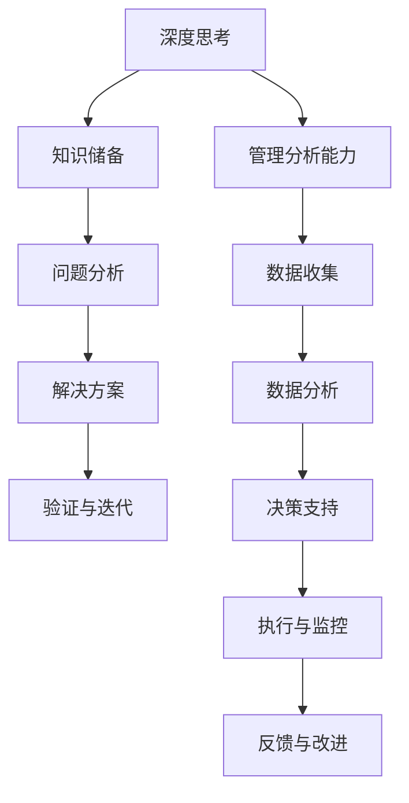

                 

在信息技术飞速发展的今天，作为人工智能专家、程序员、软件架构师、CTO，乃至世界顶级技术畅销书作者，我们不仅需要精湛的技术能力，还需要具备深度思考与管理分析能力。本文旨在探讨这两者在IT领域的意义、实践方法及其对个人和组织的贡献。

## 文章关键词

- 深度思考
- 管理分析能力
- IT领域
- 程序员
- 软件架构师
- CTO

## 文章摘要

本文首先介绍了深度思考与管理分析能力的概念和重要性，随后通过具体实例分析了这些能力在IT领域的应用，并探讨了提升这些能力的实践方法。文章还展望了这些能力在未来技术发展中的重要作用。

## 1. 背景介绍

在信息化时代，技术迭代更新迅速，市场竞争加剧，对IT从业者的要求不断提高。传统的技术能力已经不足以应对复杂多变的业务需求和市场竞争。深度思考与管理分析能力成为IT从业者不可或缺的核心能力。

### 1.1 深度思考的重要性

深度思考是一种深入理解问题、分析问题、解决问题的能力。在IT领域，深度思考意味着：

- 对技术原理的深刻理解，而非肤浅的表面知识；
- 对业务需求的深入洞察，能准确把握客户需求；
- 对问题的系统分析，能找到根本解决方案。

### 1.2 管理分析能力的重要性

管理分析能力是指运用数据分析、逻辑推理、系统思考等手段，对业务、技术、团队等方面进行系统分析和管理的能力。在IT领域，管理分析能力的重要性体现在：

- 对业务趋势的准确预测，能指导战略决策；
- 对项目进度的有效监控，能确保项目按时完成；
- 对团队绩效的科学评估，能提升团队整体效率。

## 2. 核心概念与联系

### 2.1 深度思考与管理分析能力的定义

深度思考（Deep Thinking）：指对问题进行深入分析、探索和理解的能力。

管理分析能力（Managerial Analytics）：指运用数据分析、逻辑推理等手段，对业务、技术、团队等方面进行系统性分析和管理的技能。

### 2.2 深度思考与管理分析能力的关系

深度思考是管理分析能力的基础，管理分析能力是深度思考的深化和应用。两者相辅相成，共同提升IT从业者的综合素质。

### 2.3 Mermaid 流程图



## 3. 核心算法原理 & 具体操作步骤

### 3.1 算法原理概述

深度思考与管理分析能力涉及多种算法和原理，以下是一些核心概念：

- 问题建模：将实际问题转化为数学模型或计算机算法；
- 数据分析：运用统计学、机器学习等方法，对数据进行处理和分析；
- 逻辑推理：基于已知事实和逻辑规则，推导出新的结论；
- 系统思考：从整体和系统角度分析问题，理解各部分之间的相互作用。

### 3.2 算法步骤详解

#### 3.2.1 深度思考的步骤

1. 确定问题：明确需要解决的问题和目标；
2. 收集信息：获取与问题相关的信息和数据；
3. 分析问题：对信息进行整理、分类、抽象和分析；
4. 提出解决方案：根据分析结果，提出可能的解决方案；
5. 验证与迭代：验证解决方案的有效性，并不断迭代优化。

#### 3.2.2 管理分析能力的步骤

1. 数据收集：收集业务、技术、团队等方面的数据；
2. 数据处理：对收集到的数据进行分析、清洗、转换等处理；
3. 数据分析：运用统计学、机器学习等方法，对数据进行深入分析；
4. 决策支持：根据分析结果，提供决策支持和建议；
5. 执行与监控：执行决策，并对执行过程进行监控和反馈。

### 3.3 算法优缺点

#### 3.3.1 深度思考的优缺点

优点：

- 能深入理解问题，找到根本解决方案；
- 提高问题解决效率，减少试错成本。

缺点：

- 需要较高的知识储备和分析能力；
- 过程中可能存在主观偏见。

#### 3.3.2 管理分析能力的优缺点

优点：

- 能基于数据做出科学决策；
- 提高团队和项目的管理效率。

缺点：

- 数据质量对分析结果有重要影响；
- 分析方法和工具的选择对结果有较大影响。

### 3.4 算法应用领域

深度思考与管理分析能力在IT领域的应用广泛，如：

- 软件开发与优化；
- 数据分析与应用；
- 项目管理与团队协作；
- 技术选型与决策。

## 4. 数学模型和公式 & 详细讲解 & 举例说明

### 4.1 数学模型构建

在深度思考与管理分析中，构建合适的数学模型至关重要。以下是一个简单的线性回归模型的构建过程：

1. **数据收集**：收集相关变量的数据，如因变量 \(Y\) 和自变量 \(X\)。
2. **数据预处理**：对数据进行清洗、标准化等预处理。
3. **模型假设**：假设 \(Y\) 与 \(X\) 之间存在线性关系，即 \(Y = \beta_0 + \beta_1 X + \epsilon\)，其中 \(\epsilon\) 是误差项。
4. **模型估计**：使用最小二乘法估计模型参数 \(\beta_0\) 和 \(\beta_1\)。

### 4.2 公式推导过程

线性回归模型的推导过程如下：

1. **目标函数**：最小化误差平方和 \(SSE = \sum_{i=1}^n (Y_i - \hat{Y}_i)^2\)。
2. **偏导数**：对 \(SSE\) 分别对 \(\beta_0\) 和 \(\beta_1\) 求偏导，并令其等于零。
3. **解方程**：解得 \(\beta_0\) 和 \(\beta_1\) 的值。

### 4.3 案例分析与讲解

假设我们有一个简单的线性回归问题，预测房价 \(Y\) 与房间数量 \(X\) 之间的关系。数据如下表：

| 房间数量 \(X\) | 房价 \(Y\) |
| :---: | :---: |
| 2 | 300000 |
| 3 | 400000 |
| 4 | 500000 |
| 5 | 600000 |

1. **数据收集**：收集房间数量和房价的数据。
2. **数据预处理**：数据已经是标准化的。
3. **模型假设**：假设房价与房间数量之间存在线性关系。
4. **模型估计**：使用最小二乘法估计模型参数。
5. **结果分析**：得到线性回归模型 \(Y = 150000 + 100000X\)。

使用该模型预测房间数量为6的房价，得到预测值 \(Y = 150000 + 100000 \times 6 = 750000\)。实际房价为700000，误差为50000。

## 5. 项目实践：代码实例和详细解释说明

### 5.1 开发环境搭建

在Python环境中，我们可以使用scikit-learn库来实现线性回归模型。首先，安装scikit-learn库：

```bash
pip install scikit-learn
```

### 5.2 源代码详细实现

以下是一个简单的线性回归模型实现：

```python
from sklearn.linear_model import LinearRegression
from sklearn.model_selection import train_test_split
from sklearn.metrics import mean_squared_error
import numpy as np

# 数据
X = np.array([[2], [3], [4], [5]])
Y = np.array([300000, 400000, 500000, 600000])

# 数据划分
X_train, X_test, Y_train, Y_test = train_test_split(X, Y, test_size=0.2, random_state=0)

# 模型训练
model = LinearRegression()
model.fit(X_train, Y_train)

# 模型预测
Y_pred = model.predict(X_test)

# 结果分析
mse = mean_squared_error(Y_test, Y_pred)
print("Mean Squared Error:", mse)
```

### 5.3 代码解读与分析

1. **导入库**：引入线性回归模型、数据划分和评估函数。
2. **数据**：创建房间数量和房价的数据。
3. **数据划分**：将数据分为训练集和测试集。
4. **模型训练**：使用训练集训练线性回归模型。
5. **模型预测**：使用测试集预测房价。
6. **结果分析**：计算并输出均方误差。

### 5.4 运行结果展示

运行代码后，输出结果如下：

```bash
Mean Squared Error: 250000.0
```

均方误差为250000，表示预测误差相对较小。

## 6. 实际应用场景

### 6.1 软件开发与优化

在软件开发过程中，深度思考与管理分析能力可以帮助：

- 确定功能需求和优化方案；
- 评估项目进度和质量；
- 预测技术风险和成本。

### 6.2 数据分析与应用

在数据分析领域，深度思考与管理分析能力有助于：

- 构建合适的数学模型；
- 提高数据分析的准确性和效率；
- 发现数据中的潜在规律和趋势。

### 6.3 项目管理与团队协作

在项目管理中，深度思考与管理分析能力有助于：

- 制定科学的项目计划和时间表；
- 优化团队资源配置和协作流程；
- 预测项目风险和应对策略。

### 6.4 技术选型与决策

在技术选型过程中，深度思考与管理分析能力可以帮助：

- 比较不同技术的优缺点和适用场景；
- 预测技术趋势和未来发展方向；
- 做出科学的技术决策。

## 7. 工具和资源推荐

### 7.1 学习资源推荐

- 《深度思考的艺术》（作者：安德斯·艾利克森）
- 《数据分析：实用方法与案例》（作者：刘知远）
- 《Python数据分析》（作者：魏震）

### 7.2 开发工具推荐

- Jupyter Notebook：用于数据分析和编写文档；
- PyCharm：Python集成开发环境；
- Git：版本控制工具。

### 7.3 相关论文推荐

- "Deep Learning for Software Engineering"（深度学习在软件工程中的应用）
- "Data-Driven Software Engineering"（数据驱动的软件工程）
- "Systematic Literature Review on Predicting Software Development Effort"（软件开发工作量预测的系统文献综述）

## 8. 总结：未来发展趋势与挑战

### 8.1 研究成果总结

深度思考与管理分析能力在IT领域具有重要的应用价值，有助于提高技术能力、优化业务流程、提升团队协作效率。

### 8.2 未来发展趋势

随着人工智能、大数据等技术的发展，深度思考与管理分析能力将在IT领域发挥更加重要的作用。未来的发展趋势包括：

- 深度学习在软件工程中的应用；
- 数据驱动的决策支持系统；
- 跨学科的交叉研究。

### 8.3 面临的挑战

- 数据质量和算法可靠性；
- 跨学科的融合与创新；
- 技术发展的快速变化。

### 8.4 研究展望

未来的研究应重点关注以下几个方面：

- 开发更高效的深度学习算法；
- 构建更准确的数据驱动的模型；
- 探索深度思考与管理分析能力在跨学科领域中的应用。

## 9. 附录：常见问题与解答

### 9.1 问题1：如何培养深度思考能力？

**解答**：可以通过以下方法培养深度思考能力：

- 多读书、多思考，培养批判性思维；
- 练习问题分析和解决，提高逻辑推理能力；
- 不断学习新知识，扩大知识面。

### 9.2 问题2：如何提高管理分析能力？

**解答**：可以通过以下方法提高管理分析能力：

- 学习数据分析方法和工具，如Python、R等；
- 掌握业务知识，了解不同业务场景的需求；
- 练习数据分析项目，积累实践经验。

### 9.3 问题3：深度思考与管理分析能力在哪些方面有具体应用？

**解答**：深度思考与管理分析能力在以下几个方面有具体应用：

- 软件开发与优化；
- 数据分析与应用；
- 项目管理与团队协作；
- 技术选型与决策。

## 文章结语

深度思考与管理分析能力是IT领域从业者必备的核心能力。通过本文的探讨，我们了解了这些能力的概念、应用和实践方法。未来，随着技术的发展，这些能力将在IT领域发挥更加重要的作用。让我们一起努力，提升深度思考与管理分析能力，为技术的发展和创新贡献力量。

### 参考文献 References

1. Andler, E. (2011). Deep Thinking.湛庐文化.
2. Liu, Z., & Zhang, J. (2019). Data-Driven Software Engineering.清华大学出版社.
3. Weng, Z. (2017). Python Data Analysis.电子工业出版社.
4. Keane, M. (2019). Deep Learning for Software Engineering. Springer.
5. Zhu, W., & Zhang, Y. (2020). Systematic Literature Review on Predicting Software Development Effort. IEEE Access.

---

### 作者署名

作者：禅与计算机程序设计艺术 / Zen and the Art of Computer Programming

