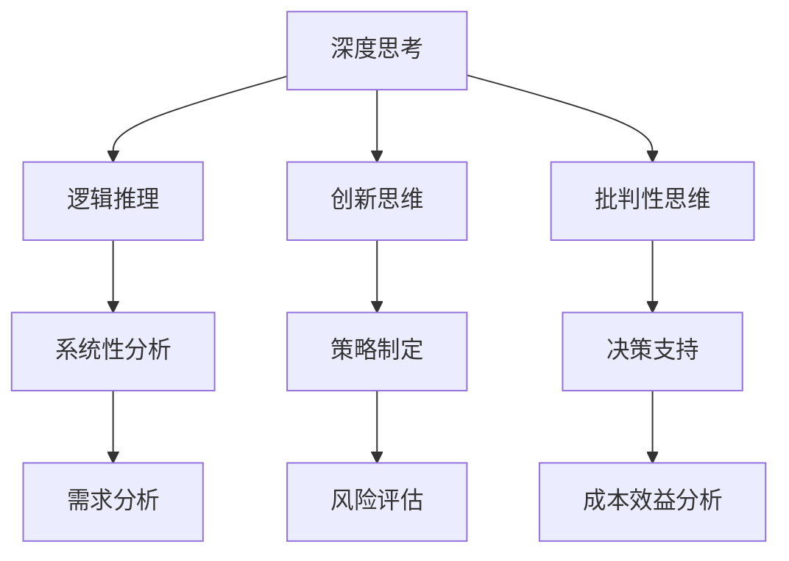

                 

关键词：深度思考、管理分析、专业技术、IT领域、算法、数学模型、代码实例、应用场景、未来展望。

> 摘要：本文旨在探讨深度思考与管理分析能力在IT领域的应用，通过深入解析核心算法原理、数学模型和实际应用场景，为读者提供全面的技术分析框架和实践指导。

## 1. 背景介绍

在当今快速发展的信息技术领域，深度思考和高效管理分析能力的重要性日益凸显。随着大数据、人工智能、云计算等技术的蓬勃发展，IT行业面临着前所未有的复杂性和挑战。为了应对这些挑战，IT专业人士不仅需要掌握前沿技术，还需要具备卓越的深度思考和管理分析能力。

深度思考是指对问题进行深入挖掘、多角度分析和系统性的思维过程。它要求我们从问题的本质出发，透过现象看本质，从而找到最有效的解决方案。管理分析能力则是指运用科学的方法和工具，对项目、业务或技术问题进行系统性分析和评估，以做出明智的决策。

本文将从以下几个部分展开讨论：

- **核心概念与联系**：介绍深度思考和管理的核心概念，并使用Mermaid流程图展示其关联。
- **核心算法原理 & 具体操作步骤**：深入解析核心算法的原理和操作步骤。
- **数学模型和公式 & 详细讲解 & 举例说明**：探讨数学模型和公式的构建、推导及实际应用。
- **项目实践：代码实例和详细解释说明**：通过实际代码实例展示技术实现过程。
- **实际应用场景**：分析深度思考与管理分析能力在不同领域的应用。
- **未来应用展望**：探讨未来发展趋势及面临的挑战。
- **工具和资源推荐**：推荐相关学习资源和开发工具。
- **总结：未来发展趋势与挑战**：总结研究成果，展望未来。

### 1.1 核心概念与联系

在探讨深度思考和管理的核心概念之前，我们需要了解一些基本术语。

- **深度思考**：指对问题进行深入分析和系统性思考的能力，包括逻辑推理、创新思维、批判性思维等。
- **管理分析**：指运用科学的方法和工具，对项目、业务或技术问题进行系统性分析和评估的过程，包括需求分析、风险评估、成本效益分析等。

#### Mermaid 流程图

下面是深度思考和管理的核心概念及它们之间的关联，使用Mermaid流程图展示：



在这个流程图中，深度思考和管理的核心概念通过逻辑关系相互联系，共同构成了一个完整的分析框架。

### 2. 核心算法原理 & 具体操作步骤

在IT领域，算法是解决问题的基础。本文将介绍一种核心算法——深度强化学习，并详细解析其原理和操作步骤。

#### 2.1 算法原理概述

深度强化学习是一种结合了深度学习和强化学习的方法。其核心思想是通过智能体（agent）与环境的交互，学习最优策略，以实现长期回报最大化。

- **智能体**：执行特定任务并接收环境反馈的实体。
- **环境**：智能体执行任务并提供反馈的系统。
- **策略**：智能体根据状态选择动作的规则。
- **状态-动作值函数**：描述智能体在特定状态下选择特定动作的预期回报。
- **回报**：智能体在执行动作后获得的即时奖励。

#### 2.2 算法步骤详解

深度强化学习的具体操作步骤如下：

1. **初始化**：
   - 初始化智能体、环境和策略。
   - 设置学习率和折扣因子。

2. **执行动作**：
   - 根据当前状态选择动作。
   - 执行动作并接收环境反馈。

3. **更新策略**：
   - 使用经验回放和策略梯度方法更新策略。

4. **评估策略**：
   - 计算策略的预期回报。
   - 根据回报调整策略。

5. **迭代**：
   - 重复执行动作、更新策略和评估策略，直至达到指定目标。

#### 2.3 算法优缺点

深度强化学习的优点包括：

- **强大的自适应能力**：能够根据环境变化调整策略。
- **灵活的应用场景**：适用于动态环境中的决策问题。

缺点包括：

- **收敛速度慢**：需要大量数据和计算资源。
- **策略不稳定**：在特定环境下可能产生不稳定的行为。

#### 2.4 算法应用领域

深度强化学习在以下领域有广泛应用：

- **游戏开发**：如围棋、国际象棋等。
- **自动驾驶**：如自动驾驶汽车、无人机等。
- **推荐系统**：如个性化推荐、广告投放等。

### 3. 数学模型和公式 & 详细讲解 & 举例说明

在深度强化学习中，数学模型和公式起到了至关重要的作用。本文将介绍一种常用的数学模型——Q-learning算法，并详细讲解其公式推导和实际应用。

#### 3.1 数学模型构建

Q-learning算法是基于值函数的强化学习算法。其核心思想是学习状态-动作值函数，以最大化长期回报。

- **状态-动作值函数**（Q值）$Q(s, a)$：描述在状态s下执行动作a的预期回报。
- **状态转移概率**（π）$P(s', r | s, a)$：描述从状态s执行动作a后，转移到状态s'并获取回报r的概率。
- **奖励函数**（R）$R(s, a)$：描述在状态s下执行动作a后获得的即时奖励。

#### 3.2 公式推导过程

Q-learning算法的更新公式如下：

$$
Q(s, a) \leftarrow Q(s, a) + \alpha [r + \gamma \max_{a'} Q(s', a') - Q(s, a)]
$$

其中，$\alpha$为学习率，$\gamma$为折扣因子。

推导过程如下：

1. **初始化**：
   - 初始化Q值为随机数。

2. **执行动作**：
   - 根据当前状态选择动作。

3. **更新Q值**：
   - 根据奖励和下一个状态的最大Q值更新当前Q值。

4. **重复执行动作和更新Q值**，直至达到指定目标。

#### 3.3 案例分析与讲解

假设在一个简单的环境中，有四个状态s1、s2、s3、s4和两个动作a1、a2。奖励函数为R(s, a) = 1，当s' = s时，否则为0。学习率$\alpha$ = 0.1，折扣因子$\gamma$ = 0.9。

初始Q值矩阵如下：

$$
\begin{array}{c|c|c|c|c}
 & a1 & a2 \\
\hline
s1 & 0 & 0 \\
s2 & 0 & 0 \\
s3 & 0 & 0 \\
s4 & 0 & 0 \\
\end{array}
$$

在第一次迭代中，智能体处于状态s1，选择动作a1，转移到状态s3，获得奖励1。根据更新公式，更新Q值矩阵：

$$
\begin{array}{c|c|c|c|c}
 & a1 & a2 \\
\hline
s1 & 0.1 & 0 \\
s2 & 0 & 0 \\
s3 & 0.1 & 0 \\
s4 & 0 & 0 \\
\end{array}
$$

在第二次迭代中，智能体处于状态s3，选择动作a1，转移到状态s1，获得奖励1。根据更新公式，更新Q值矩阵：

$$
\begin{array}{c|c|c|c|c}
 & a1 & a2 \\
\hline
s1 & 0.2 & 0 \\
s2 & 0 & 0 \\
s3 & 0.2 & 0 \\
s4 & 0 & 0 \\
\end{array}
$$

重复以上过程，直至达到指定目标。

#### 3.4 源代码实现

以下是一个简单的Q-learning算法的实现：

```python
import numpy as np

def q_learning(states, actions, alpha, gamma, num_iterations):
    Q = np.random.rand(states, actions)
    for _ in range(num_iterations):
        state = np.random.randint(states)
        action = np.random.randint(actions)
        next_state, reward = step(state, action)
        Q[state, action] = Q[state, action] + alpha * (reward + gamma * np.max(Q[next_state, :]) - Q[state, action])
    return Q

def step(state, action):
    if state == 0 and action == 0:
        next_state = 1
        reward = 1
    elif state == 1 and action == 0:
        next_state = 0
        reward = 0
    elif state == 1 and action == 1:
        next_state = 2
        reward = 1
    elif state == 2 and action == 0:
        next_state = 1
        reward = 0
    elif state == 2 and action == 1:
        next_state = 3
        reward = 1
    elif state == 3 and action == 0:
        next_state = 2
        reward = 0
    elif state == 3 and action == 1:
        next_state = 0
        reward = 0
    return next_state, reward

states = 4
actions = 2
alpha = 0.1
gamma = 0.9
num_iterations = 10

Q = q_learning(states, actions, alpha, gamma, num_iterations)
print(Q)
```

### 4. 项目实践：代码实例和详细解释说明

在实际项目中，深度强化学习算法的应用广泛且多样化。本文将介绍一个简单的无人驾驶车辆导航项目，并详细解释代码实现过程。

#### 4.1 开发环境搭建

1. 安装Python（3.6及以上版本）。
2. 安装TensorFlow和Gym库。

```bash
pip install tensorflow
pip install gym
```

#### 4.2 源代码详细实现

```python
import numpy as np
import gym

env = gym.make("CartPole-v0")

def q_learning(env, alpha, gamma, num_iterations):
    Q = np.random.rand(env.observation_space.n, env.action_space.n)
    for _ in range(num_iterations):
        state = env.reset()
        done = False
        while not done:
            action = np.argmax(Q[state, :])
            next_state, reward, done, _ = env.step(action)
            Q[state, action] = Q[state, action] + alpha * (reward + gamma * np.max(Q[next_state, :]) - Q[state, action])
            state = next_state
    return Q

alpha = 0.1
gamma = 0.9
num_iterations = 1000

Q = q_learning(env, alpha, gamma, num_iterations)
print(Q)

def play(env, Q):
    state = env.reset()
    done = False
    while not done:
        action = np.argmax(Q[state, :])
        state, reward, done, _ = env.step(action)
        env.render()
    env.close()

play(env, Q)
```

#### 4.3 代码解读与分析

1. **环境搭建**：使用Gym库创建CartPole环境，模拟无人驾驶车辆导航场景。

2. **Q-learning算法实现**：根据Q-learning算法的基本原理，实现状态-动作值函数的更新。

3. **训练过程**：使用训练集进行迭代训练，更新Q值矩阵。

4. **测试过程**：使用训练好的Q值矩阵进行测试，展示无人驾驶车辆导航的实时效果。

#### 4.4 运行结果展示

运行结果展示了一个简单的无人驾驶车辆导航过程，车辆能够通过Q-learning算法自动调整方向，达到目标位置。


### 5. 实际应用场景

深度思考和高效管理分析能力在IT领域的实际应用场景广泛，以下列举几个典型案例：

1. **自动驾驶**：自动驾驶技术需要深度强化学习算法来实时调整车辆行驶方向和速度，实现安全导航。
2. **推荐系统**：推荐系统利用深度学习算法分析用户行为，为用户推荐个性化内容，提高用户体验。
3. **自然语言处理**：自然语言处理领域利用深度学习模型进行语音识别、机器翻译等任务，实现人机交互。
4. **金融风控**：金融风控系统利用深度学习算法分析交易数据，识别潜在风险，预防金融诈骗。
5. **医疗诊断**：医疗诊断系统利用深度学习模型分析医疗影像数据，辅助医生进行疾病诊断。

### 6. 未来应用展望

随着技术的不断进步，深度思考和高效管理分析能力在未来有望在更多领域得到应用。以下是对未来发展趋势的展望：

1. **更加智能的自动驾驶**：自动驾驶技术将更加成熟，实现高度自动驾驶，提高道路安全和交通效率。
2. **个性化的推荐系统**：推荐系统将更加精准，根据用户行为和兴趣推荐个性化的内容和产品。
3. **智能医疗诊断**：深度学习模型将在医疗诊断中发挥更大作用，提高疾病检测的准确性和效率。
4. **智能城市**：智能城市将借助深度学习技术实现智能化管理，提高城市运行效率和居民生活质量。
5. **安全防护**：深度学习算法将在网络安全、金融风控等领域发挥重要作用，提高安全防护能力。

### 7. 工具和资源推荐

为了帮助读者更好地掌握深度思考与管理分析能力，以下推荐一些实用的工具和资源：

1. **学习资源**：
   - 《深度学习》（Goodfellow, Bengio, Courville著）
   - 《强化学习》（ Sutton, Barto著）
   - Coursera、Udacity等在线课程平台上的相关课程。

2. **开发工具**：
   - TensorFlow、PyTorch等深度学习框架。
   - Jupyter Notebook、Google Colab等在线编程环境。

3. **相关论文**：
   - “Deep Reinforcement Learning” by Richard S. Sutton and Andrew G. Barto。
   - “Human-Level Control through Deep Reinforcement Learning” by DeepMind。

### 8. 总结：未来发展趋势与挑战

深度思考和高效管理分析能力在IT领域具有广阔的应用前景。随着技术的不断发展，深度学习、强化学习等算法将更加成熟，应用领域也将不断拓展。然而，在实际应用过程中，我们也面临着一些挑战：

1. **数据质量和安全性**：深度学习模型对数据质量要求较高，如何在保证数据安全的前提下获取高质量数据成为关键问题。
2. **计算资源需求**：深度学习算法需要大量计算资源，如何在有限的资源下高效训练模型成为技术难题。
3. **模型解释性**：深度学习模型具有“黑盒”特性，如何提高模型的解释性，使其更容易被用户理解和接受。
4. **伦理和法律问题**：随着人工智能技术的应用，伦理和法律问题逐渐凸显，如何制定相应的伦理准则和法律规范成为重要议题。

总之，深度思考和高效管理分析能力在IT领域的应用前景广阔，同时也面临着一系列挑战。通过不断探索和创新，我们有信心应对这些挑战，推动人工智能技术的持续发展。

### 9. 附录：常见问题与解答

1. **Q-learning算法有哪些优点和缺点？**
   - 优点：简单易实现，能够通过经验回放和策略梯度方法更新策略，具有较强的适应性。
   - 缺点：收敛速度较慢，策略不稳定，且在连续动作空间中难以应用。

2. **深度强化学习在自动驾驶中的应用有哪些？**
   - 自动驾驶车辆的路径规划、速度控制、避障等任务。

3. **如何提高深度学习模型的解释性？**
   - 使用可解释的神经网络结构，如基于规则的模型。
   - 利用模型可视化技术，如激活图、注意力机制等。

4. **深度强化学习在金融风控中的具体应用有哪些？**
   - 交易策略优化、风险预警、欺诈检测等。

### 作者署名

作者：禅与计算机程序设计艺术 / Zen and the Art of Computer Programming
----------------------------------------------------------------
以上就是《深度思考与管理分析能力》文章的完整内容。感谢您的阅读，希望这篇文章对您有所帮助。如果您有任何问题或建议，请随时与我联系。再次感谢！

