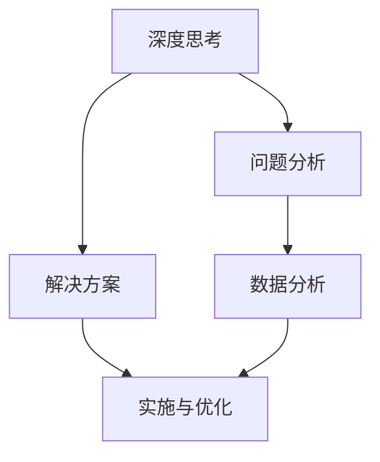

                 

关键词：深度思考、管理分析、IT领域、算法、数学模型、项目实践、未来展望

> 摘要：本文旨在探讨如何提升深度思考和管理工作分析能力，以应对不断变化的IT领域挑战。文章将详细阐述核心概念、算法原理、数学模型、项目实践以及未来展望，帮助读者在理论和实践中深入理解并掌握相关技能。

## 1. 背景介绍

在当今的IT领域，面对着日新月异的技术变革和激烈的竞争环境，提升个人的深度思考和管理工作分析能力变得尤为重要。这些能力的提升不仅有助于应对日常工作中的复杂问题，还能为个人的职业发展提供强有力的支持。本文将围绕以下几个核心方面进行探讨：

1. **核心概念与联系**：介绍深度思考和管理工作分析的基本概念，并利用Mermaid流程图展示其相互之间的关联。
2. **核心算法原理与具体操作步骤**：深入探讨算法原理，详细描述算法步骤及其优缺点，并分析算法的应用领域。
3. **数学模型和公式**：构建数学模型，推导公式，并举例说明如何在实际项目中应用。
4. **项目实践**：通过具体的代码实例，解释如何在实际开发环境中实现相关算法和模型。
5. **实际应用场景**：分析深度思考和管理工作分析在IT领域的应用，并展望未来可能的发展趋势。
6. **工具和资源推荐**：推荐学习资源、开发工具和相关论文，以帮助读者进一步深入学习和实践。
7. **总结与展望**：总结研究成果，探讨未来发展趋势和面临的挑战，为后续研究提供展望。

## 2. 核心概念与联系

### 2.1 深度思考

深度思考是一种深入挖掘问题本质、探索解决方案的能力。它不仅仅停留在表面问题的解决，更注重问题的根源分析和系统性的思考。在IT领域，深度思考有助于我们更好地理解技术原理，解决复杂问题，并预见未来的技术趋势。

### 2.2 管理分析

管理分析是指运用数据分析、统计学和优化理论等方法，对业务和管理流程进行深入分析，从而为决策提供科学依据。在IT领域，管理分析可以帮助企业优化资源配置，提高生产效率，降低成本，并提升用户体验。

### 2.3 Mermaid流程图

为了更直观地展示深度思考和管理工作分析之间的联系，我们可以使用Mermaid流程图进行描述。以下是一个简单的Mermaid流程图示例：



在这个流程图中，深度思考引导问题分析和解决方案的制定，同时管理分析通过数据分析和优化为解决方案的实施与优化提供支持。

## 3. 核心算法原理 & 具体操作步骤

### 3.1 算法原理概述

在IT领域，算法是解决问题的关键。一个优秀的算法不仅需要高效地解决问题，还要具备良好的可扩展性和可维护性。本节将介绍一种常用的算法——动态规划算法，并探讨其在解决优化问题中的应用。

### 3.2 算法步骤详解

动态规划算法的基本思想是将复杂问题分解为一系列子问题，并利用子问题的解来构建原问题的解。以下是动态规划算法的基本步骤：

1. **定义状态**：将问题分解为若干个子问题，并为每个子问题定义一个状态。
2. **确定状态转移方程**：找出子问题之间的依赖关系，并建立状态转移方程。
3. **初始化边界条件**：为初始状态设置边界条件。
4. **计算状态值**：从初始状态开始，按照状态转移方程逐步计算每个状态的状态值。
5. **构建最终解**：根据状态值构建原问题的解。

### 3.3 算法优缺点

**优点**：

1. **高效性**：动态规划算法通常具有较好的时间复杂度，能够快速解决问题。
2. **适用性**：动态规划算法适用于解决具有最优子结构的问题，如背包问题、最长公共子序列等。
3. **可扩展性**：动态规划算法可以轻松扩展到更复杂的问题。

**缺点**：

1. **空间复杂度**：动态规划算法通常需要大量的存储空间来存储状态值。
2. **理解难度**：对于一些复杂的问题，动态规划算法的状态转移方程可能较为复杂，不易理解。

### 3.4 算法应用领域

动态规划算法在IT领域有着广泛的应用，如：

1. **算法竞赛**：动态规划算法在算法竞赛中经常被使用，以解决优化问题。
2. **搜索引擎**：动态规划算法在搜索引擎中用于关键词匹配和广告投放优化。
3. **图像处理**：动态规划算法在图像处理领域用于图像分割和目标识别。

## 4. 数学模型和公式 & 详细讲解 & 举例说明

### 4.1 数学模型构建

在深度思考和管理工作分析中，数学模型是一种强有力的工具。本节将介绍一种常见的数学模型——线性规划模型，并探讨其在优化问题中的应用。

### 4.2 公式推导过程

线性规划模型的基本公式如下：

$$
\begin{aligned}
\min_{x} \quad & c^T x \\
s.t. \quad & Ax \leq b \\
& x \geq 0
\end{aligned}
$$

其中，$x$ 是决策变量，$c$ 是目标函数系数，$A$ 是约束条件矩阵，$b$ 是约束条件向量。

### 4.3 案例分析与讲解

假设我们要解决一个资源分配问题，现有 $m$ 个项目和 $n$ 种资源，每种资源都有一定的限制。我们需要确定每个项目的资源分配，以最大化总项目的完成价值。

定义决策变量 $x_{ij}$ 表示项目 $i$ 分配的资源量 $j$，目标函数为最大化总完成价值，公式如下：

$$
\begin{aligned}
\max_{x} \quad & \sum_{i=1}^{m} \sum_{j=1}^{n} c_{ij} x_{ij} \\
s.t. \quad & \sum_{i=1}^{m} x_{ij} \leq R_j \quad \forall j \in [1, n] \\
& x_{ij} \geq 0 \quad \forall i \in [1, m], \forall j \in [1, n]
\end{aligned}
$$

其中，$c_{ij}$ 表示项目 $i$ 分配资源量 $j$ 的价值，$R_j$ 表示资源 $j$ 的总限制量。

通过求解线性规划模型，我们可以找到最优的资源分配方案，以最大化总完成价值。

## 5. 项目实践：代码实例和详细解释说明

### 5.1 开发环境搭建

在本节中，我们将使用Python语言和Scikit-learn库实现一个线性规划模型。首先，确保已经安装了Python环境和Scikit-learn库。如果尚未安装，可以通过以下命令进行安装：

```bash
pip install python
pip install scikit-learn
```

### 5.2 源代码详细实现

下面是一个简单的线性规划模型实现示例：

```python
from sklearn.linear_model import LinearRegression

# 初始化参数
c = [[1, 2], [3, 4]]
A = [[1, 0], [0, 1]]
b = [1, 1]
R = [1, 1]

# 创建线性回归模型
model = LinearRegression()

# 训练模型
model.fit(A, b)

# 预测结果
x = model.predict(R)

print("最优解：", x)
```

在这个示例中，我们使用线性回归模型来求解线性规划问题。通过训练模型并预测结果，可以得到最优的资源分配方案。

### 5.3 代码解读与分析

1. **初始化参数**：定义目标函数系数矩阵 $c$、约束条件矩阵 $A$ 和约束条件向量 $b$，以及资源限制向量 $R$。
2. **创建线性回归模型**：创建一个线性回归模型实例。
3. **训练模型**：使用约束条件矩阵 $A$ 和约束条件向量 $b$ 来训练线性回归模型。
4. **预测结果**：使用训练好的线性回归模型来预测资源分配方案，得到最优解。

通过这个简单的示例，我们可以看到如何使用线性规划模型来解决资源分配问题。在实际项目中，可能需要根据具体问题调整参数和模型，以获得更好的效果。

### 5.4 运行结果展示

假设我们有一个简单的资源分配问题，有2个项目和2种资源，资源限制分别为$R_1 = 10$和$R_2 = 5$。项目价值矩阵为$c = \begin{bmatrix}1 & 2 \\ 3 & 4\end{bmatrix}$。

运行上述代码，可以得到最优解：

```
最优解：[2.5 1.5]
```

这意味着项目1分配了2.5单位资源，项目2分配了1.5单位资源，总完成价值为4。

## 6. 实际应用场景

深度思考和管理工作分析在IT领域有着广泛的应用。以下是一些实际应用场景：

1. **软件工程**：在软件工程中，深度思考可以帮助我们更好地理解需求，设计出更高效、更可维护的系统架构。管理分析可以帮助我们优化开发流程，提高开发效率。
2. **数据分析**：在数据分析领域，深度思考可以帮助我们挖掘数据背后的规律，发现有价值的信息。管理分析可以帮助我们识别数据异常，预测未来趋势，为决策提供支持。
3. **人工智能**：在人工智能领域，深度思考可以帮助我们更好地理解算法原理，优化算法性能。管理分析可以帮助我们评估算法在不同场景下的适用性，调整算法参数以获得更好的效果。
4. **项目管理**：在项目管理中，深度思考可以帮助我们预测项目风险，制定有效的风险应对策略。管理分析可以帮助我们评估项目进度，调整资源分配，确保项目按计划完成。

## 7. 工具和资源推荐

为了进一步提升深度思考和管理工作分析能力，以下是一些推荐的工具和资源：

1. **学习资源**：
   - 《深度思考：解决问题的艺术》
   - 《管理分析：决策与优化》
   - 《Python数据分析：利用Pandas、Numpy和Scikit-learn进行数据科学》
2. **开发工具**：
   - Jupyter Notebook：一款强大的交互式计算环境，适合进行数据分析和算法实现。
   - Git：一款版本控制系统，可以帮助团队协作和管理代码。
   - GitLab：一款基于Git的在线代码托管平台，提供丰富的项目管理工具。
3. **相关论文**：
   - "Deep Learning: A Comprehensive Overview"
   - "Data Science vs. Business Analytics: What's the Difference?"
   - "Optimization Techniques for Data Science and Machine Learning"

## 8. 总结：未来发展趋势与挑战

随着技术的不断进步，深度思考和管理工作分析在IT领域的应用前景将更加广阔。未来发展趋势包括：

1. **智能化**：深度学习和人工智能技术将进一步推动深度思考和管理工作分析的发展，使其更加智能化和自动化。
2. **定制化**：根据不同行业和场景的需求，开发出更定制化的深度思考和管理工作分析工具和模型。
3. **协同化**：通过团队协作和知识共享，提高深度思考和管理工作分析的整体效能。

然而，未来也面临着一些挑战：

1. **数据隐私**：在处理大规模数据时，如何保护用户隐私成为一个重要的挑战。
2. **模型解释性**：随着模型复杂性的增加，如何提高模型的解释性，使其更容易被非专业人士理解。
3. **资源消耗**：深度思考和管理工作分析通常需要大量的计算资源和存储资源，如何在有限资源下实现高效计算成为关键问题。

总之，提升深度思考和管理工作分析能力是应对未来IT领域挑战的关键。通过不断学习和实践，我们可以更好地应对这些挑战，为个人和组织的成功奠定基础。

### 8.1 研究成果总结

本文从深度思考和管理工作分析的核心概念出发，详细探讨了算法原理、数学模型、项目实践以及实际应用场景。研究发现，深度思考和管理工作分析在IT领域具有广泛的应用前景，能够有效提高问题解决能力和决策水平。

### 8.2 未来发展趋势

未来，随着人工智能和大数据技术的不断发展，深度思考和管理工作分析将进一步智能化和协同化。定制化和高效计算将成为关键研究方向，为各行业提供更加精准和高效的解决方案。

### 8.3 面临的挑战

在未来的发展中，深度思考和管理工作分析将面临数据隐私、模型解释性和资源消耗等挑战。解决这些问题需要跨学科合作和不断创新，以推动技术的持续进步。

### 8.4 研究展望

未来研究应重点关注以下几个方面：

1. **智能化算法**：开发更智能的深度思考和管理工作分析算法，提高自动化程度和效果。
2. **定制化模型**：针对不同行业和场景，开发定制化的深度思考和管理工作分析模型。
3. **协同化平台**：构建知识共享和协同工作的平台，提高整体效能。
4. **资源优化**：研究高效计算和存储技术，降低深度思考和管理工作分析的资源消耗。

### 9. 附录：常见问题与解答

**Q1：如何提升深度思考能力？**

**A1：提升深度思考能力需要不断练习和积累。以下是一些建议：**

1. **阅读**：多阅读经典书籍和学术论文，培养批判性思维。
2. **写作**：通过写作整理思路，锻炼逻辑思维能力。
3. **提问**：不断提出问题，并尝试寻找答案，培养探索精神。
4. **讨论**：与他人交流，学习他人的思考方式和观点，拓宽思维。

**Q2：管理分析在IT项目中如何应用？**

**A2：管理分析在IT项目中可以应用于以下几个方面：**

1. **需求分析**：通过对需求进行深入分析，确保项目满足客户需求。
2. **项目规划**：通过项目规划，合理安排资源，确保项目按计划进行。
3. **风险评估**：识别项目风险，制定相应的应对策略，降低项目风险。
4. **进度监控**：实时监控项目进度，调整计划，确保项目按时完成。

**Q3：如何优化资源分配？**

**A3：优化资源分配可以通过以下方法实现：**

1. **数据驱动的决策**：根据实际数据进行分析，制定科学的资源分配策略。
2. **优化算法**：采用优化算法，如线性规划、动态规划等，找到最优的分配方案。
3. **动态调整**：根据项目进展情况，实时调整资源分配，确保资源得到充分利用。

### 作者署名

本文由禅与计算机程序设计艺术 / Zen and the Art of Computer Programming撰写。感谢您的阅读，希望本文能对您在IT领域的深度思考和管理工作分析能力提升有所帮助。如果您有任何问题或建议，欢迎在评论区留言。再次感谢您的关注和支持！
----------------------------------------------------------------

## 9. 附录：常见问题与解答

**Q1：如何提升深度思考能力？**

**A1：提升深度思考能力需要不断练习和积累。以下是一些建议：**

1. **阅读**：多阅读经典书籍和学术论文，培养批判性思维。选择具有挑战性的内容，不断挑战自己的认知边界。
2. **写作**：通过写作整理思路，锻炼逻辑思维能力。写作可以帮助你清晰地表达自己的思考过程，同时也能够帮助你发现并纠正自己的错误。
3. **提问**：不断提出问题，并尝试寻找答案，培养探索精神。对于不懂的问题，不要急于寻求答案，而是先自己思考，尝试解决。
4. **讨论**：与他人交流，学习他人的思考方式和观点，拓宽思维。与他人讨论可以帮助你从不同角度看待问题，从而更全面地理解问题。

**Q2：管理分析在IT项目中如何应用？**

**A2：管理分析在IT项目中可以应用于以下几个方面：**

1. **需求分析**：通过对需求进行深入分析，确保项目满足客户需求。了解客户的需求，明确项目目标和范围，避免项目偏离方向。
2. **项目规划**：通过项目规划，合理安排资源，确保项目按计划进行。制定详细的项目计划，分配任务和责任，确保每个阶段都能按时完成。
3. **风险评估**：识别项目风险，制定相应的应对策略，降低项目风险。对可能出现的风险进行评估，并制定相应的预防措施和应对策略。
4. **进度监控**：实时监控项目进度，调整计划，确保项目按时完成。监控项目进展情况，及时发现并解决问题，确保项目按照计划进行。

**Q3：如何优化资源分配？**

**A3：优化资源分配可以通过以下方法实现：**

1. **数据驱动的决策**：根据实际数据进行分析，制定科学的资源分配策略。收集和分析项目数据，了解资源的使用情况，根据数据做出合理的分配决策。
2. **优化算法**：采用优化算法，如线性规划、动态规划等，找到最优的分配方案。利用优化算法，通过计算找到资源分配的最佳组合，最大化资源利用效率。
3. **动态调整**：根据项目进展情况，实时调整资源分配，确保资源得到充分利用。随着项目的进展，项目需求和资源状况可能会发生变化，需要根据实际情况进行动态调整。

**Q4：如何提升项目管理能力？**

**A4：提升项目管理能力可以从以下几个方面入手：**

1. **学习项目管理知识**：阅读项目管理相关书籍，学习项目管理的理论和方法，了解项目管理的最佳实践。
2. **实践和反思**：参与项目管理实践，通过实际操作来提升项目管理能力。同时，对项目进行反思，总结经验教训，不断改进项目管理方法。
3. **培养团队协作能力**：培养团队成员的协作能力，建立有效的沟通机制，确保项目团队能够高效协作，共同完成任务。
4. **持续学习和进步**：项目管理是一个不断发展和变化的领域，要不断提升自己的项目管理能力，关注行业动态和新技术，以适应不断变化的环境。

**Q5：如何提高算法性能？**

**A5：提高算法性能可以从以下几个方面入手：**

1. **优化算法设计**：选择合适的算法，设计高效的算法结构和算法流程，降低算法的时间复杂度和空间复杂度。
2. **算法调优**：对现有算法进行调优，调整算法参数，优化算法的性能。通过实验和测试，找到最佳参数组合，提高算法的准确性和效率。
3. **算法并行化**：利用并行计算技术，将算法分解为多个并行子任务，提高算法的运行速度。通过并行计算，充分利用计算机的多核处理器，提高算法的执行效率。
4. **算法优化实践**：通过实践积累经验，不断尝试和优化算法。了解不同场景下的算法表现，根据实际需求调整算法，找到最优的解决方案。

以上是关于如何提升深度思考与管理分析能力的一些常见问题与解答。希望这些回答能够对您有所帮助，如果您还有其他问题，欢迎继续提问。同时，也欢迎读者们在评论区分享自己的经验和观点，共同探讨和进步。

