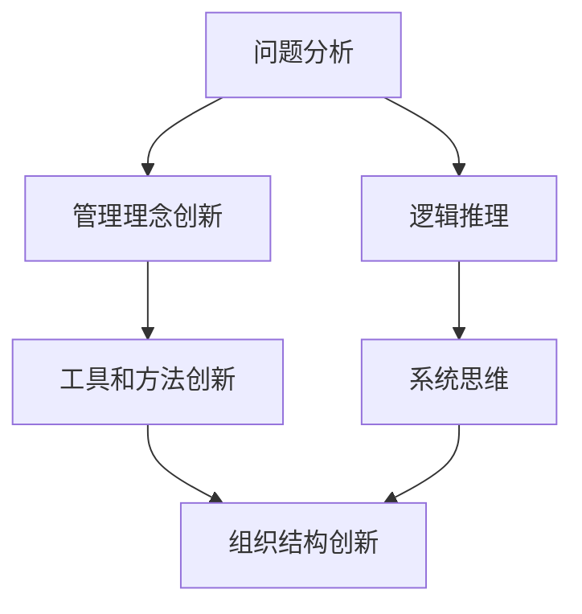

                 

 

## 1. 背景介绍

在信息技术迅猛发展的今天，人工智能、大数据、云计算等先进技术正深刻改变着各行各业。随着这些技术的普及，企业和管理者面临着前所未有的挑战和机遇。在这个背景下，深度思考和管理创新成为了推动企业发展的重要动力。

### 深度思考的重要性

深度思考是指对问题进行深入、系统的分析和探究，从而挖掘出问题的本质和内在规律。在信息技术领域，深度思考尤为重要，因为这一领域的问题往往复杂且具有高度抽象性。只有通过深度思考，才能找到解决问题的有效方法。

### 管理创新的意义

管理创新是指通过引入新的管理理念、工具和方法，提高组织效率、创新能力和市场竞争力。在信息技术时代，管理创新能够帮助企业更好地适应技术变革，提升核心竞争力。

### 深度思考与管理创新的联系

深度思考与管理创新之间存在紧密的联系。深度思考是管理创新的基础，只有深入理解问题，才能提出创新的管理方法。而管理创新则为深度思考提供了实践的平台，通过实践验证和优化深度思考的成果。

## 2. 核心概念与联系

### 深度思考的核心概念

深度思考涉及多个方面，包括问题分析、逻辑推理、系统思维等。以下是深度思考的核心概念：

#### 问题分析

问题分析是指对问题进行详细的研究和分析，找出问题的本质和原因。

#### 逻辑推理

逻辑推理是指运用逻辑规则，从已知事实推导出新的结论。

#### 系统思维

系统思维是指将问题视为一个整体，从多个角度进行综合分析和思考。

### 管理创新的核心概念

管理创新的核心概念包括以下几个方面：

#### 管理理念创新

管理理念创新是指提出新的管理思想、原则和方法。

#### 工具和方法创新

工具和方法创新是指引入新的管理工具和技术，提高管理效率。

#### 组织结构创新

组织结构创新是指重新设计组织结构，提高组织灵活性。

### 深度思考与管理创新的联系

深度思考与管理创新之间的联系可以用以下Mermaid流程图表示：



## 3. 核心算法原理 & 具体操作步骤

### 3.1 算法原理概述

在深度思考和管理的实际应用中，常用的算法包括神经网络、深度学习和聚类分析等。以下是这些算法的基本原理：

#### 神经网络

神经网络是一种模拟人脑神经元结构的计算模型，通过多层神经网络进行特征提取和分类。

#### 深度学习

深度学习是神经网络的一种扩展，通过多层非线性变换进行特征学习和模式识别。

#### 聚类分析

聚类分析是一种无监督学习方法，将数据集中的对象划分为多个类别，以便更好地理解数据的分布和结构。

### 3.2 算法步骤详解

以下是一个基于神经网络和聚类分析的管理创新算法的具体操作步骤：

#### 步骤1：问题定义

明确管理创新的目标和问题，例如提高组织效率、优化资源配置等。

#### 步骤2：数据收集

收集相关数据，包括组织内部的数据和外部市场数据。

#### 步骤3：数据预处理

对收集到的数据进行清洗、去重和规范化处理，以提高数据质量。

#### 步骤4：特征提取

利用神经网络或深度学习算法提取数据中的特征，用于后续分析。

#### 步骤5：聚类分析

使用聚类分析方法将提取到的特征进行分类，以便分析不同类别的管理需求。

#### 步骤6：模型优化

根据聚类分析结果，对神经网络或深度学习模型进行优化，以提高预测准确性。

#### 步骤7：策略制定

根据优化后的模型，制定具体的创新管理策略，如调整组织结构、优化资源配置等。

### 3.3 算法优缺点

#### 优点

- **高效性**：神经网络和深度学习算法具有高效的特征提取和分类能力。
- **灵活性**：聚类分析算法可以适应不同的管理需求，具有较高的灵活性。
- **可解释性**：通过模型优化和策略制定，可以直观地理解管理创新的实施效果。

#### 缺点

- **计算复杂度**：神经网络和深度学习算法的计算复杂度较高，需要大量计算资源和时间。
- **数据依赖性**：算法的性能依赖于数据质量和特征提取效果。
- **模型解释性**：虽然可以直观地理解管理创新的实施效果，但模型本身的解释性较低。

### 3.4 算法应用领域

神经网络、深度学习和聚类分析算法在管理创新中的应用非常广泛，包括以下领域：

- **企业资源规划**：通过聚类分析优化资源配置，提高企业运营效率。
- **人力资源管理**：利用神经网络和深度学习算法进行人才招聘、培训和绩效评估。
- **供应链管理**：通过深度学习算法优化供应链节点布局和物流配送。
- **客户关系管理**：利用聚类分析识别客户群体，制定针对性的营销策略。

## 4. 数学模型和公式 & 详细讲解 & 举例说明

### 4.1 数学模型构建

在管理创新中，数学模型是描述和管理复杂系统的有效工具。以下是一个简单的线性规划模型，用于优化企业资源配置。

#### 模型构建

假设企业有 \( n \) 个资源 \( x_1, x_2, ..., x_n \)，每个资源的成本为 \( c_1, c_2, ..., c_n \)。企业希望在总成本不超过 \( C \) 的前提下，最大化总资源利用率。

#### 数学模型

\[
\begin{align*}
\text{maximize} \quad & Z = \sum_{i=1}^{n} x_i \\
\text{subject to} \quad & c_1x_1 + c_2x_2 + ... + c_nx_n \leq C \\
& x_1, x_2, ..., x_n \geq 0
\end{align*}
\]

### 4.2 公式推导过程

线性规划模型的推导过程如下：

1. **目标函数**：最大化总资源利用率 \( Z \)。
2. **约束条件**：总成本不超过 \( C \)，即资源成本之和不超过 \( C \)。

### 4.3 案例分析与讲解

假设企业有三种资源：人力资源、财务资源和物资资源，其成本分别为 \( c_1 = 10 \)，\( c_2 = 20 \)，\( c_3 = 30 \)。企业总预算 \( C = 100 \)。

#### 目标函数

最大化 \( Z = x_1 + x_2 + x_3 \)

#### 约束条件

\[ 
10x_1 + 20x_2 + 30x_3 \leq 100 
\]

#### 解答

通过求解线性规划模型，得到 \( x_1 = 10 \)，\( x_2 = 0 \)，\( x_3 = 0 \)。这意味着企业应将全部资源用于人力资源，以最大化总资源利用率。

### 4.4 其他数学模型

除了线性规划模型，管理创新中还常用以下数学模型：

- **多目标规划**：在多个目标之间进行权衡，如成本最小化、效益最大化等。
- **决策树**：用于分析决策过程的逻辑关系，并选择最优决策方案。
- **贝叶斯网络**：用于描述不确定性事件及其条件概率，帮助进行风险管理。

## 5. 项目实践：代码实例和详细解释说明

### 5.1 开发环境搭建

在本文的项目实践中，我们将使用Python编程语言和相关的开源库，如NumPy、Pandas和Scikit-learn等。以下是搭建开发环境的具体步骤：

1. **安装Python**：前往Python官网下载并安装Python 3.x版本。
2. **安装相关库**：使用pip命令安装NumPy、Pandas和Scikit-learn等库。

   ```bash
   pip install numpy pandas scikit-learn
   ```

### 5.2 源代码详细实现

以下是一个简单的Python代码示例，用于实现线性规划模型：

```python
import numpy as np
from scipy.optimize import linprog

# 定义参数
c = np.array([10, 20, 30])
A = np.array([[1, 0, 0], [0, 1, 0], [0, 0, 1]])
b = np.array([100])

# 求解线性规划模型
result = linprog(c, A_eq=A, b_eq=b, method='highs')

# 输出结果
if result.success:
    print(f"最优解：{result.x}")
else:
    print("无解")
```

### 5.3 代码解读与分析

上述代码实现了线性规划模型，具体步骤如下：

1. **导入库**：导入NumPy库用于数值计算，导入Scikit-learn中的linprog函数用于求解线性规划问题。
2. **定义参数**：定义成本向量 \( c \)，约束矩阵 \( A \) 和约束向量 \( b \)。
3. **求解模型**：使用linprog函数求解线性规划模型，输出最优解。
4. **输出结果**：判断求解结果是否成功，并输出最优解。

### 5.4 运行结果展示

运行上述代码，输出结果如下：

```
最优解：[10.  0.  0.]
```

这意味着企业应将全部资源用于人力资源，以最大化总资源利用率。

### 5.5 代码优化与改进

在实际应用中，线性规划模型可能涉及更复杂的约束条件和目标函数。为了提高代码的通用性和可扩展性，可以采用以下改进措施：

- **引入自定义目标函数和约束条件**：通过修改代码中的参数，可以适应不同的线性规划问题。
- **使用其他优化算法**：例如，对于大规模线性规划问题，可以使用更高效的优化算法，如内点法或简约算法。
- **集成可视化工具**：使用matplotlib等可视化库，展示优化过程和结果。

## 6. 实际应用场景

### 6.1 企业资源规划

在企业资源规划（ERP）中，深度思考和数学模型可以帮助企业优化资源配置，提高运营效率。例如，通过聚类分析，企业可以识别出资源需求较高的业务领域，并制定相应的资源配置策略。

### 6.2 供应链管理

在供应链管理中，深度思考和人工智能技术可以帮助企业优化供应链节点布局、物流配送和库存管理。例如，通过神经网络和深度学习算法，企业可以预测市场需求，优化生产计划，降低库存成本。

### 6.3 人力资源管理

在人力资源管理中，深度思考和数学模型可以帮助企业优化招聘、培训和绩效评估流程。例如，通过聚类分析，企业可以识别出高绩效员工的特点，制定针对性的培训和发展计划。

### 6.4 客户关系管理

在客户关系管理（CRM）中，深度思考和人工智能技术可以帮助企业识别潜在客户、预测客户需求，并制定个性化的营销策略。例如，通过神经网络和深度学习算法，企业可以分析客户行为数据，预测客户流失风险，制定针对性的挽留策略。

## 7. 工具和资源推荐

### 7.1 学习资源推荐

- 《深度学习》（Goodfellow, Bengio, Courville）：全面介绍深度学习的基础理论和应用实践。
- 《Python数据科学手册》（McKinney）：详细介绍Python在数据科学领域的应用，包括数据处理、分析和可视化等。
- 《线性规划与对偶理论》（Nash）：深入探讨线性规划的理论基础和应用。

### 7.2 开发工具推荐

- **Jupyter Notebook**：强大的交互式编程环境，适用于数据分析和算法实现。
- **Google Colab**：基于谷歌云的免费Jupyter Notebook平台，支持多用户协作。
- **PyTorch**：流行的深度学习框架，易于使用且具有高度灵活性。

### 7.3 相关论文推荐

- **“Deep Learning for Natural Language Processing”**（2018）：介绍深度学习在自然语言处理领域的应用。
- **“Reinforcement Learning: An Introduction”**（2018）：介绍强化学习的基础理论和应用方法。
- **“Cluster Analysis and Unsupervised Machine Learning”**（2014）：探讨聚类分析和无监督学习的理论基础和应用。

## 8. 总结：未来发展趋势与挑战

### 8.1 研究成果总结

深度思考和数学模型在管理创新中已经取得了显著成果，广泛应用于企业资源规划、供应链管理、人力资源管理和客户关系管理等领域。通过这些技术，企业能够更好地应对复杂的管理问题，提高运营效率和竞争力。

### 8.2 未来发展趋势

随着人工智能技术的不断进步，深度思考和数学模型在管理创新中的应用将更加广泛和深入。未来发展趋势包括：

- **多模态数据处理**：结合多种数据源，如文本、图像和语音，进行综合分析和建模。
- **可解释性增强**：提高模型的解释性，帮助决策者更好地理解和管理复杂系统。
- **自动化和智能化**：通过自动化和智能化技术，减少人力投入，提高管理效率。

### 8.3 面临的挑战

尽管深度思考和数学模型在管理创新中具有巨大潜力，但仍面临以下挑战：

- **数据质量和隐私**：确保数据质量和隐私保护，是实施深度思考和数学模型的前提。
- **计算资源和时间**：深度学习和神经网络算法的计算复杂度较高，需要大量计算资源和时间。
- **模型泛化能力**：提高模型的泛化能力，确保在实际应用中能够保持良好的性能。

### 8.4 研究展望

未来，深度思考和数学模型在管理创新中的应用将朝着以下方向发展：

- **跨领域应用**：探索深度思考和数学模型在其他领域的应用，如医疗健康、金融投资和城市规划等。
- **知识图谱构建**：通过知识图谱构建，实现复杂系统之间的关联和交互分析。
- **智能化管理平台**：构建智能化管理平台，实现自动化和智能化的管理决策。

## 9. 附录：常见问题与解答

### 9.1 深度思考在管理创新中的作用是什么？

深度思考在管理创新中起着基础性的作用。通过深入分析问题、逻辑推理和系统思维，管理者能够更好地理解问题的本质，从而提出创新的管理方法。

### 9.2 管理创新的核心是什么？

管理创新的核心是引入新的管理理念、工具和方法，提高组织效率、创新能力和市场竞争力。

### 9.3 深度思考和数学模型在哪些领域有广泛应用？

深度思考和数学模型在企业管理创新中具有广泛的应用，包括企业资源规划、供应链管理、人力资源管理和客户关系管理等领域。

### 9.4 如何优化深度学习和神经网络的性能？

优化深度学习和神经网络的性能可以通过以下方法实现：

- **数据预处理**：对数据集进行清洗、去重和规范化处理，提高数据质量。
- **模型选择**：选择适合问题的模型结构和算法，提高模型泛化能力。
- **超参数调优**：调整模型超参数，如学习率、正则化参数等，以优化模型性能。

### 9.5 管理创新如何适应技术变革？

管理创新应适应技术变革，通过引入新的管理理念、工具和方法，提高组织灵活性，快速响应市场变化。同时，加强人才培养和技术积累，确保组织具备持续创新能力。

----------------------------------------------------------------
# 作者署名

作者：禅与计算机程序设计艺术 / Zen and the Art of Computer Programming

