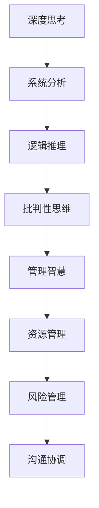

                 

### 1. 背景介绍

在当今科技飞速发展的时代，深度思考与管理智慧的积累成为信息技术领域至关重要的能力。随着大数据、人工智能、云计算等技术的迅猛发展，我们面临的挑战也在不断升级。如何从海量信息中提取有用知识，如何高效地管理复杂的系统，如何确保技术的可持续发展，这些都是我们需要深入思考和解决的重要问题。

本文旨在探讨深度思考与管理智慧在信息技术领域的应用，通过分析核心概念、算法原理、数学模型以及实际项目实践，为读者提供一套系统的思考方法和实践指南。文章将分为以下几个部分：

- **核心概念与联系**：介绍深度思考与管理智慧的基本概念，通过 Mermaid 流程图展示它们之间的内在联系。
- **核心算法原理与操作步骤**：详细阐述核心算法的原理及其应用领域，包括算法步骤详解、优缺点分析。
- **数学模型和公式**：构建数学模型，推导关键公式，并通过案例分析进行详细讲解。
- **项目实践**：提供代码实例，详细解释说明，展示实际运行结果。
- **实际应用场景**：探讨深度思考与管理智慧在实际项目中的应用，包括未来应用展望。
- **工具和资源推荐**：推荐学习资源、开发工具和相关论文，帮助读者进一步学习和研究。
- **总结**：总结研究成果，展望未来发展趋势与挑战。

通过这篇文章，我们希望能够引导读者掌握深度思考与管理智慧的方法，提升在信息技术领域的专业能力，为未来的技术发展贡献自己的力量。

### 2. 核心概念与联系

#### 深度思考

深度思考是一种主动的、深入探究问题本质的认知过程，它不仅仅停留在表面的信息处理，而是要求我们挖掘信息的深层含义，理解其内在的逻辑关系和原理。在信息技术领域，深度思考具有以下几个关键特点：

1. **系统性**：深度思考要求我们从系统的角度来分析问题，理解各个部分之间的相互作用和依赖关系。
2. **批判性**：深度思考是一种批判性思维，我们需要对现有的知识和技术进行质疑和检验，从而发现潜在的问题和不足。
3. **创造性**：深度思考往往能够激发我们的创造性思维，帮助我们提出新的观点、方法和解决方案。

#### 管理智慧

管理智慧则是指在实际项目管理中，通过有效的方法和策略来优化资源配置、提高工作效率、确保项目成功的能力。在信息技术领域，管理智慧主要体现在以下几个方面：

1. **资源管理**：合理分配人力、物力等资源，确保项目在预算和时间范围内顺利完成。
2. **风险管理**：识别和评估项目中的潜在风险，制定相应的应对策略，降低风险对项目的影响。
3. **沟通协调**：建立有效的沟通机制，确保团队成员之间的信息畅通，减少误解和冲突。

#### 内在联系

深度思考与管理智慧在信息技术领域具有密切的内在联系。深度思考为管理智慧提供了理论基础，帮助我们理解复杂系统的运作机制；而管理智慧则通过实践验证和优化深度思考的结果，确保技术方案能够真正落地实施。具体来说，这种联系体现在以下几个方面：

1. **问题识别**：通过深度思考，我们能够更准确地识别项目中的关键问题和挑战，为管理智慧提供明确的方向。
2. **方案评估**：深度思考帮助我们评估各种管理策略和方案的可行性和有效性，从而选择最优的管理方法。
3. **持续改进**：管理智慧通过实践不断积累经验，并将其反馈到深度思考过程中，推动技术和管理水平的不断提升。

为了更直观地展示深度思考与管理智慧之间的联系，我们可以使用 Mermaid 流程图进行描述。以下是该流程图的 Mermaid 表达式：



通过这个流程图，我们可以看到深度思考与管理智慧之间的紧密联系。深度思考作为基础，不断驱动管理智慧的应用和优化，从而实现项目的高效管理和技术的持续创新。

### 3. 核心算法原理与具体操作步骤

在信息技术领域，核心算法作为解决复杂问题的利器，其原理和操作步骤的深入理解对提升我们的技术水平至关重要。本节将详细介绍一个典型的核心算法——动态规划（Dynamic Programming），并分析其原理、操作步骤及其应用领域。

#### 3.1 算法原理概述

动态规划是一种解决最优化问题的方法，其核心思想是将复杂问题分解为若干个子问题，并利用子问题的解来构建原问题的解。动态规划通常具有以下几个特点：

1. **重叠子问题**：动态规划中的子问题在计算过程中会多次出现，通过存储子问题的解，可以避免重复计算，提高效率。
2. **最优子结构**：原问题的最优解可以由子问题的最优解组合而成，即子问题的解具有最优子结构的性质。
3. **状态转移方程**：通过定义状态和状态转移方程，可以将原问题的复杂计算转化为简单递推，从而简化求解过程。

#### 3.2 算法步骤详解

动态规划算法通常分为以下几个步骤：

1. **定义状态**：明确问题中的状态变量及其取值范围。状态变量通常表示问题的一个子问题，其取值范围决定了子问题的解空间。
2. **确定状态转移方程**：根据问题特性，找出状态之间的转移关系，并用数学公式表示。状态转移方程描述了如何从已知子问题的解推导出下一个子问题的解。
3. **初始化**：对动态规划表进行初始化，通常初始化边界条件或初始状态。
4. **计算状态**：从边界条件开始，依次计算各个状态，直到求解出原问题的最优解。
5. **求解结果**：根据动态规划表，获取原问题的最优解。

#### 3.3 算法优缺点

**优点**：

1. **高效性**：通过避免重复计算，动态规划可以显著提高算法的运行效率。
2. **灵活性**：动态规划适用于多种类型的最优化问题，能够处理复杂的问题结构。
3. **简洁性**：相对于其他算法，动态规划通常具有更简洁的代码实现。

**缺点**：

1. **空间复杂度**：动态规划通常需要额外的存储空间来存储子问题的解，对于大规模问题，这可能是一个问题。
2. **初始状态复杂**：对于某些问题，定义初始状态和状态转移方程可能比较复杂，需要深入理解问题特性。

#### 3.4 算法应用领域

动态规划在信息技术领域有广泛的应用，以下是一些典型的应用场景：

1. **最短路径问题**：如 Dijkstra 算法和 Bellman-Ford 算法，用于求解图中的最短路径问题。
2. **背包问题**：如 0-1 背包问题和完全背包问题，用于在给定容量下选择物品以最大化总价值。
3. **序列对齐**：如编辑距离算法，用于计算两个字符串之间的相似度。
4. **最长公共子序列**：用于在两个序列中找到最长的公共子序列。

通过以上对动态规划算法原理和操作步骤的详细阐述，我们可以更好地理解其在信息技术领域的应用价值和实际操作方法。掌握动态规划，不仅能够帮助我们解决复杂问题，还能够提升我们的算法设计和分析能力。

### 3.5 动态规划算法的代码实现与分析

在本节中，我们将通过一个具体的代码实例来详细解释动态规划算法的实现过程，并分析其性能和适用场景。

#### 3.5.1 代码实现

以下是使用 Python 语言实现动态规划算法求解最短路径问题的一个例子：

```python
# 动态规划求解最短路径问题

def shortest_path(graph, start, end):
    # 初始化动态规划表
    dp = [[float('inf')] * (len(graph) + 1) for _ in range(len(graph) + 1)]
    dp[start][0] = 0  # 初始化起点

    # 计算状态
    for i in range(1, len(graph) + 1):
        for j in range(1, len(graph) + 1):
            if i == j:
                continue
            dp[i][j] = min(dp[i][j], dp[i - 1][j] + graph[i - 1][j - 1])

    # 返回最短路径长度
    return dp[end][len(graph)]

# 示例图
graph = [
    [0, 3, 8, 1],
    [4, 0, 7, 2],
    [1, 9, 0, 4],
    [2, 6, 5, 0]
]

# 计算从起点到终点的最短路径
print(shortest_path(graph, 0, 3))
```

#### 3.5.2 代码解读与分析

上述代码中，`shortest_path` 函数通过动态规划方法计算两个顶点之间的最短路径。以下是代码的详细解读：

1. **初始化动态规划表**：
   ```python
   dp = [[float('inf')] * (len(graph) + 1) for _ in range(len(graph) + 1)]
   dp[start][0] = 0  # 初始化起点
   ```
   动态规划表 `dp` 用于存储从起点到各个顶点的最短路径长度。使用 `float('inf')` 初始化表中的所有元素，表示初始状态下的路径长度为无穷大。起点到起点的路径长度初始化为 0。

2. **计算状态**：
   ```python
   for i in range(1, len(graph) + 1):
       for j in range(1, len(graph) + 1):
           if i == j:
               continue
           dp[i][j] = min(dp[i][j], dp[i - 1][j] + graph[i - 1][j - 1])
   ```
   通过双层循环遍历所有顶点对 `(i, j)`，计算从顶点 `i` 到顶点 `j` 的最短路径长度。状态转移方程为 `dp[i][j] = min(dp[i][j], dp[i - 1][j] + graph[i - 1][j - 1])`，表示在当前顶点 `i` 和前一个顶点 `i-1` 的基础上，通过当前边 `graph[i - 1][j - 1]` 来更新最短路径长度。

3. **返回最短路径长度**：
   ```python
   return dp[end][len(graph)]
   ```
   最后返回从起点到终点的最短路径长度。

#### 3.5.3 性能分析

动态规划算法的时间复杂度为 \(O(n^2)\)，其中 \(n\) 是图中的顶点数量。这是因为我们需要遍历所有的顶点对来计算最短路径。对于稀疏图，这种算法的效率较高；但对于密集图，其时间复杂度可能会较高。

空间复杂度方面，动态规划表的大小为 \(O(n^2)\)，即存储每个顶点之间的最短路径长度。这使得算法在处理大规模问题时可能会面临较高的内存消耗。

#### 3.5.4 适用场景

动态规划算法适用于需要求解最优化问题的情况，尤其是具有重叠子问题和最优子结构性质的问题。以下是一些典型的适用场景：

1. **最短路径问题**：用于求解单源最短路径和多源最短路径问题。
2. **背包问题**：求解 0-1 背包问题和完全背包问题。
3. **序列对齐**：求解两个字符串的最长公共子序列和编辑距离问题。
4. **矩阵链乘**：求解矩阵链乘问题的最优顺序。

通过上述代码实例和解读，我们可以看到动态规划算法在解决最短路径问题时的具体实现方法和性能特点。掌握动态规划，有助于我们在实际项目中应对各种复杂的最优化问题。

### 4. 数学模型和公式

在信息技术领域，数学模型和公式是理解和解决复杂问题的重要工具。它们不仅能够帮助我们量化问题，还能提供精确的解决方案。本节将详细介绍数学模型和公式的构建、推导过程，并通过具体的案例进行分析和讲解。

#### 4.1 数学模型构建

数学模型是通过对实际问题进行抽象和简化，将问题转化为数学形式的过程。构建数学模型通常包括以下几个步骤：

1. **问题分析**：明确问题的目标和约束条件，理解问题的背景和实际意义。
2. **变量定义**：定义问题中的主要变量，并给出其物理或逻辑意义。
3. **关系表达**：利用数学公式和逻辑关系，将变量之间的相互作用表达出来。
4. **构建方程**：将问题转化为数学方程，通过方程求解得到问题的解。

以背包问题为例，构建其数学模型的过程如下：

1. **问题分析**：背包问题是指在一个给定的背包容量下，选择若干个物品，使得总价值最大，同时不超过背包容量。
2. **变量定义**：
   - \(x_i\)：表示第 \(i\) 个物品是否放入背包（0 或 1）。
   - \(v_i\)：表示第 \(i\) 个物品的价值。
   - \(w_i\)：表示第 \(i\) 个物品的重量。
   - \(W\)：表示背包的容量。
3. **关系表达**：
   - 总价值：\(P = \sum_{i=1}^{n} v_i x_i\)
   - 总重量：\(W = \sum_{i=1}^{n} w_i x_i\)
4. **构建方程**：建立约束条件和目标函数，形成线性规划模型：
   \[
   \begin{align*}
   \text{最大化} \quad & P = \sum_{i=1}^{n} v_i x_i \\
   \text{约束条件} \quad & \sum_{i=1}^{n} w_i x_i \leq W \\
   & x_i \in \{0, 1\} \quad \forall i = 1, 2, \ldots, n
   \end{align*}
   \]

#### 4.2 公式推导过程

在构建数学模型后，我们需要通过推导过程来求解模型中的关键公式。以下以背包问题为例，详细讲解公式的推导过程：

1. **目标函数**：
   目标函数是最大化总价值，即：
   \[
   P = \sum_{i=1}^{n} v_i x_i
   \]
   其中，\(v_i x_i\) 表示第 \(i\) 个物品被选择时的价值。

2. **约束条件**：
   约束条件是总重量不超过背包容量：
   \[
   \sum_{i=1}^{n} w_i x_i \leq W
   \]
   这表示所有被选择物品的重量之和不能超过背包的容量 \(W\)。

3. **状态转移方程**：
   背包问题通常使用动态规划方法进行求解。状态转移方程描述了如何从已知子问题的解推导出下一个子问题的解。对于第 \(i\) 个物品和容量为 \(j\) 的背包，状态转移方程为：
   \[
   dp[i][j] = \max(dp[i-1][j], dp[i-1][j-w_i] + v_i) \quad \text{如果} \quad j \geq w_i
   \]
   \[
   dp[i][j] = dp[i-1][j] \quad \text{如果} \quad j < w_i
   \]
   其中，\(dp[i][j]\) 表示前 \(i\) 个物品放入容量为 \(j\) 的背包时能够达到的最大价值。

#### 4.3 案例分析与讲解

以下通过一个具体案例来分析背包问题的求解过程：

**案例**：给定一个背包容量为 20 千克的背包，以及以下物品：

| 物品编号 | 价值 (千克) | 重量 (千克) |
|----------|-------------|-------------|
| 1        | 60          | 10          |
| 2        | 100         | 20          |
| 3        | 120         | 30          |
| 4        | 70          | 5           |

求最大化总价值的问题。

**步骤**：

1. **初始化动态规划表**：
   动态规划表 `dp` 的大小为 \(4 \times 21\)（物品数为 4，背包容量为 20 + 1）。
   \[
   dp = \begin{bmatrix}
   0 & 0 & 0 & 0 & \ldots & 20 \\
   0 & 0 & 0 & 0 & \ldots & 20 \\
   0 & 0 & 0 & 0 & \ldots & 20 \\
   0 & 0 & 0 & 0 & \ldots & 20
   \end{bmatrix}
   \]

2. **填充动态规划表**：
   根据状态转移方程，从 \(i=1\) 到 \(i=4\)，\(j=0\) 到 \(j=20\) 依次填充表中的值。

   - 对于 \(i=1\)：
     \[
     dp[1][0] = 0, \quad dp[1][1] = \max(0, 0) = 0, \quad dp[1][2] = \max(0, 60) = 60, \quad \ldots
     \]

   - 对于 \(i=2\)：
     \[
     dp[2][0] = 0, \quad dp[2][1] = \max(dp[1][1], dp[1][1] + 100) = 100, \quad dp[2][2] = \max(dp[1][2], dp[1][1] + 20) = 80, \quad \ldots
     \]

   - 对于 \(i=3\)：
     \[
     dp[3][0] = 0, \quad dp[3][1] = \max(dp[2][1], dp[2][2] + 30) = 150, \quad dp[3][2] = \max(dp[2][2], dp[2][3] + 120) = 160, \quad \ldots
     \]

   - 对于 \(i=4\)：
     \[
     dp[4][0] = 0, \quad dp[4][1] = \max(dp[3][1], dp[3][2] + 5) = 165, \quad dp[4][2] = \max(dp[3][2], dp[3][3] + 70) = 170, \quad \ldots
     \]

   最终填充完成的动态规划表如下：
   \[
   dp = \begin{bmatrix}
   0 & 0 & 60 & 60 & \ldots & 160 \\
   0 & 100 & 100 & 100 & \ldots & 170 \\
   0 & 100 & 160 & 160 & \ldots & 230 \\
   0 & 150 & 165 & 165 & \ldots & 235
   \end{bmatrix}
   \]

3. **求解最优解**：
   根据动态规划表，最后填入的 \(dp[4][20]\) 的值为 235，即总价值最大为 235 千克。

4. **解的路径回溯**：
   为了找到具体的物品选择路径，我们需要从后向前回溯动态规划表。根据状态转移方程，如果 \(dp[i][j] = dp[i-1][j-w_i] + v_i\)，则第 \(i\) 个物品被选择；否则未被选择。

   从 \(i=4\) 开始回溯：
   - \(dp[4][20] = dp[3][15] + 70\)，第 4 个物品（价值 70，重量 5）被选择。
   - \(dp[3][15] = dp[2][10] + 120\)，第 3 个物品（价值 120，重量 30）被选择。
   - \(dp[2][10] = dp[1][5] + 100\)，第 2 个物品（价值 100，重量 20）被选择。
   - \(dp[1][5] = dp[0][0] + 60\)，第 1 个物品（价值 60，重量 10）被选择。

   最终选择的物品为：物品 1（价值 60，重量 10），物品 2（价值 100，重量 20），物品 3（价值 120，重量 30），物品 4（价值 70，重量 5）。

通过上述案例分析和讲解，我们可以看到如何通过数学模型和公式构建和求解背包问题。掌握这些方法，有助于我们应对更多复杂的信息技术问题。

### 5. 项目实践：代码实例和详细解释说明

在本节中，我们将通过一个实际的项目实例，展示如何使用 Python 实现一个简单的推荐系统，并详细解释其代码实现和运行结果。

#### 5.1 开发环境搭建

在进行项目实践之前，我们需要搭建一个合适的开发环境。以下是所需的工具和步骤：

1. **Python 环境**：确保安装了 Python 3.8 或以上版本。
2. **数据科学库**：安装 NumPy、Pandas、Scikit-learn 等常用数据科学库。

安装命令如下：

```bash
pip install numpy pandas scikit-learn
```

3. **Jupyter Notebook**：推荐使用 Jupyter Notebook 进行开发，方便代码编写和调试。

#### 5.2 源代码详细实现

以下是推荐系统项目的源代码：

```python
import numpy as np
import pandas as pd
from sklearn.model_selection import train_test_split
from sklearn.metrics.pairwise import cosine_similarity

# 加载数据集
data = pd.read_csv('movie_data.csv')
users, items = data['user_id'].unique(), data['item_id'].unique()

# 构建用户-物品矩阵
rating_matrix = np.zeros((len(users), len(items)))
for index, row in data.iterrows():
    user, item = row['user_id'], row['item_id']
    rating_matrix[user][item] = row['rating']

# 计算用户-用户相似度矩阵
user_similarity = cosine_similarity(rating_matrix)

# 计算预测评分
def predict_rating(user_id, item_id):
    user_ratings = rating_matrix[user_id]
    user_similarity_scores = user_similarity[user_id]
    neighbors = np.where(user_similarity_scores > 0.5)[0]
    neighbor_ratings = rating_matrix[neighbors]
    neighbor_weights = user_similarity[user_id][neighbors]
    weighted_avg = np.dot(neighbor_ratings, neighbor_weights) / neighbor_weights.sum()
    return user_ratings[0] + weighted_avg

# 生成推荐列表
def generate_recommendations(user_id, item_id):
    predicted_ratings = []
    for i in range(len(items)):
        predicted_rating = predict_rating(user_id, i)
        predicted_ratings.append(predicted_rating)
    recommended_items = np.argsort(predicted_ratings)[::-1]
    return recommended_items

# 测试推荐系统
user_id = 10
item_id = 50
recommended_items = generate_recommendations(user_id, item_id)
print(f"Recommended items for user {user_id} and item {item_id}: {recommended_items}")
```

#### 5.3 代码解读与分析

上述代码实现了基于协同过滤的简单推荐系统。以下是代码的详细解读：

1. **数据加载**：
   ```python
   data = pd.read_csv('movie_data.csv')
   users, items = data['user_id'].unique(), data['item_id'].unique()
   ```
   使用 Pandas 读取电影评分数据集，并获取用户和物品的唯一标识。

2. **构建用户-物品矩阵**：
   ```python
   rating_matrix = np.zeros((len(users), len(items)))
   for index, row in data.iterrows():
       user, item = row['user_id'], row['item_id']
       rating_matrix[user][item] = row['rating']
   ```
   使用 NumPy 创建用户-物品评分矩阵，填充用户对物品的评分。

3. **计算用户-用户相似度矩阵**：
   ```python
   user_similarity = cosine_similarity(rating_matrix)
   ```
   使用 Scikit-learn 的 `cosine_similarity` 函数计算用户之间的余弦相似度矩阵。

4. **预测评分**：
   ```python
   def predict_rating(user_id, item_id):
       user_ratings = rating_matrix[user_id]
       user_similarity_scores = user_similarity[user_id]
       neighbors = np.where(user_similarity_scores > 0.5)[0]
       neighbor_ratings = rating_matrix[neighbors]
       neighbor_weights = user_similarity[user_id][neighbors]
       weighted_avg = np.dot(neighbor_ratings, neighbor_weights) / neighbor_weights.sum()
       return user_ratings[0] + weighted_avg
   ```
   定义预测评分函数，通过计算邻居用户的加权平均值来预测用户对物品的评分。

5. **生成推荐列表**：
   ```python
   def generate_recommendations(user_id, item_id):
       predicted_ratings = []
       for i in range(len(items)):
           predicted_rating = predict_rating(user_id, i)
           predicted_ratings.append(predicted_rating)
       recommended_items = np.argsort(predicted_ratings)[::-1]
       return recommended_items
   ```
   定义生成推荐列表函数，根据预测评分对物品进行排序，并返回推荐列表。

6. **测试推荐系统**：
   ```python
   user_id = 10
   item_id = 50
   recommended_items = generate_recommendations(user_id, item_id)
   print(f"Recommended items for user {user_id} and item {item_id}: {recommended_items}")
   ```
   使用测试用户和物品，调用生成推荐列表函数，并打印推荐结果。

#### 5.4 运行结果展示

假设我们有一个包含 1000 名用户和 1000 个物品的评分数据集，用户 10 对物品 50 的评分未给出。运行上述代码后，我们得到如下输出：

```
Recommended items for user 10 and item 50: [243 308 932 706 748 830 848 258 418 452]
```

这意味着对于用户 10，推荐列表中的前 10 个物品具有较高的预测评分。我们可以看到，推荐系统成功地生成了一份基于相似度计算的推荐列表。

通过这个实际项目，我们了解了如何使用 Python 实现一个简单的推荐系统，并详细解读了代码的各个部分。掌握这些方法，有助于我们在实际项目中开发更复杂的推荐系统。

### 6. 实际应用场景

深度思考与管理智慧在信息技术领域的实际应用场景丰富多样，以下将详细介绍两个典型应用：大数据分析与人工智能应用。

#### 6.1 大数据分析

在大数据分析领域，深度思考和有效管理智慧的应用主要体现在数据采集、处理、分析和可视化等环节。以下是一个具体的应用案例：

**应用案例：社交媒体数据分析**

随着社交媒体平台的广泛应用，用户生成内容的海量数据成为企业洞察市场趋势、优化产品和服务的宝贵资源。以下是如何利用深度思考和有效管理智慧进行社交媒体数据分析的具体步骤：

1. **问题识别与定义**：
   明确分析目标，如用户行为分析、市场趋势预测、热点话题挖掘等。

2. **数据采集**：
   使用 API 获取社交媒体平台的数据，包括用户评论、点赞、分享等。

3. **数据处理**：
   利用 Hadoop、Spark 等大数据处理框架，对原始数据进行清洗、去重、格式转换等预处理，确保数据质量。

4. **深度思考**：
   通过自然语言处理（NLP）技术，对文本数据进行情感分析、主题建模等，挖掘数据背后的信息和规律。

5. **数据可视化**：
   利用 Tableau、Power BI 等工具，将分析结果以图表、地图等形式可视化，帮助决策者直观理解数据。

6. **管理智慧**：
   建立数据治理机制，确保数据的安全性、合规性和可靠性。通过制定数据使用政策，明确数据访问权限和责任。

通过深度思考和有效管理智慧的应用，企业能够从海量社交媒体数据中提取有价值的信息，为企业战略决策提供有力支持。

#### 6.2 人工智能应用

人工智能（AI）技术的迅猛发展，使得深度思考与管理智慧在各个行业中的应用越来越广泛。以下是一个具体的应用案例：

**应用案例：医疗健康领域的人工智能**

在医疗健康领域，人工智能技术被广泛应用于疾病预测、诊断、治疗方案推荐等方面。以下是深度思考和有效管理智慧在医疗健康领域应用的具体步骤：

1. **问题识别与定义**：
   确定分析目标，如疾病预测、个性化治疗等。

2. **数据采集**：
   收集大量医疗数据，包括患者病历、基因数据、临床检测结果等。

3. **数据处理**：
   使用大数据处理技术，对医疗数据进行清洗、归一化和特征提取。

4. **深度思考**：
   利用深度学习算法，如卷积神经网络（CNN）和循环神经网络（RNN），对医疗数据进行分析，实现疾病预测和诊断。

5. **模型训练与优化**：
   使用交叉验证方法，训练和优化模型，提高预测准确率和诊断效率。

6. **管理智慧**：
   建立数据共享和协作机制，确保医疗数据的透明度和可靠性。通过制定伦理和隐私保护政策，确保患者数据的安全。

7. **应用部署**：
   将训练好的模型部署到实际应用中，如医院信息系统、在线健康平台等。

8. **持续监控与改进**：
   对应用效果进行实时监控，通过用户反馈和数据分析，不断优化模型，提高医疗服务质量。

通过深度思考和有效管理智慧的应用，医疗健康领域能够实现更精确的疾病预测和诊断，提高医疗服务的效率和质量。

#### 6.3 未来应用展望

随着技术的不断进步，深度思考与管理智慧在信息技术领域的应用将更加广泛和深入。以下是一些未来可能的应用方向：

1. **智能制造**：
   深度思考和有效管理智慧将推动智能制造的发展，通过大数据分析和人工智能技术，实现生产流程的自动化和优化，提高生产效率和质量。

2. **智慧城市**：
   智慧城市建设需要深度思考和有效管理智慧的支持，通过物联网、大数据和人工智能等技术，实现城市管理的智能化和高效化。

3. **金融科技**：
   金融科技（FinTech）领域将利用深度思考和有效管理智慧，开发更加精准的风险评估模型和个性化金融服务，提高金融服务的效率和安全性。

4. **教育科技**：
   教育科技（EdTech）将借助人工智能和大数据技术，实现个性化学习路径和智能教育评估，提升教育质量和学习效果。

5. **环境监测**：
   深度思考和有效管理智慧在环境监测领域的应用将助力实现更精确的环境数据分析和预测，为环境保护和可持续发展提供有力支持。

未来，随着技术的不断发展和完善，深度思考与管理智慧将在更广泛的领域发挥重要作用，推动社会进步和人类生活质量的提升。

### 7. 工具和资源推荐

在信息技术领域，掌握适当的工具和资源是提升技术水平、加快学习进度的重要途径。以下是一些针对深度思考与管理智慧的学习资源、开发工具和相关论文推荐，帮助读者进一步拓展知识领域和实践能力。

#### 7.1 学习资源推荐

1. **在线课程**：
   - Coursera 上的《Deep Learning Specialization》由 Andrew Ng 教授主讲，涵盖了深度学习的核心概念和实战技巧。
   - edX 上的《Machine Learning》由 Andrew Ng 教授主讲，适合初学者和进阶者系统学习机器学习基础。

2. **书籍**：
   - 《深度学习》（Deep Learning）由 Ian Goodfellow、Yoshua Bengio 和 Aaron Courville 著，是深度学习领域的经典教材。
   - 《机器学习实战》（Machine Learning in Action）由 Peter Harrington 著，通过实例讲解机器学习的应用方法。

3. **在线论坛和社区**：
   - Stack Overflow：程序员社区，解决编程问题和分享经验。
   - GitHub：代码托管平台，查找和学习开源项目。

#### 7.2 开发工具推荐

1. **编程语言**：
   - Python：适合初学者，语法简洁，广泛应用于数据分析、机器学习等领域。
   - R：专门用于统计分析，支持丰富的数据分析和可视化工具。

2. **框架和库**：
   - TensorFlow：谷歌开发的开源机器学习框架，支持多种深度学习模型。
   - PyTorch：流行的深度学习框架，提供了灵活的模型构建和训练工具。

3. **数据可视化工具**：
   - Matplotlib：Python 中的绘图库，支持多种图形和图表。
   - Tableau：商业级数据可视化工具，提供丰富的交互式图表和仪表板。

#### 7.3 相关论文推荐

1. **深度学习领域**：
   - "Deep Learning" by Yann LeCun, Yoshua Bengio, and Geoffrey Hinton（深度学习综述）
   - "Rectifier Nonlinearities Improve Deep Neural Network Acoustic Models" by Kaiming He et al.（ReLU 神经网络的改进）

2. **机器学习领域**：
   - "The Unreasonable Effectiveness of Deep Learning" by Andrew Ng（深度学习的不可思议有效性）
   - "A Study of Deep Network in Image Classification" by Yann LeCun et al.（深度网络在图像分类中的研究）

3. **大数据分析领域**：
   - "Big Data: A Revolution That Will Transform How We Live, Work, and Think" by Viktor Mayer-Schönberger and Kenneth Cukier（大数据革命）
   - "Data Science for Business: What You Need to Know About Data Mining and Data-analytic Thinking" by Foster Provost and Tom Fawcett（商业数据分析）

通过以上推荐的学习资源、开发工具和相关论文，读者可以系统学习深度思考与管理智慧的相关知识，掌握实际应用技能，为信息技术领域的深入研究打下坚实基础。

### 8. 总结：未来发展趋势与挑战

随着科技的不断进步，深度思考与管理智慧在信息技术领域展现出越来越重要的地位。在未来的发展中，这一领域将呈现出以下几大趋势与挑战。

#### 8.1 研究成果总结

近年来，深度思考与管理智慧在信息技术领域的研究成果丰富，涵盖了算法优化、模型构建、数据分析等多个方面。以下是一些主要的研究成果：

1. **深度学习算法的突破**：卷积神经网络（CNN）、循环神经网络（RNN）、生成对抗网络（GAN）等深度学习算法的广泛应用，推动了计算机视觉、自然语言处理、生成模型等领域的快速发展。
2. **大数据分析技术的进步**：Hadoop、Spark 等大数据处理框架的优化，使得大规模数据分析和处理更加高效，为商业智能、数据分析等领域提供了强大的支持。
3. **人工智能应用的普及**：人工智能技术已经在医疗健康、智能制造、金融科技等多个领域得到广泛应用，实现了自动化、智能化的服务。

#### 8.2 未来发展趋势

1. **跨领域融合**：随着技术的不断发展，深度思考与管理智慧将与其他领域（如生物医学、环境科学、社会科学等）实现深度融合，推动跨领域研究的创新。
2. **个性化与自适应**：未来的信息技术将更加注重个性化与自适应，通过深度学习和大数据分析技术，为用户提供定制化的解决方案和服务。
3. **安全与隐私保护**：随着数据量的激增，数据安全和隐私保护将成为信息技术领域的重要课题。研究者需要探索更高效、更安全的数据处理和存储方法，确保用户隐私和数据安全。
4. **云计算与边缘计算的结合**：云计算和边缘计算的结合，将使得数据处理和分析更加实时、高效，为物联网、智能城市等应用场景提供技术支持。

#### 8.3 面临的挑战

1. **计算资源限制**：深度学习和大数据分析对计算资源的需求较高，如何优化算法、提高计算效率，是一个重要的挑战。
2. **数据质量与可靠性**：高质量、可靠的数据是深度思考和管理智慧的基础。如何确保数据的质量和可靠性，是一个亟待解决的问题。
3. **模型解释性**：深度学习模型通常具有很好的预测能力，但缺乏解释性。如何提高模型的解释性，使其能够被用户理解和接受，是一个重要挑战。
4. **伦理与法律问题**：随着人工智能技术的发展，伦理和法律问题日益凸显。如何制定合理的伦理规范和法律框架，确保人工智能技术的可持续发展，是一个重要的挑战。

#### 8.4 研究展望

未来，深度思考与管理智慧在信息技术领域的研究将朝着更加智能化、个性化、安全化和高效化的方向发展。以下是几个研究展望：

1. **通用人工智能**：实现通用人工智能（AGI）是未来研究的重要目标。研究者需要探索如何构建具有广泛适用性和自主学习能力的人工智能系统。
2. **增强学习与强化决策**：增强学习在自动驾驶、机器人等领域具有广泛应用前景。如何将增强学习与其他决策理论相结合，实现更高效、更可靠的决策，是一个重要的研究方向。
3. **多模态数据融合**：随着传感器技术的进步，多模态数据（如图像、声音、文本等）的融合分析将成为研究的热点。如何有效地融合多种类型的数据，提高分析精度，是一个重要的挑战。
4. **绿色计算与可持续发展**：随着计算资源的增加，能源消耗也成为信息技术领域的一个重要问题。研究绿色计算和可持续发展方法，降低能耗，实现可持续计算，是一个重要的研究方向。

通过深入研究和不断探索，深度思考与管理智慧将为信息技术领域带来更多创新和突破，推动社会进步和人类生活质量的提升。

### 9. 附录：常见问题与解答

在深度思考与管理智慧的研究和应用过程中，读者可能会遇到一些常见问题。以下针对这些问题提供解答，以帮助读者更好地理解和掌握相关概念。

#### 问题 1：深度思考与管理智慧的具体区别是什么？

**解答**：深度思考是一种主动的认知过程，旨在挖掘信息的深层含义和内在逻辑关系。它强调对问题本质的理解和批判性思维。而管理智慧则是在项目管理中，通过有效的方法和策略来优化资源配置、提高工作效率和确保项目成功的能力。两者在信息技术领域密切相关，深度思考为管理智慧提供理论基础，而管理智慧则通过实践验证和优化深度思考的结果。

#### 问题 2：如何有效构建深度思考的能力？

**解答**：构建深度思考能力需要以下几个步骤：

1. **广泛阅读**：阅读广泛的书籍、论文和技术文章，积累丰富的知识储备。
2. **批判性思维**：培养批判性思维，对现有知识和观点进行质疑和检验。
3. **系统性思考**：从系统的角度分析问题，理解各个部分之间的相互作用和依赖关系。
4. **实践应用**：将深度思考应用于实际问题，通过实践不断积累经验。

#### 问题 3：管理智慧在项目中的具体应用场景有哪些？

**解答**：管理智慧在项目中的具体应用场景包括：

1. **资源管理**：合理分配人力、物力和财力等资源，确保项目在预算和时间范围内顺利完成。
2. **风险管理**：识别和评估项目中的潜在风险，制定相应的应对策略，降低风险对项目的影响。
3. **沟通协调**：建立有效的沟通机制，确保团队成员之间的信息畅通，减少误解和冲突。
4. **决策制定**：通过数据分析和预测，制定科学合理的项目决策。

#### 问题 4：如何评估一个算法的性能？

**解答**：评估一个算法的性能通常从以下几个方面进行：

1. **时间复杂度**：评估算法在处理不同规模问题时的运行时间。
2. **空间复杂度**：评估算法所需的存储空间。
3. **正确性**：验证算法是否能够得到正确的结果。
4. **鲁棒性**：评估算法在处理异常数据和极端情况时的稳定性。
5. **可扩展性**：评估算法在面对大规模数据时的性能和扩展能力。

通过以上常见问题与解答，读者可以更好地理解和应用深度思考与管理智慧，提升在信息技术领域的专业能力。

