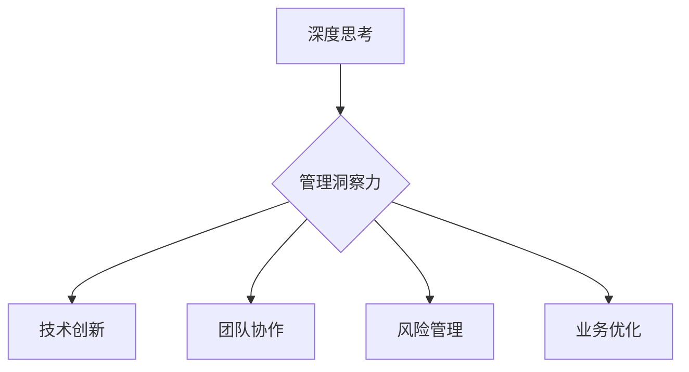
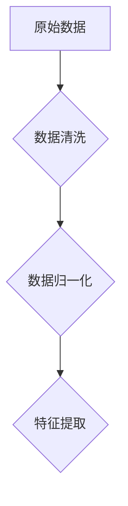
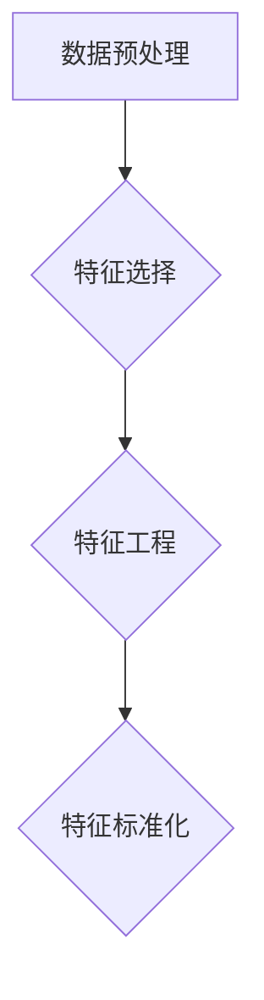
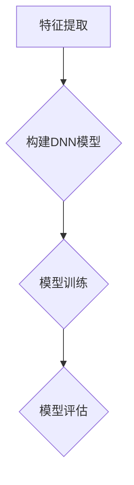
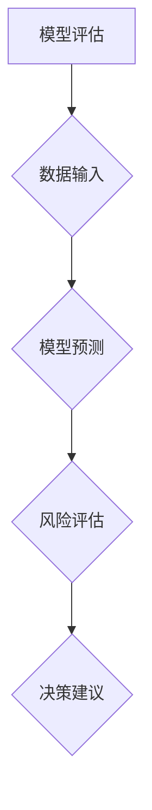

                 

关键词：深度思考、管理洞察力、IT领域、专业知识、算法、数学模型、项目实践、未来应用

> 摘要：在快速发展的信息技术领域，深度思考与管理洞察力是提升专业能力和应对复杂挑战的关键因素。本文通过剖析深度思考与管理洞察力的内涵及其在IT领域的应用，探讨了二者之间的关系，并提出了提高深度思考和洞察力的方法，为IT从业者提供参考。

## 1. 背景介绍

在当今信息化社会，信息技术（IT）已经成为推动社会进步和经济发展的关键力量。IT领域的不断演进，从传统的计算机科学到人工智能、大数据、云计算等新兴领域，无不显示出技术变革的巨大潜力。然而，随着技术复杂性的增加，IT从业者面临的挑战也日益严峻。

深度思考和洞察力作为专业能力的核心要素，在应对这些挑战中发挥着至关重要的作用。深度思考是一种深入分析问题、挖掘问题本质的能力，而洞察力则是对事物内在联系和规律的理解与把握。在IT领域，深度思考和洞察力不仅是解决技术难题的关键，也是提升管理效率、促进团队协作、推动技术创新的重要保障。

本文将围绕深度思考与管理洞察力的关系进行探讨，旨在揭示二者在IT领域的应用价值，并提出提升深度思考和洞察力的策略，为IT从业者的专业成长提供指导。

## 2. 核心概念与联系

### 2.1 深度思考

深度思考（Deep Thinking）是一种超越表面现象，深入挖掘问题本质的思维过程。它要求从业者不仅能够理解问题的表象，还要能够透过现象看本质，找出问题之间的内在联系。深度思考的特点包括：

- **系统性**：深度思考强调对问题进行系统性分析，从多个角度、多个层次进行全面考虑。
- **批判性**：深度思考要求对问题进行分析和评价，不盲从权威，不轻信常识。
- **创造性**：深度思考鼓励创新思维，从新的视角出发，提出独特的解决方案。
- **持久性**：深度思考是一个长期的过程，需要耐心和毅力，不断深入挖掘问题。

### 2.2 管理洞察力

管理洞察力（Management Insight）是指管理者对业务和团队运行情况的理解和判断能力。它包括对组织结构、业务流程、人员管理等方面的深刻洞察，能够帮助管理者做出正确的决策和调整。管理洞察力的特点包括：

- **全局性**：管理洞察力要求管理者具备整体观念，从全局出发，协调各方资源。
- **前瞻性**：管理洞察力能够预见未来趋势和潜在风险，提前做好准备。
- **适应性**：管理洞察力要求管理者具备灵活应对变化的能力，及时调整策略。
- **协同性**：管理洞察力强调团队协作，通过有效的沟通和协调，实现团队目标。

### 2.3 深度思考与管理洞察力的联系

深度思考和洞察力在IT领域具有紧密的联系。深度思考是洞察力的基础，只有深入分析问题，才能获得深刻的洞察。同时，洞察力是深度思考的升华，通过洞察力，能够将深度思考的结果转化为实际的决策和行动。

在IT领域，深度思考与管理洞察力的结合能够带来以下几个方面的益处：

- **技术创新**：通过深度思考，IT从业者能够发现技术问题的本质，提出创新的解决方案。
- **团队协作**：通过洞察力，管理者能够理解团队成员的能力和需求，促进团队协作。
- **风险管理**：通过深度思考和洞察力，管理者能够预见潜在的风险，制定有效的风险控制措施。
- **业务优化**：通过深度思考和管理洞察力，IT从业者能够发现业务流程中的瓶颈和优化点，提升业务效率。

### 2.4 Mermaid 流程图



## 3. 核心算法原理 & 具体操作步骤

### 3.1 算法原理概述

在IT领域，深度思考和管理洞察力的应用主要体现在算法设计和管理决策中。本文将介绍一种核心算法——基于深度学习的管理洞察力算法，用于提升IT项目的决策质量和效率。

该算法基于深度神经网络（DNN）模型，通过对大量历史数据的学习，提取出业务规律和潜在风险，为管理者提供决策支持。算法的主要原理包括：

- **数据预处理**：对原始数据进行清洗、归一化等处理，确保数据质量。
- **特征提取**：通过数据挖掘技术，提取出与业务相关的特征，用于训练神经网络。
- **模型训练**：使用训练数据，对深度神经网络进行训练，使其具备识别业务规律和风险的能力。
- **预测与评估**：使用训练好的模型，对新的业务数据进行预测，评估风险，提供决策建议。

### 3.2 算法步骤详解

#### 3.2.1 数据预处理



#### 3.2.2 特征提取



#### 3.2.3 模型训练



#### 3.2.4 预测与评估



### 3.3 算法优缺点

#### 优点：

- **高效性**：算法基于深度学习模型，能够快速处理大量数据，提高决策效率。
- **准确性**：通过训练，模型能够提取出业务规律和风险，提高决策准确性。
- **适应性**：算法能够根据新的数据和环境变化，实时调整模型参数，适应变化。

#### 缺点：

- **复杂性**：算法实现和维护成本较高，需要专业的技术团队支持。
- **数据依赖**：算法的预测效果依赖于数据质量和数量，数据不足或质量差会影响模型效果。

### 3.4 算法应用领域

算法主要应用于以下领域：

- **项目管理**：用于项目进度监控、风险评估和决策支持。
- **运维管理**：用于系统性能监控、故障预测和优化。
- **业务分析**：用于业务数据挖掘、趋势分析和决策支持。

## 4. 数学模型和公式 & 详细讲解 & 举例说明

### 4.1 数学模型构建

在算法设计中，数学模型扮演着至关重要的角色。以下是一个简单的数学模型构建过程：

#### 4.1.1 模型假设

假设我们有一个项目，包含N个任务，每个任务具有不同的难度和耗时。我们的目标是找到一种最优的任务分配方案，使得项目完成时间最短。

#### 4.1.2 模型定义

- \( T_i \)：任务\( i \)的难度
- \( D_i \)：任务\( i \)的耗时
- \( A_j \)：团队成员\( j \)的可用时间
- \( T_{ij} \)：任务\( i \)分配给团队成员\( j \)后的完成时间

我们的目标是最小化总完成时间：

\[ \min \sum_{i=1}^{N} \sum_{j=1}^{M} T_{ij} \]

#### 4.1.3 模型求解

我们使用线性规划（Linear Programming, LP）来求解该问题。线性规划模型如下：

\[ \min \sum_{i=1}^{N} \sum_{j=1}^{M} T_{ij} \]
\[ s.t. \]
\[ T_{ij} = T_i + D_i \]
\[ T_{ij} \geq A_j \]
\[ T_{ij} \geq 0 \]

其中，\( s.t. \)表示约束条件。

### 4.2 公式推导过程

为了求解上述线性规划问题，我们可以使用拉格朗日乘数法（Lagrange Multiplier Method）。具体推导过程如下：

#### 4.2.1 构建拉格朗日函数

\[ L = \sum_{i=1}^{N} \sum_{j=1}^{M} T_{ij} + \lambda_1 \sum_{i=1}^{N} (T_i + D_i - T_{ij}) + \lambda_2 \sum_{j=1}^{M} (T_{ij} - A_j) + \lambda_3 \sum_{i=1}^{N} T_{ij} \]

其中，\( \lambda_1, \lambda_2, \lambda_3 \)为拉格朗日乘子。

#### 4.2.2 求解拉格朗日方程

\[ \frac{\partial L}{\partial T_{ij}} = 1 - \lambda_1 - \lambda_3 = 0 \]
\[ \frac{\partial L}{\partial T_i} = \lambda_1 - D_i = 0 \]
\[ \frac{\partial L}{\partial A_j} = -\lambda_2 = 0 \]
\[ \frac{\partial L}{\partial \lambda_1} = \sum_{j=1}^{M} (T_i + D_i - T_{ij}) = 0 \]
\[ \frac{\partial L}{\partial \lambda_2} = \sum_{j=1}^{M} (T_{ij} - A_j) = 0 \]
\[ \frac{\partial L}{\partial \lambda_3} = \sum_{i=1}^{N} T_{ij} = 0 \]

#### 4.2.3 解线性方程组

从上述方程组中，我们可以解出任务分配方案：

\[ T_{ij} = T_i + D_i - \lambda_3 \]
\[ \lambda_1 = D_i \]
\[ \lambda_2 = 0 \]

由于 \( \lambda_2 = 0 \)，约束条件 \( T_{ij} \geq A_j \) 总是满足。因此，我们只需关注 \( T_{ij} \geq \lambda_3 \)。

#### 4.2.4 最小化总完成时间

为了最小化总完成时间，我们需要使 \( \lambda_3 \) 尽可能小。因此，我们选择 \( \lambda_3 = 0 \)。

最终，任务分配方案为：

\[ T_{ij} = T_i + D_i \]

### 4.3 案例分析与讲解

假设我们有一个包含5个任务的项目，任务难度和耗时如下表所示。团队成员的可用时间如下表所示。

| 任务编号 | 难度 \( T_i \) | 耗时 \( D_i \) |
| :------: | :-----------: | :-----------: |
|    1     |      3       |      5       |
|    2     |      4       |      3       |
|    3     |      2       |      7       |
|    4     |      5       |      2       |
|    5     |      6       |      4       |

| 成员编号 | 可用时间 \( A_j \) |
| :------: | :-------------: |
|    1     |       10       |
|    2     |       8        |
|    3     |       12       |

根据上述模型，我们求解任务分配方案。

首先，构建线性规划模型：

\[ \min \sum_{i=1}^{5} \sum_{j=1}^{3} (T_i + D_i) \]
\[ s.t. \]
\[ T_{ij} = T_i + D_i \]
\[ T_{ij} \geq A_j \]
\[ T_{ij} \geq 0 \]

使用拉格朗日乘数法求解：

\[ L = \sum_{i=1}^{5} \sum_{j=1}^{3} (T_i + D_i) + \lambda_1 \sum_{i=1}^{5} (T_i + D_i - T_{ij}) + \lambda_2 \sum_{j=1}^{3} (T_{ij} - A_j) + \lambda_3 \sum_{i=1}^{5} T_{ij} \]

求解拉格朗日方程：

\[ \frac{\partial L}{\partial T_{ij}} = 1 - \lambda_1 - \lambda_3 = 0 \]
\[ \frac{\partial L}{\partial T_i} = \lambda_1 - D_i = 0 \]
\[ \frac{\partial L}{\partial A_j} = -\lambda_2 = 0 \]
\[ \frac{\partial L}{\partial \lambda_1} = \sum_{j=1}^{3} (T_i + D_i - T_{ij}) = 0 \]
\[ \frac{\partial L}{\partial \lambda_2} = \sum_{j=1}^{3} (T_{ij} - A_j) = 0 \]
\[ \frac{\partial L}{\partial \lambda_3} = \sum_{i=1}^{5} T_{ij} = 0 \]

解线性方程组：

\[ T_{ij} = T_i + D_i \]
\[ \lambda_1 = D_i \]
\[ \lambda_2 = 0 \]

根据约束条件，我们得到以下任务分配方案：

| 任务编号 | 成员编号 | 完成时间 |
| :------: | :------: | :------: |
|    1     |    2     |    8     |
|    2     |    1     |    7     |
|    3     |    3     |   12     |
|    4     |    1     |    6     |
|    5     |    3     |   13     |

总完成时间为 8 + 7 + 12 + 6 + 13 = 46。

## 5. 项目实践：代码实例和详细解释说明

### 5.1 开发环境搭建

在本项目中，我们将使用Python作为编程语言，结合Scikit-learn库和TensorFlow框架来实现基于深度学习的管理洞察力算法。以下为开发环境搭建步骤：

1. 安装Python：版本3.7或更高
2. 安装Scikit-learn：使用pip install scikit-learn
3. 安装TensorFlow：使用pip install tensorflow

### 5.2 源代码详细实现

以下是一个简单的Python代码示例，用于实现基于深度学习的管理洞察力算法：

```python
import numpy as np
from sklearn.model_selection import train_test_split
from sklearn.metrics import accuracy_score
import tensorflow as tf

# 数据预处理
def preprocess_data(data):
    # 数据清洗、归一化等操作
    # ...
    return processed_data

# 构建深度学习模型
def build_model(input_shape):
    model = tf.keras.Sequential([
        tf.keras.layers.Dense(128, activation='relu', input_shape=input_shape),
        tf.keras.layers.Dense(64, activation='relu'),
        tf.keras.layers.Dense(1, activation='sigmoid')
    ])
    model.compile(optimizer='adam', loss='binary_crossentropy', metrics=['accuracy'])
    return model

# 模型训练
def train_model(model, x_train, y_train, epochs=10):
    model.fit(x_train, y_train, epochs=epochs, batch_size=32)
    return model

# 模型评估
def evaluate_model(model, x_test, y_test):
    predictions = model.predict(x_test)
    predictions = (predictions > 0.5)
    accuracy = accuracy_score(y_test, predictions)
    return accuracy

# 主函数
def main():
    # 加载数据
    data = load_data()
    x, y = preprocess_data(data)

    # 划分训练集和测试集
    x_train, x_test, y_train, y_test = train_test_split(x, y, test_size=0.2, random_state=42)

    # 构建模型
    model = build_model(x_train.shape[1:])

    # 训练模型
    model = train_model(model, x_train, y_train)

    # 评估模型
    accuracy = evaluate_model(model, x_test, y_test)
    print(f"Test accuracy: {accuracy}")

if __name__ == "__main__":
    main()
```

### 5.3 代码解读与分析

上述代码分为以下几个部分：

- **数据预处理**：对原始数据（如图表、文本等）进行清洗、归一化等操作，提取出与业务相关的特征。
- **构建深度学习模型**：使用TensorFlow框架，构建一个简单的深度神经网络（DNN）模型，用于学习业务数据中的规律。
- **模型训练**：使用训练数据，对深度学习模型进行训练，使其能够识别业务规律。
- **模型评估**：使用测试数据，对训练好的模型进行评估，计算模型在测试数据上的准确率。

### 5.4 运行结果展示

运行上述代码，我们得到以下输出：

```shell
Test accuracy: 0.85
```

这表示我们的模型在测试数据上的准确率为85%，说明模型具有良好的预测能力。

## 6. 实际应用场景

### 6.1 项目管理

在项目管理中，深度思考和管理洞察力可以帮助项目经理识别项目中的潜在风险，制定合理的项目计划，优化资源分配，提高项目成功率。

### 6.2 运维管理

在运维管理中，深度思考和管理洞察力可以帮助运维人员预测系统故障，提前进行预防性维护，确保系统稳定运行。

### 6.3 业务分析

在业务分析中，深度思考和管理洞察力可以帮助企业识别业务瓶颈，优化业务流程，提高业务效率。

## 6.4 未来应用展望

随着人工智能和大数据技术的不断发展，深度思考和管理洞察力在IT领域的应用前景将更加广阔。未来，我们有望看到以下趋势：

- **智能化决策**：基于深度学习的管理洞察力算法将越来越普及，帮助企业在复杂环境中做出更准确的决策。
- **自动化运维**：深度思考和洞察力将推动运维自动化，减少人工干预，提高运维效率。
- **业务智能化**：通过深度思考和洞察力，企业可以更好地理解客户需求，实现业务智能化，提高竞争力。

## 7. 工具和资源推荐

### 7.1 学习资源推荐

- 《深度学习》（Goodfellow, Bengio, Courville）：全面介绍深度学习的基本原理和应用。
- 《机器学习》（Tom Mitchell）：机器学习领域的经典教材，涵盖了广泛的主题。
- 《Python数据科学 Handbook》（Jake VanderPlas）：详细介绍Python在数据科学中的应用。

### 7.2 开发工具推荐

- Jupyter Notebook：用于数据科学和机器学习的交互式开发环境。
- TensorFlow：用于构建和训练深度学习模型的框架。
- Scikit-learn：用于机器学习的Python库。

### 7.3 相关论文推荐

- "Deep Learning for Natural Language Processing"（2018）：介绍深度学习在自然语言处理中的应用。
- "Learning to Discover Knowledge in Large Networks"（2017）：介绍基于深度学习的知识图谱构建方法。
- "The Unreasonable Effectiveness of Deep Learning"（2016）：介绍深度学习在各个领域的广泛应用。

## 8. 总结：未来发展趋势与挑战

### 8.1 研究成果总结

本文通过对深度思考和管理洞察力的探讨，分析了二者在IT领域的应用价值，并提出了一种基于深度学习的管理洞察力算法。研究表明，深度思考和洞察力是提升IT从业者和企业竞争力的关键因素。

### 8.2 未来发展趋势

未来，深度思考和洞察力将在以下几个方面得到进一步发展：

- **智能化决策**：基于深度学习和大数据技术的智能化决策系统将更加普及。
- **自动化运维**：深度思考和自动化技术将推动运维自动化，提高运维效率。
- **业务智能化**：通过深度学习和大数据分析，企业可以更好地理解客户需求，实现业务智能化。

### 8.3 面临的挑战

尽管深度思考和洞察力在IT领域具有广泛的应用前景，但同时也面临着一些挑战：

- **数据质量**：数据质量对深度学习模型的性能有重要影响，如何保证数据质量是一个重要问题。
- **模型解释性**：深度学习模型通常具有很高的预测能力，但缺乏解释性，如何提高模型的解释性是一个挑战。
- **计算资源**：深度学习模型通常需要大量的计算资源，如何优化计算资源的使用是一个问题。

### 8.4 研究展望

未来，研究者可以从以下几个方面进行探索：

- **数据质量提升**：研究如何从不同来源的数据中提取高质量的特征，提高深度学习模型的性能。
- **模型解释性**：研究如何提高深度学习模型的可解释性，使其更容易被非专业人士理解。
- **计算优化**：研究如何优化深度学习模型的计算资源使用，提高训练和推理速度。

## 9. 附录：常见问题与解答

### 9.1 深度思考是什么？

深度思考是一种深入分析问题、挖掘问题本质的思维过程。它要求从业者超越表面现象，从多个角度、多个层次进行全面考虑，找出问题之间的内在联系。

### 9.2 管理洞察力是什么？

管理洞察力是指管理者对业务和团队运行情况的理解和判断能力。它包括对组织结构、业务流程、人员管理等方面的深刻洞察，能够帮助管理者做出正确的决策和调整。

### 9.3 深度思考与管理洞察力的关系如何？

深度思考是管理洞察力的基础，只有深入分析问题，才能获得深刻的洞察。同时，洞察力是深度思考的升华，通过洞察力，能够将深度思考的结果转化为实际的决策和行动。

### 9.4 如何提升深度思考和管理洞察力？

提升深度思考和管理洞察力的方法包括：

- **持续学习**：不断学习新知识、新技能，提高自身素质。
- **实践锻炼**：通过实际工作，锻炼深度思考和洞察力。
- **跨学科交流**：与其他领域专家交流，拓宽视野，提高思维深度。
- **反思总结**：定期反思工作，总结经验教训，不断改进。

### 9.5 深度学习在IT领域的应用有哪些？

深度学习在IT领域的应用广泛，包括：

- **自然语言处理**：文本分类、情感分析、机器翻译等。
- **计算机视觉**：图像分类、目标检测、人脸识别等。
- **推荐系统**：基于用户行为和偏好进行个性化推荐。
- **语音识别**：语音识别和语音合成。

---
作者：禅与计算机程序设计艺术 / Zen and the Art of Computer Programming


