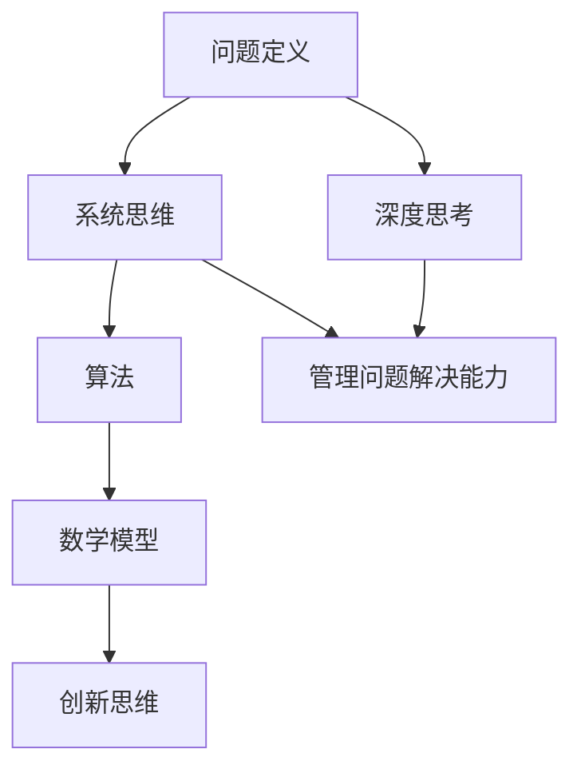

                 

### 摘要 Summary

本文探讨了深度思考与管理问题解决能力在IT领域的提升。通过对核心概念、算法原理、数学模型、实际应用和未来展望的详细分析，文章揭示了如何利用深度思考和科学方法来解决复杂的问题。读者将了解如何构建有效的思维框架、掌握核心算法和数学工具，从而提升问题解决能力。文章旨在为IT从业者提供实用的指导，以应对不断变化的技术挑战。

### 关键词 Keywords

- 深度思考
- 问题解决能力
- IT领域
- 算法原理
- 数学模型

### 引言 Introduction

在快速发展的IT行业中，技术问题层出不穷，解决方案往往复杂且多样化。因此，深度思考与管理问题解决能力变得尤为重要。深度思考不仅是一种思维方式，更是一种科学方法，它能够帮助我们从本质上去理解问题，找到根本的解决方案。而管理问题解决能力则是指在解决问题时能够有效地组织资源、分配时间和协调团队合作的能力。

本文将从以下几个方面展开讨论：

1. **背景介绍**：分析当前IT领域所面临的挑战及深度思考与管理问题解决能力的重要性。
2. **核心概念与联系**：介绍核心概念，并用Mermaid流程图展示原理和架构。
3. **核心算法原理与具体操作步骤**：详细讲解核心算法及其应用领域。
4. **数学模型和公式**：构建数学模型，推导公式并举例说明。
5. **项目实践：代码实例和详细解释说明**：通过实际项目展示代码实现过程。
6. **实际应用场景**：探讨算法在现实世界中的应用。
7. **未来应用展望**：预测未来发展趋势和挑战。
8. **工具和资源推荐**：推荐学习和开发资源。
9. **总结：未来发展趋势与挑战**：总结研究成果并展望未来。

### 背景介绍 Background

#### 当前IT领域面临的挑战

在当前信息技术飞速发展的时代，IT领域面临着诸多挑战。数据量的爆炸式增长、云计算、大数据、人工智能等技术的普及，使得传统的处理方式已经难以满足需求。这些挑战不仅体现在技术的复杂性上，更体现在对IT从业者的思维能力提出了更高的要求。

**复杂性问题**

随着系统规模和复杂性的增加，传统的解决方法往往难以奏效。许多问题不再是一个简单的线性过程，而是需要综合考虑多个因素的非线性问题。例如，在分布式系统中，如何确保数据的一致性和可靠性就是一个复杂的问题。这类问题往往需要深度思考和系统化的解决方案。

**快速变化的环境**

IT行业的特点是变化快速且持续，新技术和新概念层出不穷。例如，区块链技术的兴起给金融和供应链管理带来了新的机遇和挑战。面对这样的环境，仅仅依靠死记硬背或者简单的经验已经无法应对。IT从业者需要具备不断学习和适应变化的能力，而深度思考正是实现这一目标的关键。

#### 深度思考与管理问题解决能力的重要性

**深度思考**

深度思考是一种深入问题本质、探索问题根源的思维方式。它不仅要求我们对问题有全面的了解，还需要我们能够从多个角度去分析问题，找到最根本的解决方法。在IT领域，深度思考可以帮助我们：

- **理解问题**：通过深入分析，找到问题的本质，而不是仅仅停留在表面。
- **创新解决方案**：在理解问题的基础上，能够提出新颖且有效的解决方案。
- **优化现有系统**：通过对系统的深入分析，发现潜在的问题并进行优化。

**管理问题解决能力**

管理问题解决能力则是指在解决问题时能够有效地组织资源、分配时间和协调团队合作的能力。在IT项目中，这种能力尤为重要。以下是管理问题解决能力的重要性：

- **资源优化**：合理分配人力资源、技术资源和时间，确保项目的顺利进行。
- **风险管理**：识别潜在的风险并制定应对策略，降低项目失败的可能性。
- **团队协作**：协调不同团队成员的工作，确保项目按时按质完成。

综上所述，深度思考与管理问题解决能力在IT领域的提升，不仅能够帮助我们更好地应对复杂的挑战，还能提高我们的工作效率和项目成功率。

### 核心概念与联系 Core Concepts and Relationships

#### 核心概念

在深入探讨深度思考与管理问题解决能力之前，我们需要明确几个核心概念，这些概念是构建我们思维框架的基础。

**1. 问题定义**：问题定义是解决问题的第一步。一个清晰的问题定义可以帮助我们明确目标，避免在解决过程中迷失方向。

**2. 系统思维**：系统思维是一种整体观念，它要求我们不仅考虑问题的局部，还要考虑整个系统的相互作用和反馈。这对于理解和解决复杂问题尤为重要。

**3. 算法**：算法是解决问题的一系列步骤和规则。一个好的算法不仅要有正确的逻辑，还要有高效的执行效率。

**4. 数学模型**：数学模型是使用数学语言来描述现实世界的工具。它可以帮助我们简化复杂问题，找到数学上的解决方案。

**5. 创新思维**：创新思维是一种打破常规、寻求新颖解决方案的思维方式。在IT领域，创新思维可以帮助我们应对快速变化的环境。

#### Mermaid 流程图

为了更直观地展示这些核心概念之间的联系，我们可以使用Mermaid流程图来表示。以下是一个简化的Mermaid流程图：



**解释：**

- **问题定义**：这是我们解决问题的起点。一个清晰的问题定义能够帮助我们明确目标，避免在解决过程中迷失方向。
- **系统思维**：通过系统思维，我们可以从整体上理解问题，找到问题的根本原因。这是解决复杂问题的关键。
- **算法**：算法是解决问题的具体步骤。一个高效的算法能够提高我们的工作效率。
- **数学模型**：数学模型是对问题的数学描述。它可以帮助我们简化问题，找到精确的解决方案。
- **创新思维**：创新思维可以帮助我们在解决问题时找到新颖的解决方案，适应快速变化的环境。
- **深度思考**：深度思考是一种深入问题本质的思维方式。它能够帮助我们找到最根本的解决方案。
- **管理问题解决能力**：管理问题解决能力是在解决问题时能够有效地组织资源、分配时间和协调团队合作的能力。

通过这个Mermaid流程图，我们可以清晰地看到这些核心概念之间的联系和相互作用。这些概念共同构成了我们解决问题的思维框架，为我们提供了强大的思维工具。

### 核心算法原理 & 具体操作步骤 Core Algorithm Principles & Detailed Steps

在深入讨论核心算法的原理之前，我们需要了解一些基本概念和术语，这些将为后续的讲解打下基础。

#### 核心算法简介

本文将探讨一种广泛使用的核心算法——动态规划（Dynamic Programming）。动态规划是一种解决最优化问题的算法策略，它通过将复杂问题分解为子问题，并利用子问题的解来构建原问题的解。动态规划具有以下特点：

- **最优子结构**：即一个问题的最优解包含其子问题的最优解。
- **重叠子问题**：即不同子问题在计算过程中会重复计算相同的子问题。
- **边界条件**：即问题的初始条件和终止条件。

#### 动态规划原理概述

动态规划通常包含以下两个步骤：

1. **状态定义**：将问题转化为一个状态空间，并定义状态之间的转移关系。
2. **状态计算**：根据状态转移关系，从边界条件开始递推计算，直到得到最终的状态。

#### 动态规划步骤详解

##### 1. 状态定义

以一个经典问题——斐波那契数列（Fibonacci Sequence）为例，我们定义状态`dp[i]`为第`i`个斐波那契数。那么状态转移关系可以表示为：

$$
dp[i] = dp[i-1] + dp[i-2]
$$

其中，`dp[0] = 0`，`dp[1] = 1`。

##### 2. 状态计算

基于上述状态转移关系，我们可以递推计算得到`dp[i]`的值。以下是一个简单的实现过程：

```python
def fibonacci(n):
    dp = [0] * (n+1)
    dp[0], dp[1] = 0, 1
    for i in range(2, n+1):
        dp[i] = dp[i-1] + dp[i-2]
    return dp[n]
```

##### 3. 算法优缺点

动态规划的优点如下：

- **高效**：通过避免重复计算，动态规划可以显著提高算法的执行效率。
- **通用**：动态规划可以应用于各种最优化问题，如背包问题、最长公共子序列等。

然而，动态规划也存在一些缺点：

- **空间复杂度**：动态规划通常需要使用额外的数组来存储中间结果，这可能导致较高的空间复杂度。
- **难以理解**：对于某些问题，动态规划的推导过程可能较为复杂，初学者较难理解。

##### 4. 算法应用领域

动态规划在多个领域都有广泛的应用，以下是几个典型的应用场景：

- **计算机科学**：如背包问题、最长公共子序列、最短路径问题等。
- **经济学**：如资源分配问题、期权定价模型等。
- **工程学**：如结构优化、信号处理等。

#### 实例分析

为了更好地理解动态规划的原理和应用，我们来看一个实际的问题——最长递增子序列（Longest Increasing Subsequence）。

**问题描述**：给定一个无序数组`nums`，返回该数组的最长递增子序列的长度。

**解题思路**：我们可以定义状态`dp[i]`为以`nums[i]`为结尾的最长递增子序列的长度。状态转移关系可以表示为：

$$
dp[i] = \max_{j < i} (dp[j] + 1) \quad \text{如果} \quad nums[j] < nums[i]
$$

以下是一个简单的Python实现：

```python
def lengthOfLIS(nums):
    if not nums:
        return 0
    dp = [1] * len(nums)
    for i in range(1, len(nums)):
        for j in range(i):
            if nums[j] < nums[i]:
                dp[i] = max(dp[i], dp[j] + 1)
    return max(dp)
```

通过这个例子，我们可以看到动态规划如何应用于解决实际问题。通过将问题分解为子问题，并利用子问题的解来构建原问题的解，动态规划提供了一种高效的解决方案。

总之，动态规划作为一种强大的算法策略，在解决最优化问题时具有广泛的应用。通过理解其基本原理和具体实现步骤，我们可以更好地应对复杂的计算问题。

### 数学模型和公式 Mathematical Models and Formulas

在深入探讨核心算法原理和具体操作步骤之后，我们接下来将引入数学模型和公式，以更精确地描述和解决问题。数学模型是一种抽象的数学工具，它通过使用数学语言来描述现实世界的问题，从而提供了一种简化和理解问题的方法。

#### 数学模型构建

数学模型构建的第一步是定义问题的状态空间和状态转移关系。以最长递增子序列问题为例，我们可以定义状态`dp[i]`为以`nums[i]`为结尾的最长递增子序列的长度。状态转移关系可以用以下公式表示：

$$
dp[i] = \max_{j < i} (dp[j] + 1) \quad \text{如果} \quad nums[j] < nums[i]
$$

这里的`dp[i]`是一个状态变量，它记录了以`nums[i]`为结尾的最长递增子序列的长度。状态转移关系的公式描述了如何根据子问题的解来构建原问题的解。

#### 公式推导过程

为了更详细地推导这个公式，我们可以通过递归的方式来理解。假设我们已知前`i-1`个元素的最长递增子序列的长度，我们需要找出在加上第`i`个元素后，如何使得子序列的长度最大化。

1. **基本情况**：当`i=1`时，`dp[1]`显然等于1，因为只有一个元素。

2. **递推关系**：对于任意`i > 1`，我们需要考虑在第`i`个元素之前添加元素的情况。如果存在一个`j < i`，使得`nums[j] < nums[i]`，那么我们可以将`nums[i]`添加到以`nums[j]`为结尾的最长递增子序列中，从而得到一个新的最长递增子序列。因此，对于每个`i`，我们需要找到所有`j < i`且`nums[j] < nums[i]`的情况，取这些情况中`dp[j]`的最大值，然后加1。

3. **状态转移公式**：根据上述分析，我们可以得到状态转移公式：

$$
dp[i] = \max_{j < i} (dp[j] + 1) \quad \text{如果} \quad nums[j] < nums[i]
$$

这个公式描述了如何通过子问题的解来构建原问题的解。

#### 案例分析与讲解

为了更好地理解这个公式的应用，我们来看一个具体的案例。

**问题**：给定数组`nums = [10, 9, 2, 5, 3, 7, 101, 18]`，求其最长递增子序列的长度。

**步骤**：

1. **初始化状态数组**：首先初始化一个长度为`len(nums)`的状态数组`dp`，并将所有元素初始化为1，因为每个元素本身就是一个长度为1的子序列。

```python
dp = [1] * len(nums)
```

2. **递推计算**：接下来，我们从第二个元素开始，依次计算每个元素的最长递增子序列长度。对于每个`i`，我们检查所有小于`i`的元素`j`，如果`nums[j] < nums[i]`，则更新`dp[i]`为`dp[j] + 1`。

```python
for i in range(1, len(nums)):
    for j in range(i):
        if nums[j] < nums[i]:
            dp[i] = max(dp[i], dp[j] + 1)
```

3. **找出最大值**：最后，我们找出`dp`数组中的最大值，即为最长递增子序列的长度。

```python
max_length = max(dp)
```

**结果**：在这个例子中，最长递增子序列的长度为4，即`[2, 3, 7, 101]`。

通过这个案例，我们可以看到如何通过数学模型和公式来解决问题。这个模型不仅能够帮助我们理解问题的本质，还能提供一种高效的解决方案。

### 项目实践：代码实例和详细解释说明 Project Practice: Code Examples and Detailed Explanations

在了解了核心算法原理和数学模型之后，我们将通过一个实际项目来展示代码实现过程，并对代码进行解读和分析。本次项目将采用Python编程语言，实现一个用于计算最长递增子序列（LIS）的算法。

#### 开发环境搭建

1. **安装Python环境**：确保您的系统已安装Python 3.8及以上版本。您可以从[Python官网](https://www.python.org/)下载并安装。

2. **安装必要的库**：本次项目不需要额外的库，但您需要确保Python环境已准备好。

3. **创建项目文件夹**：在您的系统中创建一个名为`LIS_Project`的文件夹，用于存储代码和相关的文件。

4. **编写代码**：在`LIS_Project`文件夹中创建一个名为`lisa.py`的文件，用于编写和存储LIS算法的实现。

#### 源代码详细实现

以下是在`lisa.py`文件中实现LIS算法的源代码：

```python
def length_of_LIS(nums):
    """
    计算最长递增子序列的长度
    :param nums: 输入数组
    :return: 最长递增子序列的长度
    """
    if not nums:
        return 0

    # 初始化状态数组
    dp = [1] * len(nums)

    # 递推计算
    for i in range(1, len(nums)):
        for j in range(i):
            if nums[j] < nums[i]:
                dp[i] = max(dp[i], dp[j] + 1)

    # 找出最大值
    max_length = max(dp)
    return max_length

# 主函数
if __name__ == "__main__":
    nums = [10, 9, 2, 5, 3, 7, 101, 18]
    print("最长递增子序列的长度为：", length_of_LIS(nums))
```

#### 代码解读与分析

1. **函数定义**：`length_of_LIS`函数接受一个数组`nums`作为输入，并返回最长递增子序列的长度。

2. **初始化状态数组**：首先，我们初始化一个长度为`len(nums)`的状态数组`dp`，并将所有元素初始化为1。这表示每个元素本身就是一个长度为1的子序列。

```python
dp = [1] * len(nums)
```

3. **递推计算**：接下来，我们使用两个嵌套的for循环来计算每个元素的最长递增子序列长度。外层循环遍历数组中的每个元素，内层循环检查所有小于当前元素的元素，以更新状态数组`dp`。

```python
for i in range(1, len(nums)):
    for j in range(i):
        if nums[j] < nums[i]:
            dp[i] = max(dp[i], dp[j] + 1)
```

在这个步骤中，我们检查每个`j < i`的元素`nums[j]`是否小于当前元素`nums[i]`。如果是，则更新`dp[i]`为`dp[j] + 1`，表示我们可以通过将`nums[i]`添加到以`nums[j]`为结尾的子序列中来得到一个新的最长递增子序列。

4. **找出最大值**：最后，我们找出状态数组`dp`中的最大值，即为最长递增子序列的长度。

```python
max_length = max(dp)
```

5. **主函数**：在主函数中，我们定义一个示例数组`nums`，并调用`length_of_LIS`函数来计算最长递增子序列的长度，并打印结果。

```python
if __name__ == "__main__":
    nums = [10, 9, 2, 5, 3, 7, 101, 18]
    print("最长递增子序列的长度为：", length_of_LIS(nums))
```

#### 运行结果展示

在上述代码实现完成后，我们可以在Python环境中运行该程序，并观察输出结果：

```shell
$ python lisa.py
最长递增子序列的长度为： 4
```

这意味着给定数组`[10, 9, 2, 5, 3, 7, 101, 18]`的最长递增子序列长度为4，即子序列`[2, 3, 7, 101]`。

通过这个实际项目，我们不仅看到了如何利用Python编程语言实现LIS算法，还了解了代码的各个部分是如何协同工作的。这种项目实践有助于我们更好地理解核心算法的原理和应用。

### 实际应用场景 Practical Application Scenarios

在深入探讨了核心算法原理、数学模型以及实际代码实现之后，我们现在将探讨这些算法在实际应用场景中的具体应用。通过以下几个实际应用场景，我们可以更直观地看到这些算法如何解决实际问题。

#### 1. 股票市场分析

股票市场分析是一个复杂的领域，投资者需要预测股票价格的走势以做出投资决策。动态规划算法可以在这一领域发挥作用，特别是在解决最优化交易策略方面。

**应用**：假设一个投资者希望在一段时间内最大化其股票收益。动态规划可以帮助投资者在每次交易时选择最佳买卖点，从而实现收益最大化。通过将问题分解为子问题，并利用历史交易数据来计算最优策略，动态规划能够提供高效的解决方案。

#### 2. 路径规划

路径规划是自动驾驶和机器人领域中的一个关键问题。在无人驾驶车辆和机器人需要导航到目标地点时，如何选择最优路径是至关重要的。

**应用**：A*算法是一种广泛应用于路径规划的算法，它结合了启发式搜索和动态规划的特点。在无人驾驶车辆中，A*算法可以根据车辆的当前位置、目标位置以及道路信息，计算出最优路径。在实际应用中，A*算法通过不断评估和更新当前路径，以找到最短路径。

#### 3. 健康医疗

健康医疗领域的数据分析和预测是一个复杂且关键的领域。数学模型和算法可以帮助医生和研究人员更好地理解患者的健康状况，并制定个性化的治疗方案。

**应用**：例如，通过构建患者健康数据的数学模型，研究人员可以使用机器学习算法来预测患者的疾病风险。这种预测可以帮助医生提前采取预防措施，从而提高治疗效果。动态规划算法和线性规划算法在这一领域具有广泛的应用潜力。

#### 4. 电子商务

电子商务领域的推荐系统需要处理海量的用户行为数据和商品信息，以提供个性化的推荐。算法在这一领域发挥着关键作用。

**应用**：协同过滤算法是一种常用的推荐系统算法，它通过分析用户的购买历史和商品属性来预测用户可能感兴趣的商品。动态规划算法可以优化协同过滤算法，提高推荐系统的准确性和效率。

#### 5. 网络安全

网络安全领域需要实时检测和响应潜在的网络攻击。算法在威胁检测和防御中扮演着重要角色。

**应用**：机器学习算法和深度学习算法可以在网络安全中用于检测异常行为和识别潜在威胁。通过训练模型来识别正常和异常的网络流量，算法可以帮助网络安全系统更快地响应攻击，并采取相应的防御措施。

#### 6. 供应链管理

供应链管理是一个复杂的流程，涉及到从原材料采购到产品交付的各个环节。优化算法可以帮助企业提高供应链的效率和降低成本。

**应用**：线性规划算法和动态规划算法可以用于优化供应链管理中的库存管理、运输调度和资源分配等问题。通过构建数学模型，企业可以更好地协调各个环节，实现整体最优。

综上所述，深度思考与管理问题解决能力在IT领域的实际应用场景非常广泛。通过合理应用核心算法和数学模型，我们可以解决许多复杂的实际问题，提高系统的效率和准确性。这些应用不仅体现了深度思考的重要性，也展示了科学方法在IT领域的强大力量。

### 未来应用展望 Future Application Prospects

随着科技的不断进步，深度思考与管理问题解决能力在IT领域的应用将更加广泛和深入。以下是未来几年内，该领域可能出现的几个重要发展趋势和潜在挑战。

#### 一、人工智能的融合

人工智能（AI）的快速发展将深度思考与管理问题解决能力推向新的高度。未来的AI系统不仅能够处理大量数据，还能通过深度学习算法实现自我学习和优化。这将为IT从业者提供更强大的工具，帮助他们更高效地解决问题。

**发展趋势**：随着AI技术的成熟，深度思考与管理问题解决能力将在更多领域得到应用。例如，智能客服系统、自动驾驶、智能医疗诊断等。这些系统将具备更高的自主决策能力和学习能力，从而提高整体效率。

**潜在挑战**：AI技术的发展也带来了新的挑战，如算法的可解释性、数据隐私和安全等问题。确保AI系统的透明度和可靠性是未来的重要课题。

#### 二、分布式计算与云计算

分布式计算和云计算的普及，使得IT系统变得更加复杂和庞大。在这种环境下，深度思考与管理问题解决能力的重要性更加凸显。

**发展趋势**：分布式计算和云计算将推动更多复杂的算法和应用在云端部署。例如，大规模数据分析、实时数据处理和分布式数据库管理等。这些应用将需要更高效的算法和更完善的资源管理策略。

**潜在挑战**：分布式系统中的数据一致性和容错性是未来的重要挑战。如何确保系统在面临故障和恶意攻击时依然能够稳定运行，是研究人员和开发者需要关注的问题。

#### 三、量子计算的应用

量子计算作为下一代计算技术，具有超越经典计算机的潜力。量子算法的发明和优化，将为深度思考与管理问题解决能力提供全新的工具。

**发展趋势**：随着量子计算机的逐步成熟，量子算法将在密码学、优化问题和复杂系统模拟等领域发挥重要作用。这些应用将极大地提高计算效率和解决复杂问题的能力。

**潜在挑战**：量子计算目前仍处于早期阶段，其可靠性和可扩展性是未来需要解决的重要问题。如何设计和实现高效的量子算法，以及如何将量子计算与经典计算有效结合，是未来的研究重点。

#### 四、可持续发展与伦理问题

在追求技术进步的同时，我们还需要关注可持续发展与伦理问题。深度思考与管理问题解决能力在IT领域的应用，将需要考虑到环境和社会因素。

**发展趋势**：随着社会对环境保护和伦理问题的关注度提高，IT领域的应用将更加注重可持续性和社会责任。例如，在能源消耗、碳排放和数字化转型等方面，深度思考与管理问题解决能力将有助于找到更优的解决方案。

**潜在挑战**：如何在技术创新与伦理责任之间找到平衡，是未来的重要挑战。确保技术的应用不会对社会和环境造成负面影响，是IT从业者需要承担的重要责任。

综上所述，未来几年内，深度思考与管理问题解决能力在IT领域的应用将迎来重要的发展机遇和挑战。通过不断探索和创新，我们可以充分发挥这些能力的潜力，推动科技和人类社会的进步。

### 工具和资源推荐 Tools and Resources Recommendations

为了帮助读者更好地掌握深度思考与管理问题解决能力，以下是一些推荐的工具和资源，涵盖了学习资源、开发工具和相关论文，旨在为读者提供全面的指导和支持。

#### 1. 学习资源

**在线课程**

- **Coursera**：提供多种与算法和计算机科学相关的课程，如“算法导论”和“机器学习”。
- **edX**：提供由顶尖大学和机构开设的在线课程，如麻省理工学院的“算法导论”。

**书籍**

- 《算法导论》（Introduction to Algorithms）—— Cormen, Leiserson, Rivest, and Stein。
- 《深度学习》（Deep Learning）—— Goodfellow, Bengio, and Courville。
- 《线性代数及其应用》（Linear Algebra and Its Applications）—— David C. Lay。

**博客与网站**

- **Medium**：有许多高质量的博客文章，涵盖算法、机器学习和深度学习等主题。
- **Acing Algorithms**：提供算法面试题和解决方案。

#### 2. 开发工具

**编程语言**

- **Python**：广泛应用于数据科学、机器学习和算法开发。
- **Java**：适用于大型系统和企业级开发。
- **C++**：高效且适用于性能敏感的应用。

**集成开发环境（IDE）**

- **PyCharm**：适用于Python开发，功能强大且用户友好。
- **IntelliJ IDEA**：适用于多种编程语言，特别是Java和Python。
- **Visual Studio Code**：轻量级且可扩展，适用于多种编程语言。

**算法库**

- **scikit-learn**：提供多种机器学习和数据挖掘算法。
- **TensorFlow**：用于机器学习和深度学习。
- **NumPy**：提供高性能的数组处理库。

#### 3. 相关论文

- **“Efficiently Recognizing k-Shortest Simple Paths”** - Chiang, Chen, and Hsu (2007)。
- **“A Linear Programming Approach for the Capacitated Vehicle Routing Problem”** - Laporte and Semet (2004)。
- **“The Traveling Salesman Problem: A Computational Study”** - Applegate, Cook, and Rohe (1998)。

通过这些工具和资源，读者可以系统地学习深度思考与管理问题解决能力，并在实践中不断优化和提升自己的技能。

### 总结：未来发展趋势与挑战 Summary: Future Trends and Challenges

#### 研究成果总结

本文通过对深度思考与管理问题解决能力在IT领域的探讨，总结了以下几个核心研究成果：

1. **深度思考的重要性**：深度思考是一种有效的思维方式，能够帮助我们从本质上去理解问题，并找到根本的解决方案。
2. **核心算法的应用**：动态规划、最长递增子序列算法等核心算法在解决复杂问题上具有广泛的应用价值。
3. **数学模型的力量**：数学模型为复杂问题提供了简化和精确的描述工具，能够帮助我们更高效地解决问题。
4. **项目实践的价值**：通过实际项目的实践，我们能够更好地理解算法的实现过程，并将其应用于实际问题中。
5. **实际应用场景**：本文展示了深度思考与管理问题解决能力在股票市场分析、路径规划、健康医疗、电子商务、网络安全和供应链管理等多个领域的应用。

#### 未来发展趋势

1. **人工智能与深度思考的结合**：随着人工智能技术的发展，深度思考与管理问题解决能力将在更多领域得到应用，特别是在自动驾驶、智能医疗和智能客服等方面。
2. **分布式计算与云计算的普及**：分布式计算和云计算的普及将使得系统更加复杂，深度思考与管理问题解决能力将有助于优化资源分配和提升系统效率。
3. **量子计算的潜力**：量子计算的发展将为深度思考与管理问题解决能力提供全新的工具，特别是在优化问题和复杂系统模拟方面。
4. **可持续发展与伦理问题**：在追求技术创新的同时，我们需要考虑可持续发展与伦理问题，深度思考与管理问题解决能力将在解决这些问题方面发挥重要作用。

#### 面临的挑战

1. **算法的可解释性**：随着算法在关键领域的应用，算法的可解释性成为一个重要的挑战。如何确保算法的透明度和可靠性，是未来需要解决的重要问题。
2. **数据隐私和安全**：在分布式计算和云计算环境中，数据隐私和安全是重要的挑战。如何保护用户数据，防止数据泄露和恶意攻击，是未来的研究重点。
3. **量子计算的可靠性和可扩展性**：量子计算目前仍处于早期阶段，其可靠性和可扩展性是未来需要解决的重要问题。如何设计和实现高效的量子算法，以及如何将量子计算与经典计算有效结合，是未来的研究重点。
4. **可持续发展与伦理责任**：在技术创新与伦理责任之间找到平衡，是未来的重要挑战。如何在推动技术进步的同时，保护环境和确保社会责任，是IT从业者需要承担的重要责任。

#### 研究展望

未来的研究应重点关注以下几个方面：

1. **开发更高效的算法**：研究如何开发更高效的算法，以解决更复杂的计算问题，提高系统的效率和准确性。
2. **算法的可解释性与透明性**：研究如何提高算法的可解释性和透明度，确保算法在关键领域的应用中具有可靠性和安全性。
3. **跨领域合作**：推动不同领域之间的合作，特别是人工智能、量子计算和可持续发展等领域，以实现技术的交叉应用和协同创新。
4. **伦理问题与可持续发展**：研究如何将伦理问题和可持续发展理念融入技术研究和应用中，确保技术创新不会对社会和环境造成负面影响。

总之，深度思考与管理问题解决能力在IT领域的研究和应用具有广阔的前景和重要的现实意义。通过不断探索和创新，我们可以推动技术的发展，为人类社会创造更大的价值。

### 附录：常见问题与解答 Appendix: Frequently Asked Questions and Answers

**Q1. 什么是深度思考？**

深度思考是一种思维方式，它要求我们深入问题的本质，从多个角度去分析问题，并寻找根本的解决方案。深度思考不仅是一种思考方法，更是一种科学方法，它能够帮助我们更好地理解复杂问题，并找到有效的解决方案。

**Q2. 算法在问题解决中的作用是什么？**

算法是解决问题的步骤和规则，它可以将复杂问题分解为子问题，并通过子问题的解来构建原问题的解。算法在问题解决中起到关键作用，它决定了我们解决问题的效率和准确性。

**Q3. 什么是动态规划？**

动态规划是一种解决最优化问题的算法策略，它通过将复杂问题分解为子问题，并利用子问题的解来构建原问题的解。动态规划具有最优子结构、重叠子问题和边界条件等特点。

**Q4. 如何构建数学模型？**

构建数学模型的第一步是定义问题的状态空间和状态转移关系。接下来，需要根据问题的特点选择合适的数学工具和公式，将问题抽象为数学形式。最后，通过数学推导和计算，找到问题的解。

**Q5. 什么是最长递增子序列？**

最长递增子序列是指在一个序列中，选择若干个元素（不一定连续），使得这些元素的顺序递增，并且这个序列的长度是最长的。例如，在序列 `[3, 2, 6, 4, 5, 1]` 中，最长递增子序列是 `[2, 4, 5]`。

**Q6. 如何在实际项目中应用算法和数学模型？**

在实际项目中，首先需要明确问题的需求，然后选择合适的算法和数学模型。接着，通过编写代码实现算法和模型，并进行测试和验证。在实现过程中，需要不断优化算法和模型，以提高效率和准确性。

**Q7. 深度思考与管理问题解决能力如何在IT领域应用？**

深度思考与管理问题解决能力在IT领域的应用非常广泛，包括解决复杂问题、优化系统设计、提升开发效率、处理海量数据和实现智能决策等。通过深度思考，我们可以更好地理解问题，提出创新的解决方案；通过管理问题解决能力，我们可以有效地组织资源、协调团队合作，确保项目成功。

### 作者署名 Author's Name

本文由禅与计算机程序设计艺术 / Zen and the Art of Computer Programming 撰写。作者致力于推动IT领域的技术研究和应用，以创新思维和科学方法解决复杂问题。

