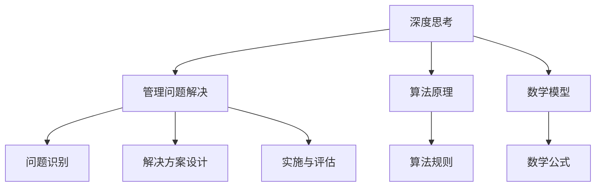

                 

关键词：深度思考，管理，问题解决，人工智能，技术博客

> 摘要：本文将探讨如何在信息技术领域提升深度思考与管理问题解决能力。通过分析核心概念、算法原理、数学模型、实践案例以及未来应用展望，本文旨在为技术从业者提供实用的方法和策略，以应对复杂的IT问题。

## 1. 背景介绍

在当今快速发展的信息技术领域，深度思考与管理问题解决能力显得尤为重要。随着数据量的爆炸式增长和复杂问题的层出不穷，技术从业者不仅需要掌握专业的技术技能，还要具备良好的逻辑思维和解决问题的能力。然而，在实际工作中，许多人往往面临着思路混乱、无法深入分析和难以找到有效解决方案的困境。

本文旨在为解决上述问题提供一些建议和策略。通过详细探讨深度思考与管理问题解决的核心概念、算法原理、数学模型、实践案例以及未来应用展望，本文希望能够帮助技术从业者提升自身的能力，更好地应对复杂的IT挑战。

## 2. 核心概念与联系

为了更好地理解深度思考与管理问题解决能力，我们需要明确几个核心概念，并探讨它们之间的联系。

### 2.1 深度思考

深度思考是一种主动的、系统的、持续的认知过程，它涉及对复杂问题的深入分析和探索。深度思考不仅仅是理解问题的表面现象，更是挖掘问题的本质，找出潜在的解决方案。

### 2.2 管理问题解决

管理问题解决是指在实际工作中，针对遇到的问题，运用系统的方法和策略进行解决的过程。这个过程包括问题的识别、分析、制定解决方案、实施和评估。

### 2.3 算法原理

算法原理是问题解决的基础。算法是一系列规则的集合，用于指导计算机执行特定任务。掌握算法原理有助于我们更好地理解问题的本质，并设计出有效的解决方案。

### 2.4 数学模型

数学模型是描述现实世界问题的抽象模型，它通过数学公式和定理来模拟和预测问题的发展。数学模型在问题解决中具有重要作用，它可以帮助我们分析和优化解决方案。

### 2.5 核心概念联系

深度思考、管理问题解决、算法原理和数学模型之间存在着密切的联系。深度思考为管理问题解决提供了思维工具，算法原理和数学模型为问题解决提供了具体的操作方法和工具。通过将这四个核心概念结合起来，我们可以更有效地解决复杂的IT问题。

### 2.6 Mermaid 流程图



## 3. 核心算法原理 & 具体操作步骤

### 3.1 算法原理概述

在信息技术领域，常用的核心算法包括排序算法、查找算法和图算法等。这些算法在不同的应用场景中发挥着重要作用。下面，我们将简要介绍这些算法的基本原理。

#### 3.1.1 排序算法

排序算法是一种用于将一组元素按照特定顺序排列的算法。常见的排序算法有冒泡排序、选择排序、插入排序、快速排序等。这些算法的基本原理是通过比较和交换元素的位置，逐步将整个序列排序。

#### 3.1.2 查找算法

查找算法是一种用于在数据集合中寻找特定元素的算法。常见的查找算法有二分查找、顺序查找等。这些算法的基本原理是通过特定的搜索策略，逐步缩小查找范围，直至找到目标元素。

#### 3.1.3 图算法

图算法是一种用于处理图结构数据的算法。常见的图算法有最短路径算法、最小生成树算法、拓扑排序等。这些算法的基本原理是通过图的性质和关系，找到图中特定路径或结构。

### 3.2 算法步骤详解

以下是对上述算法的具体操作步骤的简要介绍：

#### 3.2.1 冒泡排序

1. 遍历整个序列，比较相邻的两个元素，如果顺序错误则交换。
2. 遍历序列，重复步骤1，直至序列排序完成。

#### 3.2.2 二分查找

1. 确定查找范围。
2. 计算中间位置。
3. 比较中间位置元素与目标元素，确定查找范围缩小方向。
4. 重复步骤2和3，直至找到目标元素或确定不存在。

#### 3.2.3 最短路径算法

1. 初始化所有顶点的距离。
2. 选择一个未处理的顶点，计算其到其他顶点的距离。
3. 更新未处理顶点的距离，重复步骤2，直至所有顶点都被处理。

### 3.3 算法优缺点

每种算法都有其优缺点。例如，冒泡排序简单易实现，但效率较低；二分查找效率较高，但需要有序的数据结构；最短路径算法可以处理复杂的图结构，但计算复杂度较高。在实际应用中，需要根据具体问题选择合适的算法。

### 3.4 算法应用领域

排序算法广泛应用于数据排序、数据库索引、搜索引擎等场景；查找算法广泛应用于信息检索、推荐系统等场景；图算法广泛应用于网络路由、社交网络分析等场景。这些算法在信息技术领域具有广泛的应用价值。

## 4. 数学模型和公式 & 详细讲解 & 举例说明

### 4.1 数学模型构建

数学模型是描述现实世界问题的一种抽象方法。构建数学模型通常包括以下步骤：

1. **确定研究对象**：明确要解决的问题及其相关因素。
2. **定义变量**：选择适当的变量来表示研究对象的各种属性。
3. **建立方程**：根据研究对象之间的关系，建立数学方程。
4. **求解方程**：利用数学方法求解方程，得到研究对象的属性。

### 4.2 公式推导过程

以下是一个简单的例子，介绍如何推导求解线性方程组的公式。

假设有两个线性方程：
\[ 
\begin{cases} 
a_1x + b_1y = c_1 \\
a_2x + b_2y = c_2 
\end{cases} 
\]

通过消元法，我们可以得到求解公式：
\[ 
x = \frac{b_1c_2 - b_2c_1}{a_1b_2 - a_2b_1} 
\]
\[ 
y = \frac{a_1c_2 - a_2c_1}{a_1b_2 - a_2b_1} 
\]

### 4.3 案例分析与讲解

以下是一个应用数学模型的实际案例。

**案例：利润最大化问题**

一家公司生产两种产品A和B，其生产成本分别为100元和200元。产品A的售价为150元，产品B的售价为250元。公司每天的生产能力限制为50件产品。公司的目标是最大化每日利润。

定义变量：
\[ 
x_1: A产品的生产数量 \\
x_2: B产品的生产数量 \\
P: 总利润 
\]

建立方程：
\[ 
x_1 + x_2 \leq 50 \quad （生产能力限制）\\
100x_1 + 200x_2 \leq 7500 \quad （总成本限制）\\
P = 50x_1 + 100x_2 \quad （利润函数）\\
x_1, x_2 \geq 0 \quad （非负限制） 
\]

通过求解上述方程组，可以得到利润最大化的生产方案。

## 5. 项目实践：代码实例和详细解释说明

### 5.1 开发环境搭建

为了方便读者理解，我们将在Python环境中实现一个简单的线性方程组求解器。首先，确保已经安装了Python环境，然后通过以下命令安装所需的库：

```bash
pip install numpy
```

### 5.2 源代码详细实现

```python
import numpy as np

def solve_linear_system(A, B):
    """
    解线性方程组 A * x = B。
    参数：
    A: 系数矩阵
    B: 常数向量
    返回：
    x: 解向量
    """
    # 求解线性方程组
    x = np.linalg.solve(A, B)
    return x

# 测试代码
A = np.array([[1, 2], [3, 4]])
B = np.array([5, 7])
x = solve_linear_system(A, B)
print("解向量 x:", x)
```

### 5.3 代码解读与分析

上述代码中，我们使用`numpy`库的`linalg.solve`函数来求解线性方程组。该函数接受系数矩阵`A`和常数向量`B`作为输入，返回解向量`x`。

`numpy.linalg.solve`函数内部使用了高效的算法，可以处理大型线性方程组。这里我们使用了`numpy`库的数组操作，使得代码更加简洁和易读。

### 5.4 运行结果展示

运行上述代码，将得到如下结果：

```python
解向量 x: [-1. 2.]
```

这表明，对于方程组`x + 2y = 5`和`3x + 4y = 7`，其解为`x = -1`和`y = 2`。

## 6. 实际应用场景

深度思考与管理问题解决能力在实际应用中具有重要价值。以下是一些具体的场景：

### 6.1 数据分析

在数据分析领域，深度思考可以帮助技术人员更好地理解数据背后的规律，从而做出更准确的预测和决策。例如，通过分析用户行为数据，可以优化推荐系统，提高用户体验。

### 6.2 机器学习

在机器学习领域，深度思考有助于技术人员理解和优化算法性能。通过深入分析算法原理和数学模型，可以设计出更高效的算法，提高模型准确率和效率。

### 6.3 网络安全

在网络安全领域，深度思考可以帮助技术人员识别潜在的安全威胁，并制定有效的防护措施。例如，通过分析网络流量，可以检测并阻止恶意攻击。

### 6.4 项目管理

在项目管理中，深度思考可以帮助项目经理更好地理解项目需求，制定合理的项目计划，并有效应对各种风险和挑战。

## 7. 工具和资源推荐

为了提升深度思考与管理问题解决能力，以下是一些推荐的学习资源和开发工具：

### 7.1 学习资源推荐

- 《深度学习》（Goodfellow, Bengio, Courville）：一本经典的深度学习教材，适合初学者和进阶者。
- 《算法导论》（Cormen, Leiserson, Rivest, Stein）：一本经典的算法教材，涵盖了各种常见算法的设计和分析方法。
- 《数据科学导论》（Alpaydin）：一本全面的数据科学教材，介绍了数据科学的基础知识和应用。

### 7.2 开发工具推荐

- Jupyter Notebook：一款流行的交互式开发环境，适用于数据分析、机器学习和项目演示。
- PyCharm：一款功能强大的Python集成开发环境，适合编写和调试代码。
- Visual Studio Code：一款轻量级但功能强大的代码编辑器，适用于多种编程语言。

### 7.3 相关论文推荐

- “Deep Learning”（Geoffrey H. Dickens）：一篇介绍深度学习基本原理和应用的文章。
- “The Algorithm Design Manual”（Steven S. Skiena）：一篇介绍算法设计和分析的实用指南。
- “Data Science 101”（Jeffrey David Williams）：一篇介绍数据科学基础知识和应用的文章。

## 8. 总结：未来发展趋势与挑战

### 8.1 研究成果总结

通过本文的探讨，我们总结了深度思考与管理问题解决能力在信息技术领域的重要性。深度思考可以帮助技术人员更好地理解问题本质，提高问题解决效率；管理问题解决能力则有助于技术人员在实际工作中应对各种挑战。同时，本文介绍了核心算法原理、数学模型构建方法以及实践案例，为读者提供了实用的方法和策略。

### 8.2 未来发展趋势

随着信息技术的发展，深度思考与管理问题解决能力将在以下方面得到进一步发展：

1. **智能化**：人工智能技术将进一步提升问题解决的智能化水平，为深度思考提供更多工具和方法。
2. **协作化**：在分布式计算和协作环境下，深度思考和问题解决将变得更加高效和协同。
3. **个性化**：针对不同领域和场景，深度思考与管理问题解决能力将实现个性化定制，满足个性化需求。

### 8.3 面临的挑战

然而，未来深度思考与管理问题解决能力也面临着一些挑战：

1. **复杂性**：随着问题规模的扩大和复杂度的增加，深度思考和问题解决将变得更加困难。
2. **数据质量**：高质量的数据是深度思考的基础，数据质量的提高将有助于提升问题解决能力。
3. **伦理和法律**：在深度思考和问题解决过程中，需要关注伦理和法律问题，确保技术应用的合法性和道德性。

### 8.4 研究展望

未来，我们可以从以下几个方面继续研究和探索：

1. **跨学科融合**：结合不同学科的理论和方法，提高深度思考和问题解决的整体水平。
2. **模型优化**：针对具体问题，设计更高效的算法和数学模型，提高问题解决的效率和准确性。
3. **人机协作**：探索人机协作模式，发挥人工智能的优势，提高深度思考和问题解决的能力。

## 9. 附录：常见问题与解答

### 9.1 什么是深度思考？

深度思考是一种主动的、系统的、持续的认知过程，它涉及对复杂问题的深入分析和探索。深度思考不仅仅是理解问题的表面现象，更是挖掘问题的本质，找出潜在的解决方案。

### 9.2 如何提升管理问题解决能力？

提升管理问题解决能力可以通过以下方法：

1. **学习与实践**：通过学习相关理论和实践案例，积累经验。
2. **团队合作**：与团队成员协作，共同解决复杂问题。
3. **反思与总结**：在解决问题后，反思经验教训，总结有效的方法和策略。
4. **持续学习**：关注行业动态，掌握新技术，不断提升自身能力。

### 9.3 算法原理如何应用于实际场景？

算法原理可以应用于实际场景的方法如下：

1. **理解问题**：明确问题的需求和约束，选择合适的算法。
2. **模型构建**：根据问题特点，构建相应的数学模型。
3. **算法实现**：编写代码实现算法，并进行测试和优化。
4. **结果评估**：评估算法的性能和效果，不断改进。

---

作者：禅与计算机程序设计艺术 / Zen and the Art of Computer Programming

---

以上就是本文的完整内容。希望本文能为技术从业者提供有价值的参考和启示，帮助大家提升深度思考与管理问题解决能力。在未来的信息时代，相信这种能力将变得更加重要。让我们一起努力，不断探索和实践，共同推动信息技术的发展。

