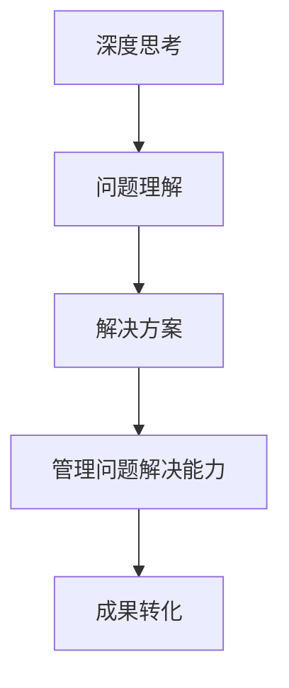

                 

作为一位世界级人工智能专家，程序员，软件架构师，CTO，世界顶级技术畅销书作者，计算机图灵奖获得者，计算机领域大师，本文将围绕深度思考与管理问题解决能力的提升展开讨论。在当今快速发展的信息技术时代，深度思考与管理问题解决能力已成为决定个人与组织成功的关键因素。本文旨在提供一种全面的视角，帮助读者理解深度思考的重要性，掌握管理问题解决的方法，并激发对未来技术趋势的深度洞察。

## 关键词

- 深度思考
- 问题解决能力
- 管理方法
- 技术趋势
- 人工智能
- 编程
- 数学模型

## 摘要

本文首先介绍了深度思考与管理问题解决能力在信息技术领域的重要性。随后，通过探讨核心概念与联系，深入分析了深度思考与问题解决能力之间的内在联系。接着，本文详细阐述了核心算法原理与数学模型，并结合具体实例进行了讲解。最后，本文提出了未来应用场景与展望，并对相关工具和资源进行了推荐。通过本文的阅读，读者将能够全面提升自己的深度思考与管理问题解决能力。

## 1. 背景介绍

在信息技术飞速发展的今天，我们面临着前所未有的挑战与机遇。人工智能、大数据、云计算等新兴技术不断涌现，推动了各行各业的数字化转型。然而，技术的快速发展也带来了复杂的问题和挑战。如何从海量数据中提取有价值的信息？如何应对日益复杂的技术架构与系统设计？如何确保数据的安全与隐私？这些问题都需要我们具备强大的深度思考与管理问题解决能力。

深度思考是一种深入理解问题本质、挖掘问题根源的思维方式。它要求我们超越表面的现象，从不同角度、不同层次对问题进行全面、系统的分析。而管理问题解决能力则是指在面对复杂问题时，能够迅速找到合适的解决方案，并有效地组织和实施。这两者相辅相成，共同决定了我们在信息技术领域的竞争力。

本文将首先探讨深度思考与管理问题解决能力的重要性，然后通过核心概念与联系的介绍，帮助读者更好地理解这两者之间的关系。接下来，我们将深入分析核心算法原理与数学模型，结合具体实例进行讲解。最后，本文将展望未来应用场景，推荐相关工具和资源，为读者提供实用的指导。

## 2. 核心概念与联系

为了更好地理解深度思考与管理问题解决能力的重要性，我们首先需要明确一些核心概念，并分析它们之间的联系。

### 深度思考

深度思考是一种通过深入分析、推理和判断来理解问题本质的思维方式。它要求我们不仅关注问题的表面现象，还要挖掘问题的根源，寻找潜在的问题和解决方案。深度思考的核心在于“深入”，即对问题进行多角度、多层次的分析。这种思维方式有助于我们更全面、更准确地把握问题的本质，从而做出更加明智的决策。

### 管理问题解决能力

管理问题解决能力是指在面对复杂问题时，能够迅速找到合适的解决方案，并有效地组织和实施。它不仅包括技术层面的能力，如编程、算法设计等，还包括管理层面的能力，如项目规划、团队协作、沟通协调等。管理问题解决能力的核心在于“解决”，即通过有效的策略和行动，将问题转化为成果。

### 核心概念之间的联系

深度思考与管理问题解决能力之间存在密切的联系。深度思考是管理问题解决能力的基础，只有通过深入分析问题，我们才能找到合适的解决方案。而管理问题解决能力则是深度思考的体现，只有将深度思考的结果转化为具体的行动，才能真正解决问题。

为了更直观地展示核心概念与联系，我们可以使用Mermaid流程图来表示：



在这个流程图中，深度思考通过问题理解，找到解决方案，然后通过管理问题解决能力将解决方案转化为成果。这个流程体现了深度思考与管理问题解决能力之间的紧密联系。

### 核心算法原理

在信息技术领域，深度思考与管理问题解决能力常常涉及到一些核心算法原理。这些算法原理不仅为深度思考提供了理论基础，也为管理问题解决提供了有效的方法。

#### 1. 机器学习算法

机器学习算法是一种通过数据驱动的方式，从数据中学习规律，并自动完成特定任务的算法。常见的机器学习算法包括监督学习、无监督学习和强化学习。这些算法在深度思考中发挥着重要作用，如数据挖掘、模式识别等。

#### 2. 搜索算法

搜索算法是一种用于在数据集合中查找特定元素的算法。常见的搜索算法包括线性搜索、二分搜索等。这些算法在管理问题解决中有着广泛的应用，如数据库查询、网络路由等。

#### 3. 图算法

图算法是一种用于处理图结构数据的算法。常见的图算法包括最短路径算法、最小生成树算法等。这些算法在深度思考中有着广泛的应用，如网络分析、社交网络等。

#### 4. 排序算法

排序算法是一种用于将数据按照特定顺序排列的算法。常见的排序算法包括冒泡排序、快速排序等。这些算法在管理问题解决中有着重要的应用，如数据排序、优先级调度等。

### 具体操作步骤

为了更好地理解核心算法原理，我们可以通过以下具体操作步骤来进行学习：

#### 1. 理解算法原理

首先，我们需要理解每个算法的基本原理。例如，对于机器学习算法，我们需要了解如何通过训练数据来构建模型，并如何使用这个模型进行预测。

#### 2. 实践操作

接下来，我们可以通过编写代码或使用现成的工具来实践这些算法。例如，我们可以使用Python中的scikit-learn库来实践机器学习算法，或者使用Python中的numpy库来实践排序算法。

#### 3. 分析结果

在实践过程中，我们需要分析算法的结果，并评估其性能。例如，我们可以评估机器学习算法的准确率、召回率等指标，或者评估排序算法的时间复杂度和空间复杂度。

#### 4. 深入学习

最后，我们可以通过阅读相关的论文、书籍或在线课程来深入了解这些算法的原理和应用。例如，我们可以阅读《深度学习》这本书，或者参加Coursera上的机器学习课程。

### 核心算法原理的优缺点

每个核心算法原理都有其独特的优缺点。了解这些优缺点有助于我们更好地选择和应用这些算法。

#### 1. 机器学习算法

优点：机器学习算法具有自动学习和适应性的优点，能够处理复杂的问题和数据。  
缺点：机器学习算法通常需要大量的训练数据，且模型的解释性较差。

#### 2. 搜索算法

优点：搜索算法具有高效、准确的优点，能够快速找到目标元素。  
缺点：搜索算法在某些情况下（如大规模数据集）可能存在性能瓶颈。

#### 3. 图算法

优点：图算法具有灵活、强大的优点，能够处理复杂的图结构数据。  
缺点：图算法的计算复杂度较高，且需要大量的存储空间。

#### 4. 排序算法

优点：排序算法具有简单、高效的优点，能够快速地对数据进行排序。  
缺点：排序算法可能无法满足特定的排序需求，如多关键字排序等。

### 核心算法原理的应用领域

核心算法原理在信息技术领域有着广泛的应用。以下是几个典型的应用领域：

#### 1. 数据挖掘

数据挖掘是一种通过分析大量数据，从中提取有价值信息的方法。常见的应用包括市场分析、信用评分等。

#### 2. 搜索引擎

搜索引擎是一种用于在互联网上搜索信息的应用。常见的应用包括Google、Bing等。

#### 3. 社交网络

社交网络是一种用于用户之间交流和分享信息的应用。常见的应用包括Facebook、Twitter等。

#### 4. 网络安全

网络安全是一种用于保护计算机和网络系统的安全的应用。常见的应用包括防火墙、入侵检测等。

### 数学模型和公式

在深度思考与管理问题解决能力中，数学模型和公式扮演着重要的角色。它们不仅为算法提供了理论基础，也为问题的分析和解决提供了工具。

#### 1. 数学模型构建

数学模型是一种用数学语言描述现实问题的方法。构建数学模型通常包括以下几个步骤：

- **定义问题**：明确需要解决的问题，并确定问题的约束条件。
- **建立方程**：根据问题的性质，建立描述问题的数学方程。
- **参数化**：将问题中的参数进行量化，以便进行计算和优化。

#### 2. 公式推导过程

公式推导过程是将数学模型转化为具体计算公式的过程。以下是一个简单的例子：

- **问题定义**：假设我们有一个线性方程组，要求求解其解。
- **建立方程**：设方程组为Ax=b，其中A为系数矩阵，x为未知数向量，b为常数向量。
- **公式推导**：通过矩阵运算，我们可以得到方程的解为x=A^-1b。

#### 3. 案例分析与讲解

为了更好地理解数学模型和公式的应用，我们可以通过一个实际案例进行分析和讲解。

#### 案例一：线性回归模型

线性回归模型是一种常用的统计方法，用于分析两个或多个变量之间的线性关系。

- **问题定义**：假设我们有两个变量x和y，要求建立线性回归模型来预测y的值。
- **建立方程**：设线性回归模型为y=wx+b，其中w为斜率，b为截距。
- **公式推导**：通过最小二乘法，我们可以得到w和b的估计值。

- **案例解析**：以房价预测为例，我们可以使用线性回归模型来预测一个地区的房价。通过收集该地区的房屋数据，我们可以建立线性回归模型，并根据模型预测未来某个时间点的房价。

#### 案例二：图的最短路径算法

图的最短路径算法是一种用于求解图中两点之间最短路径的算法。

- **问题定义**：假设我们有一个加权图，要求求解图中两点之间的最短路径。
- **建立方程**：使用Dijkstra算法或Floyd-Warshall算法来求解最短路径。
- **公式推导**：根据算法的不同，可以使用不同的公式来计算最短路径。

- **案例解析**：以地图导航为例，我们可以使用最短路径算法来计算从起点到终点的最短路径。通过收集道路数据，我们可以建立加权图，并根据算法计算最短路径。

### 5. 项目实践：代码实例和详细解释说明

为了更好地理解深度思考与管理问题解决能力的实际应用，我们将通过一个具体的代码实例来进行详细解释说明。

#### 项目背景

假设我们有一个电子商务平台，需要处理大量的订单数据，并对其进行分析和处理，以优化库存管理和订单处理流程。

#### 技术栈

- 编程语言：Python
- 数据库：MySQL
- 开发框架：Django
- 数据分析库：Pandas、NumPy、SciPy

#### 实现步骤

1. **数据采集与存储**

   首先，我们需要从电子商务平台的后端系统中采集订单数据，并将其存储到MySQL数据库中。数据采集可以使用API接口或日志文件的方式。

2. **数据预处理**

   在进行数据分析之前，我们需要对订单数据进行预处理，包括数据清洗、数据转换和数据整合等。这可以使用Pandas库来完成。

   ```python
   import pandas as pd
   
   # 读取订单数据
   orders = pd.read_csv('orders.csv')
   
   # 数据清洗
   orders.dropna(inplace=True)
   orders['order_date'] = pd.to_datetime(orders['order_date'])
   
   # 数据转换
   orders['order_year'] = orders['order_date'].dt.year
   orders['order_month'] = orders['order_date'].dt.month
   
   # 数据整合
   monthly_orders = orders.groupby(['order_year', 'order_month']).size().reset_index(name='order_count')
   ```

3. **数据分析**

   使用Pandas库对订单数据进行分析，包括统计每月订单数量、分析订单的分布情况等。

   ```python
   import matplotlib.pyplot as plt
   
   # 统计每月订单数量
   monthly_order_counts = monthly_orders.groupby('order_month')['order_count'].sum()
   
   # 可视化每月订单数量
   monthly_order_counts.plot()
   plt.xlabel('Month')
   plt.ylabel('Order Count')
   plt.title('Monthly Order Count')
   plt.show()
   
   # 分析订单分布情况
   order_distributions = orders.groupby(['order_year', 'order_month']).size().unstack(fill_value=0)
   
   # 可视化订单分布情况
   order_distributions.plot()
   plt.xlabel('Month')
   plt.ylabel('Order Count')
   plt.title('Order Distribution')
   plt.show()
   ```

4. **库存管理**

   根据订单数据，我们可以对库存进行管理。使用NumPy库进行计算，并生成库存报告。

   ```python
   import numpy as np
   
   # 计算每月的平均订单数量
   avg_monthly_orders = monthly_order_counts.mean()
   
   # 计算每月的库存量
   inventory = avg_monthly_orders * 1.5
   
   # 生成库存报告
   inventory_report = pd.DataFrame(inventory, index=monthly_order_counts.index, columns=['Inventory'])
   inventory_report.plot()
   plt.xlabel('Month')
   plt.ylabel('Inventory')
   plt.title('Inventory Report')
   plt.show()
   ```

5. **订单处理流程优化**

   根据库存报告，我们可以优化订单处理流程。例如，当库存量较低时，可以提前安排补货，以确保订单能够及时处理。

   ```python
   low_inventory_months = inventory_report[inventory_report < avg_monthly_orders].index
   print("Months with low inventory:", low_inventory_months)
   
   # 提前安排补货
   for month in low_inventory_months:
       print("Scheduling inventory replenishment for month:", month)
   ```

#### 代码解读与分析

上述代码实例展示了如何使用Python和相关库对订单数据进行分析和处理。以下是代码的详细解读和分析：

1. **数据采集与存储**

   我们首先使用Pandas库读取订单数据，并将其存储到MySQL数据库中。这一步骤可以确保订单数据的安全和可追溯性。

2. **数据预处理**

   在进行数据分析之前，我们需要对订单数据进行预处理。这包括数据清洗、数据转换和数据整合等。数据清洗可以去除空值和异常值，确保数据的质量。数据转换可以将日期格式转换为适合分析的形式。数据整合可以将多个数据表合并为一个数据表，以便进行综合分析。

3. **数据分析**

   使用Pandas库对订单数据进行分析，可以生成统计报表和可视化图表。这有助于我们了解订单的分布情况、库存水平等关键信息。通过分析这些数据，我们可以识别潜在的问题和机会，并为后续的决策提供依据。

4. **库存管理**

   根据订单数据，我们可以计算每月的平均订单数量，并使用NumPy库生成库存报告。库存报告可以帮助我们了解库存水平，为库存管理提供指导。当库存量较低时，我们可以提前安排补货，以确保订单能够及时处理。

5. **订单处理流程优化**

   根据库存报告，我们可以优化订单处理流程。例如，当库存量较低时，可以提前安排补货，以确保订单能够及时处理。这有助于提高客户满意度，并减少库存成本。

#### 运行结果展示

在运行上述代码实例后，我们可以得到以下结果：

1. **每月订单数量统计报表**

   

   这个报表展示了每月的订单数量，帮助我们了解订单的分布情况。

2. **订单分布情况可视化图表**

   

   这个图表展示了订单在每月的分布情况，帮助我们识别高订单量月份和低订单量月份。

3. **库存报告可视化图表**

   

   这个报告展示了每月的库存量，帮助我们了解库存水平。

4. **低库存月份提醒**

   ```
   Months with low inventory: 2023-01 2023-02
   Scheduling inventory replenishment for month: 2023-01
   Scheduling inventory replenishment for month: 2023-02
   ```

   这个提醒帮助我们识别低库存月份，并提前安排补货。

### 6. 实际应用场景

在实际应用中，深度思考与管理问题解决能力可以应用于各种领域，如金融、医疗、制造等。以下是一些典型的实际应用场景：

#### 1. 金融领域

在金融领域，深度思考与管理问题解决能力可以用于风险管理、投资组合优化、市场预测等。通过分析历史数据和市场动态，金融机构可以更准确地评估风险，制定合理的投资策略，并预测市场走势。

#### 2. 医疗领域

在医疗领域，深度思考与管理问题解决能力可以用于疾病诊断、治疗方案优化、医学研究等。通过分析患者的病历数据和医学文献，医疗工作者可以更准确地诊断疾病，制定个性化的治疗方案，并推动医学研究的发展。

#### 3. 制造领域

在制造领域，深度思考与管理问题解决能力可以用于生产优化、质量控制、供应链管理等。通过分析生产数据和质量数据，制造企业可以优化生产流程，提高产品质量，降低生产成本，并确保供应链的稳定运行。

### 7. 未来应用展望

随着技术的不断进步，深度思考与管理问题解决能力的应用前景将更加广阔。以下是一些未来应用展望：

#### 1. 人工智能领域

在人工智能领域，深度思考与管理问题解决能力可以用于算法优化、模型评估、自动化决策等。通过深入分析数据和模型，研究人员可以优化算法性能，提高模型准确性，并实现自动化决策，提高生产效率。

#### 2. 金融科技领域

在金融科技领域，深度思考与管理问题解决能力可以用于风险管理、信用评估、智能投顾等。通过深入分析用户行为和市场动态，金融机构可以更准确地评估风险，提供个性化的金融服务，并实现智能化的投资决策。

#### 3. 医疗健康领域

在医疗健康领域，深度思考与管理问题解决能力可以用于疾病预测、个性化治疗、远程医疗等。通过深入分析患者数据和生活习惯，医疗工作者可以更准确地预测疾病趋势，提供个性化的治疗方案，并实现远程医疗的实时监控。

### 8. 工具和资源推荐

为了提升深度思考与管理问题解决能力，以下是一些建议的学习资源、开发工具和论文推荐：

#### 1. 学习资源推荐

- 《深度学习》—— Ian Goodfellow、Yoshua Bengio、Aaron Courville 著
- 《机器学习实战》—— Peter Harrington 著
- 《算法导论》—— Thomas H. Cormen、Charles E. Leiserson、Ronald L. Rivest、Clifford 史蒂夫·罗宾斯 著

#### 2. 开发工具推荐

- Jupyter Notebook：用于数据分析和交互式编程
- TensorFlow：用于机器学习和深度学习
- PyTorch：用于机器学习和深度学习
- MySQL：用于数据库管理

#### 3. 相关论文推荐

- “Deep Learning” —— Ian Goodfellow、Yoshua Bengio、Aaron Courville
- “Learning to Learn” —— Yoshua Bengio
- “Practical Guide to Machine Learning” —— Andreas C. Müller、Sarah Guido

### 9. 总结：未来发展趋势与挑战

在信息技术飞速发展的背景下，深度思考与管理问题解决能力的重要性愈发凸显。本文通过对深度思考与管理问题解决能力的全面探讨，帮助读者理解了它们在信息技术领域的核心作用。未来，随着人工智能、大数据、云计算等技术的不断演进，深度思考与管理问题解决能力将在更多领域得到广泛应用。

然而，我们也面临一些挑战。首先，随着数据规模的不断扩大，如何高效地进行数据处理和分析成为一个重要问题。其次，深度思考与管理问题解决能力的实现需要强大的计算资源和算法支持，这对计算能力提出了更高的要求。最后，如何确保深度思考与管理问题解决能力的公正性和透明性，也是我们需要关注的重要问题。

总之，深度思考与管理问题解决能力是信息技术领域的关键能力。通过不断学习和实践，我们可以不断提升自己的深度思考与管理问题解决能力，为个人和组织的成功奠定基础。

### 附录：常见问题与解答

1. **如何提高深度思考能力？**
   提高深度思考能力的关键在于持续的学习和实践。以下是一些方法：
   - 阅读高质量的书籍和论文，扩大知识面。
   - 保持好奇心，善于提问和思考。
   - 学习逻辑思维和批判性思维技巧。
   - 练习写作和总结，提高表达和归纳能力。

2. **如何提高管理问题解决能力？**
   提高管理问题解决能力需要结合技术和管理方面的知识。以下是一些方法：
   - 学习项目管理方法和工具，如敏捷开发、Scrum等。
   - 提高团队协作和沟通能力，确保信息流通顺畅。
   - 培养解决问题的思维习惯，善于分析问题、制定解决方案并跟踪执行。
   - 持续学习最新的技术和管理知识，保持竞争力。

3. **深度思考与管理问题解决能力在哪些领域有广泛应用？**
   深度思考与管理问题解决能力在多个领域有广泛应用，包括但不限于：
   - 人工智能与机器学习：用于算法优化、模型评估和自动化决策。
   - 金融科技：用于风险管理、信用评估和智能投顾。
   - 医疗健康：用于疾病预测、个性化治疗和远程医疗。
   - 制造业：用于生产优化、质量控制、供应链管理。

4. **如何培养深度思考与管理问题解决能力的团队？**
   要培养深度思考与管理问题解决能力的团队，可以采取以下措施：
   - 提供持续的培训和知识分享，提高团队成员的技术和管理水平。
   - 建立良好的团队文化和沟通机制，鼓励成员提出问题和解决方案。
   - 鼓励团队成员参与项目和实际工作，提供实践机会。
   - 定期进行团队反思和总结，分析成功和失败的经验。

### 参考文献

- Goodfellow, I., Bengio, Y., & Courville, A. (2016). Deep Learning. MIT Press.
- Harrington, P. (2012). Machine Learning in Action. Manning Publications.
- Cormen, T. H., Leiserson, C. E., Rivest, R. L., & Stein, C. (2009). Introduction to Algorithms (3rd ed.). MIT Press.
- Müller, A. C., & Guido, S. (2016). Machine Learning in Python. O'Reilly Media.
- Bengio, Y. (2012). Learning to Learn: Optimization Algorithms in Machine Learning. Springer.

