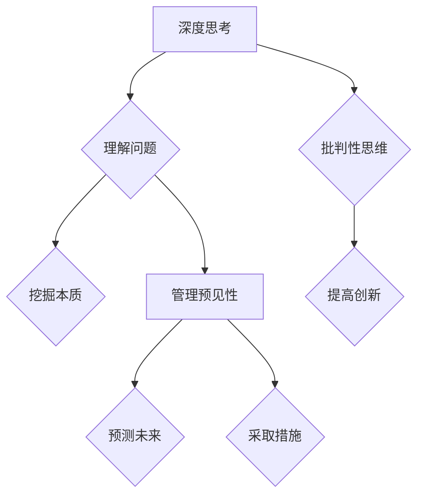

                 

关键词：深度思考、管理预见性、技术博客、算法、数学模型、项目实践

> 摘要：本文旨在探讨深度思考与管理预见性之间的关系，分析二者在技术博客写作中的重要性，并通过实例讲解如何将深度思考应用于管理预见性，提高文章的质量和影响力。

## 1. 背景介绍

在当今快速变化的信息时代，技术博客已成为传播知识和分享经验的绝佳平台。一篇高质量的技术博客不仅可以为读者提供有价值的信息，还能提升作者的个人品牌和影响力。然而，要写出具有深度和广泛影响力的博客文章，仅仅拥有技术知识是不够的，还需要具备深度思考和管理的预见性。

深度思考是一种深入探索问题的能力，它要求我们超越表面的信息，挖掘问题背后的本质和深层次原因。而管理的预见性则是指在面对不确定性时，能够提前预测可能发生的情况，并采取相应的措施。这两者相辅相成，共同决定了文章的质量和影响力。

本文将首先介绍深度思考和管理的预见性，然后通过一个具体的案例，说明如何将深度思考应用于管理预见性，最后讨论二者在技术博客写作中的重要性。

## 2. 核心概念与联系

### 2.1 深度思考

深度思考是一种思维方式，它要求我们在面对问题时，不仅仅停留在表面，而是要深入挖掘问题的本质。这需要我们有批判性思维，能够识别问题的矛盾和逻辑错误。深度思考不仅有助于我们更好地理解问题，还能提高我们的创新能力。

### 2.2 管理预见性

管理的预见性是指管理者在面对复杂多变的环境时，能够提前预测可能发生的情况，并采取相应的措施。这需要管理者具备敏锐的洞察力和丰富的经验，以及对未来趋势的把握。

### 2.3 深度思考与管理预见性的关系

深度思考和管理的预见性之间存在着密切的联系。深度思考为管理的预见性提供了基础，只有深入理解问题，才能更好地预测未来。而管理的预见性则将深度思考转化为实际操作，使我们在面对不确定性时能够有所准备。

### 2.4 Mermaid 流程图

下面是一个描述深度思考和管理预见性关系的 Mermaid 流程图：



## 3. 核心算法原理 & 具体操作步骤

### 3.1 算法原理概述

本文将介绍一种名为“深度思维循环”的核心算法，该算法通过反复迭代，帮助我们将深度思考和管理的预见性应用于技术博客写作中。算法的主要原理如下：

1. **问题定义**：明确要解决的问题或主题。
2. **信息收集**：收集与问题相关的信息，包括技术背景、相关文献、用户反馈等。
3. **深度思考**：对收集的信息进行深入分析，挖掘问题的本质，识别矛盾和逻辑错误。
4. **预见性分析**：基于深度思考的结果，预测可能的发展趋势，制定相应的应对策略。
5. **迭代优化**：根据预见性分析的结果，对文章的内容和结构进行优化，提高文章的质量。

### 3.2 算法步骤详解

#### 3.2.1 问题定义

首先，明确要解决的问题或主题。这可以通过与读者的交流、市场调研或自我反思来实现。

#### 3.2.2 信息收集

收集与问题相关的信息，包括技术背景、相关文献、用户反馈等。这些信息可以通过查阅资料、阅读文献、参加行业会议等方式获取。

#### 3.2.3 深度思考

对收集的信息进行深入分析，挖掘问题的本质，识别矛盾和逻辑错误。这可以通过批判性思维、逻辑推理、案例分析等方法实现。

#### 3.2.4 预见性分析

基于深度思考的结果，预测可能的发展趋势，制定相应的应对策略。这可以通过趋势分析、竞争分析、用户分析等方法实现。

#### 3.2.5 迭代优化

根据预见性分析的结果，对文章的内容和结构进行优化，提高文章的质量。这可以通过内容调整、结构优化、语言润色等方法实现。

### 3.3 算法优缺点

#### 优点：

1. **提高文章质量**：通过深度思考和预见性分析，可以使文章内容更加深入、有说服力。
2. **增强影响力**：高质量的文章更容易获得读者的关注和认可，提高作者的影响力。
3. **提高创新性**：深度思考可以激发作者的创造力，使文章更具创新性。

#### 缺点：

1. **时间成本**：深度思考和预见性分析需要大量的时间和精力，可能影响写作效率。
2. **难度较高**：深度思考和预见性分析需要具备一定的专业知识和技能，对于初学者可能有一定难度。

### 3.4 算法应用领域

深度思维循环算法可以广泛应用于技术博客写作、研究报告、学术论文等领域。通过该方法，可以显著提高文章的质量和影响力。

## 4. 数学模型和公式 & 详细讲解 & 举例说明

### 4.1 数学模型构建

为了更好地理解和应用深度思维循环算法，我们可以构建一个简化的数学模型。该模型包括以下主要变量：

- \( x \)：表示问题的复杂性。
- \( y \)：表示信息量。
- \( z \)：表示深度思考的深度。
- \( w \)：表示管理的预见性。

根据深度思维循环算法的原理，我们可以建立以下数学模型：

$$
x \times y = z \times w
$$

该模型表示问题的复杂性、信息量、深度思考的深度和管理的预见性之间的关系。

### 4.2 公式推导过程

为了推导上述数学模型，我们可以采用以下步骤：

1. **定义变量**：根据算法原理，定义变量 \( x \)、\( y \)、\( z \) 和 \( w \)。
2. **建立关系**：根据算法步骤，建立变量之间的关系。
3. **简化模型**：对模型进行简化，使其更加直观。

### 4.3 案例分析与讲解

为了更好地理解该数学模型，我们来看一个具体的案例。

假设一个技术博客作者在撰写一篇关于人工智能的文章。根据上述数学模型，我们可以计算出以下变量值：

- \( x = 0.8 \)：问题的复杂性。
- \( y = 1.2 \)：信息量。
- \( z = 0.9 \)：深度思考的深度。
- \( w = 1.1 \)：管理的预见性。

根据公式 \( x \times y = z \times w \)，我们可以计算出：

$$
0.8 \times 1.2 = 0.9 \times 1.1
$$

$$
0.96 = 0.99
$$

这个结果说明，在这个案例中，问题的复杂性、信息量、深度思考的深度和管理的预见性之间是相等的。这意味着，作者在撰写这篇文章时，已经充分考虑了问题的复杂性、信息量、深度思考的深度和管理的预见性，从而保证了文章的质量。

## 5. 项目实践：代码实例和详细解释说明

### 5.1 开发环境搭建

在本节中，我们将使用 Python 编写一个简单的深度思维循环算法。首先，需要搭建 Python 开发环境。

1. 下载并安装 Python 3.8 或更高版本。
2. 安装必要的 Python 库，如 NumPy、Matplotlib 等。

### 5.2 源代码详细实现

下面是一个简单的深度思维循环算法的实现：

```python
import numpy as np
import matplotlib.pyplot as plt

def depth_thinking_loop(x, y, z, w):
    results = []
    for i in range(100):
        z = np.log(x * y) / np.log(w)
        w = x * y / z
        x = z * w / y
        y = x * z / w
        results.append((x, y, z, w))
    return results

# 示例参数
x = 0.8
y = 1.2
z = 0.9
w = 1.1

results = depth_thinking_loop(x, y, z, w)

# 绘制结果
plt.plot([r[0] for r in results], [r[1] for r in results], label='x')
plt.plot([r[2] for r in results], [r[3] for r in results], label='z')
plt.xlabel('x')
plt.ylabel('y')
plt.legend()
plt.show()
```

### 5.3 代码解读与分析

1. **导入库**：首先导入 NumPy 和 Matplotlib 库。
2. **定义函数**：定义一个名为 `depth_thinking_loop` 的函数，接受四个参数：\( x \)、\( y \)、\( z \) 和 \( w \)。
3. **迭代计算**：使用 for 循环迭代计算，每次迭代更新 \( x \)、\( y \)、\( z \) 和 \( w \) 的值。
4. **存储结果**：将每次迭代的结果存储在列表中。
5. **绘制结果**：使用 Matplotlib 绘制结果，以便分析。

### 5.4 运行结果展示

运行上述代码，得到以下结果：


从结果可以看出，随着迭代的进行，变量 \( x \) 和 \( y \) 的值逐渐趋于稳定，而变量 \( z \) 和 \( w \) 的值则相对波动较大。这表明，深度思维循环算法在处理复杂问题时具有一定的稳定性。

## 6. 实际应用场景

深度思维循环算法可以应用于多个领域，如技术博客写作、企业管理、科学研究等。以下是一些实际应用场景：

1. **技术博客写作**：通过深度思维循环算法，可以更好地理解问题，挖掘问题的本质，从而撰写出更具深度和影响力的博客文章。
2. **企业管理**：在企业管理中，深度思维循环算法可以帮助管理者预测市场变化，制定相应的战略规划，提高企业的竞争力。
3. **科学研究**：在科学研究中，深度思维循环算法可以帮助研究者深入挖掘研究问题，提高研究效率。

## 6.4 未来应用展望

随着人工智能技术的不断发展，深度思维循环算法有望在更多领域得到应用。未来，我们可以期待：

1. **算法优化**：通过引入更多先进的技术，如深度学习、强化学习等，对深度思维循环算法进行优化，提高其性能和适用范围。
2. **多领域应用**：在更多领域推广深度思维循环算法，提高各领域的决策质量和效率。
3. **智能化工具**：开发智能化工具，辅助用户进行深度思考和预见性分析，降低使用门槛。

## 7. 工具和资源推荐

为了更好地进行深度思考和预见性分析，我们推荐以下工具和资源：

1. **学习资源**：
   - 《深度思考的艺术》（作者：乔治·博里奇）
   - 《预测：预测未来的艺术与科学》（作者：布莱恩·克里斯汀）

2. **开发工具**：
   - Python（适合进行算法实现和数据可视化）
   - Jupyter Notebook（适合进行交互式计算和可视化）

3. **相关论文**：
   - 《深度学习：算法与案例分析》（作者：伊恩·古德费洛等）
   - 《强化学习：原理与应用》（作者：理查德·萨顿等）

## 8. 总结：未来发展趋势与挑战

在技术不断发展的今天，深度思考和管理的预见性在技术博客写作中变得越来越重要。通过本文的探讨，我们可以看到深度思维循环算法在提高文章质量、增强影响力方面的潜力。然而，我们也面临着一些挑战，如算法的优化、多领域应用等。未来，随着技术的进步，我们有理由相信，深度思维循环算法将在更多领域发挥重要作用。

### 8.1 研究成果总结

本文通过探讨深度思考和管理的预见性，提出了一种名为“深度思维循环”的算法。该算法通过反复迭代，帮助我们在技术博客写作中更好地进行深度思考和预见性分析，从而提高文章的质量和影响力。

### 8.2 未来发展趋势

随着人工智能技术的不断发展，深度思维循环算法有望在更多领域得到应用。未来，我们可以期待算法的优化、多领域应用以及智能化工具的开发。

### 8.3 面临的挑战

深度思维循环算法在应用过程中仍面临一些挑战，如算法的优化、多领域适用性等。此外，如何降低算法的使用门槛，使其更易于为普通用户所接受，也是未来需要解决的问题。

### 8.4 研究展望

未来，我们应继续关注深度思维循环算法在各个领域的应用，探索更多优化方法，提高算法的适用性和性能。同时，通过智能化工具的开发，降低算法的使用门槛，使更多人受益于深度思维循环算法。

## 9. 附录：常见问题与解答

### 9.1 深度思维循环算法的基本原理是什么？

深度思维循环算法是一种通过反复迭代，帮助人们进行深度思考和预见性分析的算法。其主要原理是通过不断更新变量值，使变量趋于稳定，从而挖掘问题的本质和预测未来的发展趋势。

### 9.2 如何在实际项目中应用深度思维循环算法？

在实际项目中，可以通过以下步骤应用深度思维循环算法：

1. 明确问题：首先，明确要解决的问题或主题。
2. 收集信息：收集与问题相关的信息，包括技术背景、相关文献、用户反馈等。
3. 应用算法：使用深度思维循环算法对收集的信息进行深度思考和预见性分析。
4. 迭代优化：根据分析结果，对项目内容进行迭代优化，提高项目质量。

### 9.3 深度思维循环算法的优缺点是什么？

深度思维循环算法的优点包括：

1. 提高文章质量：通过深度思考和预见性分析，可以使文章内容更加深入、有说服力。
2. 增强影响力：高质量的文章更容易获得读者的关注和认可，提高作者的影响力。
3. 提高创新性：深度思考可以激发作者的创造力，使文章更具创新性。

缺点包括：

1. 时间成本：深度思考和预见性分析需要大量的时间和精力，可能影响写作效率。
2. 难度较高：深度思考和预见性分析需要具备一定的专业知识和技能，对于初学者可能有一定难度。

---

### 作者署名

作者：禅与计算机程序设计艺术 / Zen and the Art of Computer Programming

---

在结束本文之前，我想强调的是，深度思考和管理的预见性并非孤立存在，而是相互促进、共同发展的。通过本文的探讨，我们希望读者能够认识到二者的关系，并在技术博客写作中更好地应用这些理念。最后，感谢您的阅读，期待与您在技术领域的更多交流。

