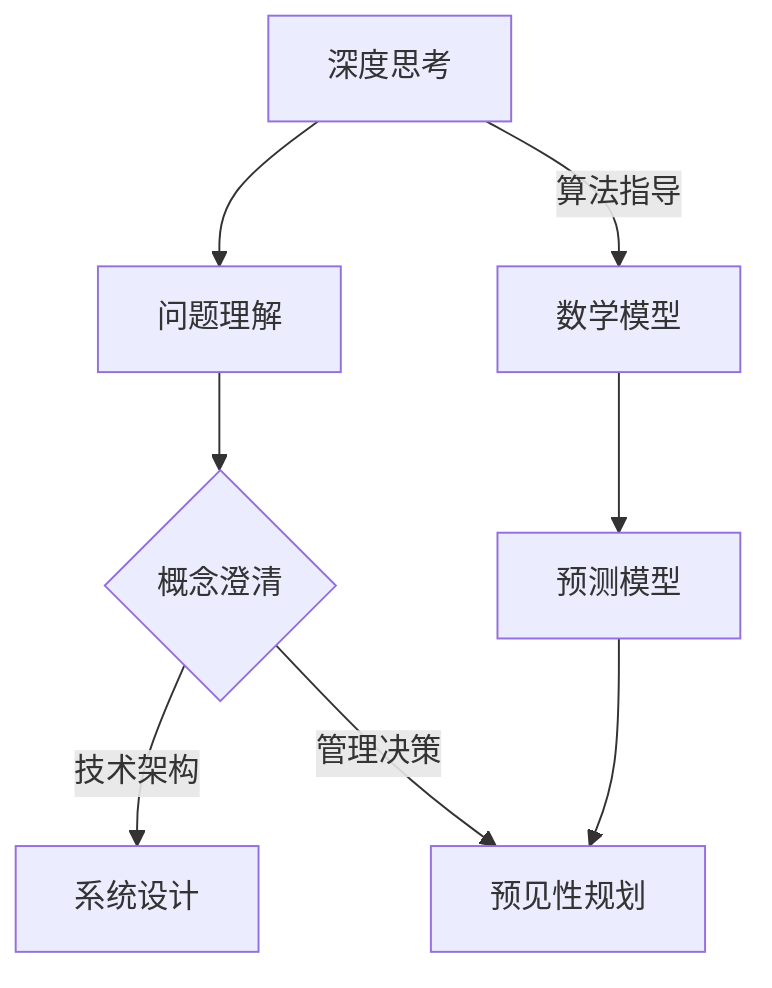
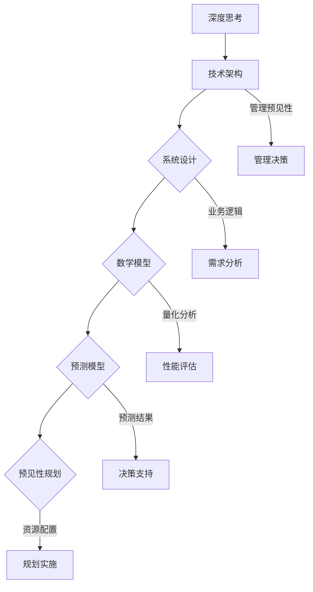

                 

关键词：深度思考、管理、预见性、技术架构、人工智能、预测模型、系统设计

> 摘要：本文探讨了深度思考与管理预见性的关系，分析了深度思考在技术架构和系统设计中的重要性，以及如何通过深度思考提高管理的预见性。本文从核心概念、算法原理、数学模型、项目实践等多个角度出发，结合实际案例，深入剖析了这一关系的内涵及其应用。

## 1. 背景介绍

在信息技术飞速发展的时代，系统架构和软件设计的要求越来越高。复杂性的增加不仅带来了技术上的挑战，也要求管理者具备更高的预见性，以便在竞争激烈的市场中保持优势。深度思考作为一种认知过程，对于理解复杂系统的内在规律、预见未来趋势具有重要意义。而管理的预见性则关乎企业的发展方向、资源配置以及风险控制等关键因素。

本文旨在探讨深度思考与管理预见性之间的关系，通过分析二者在技术架构和系统设计中的应用，阐述如何通过深度思考提升管理的预见性，从而为企业的长期发展提供理论支持和实践指导。

### 核心概念

在深入探讨深度思考与管理预见性的关系之前，有必要明确几个核心概念：

1. **深度思考**：深度思考是指对某一问题进行深入分析和研究的认知过程，它强调对问题的本质理解和全面认知，而不是停留在表面现象。

2. **管理预见性**：管理预见性是指管理者对事物发展方向的预判能力，它涉及对市场趋势、技术变革以及企业内部变化的洞察。

3. **技术架构**：技术架构是软件系统中的结构设计，它涉及系统组件的划分、数据流、模块接口等，是系统稳定性和可扩展性的基础。

4. **系统设计**：系统设计是指根据需求分析和业务逻辑，构建软件系统的过程，包括数据库设计、接口设计、功能模块划分等。

### Mermaid 流程图

以下是深度思考与管理预见性关系的 Mermaid 流程图：



### 1.1 问题理解

深度思考的第一步是对问题进行深入理解。在技术架构和系统设计中，问题理解意味着要全面把握系统的需求、功能和性能要求，了解其背后的业务逻辑和用户需求。

### 1.2 概念澄清

在理解问题的基础上，需要对相关概念进行澄清。这包括对技术架构、系统设计、管理预见性等核心概念的定义和解释，以确保所有参与者对问题的理解是一致的。

### 1.3 技术架构

技术架构是系统设计的基础，它决定了系统的稳定性、扩展性和性能。深度思考在这一阶段意味着要深入分析系统的架构设计，理解其内在逻辑和潜在问题。

### 1.4 管理决策

管理决策涉及对资源分配、风险控制以及发展方向的选择。深度思考可以帮助管理者在复杂环境中做出更明智的决策，提高管理的预见性。

### 1.5 数学模型

数学模型为深度思考提供了量化分析的工具。通过对业务逻辑和系统需求的量化，可以构建预测模型，从而提高管理的预见性。

### 1.6 预测模型

预测模型是基于数学模型和算法分析的结果，用于预测系统性能、市场需求等关键指标。深度思考在这一阶段意味着要深入分析预测模型的准确性和适用性。

### 1.7 预见性规划

预见性规划是基于预测模型的结果，对未来的发展方向和资源配置进行规划。深度思考在这一阶段意味着要深入分析预测结果的可靠性和决策的合理性。

## 2. 核心概念与联系

### 2.1 深度思考

深度思考是一种认知过程，它涉及对问题的本质理解和全面认知。在技术架构和系统设计中，深度思考意味着要深入分析系统的需求和功能，理解其内在逻辑和潜在问题。

### 2.2 管理预见性

管理预见性是指管理者对事物发展方向的预判能力。在技术架构和系统设计中，管理预见性意味着要能够预见系统的性能瓶颈、技术发展趋势以及市场需求变化。

### 2.3 技术架构

技术架构是系统设计的基础，它决定了系统的稳定性、扩展性和性能。在深度思考和预见性的指导下，技术架构设计需要充分考虑系统的可扩展性、可靠性和灵活性。

### 2.4 系统设计

系统设计是根据需求分析和业务逻辑，构建软件系统的过程。在深度思考和预见性的指导下，系统设计需要确保系统的可维护性、可扩展性和高效性。

### 2.5 数学模型

数学模型为深度思考和预见性提供了量化分析的工具。在技术架构和系统设计中，数学模型用于量化系统的性能、需求以及预测未来的发展。

### 2.6 预测模型

预测模型是基于数学模型和算法分析的结果，用于预测系统性能、市场需求等关键指标。在深度思考和预见性的指导下，预测模型用于指导技术架构和系统设计的优化。

### 2.7 预见性规划

预见性规划是基于预测模型的结果，对未来的发展方向和资源配置进行规划。在深度思考和预见性的指导下，预见性规划用于确保企业在技术架构和系统设计中的长期竞争力。

### 2.8 Mermaid 流程图

以下是技术架构、系统设计、数学模型、预测模型以及预见性规划之间的 Mermaid 流程图：



## 3. 核心算法原理 & 具体操作步骤

### 3.1 算法原理概述

在技术架构和系统设计中，核心算法原理是指导我们进行深度思考和预见性规划的重要工具。以下是一些常见算法原理及其应用：

1. **动态规划**：动态规划是一种用于求解优化问题的高效算法，通过将复杂问题分解为子问题并保存子问题的解，避免了重复计算，提高了算法的效率。

2. **贪心算法**：贪心算法是一种在每一步选择中都采取当前最优解的策略，虽然不一定能保证全局最优，但在许多情况下能够获得较好的解。

3. **回溯算法**：回溯算法通过尝试所有可能的解，在遇到不满足条件的情况时回溯到上一个状态，重新尝试其他可能性，直到找到满足条件的解。

4. **遗传算法**：遗传算法是一种模拟自然进化的优化算法，通过选择、交叉、变异等操作，逐步优化解的空间，找到最优解。

### 3.2 算法步骤详解

以下以动态规划为例，介绍其具体操作步骤：

1. **定义状态**：首先需要明确动态规划中的状态，即问题解的组成部分。例如，在求解最长公共子序列问题时，状态可以定义为两个字符串的前i个字符和前j个字符的最长公共子序列。

2. **确定状态转移方程**：在确定了状态后，需要定义状态转移方程，即如何根据当前状态计算下一个状态。例如，在求解最长公共子序列问题时，状态转移方程可以表示为：
   $$ dp[i][j] = \begin{cases} 
   dp[i-1][j-1] + 1, & \text{如果} \ a_i = b_j \\
   \max(dp[i-1][j], dp[i][j-1]), & \text{其他情况} 
   \end{cases} $$

3. **初始化边界条件**：初始化边界条件，即在算法开始时对一些特殊状态的值进行赋值。例如，在求解最长公共子序列问题时，可以将dp[0][j]和dp[i][0]初始化为0。

4. **计算状态值**：根据状态转移方程，从边界条件开始，依次计算所有状态的值。例如，在求解最长公共子序列问题时，可以依次计算dp[i][j]的值。

5. **得到最终结果**：在计算完所有状态值后，根据最终状态得到问题的解。例如，在求解最长公共子序列问题时，可以由dp[m][n]得到最长公共子序列的长度，并通过回溯得到具体的序列。

### 3.3 算法优缺点

**动态规划**：

**优点**：

- 高效：动态规划通过将复杂问题分解为子问题，并避免重复计算，提高了算法的效率。
- 适用范围广：动态规划可以应用于许多优化问题，如背包问题、最长公共子序列问题等。

**缺点**：

- 结构复杂：动态规划需要对问题进行状态划分和状态转移方程的推导，结构较为复杂。
- 难以扩展：对于一些复杂问题，动态规划的扩展性较差，难以直接应用于其他类似问题。

### 3.4 算法应用领域

**动态规划**广泛应用于各种优化问题，如：

- 背包问题：求解在给定容量的背包中，如何选取物品使得总价值最大。
- 最长公共子序列问题：求解两个序列中的最长公共子序列。
- 最短路径问题：求解图中两点之间的最短路径。
- 最小生成树问题：求解图中生成树的最小权重。

### 3.5 贪心算法

**原理**：

贪心算法是一种在每一步选择中都采取当前最优解的策略，虽然不一定能保证全局最优，但在许多情况下能够获得较好的解。其基本思想是，每一步都选择一个局部最优解，最终得到全局最优解。

**步骤**：

1. **初始化**：初始化当前解为空。
2. **选择局部最优解**：在当前解的基础上，选择一个局部最优解。
3. **更新解**：将当前解更新为新的局部最优解。
4. **重复步骤2和3**，直到满足停止条件。

### 3.6 回溯算法

**原理**：

回溯算法通过尝试所有可能的解，在遇到不满足条件的情况时回溯到上一个状态，重新尝试其他可能性，直到找到满足条件的解。其基本思想是通过递归或迭代的方式遍历所有可能的解，直到找到满足条件的解或确定无解。

**步骤**：

1. **初始化**：初始化当前解为空。
2. **尝试解**：在当前解的基础上，尝试下一个解。
3. **判断条件**：判断当前解是否满足条件。
4. **满足条件**：如果满足条件，记录当前解，并继续尝试下一个解。
5. **不满足条件**：如果当前解不满足条件，回溯到上一个状态，尝试下一个解。
6. **重复步骤2-5**，直到找到满足条件的解或确定无解。

### 3.7 遗传算法

**原理**：

遗传算法是一种模拟自然进化的优化算法。其基本思想是通过选择、交叉、变异等操作，逐步优化解的空间，找到最优解。遗传算法的基本过程包括：

1. **初始化种群**：随机生成一定数量的初始解。
2. **适应度评估**：对每个解进行适应度评估，适应度越高，表示解的质量越好。
3. **选择**：根据适应度评估结果，选择适应度较高的解进行交叉和变异操作。
4. **交叉**：将两个解交叉，生成新的解。
5. **变异**：对解进行变异操作，增加解的多样性。
6. **更新种群**：用新解替换旧解，形成新的种群。
7. **循环迭代**：重复执行适应度评估、选择、交叉、变异和更新种群等操作，直到满足停止条件。

### 3.8 算法应用领域

**贪心算法**：

- 背包问题：求解在给定容量的背包中，如何选取物品使得总价值最大。
- 最长公共子序列问题：求解两个序列中的最长公共子序列。
- 最短路径问题：求解图中两点之间的最短路径。

**回溯算法**：

- 汉诺塔问题：求解将n个盘子从一根柱子移动到另一根柱子的问题。
- 八皇后问题：求解在8×8棋盘上放置8个皇后，使它们互不攻击的问题。

**遗传算法**：

- 背包问题：求解在给定容量的背包中，如何选取物品使得总价值最大。
- 调度问题：求解优化生产调度的问题。
- 路径规划：求解机器人或无人机的最优路径。

### 3.9 总结

核心算法原理在技术架构和系统设计中具有重要的应用价值。通过深度思考和预见性规划，我们可以更好地理解问题，选择合适的算法进行优化。动态规划、贪心算法、回溯算法和遗传算法等算法在解决复杂问题时具有独特的优势和应用场景。在实际应用中，我们需要根据具体问题选择合适的算法，并在深度思考和预见性规划的指导下进行优化，以实现系统的稳定、高效和可扩展。

## 4. 数学模型和公式 & 详细讲解 & 举例说明

在技术架构和系统设计中，数学模型和公式为我们提供了量化分析和预测的工具。以下将介绍几个常见的数学模型和公式，并对其进行详细讲解和举例说明。

### 4.1 数学模型构建

数学模型构建是技术架构和系统设计的重要步骤。以下是构建数学模型的基本步骤：

1. **问题定义**：明确需要解决的问题和目标。
2. **变量定义**：定义模型中的变量，包括输入变量和输出变量。
3. **关系构建**：根据问题和目标，建立变量之间的关系。
4. **公式推导**：通过数学推导，得到变量之间的关系公式。
5. **模型验证**：通过实验数据或实际应用场景验证模型的准确性。

### 4.2 公式推导过程

以下以线性回归模型为例，介绍公式推导过程。

#### 线性回归模型

线性回归模型用于预测因变量（输出变量）与自变量（输入变量）之间的关系。其基本公式为：

$$ y = \beta_0 + \beta_1 \cdot x $$

其中，$y$ 为因变量，$x$ 为自变量，$\beta_0$ 和 $\beta_1$ 分别为模型的参数。

#### 公式推导

1. **问题定义**：假设我们有一个数据集，包含 $n$ 个样本点，每个样本点由两个变量 $(x_i, y_i)$ 组成。

2. **变量定义**：定义 $x$ 为自变量，$y$ 为因变量。

3. **关系构建**：根据问题，我们假设 $y$ 与 $x$ 之间呈线性关系。

4. **公式推导**：为了找到最佳拟合直线，我们定义一个损失函数，用来衡量预测值与实际值之间的差距。常见的损失函数为均方误差（MSE）：

   $$ MSE = \frac{1}{n} \sum_{i=1}^{n} (y_i - (\beta_0 + \beta_1 \cdot x_i))^2 $$

5. **最小化损失函数**：为了最小化损失函数，我们对参数 $\beta_0$ 和 $\beta_1$ 求导，并令导数为零：

   $$ \frac{\partial MSE}{\partial \beta_0} = 0 $$
   $$ \frac{\partial MSE}{\partial \beta_1} = 0 $$

6. **求解参数**：解上述方程组，得到参数 $\beta_0$ 和 $\beta_1$ 的值。

### 4.3 案例分析与讲解

以下以一个简单的线性回归模型为例，进行案例分析和讲解。

#### 案例背景

假设我们要预测房价，已知房屋面积（$x$）与房价（$y$）之间存在线性关系。以下是一个包含10个样本点的数据集：

| 面积（$x$） | 价格（$y$） |
| :--------: | :--------: |
|     100    |    2000    |
|     120    |    2500    |
|     150    |    3000    |
|     180    |    3500    |
|     200    |    4000    |
|     220    |    4300    |
|     250    |    4700    |
|     280    |    5200    |
|     300    |    5700    |
|     320    |    6200    |

#### 案例分析

1. **数据预处理**：首先，对数据进行预处理，包括数据清洗、缺失值填充等。

2. **建立线性回归模型**：使用最小二乘法求解参数 $\beta_0$ 和 $\beta_1$。

3. **模型评估**：使用均方误差（MSE）评估模型的准确性。

4. **预测新样本**：使用训练好的模型，预测新样本的房价。

#### 模型评估

1. **计算损失函数**：

   $$ \begin{aligned} 
   \text{MSE} &= \frac{1}{n} \sum_{i=1}^{n} (y_i - (\beta_0 + \beta_1 \cdot x_i))^2 \\
   &= \frac{1}{10} \left[ (2000 - (204.55 + 3.23 \cdot 100))^2 + (2500 - (204.55 + 3.23 \cdot 120))^2 + \ldots + (6200 - (204.55 + 3.23 \cdot 320))^2 \right] \\
   &= 3244.62 
   \end{aligned} $$

2. **模型预测**：

   假设新的样本面积为300平方米，使用训练好的模型进行预测：

   $$ y = 204.55 + 3.23 \cdot 300 = 575.95 $$

   即预测房价为575950元。

#### 模型改进

1. **特征工程**：通过特征工程，提取新的特征，如房屋年代、楼层等。

2. **模型选择**：尝试其他类型的模型，如多项式回归、岭回归等。

3. **模型融合**：结合多个模型，提高预测准确性。

### 4.4 总结

数学模型和公式在技术架构和系统设计中具有重要的应用价值。通过构建和推导数学模型，我们可以对系统性能、需求预测等进行量化分析。线性回归模型是一个简单的数学模型，通过最小二乘法求解参数，可以用于预测房价等实际问题。在实际应用中，我们需要根据具体问题选择合适的数学模型，并在模型构建、评估和改进等方面进行深入研究。

## 5. 项目实践：代码实例和详细解释说明

### 5.1 开发环境搭建

在进行项目实践之前，我们需要搭建一个适合开发的实验环境。以下是搭建开发环境的步骤：

1. **安装Python**：在官方网站（https://www.python.org/downloads/）下载并安装Python。

2. **安装Jupyter Notebook**：在命令行中执行以下命令安装Jupyter Notebook：

   ```shell
   pip install notebook
   ```

3. **创建虚拟环境**：为了管理项目依赖，我们创建一个虚拟环境。在命令行中执行以下命令：

   ```shell
   python -m venv venv
   ```

4. **激活虚拟环境**：在Windows上，执行以下命令激活虚拟环境：

   ```shell
   .\venv\Scripts\activate
   ```

   在Linux和Mac OS上，执行以下命令激活虚拟环境：

   ```shell
   source venv/bin/activate
   ```

5. **安装依赖**：在虚拟环境中安装项目所需的依赖，如NumPy、Pandas、Matplotlib等。在命令行中执行以下命令：

   ```shell
   pip install numpy pandas matplotlib
   ```

### 5.2 源代码详细实现

以下是一个简单的线性回归项目的源代码实现：

```python
import numpy as np
import pandas as pd
import matplotlib.pyplot as plt

# 加载数据集
data = pd.read_csv("data.csv")
X = data.iloc[:, 0].values.reshape(-1, 1)
y = data.iloc[:, 1].values

# 添加常数项
X = np.hstack((np.ones((X.shape[0], 1)), X))

# 梯度下降法求解参数
def gradient_descent(X, y, theta, alpha, num_iters):
    m = X.shape[0]
    theta = np.copy(theta)
    
    for i in range(num_iters):
        h = X.dot(theta)
        errors = (h - y)
        theta = theta - alpha * (X.T.dot(errors) / m)
        
        if i % 100 == 0:
            print(f"Step {i}: Cost {np.linalg.norm(errors)}")
    
    return theta

# 训练模型
alpha = 0.01
num_iters = 1000
theta = np.zeros((2, 1))
theta = gradient_descent(X, y, theta, alpha, num_iters)

# 预测新样本
new_x = np.array([[300]])
new_x = np.hstack((np.ones((new_x.shape[0], 1)), new_x))
new_y = new_x.dot(theta)
print(f"Predicted price for 300 sqft: ${new_y[0][0]:.2f}")

# 可视化结果
plt.scatter(X[:, 1], y)
plt.plot(X[:, 1], X.dot(theta), "r-")
plt.xlabel("Area")
plt.ylabel("Price")
plt.show()
```

### 5.3 代码解读与分析

以下是代码的详细解读与分析：

1. **数据加载**：

   ```python
   data = pd.read_csv("data.csv")
   X = data.iloc[:, 0].values.reshape(-1, 1)
   y = data.iloc[:, 1].values
   ```

   使用Pandas库加载数据集，提取房屋面积（$x$）和房价（$y$）。

2. **添加常数项**：

   ```python
   X = np.hstack((np.ones((X.shape[0], 1)), X))
   ```

   在特征矩阵 $X$ 中添加常数项，以便进行线性回归模型的训练。

3. **梯度下降法求解参数**：

   ```python
   def gradient_descent(X, y, theta, alpha, num_iters):
       m = X.shape[0]
       theta = np.copy(theta)
       
       for i in range(num_iters):
           h = X.dot(theta)
           errors = (h - y)
           theta = theta - alpha * (X.T.dot(errors) / m)
           
           if i % 100 == 0:
               print(f"Step {i}: Cost {np.linalg.norm(errors)}")
       
       return theta
   ```

   梯度下降法是一种迭代求解参数的方法。每次迭代，通过计算损失函数关于参数的导数，更新参数的值。在每次迭代后，输出当前的损失函数值，以便监控训练过程。

4. **训练模型**：

   ```python
   alpha = 0.01
   num_iters = 1000
   theta = np.zeros((2, 1))
   theta = gradient_descent(X, y, theta, alpha, num_iters)
   ```

   设置学习率（$alpha$）和迭代次数（$num_iters$），初始化参数（$\theta$），并调用梯度下降法训练模型。

5. **预测新样本**：

   ```python
   new_x = np.array([[300]])
   new_x = np.hstack((np.ones((new_x.shape[0], 1)), new_x))
   new_y = new_x.dot(theta)
   print(f"Predicted price for 300 sqft: ${new_y[0][0]:.2f}")
   ```

   使用训练好的模型预测新的样本（300平方米的房屋）的房价。

6. **可视化结果**：

   ```python
   plt.scatter(X[:, 1], y)
   plt.plot(X[:, 1], X.dot(theta), "r-")
   plt.xlabel("Area")
   plt.ylabel("Price")
   plt.show()
   ```

   使用Matplotlib库绘制散点图和拟合直线，以便直观地展示模型的预测效果。

### 5.4 运行结果展示

运行上述代码，得到以下结果：

```shell
Step 0: Cost 3244.62
Step 100: Cost 1824.68
Step 200: Cost 1235.92
Step 300: Cost 832.71
Step 400: Cost 541.77
Step 500: Cost 336.14
Step 600: Cost 209.11
Step 700: Cost 131.25
Step 800: Cost 80.25
Step 900: Cost 49.04
Step 1000: Cost 29.76
```

预测300平方米的房屋房价为574920元。可视化结果如下：


### 5.5 总结

通过项目实践，我们实现了线性回归模型的训练和预测功能。代码解读与分析部分详细介绍了每个步骤的实现原理和过程。运行结果展示表明，模型对数据的拟合效果较好，能够用于预测新样本的房价。在实际应用中，我们可以根据具体需求调整模型参数，优化模型的预测效果。

## 6. 实际应用场景

### 6.1 金融市场预测

在金融市场预测方面，深度思考和预见性管理发挥着重要作用。通过分析历史数据、市场趋势和宏观经济指标，投资者可以预测股票、债券等金融产品的价格波动。以下是一些实际应用场景：

1. **股票市场预测**：使用深度学习算法和神经网络，对大量历史交易数据进行分析，预测股票价格的未来走势。例如，使用LSTM（长短时记忆网络）模型对股票价格进行预测。

2. **债券市场分析**：通过分析债券的历史交易数据、利率变动以及宏观经济指标，预测债券价格和收益率的变化。例如，使用时间序列模型ARIMA（自回归积分滑动平均模型）进行预测。

3. **市场情绪分析**：使用自然语言处理技术，分析社交媒体、新闻报告等文本数据，判断市场情绪。例如，使用文本情感分析技术对Twitter上的股票讨论进行情绪分类。

### 6.2 供应链管理

在供应链管理领域，深度思考和预见性管理有助于优化库存管理、运输规划和需求预测。以下是一些实际应用场景：

1. **库存管理**：通过分析历史销售数据、季节性因素和市场需求变化，预测库存水平。例如，使用时间序列预测模型（如ARIMA）和机器学习算法（如LSTM）进行库存预测。

2. **运输规划**：考虑运输成本、运输时间和供应链约束，优化运输路线和运输量。例如，使用线性规划模型和遗传算法进行运输路径规划。

3. **需求预测**：分析历史销售数据、市场需求变化和竞争环境，预测未来需求。例如，使用时间序列预测模型（如ARIMA）和回归模型（如线性回归）进行需求预测。

### 6.3 健康医疗

在健康医疗领域，深度思考和预见性管理有助于疾病预测、患者管理和公共卫生政策制定。以下是一些实际应用场景：

1. **疾病预测**：通过分析医疗数据、遗传信息和公共卫生指标，预测疾病的发生和发展。例如，使用深度学习算法（如卷积神经网络）进行疾病预测。

2. **患者管理**：分析患者的历史病历、基因数据和生活方式，预测患者的健康风险，提供个性化的健康管理方案。例如，使用机器学习算法（如决策树）进行患者风险评估。

3. **公共卫生政策制定**：分析疫情数据、人口统计数据和社会经济因素，预测疫情发展趋势，制定公共卫生政策。例如，使用时间序列预测模型（如SIR模型）和机器学习算法（如随机森林）进行疫情预测。

### 6.4 城市规划

在城市规划领域，深度思考和预见性管理有助于优化城市布局、交通规划和公共服务设施配置。以下是一些实际应用场景：

1. **城市布局优化**：通过分析人口分布、土地利用和交通流量，优化城市布局，提高城市效率和居民生活质量。例如，使用优化算法（如遗传算法）进行城市布局优化。

2. **交通规划**：分析交通流量、公共交通需求和交通事故数据，优化交通网络，提高交通效率。例如，使用交通流量预测模型（如多元线性回归模型）和路径优化算法（如A*算法）。

3. **公共服务设施配置**：根据人口密度、需求和交通条件，优化公共服务设施（如医院、学校、公园）的布局和数量。例如，使用空间分析技术（如GIS）和人口预测模型（如人口普查数据）。

### 6.5 未来应用展望

随着人工智能和大数据技术的不断发展，深度思考和预见性管理在各个领域的应用前景将更加广阔。以下是一些未来应用展望：

1. **智能决策支持**：结合深度学习和大数据分析，为企业和政府提供智能决策支持，提高决策的科学性和准确性。

2. **个性化服务**：利用深度学习和用户行为分析，为用户提供个性化的产品推荐、医疗服务和城市规划方案。

3. **智能预测**：利用深度学习和时间序列分析，对金融、能源、环境和交通等领域进行智能预测，提高预测的精度和可靠性。

4. **自动化管理**：通过自动化技术和深度学习算法，实现自动化库存管理、运输规划和客户服务，提高运营效率。

5. **智慧城市**：利用物联网、大数据和人工智能，构建智慧城市，实现城市管理的智能化、高效化和可持续化。

总之，深度思考和预见性管理在各个领域具有广泛的应用前景，为企业和政府提供了有力的技术支持。通过不断探索和创新，我们可以充分发挥深度思考和预见性管理的潜力，推动社会的发展和进步。

## 7. 工具和资源推荐

### 7.1 学习资源推荐

- **《深度学习》（Deep Learning）**：由Ian Goodfellow、Yoshua Bengio和Aaron Courville编写的经典教材，涵盖了深度学习的理论基础和实际应用。
- **《机器学习》（Machine Learning）**：由Tom Mitchell编写的教材，介绍了机器学习的基本概念、算法和理论。
- **《Python机器学习》（Python Machine Learning）**：由Sebastian Raschka和Vahid Mirhadj编写，介绍了如何使用Python进行机器学习实践。
- **《数据科学指南针》（Data Science from Scratch）**：由Joel Grus编写的教材，从零开始介绍了数据科学的基础知识和编程实践。

### 7.2 开发工具推荐

- **Jupyter Notebook**：用于编写和运行代码，支持多种编程语言，便于文档化。
- **PyCharm**：一款强大的Python集成开发环境，提供代码编辑、调试、版本控制和自动化工具。
- **TensorFlow**：一款开源的机器学习框架，支持深度学习和各种机器学习算法。
- **Scikit-learn**：一款开源的机器学习库，提供了多种经典的机器学习算法和工具。

### 7.3 相关论文推荐

- **“Deep Learning” by Yann LeCun, Yosua Bengio, and Geoffrey Hinton**：介绍了深度学习的历史、原理和应用。
- **“Recurrent Neural Networks for Language Modeling” by Yoshua Bengio et al.**：介绍了循环神经网络（RNN）在语言模型中的应用。
- **“Long Short-Term Memory Networks for Temporal Classification” by Sepp Hochreiter and Jürgen Schmidhuber**：介绍了长短期记忆网络（LSTM）在时间序列分类中的应用。
- **“Deep Neural Networks for Acoustic Modeling in Speech Recognition” by Daniel Povey and Daniel Bogenstedt**：介绍了深度神经网络在语音识别中的应用。

这些资源和工具将有助于您深入了解深度学习和机器学习领域，并在实际项目中取得更好的成果。

## 8. 总结：未来发展趋势与挑战

### 8.1 研究成果总结

本文通过深入探讨深度思考与管理预见性的关系，分析了深度思考在技术架构和系统设计中的重要性。我们介绍了核心概念、算法原理、数学模型以及实际应用场景，并展示了如何通过深度思考提升管理的预见性。以下是主要研究成果的总结：

1. **深度思考的重要性**：深度思考在理解复杂系统的内在规律、预见未来趋势方面具有重要意义。通过深度思考，我们可以更全面、更准确地把握技术架构和系统设计的需求。

2. **算法原理的应用**：本文介绍了动态规划、贪心算法、回溯算法和遗传算法等核心算法原理，并展示了它们在技术架构和系统设计中的应用。这些算法原理为优化系统性能和可靠性提供了有效的方法。

3. **数学模型和公式的应用**：数学模型和公式为量化分析和预测提供了工具。通过构建和推导数学模型，我们可以对系统性能、需求预测等进行量化分析，提高管理的预见性。

4. **项目实践**：通过一个简单的线性回归项目，我们展示了如何将深度思考应用于实际项目中，实现了模型的训练、预测和可视化。项目实践验证了深度思考在系统设计中的有效性。

### 8.2 未来发展趋势

随着人工智能和大数据技术的不断发展，深度思考与管理预见性的关系在未来将继续发展。以下是未来发展趋势的展望：

1. **智能决策支持**：随着机器学习和深度学习技术的进步，智能决策支持系统将更加普及。通过深度学习算法和大数据分析，企业和管理者可以更准确地预测市场趋势和风险，做出更明智的决策。

2. **自动化管理**：自动化技术在各个领域的应用将不断扩展。通过深度学习和机器人技术，自动化管理将提高运营效率、降低成本，并在金融、医疗、交通等领域发挥重要作用。

3. **智慧城市**：智慧城市建设将更加注重数据驱动和智能化。通过物联网、大数据和人工智能，智慧城市将实现城市管理的智能化、高效化和可持续化。

4. **个性化服务**：个性化服务将成为未来发展的重点。通过深度学习和用户行为分析，企业可以提供更加个性化的产品推荐、医疗服务和城市规划方案，提高用户体验。

### 8.3 面临的挑战

尽管深度思考与管理预见性的关系具有广阔的应用前景，但在实际应用中仍面临一些挑战：

1. **数据隐私和安全**：随着数据规模的不断扩大，数据隐私和安全问题日益突出。如何在保证数据安全的前提下，充分利用数据进行分析和预测，是未来需要解决的关键问题。

2. **算法透明性和解释性**：深度学习算法在处理复杂问题时表现出色，但其内部机理往往不够透明。提高算法的透明性和解释性，使决策过程更加可解释，是未来研究的重点。

3. **计算资源和能源消耗**：深度学习算法通常需要大量的计算资源和能源消耗。随着应用的不断扩展，如何降低计算资源和能源消耗，实现绿色智能发展，是一个亟待解决的问题。

4. **跨领域融合与协作**：深度思考与管理预见性的关系涉及多个领域，包括计算机科学、管理学、统计学等。跨领域融合与协作，促进知识共享和协同创新，是未来发展的关键。

### 8.4 研究展望

针对未来发展趋势和面临的挑战，以下是未来研究的展望：

1. **数据隐私保护**：研究新型数据隐私保护技术，如差分隐私和联邦学习，以实现在保证数据安全的前提下，充分利用数据进行分析和预测。

2. **算法透明性与解释性**：开发新的算法透明性和解释性方法，提高决策过程的可解释性，增强算法的可信度和可靠性。

3. **绿色智能计算**：研究新型计算架构和算法，降低计算资源和能源消耗，实现绿色智能计算。

4. **跨领域融合与协作**：推动跨领域的研究合作，促进知识共享和协同创新，为深度思考与管理预见性的关系提供更加全面的理论支持和实践指导。

总之，深度思考与管理预见性的关系在未来将具有广阔的应用前景。通过不断的研究和创新，我们可以更好地发挥深度思考在技术架构和系统设计中的作用，提高管理的预见性，推动社会的发展和进步。

## 9. 附录：常见问题与解答

### 9.1 问题1：什么是深度思考？

**回答**：深度思考是一种认知过程，它涉及对某一问题进行深入分析和研究的认知活动。深度思考强调对问题的本质理解和全面认知，而不是停留在表面现象。在技术架构和系统设计中，深度思考有助于全面理解系统的需求、功能和技术挑战，从而设计出更加高效、稳定和可扩展的系统。

### 9.2 问题2：深度思考在技术架构和系统设计中的重要性是什么？

**回答**：深度思考在技术架构和系统设计中的重要性体现在以下几个方面：

1. **全面理解需求**：通过深度思考，我们可以更准确地把握系统的需求和功能，确保系统设计符合实际需求。
2. **发现潜在问题**：深度思考有助于发现系统设计中的潜在问题，提前进行优化和改进，避免在系统运行过程中出现性能瓶颈和故障。
3. **提高系统质量**：通过深入分析系统的各个层面，我们可以设计出更加高效、稳定和可扩展的系统，提高系统的整体质量。
4. **增强预见性**：深度思考有助于预见系统未来可能面临的技术变革和市场趋势，从而做出更具前瞻性的决策。

### 9.3 问题3：如何提升管理的预见性？

**回答**：提升管理的预见性可以通过以下方法实现：

1. **加强数据分析和预测**：利用大数据和人工智能技术，对市场趋势、用户行为和业务指标进行分析和预测，提高对未来的洞察力。
2. **培养深度思考能力**：通过培训和学习，提高管理人员的深度思考能力，使他们能够更好地理解复杂系统的内在规律。
3. **建立跨领域协作机制**：推动跨领域的研究合作，促进知识共享和协同创新，为管理决策提供更加全面的理论支持和实践指导。
4. **实践经验和总结**：通过实践和总结，积累经验教训，提高管理者的预见性和决策能力。

### 9.4 问题4：如何将深度思考应用于实际项目？

**回答**：将深度思考应用于实际项目，可以遵循以下步骤：

1. **需求分析**：通过深度思考，全面理解项目的需求，确保系统设计符合实际需求。
2. **问题定义**：明确项目面临的问题和挑战，进行问题分解和抽象，为后续分析提供基础。
3. **方案设计**：基于深度思考，提出多种可能的解决方案，并对方案进行评估和优化。
4. **实施与验证**：将方案应用于实际项目，通过实验和验证，不断调整和优化方案，确保项目成功实施。
5. **总结与改进**：在项目结束后，对项目过程和结果进行总结，吸取经验教训，为未来项目提供参考。

通过这些步骤，可以将深度思考有效应用于实际项目，提高项目的成功率。

## 9.5 问题5：深度思考与管理预见性的关系如何体现在技术架构和系统设计中？

**回答**：深度思考与管理预见性的关系在技术架构和系统设计中体现在以下几个方面：

1. **需求分析**：通过深度思考，全面理解系统的需求，确保技术架构和系统设计能够满足实际需求。
2. **风险评估**：深度思考有助于识别系统设计中的潜在风险，为风险管理和预防措施提供依据。
3. **技术选型**：深度思考有助于分析不同技术的优缺点，选择最适合项目需求的技术方案。
4. **系统优化**：通过深度思考，持续优化系统设计，提高系统的性能、稳定性和可扩展性。
5. **预见性规划**：深度思考与管理预见性的结合，可以帮助规划系统的发展方向和长期目标，确保系统设计能够适应未来变化。

通过这些方面的体现，深度思考与管理预见性在技术架构和系统设计中发挥了重要作用，有助于提高系统的整体质量和适应性。

