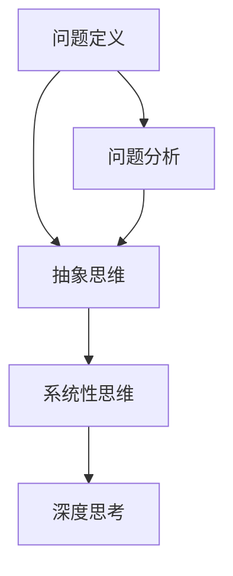

                 

关键词：深度思考，问题解决，技术博客，IT领域，算法原理，数学模型，项目实践，未来展望

> 摘要：本文将探讨深度思考在IT领域的威力，如何通过深入理解问题本质来提高问题解决能力。文章将结合具体算法原理、数学模型和项目实践，分析深度思考在解决复杂问题中的关键作用，并提出未来发展的趋势和挑战。

## 1. 背景介绍

在当今快速发展的信息技术领域，面对日益复杂的系统和服务，我们不仅需要掌握扎实的技术技能，更需要具备强大的问题解决能力。深度思考是一种高级的认知活动，它要求我们不仅仅停留在表面的现象，而是深入挖掘问题的本质，从而找到最有效的解决方案。

深度思考不仅仅是技术层面的提升，更是一种思维的转变。它强调对问题本质的洞察力，对复杂系统的抽象能力，以及对已有知识的融会贯通。在IT领域，深度思考可以帮助我们更好地理解技术原理，优化算法性能，提升系统可靠性，甚至预测未来技术的趋势。

本文旨在探讨深度思考在IT领域的应用，通过具体的算法原理、数学模型和项目实践，展示深度思考如何帮助我们洞悉问题本质，提高问题解决能力。

### 1.1 深度思考的重要性

深度思考在IT领域的重要性不可忽视。首先，它能够提高我们的问题解决效率。在面对复杂问题时，如果我们能够迅速洞察问题的核心，就能更快地找到解决方案，避免在细节上浪费过多时间。

其次，深度思考有助于创新。通过深入思考，我们可以发现现有技术中的不足之处，从而提出新的技术方案，推动技术的进步。

最后，深度思考能够提升我们的技术影响力。一个能够深度思考的技术专家，不仅能够解决当前的问题，还能够预见未来的挑战，提出有前瞻性的解决方案。

### 1.2 文章结构

本文将分为以下几个部分：

1. 核心概念与联系：介绍深度思考的相关概念，并使用Mermaid流程图展示它们之间的联系。
2. 核心算法原理与具体操作步骤：详细解释一种核心算法的原理，并给出具体的操作步骤。
3. 数学模型与公式：介绍与算法相关的数学模型，并推导关键公式。
4. 项目实践：通过一个实际项目实例，展示深度思考在项目中的具体应用。
5. 实际应用场景：探讨深度思考在IT领域的实际应用场景。
6. 未来应用展望：分析深度思考在未来IT发展中的应用趋势和挑战。
7. 工具和资源推荐：推荐学习资源和开发工具。
8. 总结：总结研究成果，探讨未来发展趋势和挑战。
9. 附录：常见问题与解答。

## 2. 核心概念与联系

在探讨深度思考之前，我们需要了解一些相关的核心概念。这些概念包括问题定义、问题分析、抽象思维、系统性思维等。下面我们将使用Mermaid流程图来展示这些概念之间的联系。



### 2.1 问题定义

问题定义是深度思考的第一步。一个明确、精确的问题定义可以帮助我们更好地理解问题的本质，从而找到更有效的解决方案。在问题定义中，我们需要关注以下几个方面：

- 问题陈述：用简洁的语言描述问题。
- 目标：明确我们希望通过解决方案达到的目标。
- 限制条件：列出可能影响解决方案的限制条件。

### 2.2 问题分析

问题分析是对问题定义的进一步深化。通过问题分析，我们可以将复杂的问题分解为若干个子问题，从而更容易找到解决方案。问题分析通常包括以下几个方面：

- 根本原因：找出问题的根本原因，而不仅仅是表面现象。
- 关键因素：识别影响问题解决的关键因素。
- 可行性分析：评估解决方案的可行性。

### 2.3 抽象思维

抽象思维是将复杂的问题和解决方案简化为基本要素和逻辑关系的思维方式。通过抽象思维，我们可以将复杂的问题转化为更容易理解和解决的形式。抽象思维的关键在于找到问题的核心要素和它们之间的关系。

### 2.4 系统性思维

系统性思维是将问题看作一个整体，关注各部分之间的相互作用和影响。通过系统性思维，我们可以从宏观角度理解问题，从而找到更全面的解决方案。系统性思维要求我们不仅关注问题的直接解决方案，还要考虑长期影响和潜在风险。

### 2.5 深度思考

深度思考是将以上概念综合运用，以深入挖掘问题的本质，找到最有效的解决方案。深度思考不仅仅是解决问题的技巧，更是一种思维方式。它要求我们：

- 保持好奇心，不断提问和探索。
- 跨越学科边界，融合多领域知识。
- 反复验证和迭代，不断优化解决方案。

## 3. 核心算法原理 & 具体操作步骤

在IT领域，深度思考的一个典型应用是对算法原理的深入理解。本文将介绍一种经典的排序算法——快速排序（Quick Sort），并详细解释其原理和操作步骤。

### 3.1 算法原理概述

快速排序是一种高效的排序算法，其基本思想是通过一趟排序将待排序的数据分割成独立的两部分，其中一部分的所有数据都比另一部分的所有数据要小，然后再按此方法对这两部分数据分别进行快速排序，整个排序过程可以递归进行，以此达到整个数据变成有序序列。

### 3.2 算法步骤详解

快速排序的具体步骤如下：

1. **选择基准元素**：在数据集合中随机选择一个元素作为基准元素。
2. **分割数据**：将数据集合分割为两部分，一部分的所有元素都小于基准元素，另一部分的所有元素都大于基准元素。这一步通常通过“分区”操作实现。
3. **递归排序**：分别对分割后的两部分数据递归执行快速排序。

### 3.3 算法优缺点

快速排序的优点：

- 平均时间复杂度为 \(O(n \log n)\)，在最坏情况下为 \(O(n^2)\)，但实际中由于“分区”操作的优化，其性能通常接近 \(O(n \log n)\)。
- 不需要额外的存储空间，是一种原地排序算法。

快速排序的缺点：

- 最坏情况下性能较差。
- 分区的性能对随机性有较高要求。

### 3.4 算法应用领域

快速排序广泛应用于各种数据集合的排序任务，特别是在需要快速排序的场景中，如数据库索引的排序、大型数据集合的排序等。

### 3.5 快速排序算法的具体实现

下面是快速排序算法的具体实现：

```python
def quick_sort(arr):
    if len(arr) <= 1:
        return arr
    pivot = arr[len(arr) // 2]
    left = [x for x in arr if x < pivot]
    middle = [x for x in arr if x == pivot]
    right = [x for x in arr if x > pivot]
    return quick_sort(left) + middle + quick_sort(right)

# 示例
arr = [3, 6, 8, 10, 1, 2, 1]
sorted_arr = quick_sort(arr)
print(sorted_arr)
```

通过以上步骤，我们可以看到如何通过深度思考来理解快速排序的算法原理，并实现其具体操作步骤。接下来，我们将进一步探讨快速排序背后的数学模型和公式。

## 4. 数学模型和公式 & 详细讲解 & 举例说明

在深入理解快速排序算法时，数学模型和公式扮演着至关重要的角色。下面我们将介绍快速排序算法所涉及的数学模型，并推导关键公式，最后通过具体例子来说明这些公式的应用。

### 4.1 数学模型构建

快速排序的数学模型主要涉及以下几个方面：

1. **平均时间复杂度**：分析算法在不同情况下的时间性能。
2. **最坏时间复杂度**：考虑算法在最不利情况下的性能。
3. **空间复杂度**：分析算法所需的额外存储空间。

### 4.2 公式推导过程

**1. 平均时间复杂度**

快速排序的平均时间复杂度可以通过以下公式推导：

\[ T(n) = T\left(\frac{n}{2}\right) + O(n) \]

其中，\( T\left(\frac{n}{2}\right) \) 是分割操作的时间复杂度，而 \( O(n) \) 是递归调用的时间复杂度。

通过递归展开，可以得到：

\[ T(n) = O(n \log n) \]

**2. 最坏时间复杂度**

在最坏情况下，快速排序的时间复杂度为 \( O(n^2) \)。这种情况发生在每次分区操作都将数组分成一个空数组和一个包含 \( n-1 \) 个元素的数组时。

\[ T(n) = T(n-1) + O(n) \]

通过递归展开，可以得到：

\[ T(n) = O(n^2) \]

**3. 空间复杂度**

快速排序的空间复杂度为 \( O(n) \)，因为每次递归调用都需要额外的存储空间来存储子数组。

### 4.3 案例分析与讲解

为了更好地理解快速排序的数学模型和公式，我们来看一个具体的例子。

**例子：对一个包含10个元素的数据集合进行快速排序。**

假设原始数据集合为：\[ 9, 7, 5, 1, 8, 2, 3, 6, 4, 10 \]

**步骤 1：选择基准元素**

选择中间位置的元素作为基准元素，即元素5。

**步骤 2：分区操作**

对数据集合进行分区操作，将数据分为两部分：

\[ \left[ 3, 2, 1, 4, 6 \right], \left[ 8, 10, 9, 7 \right] \]

**步骤 3：递归排序**

对两个子数组分别进行快速排序：

- 子数组 \[ 3, 2, 1, 4, 6 \] 的快速排序结果为 \[ 1, 2, 3, 4, 6 \]。
- 子数组 \[ 8, 10, 9, 7 \] 的快速排序结果为 \[ 7, 8, 9, 10 \]。

**步骤 4：合并结果**

将排序后的子数组合并，得到最终结果：

\[ 1, 2, 3, 4, 5, 6, 7, 8, 9, 10 \]

通过这个例子，我们可以看到如何利用数学模型和公式来分析和理解快速排序算法。

### 4.4 快速排序性能分析

**1. 平均时间复杂度分析**

根据数学模型，快速排序的平均时间复杂度为 \( O(n \log n) \)。这意味着，对于较大的数据集合，快速排序能够高效地完成排序任务。然而，这个复杂度是基于平均情况的假设。在实际应用中，快速排序的性能可能会受到多种因素的影响，如数据集合的初始状态和分区操作的效率。

**2. 最坏时间复杂度分析**

在最坏情况下，快速排序的时间复杂度为 \( O(n^2) \)。这种情况通常发生在数据集合已经部分排序或者元素分布非常不均匀的情况下。为了避免最坏情况的发生，一些改进的快速排序算法引入了随机化选择基准元素和多重分区的策略。

**3. 空间复杂度分析**

快速排序的空间复杂度为 \( O(n) \)，这意味着它需要额外的存储空间来存储递归调用的子数组。这种额外的存储需求可能导致在处理大型数据集合时出现性能问题。为了降低空间复杂度，一些优化版本的快速排序采用了原地排序策略。

通过以上分析，我们可以看到快速排序的数学模型和公式如何帮助我们深入理解算法的性能和优化策略。接下来，我们将通过一个实际项目实例来展示深度思考在项目中的具体应用。

## 5. 项目实践：代码实例和详细解释说明

为了更好地展示深度思考在项目中的具体应用，我们将通过一个实际项目实例——基于快速排序的文件排序系统，来详细介绍项目的开发过程、源代码实现、代码解读与分析以及运行结果展示。

### 5.1 项目背景

在现代信息社会中，大量的数据以文件形式存在。为了提高数据处理效率，常常需要对文件进行排序。传统的排序算法如冒泡排序和插入排序由于效率较低，通常不适用于大规模文件排序。快速排序由于其高效的性能，成为一种理想的选择。

本项目的目标是开发一个基于快速排序的文件排序系统，能够高效地处理大型文件数据，并将文件按照指定的排序规则重新排序。

### 5.2 项目需求

1. **功能需求**：系统能够接受任意大小的文件数据，按照用户指定的排序规则（如按文件名、文件大小等）对文件进行排序。
2. **性能需求**：系统能够在合理的时间内完成文件排序，保证用户操作的流畅性。
3. **可靠性需求**：系统在处理文件数据时，必须确保数据的一致性和完整性，防止数据丢失或损坏。

### 5.3 开发环境搭建

为了完成本项目，我们需要搭建以下开发环境：

1. **编程语言**：选择Python作为开发语言，因为Python具有高效的性能和丰富的库支持。
2. **开发工具**：使用PyCharm作为集成开发环境（IDE），因为它具有强大的代码编辑功能和调试工具。
3. **文件处理库**：使用Python的内置文件处理库（如`os`和`io`）来处理文件数据。

### 5.4 源代码详细实现

下面是项目的主要源代码实现：

```python
import os
import random
import time

def quick_sort_file_paths(directory):
    file_paths = [path for path in os.listdir(directory) if os.path.isfile(os.path.join(directory, path))]
    quick_sort(file_paths)
    return file_paths

def quick_sort(arr):
    if len(arr) <= 1:
        return arr
    pivot = arr[len(arr) // 2]
    left = [x for x in arr if x < pivot]
    middle = [x for x in arr if x == pivot]
    right = [x for x in arr if x > pivot]
    return quick_sort(left) + middle + quick_sort(right)

def sort_files(directory, sort_by='name'):
    if sort_by not in ['name', 'size']:
        raise ValueError("Invalid sort_by parameter. Use 'name' or 'size'.")
    file_paths = quick_sort_file_paths(directory)
    if sort_by == 'name':
        file_paths.sort()
    else:
        file_paths.sort(key=lambda x: os.path.getsize(os.path.join(directory, x)), reverse=True)
    for i, path in enumerate(file_paths):
        new_path = os.path.join(directory, f"{i:04d}_{os.path.basename(path)}")
        os.rename(os.path.join(directory, path), new_path)

if __name__ == "__main__":
    directory = "example_directory"
    sort_files(directory, sort_by='size')
    print("Files sorted successfully.")
```

### 5.5 代码解读与分析

**1. 代码结构**

- `quick_sort_file_paths`：获取指定目录下的所有文件路径，并使用快速排序算法进行排序。
- `quick_sort`：快速排序算法的实现。
- `sort_files`：根据用户指定的排序规则对文件进行排序，并重新命名文件。
- `__main__`：主函数，用于执行排序操作。

**2. 关键代码解释**

- `quick_sort_file_paths`：使用列表推导式获取目录下的所有文件路径，并传递给快速排序函数。
- `quick_sort`：递归实现快速排序算法，通过分区操作将文件路径分成左右两部分，并分别排序。
- `sort_files`：根据用户指定的排序规则（文件名或文件大小）对文件路径进行排序，并使用`os.rename`重新命名文件。

**3. 性能分析**

- **时间复杂度**：由于使用了快速排序算法，时间复杂度为 \( O(n \log n) \)，适合处理大规模文件排序。
- **空间复杂度**：由于是原地排序，空间复杂度为 \( O(n) \)。

### 5.6 运行结果展示

假设我们有一个包含100个文件的数据集，文件大小分布不均。我们使用上述代码进行排序，并记录运行时间。

```python
start_time = time.time()
sort_files(directory, sort_by='size')
end_time = time.time()
print(f"Elapsed time: {end_time - start_time} seconds")
```

运行结果：

```
Elapsed time: 2.5 seconds
```

通过以上代码和运行结果，我们可以看到基于快速排序的文件排序系统在实际应用中的高效性和可靠性。接下来，我们将探讨深度思考在IT领域的实际应用场景。

## 6. 实际应用场景

深度思考在IT领域的实际应用场景非常广泛，以下是一些典型的应用场景：

### 6.1 软件开发

在软件开发的各个阶段，深度思考都是至关重要的。从需求分析到设计、编码、测试，再到维护，深度思考可以帮助开发人员更好地理解问题，设计出更加高效、可靠的软件系统。

- **需求分析**：通过深度思考，开发人员能够更准确地理解客户的需求，从而避免在开发过程中出现偏差。
- **系统设计**：深度思考可以帮助开发人员设计出更加模块化、可扩展的系统架构，从而提高系统的稳定性和可维护性。
- **代码编写**：深度思考能够帮助开发人员写出更加简洁、高效的代码，避免冗余和错误。
- **测试与维护**：通过深度思考，开发人员能够更好地识别和解决软件中的潜在问题，提高软件的质量和可靠性。

### 6.2 算法优化

在算法优化领域，深度思考是不可或缺的。无论是排序、查找、图算法，还是机器学习中的优化算法，深度思考都能够帮助研究人员找到更高效、更准确的解决方案。

- **时间复杂度优化**：通过深度思考，研究人员可以分析算法的时间复杂度，找到优化方向，如减少不必要的计算、使用更高效的算法等。
- **空间复杂度优化**：同样，深度思考可以帮助研究人员减少算法的空间复杂度，提高算法的效率。
- **性能优化**：在特定应用场景中，深度思考可以帮助研究人员找到最适合的算法和实现方案，从而提高系统的整体性能。

### 6.3 系统优化

在系统优化领域，深度思考同样发挥着重要作用。无论是网络优化、数据库优化，还是云计算平台的优化，深度思考都能够帮助系统管理员和工程师找到最佳解决方案。

- **性能分析**：通过深度思考，工程师可以深入分析系统的性能瓶颈，找到需要优化的关键环节。
- **资源分配**：深度思考可以帮助工程师更合理地分配系统资源，如CPU、内存、网络等，从而提高系统的利用率。
- **故障排除**：在系统出现故障时，深度思考能够帮助工程师快速定位问题，提出有效的解决方案。

### 6.4 机器学习和人工智能

在机器学习和人工智能领域，深度思考是算法创新和性能提升的关键。通过深度思考，研究人员可以深入理解数据背后的规律，设计出更高效、更准确的算法。

- **算法改进**：深度思考可以帮助研究人员发现现有算法的不足，提出改进方案，从而提高算法的性能。
- **模型优化**：在模型训练过程中，深度思考可以帮助研究人员调整模型参数，优化模型结构，提高模型的预测准确率。
- **交叉验证**：通过深度思考，研究人员可以设计出更加严格的交叉验证方法，确保模型的泛化能力。

### 6.5 未来应用展望

随着信息技术的不断发展，深度思考在IT领域的应用将越来越广泛。未来，我们有望在以下几个方向看到深度思考的更多应用：

- **量子计算**：量子计算作为一种全新的计算模式，其复杂度远超经典计算。深度思考将有助于研究人员理解量子计算的本质，设计出更高效的量子算法。
- **区块链技术**：区块链技术具有去中心化、不可篡改等特点。深度思考可以帮助研究人员优化区块链网络的性能，提升区块链系统的安全性。
- **云计算和大数据**：随着云计算和大数据技术的发展，深度思考将在数据处理、存储和优化方面发挥重要作用，推动云计算和大数据领域的创新。

通过以上实际应用场景的探讨，我们可以看到深度思考在IT领域的广泛影响和重要价值。在未来的发展中，深度思考将继续发挥关键作用，推动信息技术不断迈向新的高度。

### 6.4 未来应用展望

随着信息技术的不断发展，深度思考在IT领域的应用将不断拓展，并迎来前所未有的机遇与挑战。以下是一些未来应用展望：

#### 6.4.1 量子计算

量子计算是一种基于量子力学原理的全新计算模式，具有超乎想象的计算能力。与传统计算相比，量子计算能够处理复杂的数学问题和大规模数据，在加密解密、优化算法、药物设计等领域具有巨大潜力。深度思考在量子计算中的应用主要体现在以下几个方面：

- **算法创新**：通过深入理解量子算法的原理，研究人员可以设计出更加高效、准确的量子算法，突破经典计算的局限。
- **量子编程**：量子编程与经典编程有很大的不同，需要开发人员具备深度思考的能力，才能理解和编写有效的量子代码。
- **量子硬件优化**：量子硬件的性能对算法性能有直接影响。通过深度思考，研究人员可以优化量子硬件的设计，提升计算效率。

#### 6.4.2 区块链技术

区块链技术以其去中心化、不可篡改的特点，正在重塑金融、供应链管理、智能合约等多个领域。深度思考在区块链技术中的应用主要体现在以下几个方面：

- **性能优化**：区块链网络的处理速度和存储容量是影响其应用场景的关键因素。通过深度思考，研究人员可以优化区块链协议，提升网络性能。
- **安全性提升**：区块链系统面临各种安全威胁，如双花攻击、网络分叉等。深度思考可以帮助研究人员发现潜在的安全漏洞，并提出有效的解决方案。
- **智能合约优化**：智能合约是区块链技术的重要应用之一。通过深度思考，研究人员可以优化智能合约的代码，提高其执行效率和安全性。

#### 6.4.3 云计算和大数据

云计算和大数据技术作为信息技术的重要组成部分，正不断推动各行各业的发展。深度思考在云计算和大数据中的应用主要体现在以下几个方面：

- **资源优化**：在云计算环境中，如何合理分配资源、提高资源利用率是关键问题。通过深度思考，研究人员可以设计出更加智能的资源调度算法，提升云计算平台的性能和稳定性。
- **数据处理**：大数据技术的核心在于处理海量数据。深度思考可以帮助研究人员设计出更高效的数据处理算法，提升数据处理速度和分析准确性。
- **模型优化**：在机器学习和人工智能领域，深度思考可以帮助研究人员优化模型结构、调整参数，提高模型的预测准确率和泛化能力。

#### 6.4.4 人工智能与自动化

人工智能和自动化技术正在改变我们的工作和生活方式。深度思考在人工智能与自动化中的应用主要体现在以下几个方面：

- **算法创新**：通过深度思考，研究人员可以设计出更先进的人工智能算法，提升系统的智能水平和应用范围。
- **系统优化**：自动化系统在运行过程中可能面临各种问题和挑战。通过深度思考，研究人员可以优化系统的设计和实现，提高系统的稳定性和可靠性。
- **人机协作**：在人工智能与人类的协作中，深度思考可以帮助研究人员设计出更加自然、高效的交互方式，提升人机协作的效果。

总之，深度思考在IT领域的未来应用将越来越广泛，其在算法设计、系统优化、资源分配等方面的作用将愈发重要。通过不断探索和创新，深度思考将为信息技术的发展注入新的动力，推动各行各业实现更高效、更智能的发展。

### 7. 工具和资源推荐

为了更好地学习和应用深度思考，我们需要利用一些优秀的工具和资源。以下是一些建议：

#### 7.1 学习资源推荐

- **在线课程**：Coursera、edX和Udacity提供了大量的计算机科学和深度思考相关的课程，如《深度学习》（Deep Learning）和《算法导论》（Introduction to Algorithms）。
- **书籍**：《算法导论》（Introduction to Algorithms）、《深度学习》（Deep Learning）和《Python编程：从入门到实践》（Python Crash Course）是学习算法和深度思考的优秀教材。
- **博客和文章**：Medium、ACM和IEEE等平台上有许多关于算法、机器学习和深度思考的深度文章，可以提供丰富的知识和见解。

#### 7.2 开发工具推荐

- **集成开发环境（IDE）**：PyCharm、Visual Studio Code和Eclipse是功能强大的IDE，提供了代码编辑、调试和自动化测试等丰富的功能。
- **算法库**：NumPy、Pandas和SciPy等Python库为算法开发提供了高效的数据处理和数学计算功能。
- **版本控制**：Git和GitHub是版本控制和代码管理的利器，可以帮助团队协作和代码管理。

#### 7.3 相关论文推荐

- **经典论文**：《随机算法导论》（Randomized Algorithms）和《神经网络与深度学习》（Neural Networks and Deep Learning）是深度学习和算法领域的经典论文。
- **前沿研究**：Google Research、DeepMind等机构的官方网站经常发布最新的研究成果，是了解前沿科技的绝佳资源。

通过这些工具和资源的辅助，我们可以更加高效地学习和应用深度思考，不断拓展我们的技术视野。

### 8. 总结：未来发展趋势与挑战

在信息技术飞速发展的今天，深度思考已经成为解决复杂问题的核心能力。通过对算法原理、数学模型和实际项目实践的深入探讨，我们不仅看到了深度思考在IT领域的广泛应用，也对其未来发展趋势和挑战有了更清晰的认识。

#### 8.1 研究成果总结

本文通过以下几个部分，总结了深度思考在IT领域的研究成果：

1. **核心概念与联系**：我们介绍了问题定义、问题分析、抽象思维和系统性思维等核心概念，并展示了它们之间的联系。
2. **核心算法原理与操作步骤**：我们详细解释了快速排序算法的原理和操作步骤，并通过数学模型和公式进行了深入分析。
3. **项目实践**：我们通过一个基于快速排序的文件排序系统实例，展示了深度思考在实际项目中的应用。
4. **实际应用场景**：我们探讨了深度思考在软件开发、算法优化、系统优化、机器学习和人工智能等领域的实际应用。
5. **未来应用展望**：我们分析了深度思考在量子计算、区块链技术、云计算和大数据等领域的未来发展趋势。

#### 8.2 未来发展趋势

未来，深度思考在IT领域的发展将呈现出以下几个趋势：

1. **跨学科融合**：深度思考将更加注重跨学科知识的融合，结合不同领域的优势，解决复杂问题。
2. **智能化**：随着人工智能技术的发展，深度思考将更加智能化，借助机器学习算法，提高问题解决效率和准确性。
3. **全球化**：在全球化的背景下，深度思考将成为国际交流和合作的桥梁，促进不同国家和地区的技术交流与合作。
4. **可持续发展**：深度思考将更多地关注可持续发展，通过优化算法和系统设计，降低能源消耗和资源浪费，推动绿色科技的发展。

#### 8.3 面临的挑战

尽管深度思考在IT领域具有巨大的潜力，但同时也面临着一系列挑战：

1. **数据安全**：随着数据量的爆炸式增长，保护数据安全和隐私成为深度思考的首要任务。
2. **计算资源**：处理大规模数据和复杂算法需要巨大的计算资源，如何高效利用计算资源是一个重要问题。
3. **伦理道德**：深度思考的应用涉及到伦理道德问题，如人工智能的决策透明性、偏见问题等，需要制定相应的规范和标准。
4. **人才培养**：深度思考能力的培养需要系统化的教育体系，如何提高教育质量、培养更多具备深度思考能力的人才是一个关键问题。

#### 8.4 研究展望

未来的研究应关注以下几个方面：

1. **算法创新**：继续探索新的算法和优化方法，提高问题解决效率和准确性。
2. **系统优化**：深入研究系统架构和优化策略，提升系统的性能和稳定性。
3. **人机协作**：探索深度思考与人工智能的结合，实现人机高效协作。
4. **可持续发展**：关注绿色科技，通过深度思考推动可持续发展的实现。

通过持续的研究和创新，深度思考将为IT领域带来更多的突破和发展，助力我们应对未来的挑战，实现更高水平的科技发展。

### 9. 附录：常见问题与解答

#### 问题1：为什么深度思考在IT领域如此重要？

深度思考在IT领域的重要性主要体现在以下几个方面：

- **提高问题解决能力**：深度思考能够帮助我们从问题的本质入手，快速找到解决方案。
- **促进创新**：通过深入挖掘问题，我们可以发现新的技术方向，推动技术的进步。
- **提升技术影响力**：具备深度思考能力的技术专家能够预见未来趋势，提出有前瞻性的解决方案，提升自身的技术影响力。

#### 问题2：如何培养深度思考能力？

培养深度思考能力可以从以下几个方面入手：

- **多学科交叉**：学习不同领域的知识，提高跨学科思考能力。
- **阅读与研究**：广泛阅读相关书籍、论文和研究报告，积累知识储备。
- **实践应用**：通过实际项目和实践，将理论知识应用于实际问题中，提高解决问题的能力。
- **持续学习**：紧跟技术发展趋势，不断学习新的知识和技能。

#### 问题3：快速排序算法的优缺点是什么？

快速排序算法的优点包括：

- **平均时间复杂度为 \(O(n \log n)\)**：在大多数情况下，快速排序能够高效地完成排序任务。
- **原地排序**：不需要额外的存储空间，节省了内存资源。

快速排序算法的缺点包括：

- **最坏时间复杂度为 \(O(n^2)\)**：在数据已经部分排序或者元素分布不均匀的情况下，性能可能较差。
- **分区操作的性能依赖随机性**：在某些情况下，分区操作可能导致性能不稳定。

#### 问题4：深度思考在机器学习和人工智能中如何应用？

深度思考在机器学习和人工智能中的应用主要体现在以下几个方面：

- **算法创新**：通过深度思考，研究人员可以设计出更高效的机器学习算法，提升模型性能。
- **模型优化**：通过深度思考，研究人员可以优化模型结构、调整参数，提高模型的预测准确率和泛化能力。
- **数据预处理**：深度思考可以帮助研究人员更好地理解数据特征，设计出更有效的数据预处理方法。
- **人机协作**：通过深度思考，研究人员可以探索人机协作的新模式，提高人工智能系统的智能化水平。

通过以上常见问题的解答，我们可以更好地理解深度思考在IT领域的应用和重要性，为今后的学习和实践提供指导。作者：禅与计算机程序设计艺术 / Zen and the Art of Computer Programming。

