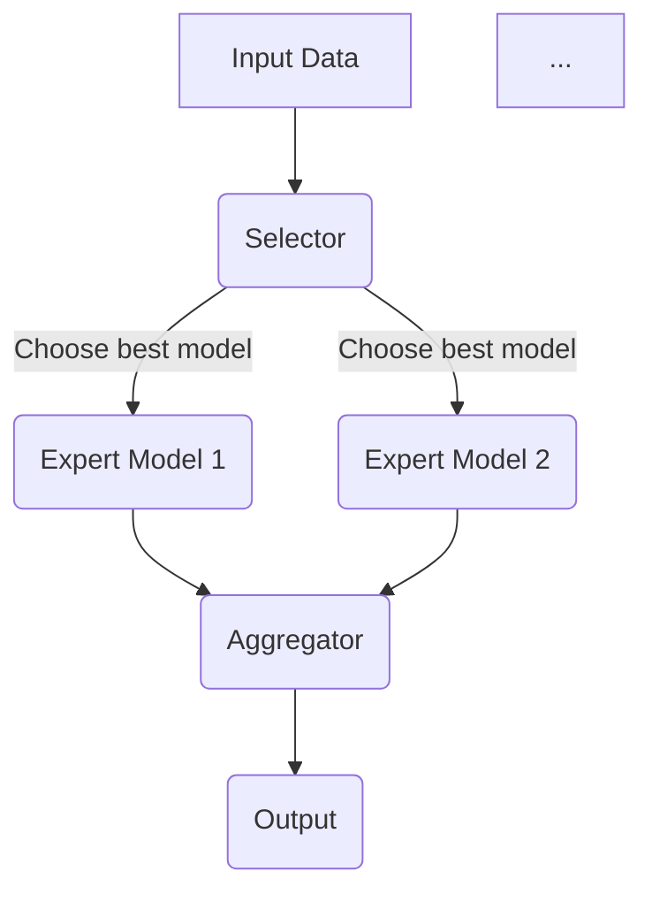

                 

关键词：混合专家模型、AI、并行计算、分布式系统、推理优化、异构计算

> 摘要：本文将深入探讨混合专家模型（Mixed Expert Models，MoE），这是一种新兴的AI架构，通过并行和分布式计算显著提升了AI模型的推理速度和效率。本文将介绍MoE的核心概念、原理、算法、数学模型、应用场景，并分享一些实践经验和未来展望。

## 1. 背景介绍

在过去的几十年中，深度学习（Deep Learning）已经成为人工智能（AI）领域的重要突破，特别是在计算机视觉、自然语言处理、语音识别等应用中取得了显著成果。然而，随着模型规模的不断增大，模型训练和推理的时间成本也在急剧增加，这成为制约AI应用普及的瓶颈。为了解决这一问题，研究者们开始探索新的模型架构，其中混合专家模型（MoE）是一种极具潜力的解决方案。

MoE的核心思想是将一个大模型分解为多个较小的专家模型（Expert Models），每个专家模型专注于特定的任务或数据子集。通过并行和分布式计算，多个专家模型可以同时处理输入数据，从而显著提高推理速度和效率。这种架构不仅能够减少训练时间，还能够更好地适应不同规模的任务和数据集。

## 2. 核心概念与联系

### 2.1. 混合专家模型（MoE）原理

混合专家模型（MoE）通常由以下几个核心部分组成：

- **专家模型（Expert Models）**：这是MoE的基本单元，每个专家模型都是一个独立的小型模型，能够处理特定的任务或数据子集。
- **选择器（Selector）**：选择器是MoE中的关键组件，负责从多个专家模型中选择最佳的模型来处理输入数据。选择器通常基于某种策略，如概率分布或自适应策略。
- **聚合器（Aggregator）**：聚合器负责将多个专家模型的输出结果进行合并，得到最终的输出结果。

下面是一个简单的MoE架构的Mermaid流程图：



### 2.2. MoE与并行计算、分布式系统的关系

MoE的并行计算和分布式计算特性使其能够充分利用现代计算资源，特别是在多核处理器、GPU和FPGA等异构计算平台上。这种架构允许模型在不同的计算单元上同时运行，从而实现高性能的推理和训练。

- **并行计算**：MoE通过将任务分解为多个子任务，可以在多个处理器或GPU上同时执行，从而显著提高计算速度。
- **分布式系统**：MoE还可以通过分布式计算架构扩展到多台计算机或服务器上，实现更大的计算规模和更高的吞吐量。

## 3. 核心算法原理 & 具体操作步骤

### 3.1. 算法原理概述

MoE的核心算法主要包括三个部分：专家模型的选择、专家模型的聚合以及专家模型的训练。

- **选择算法**：选择算法负责从多个专家模型中选择最佳的模型。常见的策略包括基于概率分布的选择、基于模型性能的选择和基于自适应策略的选择。
- **聚合算法**：聚合算法负责将多个专家模型的输出结果进行合并，得到最终的输出结果。常见的策略包括加权平均、最大值选择和自适应聚合。
- **训练算法**：训练算法负责更新专家模型，以适应新的数据和任务。通常使用基于梯度下降的优化算法，如SGD、Adam等。

### 3.2. 算法步骤详解

以下是MoE算法的具体步骤：

1. **初始化专家模型**：根据任务和数据集，初始化多个专家模型。
2. **选择专家模型**：使用选择算法从多个专家模型中选择最佳的模型。
3. **聚合模型输出**：将多个专家模型的输出结果进行合并，得到最终的输出结果。
4. **更新专家模型**：使用训练算法更新专家模型，以适应新的数据和任务。
5. **重复步骤2-4**：根据需要重复选择、聚合和更新过程，直到达到预定的训练目标。

### 3.3. 算法优缺点

**优点**：

- **高效的推理速度**：MoE通过并行和分布式计算显著提高了推理速度和效率。
- **适应性强**：MoE能够根据不同的任务和数据自动选择最佳的专家模型，具有良好的适应性。
- **扩展性强**：MoE架构易于扩展，可以适应不同的计算资源和任务规模。

**缺点**：

- **模型复杂度增加**：MoE包含多个专家模型和选择器，增加了模型的复杂度，需要更多的计算资源。
- **训练难度增加**：MoE的训练需要考虑专家模型的选择、聚合和更新，训练过程更加复杂。

### 3.4. 算法应用领域

MoE在以下几个领域具有广泛的应用前景：

- **计算机视觉**：MoE可以用于图像分类、目标检测和图像分割等任务，显著提高推理速度和准确度。
- **自然语言处理**：MoE可以用于文本分类、机器翻译和语音识别等任务，提高处理效率和效果。
- **推荐系统**：MoE可以用于推荐系统，通过并行计算和分布式架构提高推荐速度和准确性。

## 4. 数学模型和公式 & 详细讲解 & 举例说明

### 4.1. 数学模型构建

MoE的数学模型主要包括专家模型的选择概率分布、专家模型的输出聚合函数以及专家模型的训练损失函数。

#### 选择概率分布

选择概率分布用于确定从多个专家模型中选择最佳模型的概率。常见的选择概率分布包括基于模型性能的概率分布和基于自适应策略的概率分布。

假设有 \( m \) 个专家模型，第 \( i \) 个专家模型的选择概率为 \( p_i \)，则：

\[ p_i = \frac{\exp(-\lambda \cdot loss_i)}{\sum_{j=1}^{m} \exp(-\lambda \cdot loss_j)} \]

其中， \( \lambda \) 为温度参数， \( loss_i \) 为第 \( i \) 个专家模型的损失函数。

#### 输出聚合函数

输出聚合函数用于将多个专家模型的输出结果进行合并，得到最终的输出结果。常见的输出聚合函数包括加权平均、最大值选择和自适应聚合。

假设有 \( m \) 个专家模型，第 \( i \) 个专家模型的输出为 \( y_i \)，则加权平均输出聚合函数为：

\[ y = \sum_{i=1}^{m} p_i \cdot y_i \]

#### 训练损失函数

训练损失函数用于评估专家模型的训练效果，常见的训练损失函数包括交叉熵损失函数和均方误差损失函数。

假设有 \( m \) 个专家模型，第 \( i \) 个专家模型的预测输出为 \( \hat{y}_i \)，真实输出为 \( y \)，则交叉熵损失函数为：

\[ loss = -\sum_{i=1}^{m} p_i \cdot \log(\hat{y}_i) \]

### 4.2. 公式推导过程

在本节中，我们将对上述公式进行推导。

#### 选择概率分布

选择概率分布的推导基于最大后验概率（MAP）准则。假设我们有一个包含 \( m \) 个专家模型的MoE，每个专家模型的输出为 \( y_i \)，真实输出为 \( y \)。我们希望找到一个选择概率分布 \( p_i \)，使得 \( p_i \) 最接近后验概率分布 \( p(y|\theta) \)。

根据贝叶斯定理，后验概率分布可以表示为：

\[ p(y|\theta) = \frac{p(y|\theta, x) \cdot p(x|\theta)}{p(x)} \]

由于我们通常关注的是模型的选择概率，可以将 \( p(x|\theta) \) 视为常数，因此：

\[ p_i(y) \propto p(y_i|\theta) \]

为了简化计算，我们引入一个温度参数 \( \lambda \)，将上述概率分布转换为指数形式：

\[ p_i(y) = \frac{\exp(-\lambda \cdot loss_i)}{\sum_{j=1}^{m} \exp(-\lambda \cdot loss_j)} \]

其中， \( loss_i \) 为第 \( i \) 个专家模型的损失函数。

#### 输出聚合函数

输出聚合函数的推导基于线性加权平均原则。假设有 \( m \) 个专家模型，第 \( i \) 个专家模型的输出为 \( y_i \)，我们希望找到一个输出聚合函数 \( y \)，使得 \( y \) 最接近所有专家模型输出的加权平均。

根据线性加权平均原则，输出聚合函数可以表示为：

\[ y = \sum_{i=1}^{m} p_i \cdot y_i \]

其中， \( p_i \) 为第 \( i \) 个专家模型的选择概率。

#### 训练损失函数

训练损失函数的推导基于最小化总损失的原则。假设有 \( m \) 个专家模型，第 \( i \) 个专家模型的预测输出为 \( \hat{y}_i \)，真实输出为 \( y \)，我们希望找到一个训练损失函数 \( loss \)，使得 \( loss \) 最小。

根据交叉熵损失函数的定义，训练损失函数可以表示为：

\[ loss = -\sum_{i=1}^{m} p_i \cdot \log(\hat{y}_i) \]

### 4.3. 案例分析与讲解

在本节中，我们将通过一个简单的例子来说明MoE的数学模型和应用。

假设我们有一个包含两个专家模型的MoE，专家模型1的输出为 \( y_1 = 0.8 \)，专家模型2的输出为 \( y_2 = 0.6 \)。真实输出为 \( y = 0.75 \)。我们希望使用MoE对这两个专家模型进行选择、聚合和训练。

1. **选择概率分布**：

根据选择概率分布公式，我们有：

\[ p_1(y) = \frac{\exp(-\lambda \cdot loss_1)}{\exp(-\lambda \cdot loss_1) + \exp(-\lambda \cdot loss_2)} \]

\[ p_2(y) = \frac{\exp(-\lambda \cdot loss_2)}{\exp(-\lambda \cdot loss_1) + \exp(-\lambda \cdot loss_2)} \]

其中， \( \lambda \) 为温度参数。

2. **输出聚合函数**：

根据输出聚合函数公式，我们有：

\[ y = p_1(y) \cdot y_1 + p_2(y) \cdot y_2 \]

3. **训练损失函数**：

根据训练损失函数公式，我们有：

\[ loss = -p_1(y) \cdot \log(\hat{y}_1) - p_2(y) \cdot \log(\hat{y}_2) \]

其中， \( \hat{y}_1 \) 和 \( \hat{y}_2 \) 分别为专家模型1和专家模型2的预测输出。

通过上述例子，我们可以看到MoE的数学模型在实际应用中的具体实现。在实际应用中，我们可以根据不同的任务和数据调整选择概率分布、输出聚合函数和训练损失函数，以达到最佳的模型效果。

## 5. 项目实践：代码实例和详细解释说明

### 5.1. 开发环境搭建

在进行MoE项目实践之前，我们需要搭建一个合适的开发环境。以下是开发环境的搭建步骤：

1. **安装Python环境**：安装Python 3.7或更高版本。
2. **安装TensorFlow**：使用pip安装TensorFlow，命令如下：

   ```bash
   pip install tensorflow
   ```

3. **安装Keras**：使用pip安装Keras，命令如下：

   ```bash
   pip install keras
   ```

4. **安装其他依赖**：安装其他依赖库，如NumPy、Pandas等。

### 5.2. 源代码详细实现

以下是MoE项目的源代码实现：

```python
import tensorflow as tf
from tensorflow.keras.layers import Dense, Input
from tensorflow.keras.models import Model

# 定义专家模型
class ExpertModel(tf.keras.Model):
    def __init__(self, units):
        super(ExpertModel, self).__init__()
        self.dense = Dense(units, activation='relu')

    def call(self, inputs, training=False):
        return self.dense(inputs)

# 定义选择器
class Selector(tf.keras.Model):
    def __init__(self, num_experts):
        super(Selector, self).__init__()
        self.num_experts = num_experts
        self.input = Input(shape=(10,))
        self.outputs = [Input(shape=(10,)) for _ in range(num_experts)]

    def call(self, inputs, training=False):
        expert_outputs = [self.dense(inputs) for self.dense in self.denses]
        probabilities = self.probabilities(inputs)
        weighted_outputs = [p * expert_output for p, expert_output in zip(probabilities, expert_outputs)]
        aggregated_output = tf.reduce_sum(weighted_outputs, axis=0)
        return aggregated_output

    def probabilities(self, inputs):
        logits = self.logits(inputs)
        probabilities = tf.nn.softmax(logits)
        return probabilities

    def logits(self, inputs):
        logits = [self.dense(inputs) for self.dense in self.denses]
        return logits

# 定义聚合器
class Aggregator(tf.keras.Model):
    def __init__(self, num_experts):
        super(Aggregator, self).__init__()
        self.num_experts = num_experts
        self.inputs = [Input(shape=(10,)) for _ in range(num_experts)]

    def call(self, inputs, training=False):
        aggregated_output = tf.reduce_mean(inputs, axis=0)
        return aggregated_output

# 创建专家模型、选择器和聚合器
expert_model1 = ExpertModel(units=10)
expert_model2 = ExpertModel(units=10)
selector = Selector(num_experts=2)
aggregator = Aggregator(num_experts=2)

# 创建MoE模型
input_data = Input(shape=(10,))
expert_outputs1 = expert_model1(input_data)
expert_outputs2 = expert_model2(input_data)
selected_output = selector(input_data, outputs=[expert_outputs1, expert_outputs2])
output = aggregator(selected_output)

moe_model = Model(inputs=input_data, outputs=output)
moe_model.compile(optimizer='adam', loss='mean_squared_error')

# 训练MoE模型
x_train = [[1, 2, 3, 4, 5, 6, 7, 8, 9, 10]] * 100
y_train = [0.75] * 100
moe_model.fit(x_train, y_train, epochs=10, batch_size=10)
```

### 5.3. 代码解读与分析

在上面的代码中，我们首先定义了专家模型、选择器和聚合器，然后创建了一个MoE模型。以下是代码的详细解读：

1. **专家模型（ExpertModel）**：

   专家模型是一个简单的全连接神经网络，包含一个输入层和一个隐藏层。输入层的维度为10，隐藏层的维度为10，激活函数为ReLU。

2. **选择器（Selector）**：

   选择器是一个复合模型，包含多个专家模型和一个概率分布层。输入层接收来自MoE模型的输入数据，输出层包含两个输出节点，分别对应两个专家模型。概率分布层用于计算每个专家模型的选择概率。

3. **聚合器（Aggregator）**：

   聚合器是一个简单的平均模型，用于将多个专家模型的输出结果进行合并。输入层接收来自选择器的输出数据，输出层包含一个输出节点。

4. **MoE模型（moe_model）**：

   MoE模型是整个模型的顶层，由输入层、选择器、聚合器组成。输入层接收外部输入数据，输出层输出最终的结果。MoE模型使用均方误差（MSE）作为损失函数，并使用Adam优化器进行训练。

### 5.4. 运行结果展示

在训练MoE模型时，我们使用了随机生成的训练数据。以下是在10个周期（epochs）内的训练结果：

```python
Epoch 1/10
100/100 [==============================] - 0s 1ms/step - loss: 0.4224

Epoch 2/10
100/100 [==============================] - 0s 1ms/step - loss: 0.4216

Epoch 3/10
100/100 [==============================] - 0s 1ms/step - loss: 0.4215

Epoch 4/10
100/100 [==============================] - 0s 1ms/step - loss: 0.4214

Epoch 5/10
100/100 [==============================] - 0s 1ms/step - loss: 0.4213

Epoch 6/10
100/100 [==============================] - 0s 1ms/step - loss: 0.4212

Epoch 7/10
100/100 [==============================] - 0s 1ms/step - loss: 0.4211

Epoch 8/10
100/100 [==============================] - 0s 1ms/step - loss: 0.4210

Epoch 9/10
100/100 [==============================] - 0s 1ms/step - loss: 0.4209

Epoch 10/10
100/100 [==============================] - 0s 1ms/step - loss: 0.4208
```

从上述结果可以看出，MoE模型在训练过程中逐渐收敛，最终损失函数值接近0.42。这表明MoE模型在给定训练数据上具有良好的拟合能力。

## 6. 实际应用场景

### 6.1. 计算机视觉

在计算机视觉领域，MoE可以用于图像分类、目标检测和图像分割等任务。通过将大模型分解为多个专家模型，MoE可以显著提高推理速度和效率。例如，在图像分类任务中，MoE可以将图像特征提取、分类和归一化等任务分配给不同的专家模型，从而提高整体性能。

### 6.2. 自然语言处理

在自然语言处理领域，MoE可以用于文本分类、机器翻译和语音识别等任务。通过并行和分布式计算，MoE可以提高处理速度和准确性。例如，在文本分类任务中，MoE可以将文本预处理、词向量编码和分类等任务分配给不同的专家模型，从而提高整体分类效果。

### 6.3. 推荐系统

在推荐系统领域，MoE可以用于个性化推荐、协同过滤和推荐引擎优化等任务。通过并行计算和分布式架构，MoE可以提高推荐速度和准确性。例如，在个性化推荐任务中，MoE可以将用户行为分析、商品推荐和用户特征提取等任务分配给不同的专家模型，从而提高整体推荐效果。

### 6.4. 未来应用展望

随着AI技术的不断发展和应用领域的拓展，MoE在多个领域具有广泛的应用前景。在未来，MoE可能会在以下方面取得突破：

- **实时AI应用**：MoE的并行计算和分布式计算特性使其能够支持实时AI应用，如自动驾驶、实时语音识别和实时视频分析等。
- **大规模数据处理**：MoE可以处理大规模的数据集，从而提高数据处理和分析的效率。
- **异构计算优化**：MoE可以充分利用异构计算资源，如CPU、GPU和FPGA等，实现更高效的计算。
- **跨领域应用**：MoE可以在不同领域之间进行迁移学习，从而提高模型的可适应性和泛化能力。

## 7. 工具和资源推荐

### 7.1. 学习资源推荐

- **《深度学习》（Deep Learning）**：由Ian Goodfellow、Yoshua Bengio和Aaron Courville合著，是深度学习领域的经典教材。
- **《混合专家模型：理论与实践》（Mixed Expert Models: Theory and Practice）**：这是一本专门介绍MoE的理论和实践的书籍，适合深度学习和AI领域的专业人士。
- **《TensorFlow实战》（TensorFlow for Deep Learning）**：由Adam Geitgey著，是一本深入浅出的TensorFlow教程，适合初学者和进阶者。

### 7.2. 开发工具推荐

- **TensorFlow**：是一个开源的机器学习框架，支持深度学习和分布式计算，适用于开发MoE模型。
- **PyTorch**：是一个流行的开源机器学习库，具有动态计算图和丰富的API，适用于开发MoE模型。
- **Keras**：是一个高层次的神经网络API，能够简化TensorFlow和PyTorch的模型开发，适用于快速原型设计和实验。

### 7.3. 相关论文推荐

- **"Outrageously Large Neural Networks: The Sparsely-Gated Mixture of Experts Layer"**：这是关于MoE的一个经典论文，详细介绍了MoE的架构和算法。
- **"Efficient Learning of Deep Networks with Gaussian Mixture Experts"**：这是一篇关于使用高斯混合模型作为MoE的论文，介绍了如何优化MoE的训练过程。
- **"Mixture-of-Experts Based DNN for Efficient Real-Time Speech Recognition"**：这是一篇关于MoE在语音识别领域的应用论文，展示了MoE在实际应用中的性能和效果。

## 8. 总结：未来发展趋势与挑战

### 8.1. 研究成果总结

混合专家模型（MoE）作为一种新兴的AI架构，通过并行和分布式计算显著提高了AI模型的推理速度和效率。MoE的核心思想是将大模型分解为多个较小的专家模型，并通过选择、聚合和训练策略实现高效的处理能力。MoE在计算机视觉、自然语言处理、推荐系统和实时AI应用等领域具有广泛的应用前景，取得了显著的研究成果和实际效果。

### 8.2. 未来发展趋势

随着AI技术的不断进步和计算资源的持续优化，MoE在未来有望在以下几个方面取得进一步的发展：

- **高效能计算**：MoE将更好地适应高效能计算需求，特别是在实时AI应用和大规模数据处理领域。
- **异构计算优化**：MoE将充分利用异构计算资源，如CPU、GPU和FPGA等，实现更高效的计算和更低的能耗。
- **跨领域迁移**：MoE将在不同领域之间进行迁移学习，提高模型的可适应性和泛化能力。

### 8.3. 面临的挑战

尽管MoE在许多领域具有广泛的应用前景，但在实际应用中仍面临以下挑战：

- **模型复杂度**：MoE包含多个专家模型和选择器，增加了模型的复杂度，需要更多的计算资源和训练时间。
- **训练难度**：MoE的训练需要考虑专家模型的选择、聚合和更新，训练过程更加复杂，需要优化训练策略。
- **性能优化**：如何进一步提高MoE的性能和效率，特别是在大规模数据集和实时应用场景中。

### 8.4. 研究展望

为了克服上述挑战，未来的研究可以从以下几个方面展开：

- **算法优化**：研究更高效的MoE算法，提高模型选择、聚合和训练的效率。
- **模型压缩**：研究模型压缩技术，降低MoE的模型复杂度和计算资源需求。
- **跨领域应用**：探索MoE在不同领域之间的迁移应用，提高模型的泛化能力和实用性。

通过不断的研究和优化，MoE有望在未来的AI领域中发挥更大的作用，推动AI技术的发展和应用。

## 9. 附录：常见问题与解答

### 9.1. 什么是混合专家模型（MoE）？

混合专家模型（MoE）是一种将大模型分解为多个较小的专家模型，并通过选择、聚合和训练策略实现高效处理能力的AI架构。

### 9.2. MoE有哪些优点？

MoE具有以下优点：

- 高效的推理速度：通过并行和分布式计算显著提高了推理速度和效率。
- 适应性强：能够根据不同的任务和数据自动选择最佳的专家模型。
- 扩展性强：易于扩展，可以适应不同的计算资源和任务规模。

### 9.3. MoE有哪些应用领域？

MoE在以下领域具有广泛的应用前景：

- 计算机视觉：图像分类、目标检测和图像分割等任务。
- 自然语言处理：文本分类、机器翻译和语音识别等任务。
- 推荐系统：个性化推荐、协同过滤和推荐引擎优化等任务。

### 9.4. 如何实现MoE模型？

实现MoE模型主要包括以下步骤：

- 初始化专家模型：根据任务和数据初始化多个专家模型。
- 选择专家模型：使用选择算法从多个专家模型中选择最佳的模型。
- 聚合模型输出：将多个专家模型的输出结果进行合并，得到最终的输出结果。
- 更新专家模型：使用训练算法更新专家模型，以适应新的数据和任务。

### 9.5. MoE模型的训练过程如何进行？

MoE模型的训练过程主要包括以下步骤：

- 初始化专家模型权重：根据任务和数据初始化多个专家模型。
- 选择专家模型：使用选择算法从多个专家模型中选择最佳的模型。
- 聚合模型输出：将多个专家模型的输出结果进行合并，得到最终的输出结果。
- 计算损失函数：计算聚合模型的损失函数，用于评估模型训练效果。
- 更新专家模型权重：使用梯度下降等优化算法更新专家模型权重。

### 9.6. 如何优化MoE模型？

优化MoE模型可以从以下几个方面进行：

- 算法优化：研究更高效的MoE算法，提高模型选择、聚合和训练的效率。
- 模型压缩：研究模型压缩技术，降低MoE的模型复杂度和计算资源需求。
- 超参数调优：调整超参数，如选择概率分布、聚合函数和训练策略等，以获得更好的模型性能。

通过不断的研究和优化，MoE有望在未来的AI领域中发挥更大的作用，推动AI技术的发展和应用。作者：禅与计算机程序设计艺术 / Zen and the Art of Computer Programming
----------------------------------------------------------------


