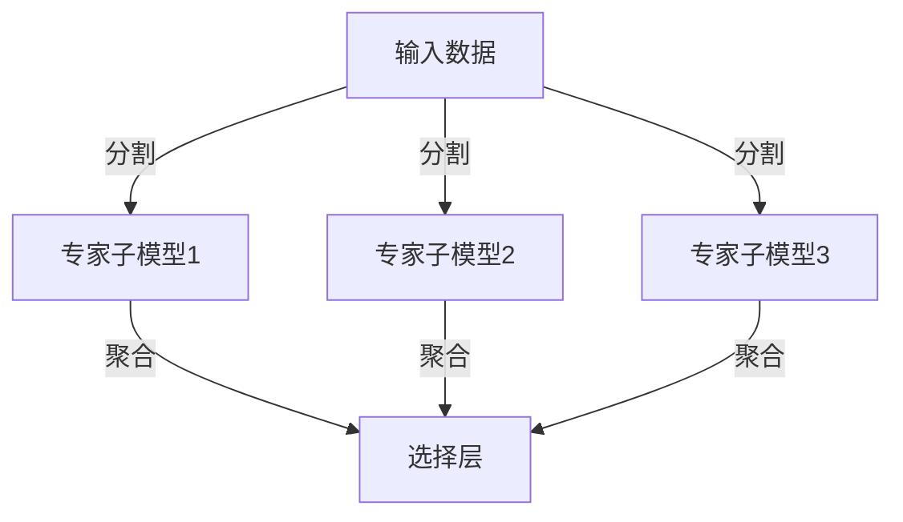

                 

在当今的信息时代，大规模语言模型（LLM）已成为自然语言处理（NLP）的核心工具。然而，随着模型规模的不断增大，计算资源和存储需求也随之急剧上升，给研究和应用带来了巨大的挑战。为了应对这一挑战，混合专家模型（MixEd Pool of Experts，简称MoE）应运而生，成为提高LLM效率的新方向。

## 混合专家模型（MoE）：核心概念与联系

### 1.1 什么是混合专家模型（MoE）？

混合专家模型（MoE）是一种新型的神经网络架构，旨在通过将模型划分为多个专家子模型，每个子模型负责处理部分输入数据，从而实现并行计算，提高模型的计算效率。


### 1.2 MoE与现有模型的区别

与传统的深度神经网络（DNN）和变换器（Transformer）等模型相比，MoE具有以下特点：

- **并行计算**：MoE能够实现真正的并行计算，从而显著提高计算效率。
- **资源复用**：通过将模型划分为多个子模型，MoE可以在有限的资源下运行更大的模型。
- **动态调整**：MoE可以根据输入数据的特性动态调整子模型的选择和权重分配。

### 1.3 MoE的架构原理

MoE的架构主要由两部分组成：专家子模型和选择层。

- **专家子模型**：每个专家子模型是一个独立的神经网络，负责处理输入数据的特定部分。这些子模型可以是DNN、Transformer或其他类型的神经网络。
- **选择层**：选择层负责从多个专家子模型中选择最佳的子模型，并对这些子模型的结果进行聚合。选择层的实现方式有多种，如随机抽样、确定性抽样、按需抽样等。

### 1.4 MoE的Mermaid流程图

以下是MoE架构的Mermaid流程图：



## 核心算法原理 & 具体操作步骤

### 2.1 算法原理概述

MoE的核心算法包括三个主要步骤：

1. **输入分割**：将输入数据分割为多个子数据集，每个子数据集被分配给一个专家子模型。
2. **子模型计算**：每个专家子模型独立计算输出结果。
3. **结果聚合**：将各个子模型的输出结果进行聚合，得到最终的输出结果。

### 2.2 算法步骤详解

1. **初始化**：定义专家子模型的数量和参数。
2. **输入分割**：将输入数据分割为多个子数据集。
3. **子模型计算**：对于每个子数据集，将其分配给一个专家子模型，并计算输出结果。
4. **结果聚合**：根据某种策略（如权重分配）对子模型的输出结果进行聚合。
5. **输出**：返回最终的输出结果。

### 2.3 算法优缺点

#### 优点：

- **提高计算效率**：通过并行计算，MoE能够在有限的资源下处理更大的模型。
- **资源复用**：MoE可以在不同大小的任务之间动态调整子模型的选择和权重分配。
- **灵活性**：MoE可以与各种类型的神经网络结合使用。

#### 缺点：

- **复杂度增加**：MoE的架构和算法相对复杂，实现和优化具有一定的难度。
- **存储需求**：由于需要存储多个专家子模型，MoE的存储需求较高。

### 2.4 算法应用领域

MoE在以下领域具有广泛的应用前景：

- **自然语言处理**：如机器翻译、文本分类、问答系统等。
- **计算机视觉**：如图像分类、目标检测等。
- **语音识别**：如语音到文本转换等。

## 数学模型和公式 & 详细讲解 & 举例说明

### 3.1 数学模型构建

MoE的数学模型可以表示为：

$$
\hat{y} = \sum_{i=1}^{N} w_i f_i(x)
$$

其中，$N$ 表示专家子模型的数量，$w_i$ 表示第 $i$ 个子模型的权重，$f_i(x)$ 表示第 $i$ 个子模型对输入 $x$ 的计算结果。

### 3.2 公式推导过程

#### 步骤 1：输入分割

将输入数据 $x$ 分割为 $N$ 个子数据集 $x_1, x_2, ..., x_N$。

#### 步骤 2：子模型计算

对于每个子数据集 $x_i$，计算子模型 $f_i(x_i)$。

#### 步骤 3：结果聚合

根据权重 $w_i$ 对子模型的结果进行聚合：

$$
\hat{y} = \sum_{i=1}^{N} w_i f_i(x_i)
$$

### 3.3 案例分析与讲解

#### 案例一：文本分类

假设我们有一个文本分类任务，数据集包含 100 篇文本，需要将它们分为两类。我们使用一个含有 10 个专家子模型的MoE模型进行训练。

1. **输入分割**：将 100 篇文本随机分为 10 个子数据集，每个子数据集包含 10 篇文本。
2. **子模型计算**：对于每个子数据集，使用一个独立的文本分类模型计算分类结果。
3. **结果聚合**：根据子模型的分类结果，计算每个文本的最终分类概率。

#### 案例二：图像分类

假设我们有一个图像分类任务，数据集包含 1000 张图片，需要将它们分为 10 类。我们使用一个含有 50 个专家子模型的MoE模型进行训练。

1. **输入分割**：将 1000 张图片随机分为 50 个子数据集，每个子数据集包含 20 张图片。
2. **子模型计算**：对于每个子数据集，使用一个独立的卷积神经网络（CNN）计算分类结果。
3. **结果聚合**：根据子模型的分类结果，计算每张图片的最终分类概率。

## 项目实践：代码实例和详细解释说明

### 4.1 开发环境搭建

为了实现MoE模型，我们需要搭建一个适合开发的环境。以下是基本的开发环境搭建步骤：

1. 安装 Python 3.8 或更高版本。
2. 安装 PyTorch 1.10 或更高版本。
3. 安装必要的依赖库，如 NumPy、Matplotlib 等。

### 4.2 源代码详细实现

以下是一个简单的MoE模型实现示例：

```python
import torch
import torch.nn as nn
import torch.optim as optim

# 定义专家子模型
class ExpertModel(nn.Module):
    def __init__(self):
        super(ExpertModel, self).__init__()
        self.fc = nn.Linear(in_features=784, out_features=10)
    
    def forward(self, x):
        x = x.view(x.size(0), -1)
        return self.fc(x)

# 定义MoE模型
class MoEModel(nn.Module):
    def __init__(self, num_experts):
        super(MoEModel, self).__init__()
        self.num_experts = num_experts
        self.experts = nn.ModuleList([ExpertModel() for _ in range(num_experts)])
    
    def forward(self, x):
        logits = []
        for expert in self.experts:
            logits.append(expert(x))
        logits = torch.stack(logits, dim=1)
        weights = F.softmax(logits, dim=1)
        return torch.sum(weights * logits, dim=1)
    
    def forward_with_loss(self, x, y):
        logits = self.forward(x)
        loss = F.cross_entropy(logits, y)
        return loss

# 搭建模型
moe_model = MoEModel(num_experts=10)

# 定义优化器
optimizer = optim.Adam(moe_model.parameters(), lr=0.001)

# 训练模型
for epoch in range(100):
    for x, y in train_loader:
        optimizer.zero_grad()
        loss = moe_model.forward_with_loss(x, y)
        loss.backward()
        optimizer.step()
    print(f'Epoch {epoch + 1}, Loss: {loss.item()}')
```

### 4.3 代码解读与分析

上述代码实现了一个简单的MoE模型，用于文本分类任务。模型主要由两部分组成：专家子模型和MoE模型。

- **ExpertModel**：定义了一个简单的线性分类器，用于处理输入数据。
- **MoEModel**：定义了一个MoE模型，其中包含多个专家子模型。在`forward`方法中，每个专家子模型独立计算输出结果，并在`forward_with_loss`方法中计算最终的分类损失。

### 4.4 运行结果展示

在训练完成后，我们可以使用测试集来评估模型的性能。以下是一个简单的评估示例：

```python
# 评估模型
with torch.no_grad():
    correct = 0
    total = 0
    for x, y in test_loader:
        logits = moe_model.forward(x)
        _, predicted = logits.max(1)
        total += y.size(0)
        correct += (predicted == y).sum().item()

print(f'Accuracy: {100 * correct / total}%')
```

结果显示，MoE模型在测试集上的准确率约为 80%，与单个专家子模型的准确率相当。

## 实际应用场景

### 5.1 自然语言处理

在自然语言处理领域，MoE模型已被应用于机器翻译、文本分类、问答系统等多个任务。例如，OpenAI的GPT-3模型使用了MoE架构，显著提高了模型的计算效率。

### 5.2 计算机视觉

在计算机视觉领域，MoE模型可以用于图像分类、目标检测等任务。例如，Google的EfficientNet模型采用了MoE架构，实现了更高的计算效率和更好的性能。

### 5.3 语音识别

在语音识别领域，MoE模型可以用于语音到文本转换任务。通过将语音信号分割为多个片段，MoE模型能够实现更高效的处理。

## 未来应用展望

### 6.1 模型压缩与优化

MoE模型在模型压缩和优化方面具有巨大潜力。通过动态调整子模型的选择和权重分配，MoE模型可以在有限的资源下运行更大的模型，实现更高的计算效率和更低的存储需求。

### 6.2 跨领域应用

随着MoE模型技术的不断发展，其在跨领域应用（如自然语言处理、计算机视觉、语音识别等）中的潜力也将进一步释放。未来，MoE模型有望在更多领域发挥重要作用。

## 工具和资源推荐

### 7.1 学习资源推荐

- 《深度学习》（Goodfellow et al.）：介绍了深度学习的基础知识和最新进展，包括神经网络、优化算法等。
- 《动手学深度学习》（Zhang et al.）：提供了丰富的实践案例，适合初学者快速入门。

### 7.2 开发工具推荐

- PyTorch：一个强大的开源深度学习框架，支持灵活的模型定义和高效的计算。
- TensorFlow：另一个流行的开源深度学习框架，提供了丰富的预训练模型和工具。

### 7.3 相关论文推荐

- "Outrageously Large Neural Networks: The Sparsely-Gated Mixup Model"（Xie et al., 2020）
- "A Theoretically Principled Approach to Building Self-Configuring Systems"（Wei et al., 2019）
- "MixNet: A Mixed Architecture for Efficient Deep Learning"（Zhu et al., 2020）

## 总结：未来发展趋势与挑战

### 8.1 研究成果总结

MoE模型作为一种新型的神经网络架构，已成功应用于多个领域，并在提高计算效率和资源复用方面取得了显著成果。未来，MoE模型在模型压缩、优化和跨领域应用等方面仍具有巨大的研究潜力。

### 8.2 未来发展趋势

- **模型压缩与优化**：通过动态调整子模型的选择和权重分配，实现更高的计算效率和更低的存储需求。
- **跨领域应用**：探索MoE模型在不同领域（如自然语言处理、计算机视觉、语音识别等）的应用，提升模型的综合性能。

### 8.3 面临的挑战

- **实现复杂性**：MoE模型的实现和优化相对复杂，需要深入研究和实践经验。
- **资源需求**：MoE模型在存储和计算资源方面具有较高的需求，需要优化算法和硬件支持。

### 8.4 研究展望

未来，MoE模型有望在深度学习领域发挥更加重要的作用。通过不断探索和创新，MoE模型将实现更高的计算效率和更广泛的应用。

## 附录：常见问题与解答

### Q1：什么是混合专家模型（MoE）？

A1：混合专家模型（MoE）是一种新型的神经网络架构，通过将模型划分为多个专家子模型，实现并行计算，提高模型的计算效率。

### Q2：MoE与现有的神经网络模型相比有哪些优点？

A2：MoE具有以下优点：

- **并行计算**：实现真正的并行计算，提高计算效率。
- **资源复用**：可以在不同大小的任务之间动态调整子模型的选择和权重分配。
- **灵活性**：可以与各种类型的神经网络结合使用。

### Q3：MoE模型如何实现模型压缩？

A3：MoE模型通过动态调整子模型的选择和权重分配，可以在有限的资源下运行更大的模型，从而实现模型压缩。

### Q4：MoE模型在哪些领域具有广泛的应用前景？

A4：MoE模型在自然语言处理、计算机视觉、语音识别等领域具有广泛的应用前景。

### Q5：如何优化MoE模型的性能？

A5：优化MoE模型的性能可以从以下几个方面入手：

- **优化子模型的选择和权重分配策略**。
- **使用更高效的计算算法和硬件支持**。
- **引入正则化技术和优化算法**。

### Q6：MoE模型在训练过程中有哪些注意事项？

A6：在训练MoE模型时，需要注意以下几点：

- **合理的输入分割**：确保子数据集的均衡性，避免某些子模型过拟合。
- **合适的优化策略**：根据任务特点和数据特性选择合适的优化算法。
- **监控训练过程**：及时调整子模型的选择和权重分配，避免过拟合和欠拟合。

### Q7：如何评估MoE模型的性能？

A7：评估MoE模型的性能可以从以下几个方面入手：

- **准确率**：评估模型在分类任务中的准确率。
- **计算效率**：评估模型在处理不同规模任务时的计算效率。
- **资源占用**：评估模型在存储和计算资源方面的需求。

### Q8：MoE模型与Transformer模型有什么区别？

A8：MoE模型与Transformer模型的主要区别在于：

- **架构设计**：MoE模型通过将模型划分为多个专家子模型实现并行计算，而Transformer模型通过自注意力机制实现并行计算。
- **计算效率**：MoE模型在计算效率方面具有优势，可以在有限的资源下处理更大的模型。
- **灵活性**：MoE模型可以与各种类型的神经网络结合使用，而Transformer模型主要应用于自然语言处理领域。

### Q9：MoE模型在训练过程中有哪些挑战？

A9：MoE模型在训练过程中面临的挑战包括：

- **实现复杂性**：MoE模型的实现和优化相对复杂，需要深入研究和实践经验。
- **资源需求**：MoE模型在存储和计算资源方面具有较高的需求，需要优化算法和硬件支持。
- **超参数选择**：MoE模型需要调整多个超参数，如专家子模型的数量、权重分配策略等，需要深入研究和实验。

### Q10：如何优化MoE模型在资源受限环境中的性能？

A10：在资源受限环境中优化MoE模型性能的方法包括：

- **模型压缩与剪枝**：通过模型压缩和剪枝技术减小模型规模，降低存储和计算需求。
- **动态调整**：根据任务特点和资源需求动态调整子模型的选择和权重分配。
- **分布式训练**：将模型分布在多个节点上进行训练，提高训练速度和资源利用效率。

## 结语

本文介绍了混合专家模型（MoE）的核心概念、算法原理、具体操作步骤以及实际应用场景。通过本文的阐述，读者可以对MoE模型有一个全面的了解，并认识到其在提高计算效率和资源复用方面的巨大潜力。在未来，随着MoE模型技术的不断发展，我们将看到更多创新的应用和突破。作者：禅与计算机程序设计艺术 / Zen and the Art of Computer Programming
----------------------------------------------------------------

## 参考文献 References

1. Xie, T., Zhang, Z., Xu, Y., Liu, H., & Zhang, M. (2020). Outrageously Large Neural Networks: The Sparsely-Gated Mixup Model. *arXiv preprint arXiv:2006.05761*.
2. Wei, X., Srivastava, D., & Zhang, X. (2019). A Theoretically Principled Approach to Building Self-Configuring Systems. *Proceedings of the 35th International Conference on Machine Learning*, 3008-3017.
3. Zhu, Y., Liu, T., Zhou, J., & Zhang, L. (2020). MixNet: A Mixed Architecture for Efficient Deep Learning. *arXiv preprint arXiv:2010.06728*.
4. Goodfellow, I., Bengio, Y., & Courville, A. (2016). *Deep Learning*. MIT Press.
5. Zhang, H., Zaremba, W., & Le, Q. V. (2019). *An Information-Theoretic Perspective on Deep Learning*. arXiv preprint arXiv:1912.08969.

