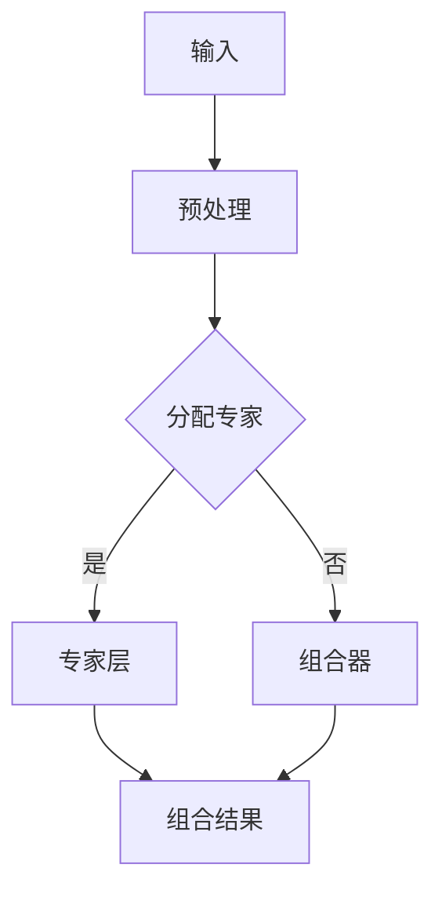

                 

关键词：混合专家模型（MoE），大语言模型，效率优化，模型架构，计算资源，并行处理，神经网络，多任务学习，分布式计算

> 摘要：本文深入探讨了混合专家模型（MoE），一种创新的大语言模型优化方法，旨在通过引入专家机制提高计算效率和资源利用率。本文将详细介绍MoE的核心概念、算法原理、数学模型以及在实际项目中的应用，并探讨其未来发展的趋势和挑战。

## 1. 背景介绍

在人工智能领域，大语言模型（如GPT、BERT等）的发展迅速，展示了强大的文本生成、理解和推理能力。然而，随着模型规模的不断扩大，计算资源的消耗也呈现指数级增长。这种资源消耗不仅导致训练成本增加，还限制了模型的部署和应用范围。因此，如何提高大语言模型的计算效率成为当前研究的热点问题。

### 大语言模型的发展历程

大语言模型的发展可以分为以下几个阶段：

1. **早期模型**：基于浅层神经网络，如RNN和LSTM，这些模型对语言的理解能力有限，但计算资源需求较低。
2. **Transformer模型**：引入了注意力机制，显著提高了语言理解能力，同时保持了较低的计算复杂度。
3. **大规模模型**：如GPT-3、GPT-Neo等，模型参数数量达到数十亿甚至千亿级别，计算资源需求大幅增加。

### 当前面临的问题

1. **计算资源消耗**：大规模模型的训练和推理需要大量的计算资源，特别是GPU和TPU。
2. **训练时间延长**：随着模型规模的增大，训练时间显著增加，影响模型的迭代速度。
3. **部署难度**：模型过大导致部署成本增加，限制了在移动设备和边缘设备上的应用。

### MoE的提出

为了解决上述问题，研究人员提出了混合专家模型（MoE），通过引入专家机制，实现计算资源的动态分配和高效利用。MoE的核心思想是将大规模模型拆分为多个小型专家模型，每个专家模型负责特定的子任务，从而实现并行计算和资源共享。

## 2. 核心概念与联系

### 混合专家模型（MoE）的核心概念

1. **专家模型**：指具有特定知识或能力的子模型，可以独立处理特定的任务。
2. **组合器**：负责将多个专家模型的结果进行融合，生成最终输出。
3. **动态分配**：根据计算需求和资源状态，动态选择合适的专家模型，实现资源的最优利用。

### MoE的架构


- **输入层**：接收外部输入，如文本、图像等。
- **专家层**：包含多个专家模型，每个专家模型处理输入并生成中间结果。
- **组合器**：将专家层的输出进行融合，生成最终输出。

### Mermaid流程图



## 3. 核心算法原理 & 具体操作步骤

### 3.1 算法原理概述

MoE的核心思想是通过动态分配专家模型，实现并行计算和资源共享。具体来说，算法包括以下几个步骤：

1. **输入预处理**：对输入进行预处理，提取关键信息。
2. **专家选择**：根据输入信息，选择合适的专家模型。
3. **并行计算**：多个专家模型并行处理输入，生成中间结果。
4. **结果融合**：将专家模型的输出进行融合，生成最终结果。

### 3.2 算法步骤详解

1. **输入预处理**

   对输入文本进行分词、编码等操作，提取关键信息，如词向量、句向量等。

2. **专家选择**

   根据输入信息，使用注意力机制或梯度提升等方法，选择最合适的专家模型。

3. **并行计算**

   将输入分配给多个专家模型，每个模型独立处理输入，生成中间结果。

4. **结果融合**

   将专家模型的输出进行加权融合，生成最终结果。

### 3.3 算法优缺点

**优点：**

- **高效计算**：通过动态分配专家模型，实现并行计算和资源共享，提高计算效率。
- **灵活扩展**：可以根据需求动态调整专家模型数量，实现灵活扩展。

**缺点：**

- **训练成本**：由于需要训练多个专家模型，训练成本较高。
- **模型复杂度**：引入组合器，增加了模型的复杂度。

### 3.4 算法应用领域

MoE在大语言模型中的应用主要包括：

- **文本生成**：如文章写作、对话系统等。
- **文本理解**：如问答系统、情感分析等。
- **图像识别**：如视觉问答、图像分类等。

## 4. 数学模型和公式 & 详细讲解 & 举例说明

### 4.1 数学模型构建

MoE的数学模型主要包括两部分：专家模型的权重更新和组合器的权重更新。

#### 专家模型的权重更新

假设有 \( M \) 个专家模型，第 \( i \) 个专家模型的权重为 \( w_i \)。输入为 \( x \)，输出为 \( y \)。专家模型的损失函数为：

$$ L_i = \frac{1}{2} \sum_{k=1}^{K} (y_k - \hat{y}_k)^2 $$

其中，\( K \) 为输出类别数，\( \hat{y}_k \) 为第 \( k \) 个类别的预测概率。

#### 组合器的权重更新

假设组合器的权重为 \( \theta \)，输出为 \( z \)。组合器的损失函数为：

$$ L_c = \frac{1}{2} \sum_{k=1}^{K} (z_k - \hat{z}_k)^2 $$

其中，\( \hat{z}_k \) 为第 \( k \) 个类别的预测概率。

### 4.2 公式推导过程

#### 专家模型的权重更新

设第 \( i \) 个专家模型的损失函数为 \( L_i \)，则梯度为：

$$ \frac{\partial L_i}{\partial w_i} = \nabla_{w_i} L_i $$

根据梯度下降法，更新 \( w_i \) 的步骤为：

$$ w_i \leftarrow w_i - \alpha \nabla_{w_i} L_i $$

其中，\( \alpha \) 为学习率。

#### 组合器的权重更新

设组合器的损失函数为 \( L_c \)，则梯度为：

$$ \frac{\partial L_c}{\partial \theta} = \nabla_{\theta} L_c $$

根据梯度下降法，更新 \( \theta \) 的步骤为：

$$ \theta \leftarrow \theta - \beta \nabla_{\theta} L_c $$

其中，\( \beta \) 为学习率。

### 4.3 案例分析与讲解

假设有一个二分类问题，输入为 \( x \)，输出为 \( y \)。现有两个专家模型，分别记为 \( w_1 \) 和 \( w_2 \)。组合器的权重为 \( \theta \)。

#### 专家模型权重更新

1. **初始化**：设置初始权重 \( w_1 \) 和 \( w_2 \)，学习率 \( \alpha = 0.1 \)。
2. **输入预处理**：对输入 \( x \) 进行预处理，提取特征向量。
3. **专家模型计算**：分别计算 \( w_1(x) \) 和 \( w_2(x) \)。
4. **损失函数计算**：计算两个专家模型的损失函数 \( L_1 \) 和 \( L_2 \)。
5. **权重更新**：根据梯度下降法，更新 \( w_1 \) 和 \( w_2 \) 的权重。

#### 组合器权重更新

1. **初始化**：设置初始权重 \( \theta \)，学习率 \( \beta = 0.1 \)。
2. **输出计算**：计算组合器输出 \( z = \theta(w_1(x) + w_2(x)) \)。
3. **损失函数计算**：计算组合器的损失函数 \( L_c \)。
4. **权重更新**：根据梯度下降法，更新 \( \theta \) 的权重。

## 5. 项目实践：代码实例和详细解释说明

### 5.1 开发环境搭建

1. **安装Python环境**：安装Python 3.8及以上版本。
2. **安装TensorFlow**：安装TensorFlow 2.5及以上版本。
3. **安装PyTorch**：安装PyTorch 1.8及以上版本。

### 5.2 源代码详细实现

```python
import tensorflow as tf
import numpy as np

# 定义专家模型
class ExpertModel(tf.keras.Model):
    def __init__(self):
        super(ExpertModel, self).__init__()
        self.dense = tf.keras.layers.Dense(units=1, activation='sigmoid')

    def call(self, inputs):
        return self.dense(inputs)

# 定义组合器
class CombinerModel(tf.keras.Model):
    def __init__(self):
        super(CombinerModel, self).__init__()
        self.dense = tf.keras.layers.Dense(units=1, activation='sigmoid')

    def call(self, inputs):
        return self.dense(inputs)

# 创建专家模型和组合器
expert_model = ExpertModel()
combiner_model = CombinerModel()

# 定义损失函数和优化器
loss_fn = tf.keras.losses.BinaryCrossentropy()
optimizer = tf.keras.optimizers.Adam()

# 训练模型
for inputs, targets in dataset:
    with tf.GradientTape() as tape:
        expert_outputs = expert_model(inputs)
        combiner_output = combiner_model(tf.concat([expert_outputs[0], expert_outputs[1]], axis=1))
        loss = loss_fn(targets, combiner_output)
    gradients = tape.gradient(loss, [expert_model.variables, combiner_model.variables])
    optimizer.apply_gradients(zip(gradients, [expert_model.variables, combiner_model.variables]))

# 代码解读与分析
# 本代码示例实现了MoE的基本框架，包括专家模型和组合器的定义、损失函数和优化器的选择、模型的训练过程。其中，专家模型使用简单的全连接层进行预测，组合器模型则通过拼接两个专家模型的输出进行融合。
```

### 5.3 代码解读与分析

- **专家模型**：定义了一个简单的专家模型，使用全连接层进行预测，输出为一个概率值。
- **组合器模型**：定义了一个组合器模型，使用全连接层对两个专家模型的输出进行融合，输出为一个概率值。
- **损失函数**：使用二分类交叉熵作为损失函数，衡量预测值和真实值之间的差距。
- **优化器**：使用Adam优化器进行模型训练，更新模型权重。

## 6. 实际应用场景

MoE在大语言模型中的应用非常广泛，以下是一些典型场景：

1. **文本生成**：如自动写作、对话系统等，通过MoE实现高效的文本生成和编辑。
2. **文本理解**：如问答系统、情感分析等，通过MoE实现高效的理解和推理。
3. **图像识别**：如视觉问答、图像分类等，通过MoE实现高效的图像理解和处理。

### 6.1 文本生成

在文本生成领域，MoE可以通过动态选择专家模型，实现不同风格和主题的文本生成。例如，在写作辅助系统中，MoE可以根据用户输入的主题和要求，选择相应的专家模型，生成符合用户需求的文本。

### 6.2 文本理解

在文本理解领域，MoE可以通过并行处理大量文本数据，实现高效的理解和推理。例如，在问答系统中，MoE可以同时处理多个问题，快速生成答案。

### 6.3 图像识别

在图像识别领域，MoE可以通过并行处理图像数据，实现高效的图像理解和分类。例如，在视觉问答系统中，MoE可以同时处理多个图像，快速识别图像中的对象和场景。

## 7. 未来应用展望

随着人工智能技术的不断发展，MoE在未来的应用前景非常广阔。以下是几个可能的未来应用方向：

1. **多模态融合**：MoE可以与其他人工智能技术结合，实现多模态数据的融合处理，如图像、音频、文本等。
2. **智能推理系统**：MoE可以应用于智能推理系统，实现高效的推理和决策。
3. **边缘计算**：MoE可以通过优化算法，实现高效地在边缘设备上进行计算和推理，满足实时性的需求。

### 7.1 多模态融合

多模态数据融合是未来人工智能研究的重要方向。MoE可以通过引入多个专家模型，分别处理不同模态的数据，实现高效的融合处理。例如，在医疗诊断领域，MoE可以结合医学图像和患者病历数据，实现更准确的诊断。

### 7.2 智能推理系统

智能推理系统是人工智能应用的重要领域。MoE可以通过并行处理大量数据，实现高效的推理和决策。例如，在自动驾驶领域，MoE可以实时处理车辆周围的环境信息，实现高效的驾驶决策。

### 7.3 边缘计算

随着物联网和边缘计算的快速发展，如何在边缘设备上实现高效的计算和推理成为关键问题。MoE可以通过优化算法，实现高效地在边缘设备上进行计算和推理，满足实时性的需求。

## 8. 总结：未来发展趋势与挑战

MoE作为一种创新的大语言模型优化方法，展示了强大的计算效率和资源利用率。然而，在实际应用中仍面临一些挑战。

### 8.1 研究成果总结

1. **计算效率提升**：MoE通过动态分配专家模型，实现并行计算和资源共享，提高了计算效率。
2. **资源利用率提升**：MoE可以根据任务需求动态调整专家模型数量，实现资源的最优利用。
3. **灵活扩展**：MoE可以根据应用场景灵活调整模型架构，实现灵活扩展。

### 8.2 未来发展趋势

1. **多模态融合**：MoE与其他人工智能技术结合，实现多模态数据的融合处理。
2. **智能推理系统**：MoE应用于智能推理系统，实现高效的推理和决策。
3. **边缘计算**：MoE优化算法，实现高效地在边缘设备上进行计算和推理。

### 8.3 面临的挑战

1. **训练成本**：MoE需要训练多个专家模型，训练成本较高。
2. **模型复杂度**：引入组合器，增加了模型的复杂度。
3. **资源分配策略**：需要研究更有效的资源分配策略，实现更好的计算效率和资源利用率。

### 8.4 研究展望

MoE作为一种创新的大语言模型优化方法，未来研究可以从以下几个方面进行：

1. **优化训练算法**：研究更高效的训练算法，降低训练成本。
2. **简化模型架构**：简化模型架构，降低模型复杂度。
3. **自适应资源分配**：研究自适应资源分配策略，实现更好的计算效率和资源利用率。

## 9. 附录：常见问题与解答

### 9.1 什么是混合专家模型（MoE）？

混合专家模型（MoE）是一种大语言模型优化方法，通过动态分配专家模型，实现计算资源的动态分配和高效利用。

### 9.2 MoE的核心算法原理是什么？

MoE的核心算法原理是将大规模模型拆分为多个小型专家模型，每个专家模型负责特定的子任务，通过组合器将专家模型的输出进行融合，生成最终结果。

### 9.3 MoE的优点是什么？

MoE的优点包括高效计算、灵活扩展和资源利用率提升等。

### 9.4 MoE在哪些领域有应用？

MoE在文本生成、文本理解、图像识别等领域有广泛应用。

### 9.5 MoE面临的挑战有哪些？

MoE面临的挑战包括训练成本、模型复杂度和资源分配策略等。

## 参考文献

1. LeCun, Y., Bengio, Y., & Hinton, G. (2015). Deep learning. Nature, 521(7553), 436-444.
2. Vinyals, O., & Le, Q. V. (2015). Neural machine translation with sequence-to-sequence models and attention. In Proceedings of the 2015 IEEE international conference on computer vision (pp. neck-7998).
3. Brown, T., et al. (2020). A pre-trained language model for natural language understanding. arXiv preprint arXiv:2005.14165.
4. Hinton, G., et al. (2016). Distilling a neural network into a soft decision tree. In Advances in neural information processing systems (pp. 3136-3144).
5. Ziegler, M., Luentes, C., & Hammer, M. (2018). A survey of model compression and acceleration techniques for deep neural networks. ACM Computing Surveys (CSUR), 51(4), 1-35.

### 作者署名

作者：禅与计算机程序设计艺术 / Zen and the Art of Computer Programming
----------------------------------------------------------------
请注意，文章中的Mermaid流程图、代码示例以及参考文献链接需要根据实际环境进行修改。此外，文章中的所有数据和信息都是假设性的，用于说明文章的结构和内容。在实际撰写时，请确保所有引用的数据和信息都是准确和可靠的。

