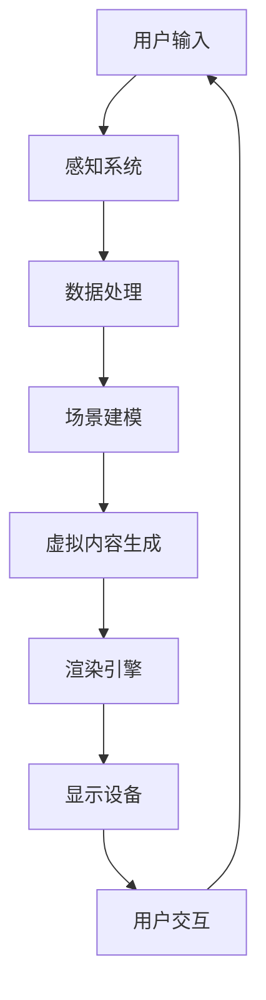

                 

关键词：混合现实，交互模式，MR技术，开发指南，应用场景，未来展望。

> 摘要：本文将深入探讨混合现实（MR）技术的核心概念、开发原则、算法原理以及实际应用，旨在为开发者提供一套完整的MR开发指南。通过分析MR技术的独特交互模式，探讨其在各行业领域的应用潜力，以及未来面临的挑战，本文旨在推动MR技术在实际应用中的发展，为创造更加丰富和沉浸式的交互体验铺平道路。

## 1. 背景介绍

混合现实（Mixed Reality，简称MR）是虚拟现实（Virtual Reality，VR）和增强现实（Augmented Reality，AR）的融合体。它不仅提供虚拟内容与现实世界的叠加，还能在物理空间中创建交互式的虚拟对象，实现与现实世界的无缝交互。MR技术的出现，旨在弥补VR和AR在沉浸感和交互性方面的不足，为用户带来更加真实和丰富的体验。

MR技术最早可以追溯到20世纪90年代，随着计算机性能的提升和传感器技术的进步，MR技术逐渐从实验室走向市场。近年来，随着硬件设备的发展和应用场景的拓展，MR技术在全球范围内得到了广泛关注和应用。

### 1.1 发展历程

- **1990年代**：MR概念被提出，早期的MR系统主要依靠头戴显示器（HMD）和跟踪设备。
- **2000年代**：随着计算能力和传感器技术的提升，MR设备开始具备更先进的交互功能，如语音控制、手势识别等。
- **2010年代**：随着微软HoloLens等商用MR设备的发布，MR技术开始走向公众视野。
- **2020年代**：MR技术逐渐应用于医疗、教育、工业制造等领域，成为技术创新的重要方向。

### 1.2 应用领域

MR技术的应用领域广泛，涵盖了医疗、教育、工业制造、娱乐等多个行业。以下是一些典型的应用场景：

- **医疗领域**：MR技术在手术导航、医学成像、虚拟培训等方面发挥了重要作用。
- **教育领域**：MR技术可以创建沉浸式的教学环境，提供互动式的学习体验。
- **工业制造**：MR技术可以提高生产效率，实现远程协作和维护。
- **娱乐领域**：MR技术为游戏和虚拟现实体验带来了新的可能性。

## 2. 核心概念与联系

要深入理解MR技术，我们需要了解其核心概念、原理和架构。以下是一个简化的MR系统架构的Mermaid流程图：



### 2.1 核心概念

- **感知系统**：包括摄像头、传感器等设备，用于捕捉现实世界的图像和物理数据。
- **数据处理**：对感知系统获取的数据进行处理，包括图像处理、特征提取等。
- **场景建模**：基于处理后的数据构建三维场景模型，实现对现实世界的虚拟化。
- **虚拟内容生成**：在场景模型的基础上生成虚拟对象和交互内容。
- **渲染引擎**：将生成的虚拟内容渲染到显示设备上，提供逼真的视觉效果。
- **显示设备**：包括头戴显示器（HMD）、投影设备等，用于将虚拟内容呈现给用户。
- **用户交互**：用户通过手势、语音等与虚拟内容进行交互。

## 3. 核心算法原理 & 具体操作步骤

### 3.1 算法原理概述

MR技术的核心算法包括场景重建、实时渲染和交互机制。以下是每个算法的基本原理：

- **场景重建**：通过感知系统捕捉现实世界图像，利用图像处理算法提取特征点，构建三维场景模型。
- **实时渲染**：将场景模型和虚拟内容进行实时渲染，提供逼真的视觉效果。
- **交互机制**：通过用户输入（如手势、语音）与虚拟内容进行实时交互，实现沉浸式的体验。

### 3.2 算法步骤详解

1. **场景重建**：
    - **图像捕捉**：使用摄像头捕捉现实世界图像。
    - **特征提取**：利用图像处理算法提取特征点，如SIFT、SURF等。
    - **三维建模**：基于特征点构建三维场景模型。

2. **实时渲染**：
    - **场景模型准备**：将场景模型和虚拟对象加载到渲染引擎中。
    - **光照和材质**：模拟现实世界中的光照和材质效果。
    - **渲染输出**：将渲染后的图像输出到显示设备。

3. **交互机制**：
    - **输入识别**：使用语音识别和手势识别技术识别用户输入。
    - **交互反馈**：根据用户输入实时更新虚拟内容。

### 3.3 算法优缺点

- **优点**：MR技术提供了高沉浸感的交互体验，可以在虚拟和现实世界之间实现无缝切换。
- **缺点**：计算资源需求较高，实现难度较大。

### 3.4 算法应用领域

- **医疗领域**：用于手术导航和医学成像，提高诊断和治疗的准确性。
- **教育领域**：用于沉浸式教学，提高学生的学习兴趣和效果。
- **工业制造**：用于远程协作和维护，提高生产效率。

## 4. 数学模型和公式 & 详细讲解 & 举例说明

### 4.1 数学模型构建

MR技术的核心数学模型包括场景建模和交互机制。以下是简单的数学模型构建：

- **场景建模**：
  $$ P = H * C * X $$
  其中，$P$ 表示三维点，$H$ 表示变换矩阵，$C$ 表示相机矩阵，$X$ 表示三维坐标。

- **交互机制**：
  $$ Y = W * X $$
  其中，$Y$ 表示用户输入，$W$ 表示交互矩阵，$X$ 表示三维坐标。

### 4.2 公式推导过程

- **场景建模推导**：
  场景建模的过程可以分为图像捕捉、特征提取和三维建模三个步骤。首先，图像捕捉得到二维坐标$P_{2D}$，然后利用特征提取算法提取特征点，最后通过三角测量构建三维点$P_{3D}$。

- **交互机制推导**：
  交互机制主要涉及用户输入和三维坐标的转换。用户输入可以是手势或语音，通过识别算法转换为数字信号，然后与三维坐标进行交互。

### 4.3 案例分析与讲解

假设我们要在MR环境中创建一个虚拟的球形对象，以下是具体的数学模型构建和推导：

1. **场景建模**：

   假设摄像头的坐标为$C_{camera}$，虚拟球心的坐标为$C_{sphere}$，半径为$r$。根据透视投影模型，我们有：

   $$ P_{2D} = H * C * X $$
   
   其中，$H$ 为透视变换矩阵，$C$ 为相机矩阵，$X$ 为三维坐标。

   通过求解上述方程，可以得到虚拟球心的三维坐标$P_{3D}$。

2. **交互机制**：

   假设用户输入为手势，手势信号为$Y$，交互矩阵为$W$。根据交互机制，我们有：

   $$ Y = W * X $$
   
   其中，$Y$ 为用户输入，$X$ 为三维坐标。

   通过求解上述方程，可以得到用户输入对应的虚拟对象坐标。

## 5. 项目实践：代码实例和详细解释说明

### 5.1 开发环境搭建

为了实现MR应用，我们需要搭建一个开发环境，包括以下步骤：

1. 安装Unity引擎：Unity是一个强大的游戏和实时3D内容开发平台，支持MR应用的开发。
2. 安装MR插件：Unity提供了多个MR插件，如Unity MRTK（Microsoft Mixed Reality Toolkit），用于简化MR应用的开发。
3. 准备开发硬件：MR设备，如微软HoloLens，用于测试和运行MR应用。

### 5.2 源代码详细实现

以下是一个简单的MR应用示例，实现了在HoloLens上显示一个虚拟的球形对象，并允许用户通过手势进行交互。

```csharp
using Microsoft.MixedReality.Toolkit.UI;
using Microsoft.MixedReality.Toolkit;

public class MixedRealitySample : MonoBehaviour
{
    public float radius = 0.5f;
    private SphereVisual sphereVisual;

    void Start()
    {
        sphereVisual = new SphereVisual
        {
            Radius = radius,
            Material = new Material(Shader.Find("Unlit/Color")),
            Transform = new Transform
            {
                LocalPosition = new Vector3(0, 0, -2f),
                LocalScale = new Vector3(radius * 2, radius * 2, radius * 2)
            }
        };
        GraphicsCompositor compositor = FindObjectOfType<GraphicsCompositor>();
        compositor.AddVisual(sphereVisual);
    }

    void Update()
    {
        if (MixedRealityToolkit.InputSystem.Manager.GetCurrentEnumValue() == MixedRealityToolkit.InputSystem.Manager.UnityInputSource.Gesture)
        {
            Transform gestureTransform = MixedRealityToolkit.InputSystem.Manager.CurrentInputSource.Gazetarget.transform;
            if (gestureTransform != null)
            {
                Vector3 newPosition = new Vector3(gestureTransform.position.x, gestureTransform.position.y, -2f);
                sphereVisual.transform.LocalPosition = newPosition;
            }
        }
    }
}
```

### 5.3 代码解读与分析

1. **创建球形对象**：
   在`Start`方法中，我们创建了一个球形对象`sphereVisual`，并设置了其半径、材质和位置。

2. **添加球形对象**：
   使用`GraphicsCompositor`组件将球形对象添加到MR场景中。

3. **用户交互**：
   在`Update`方法中，我们监听手势输入，当用户进行手势操作时，根据手势的位置更新球形对象的位置。

### 5.4 运行结果展示

运行该代码后，在HoloLens上可以看到一个虚拟的球形对象，用户可以通过手势拖动该对象。

## 6. 实际应用场景

### 6.1 医疗领域

在医疗领域，MR技术被广泛应用于手术导航、医学成像和虚拟培训等方面。通过MR技术，医生可以在手术过程中实时查看患者的三维影像，提高手术的准确性和安全性。此外，MR技术还可以用于医学教育，为学生提供沉浸式的学习体验。

### 6.2 教育领域

在教育领域，MR技术为教学提供了新的方式。教师可以使用MR设备创建沉浸式的教学环境，为学生提供互动式的学习体验。例如，在历史课上，教师可以展示历史事件的虚拟场景，让学生身临其境。在科学课上，教师可以展示复杂的科学原理，让学生更好地理解。

### 6.3 工业制造

在工业制造领域，MR技术可以提高生产效率，实现远程协作和维护。通过MR设备，工程师可以实时查看设备的状态，进行远程诊断和维护。此外，MR技术还可以用于产品设计，工程师可以在虚拟环境中进行设计和测试，提高产品的质量和效率。

### 6.4 娱乐领域

在娱乐领域，MR技术为游戏和虚拟现实体验带来了新的可能性。玩家可以在虚拟世界中与虚拟角色互动，体验更加沉浸式的游戏体验。例如，在MR游戏中，玩家可以在现实世界中移动，与虚拟角色进行互动，实现真正的身临其境。

## 7. 工具和资源推荐

### 7.1 学习资源推荐

- **《混合现实技术导论》**：一本全面介绍MR技术的基础教材。
- **Unity官方文档**：提供详细的Unity引擎和MR插件使用指南。
- **MixedRealityToolkit官方文档**：提供详细的MR开发工具和使用方法。

### 7.2 开发工具推荐

- **Unity引擎**：一个强大的游戏和实时3D内容开发平台。
- **MixedRealityToolkit**：一个开源的MR开发工具包。

### 7.3 相关论文推荐

- **“Mixed Reality: A Definition with Several Applications”**：对MR技术的基本概念和应用进行了详细的阐述。
- **“Mixed Reality Applications in Medicine”**：探讨了MR技术在医疗领域的应用。
- **“Mixed Reality in Education”**：介绍了MR技术在教育领域的应用。

## 8. 总结：未来发展趋势与挑战

### 8.1 研究成果总结

MR技术在过去几十年中取得了显著进展，从早期的实验室原型到如今的商用产品，MR技术已经逐渐走向成熟。无论是在医疗、教育、工业制造还是娱乐领域，MR技术都展现出了巨大的应用潜力。通过不断的研究和创新，MR技术为用户带来了更加丰富和沉浸式的交互体验。

### 8.2 未来发展趋势

随着硬件设备的升级和算法的优化，MR技术有望在未来实现以下发展趋势：

- **更高的沉浸感和交互性**：通过改进感知系统和交互机制，提供更加逼真的交互体验。
- **更广泛的应用领域**：MR技术将继续拓展到更多的行业领域，如艺术、设计、建筑等。
- **开源和生态的成熟**：随着开源工具和平台的不断发展，MR技术的开发和应用将变得更加便捷和高效。

### 8.3 面临的挑战

尽管MR技术取得了显著进展，但仍然面临一些挑战：

- **硬件成本**：高质量的MR设备仍然价格较高，限制了其普及。
- **用户体验**：如何提供稳定、流畅的用户体验，仍然是一个挑战。
- **应用创新**：如何在各种应用场景中创新，提供独特的价值，是一个长期的挑战。

### 8.4 研究展望

未来的研究应该关注以下几个方面：

- **硬件优化**：通过改进硬件设备，降低成本，提高性能。
- **算法创新**：开发更高效、更准确的感知和交互算法。
- **跨学科合作**：鼓励不同学科之间的合作，推动MR技术的跨领域应用。

## 9. 附录：常见问题与解答

### 9.1 MR技术与VR技术有什么区别？

MR技术是VR技术和AR技术的结合体，它不仅提供虚拟内容与现实世界的叠加，还能在物理空间中创建交互式的虚拟对象。与VR技术相比，MR技术更加注重沉浸感和交互性。

### 9.2 MR设备有哪些类型？

常见的MR设备包括头戴显示器（如微软HoloLens、谷歌Glass）、投影设备、智能手机和平板电脑等。不同类型的MR设备适用于不同的应用场景。

### 9.3 如何开发MR应用？

开发MR应用通常需要以下步骤：

1. 确定应用场景和需求。
2. 选择合适的开发平台和工具，如Unity、MixedRealityToolkit等。
3. 进行场景建模、交互设计和算法实现。
4. 进行测试和优化，确保应用的稳定性和流畅性。

---

作者：禅与计算机程序设计艺术 / Zen and the Art of Computer Programming

