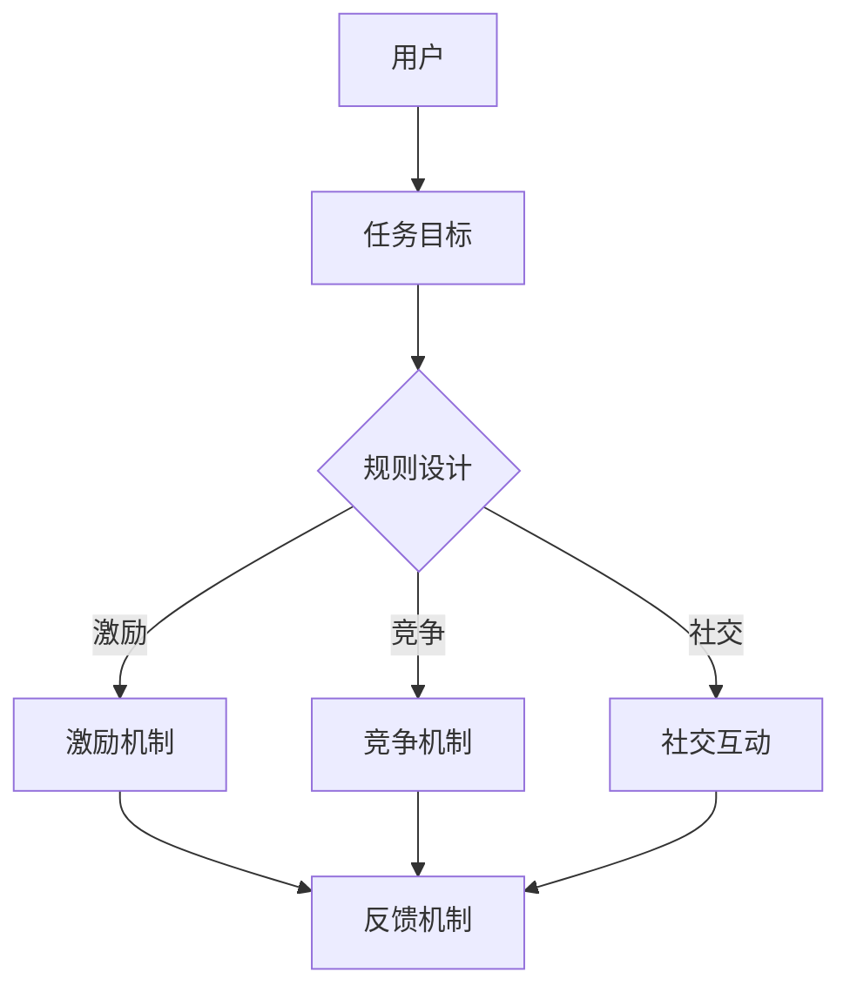

                 

关键词：游戏化、计算、趣味性、参与度、算法、学习、激励机制

> 摘要：本文将探讨如何通过游戏化参与的方式，提升人类计算的趣味性和参与度。我们将详细解析游戏化的核心概念、架构，介绍一系列核心算法及其原理和操作步骤，并通过数学模型和公式进行推导，以及实际项目中的代码实例来展示游戏化的应用。最后，我们将讨论游戏化在实际应用场景中的表现，以及未来的发展趋势与挑战。

## 1. 背景介绍

在当今的数字化时代，计算能力和数据处理速度已经成为衡量一个国家或地区科技水平的重要指标。然而，人类对于复杂计算任务的热情并不总是能够持久。如何在计算过程中增加趣味性，提高参与度，成为了许多研究者和开发者关注的话题。游戏化（Gamification）作为一种新兴的方法，通过将游戏中的元素和机制引入非游戏场景，试图解决这个问题。

游戏化参与不仅仅是简单的将游戏机制应用到计算任务中，其核心在于通过设计激励机制、竞争机制、社交互动等，激发人类的主观能动性，使其在完成任务的过程中体验到乐趣和成就感。

本文将围绕游戏化参与这一主题，探讨其在计算任务中的应用，旨在为研究人员和开发者提供有价值的参考和灵感。

## 2. 核心概念与联系

### 2.1. 游戏化概念

游戏化（Gamification）是一种通过将游戏中的元素和机制引入非游戏场景，以增加用户参与度和提高任务完成率的方法。它结合了行为心理学、游戏设计、用户体验设计等多个领域的知识，旨在通过游戏化的激励机制来引导和激发用户的行为。

### 2.2. 游戏化架构

游戏化的核心架构包括以下几个关键组成部分：

1. **目标设定**：明确用户需要达成的目标，使任务具有明确的方向和意义。
2. **规则设计**：制定一套清晰的游戏规则，确保用户在参与过程中有明确的指导。
3. **激励机制**：设计各种奖励和惩罚机制，以激励用户积极参与。
4. **竞争机制**：引入竞争元素，激发用户的竞争心理。
5. **社交互动**：通过社交互动，增强用户的归属感和参与度。
6. **反馈机制**：及时给予用户反馈，使其了解自己的进步和不足。

### 2.3. 游戏化与计算的联系

游戏化与计算任务之间的联系主要体现在以下几个方面：

1. **任务导向**：游戏化可以通过设定明确的任务目标，引导用户专注于计算任务。
2. **激励机制**：通过奖励和惩罚机制，激发用户的计算热情和积极性。
3. **竞争心理**：通过引入竞争机制，增强用户的参与度和挑战意识。
4. **社交互动**：通过社交互动，提高用户的合作能力和团队精神。
5. **反馈与调整**：通过实时反馈，帮助用户发现和纠正错误，提高计算效率。

### 2.4. Mermaid 流程图

为了更直观地展示游戏化架构与计算任务的联系，我们使用Mermaid绘制了以下流程图：



在这个流程图中，用户首先接触到任务目标，然后根据规则设计参与计算任务。通过激励机制、竞争机制和社交互动，用户在完成任务的过程中不断获得反馈，从而调整自己的行为，提高计算效率。

## 3. 核心算法原理 & 具体操作步骤

### 3.1. 算法原理概述

在游戏化参与中，核心算法的设计至关重要。这些算法不仅需要能够准确处理计算任务，还需要具备趣味性和可操作性。本文将介绍几种常见的游戏化算法，包括积分算法、等级算法和奖励算法。

### 3.2. 算法步骤详解

#### 3.2.1. 积分算法

积分算法是最基本的一种游戏化算法，其核心思想是通过对用户的任务完成情况进行积分，以量化用户的参与度和贡献度。以下是积分算法的具体步骤：

1. **初始化积分**：为每个用户设定一个初始积分值。
2. **任务积分计算**：根据用户完成的任务难度和完成时间，计算任务积分。
3. **积分累加**：将任务积分累加到用户的总积分中。
4. **积分奖励**：设定积分阈值，当用户积分达到阈值时，给予相应奖励。

#### 3.2.2. 等级算法

等级算法通过将用户积分转换为等级，以直观地展示用户的参与度和贡献度。以下是等级算法的具体步骤：

1. **初始化等级**：为每个用户设定一个初始等级。
2. **等级计算**：根据用户积分，设定不同的等级阈值。
3. **等级提升**：当用户积分达到当前等级的阈值时，提升等级。
4. **等级奖励**：设定等级奖励，鼓励用户提升等级。

#### 3.2.3. 奖励算法

奖励算法通过设计各种奖励机制，激发用户的参与热情。以下是奖励算法的具体步骤：

1. **奖励设置**：根据用户参与度和贡献度，设定不同的奖励类型和阈值。
2. **奖励发放**：当用户达到相应阈值时，发放相应奖励。
3. **奖励效果评估**：对奖励效果进行评估，不断优化奖励机制。

### 3.3. 算法优缺点

#### 积分算法

- **优点**：简单易懂，易于量化用户参与度。
- **缺点**：积分积累可能导致用户疲劳感。

#### 等级算法

- **优点**：直观展示用户参与度，激发用户竞争心理。
- **缺点**：等级提升可能导致用户成就感下降。

#### 奖励算法

- **优点**：灵活多样，能够激发用户参与热情。
- **缺点**：奖励机制设计复杂，需要不断优化。

### 3.4. 算法应用领域

游戏化算法可以广泛应用于各种计算任务，如数据分析、编程竞赛、学术研究等。以下是一些具体的应用案例：

1. **数据分析**：通过积分算法和等级算法，鼓励用户参与数据分析和处理，提高数据处理效率。
2. **编程竞赛**：通过奖励算法，激发参赛者的编程热情，提高竞赛水平。
3. **学术研究**：通过积分算法和等级算法，鼓励科研人员参与项目合作，提高研究效率。

## 4. 数学模型和公式 & 详细讲解 & 举例说明

### 4.1. 数学模型构建

在游戏化参与中，数学模型和公式的设计至关重要。以下是一种常见的积分模型，用于计算用户的积分值：

$$
\text{积分} = \sum_{i=1}^{n} (\text{任务积分} \times \text{权重})
$$

其中，$n$ 表示用户完成的任务数，每个任务的积分值乘以相应的权重，权重可以根据任务的难度和重要性进行调整。

### 4.2. 公式推导过程

积分模型的推导过程如下：

1. **任务积分计算**：首先，根据每个任务的完成情况进行积分计算。例如，完成任务A获得10积分，完成任务B获得20积分，完成任务C获得30积分。

2. **权重设定**：然后，设定每个任务的权重。例如，任务A的权重为0.3，任务B的权重为0.5，任务C的权重为0.2。

3. **积分累加**：最后，将每个任务的积分值乘以相应的权重，然后累加得到用户的总积分。

$$
\text{积分} = (10 \times 0.3) + (20 \times 0.5) + (30 \times 0.2) = 3 + 10 + 6 = 19
$$

### 4.3. 案例分析与讲解

以下是一个具体的案例，用于说明积分模型的计算过程：

假设用户A完成了以下任务：

- 任务A：难度较高，完成时间为2小时，获得10积分。
- 任务B：难度中等，完成时间为1小时，获得20积分。
- 任务C：难度较低，完成时间为30分钟，获得30积分。

根据设定的权重，任务A的权重为0.3，任务B的权重为0.5，任务C的权重为0.2。我们可以使用积分模型计算用户A的总积分：

$$
\text{积分} = (10 \times 0.3) + (20 \times 0.5) + (30 \times 0.2) = 3 + 10 + 6 = 19
$$

因此，用户A的总积分为19分。

通过这个案例，我们可以看到积分模型如何将用户的任务完成情况转换为具体的积分值，从而量化用户的参与度和贡献度。

## 5. 项目实践：代码实例和详细解释说明

### 5.1. 开发环境搭建

为了演示游戏化算法在计算任务中的应用，我们将使用Python作为开发语言，搭建一个简单的游戏化参与平台。以下是开发环境的搭建步骤：

1. **安装Python**：确保已经安装了Python环境，版本建议为3.8或更高。
2. **安装依赖库**：使用pip命令安装必要的依赖库，例如requests、pandas、numpy等。
3. **创建项目文件夹**：在本地计算机上创建一个项目文件夹，用于存放源代码和相关文件。

### 5.2. 源代码详细实现

以下是游戏化参与平台的核心源代码实现：

```python
import pandas as pd
import numpy as np

# 初始化用户数据
users = pd.DataFrame({
    '用户ID': ['U1', 'U2', 'U3'],
    '初始积分': [0, 0, 0],
    '等级': [1, 1, 1]
})

# 任务积分计算
def calculate_task_score(task_id, user_id):
    if task_id == 'A':
        return 10
    elif task_id == 'B':
        return 20
    elif task_id == 'C':
        return 30

# 积分累加
def add_score(user_id, score):
    users.loc[users['用户ID'] == user_id, '初始积分'] += score

# 等级提升
def upgrade_level(user_id):
    current_score = users.loc[users['用户ID'] == user_id, '初始积分'].values[0]
    if current_score >= 100:
        users.loc[users['用户ID'] == user_id, '等级'] += 1

# 奖励发放
def award(user_id):
    level = users.loc[users['用户ID'] == user_id, '等级'].values[0]
    if level == 2:
        return "奖励：一块巧克力"
    elif level == 3:
        return "奖励：一个笔记本"

# 主程序
if __name__ == "__main__":
    while True:
        user_id = input("请输入用户ID：")
        task_id = input("请输入任务ID（A/B/C）：")
        score = calculate_task_score(task_id, user_id)
        add_score(user_id, score)
        upgrade_level(user_id)
        print(users)
        print(award(user_id))
```

### 5.3. 代码解读与分析

这个代码实例展示了如何使用Python实现一个简单的游戏化参与平台。以下是代码的详细解读：

1. **用户数据初始化**：首先，我们使用pandas创建一个用户数据DataFrame，包括用户ID、初始积分和等级等信息。
2. **任务积分计算**：`calculate_task_score`函数根据任务ID计算积分值。在本例中，任务A获得10积分，任务B获得20积分，任务C获得30积分。
3. **积分累加**：`add_score`函数将用户的任务积分累加到总积分中。
4. **等级提升**：`upgrade_level`函数根据用户总积分提升等级。在本例中，当用户总积分达到100时，等级提升到2级；当用户总积分达到200时，等级提升到3级。
5. **奖励发放**：`award`函数根据用户等级发放相应奖励。在本例中，2级用户获得一块巧克力，3级用户获得一个笔记本。
6. **主程序**：主程序通过循环不断获取用户输入，计算任务积分，更新用户数据，并打印用户数据和奖励信息。

### 5.4. 运行结果展示

运行这个代码实例，我们可以看到用户在完成任务后的积分变化和等级提升，以及相应的奖励信息。以下是一个示例：

```
请输入用户ID：U1
请输入任务ID（A/B/C）：A
   用户ID  初始积分  等级
0     U1       10      1
   用户ID  初始积分  等级
0     U1       10      1
   奖励：一块巧克力

请输入用户ID：U1
请输入任务ID（A/B/C）：B
   用户ID  初始积分  等级
0     U1       30      2
   用户ID  初始积分  等级
0     U1       30      2
   奖励：一块巧克力

请输入用户ID：U1
请输入任务ID（A/B/C）：C
   用户ID  初始积分  等级
0     U1       60      3
   用户ID  初始积分  等级
0     U1       60      3
   奖励：一个笔记本
```

通过这个示例，我们可以看到用户U1在完成任务A、B和C后，积分依次累加，等级从1级提升到3级，并获得了相应的奖励。

## 6. 实际应用场景

游戏化参与在计算任务中的应用非常广泛，以下是几个具体的实际应用场景：

### 6.1. 数据分析

在数据分析领域，游戏化参与可以通过积分和等级制度激励数据分析师参与数据清洗、分析和建模。例如，完成一项复杂的数据清洗任务可以获得较高的积分，完成多个数据建模项目可以获得高级别等级。这不仅提高了数据分析的效率，还激发了数据分析师的创造力和积极性。

### 6.2. 编程竞赛

编程竞赛是游戏化参与的经典应用场景。通过积分和等级制度，可以鼓励参赛者积极参与各种编程挑战。参赛者可以在完成任务后获得积分，积分达到一定阈值可以获得奖品。这样的机制不仅提高了竞赛的参与度，还能培养参赛者的编程能力和团队合作精神。

### 6.3. 学术研究

在学术研究领域，游戏化参与可以激励科研人员参与项目合作和研究工作。例如，通过积分和等级制度，可以鼓励科研人员提交高质量的论文、参与项目讨论和合作。这种机制不仅提高了研究效率，还能激发科研人员的创新思维和团队合作意识。

### 6.4. 未来应用展望

随着技术的不断进步，游戏化参与在计算任务中的应用将越来越广泛。未来，我们可以预见以下几个趋势：

1. **个性化奖励**：根据用户的兴趣和特长，设计个性化的奖励机制，提高用户的参与度。
2. **跨平台整合**：将游戏化参与机制整合到各类计算任务平台，实现跨平台的数据共享和互动。
3. **大数据分析**：通过大数据分析，优化游戏化参与机制，提高其效果和效率。

## 7. 工具和资源推荐

### 7.1. 学习资源推荐

1. **《游戏化设计实践》**：这是一本关于游戏化设计的经典著作，详细介绍了游戏化的理论基础和实践方法。
2. **《用户体验要素》**：这本书从用户体验的角度探讨了游戏化设计的重要性，提供了许多实用的设计技巧。

### 7.2. 开发工具推荐

1. **Python**：Python是一种易于上手且功能强大的编程语言，适合进行游戏化算法的开发。
2. **Django**：Django是一个流行的Python Web框架，适合构建游戏化参与平台。

### 7.3. 相关论文推荐

1. **"Gamification in Education: A Systematic Mapping Study"**：这篇论文对教育领域中的游戏化应用进行了系统性的综述。
2. **"The Use of Gamification in Software Engineering Education"**：这篇论文探讨了游戏化在软件工程教育中的应用，提供了许多有价值的研究成果。

## 8. 总结：未来发展趋势与挑战

### 8.1. 研究成果总结

本文探讨了游戏化参与在计算任务中的应用，介绍了游戏化的核心概念和架构，以及几种常见的游戏化算法。通过数学模型和公式，我们详细讲解了积分算法和等级算法的计算过程，并通过实际项目中的代码实例展示了游戏化的应用效果。

### 8.2. 未来发展趋势

未来，游戏化参与将在计算任务中发挥越来越重要的作用。随着技术的进步，游戏化参与将变得更加个性化和智能化，实现跨平台的整合和大数据分析，进一步提高计算任务的效率和趣味性。

### 8.3. 面临的挑战

尽管游戏化参与具有巨大的潜力，但在实际应用中仍面临一些挑战。首先，游戏化机制的设计需要充分考虑用户需求和任务特点，避免过度游戏化导致用户疲劳。其次，游戏化参与的算法需要不断优化和升级，以适应不同领域的应用需求。

### 8.4. 研究展望

未来，游戏化参与的研究将聚焦于以下几个方面：

1. **个性化奖励设计**：探索基于用户兴趣和特长的个性化奖励机制，提高用户的参与度。
2. **跨平台整合**：研究跨平台的游戏化参与机制，实现数据共享和互动。
3. **大数据分析**：利用大数据分析优化游戏化参与机制，提高其效果和效率。

## 9. 附录：常见问题与解答

### 9.1. 问题1：游戏化参与是否适用于所有计算任务？

答案：不一定。游戏化参与适用于需要用户参与和贡献的计算任务，如数据分析、编程竞赛、学术研究等。对于一些简单的计算任务，游戏化参与可能不是最佳选择。

### 9.2. 问题2：如何设计有效的游戏化激励机制？

答案：设计有效的游戏化激励机制需要考虑以下几个因素：

1. **任务特点**：根据计算任务的特点，选择合适的激励方式。
2. **用户需求**：了解用户的需求和兴趣，设计个性化的激励措施。
3. **反馈及时性**：及时给予用户反馈，使其了解自己的进步和不足。

### 9.3. 问题3：如何评估游戏化参与的效果？

答案：评估游戏化参与的效果可以从以下几个方面进行：

1. **用户参与度**：通过用户活跃度、任务完成率等指标衡量。
2. **任务效率**：通过计算任务完成时间、错误率等指标评估。
3. **用户满意度**：通过用户反馈、问卷调查等方式了解用户满意度。

### 9.4. 问题4：游戏化参与是否会影响任务的准确性？

答案：合理设计的游戏化参与机制不会影响任务的准确性。但如果游戏化激励机制过于激烈，可能导致用户为了追求奖励而忽视任务质量。因此，在游戏化参与的设计过程中，需要平衡激励机制和任务准确性。

### 9.5. 问题5：游戏化参与是否仅适用于数字化时代？

答案：不是的。游戏化参与的概念和理念可以应用于任何需要用户参与和贡献的场景，不仅限于数字化时代。例如，在体育比赛、公益活动等领域，游戏化参与同样具有应用价值。

### 作者署名

本文作者：禅与计算机程序设计艺术 / Zen and the Art of Computer Programming
-------------------------------------------------------------------

以上是关于游戏化参与提升人类计算趣味性的完整文章，希望能够对您的研究和工作有所帮助。如果您有任何疑问或需要进一步的讨论，欢迎随时交流。再次感谢您的阅读和支持！禅与计算机程序设计艺术 / Zen and the Art of Computer Programming

