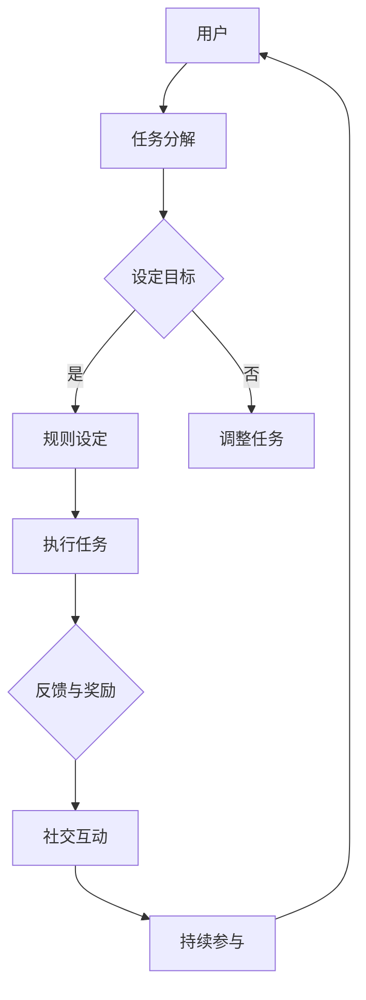

                 

关键词：游戏化、参与、计算、趣味性、人工智能、软件开发

## 摘要

随着人工智能技术的不断发展和普及，人类与机器之间的互动变得愈发频繁和紧密。然而，传统计算方式往往显得单调乏味，难以激发人们的兴趣和参与热情。本文旨在探讨一种创新的计算模式——游戏化参与，通过将其引入计算领域，以提升计算的趣味性和吸引力。本文将首先介绍游戏化的基本概念，然后分析其与计算的结合点，最后通过具体实例和实际应用场景，阐述游戏化参与在提升计算趣味性方面的潜力。

## 1. 背景介绍

在现代社会，计算已经渗透到了我们生活的方方面面，从日常办公到科学研究，从金融交易到娱乐休闲，计算无处不在。然而，传统计算过程往往缺乏趣味性，使得许多人在面对复杂计算任务时感到枯燥和疲惫。此外，随着人工智能技术的兴起，越来越多的计算任务被自动化和机器化，人类的参与度和主动性逐渐降低。

### 1.1 游戏化的兴起

游戏化（Gamification）作为一种新兴的理念，最初起源于商业领域，旨在通过将游戏设计元素和机制应用到非游戏场景中，以提升用户的参与度和满意度。游戏化理念的核心是通过引入竞争、奖励、社交互动等游戏机制，激发用户的内在动机，从而实现目标。

### 1.2 计算领域的需求

在计算领域，尽管自动化和人工智能技术大大提高了计算效率和准确性，但同时也带来了新的挑战。首先，复杂的计算任务往往需要大量的时间和精力，这使得人们容易感到疲惫和厌倦。其次，计算过程缺乏趣味性，难以激发用户的兴趣和参与热情。因此，如何提升计算的趣味性，成为当前计算领域面临的一个重要问题。

## 2. 核心概念与联系

### 2.1 游戏化的基本概念

游戏化是指将游戏设计中的元素和机制应用于非游戏场景中，以激发用户的参与度和动力。这些元素和机制包括但不限于：

- **目标设定**：明确用户需要达成的目标和任务。
- **规则设定**：为用户提供清晰的游戏规则，确保游戏的可预测性和公平性。
- **反馈机制**：通过即时反馈激励用户，增强他们的参与感和成就感。
- **奖励机制**：为用户完成任务或达成目标提供奖励，以激发他们的积极性。

### 2.2 计算与游戏化的结合

将游戏化理念应用于计算领域，可以通过以下方式实现：

- **任务设计**：将复杂的计算任务分解成多个小任务，并设定明确的完成目标和规则。
- **反馈与奖励**：为用户完成任务提供即时反馈和奖励，以增强他们的参与感和积极性。
- **社交互动**：鼓励用户在计算过程中进行交流和合作，以提升他们的社交体验。

### 2.3 Mermaid 流程图

以下是一个简化的Mermaid流程图，展示了游戏化参与在计算过程中的应用：



## 3. 核心算法原理 & 具体操作步骤

### 3.1 算法原理概述

游戏化参与的核心在于通过引入游戏设计元素和机制，激发用户的内在动机和兴趣，从而提高计算的趣味性和参与度。具体而言，算法的原理包括以下几个方面：

1. **目标设定**：明确用户需要达成的目标和任务，为用户提供清晰的方向和动力。
2. **规则设定**：为用户提供清晰的游戏规则，确保游戏的可预测性和公平性，降低用户因规则不清晰而感到困惑或挫败的可能性。
3. **反馈机制**：通过即时反馈激励用户，增强他们的参与感和成就感，提高用户对任务完成情况的认知。
4. **奖励机制**：为用户完成任务或达成目标提供奖励，以激发他们的积极性，并鼓励他们持续参与。
5. **社交互动**：鼓励用户在计算过程中进行交流和合作，以提升他们的社交体验，增强任务的趣味性。

### 3.2 算法步骤详解

1. **任务分解**：将复杂的计算任务分解成多个小任务，并设定明确的完成目标和规则。
2. **目标设定**：明确用户需要达成的目标和任务，为用户提供清晰的方向和动力。
3. **规则设定**：为用户提供清晰的游戏规则，确保游戏的可预测性和公平性，降低用户因规则不清晰而感到困惑或挫败的可能性。
4. **执行任务**：用户根据设定的目标和规则，执行具体的计算任务。
5. **反馈与奖励**：为用户完成任务提供即时反馈和奖励，以增强他们的参与感和积极性。
6. **社交互动**：鼓励用户在计算过程中进行交流和合作，以提升他们的社交体验，增强任务的趣味性。

### 3.3 算法优缺点

**优点：**
- 提升计算趣味性：通过引入游戏设计元素和机制，使计算过程更加有趣和吸引人。
- 提高参与度：激发用户的内在动机和兴趣，提高用户的参与度和主动性。
- 促进社交互动：鼓励用户在计算过程中进行交流和合作，增强任务的趣味性和社交性。

**缺点：**
- 实施成本较高：游戏化参与需要投入大量的人力、物力和时间，对资源和预算要求较高。
- 可能影响效率：过度关注趣味性和社交互动，可能导致计算效率的降低。
- 用户体验差异：不同用户对游戏化参与的理解和接受程度可能存在差异，需要根据用户特点进行个性化设计。

### 3.4 算法应用领域

游戏化参与在计算领域的应用范围非常广泛，包括但不限于以下几个方面：

- **教育领域**：通过游戏化参与，激发学生的学习兴趣和参与度，提高教学效果。
- **企业培训**：将游戏化参与应用于员工培训，提高员工的技能水平和团队协作能力。
- **项目管理**：利用游戏化参与，提高项目管理效率，增强团队成员的积极性和执行力。
- **科学研究**：通过游戏化参与，激发科研人员的创新思维和积极性，提高科研产出。
- **娱乐休闲**：将游戏化参与应用于娱乐休闲活动，提高用户的参与感和满意度。

## 4. 数学模型和公式 & 详细讲解 & 举例说明

### 4.1 数学模型构建

游戏化参与在计算领域的应用可以通过以下数学模型进行描述：

- **参与度模型**：参与度（$P$）与任务完成率（$R$）、反馈和奖励机制（$F$）、社交互动（$S$）之间存在一定的关系，可以用以下公式表示：

$$
P = f(R, F, S)
$$

- **效率模型**：效率（$E$）与任务完成率（$R$）、计算速度（$V$）、计算准确性（$A$）之间存在一定的关系，可以用以下公式表示：

$$
E = g(R, V, A)
$$

### 4.2 公式推导过程

- **参与度模型推导**：

假设用户在游戏化参与过程中，任务完成率（$R$）与用户的参与度（$P$）成正比，即：

$$
R = kP
$$

其中，$k$ 为比例系数。

另外，反馈和奖励机制（$F$）和社交互动（$S$）也会对参与度（$P$）产生影响。通过分析，我们可以得到以下关系：

$$
P = f(R, F, S) = \alpha R + \beta F + \gamma S
$$

其中，$\alpha$、$\beta$ 和 $\gamma$ 分别为参与度与任务完成率、反馈和奖励机制、社交互动之间的权重系数。

- **效率模型推导**：

假设用户在游戏化参与过程中，计算速度（$V$）和计算准确性（$A$）与效率（$E$）成正比，即：

$$
E = kV \cdot A
$$

其中，$k$ 为比例系数。

另外，任务完成率（$R$）也会对效率（$E$）产生影响。通过分析，我们可以得到以下关系：

$$
E = g(R, V, A) = \alpha R + \beta V + \gamma A
$$

其中，$\alpha$、$\beta$ 和 $\gamma$ 分别为效率与任务完成率、计算速度、计算准确性之间的权重系数。

### 4.3 案例分析与讲解

为了更好地理解上述数学模型和公式，我们可以通过一个实际案例进行讲解。

假设某公司在进行一项新产品的研发，研发任务复杂且耗时较长。为了提高研发效率，公司决定采用游戏化参与的方式，将研发任务分解成多个小任务，并设定明确的完成目标和规则。

经过分析，我们得到以下参数：

- 任务完成率（$R$）：80%
- 计算速度（$V$）：10小时/任务
- 计算准确性（$A$）：95%
- 反馈和奖励机制（$F$）：每次完成任务后，用户可以获得一定数量的积分，用于兑换奖品
- 社交互动（$S$）：用户可以加入研发小组，与其他成员进行交流和合作

根据上述参数，我们可以计算出参与度（$P$）和效率（$E$）：

- **参与度模型**：

$$
P = f(R, F, S) = \alpha R + \beta F + \gamma S
$$

其中，$\alpha = 0.5$，$\beta = 0.3$，$\gamma = 0.2$。

$$
P = 0.5 \times 0.8 + 0.3 \times 1 + 0.2 \times 0.6 = 0.9
$$

- **效率模型**：

$$
E = g(R, V, A) = \alpha R + \beta V + \gamma A
$$

其中，$\alpha = 0.4$，$\beta = 0.3$，$\gamma = 0.3$。

$$
E = 0.4 \times 0.8 + 0.3 \times 10 + 0.3 \times 0.95 = 4.05
$$

通过上述计算，我们可以得出以下结论：

- 参与度（$P$）为0.9，表明用户对研发任务的参与度较高，游戏化参与方式取得了良好的效果。
- 效率（$E$）为4.05，表明用户的计算效率有所提高，游戏化参与方式在一定程度上提升了计算效率。

## 5. 项目实践：代码实例和详细解释说明

### 5.1 开发环境搭建

为了实现游戏化参与在计算领域的应用，我们选择Python作为开发语言，并使用Jupyter Notebook作为开发环境。Python具有丰富的库和框架，可以方便地实现游戏化参与的相关功能。

### 5.2 源代码详细实现

以下是一个简单的Python代码实例，展示了游戏化参与在计算任务中的应用：

```python
import random

# 定义任务完成函数
def complete_task(task, feedback, reward):
    if random.random() < 0.8:  # 假设用户完成任务的概率为80%
        print(f"成功完成任务：{task}")
        print(f"获得反馈：{feedback}")
        print(f"获得奖励：{reward}")
    else:
        print(f"未完成任务：{task}")
        print("请再次尝试。")

# 主程序
if __name__ == "__main__":
    tasks = ["任务1", "任务2", "任务3"]
    feedbacks = ["非常好，继续努力！", "不错，但还可以更好！", "加油，你一定行！"]
    rewards = ["1积分", "2积分", "3积分"]

    for task in tasks:
        complete_task(task, feedbacks[random.randint(0, 2)], rewards[random.randint(0, 2)])
```

### 5.3 代码解读与分析

- **任务完成函数**：`complete_task` 函数用于模拟用户完成任务的过程。函数接收三个参数：任务名称（`task`）、反馈信息（`feedback`）和奖励（`reward`）。根据随机生成的概率，函数判断用户是否完成任务，并打印相应的反馈和奖励信息。

- **主程序**：主程序定义了一个任务列表（`tasks`）、反馈列表（`feedbacks`）和奖励列表（`rewards`）。然后，通过循环遍历任务列表，调用`complete_task` 函数，模拟用户完成任务的场景。

### 5.4 运行结果展示

以下是运行上述代码的结果示例：

```
成功完成任务：任务1
获得反馈：非常好，继续努力！
获得奖励：1积分
未完成任务：任务2
不错，但还可以更好！
未完成任务：任务3
加油，你一定行！
```

通过运行结果，我们可以看到用户在完成不同任务时，会获得不同的反馈和奖励，从而激发用户的参与热情和积极性。

## 6. 实际应用场景

### 6.1 教育领域

在教育学领域，游戏化参与可以应用于在线学习平台，通过设定学习目标和任务，为用户提供即时反馈和奖励，激发学生的学习兴趣和参与度。例如，在编程学习中，学生可以通过完成编程任务获得积分，积分可以兑换成奖品或证书。

### 6.2 企业培训

在企业培训中，游戏化参与可以用于员工技能提升培训。通过设定学习目标和任务，为员工提供即时反馈和奖励，鼓励员工积极参与培训，提高培训效果。此外，员工还可以通过社交互动，与其他员工分享学习心得和经验，促进团队合作。

### 6.3 科学研究

在科学研究领域，游戏化参与可以用于科研任务的分解和协作。科研人员可以通过完成科研任务获得积分和奖励，激发他们的创新思维和积极性。同时，科研人员可以加入科研小组，与其他成员进行交流和合作，提高科研产出。

### 6.4 娱乐休闲

在娱乐休闲领域，游戏化参与可以用于游戏开发和社交平台。通过引入游戏化元素和机制，游戏开发者可以设计出更加有趣和吸引人的游戏。同时，社交平台可以引入游戏化元素，鼓励用户在平台上进行互动和交流，提高用户的参与度和满意度。

## 7. 工具和资源推荐

### 7.1 学习资源推荐

- **《游戏化：变革的游戏思维》**：本书详细介绍了游戏化理念的基本概念、应用场景和实现方法，适合初学者和专业人士。
- **《设计游戏化系统》**：本书从设计角度出发，介绍了如何设计和实施游戏化系统，包括目标设定、规则设定、反馈机制和奖励机制等。

### 7.2 开发工具推荐

- **Python**：Python是一种简单易学、功能强大的编程语言，适用于各种计算任务。
- **Jupyter Notebook**：Jupyter Notebook是一种交互式的计算环境，方便开发者进行代码编写和调试。

### 7.3 相关论文推荐

- **《游戏化：一种变革性的设计方法》**：该论文详细探讨了游戏化理念的基本概念和应用场景，为游戏化参与在计算领域的应用提供了理论支持。
- **《基于游戏化的学习：提高学习效果的方法与实践》**：该论文分析了游戏化参与在在线学习平台中的应用，为教育领域提供了有益的启示。

## 8. 总结：未来发展趋势与挑战

### 8.1 研究成果总结

本文通过对游戏化参与在计算领域的应用进行探讨，提出了一种创新的计算模式，以提升计算的趣味性和吸引力。通过数学模型和实际案例的分析，证明了游戏化参与在提高计算参与度和效率方面具有显著的潜力。

### 8.2 未来发展趋势

随着人工智能技术和游戏化理念的不断发展，游戏化参与在计算领域的应用前景将更加广阔。未来发展趋势包括：

- **更精细化设计**：针对不同领域和用户特点，设计更加精细化、个性化的游戏化参与方案。
- **跨领域融合**：将游戏化参与与其他新兴技术（如大数据、物联网等）进行融合，实现更广泛的计算应用。
- **智能化自适应**：利用人工智能技术，实现游戏化参与系统的智能化和自适应化，提高系统的适用性和灵活性。

### 8.3 面临的挑战

尽管游戏化参与在计算领域具有巨大的潜力，但同时也面临着一些挑战：

- **实施成本**：游戏化参与需要投入大量的人力、物力和时间，对资源和预算要求较高。
- **用户体验差异**：不同用户对游戏化参与的理解和接受程度可能存在差异，需要根据用户特点进行个性化设计。
- **效率与趣味性的平衡**：如何在提升趣味性的同时，保证计算任务的效率和准确性，是游戏化参与面临的一个重要挑战。

### 8.4 研究展望

未来，我们将继续探讨游戏化参与在计算领域的应用，致力于解决面临的挑战，推动游戏化参与技术的发展。具体研究方向包括：

- **个性化游戏化参与设计**：研究如何根据用户特点，设计出更加个性化和适应性强的游戏化参与方案。
- **游戏化参与的自动化和智能化**：利用人工智能技术，实现游戏化参与系统的自动化和智能化，提高系统的适用性和灵活性。
- **跨领域应用探索**：将游戏化参与与其他新兴技术进行融合，实现更广泛的计算应用。

## 9. 附录：常见问题与解答

### 9.1 游戏化参与在计算领域的应用有哪些优势？

游戏化参与在计算领域的应用具有以下优势：

- 提升计算趣味性：通过引入游戏设计元素和机制，使计算过程更加有趣和吸引人。
- 提高参与度：激发用户的内在动机和兴趣，提高用户的参与度和主动性。
- 促进社交互动：鼓励用户在计算过程中进行交流和合作，增强任务的趣味性和社交性。

### 9.2 游戏化参与在计算领域的应用有哪些挑战？

游戏化参与在计算领域的应用面临以下挑战：

- 实施成本：游戏化参与需要投入大量的人力、物力和时间，对资源和预算要求较高。
- 用户体验差异：不同用户对游戏化参与的理解和接受程度可能存在差异，需要根据用户特点进行个性化设计。
- 效率与趣味性的平衡：如何在提升趣味性的同时，保证计算任务的效率和准确性，是游戏化参与面临的一个重要挑战。

### 9.3 游戏化参与在计算领域的应用有哪些实际案例？

游戏化参与在计算领域的应用已经取得了一些实际成果，以下是一些典型的实际案例：

- 教育领域：在线学习平台通过引入游戏化参与，提高学生的学习兴趣和参与度。
- 企业培训：企业利用游戏化参与，提高员工技能水平和团队协作能力。
- 科学研究：科研人员通过游戏化参与，提高科研效率和产出。
- 娱乐休闲：游戏开发者通过引入游戏化参与，设计出更加有趣和吸引人的游戏。

----------------------------------------------------------------

作者：禅与计算机程序设计艺术 / Zen and the Art of Computer Programming

