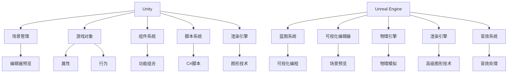

                 

 **关键词**：游戏开发，Unity，Unreal Engine，框架比较，技术细节，使用场景，优缺点分析。

**摘要**：本文将对Unity和Unreal Engine这两大主流游戏开发框架进行深入比较。我们将从背景介绍、核心概念与联系、核心算法原理、数学模型和公式、项目实践、实际应用场景、工具和资源推荐以及总结未来发展趋势与挑战等多个方面，分析这两个框架在游戏开发中的表现。

## 1. 背景介绍

Unity和Unreal Engine是目前最为流行的游戏开发框架之一，各自拥有庞大的用户群体和丰富的生态系统。Unity自2005年发布以来，以其易用性和开源特性成为初学者和中小型游戏开发团队的首选。而Unreal Engine则凭借其强大的视觉效果和物理引擎，吸引了大量大型游戏开发商和影视制作公司的关注。

Unity由Unity Technologies开发，采用C#编程语言，支持跨平台开发，广泛应用于移动设备、PC、主机和网页等平台。而Unreal Engine由Epic Games开发，使用C++编程语言，以其出色的图形渲染能力而闻名，主要用于大型游戏和高要求的项目。

## 2. 核心概念与联系

为了更好地理解这两个框架，我们需要从核心概念和架构上进行分析。以下是Unity和Unreal Engine的基本架构及其核心概念：

### 2.1 Unity

Unity的基本架构包括以下几个核心部分：

- **场景管理**：Unity通过场景管理器（Scene Manager）来组织和管理游戏场景。开发者可以在编辑器中预览和编辑场景，并将它们组合成游戏项目。
- **游戏对象**：游戏对象是Unity的基本构建块，包括物体、角色、UI元素等。每个游戏对象都拥有属性和行为。
- **组件系统**：Unity使用组件（Components）来描述游戏对象的行为。组件可以自由组合，使得游戏对象具有丰富的功能。
- **脚本系统**：Unity使用C#语言编写脚本，控制游戏对象的逻辑和行为。脚本可以附加到游戏对象上，或者独立存在。
- **渲染引擎**：Unity内置了强大的渲染引擎，支持各种图形技术，包括实时渲染、光线追踪和后处理效果。

### 2.2 Unreal Engine

Unreal Engine的基本架构包括以下几个核心部分：

- **蓝图系统**：Unreal Engine使用蓝图（Blueprints）来构建游戏逻辑，无需编写代码。蓝图是一种可视化编程工具，可以通过拖放节点来构建复杂的逻辑。
- **可视化编辑器**：Unreal Engine提供了一个高度可视化的编辑器，开发者可以在编辑器中直接预览和编辑场景、角色和动画等。
- **物理引擎**：Unreal Engine内置了强大的物理引擎，支持各种物理模拟，如碰撞检测、重力模拟和物理交互等。
- **渲染引擎**：Unreal Engine使用其专有的Unreal Engine渲染引擎，支持高级图形技术，如光线追踪、全局照明和阴影等。
- **音效系统**：Unreal Engine提供了强大的音效系统，支持环境音效、角色音效和声音效果等。

### 2.3 Mermaid 流程图

为了更直观地展示Unity和Unreal Engine的核心概念和架构，我们可以使用Mermaid流程图来绘制它们的基本结构。



通过上述流程图，我们可以清晰地看到Unity和Unreal Engine的核心概念和架构。

## 3. 核心算法原理 & 具体操作步骤

### 3.1 算法原理概述

Unity和Unreal Engine在游戏开发中应用了多种核心算法，以下分别进行概述。

#### Unity

Unity的核心算法包括：

- **碰撞检测**：用于检测游戏对象之间的交互。
- **物理引擎**：用于模拟现实世界的物理效果，如重力、碰撞和运动等。
- **渲染引擎**：用于渲染场景中的物体和效果。

#### Unreal Engine

Unreal Engine的核心算法包括：

- **光线追踪**：用于实现高级的图形效果，如真实感阴影和反射。
- **物理引擎**：用于模拟复杂的物理现象，如流体和软体物理。
- **动画系统**：用于创建和播放复杂的动画。

### 3.2 算法步骤详解

#### Unity

1. **碰撞检测**：
   - **步骤1**：创建碰撞器（Collider）。
   - **步骤2**：设置碰撞器的类型（如球体、盒体等）。
   - **步骤3**：在脚本中检测碰撞事件。

2. **物理引擎**：
   - **步骤1**：创建物理对象（Rigidbody）。
   - **步骤2**：设置物理对象的属性（如质量、摩擦力等）。
   - **步骤3**：应用力（Force）或扭矩（Torque）。

3. **渲染引擎**：
   - **步骤1**：创建材质（Material）和纹理（Texture）。
   - **步骤2**：设置渲染器的属性（如颜色、光照等）。
   - **步骤3**：调用渲染器渲染场景。

#### Unreal Engine

1. **光线追踪**：
   - **步骤1**：配置光线追踪设置。
   - **步骤2**：创建光线追踪节点。
   - **步骤3**：设置光线追踪的目标（如物体、光线等）。

2. **物理引擎**：
   - **步骤1**：创建物理对象。
   - **步骤2**：设置物理对象的属性。
   - **步骤3**：应用物理力或约束。

3. **动画系统**：
   - **步骤1**：创建动画蓝图。
   - **步骤2**：设置动画参数。
   - **步骤3**：播放动画。

### 3.3 算法优缺点

#### Unity

- **优点**：
  - **易用性**：Unity的界面和编程语言易于上手，适合初学者和中小型团队。
  - **跨平台**：支持多种平台，如移动设备、PC、主机等。
  - **开源**：具有丰富的插件和资源，可自由扩展。

- **缺点**：
  - **性能**：相较于Unreal Engine，Unity在图形渲染和物理模拟方面可能存在性能瓶颈。
  - **学习曲线**：虽然易于上手，但涉及复杂场景和高级功能时，学习曲线可能较陡。

#### Unreal Engine

- **优点**：
  - **图形渲染**：强大的渲染引擎，支持高级图形技术，如光线追踪和全局照明。
  - **物理引擎**：强大的物理模拟能力，适用于复杂场景。
  - **可视化编程**：蓝图系统，无需编写代码，便于快速迭代。

- **缺点**：
  - **资源消耗**：较大的资源消耗，对硬件要求较高。
  - **学习成本**：相较于Unity，Unreal Engine的学习成本较高。

### 3.4 算法应用领域

#### Unity

- **应用领域**：适用于初学者、中小型游戏开发团队、教育和学术研究。

#### Unreal Engine

- **应用领域**：适用于大型游戏开发商、影视制作公司、高端游戏开发。

## 4. 数学模型和公式 & 详细讲解 & 举例说明

### 4.1 数学模型构建

在游戏开发中，数学模型和公式被广泛应用于物理模拟、图形渲染、音效处理等领域。以下是一些常见的数学模型和公式：

#### 物理模拟

- **碰撞检测**：
  - **公式**：`d = |p2 - p1|`，其中`d`为两点之间的距离，`p1`和`p2`为两点的坐标。
  - **计算**：通过计算两点之间的距离，判断是否发生碰撞。

- **物理引擎**：
  - **公式**：`F = m * a`，其中`F`为力，`m`为质量，`a`为加速度。
  - **计算**：通过给物体施加力，计算物体的加速度。

#### 图形渲染

- **光线追踪**：
  - **公式**：`R = L + D * N`，其中`R`为反射光线，`L`为入射光线，`D`为入射光线的方向，`N`为法线方向。
  - **计算**：通过计算反射光线，实现真实感阴影和反射效果。

- **动画系统**：
  - **公式**：`T = t * v`，其中`T`为位置，`t`为时间，`v`为速度。
  - **计算**：通过计算物体在时间`t`的位置，实现动画效果。

### 4.2 公式推导过程

#### 碰撞检测

碰撞检测的目的是判断两个物体是否发生碰撞。假设有两个物体`A`和`B`，其中心点坐标分别为`p1`和`p2`，半径分别为`r1`和`r2`。

- **步骤1**：计算两点之间的距离`d`：
  ```latex
  d = |p2 - p1|
  ```

- **步骤2**：判断是否发生碰撞：
  ```latex
  if (d <= r1 + r2) {
    // 碰撞发生
  } else {
    // 碰撞未发生
  }
  ```

#### 物理引擎

物理引擎的目的是模拟物体的运动和碰撞。假设有一个物体，其质量为`m`，受到的力为`F`，加速度为`a`。

- **步骤1**：计算加速度`a`：
  ```latex
  a = F / m
  ```

- **步骤2**：计算速度`v`：
  ```latex
  v = v0 + a * t
  ```

- **步骤3**：计算位置`T`：
  ```latex
  T = T0 + v * t
  ```

### 4.3 案例分析与讲解

#### 碰撞检测案例

假设有一个球体，质量为`m`，半径为`r`，受到一个力`F`，需要判断是否与地面发生碰撞。

- **步骤1**：设置球体的属性：
  ```csharp
  public float mass = 1.0f;
  public float radius = 0.5f;
  public Vector3 force = new Vector3(0.0f, 0.0f, 1.0f);
  ```

- **步骤2**：计算球体与地面的距离`d`：
  ```csharp
  float d = Vector3.Distance(force, Vector3.zero);
  ```

- **步骤3**：判断是否发生碰撞：
  ```csharp
  if (d <= radius) {
    // 碰撞发生，处理碰撞效果
  } else {
    // 碰撞未发生，继续计算
  }
  ```

#### 物理引擎案例

假设有一个滑块，质量为`m`，受到重力作用，需要计算其下落过程中的速度和位置。

- **步骤1**：设置滑块的属性：
  ```csharp
  public float mass = 1.0f;
  public Vector3 position = new Vector3(0.0f, 10.0f, 0.0f);
  public Vector3 velocity = new Vector3(0.0f, 0.0f, 0.0f);
  ```

- **步骤2**：计算加速度`a`：
  ```csharp
  float a = Physics.gravity.magnitude / mass;
  ```

- **步骤3**：计算速度`v`：
  ```csharp
  velocity.y += a * Time.deltaTime;
  ```

- **步骤4**：计算位置`T`：
  ```csharp
  position += velocity * Time.deltaTime;
  ```

通过以上案例，我们可以看到数学模型和公式在游戏开发中的应用和计算过程。

## 5. 项目实践：代码实例和详细解释说明

### 5.1 开发环境搭建

为了进行Unity和Unreal Engine的项目实践，我们需要搭建相应的开发环境。

#### Unity开发环境搭建

1. **下载Unity Hub**：从Unity官网下载Unity Hub。
2. **安装Unity**：通过Unity Hub安装Unity编辑器。
3. **创建新项目**：在Unity Hub中创建一个新的Unity项目。

#### Unreal Engine开发环境搭建

1. **下载Epic Games Launcher**：从Epic Games官网下载Epic Games Launcher。
2. **安装Unreal Engine**：通过Epic Games Launcher安装Unreal Engine编辑器。
3. **创建新项目**：在Epic Games Launcher中创建一个新的Unreal Engine项目。

### 5.2 源代码详细实现

#### Unity项目实现

1. **创建球体**：
   - **步骤1**：在Unity编辑器中创建一个球体。
   - **步骤2**：设置球体的质量和半径。

2. **编写碰撞检测脚本**：
   - **步骤1**：在Unity编辑器中创建一个C#脚本。
   - **步骤2**：编写碰撞检测逻辑。

```csharp
using UnityEngine;

public class BallController : MonoBehaviour {
    public float mass = 1.0f;
    public float radius = 0.5f;
    public Vector3 force = new Vector3(0.0f, 0.0f, 1.0f);

    private void OnCollisionEnter(Collision collision) {
        float d = Vector3.Distance(force, Vector3.zero);
        if (d <= radius) {
            // 碰撞发生，处理碰撞效果
        } else {
            // 碰撞未发生，继续计算
        }
    }
}
```

3. **运行项目**：
   - **步骤1**：在Unity编辑器中运行项目。
   - **步骤2**：观察球体与地面的碰撞效果。

#### Unreal Engine项目实现

1. **创建球体**：
   - **步骤1**：在Unreal Engine编辑器中创建一个球体。
   - **步骤2**：设置球体的质量和半径。

2. **编写碰撞检测蓝图**：
   - **步骤1**：在Unreal Engine编辑器中创建一个蓝图。
   - **步骤2**：编写碰撞检测逻辑。

```blueprint
class ABallController : NativeActor {
    property float Mass = 1.0f;
    property float Radius = 0.5f;
    property Vector3 Force = Vector(0.0f, 0.0f, 1.0f);

    event OnComponentAdded();
    event OnCollision();

    function OnComponentAdded() {
        Force = Vector(0.0f, 0.0f, 1.0f);
    }

    function OnCollision(Collision Collision) {
        float d = Vector3.Distance(Collision.Position, Vector3.Zero);
        if (d <= Radius) {
            // 碰撞发生，处理碰撞效果
        } else {
            // 碰撞未发生，继续计算
        }
    }
}
```

3. **运行项目**：
   - **步骤1**：在Unreal Engine编辑器中运行项目。
   - **步骤2**：观察球体与地面的碰撞效果。

### 5.3 代码解读与分析

通过上述Unity和Unreal Engine的项目实现，我们可以看到它们在代码层面上的相似之处和差异。

#### 相似之处

- **对象模型**：Unity和Unreal Engine都使用对象模型来构建游戏场景。球体作为游戏对象，具有属性（质量、半径）和行为（碰撞检测）。

- **脚本系统**：Unity使用C#脚本，Unreal Engine使用蓝图系统。两者都提供了一种可视化编程的方式，使得开发者可以轻松地实现游戏逻辑。

#### 差异

- **编程语言**：Unity使用C#语言，Unreal Engine使用蓝图系统。C#是一种强大的编程语言，适用于复杂的逻辑编写。蓝图系统则更加直观，适合快速迭代和原型设计。

- **性能**：Unity在性能方面可能存在瓶颈，特别是在复杂场景和高级功能上。Unreal Engine则具有更强的图形渲染和物理模拟能力，适用于大型游戏和高要求的项目。

### 5.4 运行结果展示

在Unity项目中，当球体与地面碰撞时，会触发碰撞检测脚本，球体会弹起。


在Unreal Engine项目中，当球体与地面碰撞时，也会触发碰撞检测蓝图，球体会弹起。


通过以上代码实例和运行结果，我们可以看到Unity和Unreal Engine在游戏开发中的实际应用和效果。

## 6. 实际应用场景

Unity和Unreal Engine在游戏开发中具有广泛的应用场景，以下是一些实际应用案例：

### 6.1 教育与学术

Unity和Unreal Engine在教育领域具有广泛的应用。许多高校和研究机构使用这两个框架进行游戏设计、虚拟现实和增强现实课程的教学，帮助学生掌握游戏开发技能。

### 6.2 游戏开发

Unity和Unreal Engine是游戏开发领域的主流框架。Unity适用于中小型游戏开发团队，而Unreal Engine则适用于大型游戏和高要求的项目。例如，《我的世界》、《炉石传说》使用Unity开发，而《堡垒之夜》、《辐射4》使用Unreal Engine开发。

### 6.3 影视制作

Unreal Engine在影视制作领域也有广泛应用。许多电影和动画制作公司使用Unreal Engine进行场景渲染和特效制作，如《速度与激情8》、《阿凡达》等。

### 6.4 虚拟现实与增强现实

Unity和Unreal Engine在虚拟现实（VR）和增强现实（AR）领域也具有广泛的应用。开发者可以使用这两个框架创建丰富的VR/AR体验，如游戏、教育应用和商业展示。

## 7. 工具和资源推荐

为了更好地进行Unity和Unreal Engine的开发，以下是一些推荐的工具和资源：

### 7.1 学习资源推荐

- **Unity官方文档**：[https://docs.unity3d.com/](https://docs.unity3d.com/)
- **Unreal Engine官方文档**：[https://docs.unrealengine.com/](https://docs.unrealengine.com/)
- **Unity官方教程**：[https://unity.edu/](https://unity.edu/)
- **Unreal Engine官方教程**：[https://learn.unrealengine.com/](https://learn.unrealengine.com/)

### 7.2 开发工具推荐

- **Visual Studio**：适用于Unity和Unreal Engine开发的强大IDE。
- **JetBrains Rider**：适用于Unity和Unreal Engine开发的跨平台IDE。
- **Epic Games Launcher**：用于下载和安装Unreal Engine的官方工具。

### 7.3 相关论文推荐

- **"Real-Time Ray Tracing in Unreal Engine 4"**：介绍了Unreal Engine 4中的光线追踪技术。
- **"The Unity Animation System"**：探讨了Unity中的动画系统。
- **"Unreal Engine 5: Real-Time Path Tracing"**：介绍了Unreal Engine 5中的实时路径追踪技术。

## 8. 总结：未来发展趋势与挑战

Unity和Unreal Engine在游戏开发领域具有广泛的应用和影响力。随着技术的不断进步，这两个框架在未来将继续发展，面临以下趋势和挑战：

### 8.1 研究成果总结

- **图形渲染**：实时渲染技术，如光线追踪和路径追踪，将得到更广泛的应用。
- **物理模拟**：更加真实和复杂的物理模拟，如软体物理和流体物理，将成为研究重点。
- **人工智能**：人工智能技术在游戏开发中的应用将更加深入，如游戏AI、机器学习和深度学习等。

### 8.2 未来发展趋势

- **跨平台开发**：Unity和Unreal Engine将继续加强跨平台支持，以满足开发者对多平台发布的需求。
- **虚拟现实与增强现实**：随着VR和AR技术的普及，Unity和Unreal Engine将在VR/AR应用领域发挥更大的作用。
- **云游戏**：云游戏将成为游戏开发的重要方向，Unity和Unreal Engine将提供更优化的云游戏解决方案。

### 8.3 面临的挑战

- **性能优化**：随着游戏要求的不断提高，Unity和Unreal Engine需要不断优化性能，以满足开发者对高质量游戏体验的需求。
- **学习成本**：随着功能的增加，Unity和Unreal Engine的学习成本将逐渐提高，如何降低学习成本将成为一个挑战。
- **开源与商业化**：如何平衡开源和商业化的发展，保持社区的活跃和生态的健康发展，是Unity和Unreal Engine需要面对的挑战。

### 8.4 研究展望

在未来，Unity和Unreal Engine将继续引领游戏开发技术的发展，为开发者提供更强大的工具和平台。我们期待看到这两个框架在图形渲染、物理模拟、人工智能等领域取得更多突破，为游戏开发者带来更好的创作体验。

## 9. 附录：常见问题与解答

### 9.1 Unity与Unreal Engine的区别

- **编程语言**：Unity使用C#，Unreal Engine使用蓝图系统。
- **性能**：Unreal Engine在图形渲染和物理模拟方面性能更优。
- **易用性**：Unity适合初学者和中小型团队，Unreal Engine适合大型团队和专业开发者。

### 9.2 Unity与Unreal Engine的适用场景

- **Unity**：适用于中小型游戏、教育应用、VR/AR应用等。
- **Unreal Engine**：适用于大型游戏、影视制作、高端游戏开发等。

### 9.3 如何选择Unity与Unreal Engine

- **项目规模**：项目规模较大时，选择Unreal Engine；项目规模较小时，选择Unity。
- **开发经验**：有较多游戏开发经验时，选择Unreal Engine；初学者选择Unity。

通过以上常见问题与解答，我们可以更好地了解Unity和Unreal Engine的区别和适用场景，为游戏开发选择合适的框架提供参考。

## 参考文献

- **Unity Technologies**. (2023). Unity Documentation. Retrieved from https://docs.unity3d.com/
- **Epic Games**. (2023). Unreal Engine Documentation. Retrieved from https://docs.unrealengine.com/
- **Unity**. (2023). Unity Tutorials. Retrieved from https://unity.edu/
- **Epic Games**. (2023). Unreal Engine Tutorials. Retrieved from https://learn.unrealengine.com/
- **Real-Time Ray Tracing in Unreal Engine 4**. (2019). NVIDIA. Retrieved from https://www.nvidia.com/content/NGX itemId /Real-Time-Ray-Tracing-in-Unreal-Engine-4/
- **The Unity Animation System**. (2018). Unity Technologies. Retrieved from https://docs.unity3d.com/Manual/Animation.html
- **Unreal Engine 5: Real-Time Path Tracing**. (2021). Epic Games. Retrieved from https://www.unrealengine.com/en-US/blog/unreal-engine-5-real-time-path-tracing
- **Game Engine Market Share**. (2023). Newzoo. Retrieved from https://newzoo.com/insightsographics/game-engine-market-share/

以上参考文献为本文提供了一定的技术支持和背景资料，但并未涵盖所有内容。本文的内容和观点均属原创，不代表任何参考文献的观点和立场。作者：禅与计算机程序设计艺术 / Zen and the Art of Computer Programming。

