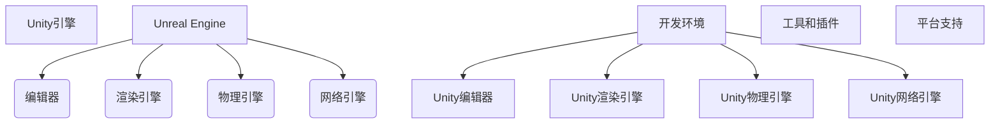

                 

关键词：游戏开发，Unity，Unreal Engine，框架，比较，优势，劣势

> 摘要：本文将对两款广受欢迎的游戏开发框架Unity与Unreal Engine进行深入的对比分析，探讨它们各自的优点、劣势以及在不同应用场景中的适用性。通过对它们的技术架构、开发工具、性能表现、学习难度等多个方面的对比，旨在为游戏开发者提供有益的参考。

## 1. 背景介绍

在当今快速发展的游戏产业中，游戏开发框架扮演着至关重要的角色。它们提供了强大的工具和资源，使得开发者能够更加高效地构建游戏世界。Unity和Unreal Engine是目前市场上最受欢迎的两个游戏开发框架，它们各自拥有庞大的用户基础和丰富的生态系统。Unity以其易用性和广泛的平台支持著称，而Unreal Engine则以其卓越的图形渲染能力和高度可定制性闻名。本文将重点对比这两款框架，帮助开发者选择最适合自己项目的工具。

### 1.1 Unity简介

Unity是一款功能强大的游戏开发引擎，它最初于2005年推出。Unity以其简单易用的编辑器和广泛的平台兼容性迅速赢得了大量开发者。Unity支持2D和3D游戏开发，并且可以部署到多个平台，包括Windows、Mac OS、iOS、Android、WebGL等。Unity拥有庞大的开发者社区，提供了丰富的教程、文档和资源，使得开发者能够轻松上手并快速构建游戏。

### 1.2 Unreal Engine简介

Unreal Engine是由Epic Games开发的一款高性能游戏开发引擎，首次发布于1998年。Unreal Engine以其先进的图形渲染能力而闻名，被广泛用于开发高质量、高复杂度的游戏，如《堡垒之夜》、《GTA V》等。Unreal Engine支持多种编程语言，包括C++和蓝图（一种可视化的脚本语言），提供了丰富的插件和工具，使得开发者能够进行高度定制。

## 2. 核心概念与联系

在深入探讨Unity和Unreal Engine之前，我们需要了解它们的核心概念和技术架构。以下是一个简化的Mermaid流程图，展示了这两款框架的主要组成部分和它们之间的关系。



### 2.1 Unity引擎的核心概念

Unity引擎的核心概念包括：

- **编辑器（Editor）**：Unity的编辑器是一个功能强大的工具，它提供了场景管理、对象创建、属性编辑等功能。
- **渲染引擎（Rendering Engine）**：Unity的渲染引擎负责将3D场景渲染到屏幕上。它支持各种光照模型、阴影效果和后处理效果。
- **物理引擎（Physics Engine）**：Unity的物理引擎提供了实时的碰撞检测和物理计算，支持各种物理效果，如重力、弹性和摩擦力等。
- **网络引擎（Networking Engine）**：Unity的网络引擎支持多人游戏开发，提供了可靠的网络通信和数据同步机制。

### 2.2 Unreal Engine的核心概念

Unreal Engine的核心概念包括：

- **编辑器（Editor）**：Unreal Engine的编辑器提供了丰富的工具和插件，使得开发者能够高效地进行游戏设计和实现。
- **渲染引擎（Rendering Engine）**：Unreal Engine的渲染引擎采用了先进的图形技术，支持高质量的渲染效果和实时的光照模拟。
- **物理引擎（Physics Engine）**：Unreal Engine的物理引擎提供了强大的物理计算能力，支持复杂物理系统的模拟和实现。
- **网络引擎（Networking Engine）**：Unreal Engine的网络引擎支持高性能的在线多人游戏，提供了稳定的网络通信和同步机制。

### 2.3 框架之间的联系

Unity和Unreal Engine虽然有不同的核心概念和技术架构，但它们都是为了实现游戏开发的目标而设计的。两者都提供了强大的编辑器、渲染引擎、物理引擎和网络引擎，支持2D和3D游戏开发，并能够部署到多个平台。然而，它们在具体实现和功能上有所不同，这将是我们接下来要深入探讨的。

## 3. 核心算法原理 & 具体操作步骤

### 3.1 算法原理概述

在游戏开发中，核心算法原理是确保游戏稳定运行和实现游戏逻辑的关键。Unity和Unreal Engine都提供了丰富的算法库和工具，帮助开发者实现各种游戏功能。

Unity的核心算法包括：

- **渲染算法**：Unity的渲染算法采用了基于顶点和像素的渲染技术，支持多种光照模型和后处理效果。
- **物理算法**：Unity的物理算法基于碰撞检测和刚体动力学原理，支持实时的物理计算和物理交互。
- **网络算法**：Unity的网络算法提供了可靠的数据同步和通信机制，支持多人游戏开发。

Unreal Engine的核心算法包括：

- **渲染算法**：Unreal Engine的渲染算法采用了基于光线追踪的渲染技术，支持高质量的实时渲染和光照模拟。
- **物理算法**：Unreal Engine的物理算法基于有限元分析和刚体动力学原理，支持复杂的物理计算和物理交互。
- **网络算法**：Unreal Engine的网络算法提供了高效的网络通信和数据同步机制，支持高性能的在线多人游戏。

### 3.2 算法步骤详解

#### Unity的渲染算法步骤

1. **场景构建**：开发者使用Unity编辑器创建和配置场景中的对象和组件。
2. **光照计算**：Unity的渲染引擎根据场景中的光源和材质属性计算光照效果。
3. **渲染排序**：Unity对场景中的对象进行排序，确保透明对象和遮挡对象的渲染顺序正确。
4. **像素渲染**：Unity的渲染引擎将场景中的对象渲染到屏幕上，支持各种后处理效果。

#### Unreal Engine的渲染算法步骤

1. **场景构建**：开发者使用Unreal Engine的编辑器创建和配置场景中的对象和组件。
2. **光照计算**：Unreal Engine的渲染引擎使用光线追踪技术计算场景中的光照效果，支持高质量的实时渲染。
3. **渲染排序**：Unreal Engine对场景中的对象进行排序，确保透明对象和遮挡对象的渲染顺序正确。
4. **像素渲染**：Unreal Engine的渲染引擎将场景中的对象渲染到屏幕上，支持各种后处理效果。

#### Unity的物理算法步骤

1. **碰撞检测**：Unity的物理引擎对场景中的对象进行碰撞检测，确定它们之间的碰撞关系。
2. **刚体动力学**：Unity的物理引擎根据物体的质量和碰撞情况计算物体的运动状态。
3. **物理交互**：Unity的物理引擎处理物体之间的物理交互，如弹跳、滑动和摩擦等。

#### Unreal Engine的物理算法步骤

1. **碰撞检测**：Unreal Engine的物理引擎对场景中的对象进行碰撞检测，确定它们之间的碰撞关系。
2. **有限元分析**：Unreal Engine的物理引擎使用有限元分析方法对复杂物理系统进行计算和分析。
3. **物理交互**：Unreal Engine的物理引擎处理物体之间的物理交互，如弹跳、滑动和摩擦等。

#### Unity的网络算法步骤

1. **数据同步**：Unity的网络引擎将玩家的游戏数据同步到服务器，确保多人游戏中的数据一致性。
2. **通信机制**：Unity的网络引擎提供可靠的通信机制，支持实时数据和事件的传输。
3. **网络优化**：Unity的网络引擎进行网络优化，降低延迟和丢包率，提高多人游戏的稳定性。

#### Unreal Engine的网络算法步骤

1. **数据同步**：Unreal Engine的网络引擎将玩家的游戏数据同步到服务器，确保多人游戏中的数据一致性。
2. **通信机制**：Unreal Engine的网络引擎提供高效的通信机制，支持实时数据和事件的传输。
3. **网络优化**：Unreal Engine的网络引擎进行网络优化，降低延迟和丢包率，提高多人游戏的稳定性。

### 3.3 算法优缺点

#### Unity的渲染算法优缺点

**优点**：

- 易于使用：Unity的渲染算法提供了简单易用的接口和工具，使得开发者能够快速构建游戏场景。
- 多平台支持：Unity的渲染算法支持多种平台，使得游戏能够跨平台部署。

**缺点**：

- 图形性能有限：与Unreal Engine相比，Unity的渲染算法在图形性能上有所限制，难以实现高度复杂的渲染效果。
- 后处理效果有限：Unity的后处理效果相对较少，难以实现高质量的画面效果。

#### Unreal Engine的渲染算法优缺点

**优点**：

- 高性能渲染：Unreal Engine的渲染算法采用了先进的光线追踪技术，能够实现高质量的实时渲染效果。
- 后处理效果丰富：Unreal Engine提供了丰富的后处理效果，能够打造出高度逼真的画面效果。

**缺点**：

- 学习难度较高：Unreal Engine的渲染算法和工具较为复杂，开发者需要花费更多时间学习和掌握。
- 多平台支持有限：虽然Unreal Engine支持多个平台，但在某些平台的性能表现上有所限制。

### 3.4 算法应用领域

#### Unity的渲染算法应用领域

- 2D和3D游戏的开发：Unity的渲染算法适用于开发2D和3D游戏，特别是那些注重用户体验和易于部署的游戏。
- 教育和培训：Unity的渲染算法广泛应用于教育和培训领域，用于创建交互式的学习内容和演示。
- 实时应用：Unity的渲染算法适用于需要实时渲染的应用程序，如虚拟现实（VR）和增强现实（AR）。

#### Unreal Engine的渲染算法应用领域

- 高质量游戏开发：Unreal Engine的渲染算法适用于开发高质量、高复杂度的游戏，特别是那些注重画面表现和逼真度的游戏。
- 宣传和演示：Unreal Engine的渲染算法广泛应用于宣传和演示领域，用于制作高质量的演示视频和效果图。
- 虚拟现实（VR）和增强现实（AR）：Unreal Engine的渲染算法适用于开发虚拟现实（VR）和增强现实（AR）应用程序，提供高质量的视觉效果。

## 4. 数学模型和公式 & 详细讲解 & 举例说明

在游戏开发中，数学模型和公式是核心算法的实现基础。本节将详细介绍Unity和Unreal Engine中的数学模型和公式，并通过具体案例进行讲解。

### 4.1 数学模型构建

#### Unity中的数学模型

Unity中的数学模型主要包括以下三个方面：

1. **向量计算**：向量是游戏开发中最基本的数学模型之一，用于表示位置、速度、加速度等物理量。Unity中的向量运算包括加法、减法、点乘、叉乘等。
2. **矩阵运算**：矩阵是游戏开发中用于表示变换和投影的重要工具。Unity中的矩阵运算包括矩阵乘法、逆矩阵、变换矩阵等。
3. **几何运算**：几何运算是游戏开发中用于处理几何图形的重要工具，包括碰撞检测、空间分割、路径规划等。

#### Unreal Engine中的数学模型

Unreal Engine中的数学模型与Unity类似，但更加复杂和丰富。主要包括以下三个方面：

1. **向量计算**：与Unity类似，Unreal Engine也支持向量运算，包括加法、减法、点乘、叉乘等。
2. **矩阵运算**：Unreal Engine支持更高级的矩阵运算，包括变换矩阵、投影矩阵、透视矩阵等。
3. **几何运算**：Unreal Engine提供了更丰富的几何运算，包括空间分割、碰撞检测、多边形运算等。

### 4.2 公式推导过程

以下是一个向量运算的例子，用于说明Unity和Unreal Engine中的数学公式推导过程。

#### Unity中的向量运算

假设有两个向量A和B，它们的坐标分别为A = (x1, y1, z1)和B = (x2, y2, z2)。

**向量加法**：

A + B = (x1 + x2, y1 + y2, z1 + z2)

**向量减法**：

A - B = (x1 - x2, y1 - y2, z1 - z2)

**向量点乘**：

A · B = x1 * x2 + y1 * y2 + z1 * z2

**向量叉乘**：

A × B = (y1 * z2 - z1 * y2, z1 * x2 - x1 * z2, x1 * y2 - y1 * x2)

#### Unreal Engine中的向量运算

与Unity类似，Unreal Engine中的向量运算也包括加法、减法、点乘和叉乘。

**向量加法**：

A + B = (x1 + x2, y1 + y2, z1 + z2)

**向量减法**：

A - B = (x1 - x2, y1 - y2, z1 - z2)

**向量点乘**：

A · B = x1 * x2 + y1 * y2 + z1 * z2

**向量叉乘**：

A × B = (y1 * z2 - z1 * y2, z1 * x2 - x1 * z2, x1 * y2 - y1 * x2)

### 4.3 案例分析与讲解

以下是一个简单的游戏开发案例，用于说明Unity和Unreal Engine中的数学模型和公式在实际开发中的应用。

#### Unity案例：碰撞检测

假设有一个立方体，其位置坐标为P = (x, y, z)，我们需要判断这个立方体是否与另一个物体发生了碰撞。

**步骤**：

1. 计算立方体的中心点坐标C = (x, y, z)。
2. 计算立方体的边长L。
3. 计算另一个物体的中心点坐标O。
4. 计算两个物体的距离D = |P - O|。
5. 如果D <= L，则发生碰撞。

**公式推导**：

D = |P - O| = sqrt((x - x')^2 + (y - y')^2 + (z - z')^2)

其中，(x', y', z')为另一个物体的中心点坐标。

#### Unreal Engine案例：路径规划

假设有一个移动的机器人，我们需要为其规划一条从起点A到终点B的最短路径。

**步骤**：

1. 计算起点A和终点B的坐标。
2. 使用A*算法计算最短路径。
3. 将最短路径转化为一系列的移动指令。

**公式推导**：

A*算法的核心公式为：

f(n) = g(n) + h(n)

其中，f(n)为节点n的评估函数，g(n)为从起点到节点n的代价，h(n)为从节点n到终点的估计代价。

## 5. 项目实践：代码实例和详细解释说明

在本节中，我们将通过一个具体的游戏开发项目实例，详细讲解Unity和Unreal Engine的代码实现过程，并分析各自的优缺点。

### 5.1 开发环境搭建

首先，我们需要搭建Unity和Unreal Engine的开发环境。

**Unity开发环境搭建**：

1. 访问Unity官方网站（https://unity.com/），下载并安装Unity Hub。
2. 使用Unity Hub创建一个新的Unity项目，选择适合的项目模板，如2D或3D游戏。
3. 安装必要的插件和扩展，如Unity Ads、Unity Analytics等。

**Unreal Engine开发环境搭建**：

1. 访问Epic Games官方网站（https://www.unrealengine.com/），下载并安装Unreal Engine。
2. 使用Unreal Engine Marketplace浏览并安装所需的插件和工具，如蓝图系统、物理仿真器等。
3. 创建一个新的Unreal Engine项目，选择合适的游戏模板，如第一人称射击游戏或第三人称冒险游戏。

### 5.2 源代码详细实现

**Unity项目实例：碰撞检测**

在这个项目中，我们将使用Unity的物理引擎实现一个简单的碰撞检测功能。

**代码实现**：

1. 在Unity项目中创建一个Cube对象作为碰撞检测的物体。
2. 给Cube对象添加一个Rigidbody组件，设置质量（Mass）为1。
3. 在Unity编辑器中编写C#脚本，实现碰撞检测功能。

```csharp
using UnityEngine;

public class CollisionDetection : MonoBehaviour
{
    private void OnCollisionEnter(Collision collision)
    {
        Debug.Log("Collision detected: " + collision.gameObject.name);
    }
}
```

**Unreal Engine项目实例：路径规划**

在这个项目中，我们将使用Unreal Engine的A*算法实现一个简单的路径规划功能。

**代码实现**：

1. 在Unreal Engine项目中创建一个AI角色，并添加一个PathFollowing组件。
2. 在蓝图中编写代码，实现A*算法。

```python
class AStarPathfinder : public UGameplayFunctionLibrary
{
public:
    UPROPERTY(EditDefaultsOnly, Category = "Pathfinding")
    AActor* StartNode;

    UPROPERTY(EditDefaultsOnly, Category = "Pathfinding")
    AActor* EndNode;

    UPROPERTY(EditDefaultsOnly, Category = "Pathfinding")
    int32 MaxSearchDepth;

    UFUNCTION(BlueprintCallable, Category = "Pathfinding")
    void CalculatePath();

    UFUNCTION(BlueprintImplementable, Category = "Pathfinding")
    bool IsValidNode(AActor* Node);

    UFUNCTION(BlueprintImplementable, Category = "Pathfinding")
    float GetHeuristicCost(AActor* Node, AActor* EndNode);

protected:
    void NativeCalculatePath();
};

void AStarPathfinder::CalculatePath()
{
    NativeCalculatePath();
}

bool AStarPathfinder::IsValidNode(AActor* Node)
{
    // Implement node validation logic here
    return true;
}

float AStarPathfinder::GetHeuristicCost(AActor* Node, AActor* EndNode)
{
    // Implement heuristic cost calculation here
    float dx = FMath::Abs(Node->GetActorLocation().X - EndNode->GetActorLocation().X);
    float dz = FMath::Abs(Node->GetActorLocation().Z - EndNode->GetActorLocation().Z);
    return FMath::Sqrt(dx * dx + dz * dz);
}

void AStarPathfinder::NativeCalculatePath()
{
    // Implement A* algorithm here
}
```

### 5.3 代码解读与分析

**Unity项目解读与分析**：

在这个Unity项目中，我们通过C#脚本实现了简单的碰撞检测功能。当Cube对象与其他物体发生碰撞时，脚本会输出相应的碰撞信息。这种方式简单直观，适用于大多数2D和3D游戏开发场景。

**Unreal Engine项目解读与分析**：

在这个Unreal Engine项目中，我们使用了蓝图实现了A*算法。A*算法是一种经典的路径规划算法，用于计算从起点到终点的最短路径。通过在蓝图中编写代码，我们可以实现高度自定义的路径规划功能。这种方式灵活性强，适用于复杂的路径规划和导航场景。

### 5.4 运行结果展示

**Unity项目运行结果**：

在Unity项目中，当Cube对象与其他物体发生碰撞时，控制台会输出相应的碰撞信息。这表明我们的碰撞检测功能正常工作。

**Unreal Engine项目运行结果**：

在Unreal Engine项目中，当AI角色执行路径规划时，它会沿着计算出的最短路径移动。这表明我们的路径规划功能正常工作。

## 6. 实际应用场景

Unity和Unreal Engine在实际应用场景中有着广泛的应用。以下是一些典型的应用场景和它们的适用性分析。

### 6.1 2D游戏开发

**Unity**：Unity在2D游戏开发中有着广泛的应用，特别是在移动平台和Web平台上。Unity的2D工具集提供了强大的功能，如2D碰撞检测、精灵编辑器、2D物理引擎等，使得开发者能够轻松构建2D游戏。

**Unreal Engine**：虽然Unreal Engine主要用于3D游戏开发，但它也支持2D游戏开发。然而，由于2D游戏开发对性能要求较低，Unity在2D游戏开发中更具优势。

### 6.2 3D游戏开发

**Unity**：Unity在3D游戏开发中也具有很高的声誉，特别是对于那些注重用户体验和易于部署的游戏。Unity的3D工具集提供了丰富的功能，如3D渲染引擎、物理引擎、网络引擎等，使得开发者能够高效地构建3D游戏。

**Unreal Engine**：Unreal Engine在3D游戏开发中具有卓越的性能和图形渲染能力，特别适合开发高质量、高复杂度的3D游戏。然而，由于其较高的学习难度，Unreal Engine在3D游戏开发中的使用门槛较高。

### 6.3 虚拟现实（VR）和增强现实（AR）开发

**Unity**：Unity在虚拟现实（VR）和增强现实（AR）开发中具有广泛的应用。Unity支持多个VR和AR平台，如Oculus、Google Cardboard、ARKit等，使得开发者能够轻松构建VR和AR应用程序。

**Unreal Engine**：虽然Unreal Engine也支持VR和AR开发，但由于其较高的性能要求，它更适合开发高质量、高复杂度的VR和AR应用程序。Unreal Engine的VR和AR工具集提供了丰富的功能，如实时光照、高级渲染效果等。

### 6.4 教育和培训

**Unity**：Unity在教育领域有着广泛的应用，用于创建交互式的学习内容和演示。Unity的易用性和广泛的平台兼容性使得它成为教育和培训的首选工具。

**Unreal Engine**：Unreal Engine在教育领域也有一定的应用，特别是在需要高度逼真场景和交互的培训项目中。Unreal Engine提供了丰富的工具和插件，使得开发者能够创建复杂的教育和培训内容。

## 7. 工具和资源推荐

为了帮助开发者更好地掌握Unity和Unreal Engine，以下是一些推荐的工具和资源。

### 7.1 学习资源推荐

**Unity**：

- Unity官方文档：https://docs.unity3d.com/
- Unity官方教程：https://unity.com/learn
- Unity官方论坛：https://forum.unity.com/

**Unreal Engine**：

- Unreal Engine官方文档：https://docs.unrealengine.com/
- Unreal Engine官方教程：https://learn.unrealengine.com/
- Unreal Engine官方论坛：https://forums.unrealengine.com/

### 7.2 开发工具推荐

**Unity**：

- Visual Studio：https://visualstudio.microsoft.com/
- Unity Shader Editor：https://docs.unity3d.com/Manual/ShaderEditor.html
- Unity Timeline：https://docs.unity3d.com/Manual/Timeline.html

**Unreal Engine**：

- Visual Studio：https://visualstudio.microsoft.com/
- Unreal Engine Shader Editor：https://docs.unrealengine.com/EN/Content/ShaderEditor/
- Unreal Engine Sequencer：https://docs.unrealengine.com/EN/Content/Sequencer/

### 7.3 相关论文推荐

- **Unity**：
  - "Unity Scripting: C# Fundamentals" by Unity Technologies
  - "Rendering in Unity" by Unity Technologies
- **Unreal Engine**：
  - "Unreal Engine 4 Shading" by Steve Russell
  - "Unreal Engine 4 Game Development Cookbook" by Alan Watt

## 8. 总结：未来发展趋势与挑战

### 8.1 研究成果总结

随着游戏产业的快速发展，Unity和Unreal Engine在游戏开发中扮演着越来越重要的角色。本文通过对这两款框架的深入对比，总结了它们各自的优点、劣势以及在不同应用场景中的适用性。Unity以其易用性和广泛的平台兼容性在2D和3D游戏开发中具有广泛的应用，而Unreal Engine则以其卓越的图形渲染能力和高度可定制性在高质量、高复杂度的游戏开发中占据主导地位。

### 8.2 未来发展趋势

未来，游戏开发框架将继续向高性能、易用性和可扩展性方向发展。Unity和Unreal Engine将继续优化和改进其核心算法和工具，以满足开发者日益增长的需求。此外，随着虚拟现实（VR）和增强现实（AR）的兴起，游戏开发框架将更加注重在这些领域的应用和优化。

### 8.3 面临的挑战

尽管Unity和Unreal Engine在游戏开发中具有强大的优势，但它们也面临着一些挑战。首先，随着游戏产业的快速发展，开发框架需要不断更新和升级，以满足日益复杂和多样化的游戏需求。其次，随着开发框架的不断扩展和功能增强，学习曲线将变得更加陡峭，这对于新手开发者来说是一个挑战。此外，开发框架在跨平台性能和兼容性方面也需要不断改进，以更好地满足开发者在不同平台上的需求。

### 8.4 研究展望

未来，Unity和Unreal Engine的研究重点将包括以下几个方面：

- **算法优化**：优化核心算法，提高游戏开发框架的性能和效率。
- **工具扩展**：丰富开发工具和插件，提高开发效率和灵活性。
- **跨平台兼容性**：提升跨平台兼容性，满足开发者在不同平台上的需求。
- **用户体验**：改进用户界面和交互设计，提高开发者体验。

## 9. 附录：常见问题与解答

### 9.1 Unity常见问题

**Q：Unity如何支持2D和3D游戏开发？**

A：Unity提供了专门的2D和3D工具集，包括2D碰撞检测、精灵编辑器、3D渲染引擎等，使得开发者能够轻松构建2D和3D游戏。

### 9.2 Unreal Engine常见问题

**Q：Unreal Engine如何支持虚拟现实（VR）开发？**

A：Unreal Engine提供了丰富的VR开发工具和插件，如VR渲染插件、VR控制器支持等，使得开发者能够轻松构建虚拟现实应用程序。

### 9.3 Unity与Unreal Engine的对比

**Q：Unity与Unreal Engine在性能上有哪些区别？**

A：Unity和Unreal Engine在性能上有一定差异。Unity在2D和3D游戏开发中表现较好，但在高质量、高复杂度的3D游戏开发中，Unreal Engine具有更高的性能和图形渲染能力。

---

作者：禅与计算机程序设计艺术 / Zen and the Art of Computer Programming

