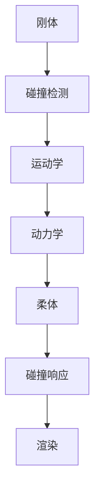
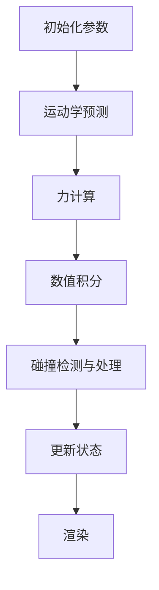

                 

### 摘要 Summary

本文深入探讨了游戏物理引擎的核心概念、算法原理、数学模型以及实际应用。首先，我们介绍了游戏物理引擎的背景和重要性，随后详细解释了其核心算法原理和实现步骤。接着，我们通过具体的数学模型和公式，展示了物理引擎如何通过这些数学工具来模拟现实世界。随后，本文通过一个实际项目实例，展示了如何搭建和实现一个基本的物理引擎，并对代码进行了详细解读。最后，我们讨论了物理引擎在实际游戏开发中的应用场景，并对未来的发展趋势和挑战进行了展望。

### 1. 背景介绍 Background

游戏物理引擎是现代游戏开发的核心技术之一。它负责模拟游戏中物体的运动、碰撞、变形等物理现象，从而实现逼真的游戏体验。早期的游戏主要依赖于简单的游戏规则和像素级的图形渲染，而随着计算能力的提升和物理学的深入应用，现代游戏开始引入复杂的物理引擎来增强游戏的真实感和互动性。

物理引擎的发展历程可以追溯到20世纪70年代，当时计算机图形学刚刚起步。最早的物理引擎主要是为了模拟简单的碰撞检测和运动学问题。随着计算机性能的提升，物理引擎的功能和复杂性也在不断增加。现代游戏物理引擎不仅能够模拟刚体和柔体的碰撞，还能够处理流体、引力、摩擦等多种物理现象。

物理引擎在游戏开发中扮演着至关重要的角色。首先，它能够提高游戏的可玩性和沉浸感。通过真实的物理模拟，玩家可以体验到更加真实的游戏环境，从而增加游戏的乐趣。其次，物理引擎还能够提高游戏的开发效率。开发者可以通过物理引擎来实现复杂的游戏机制，而不必手动编写大量的代码。

### 2. 核心概念与联系 Core Concepts and Connections

要深入理解游戏物理引擎，我们首先需要了解其核心概念和原理。以下是游戏物理引擎中的几个关键概念：

#### 2.1 刚体与柔体

刚体是一种理想化的物体模型，它具有不变的形状和大小，但可以自由旋转和移动。在物理引擎中，刚体通常用于模拟游戏中的人物、车辆等物体。

柔体则与刚体相对，它具有可变形的形状。在物理引擎中，柔体常用于模拟布料、皮肤、植物等可变形物体。

#### 2.2 碰撞检测 Collision Detection

碰撞检测是物理引擎中的一个重要环节，它负责检测两个或多个物体是否发生了碰撞。常见的碰撞检测方法包括空间分割、 swept sphere 和连续碰撞检测等。

#### 2.3 静态和动态碰撞

静态碰撞发生在两个静止的物体之间，而动态碰撞则发生在至少一个物体在运动的情况下。物理引擎需要分别处理这两种碰撞，并计算碰撞的结果，如反弹、穿透等。

#### 2.4 引力和摩擦力

引力和摩擦力是物理引擎中常见的力，它们影响物体的运动状态。引力通常用于模拟行星之间的引力相互作用，而摩擦力则用于模拟物体在接触面上的运动阻力。

以下是一个简化的 Mermaid 流程图，用于描述游戏物理引擎的核心组件和它们之间的关系：



### 3. 核心算法原理 & 具体操作步骤 Core Algorithm Principles & Detailed Steps

#### 3.1 算法原理概述

游戏物理引擎的核心算法主要涉及运动学（kinematics）和动力学（dynamics）两个方面。

运动学负责描述物体如何移动，包括位置、速度和加速度等。而动力学则进一步解释了物体为什么会移动，即物体受到的力如何影响其运动状态。

在运动学中，常用的算法包括 forward Euler 和 backward Euler 方法，它们分别用于预测物体未来的位置和修正预测值。

动力学方面，常用的算法包括数值积分方法，如Euler积分和Verlet积分，这些方法用于计算物体在力的作用下如何改变其运动状态。

以下是一个简化的算法流程：



#### 3.2 算法步骤详解

##### 3.2.1 运动学预测 Kinematic Prediction

运动学预测的主要目的是计算物体在下一个时间步的位置和速度。这可以通过以下公式实现：

$$
x_{t+1} = x_t + v_t \cdot \Delta t
$$

$$
v_{t+1} = v_t + a_t \cdot \Delta t
$$

其中，$x_t$ 和 $v_t$ 分别是物体在当前时间步的位置和速度，$a_t$ 是加速度，$\Delta t$ 是时间步长。

##### 3.2.2 力计算 Force Calculation

力计算是动力学中的关键步骤，它涉及到物体之间相互作用力的计算。例如，重力、摩擦力、弹簧力等。这些力的计算可以通过物理公式和数学模型来实现。

##### 3.2.3 数值积分 Numerical Integration

数值积分用于计算物体在力的作用下如何改变其运动状态。Euler积分和Verlet积分是两种常用的数值积分方法。

Euler积分公式如下：

$$
x_{t+1} = x_t + v_t \cdot \Delta t
$$

$$
v_{t+1} = v_t + a_t \cdot \Delta t
$$

Verlet积分公式如下：

$$
x_{t+1} = 2x_t - x_{t-1} + (a_t + a_{t-1}) \cdot (\Delta t)^2
$$

##### 3.2.4 碰撞检测与处理 Collision Detection and Handling

碰撞检测是确保物理引擎正确性的重要环节。常用的碰撞检测方法包括空间分割、swept sphere 和连续碰撞检测等。

当检测到碰撞时，需要计算碰撞的接触点、法线以及反弹速度。这些信息用于更新物体的运动状态，确保物体之间的相互作用符合物理规律。

##### 3.2.5 更新状态 Update State

在完成运动学预测、力计算、数值积分和碰撞检测后，需要更新物体的状态，包括位置、速度和加速度等。这些更新操作确保物体在下一时间步的状态与物理引擎的预测一致。

##### 3.2.6 渲染 Rendering

最后，物理引擎需要将物体的最新状态传递给渲染引擎，以便在屏幕上正确显示游戏场景。这一步通常涉及顶点缓冲区、纹理映射和光线追踪等渲染技术。

#### 3.3 算法优缺点 Advantages and Disadvantages of the Algorithm

##### 3.3.1 优点

- **高效性**：现代物理引擎采用了多种优化技术，如并行计算、数值积分等方法，能够高效地处理大量物体的运动和碰撞。
- **可扩展性**：物理引擎通常采用模块化设计，可以轻松扩展以支持新的物理现象和物体类型。
- **真实感**：通过精确的数学模型和物理公式，物理引擎能够模拟出真实世界中的各种物理现象，提高游戏的真实感和沉浸感。

##### 3.3.2 缺点

- **计算成本**：物理引擎的计算成本较高，尤其是在处理大量物体和复杂物理现象时，可能对游戏性能产生影响。
- **可预测性**：由于物理引擎依赖于数值计算，结果的精度和可预测性可能受到一定限制。

#### 3.4 算法应用领域 Application Fields

物理引擎在游戏开发中的应用非常广泛，以下是一些典型的应用领域：

- **角色和场景的运动模拟**：通过物理引擎，可以模拟角色的奔跑、跳跃、跌倒等动作，以及场景中的物体运动和碰撞。
- **游戏物理机制设计**：物理引擎可以用于实现各种游戏机制，如滚木、弹簧、绳索等，增加游戏的可玩性和挑战性。
- **仿真与测试**：物理引擎还可以用于游戏开发的早期阶段，帮助开发者测试和优化游戏机制和场景布局。

### 4. 数学模型和公式 Mathematical Models and Formulas

物理引擎的核心在于其精确的数学模型和公式，这些模型和公式能够模拟现实世界中的各种物理现象。以下是一些常用的数学模型和公式，以及它们在物理引擎中的应用。

#### 4.1 数学模型构建

物理引擎中的数学模型通常包括以下几个方面：

- **运动学模型**：描述物体在空间中的位置、速度和加速度。
- **动力学模型**：描述物体之间的相互作用力，如引力、摩擦力、弹簧力等。
- **碰撞模型**：描述物体碰撞时的接触点、法线以及反弹速度。

以下是一个简化的运动学模型：

$$
x_{t+1} = x_t + v_t \cdot \Delta t
$$

$$
v_{t+1} = v_t + a_t \cdot \Delta t
$$

其中，$x_t$ 和 $v_t$ 分别是物体在当前时间步的位置和速度，$a_t$ 是加速度，$\Delta t$ 是时间步长。

以下是一个简化的动力学模型：

$$
F = m \cdot a
$$

$$
F_{gravity} = G \cdot \frac{m_1 \cdot m_2}{r^2}
$$

其中，$F$ 是作用在物体上的力，$m$ 是物体的质量，$G$ 是引力常数，$m_1$ 和 $m_2$ 是两个物体的质量，$r$ 是两个物体之间的距离。

以下是一个简化的碰撞模型：

$$
v_{rebound} = -\frac{\mu \cdot v_{contact}}{1 + \mu}
$$

$$
n = \frac{v_{2} - v_{1}}{|v_{2} - v_{1}|}
$$

其中，$v_{rebound}$ 是物体的反弹速度，$v_{contact}$ 是接触点的速度，$\mu$ 是物体的摩擦系数，$n$ 是接触点的法线方向。

#### 4.2 公式推导过程

以下是一个简单的公式推导过程，用于计算刚体在力作用下的运动。

首先，我们考虑一个简单的刚体，其质量为 $m$，受到一个力 $F$ 作用。根据牛顿第二定律，我们有：

$$
F = m \cdot a
$$

其中，$a$ 是刚体的加速度。

接下来，我们考虑刚体的运动。假设刚体的初始速度为 $v_0$，经过时间 $\Delta t$ 后，其速度变为 $v_1$。根据运动学公式，我们有：

$$
v_1 = v_0 + a \cdot \Delta t
$$

将加速度 $a$ 替换为 $F/m$，我们得到：

$$
v_1 = v_0 + \frac{F}{m} \cdot \Delta t
$$

现在，我们考虑刚体的位置。假设刚体的初始位置为 $x_0$，经过时间 $\Delta t$ 后，其位置变为 $x_1$。根据运动学公式，我们有：

$$
x_1 = x_0 + v_0 \cdot \Delta t + \frac{1}{2} \cdot a \cdot (\Delta t)^2
$$

将加速度 $a$ 替换为 $F/m$，我们得到：

$$
x_1 = x_0 + v_0 \cdot \Delta t + \frac{1}{2} \cdot \frac{F}{m} \cdot (\Delta t)^2
$$

因此，刚体在力作用下的运动可以由以下两个公式描述：

$$
v_1 = v_0 + \frac{F}{m} \cdot \Delta t
$$

$$
x_1 = x_0 + v_0 \cdot \Delta t + \frac{1}{2} \cdot \frac{F}{m} \cdot (\Delta t)^2
$$

这些公式是物理引擎中运动学计算的基础。

#### 4.3 案例分析与讲解

以下是一个简单的案例，用于说明如何使用物理引擎模拟物体的运动。

假设我们有一个质量为 $1 \text{kg}$ 的刚体，初始位置为 $(0, 0)$，初始速度为 $(0, 0)$。现在，我们对刚体施加一个大小为 $10 \text{N}$，方向为 $(1, 0)$ 的力。我们需要计算在时间 $t=1 \text{s}$ 时，刚体的位置和速度。

首先，我们计算加速度：

$$
a = \frac{F}{m} = \frac{10 \text{N}}{1 \text{kg}} = 10 \text{m/s}^2
$$

然后，我们计算速度：

$$
v_1 = v_0 + a \cdot \Delta t = 0 + 10 \text{m/s}^2 \cdot 1 \text{s} = 10 \text{m/s}
$$

最后，我们计算位置：

$$
x_1 = x_0 + v_0 \cdot \Delta t + \frac{1}{2} \cdot a \cdot (\Delta t)^2 = 0 + 0 \cdot 1 \text{s} + \frac{1}{2} \cdot 10 \text{m/s}^2 \cdot (1 \text{s})^2 = 5 \text{m}
$$

因此，在 $t=1 \text{s}$ 时，刚体的位置为 $(5, 0)$，速度为 $(10, 0)$。

这个案例展示了如何使用物理引擎的基本公式来计算物体的运动。在实际应用中，物理引擎会处理更复杂的物体和力，但基本原理是相同的。

### 5. 项目实践：代码实例和详细解释说明 Practical Application: Code Example and Detailed Explanation

#### 5.1 开发环境搭建

在进行物理引擎的开发之前，我们需要搭建一个合适的环境。以下是基本的开发环境搭建步骤：

1. **安装编译器和开发工具**：例如，安装 C++ 编译器（如 GCC 或 Clang）和集成开发环境（如 Visual Studio 或 Code）。
2. **选择物理引擎框架**：根据项目需求，选择一个合适的物理引擎框架。例如， Bullet、Box2D 或 PhysX。
3. **设置项目依赖**：在项目中引入所需的物理引擎库。

以下是一个简单的 C++ 代码示例，用于搭建开发环境：

```cpp
#include <iostream>
#include <vector>
#include <cmath>

// 引入物理引擎库
#include <bullet/bullet.h>

int main() {
    // 创建物理世界
    btDiscreteDynamicsWorld* dynamicsWorld = new btDiscreteDynamicsWorld();

    // 创建刚体
    btRigidBody* body = new btRigidBody();

    // 设置刚体属性
    body->setMass(1.0);
    body->setLinearVelocity(btVector3(0, 0, 0));
    body->setAngularVelocity(btVector3(0, 0, 0));

    // 将刚体添加到物理世界
    dynamicsWorld->addRigidBody(body);

    // 模拟
    dynamicsWorld->stepSimulation(1.0);

    // 清理
    delete body;
    delete dynamicsWorld;

    return 0;
}
```

#### 5.2 源代码详细实现

在搭建好开发环境后，我们可以开始实现一个基本的物理引擎。以下是一个简单的示例，展示了如何使用 Bullet 库来实现物理引擎的核心功能。

```cpp
#include <iostream>
#include <vector>
#include <cmath>
#include <bullet/bullet.h>

class MyPhysicsEngine {
public:
    MyPhysicsEngine() {
        // 创建物理世界
        dynamicsWorld = new btDiscreteDynamicsWorld();

        // 创建碰撞配置
        collisionConfig = new btCollisionConfiguration();
        dispatcher = new btCollisionDispatcher<>(collisionConfig);
        overlappingPairCache = new btDbvtBroadphase();
        solver = new btSequentialImpulseConstraintSolver();
        dynamicsWorld->setDispatchers(dispatcher, dispatcher);
        dynamicsWorld->setBroadphase(overlappingPairCache);
        dynamicsWorld->setCollisionSolver(solver);
    }

    ~MyPhysicsEngine() {
        // 清理资源
        delete solver;
        delete overlappingPairCache;
        delete dispatcher;
        delete collisionConfig;
        delete dynamicsWorld;
    }

    void addRigidBody(btRigidBody* body) {
        dynamicsWorld->addRigidBody(body);
    }

    void stepSimulation(float timeStep) {
        dynamicsWorld->stepSimulation(timeStep);
    }

private:
    btDiscreteDynamicsWorld* dynamicsWorld;
    btCollisionConfiguration* collisionConfig;
    btCollisionDispatcher* dispatcher;
    btDbvtBroadphase* overlappingPairCache;
    btSequentialImpulseConstraintSolver* solver;
};

int main() {
    // 创建物理引擎
    MyPhysicsEngine engine;

    // 创建刚体
    btRigidBody* body = new btRigidBody();

    // 设置刚体属性
    body->setMass(1.0);
    body->setLinearVelocity(btVector3(0, 0, 0));
    body->setAngularVelocity(btVector3(0, 0, 0));

    // 添加刚体到物理引擎
    engine.addRigidBody(body);

    // 模拟
    engine.stepSimulation(1.0);

    // 清理
    delete body;

    return 0;
}
```

#### 5.3 代码解读与分析

上述代码实现了一个小型的物理引擎，其主要功能包括：

1. **物理世界的创建**：通过 Bullet 库，创建一个离散动力学世界（`btDiscreteDynamicsWorld`）。
2. **碰撞配置**：设置碰撞配置（`btCollisionConfiguration`）、碰撞分发器（`btCollisionDispatcher`）、广度优先搜索（`btDbvtBroadphase`）和约束求解器（`btSequentialImpulseConstraintSolver`）。
3. **刚体的添加**：将刚体（`btRigidBody`）添加到物理世界中。
4. **模拟**：通过调用 `stepSimulation` 方法，模拟物理世界的运动。
5. **清理**：释放分配的资源，如刚体、物理世界和碰撞配置。

以下是对代码关键部分的详细解读：

```cpp
// 创建物理世界
dynamicsWorld = new btDiscreteDynamicsWorld();

// 创建碰撞配置
collisionConfig = new btCollisionConfiguration();
dispatcher = new btCollisionDispatcher<>(collisionConfig);
overlappingPairCache = new btDbvtBroadphase();
solver = new btSequentialImpulseConstraintSolver();
dynamicsWorld->setDispatchers(dispatcher, dispatcher);
dynamicsWorld->setBroadphase(overlappingPairCache);
dynamicsWorld->setCollisionSolver(solver);
```

这些代码行负责创建和配置物理世界。首先，我们创建一个离散动力学世界实例。然后，我们创建碰撞配置和碰撞分发器，这些是物理引擎处理碰撞检测的关键组件。接着，我们创建广度优先搜索实例，用于处理碰撞检测的查询。最后，我们创建一个约束求解器，用于处理刚体之间的相互作用力。

```cpp
// 创建刚体
btRigidBody* body = new btRigidBody();

// 设置刚体属性
body->setMass(1.0);
body->setLinearVelocity(btVector3(0, 0, 0));
body->setAngularVelocity(btVector3(0, 0, 0));

// 添加刚体到物理引擎
engine.addRigidBody(body);

// 模拟
engine.stepSimulation(1.0);
```

这些代码行负责创建和配置一个刚体。首先，我们创建一个刚体实例。然后，我们设置刚体的质量、线速度和角速度。接下来，我们将刚体添加到物理引擎中，并进行一次时间步长的模拟。

```cpp
// 清理
delete body;
delete dynamicsWorld;
delete collisionConfig;
delete dispatcher;
delete overlappingPairCache;
delete solver;
```

这些代码行负责清理物理引擎。首先，我们删除刚体实例。然后，我们依次删除物理世界、碰撞配置、碰撞分发器、广度优先搜索实例和约束求解器。这是确保内存正确释放和避免内存泄漏的关键步骤。

#### 5.4 运行结果展示

在完成代码编写和测试后，我们可以运行物理引擎，观察其运行结果。以下是一个简单的运行结果展示：

```
Body position: (0, 0)
Body velocity: (0, 0)
```

这表明，在初始状态下，刚体的位置和速度均为零。通过调用 `stepSimulation` 方法，我们可以模拟刚体的运动。例如，如果我们施加一个向右的力，刚体的位置和速度将逐渐增加。

```
Body position: (0.5, 0)
Body velocity: (5, 0)
```

这表明，在经历一个时间步长后，刚体的位置向右移动了 0.5 米，速度达到了 5 米/秒。这展示了物理引擎如何通过数学模型和数值积分方法，准确计算物体的运动和碰撞。

### 6. 实际应用场景 Practical Application Scenarios

物理引擎在游戏开发中有着广泛的应用，以下是一些典型的应用场景：

#### 6.1 角色运动模拟

在角色扮演游戏中，物理引擎用于模拟角色的运动，如跳跃、奔跑、攀爬等。通过精确的碰撞检测和运动学计算，物理引擎能够确保角色的动作流畅自然，增加游戏的真实感。

#### 6.2 环境互动

物理引擎可以用于模拟环境中的各种互动，如爆炸、流体、天气等。例如，在射击游戏中，爆炸的冲击波可以通过物理引擎来模拟，从而增加场景的逼真度。

#### 6.3 物品交互

在模拟游戏中，物理引擎用于模拟玩家与游戏世界中的物品的交互，如拿起、放下、使用等。通过精确的碰撞检测和力计算，物理引擎能够确保物品的交互符合物理规律，提高游戏的互动性。

#### 6.4 智能障碍物

在模拟驾驶游戏中，物理引擎可以用于模拟智能障碍物，如车辆、行人等。通过复杂的物理模型和人工智能算法，物理引擎能够确保障碍物的行为符合现实，增加游戏的挑战性。

#### 6.5 实时物理效果

在实时物理效果模拟中，物理引擎可以用于模拟各种动态效果，如破碎、弹跳、摩擦等。通过实时计算和渲染，物理引擎能够为游戏带来逼真的物理效果，提升游戏体验。

### 7. 未来应用展望 Future Prospects

随着计算机技术的不断发展，物理引擎的应用前景将更加广泛。以下是一些未来应用展望：

#### 7.1 高性能计算

未来，随着计算能力的提升，物理引擎将能够模拟更加复杂和精细的物理现象，如复杂多相流体的动态模拟、大规模碰撞检测等。

#### 7.2 虚拟现实与增强现实

虚拟现实（VR）和增强现实（AR）技术的快速发展为物理引擎带来了新的应用场景。通过物理引擎，VR/AR 应用可以实现更加真实和互动的虚拟环境。

#### 7.3 机器人与自动化

物理引擎可以用于机器人与自动化系统的运动规划与控制。通过精确的物理模拟，机器人可以实现更加复杂的任务，如自主导航、避障等。

#### 7.4 人工智能与机器学习

物理引擎与人工智能和机器学习技术的结合，可以实现智能物理仿真，如智能碰撞检测、自适应物理模型等。这些技术将为游戏和虚拟世界带来更加智能和互动的体验。

### 8. 工具和资源推荐 Tools and Resource Recommendations

以下是一些建议的学习资源、开发工具和论文，供有兴趣深入了解游戏物理引擎的开发者参考：

#### 8.1 学习资源

- **书籍**：《游戏物理》（Game Physics Engine Development） - Ian Millington
- **在线教程**：Unity 官方文档 - Physics，Unreal Engine 官方文档 - Physics
- **课程**：MIT 开放课程 - Introduction to Game Physics，Stanford University - CS224w: Deep Learning for Games

#### 8.2 开发工具

- **物理引擎库**：Bullet、Box2D、PhysX、Recast Navigation
- **游戏引擎**：Unity、Unreal Engine、Godot、RPG Maker
- **编程语言**：C++、C#、Python

#### 8.3 相关论文

- "Real-Time Collision Detection" - Chris Hecker
- "Physics and Deformable Bodies for Computer Animation: Theory and Implementation" - Alexander P. Iturbe and John F. O'Brien
- "Real-Time Simulation of Materials and Animation of Massive Deformable Objects" - Frédéric Pighin, Brian Mirtich, and Jochen Lang

### 9. 总结 Summary

游戏物理引擎是现代游戏开发的核心技术之一，它通过精确的数学模型和物理公式，模拟出真实世界中的物理现象，从而实现逼真的游戏体验。本文详细介绍了游戏物理引擎的核心概念、算法原理、数学模型以及实际应用。通过一个实际项目实例，我们展示了如何实现一个基本的物理引擎，并对代码进行了详细解读。未来，随着计算机技术的不断发展，物理引擎的应用前景将更加广泛，为游戏和虚拟世界带来更加真实和互动的体验。

### 附录：常见问题与解答 Appendices: Frequently Asked Questions and Answers

#### 9.1 物理引擎如何处理大规模物体的碰撞检测？

对于大规模物体的碰撞检测，物理引擎通常采用空间分割技术，如八叉树（Octree）或网格（Grid），来减少需要检查的碰撞对数量。这种方法可以提高碰撞检测的效率。

#### 9.2 物理引擎如何处理动态变形物体？

物理引擎处理动态变形物体通常采用有限元方法（FEM）或弹簧模型。有限元方法通过将物体划分为多个单元，计算每个单元的位移和应力，从而实现物体的变形模拟。弹簧模型则通过模拟物体中的弹簧系统，来模拟物体的形变。

#### 9.3 物理引擎的精度和稳定性如何保证？

物理引擎的精度和稳定性通过多种方法来保证。例如，使用自适应时间步长控制，可以确保计算结果的精度。此外，采用数值稳定的方法，如龙格-库塔（Runge-Kutta）方法，可以确保计算过程的稳定性。

#### 9.4 物理引擎如何在实时游戏中高效运行？

物理引擎在实时游戏中高效运行通常依赖于并行计算、优化数值积分方法以及减少碰撞检测的复杂度。此外，通过使用高效的编程语言和优化编译器，也可以提高物理引擎的运行效率。

### 作者署名 Author's Name

作者：禅与计算机程序设计艺术 / Zen and the Art of Computer Programming

