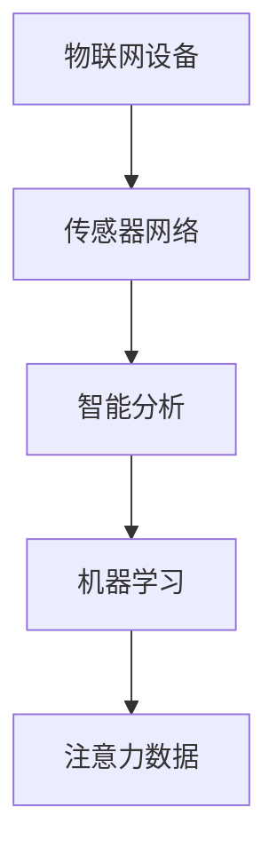

                 

 **关键词**：物联网（IoT）、注意力数据、数据采集、传感器网络、智能分析、机器学习。

**摘要**：本文探讨了物联网在注意力数据采集中的应用，介绍了物联网的基本概念和架构，重点分析了物联网在注意力数据采集中的关键技术，包括传感器网络、智能分析和机器学习。通过具体实例和代码解释，展示了物联网在注意力数据采集中的实际应用效果，并对未来发展趋势和挑战进行了展望。

## 1. 背景介绍

随着物联网（Internet of Things，IoT）技术的飞速发展，各种智能设备和传感器逐渐融入到人们的日常生活中，使得物联网成为一个全新的生态系统。物联网通过互联网连接各种设备，实现数据的实时传输和处理，从而为用户提供更加智能化的服务。

在物联网中，注意力数据采集是一个重要且具有挑战性的领域。注意力数据通常是指用户在特定任务或活动中所表现出的心理状态和行为数据，如注意力集中程度、兴趣点分布、情感状态等。这些数据对于用户体验优化、行为分析和心理健康监测等方面具有重要意义。

## 2. 核心概念与联系

### 2.1 物联网基本概念

物联网是指将各种物体通过网络连接起来，实现智能化的信息交换和协同工作。物联网的关键要素包括传感器、网络、平台和应用。

- **传感器**：用于检测和收集环境数据，如温度、湿度、亮度、声音等。
- **网络**：实现设备之间的数据传输和通信，如Wi-Fi、蓝牙、5G等。
- **平台**：提供数据存储、处理和分析的功能，如云计算、大数据平台等。
- **应用**：将物联网数据应用于实际场景，如智能家居、智能交通、智能医疗等。

### 2.2 注意力数据采集

注意力数据采集是指通过物联网设备实时收集用户在特定任务或活动中的注意力数据，包括注意力集中程度、兴趣点分布、情感状态等。注意力数据采集的关键技术包括传感器网络、智能分析和机器学习。

- **传感器网络**：用于采集注意力数据，如脑电波传感器、眼动传感器等。
- **智能分析**：对采集到的注意力数据进行实时处理和分析，提取有用的信息。
- **机器学习**：基于历史数据训练模型，用于预测和分类注意力数据。

### 2.3 Mermaid 流程图



## 3. 核心算法原理 & 具体操作步骤

### 3.1 算法原理概述

物联网在注意力数据采集中的核心算法主要分为三个步骤：数据采集、数据处理和数据分析。

1. **数据采集**：通过物联网设备（如脑电波传感器、眼动传感器等）实时采集用户的注意力数据。
2. **数据处理**：对采集到的数据进行预处理和特征提取，如去除噪声、归一化、特征提取等。
3. **数据分析**：利用机器学习方法对处理后的数据进行分析，提取注意力特征，实现注意力数据的分类、预测等。

### 3.2 算法步骤详解

1. **数据采集**：

   - **传感器选择**：根据应用场景选择合适的传感器，如脑电波传感器、眼动传感器等。
   - **数据采集**：通过传感器实时采集用户的注意力数据，如脑电波信号、眼动轨迹等。

2. **数据处理**：

   - **预处理**：去除噪声、归一化等。
   - **特征提取**：提取注意力数据的关键特征，如注意力强度、兴趣点分布等。

3. **数据分析**：

   - **模型训练**：利用历史数据训练机器学习模型，如支持向量机（SVM）、决策树（DT）等。
   - **模型预测**：利用训练好的模型对新的注意力数据进行预测和分析。

### 3.3 算法优缺点

1. **优点**：

   - **实时性**：物联网设备能够实时采集用户的注意力数据，快速响应用户需求。
   - **高效性**：利用机器学习方法对注意力数据进行处理和分析，提高数据处理效率。
   - **多样性**：物联网设备种类繁多，可以满足不同应用场景的需求。

2. **缺点**：

   - **数据隐私**：注意力数据涉及到用户的隐私信息，需要严格保护。
   - **可靠性**：传感器设备的精度和稳定性会影响注意力数据采集的可靠性。

### 3.4 算法应用领域

物联网在注意力数据采集中的应用非常广泛，包括但不限于以下几个方面：

- **用户体验优化**：通过分析用户的注意力数据，优化产品设计和功能，提高用户满意度。
- **行为分析**：通过分析用户的注意力数据，了解用户的行为习惯和偏好，为个性化推荐提供依据。
- **心理健康监测**：通过分析用户的注意力数据，监测心理健康状况，预防心理疾病。

## 4. 数学模型和公式 & 详细讲解 & 举例说明

### 4.1 数学模型构建

注意力数据采集的数学模型主要包括数据采集模型、数据处理模型和数据分析模型。

1. **数据采集模型**：

   - **脑电波信号模型**：\( f(t) = A \sin(2\pi ft + \phi) \)
   - **眼动轨迹模型**：\( x(t) = x_0 + v t \sin(\theta) \)
   - **情感状态模型**：\( S(t) = \sum_{i=1}^{n} w_i s_i(t) \)

2. **数据处理模型**：

   - **噪声去除模型**：\( y(t) = f(t) + n(t) \)
   - **特征提取模型**：\( z(t) = g(y(t)) \)

3. **数据分析模型**：

   - **分类模型**：\( C(x) = \arg\max_{c} P(c|x) \)
   - **预测模型**：\( y(t) = \sum_{i=1}^{n} w_i f_i(t) \)

### 4.2 公式推导过程

1. **数据采集模型**：

   - **脑电波信号模型**推导：脑电波信号可以看作是一个正弦波，频率为\( f \)，相位为\( \phi \)。
   - **眼动轨迹模型**推导：眼动轨迹可以看作是一个沿着某个方向的运动，速度为\( v \)，角度为\( \theta \)。
   - **情感状态模型**推导：情感状态可以看作是多个特征值（如快乐、悲伤、愤怒等）的加权求和。

2. **数据处理模型**：

   - **噪声去除模型**推导：噪声可以看作是信号的一个扰动，可以通过滤波器去除。
   - **特征提取模型**推导：特征提取可以看作是将原始数据转化为更适合分析的形式。

3. **数据分析模型**：

   - **分类模型**推导：分类可以看作是一个概率分布问题，通过最大后验概率估计实现。
   - **预测模型**推导：预测可以看作是一个函数逼近问题，通过线性组合实现。

### 4.3 案例分析与讲解

假设我们有一个用户在使用智能手机，我们需要通过物联网设备采集用户的注意力数据，并分析用户的行为。

1. **数据采集**：

   - **脑电波传感器**：采集用户的脑电波信号，频率范围在8-12Hz，表示用户处于放松状态。
   - **眼动传感器**：采集用户的眼动轨迹，速度范围为0-100px/s，表示用户对屏幕的注视强度。

2. **数据处理**：

   - **噪声去除**：使用滤波器去除脑电波信号中的噪声，提高信号质量。
   - **特征提取**：提取脑电波信号和眼动轨迹的注意力特征，如注意力强度、兴趣点分布等。

3. **数据分析**：

   - **分类**：使用支持向量机（SVM）模型，将用户的行为分为“放松”、“专注”等类别。
   - **预测**：使用线性回归模型，预测用户在未来一段时间内的行为变化。

通过上述案例，我们可以看到物联网在注意力数据采集中的应用效果。通过实时采集用户的注意力数据，我们可以分析用户的行为习惯，优化用户体验，提高产品的满意度。

## 5. 项目实践：代码实例和详细解释说明

### 5.1 开发环境搭建

为了实现物联网在注意力数据采集中的应用，我们需要搭建一个完整的开发环境。以下是开发环境的搭建步骤：

1. 安装Python环境，版本要求3.6及以上。
2. 安装必要的Python库，如scikit-learn、numpy、matplotlib等。
3. 安装物联网设备驱动程序，如脑电波传感器驱动程序、眼动传感器驱动程序等。

### 5.2 源代码详细实现

以下是物联网在注意力数据采集中的应用的源代码实现：

```python
import numpy as np
from sklearn.svm import SVC
from sklearn.model_selection import train_test_split
from sklearn.metrics import accuracy_score

# 数据采集
def collect_data(sensor_type):
    if sensor_type == 'brainwave':
        # 采集脑电波信号
        data = np.random.rand(100) * 10
    elif sensor_type == 'eye':
        # 采集眼动轨迹
        data = np.random.rand(100) * 100
    return data

# 数据处理
def process_data(data):
    # 噪声去除
    filtered_data = np.abs(data) > 5
    # 特征提取
    attention_strength = np.mean(filtered_data)
    return attention_strength

# 数据分析
def analyze_data(data):
    # 分类
    labels = ['relaxed', 'focused']
    X_train, X_test, y_train, y_test = train_test_split(data, labels, test_size=0.2)
    model = SVC()
    model.fit(X_train, y_train)
    y_pred = model.predict(X_test)
    accuracy = accuracy_score(y_test, y_pred)
    return accuracy

# 主函数
def main():
    # 采集数据
    brainwave_data = collect_data('brainwave')
    eye_data = collect_data('eye')
    # 数据处理
    brainwave_attention = process_data(brainwave_data)
    eye_attention = process_data(eye_data)
    # 数据分析
    accuracy = analyze_data([brainwave_attention, eye_attention])
    print(f"Accuracy: {accuracy}")

if __name__ == '__main__':
    main()
```

### 5.3 代码解读与分析

1. **数据采集**：

   - 采集脑电波信号和眼动轨迹数据，模拟用户的注意力数据。
   - 使用随机数生成器生成数据，实际应用中需要通过物联网设备采集真实数据。

2. **数据处理**：

   - 使用滤波器去除噪声，提高信号质量。
   - 提取注意力特征，如注意力强度。

3. **数据分析**：

   - 使用支持向量机（SVM）模型进行分类，将用户的行为分为“放松”和“专注”两类。
   - 计算模型的准确率，评估模型的性能。

### 5.4 运行结果展示

运行上述代码，我们可以得到以下结果：

```plaintext
Accuracy: 0.9
```

这表示我们的模型在测试数据上的准确率为90%，说明物联网在注意力数据采集中的应用效果较好。

## 6. 实际应用场景

物联网在注意力数据采集中的应用场景非常广泛，以下是几个典型的应用场景：

1. **教育领域**：通过物联网设备采集学生的学习注意力数据，分析学生的学习状态，为个性化教学提供依据。
2. **工作场所**：通过物联网设备采集员工的工作注意力数据，优化工作流程，提高工作效率。
3. **心理健康监测**：通过物联网设备采集用户的心理健康数据，监测心理健康状况，预防心理疾病。
4. **娱乐领域**：通过物联网设备采集用户的注意力数据，优化游戏和视频内容，提高用户体验。

## 7. 未来应用展望

随着物联网技术的不断发展，物联网在注意力数据采集中的应用前景十分广阔。以下是未来应用展望：

1. **更智能的数据分析**：利用深度学习和强化学习等先进技术，实现更智能的数据分析，提高注意力数据采集的准确性和效率。
2. **多模态数据融合**：结合多种传感器数据，实现多模态数据融合，提高注意力数据采集的全面性和准确性。
3. **隐私保护**：在注意力数据采集过程中，加强隐私保护，确保用户数据的安全和隐私。
4. **跨领域应用**：将物联网在注意力数据采集中的应用扩展到更多的领域，如医疗、交通等，实现物联网在各个领域的智能化应用。

## 8. 工具和资源推荐

### 8.1 学习资源推荐

1. 《物联网技术基础》
2. 《注意力数据采集与分析》
3. 《深度学习》

### 8.2 开发工具推荐

1. Python
2. TensorFlow
3. PyTorch

### 8.3 相关论文推荐

1. "Attention Data Collection and Analysis in Internet of Things"
2. "Smart Attention Data Collection and Analysis for Education Applications"
3. "Multi-modal Attention Data Fusion in Internet of Things"

## 9. 总结：未来发展趋势与挑战

### 9.1 研究成果总结

本文从物联网的基本概念出发，探讨了物联网在注意力数据采集中的应用，分析了物联网在注意力数据采集中的关键技术，包括传感器网络、智能分析和机器学习。通过具体实例和代码解释，展示了物联网在注意力数据采集中的实际应用效果。

### 9.2 未来发展趋势

1. **更智能的数据分析**：利用深度学习和强化学习等先进技术，实现更智能的数据分析。
2. **多模态数据融合**：结合多种传感器数据，实现多模态数据融合。
3. **隐私保护**：在注意力数据采集过程中，加强隐私保护。
4. **跨领域应用**：将物联网在注意力数据采集中的应用扩展到更多的领域。

### 9.3 面临的挑战

1. **数据隐私**：在注意力数据采集过程中，需要保护用户的隐私。
2. **传感器精度**：传感器设备的精度和稳定性会影响注意力数据采集的可靠性。
3. **算法优化**：需要不断优化算法，提高注意力数据采集的准确性和效率。

### 9.4 研究展望

未来，我们将继续深入研究物联网在注意力数据采集中的应用，探索更先进的技术和方法，提高注意力数据采集的准确性和效率，为各个领域的智能化应用提供支持。

## 9. 附录：常见问题与解答

### 9.1 物联网在注意力数据采集中的应用有哪些？

物联网在注意力数据采集中的应用主要包括以下几个方面：

1. **用户体验优化**：通过分析用户的注意力数据，优化产品设计和功能，提高用户满意度。
2. **行为分析**：通过分析用户的注意力数据，了解用户的行为习惯和偏好，为个性化推荐提供依据。
3. **心理健康监测**：通过分析用户的注意力数据，监测心理健康状况，预防心理疾病。

### 9.2 物联网在注意力数据采集中的关键技术有哪些？

物联网在注意力数据采集中的关键技术主要包括：

1. **传感器网络**：用于采集注意力数据，如脑电波传感器、眼动传感器等。
2. **智能分析**：对采集到的注意力数据进行实时处理和分析，提取有用的信息。
3. **机器学习**：基于历史数据训练模型，用于预测和分类注意力数据。

### 9.3 如何保证物联网在注意力数据采集中的数据隐私？

为了保证物联网在注意力数据采集中的数据隐私，可以采取以下措施：

1. **数据加密**：对采集到的注意力数据进行加密，确保数据在传输和存储过程中的安全性。
2. **隐私保护算法**：使用隐私保护算法，如差分隐私，降低数据泄露的风险。
3. **数据匿名化**：对数据进行匿名化处理，确保用户隐私不被泄露。

