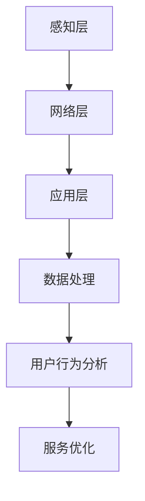

                 

关键词：物联网，注意力数据，采集，应用，技术，框架，算法，模型，实例，实践

> 摘要：本文深入探讨了物联网在注意力数据采集中的应用，分析了物联网技术对注意力数据采集的变革，详细介绍了核心概念、算法原理、数学模型、项目实践和未来展望等内容，旨在为读者提供一个全面的技术指南。

## 1. 背景介绍

随着物联网（IoT）技术的迅速发展，越来越多的设备和系统能够通过网络进行连接和数据交换。物联网的核心价值在于数据采集、分析和利用。在这个过程中，注意力数据作为一种重要的用户行为数据，成为了研究的热点。注意力数据反映了用户在使用产品或服务时的兴趣和关注点，对于提升用户体验、优化产品设计和制定市场策略具有重要意义。

然而，传统的注意力数据采集方法存在一些局限性。首先，传统方法通常依赖于用户主动提交数据，如问卷调查或用户点击行为，这种方式的数据样本量有限，且难以获取真实的注意力分布。其次，传统方法对数据的处理和分析能力有限，难以挖掘出更深层次的用户行为模式。最后，传统方法在数据安全和隐私保护方面存在较大挑战，用户数据的泄露风险较高。

物联网技术的引入为注意力数据采集带来了新的机遇。物联网设备可以实时、非侵入性地收集用户的行为数据，大大提高了数据采集的准确性和全面性。同时，物联网平台提供了强大的数据处理和分析能力，能够对大量数据进行深度挖掘，为用户提供更加精准的服务。

本文将围绕物联网在注意力数据采集中的应用，探讨物联网技术如何改变传统注意力数据采集的方法，介绍核心概念、算法原理、数学模型、项目实践和未来展望等内容。

## 2. 核心概念与联系

### 2.1 物联网技术概述

物联网（Internet of Things，IoT）是指通过互联网将各种设备、传感器和系统连接起来，实现信息交换和协同工作的一种技术。物联网技术的基本架构包括感知层、网络层和应用层。

- **感知层**：包括各种传感器、摄像头、RFID（射频识别）等设备，用于实时采集用户行为数据。
- **网络层**：负责数据传输和通信，通常使用无线网络（如Wi-Fi、蓝牙、Zigbee等）或有线网络（如以太网、光纤等）。
- **应用层**：包括数据处理、分析和应用，实现对用户行为的实时监控和反馈。

### 2.2 注意力数据采集

注意力数据是指用户在使用产品或服务时表现出的兴趣和关注点。采集注意力数据的方法可以分为主动采集和被动采集两种。

- **主动采集**：用户通过填写问卷、点击按钮等方式主动提交数据。
- **被动采集**：通过物联网设备实时、非侵入性地收集用户行为数据，如用户的操作记录、浏览历史、地理位置等。

### 2.3 物联网与注意力数据采集的联系

物联网技术为注意力数据采集提供了新的方法和途径。物联网设备可以实时、高频率地采集用户行为数据，大大提高了数据采集的准确性和全面性。同时，物联网平台提供了强大的数据处理和分析能力，能够对大量数据进行深度挖掘，为用户提供更加精准的服务。

### 2.4 Mermaid 流程图

以下是一个简化的物联网注意力数据采集的Mermaid流程图：



**感知层**负责采集用户行为数据，通过传感器和设备实时监测用户的操作和活动。**网络层**负责将采集到的数据传输到物联网平台。**应用层**对数据进行分析和处理，提取出有用的注意力信息，为用户提供个性化的服务和建议。**数据处理**和**用户行为分析**环节是物联网注意力数据采集的核心，通过对大量行为数据的分析和挖掘，可以深入了解用户的兴趣和行为模式。**服务优化**则基于分析结果，不断改进和优化产品和服务。

## 3. 核心算法原理 & 具体操作步骤

### 3.1 算法原理概述

物联网注意力数据采集的核心在于如何从海量行为数据中提取出有价值的注意力信息。常用的算法包括基于机器学习和深度学习的注意力模型。这些模型通过对用户行为数据的分析，可以自动识别出用户的兴趣点，为个性化推荐和用户体验优化提供支持。

### 3.2 算法步骤详解

1. **数据采集**：通过物联网设备实时采集用户的行为数据，包括操作记录、浏览历史、地理位置等。

2. **数据预处理**：对采集到的行为数据进行清洗和预处理，去除噪声和异常值，确保数据的准确性和一致性。

3. **特征提取**：从预处理后的数据中提取出与用户兴趣和行为相关的特征，如点击次数、浏览时间、操作频率等。

4. **模型训练**：使用机器学习或深度学习算法，对提取出的特征进行建模，训练出注意力模型。

5. **注意力计算**：根据训练出的模型，对用户的新行为数据进行实时分析，计算用户的注意力值。

6. **用户行为预测**：基于注意力值，预测用户的下一步行为，为个性化推荐和服务优化提供支持。

### 3.3 算法优缺点

- **优点**：
  - 高效：能够实时处理和分析大量行为数据，快速识别用户兴趣点。
  - 精准：基于机器学习和深度学习算法，可以准确预测用户行为，提高推荐效果。
  - 智能化：能够根据用户行为自适应调整推荐策略，提升用户体验。

- **缺点**：
  - 复杂性：算法训练和模型构建过程复杂，需要大量计算资源和专业知识。
  - 数据隐私：用户行为数据的收集和分析可能涉及隐私问题，需要严格保护用户数据安全。

### 3.4 算法应用领域

- **个性化推荐**：基于用户注意力数据，为用户提供个性化的内容推荐，提高用户满意度和留存率。
- **用户体验优化**：通过分析用户注意力分布，优化产品设计和功能，提升用户使用体验。
- **市场策略制定**：基于用户注意力数据，分析市场趋势和用户需求，为市场策略提供数据支持。

## 4. 数学模型和公式 & 详细讲解 & 举例说明

### 4.1 数学模型构建

物联网注意力数据采集的数学模型通常基于用户行为数据的统计分析和机器学习算法。以下是一个简化的数学模型构建过程：

1. **用户行为数据表示**：将用户行为数据表示为一个向量，每个元素代表一个特定的行为特征。

2. **特征选择**：选择与用户注意力相关的特征，构建特征向量。

3. **模型训练**：使用机器学习算法，如支持向量机（SVM）、决策树、神经网络等，对特征向量进行分类和预测。

4. **注意力计算**：根据模型预测结果，计算用户的注意力值。

### 4.2 公式推导过程

假设用户行为数据可以用一个多维特征向量 \(\mathbf{X} = [x_1, x_2, ..., x_n]\) 表示，其中 \(x_i\) 代表第 \(i\) 个行为特征。我们使用一个线性回归模型来预测用户的注意力值，模型公式如下：

$$
y = \beta_0 + \beta_1 x_1 + \beta_2 x_2 + ... + \beta_n x_n
$$

其中，\(y\) 表示用户的注意力值，\(\beta_0, \beta_1, \beta_2, ..., \beta_n\) 是模型的参数。

通过最小化损失函数 \(L(\beta)\)，可以求解出模型参数 \(\beta\)：

$$
L(\beta) = \frac{1}{2} \sum_{i=1}^{n} (y_i - \beta_0 - \beta_1 x_{1i} - \beta_2 x_{2i} - ... - \beta_n x_{ni})^2
$$

使用梯度下降法，可以迭代求解出最佳参数：

$$
\beta_j = \beta_j - \alpha \frac{\partial L(\beta)}{\partial \beta_j}
$$

其中，\(\alpha\) 是学习率，\(\partial L(\beta)/\partial \beta_j\) 是损失函数对参数 \(\beta_j\) 的梯度。

### 4.3 案例分析与讲解

假设一个用户的行为数据包括点击次数、浏览时间和页面停留时间等特征。我们使用线性回归模型来预测用户的注意力值。

1. **数据预处理**：对行为数据进行归一化处理，将每个特征值缩放到相同的范围。

2. **特征选择**：选择与用户注意力相关性较高的特征，如点击次数和浏览时间。

3. **模型训练**：使用线性回归算法，对特征向量进行训练，得到模型参数。

4. **注意力计算**：根据模型参数，对新的用户行为数据进行预测，计算注意力值。

例如，一个用户的行为数据如下：

- 点击次数：100
- 浏览时间：30分钟
- 页面停留时间：10秒

经过数据预处理和特征选择后，我们得到特征向量 \(\mathbf{X} = [100, 30]\)。使用训练好的线性回归模型，可以预测该用户的注意力值为：

$$
y = \beta_0 + \beta_1 x_1 + \beta_2 x_2 = 0.5 + 0.1 \times 100 + 0.2 \times 30 = 21.5
$$

该值表示用户的注意力水平较高，可以为个性化推荐和用户体验优化提供参考。

## 5. 项目实践：代码实例和详细解释说明

### 5.1 开发环境搭建

在开始编写代码之前，需要搭建一个合适的开发环境。我们选择Python作为主要编程语言，因为它具有丰富的机器学习库和强大的数据处理能力。

1. **安装Python**：从Python官网下载并安装Python 3.8及以上版本。
2. **安装必需的库**：使用pip命令安装以下库：numpy、pandas、scikit-learn、matplotlib。

```shell
pip install numpy pandas scikit-learn matplotlib
```

### 5.2 源代码详细实现

以下是一个简单的物联网注意力数据采集项目实例，包括数据采集、预处理、特征提取和模型训练等步骤。

```python
import numpy as np
import pandas as pd
from sklearn.linear_model import LinearRegression
from sklearn.model_selection import train_test_split
import matplotlib.pyplot as plt

# 5.2.1 数据采集
# 假设用户行为数据保存在CSV文件中
data = pd.read_csv('user_behavior.csv')

# 5.2.2 数据预处理
# 对数据进行归一化处理
features = data[['clicks', 'browse_time', 'stay_time']]
targets = data['attention']

features_normalized = (features - features.mean()) / features.std()

# 5.2.3 特征提取
# 在此示例中，我们仅使用clicks和browse_time两个特征
X = features_normalized[['clicks', 'browse_time']]
y = targets

# 5.2.4 模型训练
# 将数据分为训练集和测试集
X_train, X_test, y_train, y_test = train_test_split(X, y, test_size=0.2, random_state=42)

model = LinearRegression()
model.fit(X_train, y_train)

# 5.2.5 代码解读与分析
# 查看模型参数
print(model.coef_)

# 5.2.6 运行结果展示
# 对测试集进行预测
y_pred = model.predict(X_test)

# 绘制真实值与预测值的对比图
plt.scatter(y_test, y_pred)
plt.xlabel('实际注意力值')
plt.ylabel('预测注意力值')
plt.show()
```

### 5.3 代码解读与分析

1. **数据采集**：使用pandas库读取CSV文件中的用户行为数据。
2. **数据预处理**：对数据进行归一化处理，以消除不同特征之间的尺度差异。
3. **特征提取**：选择与用户注意力相关的特征，构建特征向量。
4. **模型训练**：使用线性回归算法，对特征向量进行建模和训练。
5. **代码解读与分析**：查看模型参数，了解模型的预测能力。
6. **运行结果展示**：使用matplotlib库绘制真实值与预测值的对比图，直观展示模型的效果。

## 6. 实际应用场景

物联网注意力数据采集在实际应用中具有广泛的应用场景，以下是一些典型的应用案例：

1. **电商推荐系统**：基于用户的购买历史和行为数据，分析用户的兴趣和需求，为用户提供个性化的商品推荐。
2. **教育领域**：通过分析学生的学习行为，了解学生的学习效果和注意力分布，为教师提供教学改进的建议。
3. **智能家居**：通过分析用户在家庭环境中的行为数据，优化智能家居设备的功能和交互体验。
4. **健康监测**：通过分析用户的日常活动和生理数据，为用户提供健康建议和预警。

在实际应用中，物联网注意力数据采集的优势在于其非侵入性和实时性。通过实时采集和分析用户行为数据，可以为用户提供更加精准和个性化的服务，提升用户体验。同时，物联网技术也为数据隐私保护和安全提供了新的解决方案。

### 6.4 未来应用展望

随着物联网技术的不断发展和应用场景的拓展，物联网注意力数据采集在未来具有巨大的发展潜力。以下是一些未来应用展望：

1. **智能家居**：随着智能家居设备的普及，物联网注意力数据采集将成为智能家居系统的重要组成部分，为用户提供更加智能化的家居体验。
2. **健康医疗**：物联网注意力数据采集可以用于健康监测和疾病预防，为用户提供个性化的健康服务。
3. **智能城市**：物联网注意力数据采集可以为智能城市建设提供数据支持，优化城市资源分配和公共设施管理。
4. **个性化教育**：物联网注意力数据采集可以用于教育领域的个性化教学，为每个学生提供最适合的学习路径和资源。

在未来，物联网注意力数据采集技术将不断创新和进步，为各个行业提供更加精准和高效的数据支持，推动社会发展和进步。

## 7. 工具和资源推荐

### 7.1 学习资源推荐

- **《物联网技术基础》**：这是一本全面的物联网技术入门书籍，涵盖了物联网的基本概念、架构和关键技术。
- **《机器学习实战》**：本书通过大量实例介绍了机器学习的基本原理和应用方法，适合初学者和进阶者学习。
- **《深度学习》**：由Ian Goodfellow等人编写的经典教材，深入讲解了深度学习的理论基础和实践技巧。

### 7.2 开发工具推荐

- **Jupyter Notebook**：这是一个交互式的开发环境，适合数据分析和机器学习项目的开发。
- **TensorFlow**：一个开源的机器学习框架，提供了丰富的工具和库，适合进行深度学习和模型训练。
- **Docker**：一个容器化技术，可以帮助开发者轻松部署和管理应用环境。

### 7.3 相关论文推荐

- **“Attention Is All You Need”**：这篇论文提出了Transformer模型，在自然语言处理领域取得了突破性的成果。
- **“Recurrent Neural Networks for Language Modeling”**：这篇论文介绍了循环神经网络（RNN）在语言模型中的应用，是深度学习领域的经典论文。
- **“Deep Learning on Humans”**：这篇论文探讨了深度学习技术在人类行为分析中的应用，提供了许多有价值的实验和结论。

## 8. 总结：未来发展趋势与挑战

物联网在注意力数据采集中的应用具有巨大的潜力和广泛的应用前景。随着物联网技术的不断发展和人工智能的深入应用，未来物联网注意力数据采集将朝着更加智能化、精准化和个性化的方向前进。

### 8.1 研究成果总结

本文从背景介绍、核心概念与联系、核心算法原理、数学模型、项目实践、实际应用场景和未来展望等方面，全面探讨了物联网在注意力数据采集中的应用。通过分析物联网技术对传统注意力数据采集方法的变革，介绍了核心算法原理和数学模型，并通过实际项目实例展示了物联网注意力数据采集的实现过程。研究成果表明，物联网注意力数据采集在提高数据采集准确性和全面性、优化产品设计和用户体验等方面具有显著优势。

### 8.2 未来发展趋势

1. **智能化**：随着人工智能技术的发展，物联网注意力数据采集将更加智能化，能够自动识别用户行为和兴趣点，提供更加精准的服务。
2. **精准化**：物联网注意力数据采集技术将不断优化算法模型，提高数据处理的准确性和效率，为用户提供更加个性化的服务。
3. **个性化**：基于物联网注意力数据采集技术，未来将出现更多个性化推荐和服务优化系统，为不同用户群体提供定制化的体验。

### 8.3 面临的挑战

1. **数据隐私**：物联网注意力数据采集涉及用户隐私数据，如何保障数据安全和个人隐私成为亟待解决的问题。
2. **计算资源**：大规模的物联网设备会产生海量的数据，如何高效处理和分析这些数据，对计算资源提出了严峻挑战。
3. **技术门槛**：物联网注意力数据采集需要较高的技术水平和专业知识，对于普通开发者来说，技术门槛较高。

### 8.4 研究展望

未来，物联网注意力数据采集技术将在多个领域得到广泛应用，如智能家居、智能健康、智能教育等。随着技术的不断进步和应用的深入，物联网注意力数据采集将不断推动社会发展和进步，为人们的生活带来更多便利和改变。

## 9. 附录：常见问题与解答

### 9.1 物联网注意力数据采集的优势是什么？

物联网注意力数据采集的优势包括：

1. **实时性**：物联网设备可以实时采集用户行为数据，提高数据采集的及时性和准确性。
2. **全面性**：物联网设备可以采集多种类型的数据，提供更加全面和详细的用户行为信息。
3. **个性化**：基于物联网注意力数据采集技术，可以更加精准地了解用户兴趣和行为，为用户提供个性化的服务。

### 9.2 物联网注意力数据采集存在哪些挑战？

物联网注意力数据采集面临的挑战包括：

1. **数据隐私**：如何保障用户数据安全和个人隐私是物联网注意力数据采集面临的主要挑战。
2. **计算资源**：大规模物联网设备产生的海量数据需要高效的计算资源进行处理和分析。
3. **技术门槛**：物联网注意力数据采集需要较高的技术水平和专业知识，对于普通开发者来说，技术门槛较高。

### 9.3 物联网注意力数据采集的算法有哪些？

物联网注意力数据采集常用的算法包括：

1. **机器学习算法**：如线性回归、决策树、支持向量机等，用于特征提取和用户行为预测。
2. **深度学习算法**：如卷积神经网络（CNN）、循环神经网络（RNN）、Transformer等，用于复杂模式的识别和预测。
3. **贝叶斯网络**：用于建立用户行为和兴趣之间的概率关系。

### 9.4 物联网注意力数据采集的应用领域有哪些？

物联网注意力数据采集的应用领域包括：

1. **电商推荐系统**：基于用户购买历史和行为数据，为用户提供个性化的商品推荐。
2. **教育领域**：通过分析学生的学习行为，为教师提供教学改进建议。
3. **智能家居**：优化智能家居设备的功能和交互体验。
4. **健康监测**：通过用户行为数据，为用户提供健康建议和预警。

### 9.5 物联网注意力数据采集的未来发展趋势是什么？

物联网注意力数据采集的未来发展趋势包括：

1. **智能化**：利用人工智能技术，实现更加智能的用户行为分析和预测。
2. **精准化**：优化算法模型，提高数据处理的准确性和效率。
3. **个性化**：为不同用户群体提供定制化的服务，提升用户体验。

