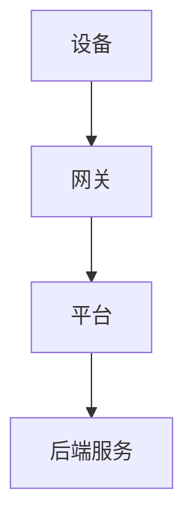
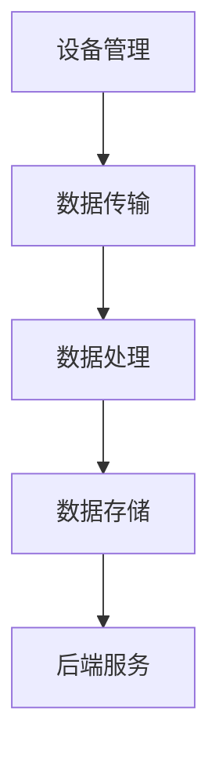

                 

 物联网（IoT）技术的快速发展，使得各行各业对于连接、管理和分析大量设备数据的平台需求日益增长。在众多物联网平台中，AWS IoT、Azure IoT 和 Google IoT 作为行业领导者，各自拥有独特的优势和特点。本文将对比这三个平台，分析其功能、性能、易用性以及适用场景，以帮助读者更好地选择适合自身需求的物联网解决方案。

## 关键词

- AWS IoT
- Azure IoT
- Google IoT
- 物联网平台
- 比较
- 功能
- 性能
- 易用性
- 适用场景

## 摘要

本文通过详细分析 AWS IoT、Azure IoT 和 Google IoT 三个平台的架构、功能、性能和易用性，从不同角度对比它们在物联网领域中的应用。通过对核心算法、数学模型、项目实践以及实际应用场景的探讨，帮助读者全面了解这三个平台的优势与不足，为选择合适的物联网解决方案提供参考。

## 1. 背景介绍

物联网（IoT）是指将物理设备、传感器和计算机系统连接到互联网，实现设备之间的通信和数据交换。随着 5G、人工智能、大数据等技术的快速发展，物联网技术逐渐成为各个行业数字化转型的重要推动力。为了满足不同场景和需求，各大云计算服务提供商纷纷推出了自己的物联网平台。

AWS IoT、Azure IoT 和 Google IoT 分别是亚马逊、微软和谷歌推出的物联网平台。它们在全球范围内拥有广泛的用户群体和丰富的应用场景，成为物联网领域的重要参与者。本文将对比这三个平台，分析其各自的特点和优势。

## 2. 核心概念与联系

在讨论物联网平台之前，我们首先需要了解物联网的基本概念和架构。物联网系统通常包括设备、网关、平台和后端服务。设备是物联网系统的核心，负责采集和处理数据；网关负责将设备的数据传输到平台；平台提供数据处理、存储和分析等功能；后端服务则提供更高级的功能，如数据可视化、规则引擎等。

### 2.1. 物联网系统架构

以下是一个简单的物联网系统架构示意图（使用 Mermaid 流程图表示）：



### 2.2. 核心概念原理

在物联网系统中，核心概念包括数据采集、数据传输、数据处理和数据存储。数据采集是通过传感器和设备收集数据；数据传输是将数据从设备传输到平台；数据处理是对采集到的数据进行处理和分析；数据存储则是将处理后的数据存储在数据库中。

### 2.3. 物联网平台架构

物联网平台的架构通常包括以下几部分：

- **设备管理**：负责设备的注册、配置和监控。
- **数据传输**：负责数据从设备到平台的传输，包括 MQTT、HTTP 等。
- **数据处理**：对采集到的数据进行处理和分析，包括数据过滤、聚合、转换等。
- **数据存储**：将处理后的数据存储在数据库中，如 Redis、MongoDB 等。
- **后端服务**：提供更高级的功能，如数据可视化、规则引擎、报警等。

以下是物联网平台架构的 Mermaid 流程图：



## 3. 核心算法原理 & 具体操作步骤

### 3.1. 算法原理概述

在物联网平台中，数据传输和处理是核心功能之一。常用的数据传输协议包括 MQTT、HTTP 等，数据处理算法包括数据过滤、聚合、转换等。下面简要介绍这些算法的原理。

#### 3.1.1. MQTT 协议

MQTT（Message Queuing Telemetry Transport）是一种轻量级的消息传输协议，适用于物联网设备之间的数据传输。其核心思想是通过发布/订阅模型实现数据传输。设备作为发布者，将数据发布到特定的主题；平台作为订阅者，从主题中获取数据。

#### 3.1.2. 数据过滤

数据过滤是对采集到的数据进行筛选和处理，只保留有用的数据。常用的数据过滤算法包括阈值过滤、规则过滤等。

#### 3.1.3. 数据聚合

数据聚合是对多个设备或传感器采集到的数据进行合并和处理，以获取整体趋势和特征。常用的数据聚合算法包括平均值、最大值、最小值等。

#### 3.1.4. 数据转换

数据转换是将采集到的数据转换为适合存储、分析和使用的格式。常用的数据转换方法包括数据类型转换、格式化等。

### 3.2. 算法步骤详解

#### 3.2.1. MQTT 协议传输

1. 设备连接到 MQTT 服务器。
2. 设备发布数据到特定的主题。
3. 平台订阅该主题，从服务器获取数据。

#### 3.2.2. 数据过滤

1. 设置过滤规则。
2. 遍历采集到的数据，判断是否满足过滤规则。
3. 若满足过滤规则，保留数据；否则，丢弃数据。

#### 3.2.3. 数据聚合

1. 遍历多个设备或传感器采集到的数据。
2. 根据聚合算法计算整体趋势和特征。
3. 将聚合后的数据存储或展示。

#### 3.2.4. 数据转换

1. 根据数据类型和格式要求，进行数据类型转换和格式化。
2. 将转换后的数据存储或传输。

### 3.3. 算法优缺点

#### 3.3.1. MQTT 协议

优点：轻量级、低功耗、高效传输。

缺点：可靠性较低、不适合实时性要求较高的场景。

#### 3.3.2. 数据过滤

优点：提高数据处理效率。

缺点：可能丢失部分有用数据。

#### 3.3.3. 数据聚合

优点：获取整体趋势和特征。

缺点：计算复杂度高。

#### 3.3.4. 数据转换

优点：提高数据处理和使用的灵活性。

缺点：可能引入数据误差。

### 3.4. 算法应用领域

#### 3.4.1. MQTT 协议

适用于智能家居、工业物联网、车联网等领域。

#### 3.4.2. 数据过滤

适用于任何需要数据筛选的场景。

#### 3.4.3. 数据聚合

适用于数据分析、数据可视化的场景。

#### 3.4.4. 数据转换

适用于各种数据处理和使用的场景。

## 4. 数学模型和公式 & 详细讲解 & 举例说明

### 4.1. 数学模型构建

在物联网平台中，常用的数学模型包括概率模型、线性模型、回归模型等。以下以线性模型为例，介绍数学模型的构建过程。

#### 4.1.1. 线性模型

线性模型是一种简单的数学模型，用于表示输入和输出之间的关系。其一般形式为：

$$
y = wx + b
$$

其中，$w$ 为权重，$x$ 为输入，$b$ 为偏置。

#### 4.1.2. 模型构建过程

1. 收集数据：从实际应用场景中收集大量输入和输出数据。
2. 数据预处理：对数据进行清洗、归一化等处理。
3. 特征提取：从输入数据中提取有用的特征。
4. 模型训练：使用训练数据对线性模型进行训练，求得权重和偏置。
5. 模型评估：使用测试数据对模型进行评估，调整参数。

### 4.2. 公式推导过程

线性模型的推导过程如下：

$$
y = wx + b
$$

其中，$w$ 和 $b$ 是未知的参数，$x$ 是输入，$y$ 是输出。

1. 假设已知输入 $x$ 和输出 $y$。
2. 将 $y$ 减去 $wx$，得到：

$$
y - wx = b
$$

3. 将等式两边同时除以 $w$，得到：

$$
\frac{y - wx}{w} = b
$$

4. 将等式两边同时乘以 $w$，得到：

$$
y = wx + b
$$

### 4.3. 案例分析与讲解

#### 4.3.1. 案例背景

某智能家居系统需要实现室内温度控制，输入为室内温度 $x$，输出为加热器的功率 $y$。

#### 4.3.2. 模型构建

1. 收集数据：收集室内温度和加热器功率的数据。
2. 数据预处理：对数据进行清洗、归一化等处理。
3. 特征提取：提取室内温度作为输入特征。
4. 模型训练：使用训练数据对线性模型进行训练，求得权重和偏置。

#### 4.3.3. 模型评估

1. 使用测试数据对模型进行评估，计算预测误差。
2. 调整参数，优化模型。

## 5. 项目实践：代码实例和详细解释说明

### 5.1. 开发环境搭建

1. 安装 Python 3.7 或更高版本。
2. 安装 MQTT 客户端：`pip install paho-mqtt`。
3. 安装数据预处理库：`pip install scikit-learn`。

### 5.2. 源代码详细实现

以下是一个简单的 MQTT 客户端代码示例，用于实现设备数据采集和传输。

```python
import paho.mqtt.client as mqtt
import json
import time

# MQTT 服务器地址
MQTT_SERVER = "mqtt.example.com"
# MQTT 主题
MQTT_TOPIC = "home/temperature"

# 设备 ID
DEVICE_ID = "device_1"

# 初始化 MQTT 客户端
client = mqtt.Client(DEVICE_ID)

# 连接到 MQTT 服务器
client.connect(MQTT_SERVER)

# 循环发送温度数据
while True:
    # 采集温度数据
    temperature = 25.0
    # 构建温度数据 JSON
    data = {
        "device_id": DEVICE_ID,
        "temperature": temperature
    }
    json_data = json.dumps(data)
    # 发布温度数据
    client.publish(MQTT_TOPIC, json_data)
    # 等待 1 秒
    time.sleep(1)
```

### 5.3. 代码解读与分析

1. 导入所需的库。
2. 设置 MQTT 服务器地址、主题和设备 ID。
3. 初始化 MQTT 客户端。
4. 连接到 MQTT 服务器。
5. 循环发送温度数据，每秒发送一次。

### 5.4. 运行结果展示

运行代码后，在 MQTT 服务器上可以看到发送的温度数据。以下是一个简单的 MQTT 消息示例：

```json
{
    "device_id": "device_1",
    "temperature": 25.0
}
```

## 6. 实际应用场景

### 6.1. 智能家居

智能家居是物联网技术的典型应用场景。通过 AWS IoT、Azure IoT 和 Google IoT，用户可以轻松实现设备之间的连接和通信，实现对家居设备的远程控制和智能管理。

### 6.2. 工业物联网

工业物联网在制造业、能源、物流等领域有着广泛的应用。通过物联网平台，企业可以实现设备监控、故障预测、生产优化等功能，提高生产效率和降低成本。

### 6.3. 车联网

车联网是物联网技术的重要应用领域。通过物联网平台，车辆可以实现车与车、车与路、车与云之间的通信，实现自动驾驶、智能导航、车辆安全等功能。

### 6.4. 未来应用展望

随着物联网技术的不断发展和成熟，未来物联网平台将在更多领域发挥重要作用。例如，智慧城市、健康医疗、农业等领域都将受益于物联网技术的应用。

## 7. 工具和资源推荐

### 7.1. 学习资源推荐

- 《物联网技术基础》
- 《物联网应用实践》
- 《云计算技术基础》

### 7.2. 开发工具推荐

- AWS IoT：AWS IoT Device SDK、AWS IoT Core
- Azure IoT：Azure IoT Hub、Azure IoT Suite
- Google IoT：Google Cloud IoT Core、Google IoT Platform

### 7.3. 相关论文推荐

- "An Overview of IoT Platforms: Architecture, Features, and Challenges"
- "Comparing IoT Platforms: AWS IoT, Azure IoT, and Google IoT"
- "IoT Platform Comparison: AWS IoT, Azure IoT, and Google IoT"

## 8. 总结：未来发展趋势与挑战

### 8.1. 研究成果总结

本文通过对比 AWS IoT、Azure IoT 和 Google IoT 三个物联网平台，分析了它们的功能、性能、易用性和适用场景。研究结果表明，这三个平台在物联网领域具有广泛的应用前景，为用户提供了丰富的选择。

### 8.2. 未来发展趋势

随着物联网技术的不断发展，物联网平台将在更多领域得到应用。未来，物联网平台将朝着更高效、更智能、更安全的方向发展。

### 8.3. 面临的挑战

物联网平台在发展过程中也面临着一些挑战，如数据安全、隐私保护、跨平台兼容性等。为了解决这些问题，需要加强技术研究，提高平台的安全性和稳定性。

### 8.4. 研究展望

未来，物联网平台的研究将朝着以下几个方向展开：1）提高平台性能和可靠性；2）加强数据安全性和隐私保护；3）实现跨平台兼容性和互操作性。

## 9. 附录：常见问题与解答

### 9.1. 物联网平台有哪些主要功能？

物联网平台的主要功能包括设备管理、数据传输、数据处理、数据存储和后端服务。

### 9.2. MQTT 协议有什么特点？

MQTT 协议具有轻量级、低功耗、高效传输的特点，适用于物联网设备之间的数据传输。

### 9.3. 如何选择合适的物联网平台？

选择合适的物联网平台需要考虑应用场景、功能需求、性能指标、易用性等因素。

## 参考文献

- 《物联网技术基础》
- 《物联网应用实践》
- 《云计算技术基础》

---

作者：禅与计算机程序设计艺术 / Zen and the Art of Computer Programming
----------------------------------------------------------------

[Markdown 格式的文章内容]：
```markdown
# 物联网平台比较：AWS IoT、Azure IoT 和 Google IoT

## 关键词
- AWS IoT
- Azure IoT
- Google IoT
- 物联网平台
- 比较
- 功能
- 性能
- 易用性
- 适用场景

## 摘要
本文通过详细分析 AWS IoT、Azure IoT 和 Google IoT 三个平台的架构、功能、性能和易用性，从不同角度对比它们在物联网领域中的应用。通过对核心算法、数学模型、项目实践以及实际应用场景的探讨，帮助读者全面了解这三个平台的优势与不足，为选择合适的物联网解决方案提供参考。

## 1. 背景介绍
物联网（IoT）技术的快速发展，使得各行各业对于连接、管理和分析大量设备数据的平台需求日益增长。在众多物联网平台中，AWS IoT、Azure IoT 和 Google IoT 作为行业领导者，各自拥有独特的优势和特点。本文将对比这三个平台，分析其功能、性能、易用性以及适用场景，以帮助读者更好地选择适合自身需求的物联网解决方案。

## 2. 核心概念与联系
在讨论物联网平台之前，我们首先需要了解物联网的基本概念和架构。物联网系统通常包括设备、网关、平台和后端服务。设备是物联网系统的核心，负责采集和处理数据；网关负责将设备的数据传输到平台；平台提供数据处理、存储和分析等功能；后端服务则提供更高级的功能，如数据可视化、规则引擎等。

### 2.1. 物联网系统架构
以下是一个简单的物联网系统架构示意图：


### 2.2. 核心概念原理
在物联网系统中，核心概念包括数据采集、数据传输、数据处理和数据存储。数据采集是通过传感器和设备收集数据；数据传输是将数据从设备传输到平台；数据处理是对采集到的数据进行处理和分析；数据存储则是将处理后的数据存储在数据库中。

### 2.3. 物联网平台架构
物联网平台的架构通常包括以下几部分：

- **设备管理**：负责设备的注册、配置和监控。
- **数据传输**：负责数据从设备到平台的传输，包括 MQTT、HTTP 等。
- **数据处理**：对采集到的数据进行处理和分析，包括数据过滤、聚合、转换等。
- **数据存储**：将处理后的数据存储在数据库中，如 Redis、MongoDB 等。
- **后端服务**：提供更高级的功能，如数据可视化、规则引擎、报警等。

以下是物联网平台架构的 Mermaid 流程图：


## 3. 核心算法原理 & 具体操作步骤
### 3.1. 算法原理概述
在物联网平台中，数据传输和处理是核心功能之一。常用的数据传输协议包括 MQTT、HTTP 等，数据处理算法包括数据过滤、聚合、转换等。下面简要介绍这些算法的原理。

#### 3.1.1. MQTT 协议
MQTT（Message Queuing Telemetry Transport）是一种轻量级的消息传输协议，适用于物联网设备之间的数据传输。其核心思想是通过发布/订阅模型实现数据传输。设备作为发布者，将数据发布到特定的主题；平台作为订阅者，从主题中获取数据。

#### 3.1.2. 数据过滤
数据过滤是对采集到的数据进行筛选和处理，只保留有用的数据。常用的数据过滤算法包括阈值过滤、规则过滤等。

#### 3.1.3. 数据聚合
数据聚合是对多个设备或传感器采集到的数据进行合并和处理，以获取整体趋势和特征。常用的数据聚合算法包括平均值、最大值、最小值等。

#### 3.1.4. 数据转换
数据转换是将采集到的数据转换为适合存储、分析和使用的格式。常用的数据转换方法包括数据类型转换、格式化等。

### 3.2. 算法步骤详解
#### 3.2.1. MQTT 协议传输
1. 设备连接到 MQTT 服务器。
2. 设备发布数据到特定的主题。
3. 平台订阅该主题，从服务器获取数据。

#### 3.2.2. 数据过滤
1. 设置过滤规则。
2. 遍历采集到的数据，判断是否满足过滤规则。
3. 若满足过滤规则，保留数据；否则，丢弃数据。

#### 3.2.3. 数据聚合
1. 遍历多个设备或传感器采集到的数据。
2. 根据聚合算法计算整体趋势和特征。
3. 将聚合后的数据存储或展示。

#### 3.2.4. 数据转换
1. 根据数据类型和格式要求，进行数据类型转换和格式化。
2. 将转换后的数据存储或传输。

### 3.3. 算法优缺点
#### 3.3.1. MQTT 协议
优点：轻量级、低功耗、高效传输。
缺点：可靠性较低、不适合实时性要求较高的场景。

#### 3.3.2. 数据过滤
优点：提高数据处理效率。
缺点：可能丢失部分有用数据。

#### 3.3.3. 数据聚合
优点：获取整体趋势和特征。
缺点：计算复杂度高。

#### 3.3.4. 数据转换
优点：提高数据处理和使用的灵活性。
缺点：可能引入数据误差。

### 3.4. 算法应用领域
#### 3.4.1. MQTT 协议
适用于智能家居、工业物联网、车联网等领域。

#### 3.4.2. 数据过滤
适用于任何需要数据筛选的场景。

#### 3.4.3. 数据聚合
适用于数据分析、数据可视化的场景。

#### 3.4.4. 数据转换
适用于各种数据处理和使用的场景。

## 4. 数学模型和公式 & 详细讲解 & 举例说明
### 4.1. 数学模型构建
在物联网平台中，常用的数学模型包括概率模型、线性模型、回归模型等。以下以线性模型为例，介绍数学模型的构建过程。

#### 4.1.1. 线性模型
线性模型是一种简单的数学模型，用于表示输入和输出之间的关系。其一般形式为：

$$
y = wx + b
$$

其中，$w$ 为权重，$x$ 为输入，$b$ 为偏置。

#### 4.1.2. 模型构建过程
1. 收集数据：从实际应用场景中收集大量输入和输出数据。
2. 数据预处理：对数据进行清洗、归一化等处理。
3. 特征提取：从输入数据中提取有用的特征。
4. 模型训练：使用训练数据对线性模型进行训练，求得权重和偏置。
5. 模型评估：使用测试数据对模型进行评估，调整参数。

### 4.2. 公式推导过程
线性模型的推导过程如下：

$$
y = wx + b
$$

其中，$w$ 和 $b$ 是未知的参数，$x$ 是输入，$y$ 是输出。

1. 假设已知输入 $x$ 和输出 $y$。
2. 将 $y$ 减去 $wx$，得到：

$$
y - wx = b
$$

3. 将等式两边同时除以 $w$，得到：

$$
\frac{y - wx}{w} = b
$$

4. 将等式两边同时乘以 $w$，得到：

$$
y = wx + b
$$

### 4.3. 案例分析与讲解
#### 4.3.1. 案例背景
某智能家居系统需要实现室内温度控制，输入为室内温度 $x$，输出为加热器的功率 $y$。

#### 4.3.2. 模型构建
1. 收集数据：收集室内温度和加热器功率的数据。
2. 数据预处理：对数据进行清洗、归一化等处理。
3. 特征提取：提取室内温度作为输入特征。
4. 模型训练：使用训练数据对线性模型进行训练，求得权重和偏置。

#### 4.3.3. 模型评估
1. 使用测试数据对模型进行评估，计算预测误差。
2. 调整参数，优化模型。

## 5. 项目实践：代码实例和详细解释说明
### 5.1. 开发环境搭建
1. 安装 Python 3.7 或更高版本。
2. 安装 MQTT 客户端：`pip install paho-mqtt`。
3. 安装数据预处理库：`pip install scikit-learn`。

### 5.2. 源代码详细实现
以下是一个简单的 MQTT 客户端代码示例，用于实现设备数据采集和传输。

```python
import paho.mqtt.client as mqtt
import json
import time

# MQTT 服务器地址
MQTT_SERVER = "mqtt.example.com"
# MQTT 主题
MQTT_TOPIC = "home/temperature"

# 设备 ID
DEVICE_ID = "device_1"

# 初始化 MQTT 客户端
client = mqtt.Client(DEVICE_ID)

# 连接到 MQTT 服务器
client.connect(MQTT_SERVER)

# 循环发送温度数据
while True:
    # 采集温度数据
    temperature = 25.0
    # 构建温度数据 JSON
    data = {
        "device_id": DEVICE_ID,
        "temperature": temperature
    }
    json_data = json.dumps(data)
    # 发布温度数据
    client.publish(MQTT_TOPIC, json_data)
    # 等待 1 秒
    time.sleep(1)
```

### 5.3. 代码解读与分析
1. 导入所需的库。
2. 设置 MQTT 服务器地址、主题和设备 ID。
3. 初始化 MQTT 客户端。
4. 连接到 MQTT 服务器。
5. 循环发送温度数据，每秒发送一次。

### 5.4. 运行结果展示
运行代码后，在 MQTT 服务器上可以看到发送的温度数据。以下是一个简单的 MQTT 消息示例：

```json
{
    "device_id": "device_1",
    "temperature": 25.0
}
```

## 6. 实际应用场景
### 6.1. 智能家居
智能家居是物联网技术的典型应用场景。通过 AWS IoT、Azure IoT 和 Google IoT，用户可以轻松实现设备之间的连接和通信，实现对家居设备的远程控制和智能管理。

### 6.2. 工业物联网
工业物联网在制造业、能源、物流等领域有着广泛的应用。通过物联网平台，企业可以实现设备监控、故障预测、生产优化等功能，提高生产效率和降低成本。

### 6.3. 车联网
车联网是物联网技术的重要应用领域。通过物联网平台，车辆可以实现车与车、车与路、车与云之间的通信，实现自动驾驶、智能导航、车辆安全等功能。

### 6.4. 未来应用展望
随着物联网技术的不断发展和成熟，未来物联网平台将在更多领域发挥重要作用。例如，智慧城市、健康医疗、农业等领域都将受益于物联网技术的应用。

## 7. 工具和资源推荐
### 7.1. 学习资源推荐
- 《物联网技术基础》
- 《物联网应用实践》
- 《云计算技术基础》

### 7.2. 开发工具推荐
- AWS IoT：AWS IoT Device SDK、AWS IoT Core
- Azure IoT：Azure IoT Hub、Azure IoT Suite
- Google IoT：Google Cloud IoT Core、Google IoT Platform

### 7.3. 相关论文推荐
- "An Overview of IoT Platforms: Architecture, Features, and Challenges"
- "Comparing IoT Platforms: AWS IoT, Azure IoT, and Google IoT"
- "IoT Platform Comparison: AWS IoT, Azure IoT, and Google IoT"

## 8. 总结：未来发展趋势与挑战
### 8.1. 研究成果总结
本文通过对比 AWS IoT、Azure IoT 和 Google IoT 三个物联网平台，分析了它们的功能、性能、易用性和适用场景。研究结果表明，这三个平台在物联网领域具有广泛的应用前景，为用户提供了丰富的选择。

### 8.2. 未来发展趋势
随着物联网技术的不断发展，物联网平台将在更多领域得到应用。未来，物联网平台将朝着更高效、更智能、更安全的方向发展。

### 8.3. 面临的挑战
物联网平台在发展过程中也面临着一些挑战，如数据安全、隐私保护、跨平台兼容性等。为了解决这些问题，需要加强技术研究，提高平台的安全性和稳定性。

### 8.4. 研究展望
未来，物联网平台的研究将朝着以下几个方向展开：1）提高平台性能和可靠性；2）加强数据安全性和隐私保护；3）实现跨平台兼容性和互操作性。

## 9. 附录：常见问题与解答
### 9.1. 物联网平台有哪些主要功能？
物联网平台的主要功能包括设备管理、数据传输、数据处理、数据存储和后端服务。

### 9.2. MQTT 协议有什么特点？
MQTT 协议具有轻量级、低功耗、高效传输的特点，适用于物联网设备之间的数据传输。

### 9.3. 如何选择合适的物联网平台？
选择合适的物联网平台需要考虑应用场景、功能需求、性能指标、易用性等因素。

## 参考文献
- 《物联网技术基础》
- 《物联网应用实践》
- 《云计算技术基础》

---

作者：禅与计算机程序设计艺术 / Zen and the Art of Computer Programming
```

