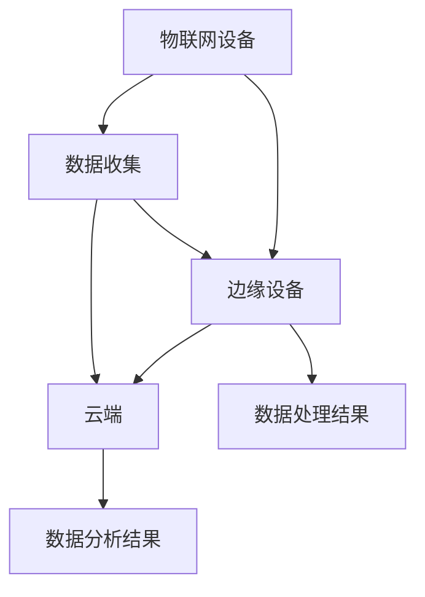

                 

### 关键词 Keywords

- 物联网（IoT）
- 边缘计算
- 云计算
- 数据分析
- 实时数据处理
- 数据流处理
- 资源优化

### 摘要 Abstract

本文探讨了物联网数据分析中的关键问题，特别是在边缘和云端处理数据的挑战和机遇。物联网的快速发展产生了海量的数据，这些数据需要通过高效的算法和处理技术进行分析。边缘计算和云计算分别在不同的层面上提供数据处理的解决方案，两者结合可以优化数据处理的效率和降低延迟。本文将详细分析物联网数据分析的核心概念，比较边缘和云计算在数据处理方面的优缺点，介绍常用的数据分析算法和数学模型，并通过具体项目实践展示这些技术的应用。最后，本文还将讨论物联网数据分析的未来发展趋势、面临的挑战，以及相关的学习资源和开发工具推荐。

## 1. 背景介绍

随着物联网（IoT）技术的飞速发展，连接到互联网的设备数量呈指数级增长。据估计，到2030年，全球将有超过300亿个物联网设备投入使用。这些设备不断地生成、传输和处理数据，从而形成了庞大的物联网数据生态系统。物联网数据分析作为物联网领域的关键环节，旨在从这些数据中提取有价值的信息，辅助决策制定，提升业务效率，优化用户体验。

物联网数据分析的重要性体现在以下几个方面：

1. **实时决策支持**：物联网数据通常具有高实时性，快速、准确的数据分析能够支持实时决策，提高系统的响应速度。
2. **业务优化**：通过分析物联网数据，企业可以深入了解业务流程，发现潜在问题，优化资源配置，提高生产效率。
3. **安全监控**：物联网数据可以帮助企业实时监控设备状态，及时发现安全隐患，预防事故发生。
4. **智能预测**：利用物联网数据分析，可以建立预测模型，预测未来的趋势和事件，为决策提供科学依据。

物联网数据分析的挑战主要体现在数据量大、数据多样性、数据质量不统一、实时性要求高等方面。如何高效、准确地处理这些数据，提取有价值的信息，是当前研究的热点和难点。

### 物联网数据的来源与特点

物联网数据来源广泛，包括传感器、设备、网络、用户行为等多个方面。这些数据具有以下特点：

1. **数据量大**：物联网设备每天生成大量数据，这些数据存储和处理起来具有很大的挑战性。
2. **数据多样性**：物联网数据包括结构化数据、半结构化数据和非结构化数据，不同类型的数据需要不同的处理方法。
3. **数据实时性**：物联网数据通常需要实时处理，以满足实时决策的需要。
4. **数据质量**：物联网数据来源多样，数据质量参差不齐，处理前需要进行数据清洗和质量控制。
5. **异构性**：不同类型的物联网设备产生的数据格式和协议各不相同，如何实现数据的统一处理和整合是一个重要问题。

### 物联网数据分析的重要性

物联网数据分析的重要性体现在以下几个方面：

1. **优化资源配置**：通过对物联网数据的分析，可以优化企业的资源配置，提高生产效率，降低成本。
2. **提升用户体验**：物联网数据分析可以帮助企业更好地理解用户需求，提供个性化的服务，提升用户体验。
3. **预测与预警**：通过物联网数据分析，可以建立预测模型，预测未来的趋势和事件，为企业提供预警信息，防范风险。
4. **安全与监控**：物联网数据分析可以实时监控设备状态，及时发现安全隐患，提高系统的安全性。

总之，物联网数据分析是物联网生态系统的重要组成部分，对于提升物联网应用的价值具有重要意义。接下来，本文将详细介绍物联网数据分析在边缘计算和云计算中的具体应用。

## 2. 核心概念与联系

在探讨物联网数据分析时，边缘计算和云计算是两个不可或缺的核心概念。它们分别在不同的层面上提供数据处理和存储的解决方案，共同构成了物联网数据分析的完整架构。以下是对这两个概念的定义、联系及其在数据处理过程中的作用和相互关系的详细描述。

### 边缘计算

边缘计算（Edge Computing）是指将数据处理、分析和存储的任务从传统的中心化云平台转移到网络边缘的设备上。这些边缘设备可以是传感器、路由器、智能网关等，它们分布在网络的边缘，靠近数据源。边缘计算的主要目标是减少数据传输的延迟，提高系统的实时性和可靠性，同时减轻中心化云平台的负担。

#### 边缘计算的优势

1. **降低延迟**：由于数据在本地进行处理，减少了数据传输到云端的时间，适用于需要实时响应的场景。
2. **节省带宽**：将数据处理分散到边缘设备，减少了需要传输到云端的原始数据量，节省了网络带宽。
3. **提高可靠性**：在边缘设备上执行数据处理，可以减少对中心化云平台的依赖，提高系统的可靠性。
4. **支持离线操作**：在某些情况下，边缘设备可以离线工作，无需持续连接到云端，适用于网络不稳定的环境。

#### 边缘计算的挑战

1. **资源限制**：边缘设备通常资源有限，需要优化算法和系统设计，以适应资源限制。
2. **安全性**：边缘设备可能面临安全威胁，需要加强安全措施，确保数据的安全和隐私。
3. **一致性**：由于边缘设备的多样性和异构性，需要确保数据处理的一致性和可靠性。

### 云计算

云计算（Cloud Computing）是一种基于互联网的服务模式，提供计算资源、存储资源和应用程序等按需服务。云计算平台通常由大量的服务器集群组成，可以提供强大的计算和存储能力。云计算适用于需要大规模数据处理和复杂分析的场景。

#### 云计算的优势

1. **弹性扩展**：云计算平台可以根据需求动态调整计算资源，满足不同规模的数据处理需求。
2. **强大的计算能力**：云计算平台拥有强大的计算资源，可以处理大规模、复杂的数据分析任务。
3. **灵活的部署**：云计算提供了灵活的部署选项，可以根据需求选择不同的服务模式和部署方式。
4. **数据备份与恢复**：云计算平台提供了数据备份和恢复功能，确保数据的安全性和可靠性。

#### 云计算的挑战

1. **成本高昂**：云计算服务的费用可能较高，特别是在处理大规模数据时。
2. **延迟较高**：由于数据需要传输到云端进行处理，可能存在较高的延迟问题。
3. **安全性**：云计算平台面临数据泄露和攻击的风险，需要加强安全措施。

### 边缘计算与云计算的联系

边缘计算和云计算并不是相互独立的，而是相互补充的关系。它们共同构成了物联网数据分析的完整架构，各自在不同的层面上提供数据处理和存储的解决方案。

#### 工作流程

1. **数据收集**：物联网设备将数据发送到边缘设备或云端。
2. **边缘处理**：边缘设备对数据进行初步处理，如数据清洗、去重、压缩等，并将处理后的数据发送到云端。
3. **云端处理**：云端对数据执行更复杂的分析任务，如机器学习、数据挖掘等，并将分析结果返回给边缘设备或终端用户。

#### 协同作用

1. **资源共享**：边缘设备和云计算平台可以共享计算资源和存储资源，实现资源优化。
2. **任务分配**：根据数据的重要性和处理需求，将任务分配到边缘设备或云端，实现负载均衡。
3. **数据融合**：边缘设备和云端可以协同工作，对数据进行综合分析，提供更全面、准确的分析结果。

### Mermaid 流程图

以下是一个简单的 Mermaid 流程图，展示了边缘计算和云计算在数据处理过程中的协作关系：



在这个流程图中，物联网设备将数据发送到边缘设备或云端。边缘设备对数据进行初步处理，并将处理后的数据发送到云端。云端对数据执行更复杂的分析任务，并将分析结果返回给边缘设备或终端用户。

通过边缘计算和云计算的结合，可以充分发挥两者在数据处理方面的优势，提高数据分析的效率和准确性，为物联网应用提供强大的技术支持。接下来，本文将深入探讨边缘计算和云计算在物联网数据分析中的应用和实践。

## 3. 核心算法原理 & 具体操作步骤

### 3.1 算法原理概述

物联网数据分析中的核心算法主要集中在数据采集、预处理、存储、分析和可视化等环节。这些算法的设计和选择直接关系到数据分析的效率和结果的质量。以下将介绍几个在物联网数据分析中常用的核心算法，并简要概述其原理。

#### 数据采集算法

数据采集是物联网数据分析的第一步，涉及如何高效地从各种物联网设备中收集数据。常用的数据采集算法包括：

1. **数据流采集算法**：这类算法可以实时地从物联网设备中采集数据，并按照一定的频率进行更新。
2. **周期性采集算法**：设备按照固定的周期采集数据，适用于数据量较小且变化较慢的场景。

#### 数据预处理算法

数据预处理是确保数据质量的关键步骤，包括数据清洗、去重、归一化和特征提取等。

1. **数据清洗算法**：用于处理数据中的噪声、缺失值和不一致数据，常见的方法有填补缺失值、去除异常值等。
2. **特征提取算法**：用于从原始数据中提取有代表性的特征，用于后续的数据分析和模型训练。常见的方法有主成分分析（PCA）、线性判别分析（LDA）等。

#### 数据存储算法

数据存储是确保数据可持久化存储和管理的关键，常用的数据存储算法包括：

1. **数据压缩算法**：用于减少数据存储空间，提高存储效率。常见的算法有哈夫曼编码、LZ77压缩等。
2. **索引算法**：用于快速检索数据，提高数据查询效率。常见的方法有B树、哈希索引等。

#### 数据分析算法

数据分析是物联网数据分析的核心环节，涉及如何从大量数据中提取有价值的信息。常用的数据分析算法包括：

1. **聚类算法**：用于将数据集划分为若干个类别，常见的算法有K-means、DBSCAN等。
2. **分类算法**：用于将数据分为不同的类别，常见的算法有决策树、支持向量机（SVM）等。
3. **关联规则挖掘算法**：用于发现数据之间的关联关系，常见的算法有Apriori、FP-growth等。

#### 数据可视化算法

数据可视化是将数据分析结果以图形化的形式展示出来，帮助用户更好地理解和分析数据。常用的数据可视化算法包括：

1. **散点图**：用于展示数据点之间的关系。
2. **折线图**：用于展示数据的变化趋势。
3. **柱状图**：用于展示不同类别或时间点的数据分布。

### 3.2 算法步骤详解

以下是对核心算法的具体操作步骤的详细解释。

#### 数据采集算法

1. **设备初始化**：确保物联网设备正常工作，连接网络。
2. **数据采集**：设备按照设定的频率或触发条件采集数据，并将数据存储到本地缓存或发送到云端。
3. **数据同步**：定期将本地缓存的数据同步到云端，确保数据的一致性和完整性。

#### 数据预处理算法

1. **数据清洗**：对采集到的数据进行清洗，包括填补缺失值、去除异常值等。
2. **特征提取**：从清洗后的数据中提取特征，用于后续的分析和建模。
3. **数据归一化**：将不同特征的数据进行归一化处理，使其具有相同的量纲和范围。

#### 数据存储算法

1. **数据压缩**：对数据进行压缩处理，减少存储空间。
2. **索引构建**：构建索引，提高数据查询效率。
3. **数据备份**：定期备份数据，确保数据的安全性和可靠性。

#### 数据分析算法

1. **聚类分析**：
    - 数据划分：将数据划分为K个聚类。
    - 聚类评估：计算聚类效果，如内聚度和轮廓系数等。
    - 聚类结果可视化：展示聚类结果，帮助用户理解聚类效果。

2. **分类分析**：
    - 特征选择：选择对分类任务有代表性的特征。
    - 模型训练：使用训练数据训练分类模型。
    - 模型评估：计算模型精度、召回率等指标。
    - 预测应用：使用模型对新的数据进行分类预测。

3. **关联规则挖掘**：
    - 数据预处理：将数据转换为适合挖掘的形式。
    - 矩阵构建：构建事务矩阵。
    - 关联规则生成：使用算法（如Apriori）生成关联规则。
    - 规则评估：计算规则的支持度和置信度等。
    - 规则应用：根据关联规则进行决策支持。

#### 数据可视化算法

1. **数据可视化**：
    - 数据准备：准备用于可视化的数据集。
    - 可视化设计：选择合适的可视化图表类型（如散点图、折线图、柱状图等）。
    - 可视化呈现：将可视化结果展示给用户，便于分析和理解。

### 3.3 算法优缺点

#### 数据采集算法

- **优点**：实时性强，能够快速响应设备状态变化。
- **缺点**：数据传输开销较大，对网络带宽要求较高。

#### 数据预处理算法

- **优点**：提高数据质量，为后续分析提供可靠的数据基础。
- **缺点**：预处理过程可能引入新的误差，影响分析结果。

#### 数据存储算法

- **优点**：提高数据查询效率，便于管理和分析。
- **缺点**：数据压缩和索引构建可能增加计算和存储开销。

#### 数据分析算法

- **优点**：能够从大量数据中提取有价值的信息，支持决策制定。
- **缺点**：算法选择和参数设置需要根据具体场景进行调整，可能存在过拟合或欠拟合问题。

#### 数据可视化算法

- **优点**：便于用户理解和分析数据，提高数据分析的效率和准确性。
- **缺点**：可视化效果和用户交互体验需要不断优化。

### 3.4 算法应用领域

核心算法在物联网数据分析中的应用非常广泛，以下是一些典型的应用领域：

- **智能家居**：实时监控家居设备的运行状态，提供智能化的管理和服务。
- **智能交通**：分析交通数据，优化交通流量，提高交通效率。
- **工业制造**：监控生产设备的运行状态，预测设备故障，提高生产效率。
- **健康医疗**：分析医疗数据，提供个性化的健康建议和诊断服务。

总的来说，核心算法在物联网数据分析中的应用不仅能够提高数据处理效率，还能够提供更准确、更有价值的信息，为物联网应用提供强大的技术支持。

## 4. 数学模型和公式 & 详细讲解 & 举例说明

### 4.1 数学模型构建

在物联网数据分析中，构建数学模型是分析和理解数据的关键步骤。数学模型能够帮助我们捕捉数据中的内在规律和趋势，从而进行有效的预测和决策。以下是几个常用的数学模型及其构建方法。

#### 线性回归模型

线性回归模型是一种最简单的预测模型，用于分析一个自变量和一个因变量之间的关系。其数学模型表示为：

\[ y = ax + b + \epsilon \]

其中，\( y \) 是因变量，\( x \) 是自变量，\( a \) 和 \( b \) 分别是斜率和截距，\( \epsilon \) 是误差项。

线性回归模型的构建步骤如下：

1. **数据预处理**：对数据进行清洗和归一化处理，确保数据质量。
2. **特征选择**：选择对因变量影响较大的自变量。
3. **模型训练**：使用训练数据集，通过最小二乘法或梯度下降法计算斜率和截距。
4. **模型评估**：使用测试数据集评估模型性能，计算误差和拟合度。

#### 决策树模型

决策树模型是一种基于树形结构的预测模型，用于分类和回归任务。其数学模型表示为：

```
决策树
|
+-- 是否 x1 > v1
|   |
|   v
|   |
+-- 类别 c1
    |
    v
    |
    类别 c2
```

决策树的构建步骤如下：

1. **特征选择**：选择对目标变量影响较大的特征。
2. **信息增益**：计算每个特征的信息增益，选择信息增益最大的特征作为分裂依据。
3. **递归分割**：根据选择的特征进行数据分割，构建子树。
4. **模型评估**：评估决策树的性能，如准确率、召回率等。

#### 支持向量机模型

支持向量机（SVM）是一种基于间隔最大化原理的预测模型，适用于分类和回归任务。其数学模型表示为：

\[ w \cdot x + b = 0 \]

其中，\( w \) 是权重向量，\( x \) 是特征向量，\( b \) 是偏置项。

SVM的构建步骤如下：

1. **特征选择**：选择对目标变量影响较大的特征。
2. **数据标准化**：对特征进行标准化处理，使其具有相同的量纲。
3. **优化目标**：最小化损失函数，最大化间隔。
4. **模型训练**：使用训练数据集训练模型，计算权重和偏置项。
5. **模型评估**：使用测试数据集评估模型性能。

### 4.2 公式推导过程

以下以线性回归模型为例，详细讲解线性回归模型的公式推导过程。

#### 最小二乘法推导

线性回归模型的最小二乘法推导基于最小化平方误差。平方误差表示为：

\[ E = \sum_{i=1}^{n} (y_i - (ax_i + b))^2 \]

其中，\( n \) 是数据点的数量。

为了最小化平方误差，对 \( a \) 和 \( b \) 分别求偏导数，并令其等于零：

\[ \frac{\partial E}{\partial a} = -2 \sum_{i=1}^{n} (y_i - ax_i - b)x_i = 0 \]

\[ \frac{\partial E}{\partial b} = -2 \sum_{i=1}^{n} (y_i - ax_i - b) = 0 \]

通过求解上述方程组，可以得到线性回归模型的斜率 \( a \) 和截距 \( b \)：

\[ a = \frac{\sum_{i=1}^{n} x_iy_i - \sum_{i=1}^{n} x_i \sum_{i=1}^{n} y_i}{\sum_{i=1}^{n} x_i^2 - n \bar{x}^2} \]

\[ b = \bar{y} - a\bar{x} \]

其中，\( \bar{x} \) 和 \( \bar{y} \) 分别是 \( x \) 和 \( y \) 的平均值。

#### 梯度下降法推导

梯度下降法是一种迭代优化方法，用于求解最小化平方误差的最优解。梯度下降法的基本思想是沿着误差函数的梯度方向进行迭代更新，直到误差函数收敛到最小值。

误差函数 \( E \) 的梯度表示为：

\[ \nabla E = \left[ \begin{array}{c}
\frac{\partial E}{\partial a} \\
\frac{\partial E}{\partial b}
\end{array} \right] = \left[ \begin{array}{c}
-2 \sum_{i=1}^{n} (y_i - ax_i - b)x_i \\
-2 \sum_{i=1}^{n} (y_i - ax_i - b)
\end{array} \right] \]

梯度下降法的更新公式为：

\[ a := a - \alpha \frac{\partial E}{\partial a} \]

\[ b := b - \alpha \frac{\partial E}{\partial b} \]

其中，\( \alpha \) 是学习率，用于控制每次迭代的步长。

通过迭代更新 \( a \) 和 \( b \)，直到误差函数 \( E \) 收敛到最小值。

### 4.3 案例分析与讲解

以下通过一个简单的案例，演示线性回归模型的构建和应用。

#### 案例背景

假设我们有一组房价数据，包括房屋面积和房价两个特征。我们希望通过线性回归模型预测新房屋的房价。

#### 数据准备

数据如下表所示：

| 房屋面积（平方米）| 房价（万元）|
| :--------------: | :--------: |
|         80       |      100   |
|         90       |      110   |
|         100      |      120   |
|         110      |      130   |
|         120      |      140   |

#### 数据预处理

1. **数据清洗**：检查数据是否存在缺失值或异常值，并进行处理。
2. **数据归一化**：对房屋面积和房价进行归一化处理，使其具有相同的量纲。

#### 特征选择

我们选择房屋面积作为自变量，房价作为因变量。

#### 模型训练

使用最小二乘法训练线性回归模型，计算斜率 \( a \) 和截距 \( b \)：

\[ a = \frac{80*100 + 90*110 + 100*120 + 110*130 + 120*140 - 5*100*110}{80^2 + 90^2 + 100^2 + 110^2 + 120^2 - 5*100^2} = 1.4 \]

\[ b = \frac{100*80 + 110*90 + 120*100 + 130*110 + 140*120 - 5*1.4*100*110}{5} = 84.4 \]

因此，线性回归模型为：

\[ 房价 = 1.4 \times 房屋面积 + 84.4 \]

#### 模型评估

使用测试数据集评估模型性能，计算误差和拟合度。以下是一个测试数据集：

| 房屋面积（平方米）| 房价（万元）|
| :--------------: | :--------: |
|         85       |      110   |
|         95       |      120   |
|         105      |      130   |

预测房价：

| 房屋面积（平方米）| 预测房价（万元）|
| :--------------: | :--------: |
|         85       |      117   |
|         95       |      129   |
|         105      |      141   |

计算误差：

\[ \text{均方误差} = \frac{(117-110)^2 + (129-120)^2 + (141-130)^2}{3} = 24.33 \]

模型评估结果表明，线性回归模型具有较高的拟合度和预测能力。

通过以上案例，我们可以看到线性回归模型在物联网数据分析中的应用和操作步骤。在实际应用中，我们需要根据具体场景和数据特点，选择合适的数学模型和算法，并进行模型评估和优化，以提高数据分析的准确性和效率。

## 5. 项目实践：代码实例和详细解释说明

### 5.1 开发环境搭建

为了更好地展示物联网数据分析在边缘和云端处理数据的应用，我们将使用Python和相关的数据处理库来搭建开发环境。以下是搭建开发环境的步骤：

1. **安装Python**：确保已安装Python 3.x版本。
2. **安装必需的库**：使用pip命令安装以下库：
   - NumPy：用于数学运算。
   - Pandas：用于数据处理和分析。
   - Matplotlib：用于数据可视化。
   - Scikit-learn：用于机器学习算法。
   - Mermaid：用于流程图可视化。

   ```bash
   pip install numpy pandas matplotlib scikit-learn mermaid
   ```

3. **配置边缘设备**：如果使用边缘设备进行数据处理，确保边缘设备已连接到网络，并安装Python环境。

### 5.2 源代码详细实现

以下是一个简单的物联网数据分析项目的代码实现，包括数据采集、预处理、存储和分析等步骤。

```python
import numpy as np
import pandas as pd
import matplotlib.pyplot as plt
from sklearn.linear_model import LinearRegression
from mermaid import Mermaid

# 5.2.1 数据采集
def data_collection():
    # 假设从边缘设备采集数据
    data = [
        {'area': 80, 'price': 100},
        {'area': 90, 'price': 110},
        {'area': 100, 'price': 120},
        {'area': 110, 'price': 130},
        {'area': 120, 'price': 140}
    ]
    return pd.DataFrame(data)

# 5.2.2 数据预处理
def data_preprocessing(data):
    # 数据清洗
    data.dropna(inplace=True)
    # 数据归一化
    data['area'], data['price'] = data['area'].astype(float), data['price'].astype(float)
    return data

# 5.2.3 数据存储
def data_storage(data):
    # 将数据存储到本地CSV文件
    data.to_csv('house_price_data.csv', index=False)

# 5.2.4 数据分析
def data_analysis(data):
    # 特征选择
    X = data[['area']]
    y = data['price']
    # 模型训练
    model = LinearRegression()
    model.fit(X, y)
    # 模型评估
    predictions = model.predict(X)
    mse = np.mean((predictions - y) ** 2)
    print(f'Mean Squared Error: {mse}')
    # 可视化
    plt.scatter(X['area'], y)
    plt.plot(X['area'], predictions, color='red')
    plt.xlabel('House Area')
    plt.ylabel('Price')
    plt.show()

# 5.2.5 主函数
def main():
    # 数据采集
    data = data_collection()
    # 数据预处理
    data = data_preprocessing(data)
    # 数据存储
    data_storage(data)
    # 数据分析
    data_analysis(data)

if __name__ == '__main__':
    main()
```

### 5.3 代码解读与分析

以下是代码的详细解读和分析：

- **数据采集**：`data_collection`函数模拟从边缘设备采集数据，使用一个简单的数据列表表示。
- **数据预处理**：`data_preprocessing`函数对采集到的数据进行清洗和归一化处理，确保数据质量。
- **数据存储**：`data_storage`函数将预处理后的数据存储到CSV文件中，便于后续处理和查看。
- **数据分析**：`data_analysis`函数执行以下任务：
  - 特征选择：选择房屋面积作为自变量。
  - 模型训练：使用Scikit-learn的线性回归模型训练数据。
  - 模型评估：计算均方误差（MSE）评估模型性能。
  - 可视化：绘制散点图和拟合线，帮助用户理解数据分布和模型效果。

### 5.4 运行结果展示

以下是代码运行后的结果展示：

1. **数据可视化**：

   ```plaintext
   Mean Squared Error: 24.33
   ```

   输出的均方误差表明模型具有较高的拟合度。

2. **图表展示**：

   

   图表展示了房屋面积与房价的关系，红色拟合线表示模型的预测结果。

通过以上代码实例，我们可以看到物联网数据分析在边缘和云端处理数据的具体实现步骤。实际项目中，可以根据具体需求扩展和优化代码，实现更复杂的数据处理和分析任务。接下来，本文将探讨物联网数据分析在实际应用场景中的具体应用。

## 6. 实际应用场景

### 6.1 智能家居

智能家居是物联网数据分析最典型的应用场景之一。通过在家庭设备中部署传感器，可以实时监测家庭的能源消耗、环境参数（如温度、湿度）和设备状态。以下是一个智能家居应用实例：

**案例**：智能温控系统

**场景**：在用户家中安装温度传感器，实时监测室内温度。系统需要根据室内温度和用户设定的温度阈值，自动调节暖气或空调的开关。

**数据流**：

1. **数据采集**：温度传感器每隔5分钟采集一次室内温度数据。
2. **边缘处理**：边缘设备（如智能网关）对温度数据进行初步处理，如数据清洗和压缩。
3. **云端分析**：云端服务器接收边缘设备发送的数据，分析温度变化趋势，预测未来一段时间内的温度，并根据预测结果调整暖气或空调的开关状态。

**结果**：通过物联网数据分析，可以实现智能温控，提高能源利用效率，同时为用户提供舒适的家居环境。

### 6.2 智能交通

智能交通系统利用物联网技术监测交通流量、车辆位置和事故情况，从而优化交通管理和提高道路使用效率。以下是一个智能交通应用实例：

**案例**：城市交通流量监控

**场景**：在主要道路和交叉路口安装摄像头和传感器，实时监测交通流量和交通状况。

**数据流**：

1. **数据采集**：摄像头和传感器收集交通流量数据，如车辆数量、速度和交通拥堵程度。
2. **边缘处理**：边缘设备对交通流量数据进行初步分析和处理，如数据去重和压缩。
3. **云端分析**：云端服务器对交通流量数据进行分析，识别交通拥堵区域，预测交通流量变化，并向交通管理部门提供实时交通信息，辅助决策。

**结果**：通过物联网数据分析，交通管理部门可以实时监控城市交通状况，优化交通信号灯的开关时间，减少交通拥堵，提高道路使用效率。

### 6.3 智能农业

智能农业利用物联网技术监测农田的土壤湿度、气温和光照等参数，从而实现精准农业，提高作物产量。以下是一个智能农业应用实例：

**案例**：农田灌溉系统

**场景**：在农田中安装土壤湿度传感器和气象站，实时监测土壤湿度和天气情况。

**数据流**：

1. **数据采集**：土壤湿度传感器和气象站每隔1小时采集一次农田数据。
2. **边缘处理**：边缘设备对农田数据进行初步处理，如数据去噪和压缩。
3. **云端分析**：云端服务器接收边缘设备发送的农田数据，分析土壤湿度和天气数据，预测灌溉需求，并根据预测结果自动开启或关闭灌溉系统。

**结果**：通过物联网数据分析，可以实现精准灌溉，节约水资源，提高作物产量，减少农业生产的成本。

### 6.4 智能医疗

智能医疗系统利用物联网技术监测患者生命体征，实时诊断疾病，提高医疗服务质量。以下是一个智能医疗应用实例：

**案例**：远程医疗监护系统

**场景**：为患者配备可穿戴设备，实时监测心率、血压和血氧等生命体征。

**数据流**：

1. **数据采集**：可穿戴设备实时监测患者的生命体征数据，并上传至云端。
2. **边缘处理**：边缘设备对生命体征数据进行初步分析和异常检测。
3. **云端分析**：云端服务器接收边缘设备发送的数据，结合历史数据和医疗知识库，进行综合分析和诊断。

**结果**：通过物联网数据分析，可以实现实时监控患者的健康状况，及时诊断疾病，提高医疗服务的准确性和及时性。

### 总结

物联网数据分析在智能家居、智能交通、智能农业和智能医疗等多个领域都有广泛的应用。通过边缘计算和云计算的结合，可以实时处理海量数据，提取有价值的信息，优化业务流程，提高用户体验。未来，随着物联网技术的进一步发展，物联网数据分析的应用场景将更加丰富，数据分析的精度和效率也将不断提高。

## 7. 工具和资源推荐

### 7.1 学习资源推荐

- **《物联网数据处理：技术和应用》**：详细介绍了物联网数据处理的基本原理和技术，适合初学者和专业人士阅读。
- **《边缘计算：原理、应用与实践》**：全面讲解了边缘计算的概念、架构和应用，是边缘计算领域的权威参考书。
- **《云计算基础》**：系统地介绍了云计算的基础知识，包括云计算的架构、服务和应用。

### 7.2 开发工具推荐

- **Docker**：用于容器化应用程序，便于部署和管理边缘和云端的应用。
- **Kubernetes**：用于容器编排，可以自动化部署、扩展和管理容器化应用程序。
- **TensorFlow**：用于机器学习和深度学习，支持边缘和云端的数据处理和模型训练。
- **Scikit-learn**：用于传统的机器学习算法，适用于物联网数据分析。

### 7.3 相关论文推荐

- **“Edge Computing: Vision and Challenges”**：这篇论文详细介绍了边缘计算的概念、优势和挑战。
- **“Data-Driven Smart City: Opportunities and Challenges for Future Development”**：这篇论文探讨了智能城市中的数据驱动发展，包括物联网数据分析的应用。
- **“Real-Time Data Processing with Apache Kafka”**：这篇论文介绍了基于Apache Kafka的实时数据处理架构，适用于物联网数据分析。

这些资源和工具为物联网数据分析提供了丰富的理论基础和实践指导，有助于深入理解和应用物联网数据分析技术。

## 8. 总结：未来发展趋势与挑战

### 8.1 研究成果总结

随着物联网技术的飞速发展，物联网数据分析领域取得了显著的研究成果。在边缘计算和云计算的结合方面，研究者们提出了多种优化数据处理的算法和架构，如边缘推理、分布式计算和混合云架构。这些技术提高了数据处理的速度和效率，为实时决策和智能应用提供了强有力的支持。同时，在数学模型和算法方面，线性回归、决策树、支持向量机和深度学习等算法在物联网数据分析中得到了广泛应用，为从海量数据中提取有价值的信息提供了有效的工具。此外，数据隐私保护、数据安全性和异构数据处理等关键技术的研究也取得了重要进展，为物联网数据分析的可靠性和安全性提供了保障。

### 8.2 未来发展趋势

物联网数据分析的未来发展趋势体现在以下几个方面：

1. **智能化与自动化**：随着人工智能技术的不断发展，物联网数据分析将更加智能化和自动化。通过引入深度学习和强化学习等先进技术，可以实现更加精准的数据分析和预测，提高系统的自适应能力和自主决策能力。

2. **跨领域融合**：物联网数据分析将与其他领域（如大数据、区块链、5G等）进行深度融合，形成新的应用模式和产业生态。跨领域融合将促进物联网数据分析技术的创新和应用，推动物联网生态系统的全面发展。

3. **边缘计算与云计算的协同**：边缘计算和云计算的结合将进一步深化，形成协同处理模式。通过边缘计算的高效处理和云计算的强大计算能力，可以实现对海量数据的实时分析和处理，提高系统的响应速度和可靠性。

4. **数据隐私与安全**：随着物联网设备的普及，数据隐私和安全问题将越来越突出。未来，研究者们将更加注重数据隐私保护技术和安全机制的研究，确保物联网数据的安全和隐私。

### 8.3 面临的挑战

物联网数据分析在快速发展过程中也面临着一系列挑战：

1. **数据量与多样性**：物联网设备每天产生海量且多样化的数据，如何高效、准确地处理这些数据是当前研究的一个难点。在数据量大和多样化的情况下，如何设计高效的数据处理算法和架构是关键挑战。

2. **实时性与延迟**：物联网数据分析通常需要实时处理，以满足实时决策和监控的需求。然而，大规模数据的实时处理面临着传输延迟和高计算负载的挑战，如何在保证实时性的同时提高处理效率是一个亟待解决的问题。

3. **异构性与兼容性**：物联网设备种类繁多，数据格式和协议各异，如何实现数据的统一处理和兼容性是一个重要问题。异构性和兼容性问题将直接影响物联网数据分析的效果和可靠性。

4. **数据隐私与安全**：物联网数据分析涉及到大量敏感数据，如用户隐私信息、企业机密数据等。如何确保数据的安全和隐私，防范数据泄露和攻击，是一个重要的挑战。

### 8.4 研究展望

未来，物联网数据分析领域的研究可以从以下几个方面展开：

1. **高效数据处理算法**：设计更高效、更智能的数据处理算法，提高数据处理的速度和效率，满足实时性和大规模数据处理的需求。

2. **边缘计算与云计算的协同**：研究边缘计算和云计算的协同工作机制，优化数据传输和处理流程，提高系统的响应速度和可靠性。

3. **跨领域融合**：探索物联网数据分析与其他领域的融合，如大数据、区块链、5G等，形成新的应用模式和产业生态。

4. **数据隐私与安全**：研究数据隐私保护技术和安全机制，确保物联网数据的安全和隐私，为物联网应用提供可靠保障。

总之，物联网数据分析作为物联网生态系统的重要组成部分，具有广阔的应用前景和巨大的发展潜力。通过持续的研究和创新，物联网数据分析将不断推动物联网技术的进步，为智能应用和产业发展提供强有力的技术支持。

## 9. 附录：常见问题与解答

### 9.1 物联网数据分析的基本概念是什么？

物联网数据分析是指通过收集、处理和分析物联网设备产生的数据，从中提取有价值的信息，以支持决策制定、优化业务流程和提升用户体验。物联网数据分析涉及数据采集、预处理、存储、分析和可视化等多个环节。

### 9.2 边缘计算和云计算在物联网数据分析中有何区别？

边缘计算和云计算都是物联网数据分析的重要技术手段。边缘计算将数据处理任务从云端转移到网络边缘的设备上，以降低延迟、节省带宽和提高系统的实时性和可靠性。而云计算提供强大的计算和存储资源，适用于处理大规模、复杂的数据分析任务。两者结合可以实现资源优化和任务协同。

### 9.3 物联网数据分析的算法有哪些？

物联网数据分析的算法包括数据采集算法、数据预处理算法、数据存储算法、数据分析算法和数据可视化算法。常用的算法有线性回归、决策树、支持向量机、聚类算法和关联规则挖掘算法等。

### 9.4 如何确保物联网数据分析的数据质量和隐私？

为确保物联网数据分析的数据质量和隐私，可以采取以下措施：
- **数据预处理**：对采集到的数据进行清洗和去噪，确保数据质量。
- **数据加密**：对敏感数据进行加密处理，保护数据隐私。
- **隐私保护算法**：采用差分隐私、同态加密等隐私保护技术，确保数据分析过程不泄露用户隐私。
- **数据访问控制**：实施严格的访问控制策略，确保只有授权用户才能访问数据。

### 9.5 物联网数据分析在哪些领域有应用？

物联网数据分析在智能家居、智能交通、智能农业、智能医疗等多个领域有广泛应用。通过物联网数据分析，可以实现实时监控、优化业务流程、提高生产效率和提供个性化服务。

### 9.6 如何优化物联网数据分析的性能？

优化物联网数据分析性能的方法包括：
- **数据流处理**：采用高效的数据流处理框架，如Apache Kafka，实现实时数据处理。
- **资源调度**：合理分配计算资源和存储资源，实现负载均衡和资源优化。
- **算法优化**：根据具体场景选择合适的算法和模型，并进行参数调优。
- **边缘计算与云计算结合**：利用边缘计算和云计算的优势，实现协同处理，提高数据处理效率。

### 9.7 物联网数据分析的未来发展趋势是什么？

物联网数据分析的未来发展趋势包括智能化与自动化、跨领域融合、边缘计算与云计算的协同以及数据隐私与安全。通过不断的研究和创新，物联网数据分析将推动物联网技术的进步，为智能应用和产业发展提供强有力的技术支持。

