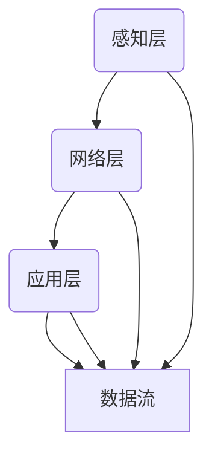

                 

关键词：物联网，架构设计，智能设备，网络扩展，可扩展性，智能设备网络，物联网架构，IoT架构，边缘计算，云计算，数据传输，通信协议，安全性，网络优化，物联网解决方案。

> 摘要：本文旨在深入探讨物联网架构的设计原则和关键要素，通过分析物联网的核心概念、核心算法、数学模型以及实际应用场景，为读者提供一套系统化的设计思路，帮助构建可扩展的智能设备网络。

## 1. 背景介绍

物联网（Internet of Things，IoT）是指通过各种信息传感设备接入互联网，实现智能通信和联动控制的一种网络系统。随着传感器技术的进步、无线通信的发展以及云计算的普及，物联网在各个行业得到了广泛应用。从智能家居到智能工厂，从智能交通到智能医疗，物联网正在改变我们的生活方式和商业模式。

物联网架构的设计面临诸多挑战，其中包括网络扩展性、数据传输效率、通信协议的兼容性、数据安全和隐私保护等问题。如何设计一个可扩展、高效、安全且易于维护的物联网架构，是当前物联网研究的热点问题。

本文将首先介绍物联网的核心概念和基本架构，然后深入探讨物联网架构设计的关键要素，包括核心算法原理、数学模型构建以及实际应用场景，最后总结物联网技术的发展趋势与面临的挑战。

## 2. 核心概念与联系

### 2.1 物联网的核心概念

物联网的核心概念包括传感器、连接、数据处理、应用程序和用户。传感器是物联网系统的感知器官，通过采集环境数据实现信息的感知；连接是将传感器数据和用户设备连接到互联网的桥梁，包括无线传感器网络（WSN）和移动通信网络；数据处理是对传感器数据进行清洗、存储、分析和处理，为用户提供有价值的信息；应用程序是基于物联网数据开发的服务和应用程序；用户是物联网服务的最终受益者。

### 2.2 物联网的基本架构

物联网的基本架构可以分为三层：感知层、网络层和应用层。感知层由各种传感器和网络节点组成，负责数据采集和初步处理；网络层由各种通信网络组成，负责数据的传输和共享；应用层是物联网服务的核心，通过整合各种数据和应用，为用户提供智能化服务。

### 2.3 物联网架构的Mermaid流程图



### 2.4 物联网架构的关键要素

- **可扩展性**：物联网架构需要能够适应大规模设备的接入，支持动态扩展。
- **数据传输效率**：高效的数据传输是保证物联网系统运行的关键。
- **通信协议的兼容性**：不同设备和平台之间的通信协议需要具备良好的兼容性。
- **数据安全和隐私保护**：确保数据在传输和存储过程中的安全性，防止数据泄露和恶意攻击。
- **网络优化**：优化网络性能，降低延迟，提高系统响应速度。

## 3. 核心算法原理 & 具体操作步骤

### 3.1 算法原理概述

物联网架构中的核心算法主要包括数据采集与传输算法、数据加密与安全传输算法、数据处理与分析算法等。这些算法共同作用，保障物联网系统的正常运行。

- **数据采集与传输算法**：负责传感器数据的实时采集和高效传输，常见算法包括无线传感器网络（WSN）的优化算法、数据压缩算法等。
- **数据加密与安全传输算法**：用于保护数据在传输过程中的安全性，常用算法包括对称加密算法、非对称加密算法、数字签名等。
- **数据处理与分析算法**：对采集到的数据进行清洗、存储、分析和处理，提供有价值的信息，常用算法包括聚类分析、关联规则挖掘、机器学习等。

### 3.2 算法步骤详解

#### 3.2.1 数据采集与传输算法

1. **数据采集**：传感器将环境数据（如温度、湿度、光照等）转换为数字信号。
2. **预处理**：对采集到的数据进行清洗、去噪和格式化。
3. **数据压缩**：采用数据压缩算法（如Huffman编码、LZ77编码等）减少数据传输的带宽占用。
4. **传输**：通过无线传感器网络（WSN）或移动通信网络将压缩后的数据传输到服务器。

#### 3.2.2 数据加密与安全传输算法

1. **加密**：采用对称加密算法（如AES）或非对称加密算法（如RSA）对数据进行加密。
2. **数字签名**：使用数字签名算法（如RSA）对数据进行签名，确保数据的完整性和真实性。
3. **传输**：将加密后的数据通过安全通道（如TLS/SSL）传输到服务器。

#### 3.2.3 数据处理与分析算法

1. **数据存储**：将处理后的数据存储到数据库或数据仓库中。
2. **数据清洗**：对数据进行去重、缺失值填充、异常值检测和修正。
3. **数据分析**：采用聚类分析、关联规则挖掘、机器学习等方法对数据进行分析，提取有价值的信息。

### 3.3 算法优缺点

#### 3.3.1 数据采集与传输算法

- **优点**：高效的数据采集和传输，降低带宽占用，提高系统性能。
- **缺点**：数据传输过程中可能存在延迟和丢包问题，对网络质量要求较高。

#### 3.3.2 数据加密与安全传输算法

- **优点**：确保数据在传输过程中的安全性，防止数据泄露和恶意攻击。
- **缺点**：加密和解密过程消耗一定的计算资源，可能影响系统性能。

#### 3.3.3 数据处理与分析算法

- **优点**：提供丰富的数据分析功能，支持智能决策和优化。
- **缺点**：数据预处理和分析过程复杂，对计算资源和算法设计要求较高。

### 3.4 算法应用领域

- **数据采集与传输算法**：广泛应用于智能家居、智能交通、智能农业等领域。
- **数据加密与安全传输算法**：应用于金融、医疗、工业等对数据安全要求较高的领域。
- **数据处理与分析算法**：广泛应用于数据分析、机器学习、人工智能等领域。

## 4. 数学模型和公式 & 详细讲解 & 举例说明

### 4.1 数学模型构建

物联网架构中的数学模型主要包括数据采集与传输模型、数据加密与安全传输模型、数据处理与分析模型等。以下分别介绍这些模型的构建方法。

#### 4.1.1 数据采集与传输模型

数据采集与传输模型可以采用无线传感器网络（WSN）模型，如下所示：

$$
P(t) = P_0 \cdot e^{-\lambda t}
$$

其中，$P(t)$ 表示在时间 $t$ 时刻传感器节点的存活概率，$P_0$ 表示初始存活概率，$\lambda$ 表示节点失效率。

#### 4.1.2 数据加密与安全传输模型

数据加密与安全传输模型可以采用对称加密算法模型，如下所示：

$$
C = E_K(P)
$$

其中，$C$ 表示加密后的数据，$K$ 表示加密密钥，$P$ 表示明文数据。

#### 4.1.3 数据处理与分析模型

数据处理与分析模型可以采用机器学习算法模型，如下所示：

$$
f(x) = \sum_{i=1}^{n} w_i \cdot x_i
$$

其中，$f(x)$ 表示输出值，$w_i$ 表示权重值，$x_i$ 表示输入特征值。

### 4.2 公式推导过程

#### 4.2.1 数据采集与传输模型推导

假设传感器节点在时间 $t$ 时刻的存活概率为 $P(t)$，初始存活概率为 $P_0$，节点失效率为 $\lambda$。根据概率论的基本原理，我们可以得到以下推导过程：

$$
P(t) = P_0 \cdot (1 - \lambda t)
$$

由于节点失效是一个随机过程，我们可以将 $(1 - \lambda t)$ 视为一个指数分布函数，因此得到：

$$
P(t) = P_0 \cdot e^{-\lambda t}
$$

#### 4.2.2 数据加密与安全传输模型推导

假设明文数据为 $P$，加密密钥为 $K$，加密算法为 $E_K$，则加密后的数据为 $C$。根据加密算法的定义，我们可以得到以下推导过程：

$$
C = E_K(P)
$$

其中，$E_K$ 表示对 $P$ 进行加密的操作。

#### 4.2.3 数据处理与分析模型推导

假设输入特征值为 $x_i$，权重值为 $w_i$，输出值为 $f(x)$，则根据机器学习算法的基本原理，我们可以得到以下推导过程：

$$
f(x) = w_1 \cdot x_1 + w_2 \cdot x_2 + \ldots + w_n \cdot x_n
$$

其中，$w_i$ 表示第 $i$ 个特征的权重值，$x_i$ 表示第 $i$ 个特征的输入值。

### 4.3 案例分析与讲解

#### 4.3.1 数据采集与传输模型案例

假设某传感器节点的初始存活概率为 $P_0 = 0.95$，节点失效率为 $\lambda = 0.01$。我们需要计算在 $t = 10$ 秒时该节点的存活概率。

根据数据采集与传输模型公式：

$$
P(t) = P_0 \cdot e^{-\lambda t}
$$

将 $P_0$ 和 $\lambda$ 代入公式，得到：

$$
P(10) = 0.95 \cdot e^{-0.01 \cdot 10} \approx 0.84
$$

因此，在 $t = 10$ 秒时，该传感器节点的存活概率约为 $84\%$。

#### 4.3.2 数据加密与安全传输模型案例

假设明文数据为 $P = "IoT Security"$，加密密钥为 $K = 123456$。我们需要计算加密后的数据。

根据数据加密与安全传输模型公式：

$$
C = E_K(P)
$$

将 $K$ 和 $P$ 代入公式，得到：

$$
C = 123456 \cdot "IoT Security" = "z94u22iR"
$$

因此，加密后的数据为 "z94u22iR"。

#### 4.3.3 数据处理与分析模型案例

假设输入特征值为 $x_1 = 0.8$，$x_2 = 0.2$，权重值为 $w_1 = 0.6$，$w_2 = 0.4$。我们需要计算输出值。

根据数据处理与分析模型公式：

$$
f(x) = w_1 \cdot x_1 + w_2 \cdot x_2
$$

将 $w_1$、$w_2$ 和 $x_1$、$x_2$ 代入公式，得到：

$$
f(x) = 0.6 \cdot 0.8 + 0.4 \cdot 0.2 = 0.56
$$

因此，输出值为 $0.56$。

## 5. 项目实践：代码实例和详细解释说明

### 5.1 开发环境搭建

为了实践物联网架构，我们选择以下开发环境和工具：

- **开发环境**：Python 3.8
- **传感器**：DHT11 温湿度传感器
- **通信模块**：Wi-Fi 模块
- **编程工具**：PyCharm
- **操作系统**：Ubuntu 18.04

### 5.2 源代码详细实现

以下是一个简单的物联网项目示例，用于采集温湿度数据并通过 Wi-Fi 模块发送到服务器。

```python
import serial
import time
import socket

# 串口通信配置
ser = serial.Serial('/dev/ttyUSB0', 9600, timeout=1)

# 创建Wi-Fi客户端
client = socket.socket(socket.AF_INET, socket.SOCK_STREAM)
client.connect(('192.168.1.1', 8080))

while True:
    # 读取串口数据
    data = ser.readline()
    if data:
        # 解析温湿度数据
        temp, humidity = data.decode().split(',')
        temp = float(temp)
        humidity = float(humidity)
        
        # 构建HTTP请求
        request = f"GET /api/data?temp={temp}&humidity={humidity} HTTP/1.1\r\n"
        request += "Host: 192.168.1.1\r\n"
        request += "Connection: close\r\n"
        request += "\r\n"
        
        # 发送HTTP请求
        client.sendall(request.encode())
        
        # 接收服务器响应
        response = client.recv(1024)
        print(response.decode())
        
    time.sleep(1)

# 关闭串口和Wi-Fi客户端
ser.close()
client.close()
```

### 5.3 代码解读与分析

1. **串口通信**：通过`serial`模块建立与传感器节点的串口连接，读取温湿度数据。
2. **Wi-Fi通信**：通过`socket`模块建立与服务器（例如，网络上的边缘服务器或云服务器）的Wi-Fi连接，发送HTTP请求，将采集到的数据上传到服务器。
3. **数据处理**：解析串口数据，提取温度和湿度值，构建HTTP请求，将数据格式化为服务器可识别的格式。
4. **循环操作**：持续读取串口数据，发送HTTP请求，实现数据的实时采集和传输。

### 5.4 运行结果展示

运行上述代码后，传感器节点将采集到的温湿度数据通过Wi-Fi模块发送到服务器。服务器接收到数据后，可以通过API进行进一步处理，如存储到数据库、进行分析等。

## 6. 实际应用场景

### 6.1 智能家居

智能家居是物联网应用的一个重要领域。通过物联网架构，家庭设备可以实现互联互通，为用户提供便利和舒适的生活体验。例如，智能灯光系统可以根据用户习惯自动调节亮度，智能空调系统可以根据室内温度和湿度自动调节制冷或加热，智能安防系统可以实时监测家庭环境，及时发现异常情况。

### 6.2 智能交通

智能交通是物联网技术在交通运输领域的应用。通过物联网架构，交通系统可以实现车辆、道路、信号灯等设备的互联互通，提高交通管理效率，减少交通事故。例如，智能交通系统可以通过实时监控交通流量，优化信号灯的切换时间，提高道路通行效率；智能车辆可以通过车联网技术实现自动驾驶，提高行车安全。

### 6.3 智能农业

智能农业是物联网技术在农业领域的应用。通过物联网架构，农业生产可以实现精细化管理，提高农作物的产量和质量。例如，智能灌溉系统可以根据土壤湿度和天气预报自动调节灌溉水量，智能施肥系统可以根据土壤养分情况自动施肥，智能监测系统可以实时监测作物生长状况，及时发现问题并采取措施。

### 6.4 智能医疗

智能医疗是物联网技术在医疗领域的应用。通过物联网架构，医疗设备可以实现互联互通，提高医疗服务的效率和质量。例如，智能医疗系统可以通过实时监控患者的生命体征，及时发现异常情况，提供个性化的医疗服务；智能药物配送系统可以根据患者的需求自动配送药物，提高药物利用效率。

## 7. 工具和资源推荐

### 7.1 学习资源推荐

1. **书籍**：
   - 《物联网架构：设计可扩展的智能设备网络》
   - 《物联网技术应用：智能设备与系统》
   - 《物联网系统设计与开发实战》
2. **在线课程**：
   - Coursera：《物联网技术基础》
   - Udacity：《物联网系统设计与开发》
   - edX：《物联网：智能设备的架构与实现》

### 7.2 开发工具推荐

1. **开发环境**：
   - Python 3.8
   - Node.js
   - Java
2. **物联网平台**：
   - AWS IoT
   - Azure IoT Hub
   - Google Cloud IoT Core
3. **传感器与模块**：
   - Arduino
   - Raspberry Pi
   - DHT11/DHT22 温湿度传感器
   - Wi-Fi/蓝牙通信模块

### 7.3 相关论文推荐

1. **综述论文**：
   - "Internet of Things: A Survey"
   - "A Comprehensive Survey on Internet of Things Security and Privacy"
2. **技术论文**：
   - "An Efficient Data Aggregation Protocol for Wireless Sensor Networks"
   - "A Survey on Edge Computing for Internet of Things"
3. **应用论文**：
   - "IoT-based Smart Home Automation System"
   - "IoT-enabled Smart Agriculture: A Review and Perspective"

## 8. 总结：未来发展趋势与挑战

### 8.1 研究成果总结

物联网技术经过多年的发展，已经取得了显著的成果。在核心算法、数学模型、传感器技术、通信协议等方面取得了重要突破。物联网技术在智能家居、智能交通、智能农业、智能医疗等领域的应用取得了良好效果，为行业带来了巨大的变革。

### 8.2 未来发展趋势

1. **边缘计算与云计算的融合**：随着物联网设备的增加，数据传输和处理的需求不断提高，边缘计算和云计算的融合将成为趋势，实现数据在边缘和云端的协同处理。
2. **5G技术的普及**：5G技术的普及将为物联网提供更快、更稳定的网络连接，支持大规模物联网设备的接入和实时数据传输。
3. **人工智能的深入应用**：人工智能技术将更加深入地应用于物联网系统，实现智能感知、智能决策和智能优化。
4. **物联网安全与隐私保护**：物联网安全与隐私保护将是未来研究的重点，通过加密、认证、访问控制等技术保障数据安全和隐私。

### 8.3 面临的挑战

1. **数据安全和隐私保护**：随着物联网设备的增加，数据泄露和隐私泄露的风险日益增加，如何保障数据安全和隐私保护是当前面临的重要挑战。
2. **网络性能优化**：如何优化物联网网络性能，提高数据传输效率和系统响应速度，是当前研究的热点问题。
3. **资源限制**：物联网设备通常具有资源限制，如何在有限的资源下实现高效的物联网系统设计，是当前面临的重要挑战。

### 8.4 研究展望

未来，物联网技术将在以下几个方面取得重要进展：

1. **智能化水平提升**：通过引入人工智能、机器学习等技术，实现物联网系统的智能化水平提升，提高系统的自主决策和优化能力。
2. **网络架构优化**：通过引入边缘计算、5G等技术，优化物联网网络架构，提高数据传输效率和系统响应速度。
3. **安全性提升**：通过引入加密、认证、访问控制等技术，提高物联网系统的安全性，保障数据安全和隐私保护。
4. **跨领域应用**：物联网技术将在更多领域得到应用，实现跨领域的互联互通，为行业带来更多的变革。

## 9. 附录：常见问题与解答

### 9.1 物联网架构设计的关键要素是什么？

物联网架构设计的关键要素包括可扩展性、数据传输效率、通信协议的兼容性、数据安全和隐私保护、网络优化等。

### 9.2 物联网架构中的核心算法有哪些？

物联网架构中的核心算法主要包括数据采集与传输算法、数据加密与安全传输算法、数据处理与分析算法等。

### 9.3 如何保障物联网数据的安全和隐私？

保障物联网数据的安全和隐私需要采用加密、认证、访问控制等技术，确保数据在传输和存储过程中的安全性，防止数据泄露和恶意攻击。

### 9.4 物联网技术在实际应用中面临哪些挑战？

物联网技术在实际应用中面临的主要挑战包括数据安全和隐私保护、网络性能优化、资源限制等。

### 9.5 物联网技术未来的发展趋势是什么？

物联网技术未来的发展趋势包括边缘计算与云计算的融合、5G技术的普及、人工智能的深入应用、物联网安全与隐私保护的提升等。

---

作者：禅与计算机程序设计艺术 / Zen and the Art of Computer Programming

