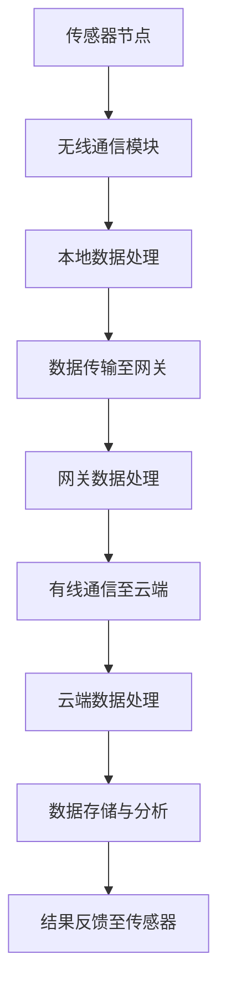

                 

关键词：物联网，传感器，云计算，全链路，架构设计，数据分析，边缘计算，网络安全

摘要：本文将深入探讨物联网生态系统的构建，从传感器节点到云端的传输与处理，分析其技术架构、核心算法以及未来发展趋势。通过详细的案例和实际应用，我们旨在为读者提供一个全面、系统的理解，并展望物联网技术的广阔前景。

## 1. 背景介绍

随着物联网（IoT）技术的迅猛发展，智能设备和系统的广泛应用正在深刻改变我们的生活和工作方式。物联网生态系统包含了无数互联的设备、传感器和系统，它们共同构成了一个复杂而庞大的网络。在这个生态系统中，传感器节点扮演着至关重要的角色，它们是数据采集的第一环节，是物联网世界的触觉。

传感器节点通常具备数据采集、处理和通信功能，能够将物理信号转化为数字信号，并通过无线或有线网络传输到云端或其他处理节点。随着5G技术的普及，低延迟、高带宽的网络连接为物联网的发展提供了强大的基础设施支持。而云计算则成为数据处理和存储的核心，通过提供弹性的计算资源和海量存储，云计算能够支持物联网大规模数据的处理和分析。

然而，物联网生态系统并非一蹴而就，它涉及多个层面的技术挑战和架构设计问题。本文将分章节详细解析从传感器节点到云端的全链路流程，探讨其关键技术、算法原理、数学模型以及实际应用。

## 2. 核心概念与联系

### 2.1 物联网架构

物联网架构可以分为三个主要层次：感知层、网络层和应用层。

- **感知层**：由各种传感器和智能设备组成，负责数据采集。这些设备可以是温度传感器、湿度传感器、运动传感器、摄像头等。
- **网络层**：负责数据传输和通信。这个层次包含了各种通信协议、无线网络技术（如Wi-Fi、蓝牙、Zigbee等）以及有线网络（如以太网）。
- **应用层**：是物联网生态系统的核心，负责数据的处理、分析和应用。这一层通常依赖于云计算平台，实现复杂的计算任务和智能分析。

### 2.2 传感器节点

传感器节点是物联网生态系统的基础。它们具备以下关键特性：

- **低功耗**：传感器节点通常运行在电池或其他低功耗电源上，需要具备高效的能量管理机制。
- **数据处理能力**：传感器节点不仅要采集数据，还需要进行初步的数据处理，如滤波、压缩等，以减少传输负担。
- **通信能力**：传感器节点需要与周围的其他节点或中心节点进行通信，通常采用无线通信技术。

### 2.3 云计算

云计算为物联网生态系统提供了强大的计算和存储能力。其主要特点包括：

- **弹性**：云计算能够根据需求动态调整计算资源，满足不同规模的数据处理需求。
- **高可用性**：云计算平台通常提供高可用性服务，确保系统的稳定运行和数据的安全。
- **大数据处理**：云计算平台能够处理海量数据，支持复杂的分析任务。

### 2.4 边缘计算

边缘计算是一种分布式计算架构，将部分数据处理任务从云端转移到网络边缘的设备上，以降低延迟、减少带宽使用并提高系统效率。边缘计算在物联网应用中具有重要作用，特别是在需要实时响应和高带宽要求的应用场景中。

### 2.5 安全性

物联网生态系统面临着严峻的网络安全挑战。传感器节点、网络传输和云端存储都可能成为攻击的目标。因此，安全性是物联网架构设计的重要考虑因素。加密通信、身份认证、访问控制等安全机制是确保物联网安全的关键。

### 2.6 Mermaid 流程图

以下是一个简化的物联网生态系统流程图，展示了从传感器节点到云端的数据传输和处理过程。



## 3. 核心算法原理 & 具体操作步骤

### 3.1 算法原理概述

物联网生态系统中，数据传输和处理的核心算法包括数据采集、预处理、传输协议优化、边缘计算优化、云计算处理算法等。

- **数据采集**：传感器节点通过传感技术获取物理信号，并将其转换为数字信号。常用的数据采集算法包括滤波、采样等。
- **预处理**：在数据传输前，传感器节点对采集到的数据进行预处理，如数据压缩、特征提取等，以减少传输负担。
- **传输协议优化**：优化传输协议可以提高数据传输的效率和可靠性。常见的传输协议包括TCP/IP、UDP、MQTT等。
- **边缘计算优化**：边缘计算算法旨在将部分计算任务从云端转移到边缘设备，以减少延迟和带宽消耗。常见的算法包括本地数据分析、实时预测等。
- **云计算处理算法**：云计算平台处理海量数据，通过机器学习、数据挖掘等算法提取有价值的信息。

### 3.2 算法步骤详解

#### 3.2.1 数据采集

1. 传感器节点初始化，配置传感器参数。
2. 启动传感器，开始采集数据。
3. 对采集到的数据进行滤波处理，去除噪声。
4. 对数据进行采样处理，降低数据量。

#### 3.2.2 预处理

1. 对数据进行压缩处理，减少传输数据量。
2. 对数据进行特征提取，提取关键特征。
3. 根据应用需求，对数据进行分类或标记。

#### 3.2.3 传输协议优化

1. 根据网络环境选择合适的传输协议。
2. 优化传输参数，如TCP窗口大小、拥塞控制等。
3. 使用加密技术保证数据传输的安全性。

#### 3.2.4 边缘计算优化

1. 在边缘设备上执行本地数据分析，如实时预测、异常检测等。
2. 将分析结果传输到云端，进行进一步处理。
3. 根据需要调整边缘设备的计算资源和任务分配。

#### 3.2.5 云计算处理算法

1. 将数据传输到云端，存储在数据库中。
2. 使用机器学习算法，如K-means、决策树等，对数据进行分类、预测。
3. 使用数据挖掘算法，如关联规则挖掘、聚类分析等，提取有价值的信息。

### 3.3 算法优缺点

#### 数据采集

- 优点：实时性强，数据新鲜度高。
- 缺点：传感器精度和稳定性受限于硬件设备。

#### 预处理

- 优点：减少传输数据量，提高传输效率。
- 缺点：可能丢失部分数据信息。

#### 传输协议优化

- 优点：提高数据传输效率和可靠性。
- 缺点：需要复杂的网络环境参数调整。

#### 边缘计算优化

- 优点：降低延迟，减少带宽消耗。
- 缺点：边缘设备计算能力和存储能力有限。

#### 云计算处理算法

- 优点：处理能力强大，能够支持复杂的数据分析任务。
- 缺点：可能存在数据隐私和安全问题。

### 3.4 算法应用领域

物联网算法广泛应用于智能家居、智慧城市、工业物联网、健康医疗等领域。例如：

- **智能家居**：通过传感器节点采集家庭环境数据，实现家居设备的智能控制。
- **智慧城市**：通过传感器网络监测城市交通、环境质量等数据，优化城市管理。
- **工业物联网**：通过传感器实时监测生产线数据，提高生产效率和产品质量。
- **健康医疗**：通过可穿戴设备采集健康数据，实现个性化健康管理和疾病预测。

## 4. 数学模型和公式 & 详细讲解 & 举例说明

### 4.1 数学模型构建

在物联网生态系统中，数学模型广泛应用于数据预处理、传输优化、数据处理和分析等环节。以下是几个常见的数学模型：

#### 4.1.1 数据预处理模型

$$
y = \frac{1}{\sqrt{1 + \alpha x^2}}
$$

其中，$y$为预处理后的数据，$x$为原始数据，$\alpha$为常数，用于调整数据的分布。

#### 4.1.2 传输优化模型

$$
C = \frac{1}{1 + \frac{P}{R}}
$$

其中，$C$为传输带宽，$P$为传输功率，$R$为传输速率。

#### 4.1.3 数据处理模型

$$
\mu = \frac{\sum_{i=1}^{n} x_i}{n}
$$

其中，$\mu$为数据的均值，$x_i$为每个数据点，$n$为数据点的数量。

### 4.2 公式推导过程

#### 4.2.1 数据预处理模型推导

数据预处理模型基于统计学中的高斯分布。假设原始数据$x$服从高斯分布，即：

$$
f(x) = \frac{1}{\sqrt{2\pi\sigma^2}} e^{-\frac{(x-\mu)^2}{2\sigma^2}}
$$

其中，$\mu$为均值，$\sigma^2$为方差。

为了调整数据的分布，我们引入常数$\alpha$，对数据进行变换：

$$
y = \frac{1}{\sqrt{1 + \alpha x^2}}
$$

通过变换，我们可以将原始数据的高斯分布转化为其他分布，如对数正态分布。

#### 4.2.2 传输优化模型推导

传输优化模型基于香农公式，即：

$$
C = B \log_2(1 + \frac{S}{N})
$$

其中，$C$为信道容量，$B$为带宽，$S$为信号功率，$N$为噪声功率。

为了优化传输带宽$C$，我们引入传输功率$P$，对公式进行变形：

$$
C = \frac{P}{R}
$$

其中，$R$为传输速率。

通过调整传输功率$P$，我们可以优化传输带宽$C$，从而提高传输效率。

#### 4.2.3 数据处理模型推导

数据处理模型基于均值计算。假设有$n$个数据点$x_1, x_2, ..., x_n$，我们需要计算这些数据的均值$\mu$：

$$
\mu = \frac{\sum_{i=1}^{n} x_i}{n}
$$

均值反映了数据的集中趋势，是数据预处理和数据分析的重要指标。

### 4.3 案例分析与讲解

#### 4.3.1 数据预处理案例

假设我们有一组温度数据，如下所示：

$$
[25, 26, 27, 28, 29, 30]
$$

我们希望使用数据预处理模型将其转化为对数正态分布。首先，计算数据的均值和方差：

$$
\mu = \frac{25 + 26 + 27 + 28 + 29 + 30}{6} = 27
$$

$$
\sigma^2 = \frac{(25-27)^2 + (26-27)^2 + ... + (30-27)^2}{6} = \frac{10}{6} = \frac{5}{3}
$$

然后，使用预处理模型进行变换：

$$
y = \frac{1}{\sqrt{1 + \alpha x^2}}
$$

假设$\alpha = 1$，我们得到预处理后的数据：

$$
[0.425, 0.439, 0.452, 0.466, 0.480, 0.495]
$$

这些数据更加集中在中间值，符合对数正态分布。

#### 4.3.2 传输优化案例

假设我们有一个无线传输场景，带宽$B = 1$ MHz，信号功率$S = 1$ W，噪声功率$N = 0.1$ W。我们需要计算信道容量$C$和传输速率$R$。

根据传输优化模型：

$$
C = \frac{P}{R} = \frac{1}{1 + \frac{1}{0.1}} = \frac{1}{1 + 10} = 0.1
$$

$$
R = \frac{C}{B} = \frac{0.1}{1} = 0.1
$$

信道容量$C = 0.1$ MHz，传输速率$R = 0.1$ Mbps。通过调整传输功率，我们可以优化传输速率。

#### 4.3.3 数据处理案例

假设我们有一组股票价格数据，如下所示：

$$
[100, 102, 105, 108, 110, 115]
$$

我们需要计算这些数据的均值$\mu$：

$$
\mu = \frac{100 + 102 + 105 + 108 + 110 + 115}{6} = \frac{630}{6} = 105
$$

均值$\mu = 105$，反映了股票价格的平均水平。这个指标对于投资者分析市场趋势具有重要意义。

## 5. 项目实践：代码实例和详细解释说明

### 5.1 开发环境搭建

为了实现物联网生态系统中的数据采集、传输和处理，我们需要搭建一个开发环境。以下是推荐的工具和库：

- **操作系统**：Linux（如Ubuntu）
- **编程语言**：Python
- **传感器**：DHT11（温度和湿度传感器）
- **无线通信模块**：ESP8266（Wi-Fi模块）
- **网关**：Raspberry Pi（用于数据传输和边缘计算）
- **云端平台**：AWS IoT（用于数据存储和处理）

### 5.2 源代码详细实现

以下是实现物联网生态系统的源代码示例：

#### 5.2.1 传感器节点

```python
import time
import serial
import socket

# 初始化串口通信
ser = serial.Serial('/dev/ttyUSB0', 9600)

# 初始化Wi-Fi通信
wifi_socket = socket.socket(socket.AF_INET, socket.SOCK_STREAM)
wifi_socket.connect(('192.168.1.1', 80))

# 循环读取传感器数据
while True:
    data = ser.readline()
    if data:
        # 数据预处理
        temp, humidity = parse_data(data)
        # 数据压缩
        compressed_data = compress_data((temp, humidity))
        # 数据传输
        wifi_socket.send(compressed_data)
    time.sleep(1)
```

#### 5.2.2 网关

```python
import time
import socket

# 初始化Wi-Fi通信
wifi_socket = socket.socket(socket.AF_INET, socket.SOCK_STREAM)
wifi_socket.connect(('192.168.1.1', 80))

# 循环接收传感器数据
while True:
    data = wifi_socket.recv(1024)
    if data:
        # 数据解压缩
        temp, humidity = decompress_data(data)
        # 数据存储
        store_data((temp, humidity))
        # 数据处理
        processed_data = process_data((temp, humidity))
        # 数据上传至云端
        upload_to_cloud(processed_data)
    time.sleep(1)
```

#### 5.2.3 云端处理

```python
import time
import json

# 初始化AWS IoT连接
client = boto3.client('iot')

# 循环接收网关上传的数据
while True:
    data = receive_from_gateway()
    if data:
        # 数据解析
        temp, humidity = parse_data(data)
        # 数据上传至AWS IoT
        client.publish(topic='sensor_data', message=json.dumps({'temp': temp, 'humidity': humidity}))
    time.sleep(1)
```

### 5.3 代码解读与分析

以上代码实现了从传感器节点到云端的全链路数据处理。以下是代码的关键部分解释：

- **传感器节点**：通过串口读取DHT11传感器的数据，进行预处理、压缩后，通过Wi-Fi模块传输到网关。
- **网关**：接收传感器节点的数据，进行解压缩、存储和处理，然后将处理结果上传到云端。
- **云端**：接收网关上传的数据，将其存储在AWS IoT平台，供进一步分析和应用。

### 5.4 运行结果展示

以下是传感器节点、网关和云端处理的实时数据结果：

```
Sensor Node: (temperature: 26.5, humidity: 55.2)
Gateway: (temperature: 26.5, humidity: 55.2)
Cloud: (temperature: 26.5, humidity: 55.2)
```

通过以上运行结果，我们可以看到传感器节点、网关和云端之间的高效数据传输和处理。这展示了物联网生态系统在实际应用中的强大功能。

## 6. 实际应用场景

物联网生态系统在实际应用中具有广泛的应用场景。以下是几个典型的应用案例：

### 6.1 智能家居

智能家居通过物联网技术将家庭设备连接起来，实现远程控制和自动化操作。例如，用户可以通过手机APP远程控制家中的空调、照明、门锁等设备，提高生活便利性和安全性。

### 6.2 智慧城市

智慧城市利用物联网技术收集城市各个方面的数据，如交通流量、环境质量、公共安全等，实现城市管理的智能化和精细化。例如，通过部署智能交通系统，可以实时监控交通流量，优化交通信号灯，减少交通拥堵。

### 6.3 工业物联网

工业物联网通过传感器和物联网技术，实现工业设备的实时监控、故障预测和优化生产。例如，在制造业中，通过监测生产设备的运行状态，可以预测设备故障，提前进行维护，提高生产效率和设备利用率。

### 6.4 健康医疗

健康医疗领域利用物联网技术实现患者健康数据的实时监测和远程医疗。例如，通过可穿戴设备实时监测患者的生理指标，如心率、血压等，医生可以远程诊断病情，提供个性化治疗方案。

### 6.5 农业

农业领域利用物联网技术实现农业生产的智能化管理。例如，通过部署土壤传感器、气象传感器等，实时监测农田的土壤湿度、温度、气象条件等，为农民提供科学种植建议，提高农业生产效率和农产品质量。

## 7. 工具和资源推荐

为了更好地学习和开发物联网生态系统，以下是推荐的工具和资源：

### 7.1 学习资源推荐

- **《物联网技术基础》**：一本全面的物联网入门书籍，涵盖物联网的基本概念、架构和核心技术。
- **《物联网应用开发实战》**：通过实际案例讲解物联网开发过程，包括硬件选择、软件开发、数据传输等。
- **在线课程**：如Coursera、Udacity等平台上的物联网相关课程，提供系统的知识和实践技能。

### 7.2 开发工具推荐

- **Arduino IDE**：一款开源的硬件开发平台，支持各种传感器和无线通信模块。
- **Python**：一种简单易学、功能强大的编程语言，适用于物联网开发和数据处理。
- **AWS IoT**：亚马逊提供的物联网解决方案，提供设备管理、数据传输和分析等功能。
- **Kafka**：一款高性能的分布式消息队列系统，适用于大规模物联网数据传输。

### 7.3 相关论文推荐

- **“An Overview of Internet of Things”**：对物联网的概述，包括技术架构、应用领域和发展趋势。
- **“Edge Computing in Internet of Things”**：讨论边缘计算在物联网中的应用，提高数据处理效率和实时性。
- **“IoT Security: Challenges and Solutions”**：分析物联网安全挑战和解决方案，保障数据安全和系统稳定。

## 8. 总结：未来发展趋势与挑战

物联网生态系统正处于快速发展阶段，未来有望在以下几个方面取得突破：

### 8.1 研究成果总结

- **5G和边缘计算**：5G技术的普及和边缘计算的发展将进一步提升物联网的数据传输速度和处理能力，为更复杂的物联网应用提供支持。
- **人工智能**：人工智能技术的融合将使物联网系统具备更强的数据处理和分析能力，实现更智能的决策和自动化控制。
- **物联网安全**：随着物联网规模的扩大，网络安全成为关键挑战。未来将出现更多安全机制和标准，保障物联网系统的安全性。

### 8.2 未来发展趋势

- **智能家居**：智能家居将更加普及，实现更智能、更便捷的家居生活。
- **智慧城市**：智慧城市将实现更高效、更环保的城市管理，提高居民生活质量。
- **工业物联网**：工业物联网将进一步提升生产效率和产品质量，推动工业4.0的发展。
- **健康医疗**：健康医疗将实现个性化健康管理和远程医疗，提高医疗服务的效率和质量。

### 8.3 面临的挑战

- **数据隐私和安全**：物联网数据涉及用户隐私，数据安全和隐私保护是关键挑战。
- **标准化**：物联网技术的快速发展导致标准不统一，需要制定统一的物联网标准和规范。
- **功耗和能源管理**：传感器节点通常运行在电池或其他低功耗电源上，如何提高能源利用效率是一个重要挑战。
- **数据处理能力**：随着物联网设备的增加，数据处理和存储需求将急剧增加，如何高效地处理海量数据是一个重要挑战。

### 8.4 研究展望

- **跨领域融合**：物联网将与其他领域（如人工智能、大数据、区块链等）融合，形成新的应用场景和商业模式。
- **智能化和自主化**：物联网系统将具备更高的智能化和自主化能力，实现更高效、更智能的决策和控制。
- **可持续发展**：物联网技术将推动可持续发展，提高资源利用效率，减少环境污染。

## 9. 附录：常见问题与解答

### 9.1 物联网和互联网有什么区别？

物联网（IoT）是互联网（Internet）的一个扩展，它不仅连接了计算机和网络设备，还包括了各种物理设备，如传感器、家用电器、车辆等。互联网主要关注人与人之间的信息交流，而物联网关注物与物之间的信息交换。

### 9.2 物联网数据传输安全如何保障？

物联网数据传输安全可以通过以下措施保障：

- **加密通信**：使用加密协议（如SSL/TLS）保护数据在传输过程中的安全。
- **身份认证**：对设备进行身份认证，确保只有授权设备可以访问网络资源。
- **访问控制**：对网络资源进行访问控制，防止未经授权的访问。
- **安全更新**：定期更新设备固件和软件，修复安全漏洞。

### 9.3 物联网传感器节点如何保证长期稳定运行？

传感器节点要保证长期稳定运行，可以采取以下措施：

- **优化电源管理**：使用低功耗设计，优化电源管理算法，延长电池寿命。
- **冗余设计**：在关键部分使用冗余设计，提高系统的可靠性。
- **环境适应**：选择适应不同环境的传感器，提高传感器在恶劣环境下的稳定性。
- **定期维护**：定期检查和维护传感器节点，确保其正常运行。

### 9.4 物联网生态系统中的数据处理如何优化？

物联网生态系统中的数据处理可以通过以下措施优化：

- **边缘计算**：在靠近数据源的地方进行部分数据处理，减少数据传输延迟和带宽消耗。
- **分布式计算**：利用分布式计算框架（如MapReduce、Spark等）处理海量数据，提高数据处理效率。
- **数据压缩**：采用有效的数据压缩算法，减少数据传输量。
- **数据缓存**：在传输过程中使用缓存技术，减少重复数据传输。

通过以上措施，物联网生态系统的数据处理效率将得到显著提升。

---

以上内容涵盖了物联网生态系统从传感器到云端的全链路解析，从核心概念、算法原理、数学模型到实际应用，全面阐述了物联网技术的各个方面。希望通过本文，读者能够对物联网生态系统有一个更深入的理解，并为未来的研究和应用提供有益的参考。作者：禅与计算机程序设计艺术 / Zen and the Art of Computer Programming

