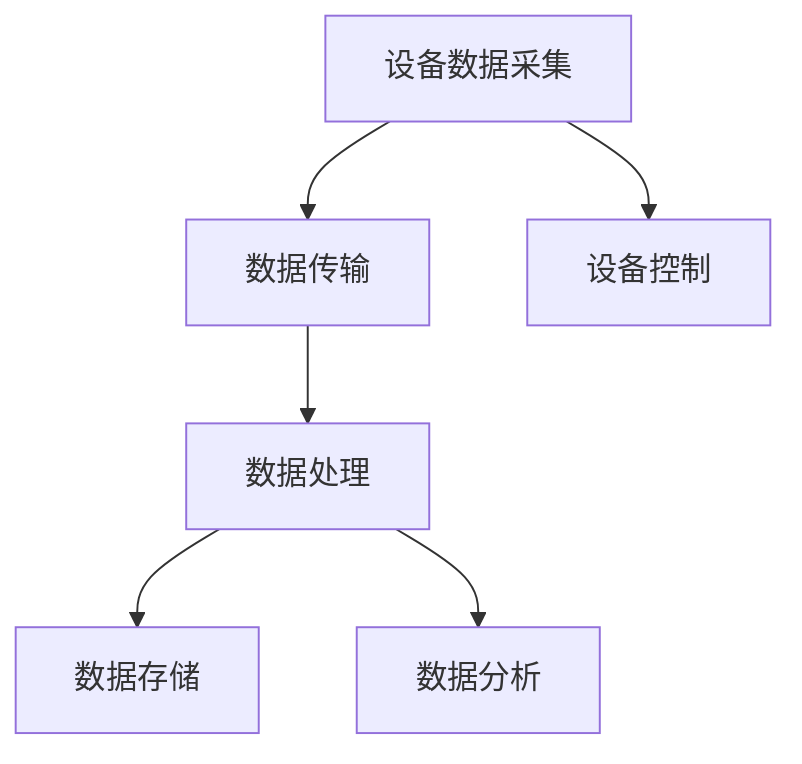

                 

关键词：物联网，设备整合，网络结构，数据分析，生态系统，数据处理，智能设备，技术趋势。

物联网（IoT）已经深刻地改变了我们的生活方式和工业流程。通过将设备连接到互联网，我们可以实现实时数据采集、远程监控和控制，从而提高效率、降低成本、增强安全性。本文将探讨物联网生态系统的构建，包括设备、网络和数据分析的整合，以及相关技术趋势和发展方向。

## 1. 背景介绍

物联网生态系统是指由各种设备、传感器、网络和数据处理系统组成的一个复杂系统。这个系统的核心目标是将物理世界与数字世界相结合，实现信息的无缝流动和智能处理。随着物联网技术的不断发展，越来越多的设备和系统被纳入这个生态系统，使得物联网的应用范围越来越广泛。

### 物联网的发展历程

物联网的概念最早可以追溯到20世纪80年代，当时的学者们开始研究如何将物理设备连接到互联网。然而，真正的物联网应用开始于2005年，IBM提出了“智慧地球”的概念，推动了物联网技术的发展。近年来，随着传感器、无线通信和云计算技术的进步，物联网得到了迅猛发展。

### 物联网的应用领域

物联网的应用领域非常广泛，包括智能家居、智能交通、智能医疗、工业4.0等。例如，在智能家居领域，物联网技术可以实现家电的远程控制、能源管理、安全监控等功能；在智能交通领域，可以通过物联网技术实现交通流量监测、智能导航、车辆管理等功能。

## 2. 核心概念与联系

### 设备

物联网生态系统中的设备是数据采集的关键，它们可以包括传感器、执行器、智能终端等。这些设备可以通过无线或有线方式连接到网络，实现数据的实时传输和远程控制。

### 网络

物联网生态系统中的网络结构主要包括有线网络和无线网络。有线网络如以太网、光纤等提供了稳定的连接，而无线网络如Wi-Fi、蓝牙、LoRa等则提供了灵活的连接方式。网络的选择取决于应用场景和需求。

### 数据分析

数据分析是物联网生态系统中的重要环节，通过对采集到的数据进行分析和处理，可以提取有价值的信息，为决策提供支持。数据分析技术包括数据挖掘、机器学习、深度学习等。

### Mermaid 流程图

以下是物联网生态系统的 Mermaid 流程图：



## 3. 核心算法原理 & 具体操作步骤

### 算法原理概述

物联网生态系统中的核心算法主要包括数据传输算法、数据处理算法和设备控制算法。这些算法的目标是确保数据的高效传输、处理和控制。

### 算法步骤详解

#### 数据传输算法

1. 设备采集数据。
2. 将数据通过网络传输到服务器。
3. 服务器对数据进行预处理和存储。

#### 数据处理算法

1. 从数据存储中提取数据。
2. 使用数据挖掘、机器学习等技术对数据进行分析。
3. 根据分析结果生成报告或决策。

#### 设备控制算法

1. 服务器接收控制指令。
2. 将指令通过网络发送到设备。
3. 设备根据指令执行相应的操作。

### 算法优缺点

#### 数据传输算法

**优点：**
- 高效：数据可以通过网络快速传输。
- 灵活：支持多种传输协议和方式。

**缺点：**
- 安全性：数据在传输过程中可能被窃取或篡改。
- 成本：需要部署和维护网络设备。

#### 数据处理算法

**优点：**
- 智能化：可以自动提取有价值的信息。
- 实时性：可以实时处理和分析数据。

**缺点：**
- 复杂性：需要使用复杂的技术和算法。
- 数据隐私：可能涉及到用户隐私问题。

#### 设备控制算法

**优点：**
- 远程控制：可以远程控制和监控设备。
- 自动化：可以自动化执行任务。

**缺点：**
- 安全性：设备可能受到恶意攻击。
- 稳定性：可能受到网络延迟和中断的影响。

### 算法应用领域

物联网生态系统的算法广泛应用于智能家居、智能交通、智能医疗等领域。例如，在智能家居领域，算法可以实现家电的自动化控制和能源管理；在智能交通领域，算法可以实现交通流量监测和智能导航。

## 4. 数学模型和公式 & 详细讲解 & 举例说明

### 数学模型构建

在物联网生态系统中，常见的数学模型包括马尔可夫决策过程（MDP）、贝叶斯网络和神经网络。这些模型可以用于设备控制、数据分析和预测。

### 公式推导过程

#### 马尔可夫决策过程（MDP）

MDP的公式如下：

$$
V^*(s) = \max_{a} \sum_{s'} p(s' | s, a) \cdot \max_{a'} r(s', a') + \gamma V^*(s')
$$

其中，$V^*(s)$ 是状态值函数，$s$ 是当前状态，$a$ 是当前动作，$s'$ 是下一状态，$a'$ 是下一动作，$p(s' | s, a)$ 是状态转移概率，$r(s', a')$ 是回报函数，$\gamma$ 是折扣因子。

#### 贝叶斯网络

贝叶斯网络的公式如下：

$$
P(A|B) = \frac{P(B|A)P(A)}{P(B)}
$$

其中，$P(A|B)$ 是在给定 $B$ 的条件下 $A$ 的概率，$P(B|A)$ 是在给定 $A$ 的条件下 $B$ 的概率，$P(A)$ 是 $A$ 的先验概率，$P(B)$ 是 $B$ 的先验概率。

#### 神经网络

神经网络的公式如下：

$$
\text{输出} = \text{激活函数}(\text{权重} \cdot \text{输入} + \text{偏置})
$$

其中，激活函数可以是 sigmoid、ReLU 等，权重和输入通过前向传播计算，偏置用于调整网络输出。

### 案例分析与讲解

#### 智能交通信号控制

假设我们使用 MDP 来构建智能交通信号控制模型，我们可以将每个交叉路口视为一个状态，红绿灯变化视为动作。通过分析历史数据，我们可以计算出每个状态下的最优动作，从而实现智能交通信号控制。

#### 家居能源管理

我们可以使用贝叶斯网络来构建家居能源管理模型，通过分析用户行为和设备使用情况，我们可以预测未来的能源消耗，并根据预测结果调整家居设备的工作状态。

#### 智能医疗诊断

我们可以使用神经网络来构建智能医疗诊断模型，通过训练大量的医疗数据，我们可以使神经网络识别疾病，从而辅助医生进行诊断。

## 5. 项目实践：代码实例和详细解释说明

### 开发环境搭建

为了演示物联网生态系统的实践，我们选择使用 Python 作为开发语言，并使用以下库：TensorFlow、Keras、Scikit-learn 等。

### 源代码详细实现

以下是一个简单的智能家居能源管理模型的代码实现：

```python
import tensorflow as tf
from tensorflow.keras.models import Sequential
from tensorflow.keras.layers import Dense
from sklearn.model_selection import train_test_split

# 数据预处理
# ...

# 构建神经网络模型
model = Sequential()
model.add(Dense(64, input_dim=输入维度，activation='relu'))
model.add(Dense(64, activation='relu'))
model.add(Dense(1, activation='sigmoid'))

# 编译模型
model.compile(loss='binary_crossentropy', optimizer='adam', metrics=['accuracy'])

# 训练模型
model.fit(X_train, y_train, epochs=10, batch_size=32)

# 评估模型
loss, accuracy = model.evaluate(X_test, y_test)
print('测试集准确性：', accuracy)
```

### 代码解读与分析

这段代码首先使用了 TensorFlow 和 Keras 构建了一个简单的神经网络模型，用于家居能源管理。数据预处理部分负责将原始数据转换为模型所需的格式。在训练过程中，我们使用 binary_crossentropy 作为损失函数，adam 作为优化器，并设置了 10 个训练周期和批量大小为 32。

### 运行结果展示

通过训练和评估，我们得到了一个准确性较高的模型，这表明模型可以较好地预测家居能源消耗。在实际应用中，我们可以根据预测结果调整家居设备的工作状态，以降低能源消耗。

## 6. 实际应用场景

### 智能家居

智能家居是物联网技术的典型应用场景之一。通过将各种家电设备连接到互联网，我们可以实现家电的远程控制、能源管理和安全监控等功能。例如，我们可以通过手机 App 或语音助手远程控制家里的灯光、空调、门锁等设备，实现智能化的家居生活。

### 智能交通

智能交通是另一个重要的应用领域。通过物联网技术，我们可以实现交通流量监测、智能导航、车辆管理等功能，从而提高交通效率、降低交通拥堵。例如，在高峰期，交通信号灯可以根据实时交通流量自动调整红绿灯时长，以减少交通拥堵。

### 智能医疗

智能医疗是物联网技术的又一重要应用领域。通过将医疗设备连接到互联网，我们可以实现远程医疗诊断、患者监护、医疗数据分析等功能，从而提高医疗服务的质量和效率。例如，医生可以通过远程监控设备了解患者的健康状况，并根据数据做出诊断和治疗决策。

## 7. 工具和资源推荐

### 学习资源推荐

1. 《物联网基础教程》：这是一本全面介绍物联网基础知识和应用的教材，适合初学者。
2. 《深度学习》：这是一本介绍深度学习算法和应用的书，适合希望深入了解物联网数据分析技术的人。

### 开发工具推荐

1. Python：Python 是一种广泛使用的编程语言，适合开发物联网应用程序。
2. TensorFlow：TensorFlow 是一个开源的深度学习框架，适合构建物联网数据分析模型。

### 相关论文推荐

1. "Internet of Things: A Survey"：这是一篇关于物联网技术的综述论文，介绍了物联网的概念、应用和发展趋势。
2. "Deep Learning for Internet of Things"：这是一篇关于深度学习在物联网应用中的论文，介绍了深度学习在物联网数据分析中的应用。

## 8. 总结：未来发展趋势与挑战

### 未来发展趋势

1. **人工智能与物联网的深度融合**：未来，人工智能将更深入地融入物联网生态系统，实现更加智能化的数据分析和设备控制。
2. **5G 技术的广泛应用**：5G 技术的普及将极大地提高物联网的数据传输速度和可靠性，推动物联网应用的发展。
3. **边缘计算的兴起**：随着物联网设备数量的增加，边缘计算将变得更加重要，可以在本地处理数据，降低延迟和带宽需求。

### 面临的挑战

1. **数据安全和隐私保护**：物联网生态系统中的数据安全和隐私保护是一个重大挑战，需要采取有效的措施确保数据的安全。
2. **标准化和兼容性问题**：物联网设备的多样性和兼容性问题仍然是挑战，需要制定统一的通信协议和数据格式标准。
3. **可持续发展**：物联网设备的广泛部署可能会带来环境问题，如电子废弃物和能源消耗，需要采取可持续的发展策略。

### 研究展望

未来，物联网技术将继续发展，结合人工智能、5G 和边缘计算等技术，实现更加智能化、高效化和可持续化的物联网生态系统。研究人员和工程师需要不断探索新的技术和解决方案，以应对挑战，推动物联网技术的发展。

## 9. 附录：常见问题与解答

### 问题 1：物联网的数据传输速度如何？

物联网的数据传输速度取决于网络类型和应用场景。无线网络如 Wi-Fi、蓝牙和 LoRa 等提供了较高的数据传输速度，但可能受到信号干扰和距离限制。有线网络如以太网和光纤等提供了更稳定和高效的数据传输速度，但安装和维护成本较高。

### 问题 2：物联网设备的安全问题如何解决？

物联网设备的安全问题可以通过以下措施解决：
- 使用加密技术确保数据传输的安全性。
- 实施访问控制机制，确保只有授权用户可以访问设备。
- 定期更新设备固件和软件，以修复已知的安全漏洞。

### 问题 3：物联网的数据处理技术有哪些？

物联网的数据处理技术包括：
- 数据挖掘：用于从大量数据中提取有价值的信息。
- 机器学习和深度学习：用于构建预测模型和自动化决策。
- 分布式计算和云计算：用于处理和分析海量数据。

### 问题 4：物联网设备的兼容性问题如何解决？

物联网设备的兼容性问题可以通过以下措施解决：
- 制定统一的通信协议和数据格式标准。
- 使用中间件技术实现不同设备之间的通信。
- 开发兼容性强的设备驱动程序。

### 问题 5：物联网的可持续发展如何实现？

物联网的可持续发展可以通过以下措施实现：
- 设计和部署能耗低的物联网设备。
- 采用回收和处理措施，减少电子废弃物。
- 推广可持续的物联网解决方案，如智能能源管理和智能农业等。

作者：禅与计算机程序设计艺术 / Zen and the Art of Computer Programming

