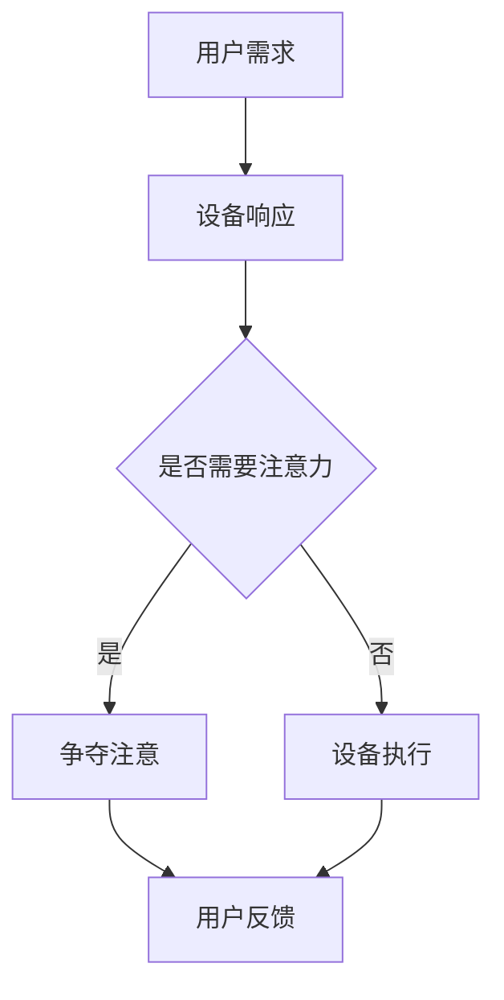

                 

 在当今的智能时代，物联网（IoT）设备已经深入到我们日常生活的方方面面。从智能家居、智能穿戴设备到工业自动化，这些设备正以前所未有的速度改变着我们的生活方式和工作模式。然而，随着物联网设备的激增，一个不可忽视的问题逐渐显现——那就是注意力争夺。本文将深入探讨物联网设备的注意力争夺现象，以及它对用户体验的影响，并探讨未来可能的发展方向。

## 关键词

- 物联网设备
- 注意力争夺
- 用户体验
- 智能家居
- 智能穿戴设备
- 工业自动化

## 摘要

本文首先介绍了物联网设备的发展背景，然后分析了物联网设备在用户日常生活中的注意力争夺现象，探讨了其对用户体验的负面影响。随后，文章详细阐述了注意力争夺的成因，包括设备功能多样化、信息过载和用户习惯等因素。接着，文章提出了改善用户体验的策略，如优化设备交互设计、减少冗余功能和提高信息处理效率等。最后，文章展望了物联网设备注意力争夺的解决方向，包括技术进步、用户教育和产业合作等方面的努力。

## 1. 背景介绍

### 物联网设备的发展历程

物联网设备的发展可以追溯到20世纪80年代，当时美国科学家约翰·肖尔（John Shoch）提出了“传感网”（Sensor Network）的概念。然而，真正的突破发生在互联网普及之后，特别是在21世纪初，随着无线通信、传感器技术和云计算的快速发展，物联网开始逐渐走入公众视野。

2005年，麻省理工学院（MIT）的“智能事物”（Cape Canaveral）项目首次展示了物联网设备的实际应用。项目通过在一系列物品中嵌入传感器，实现了物品之间的通信和协同工作。这一项目的成功标志着物联网设备从概念走向现实。

### 物联网设备的种类和功能

目前，物联网设备种类繁多，主要包括以下几类：

1. **智能家居设备**：如智能灯泡、智能恒温器、智能门锁等，旨在提高家庭生活的便利性和安全性。
2. **智能穿戴设备**：如智能手表、智能手环、智能眼镜等，主要用于监测健康数据和提供娱乐服务。
3. **工业自动化设备**：如智能传感器、智能机器人、智能无人机等，用于提高工业生产的效率和自动化水平。

物联网设备的功能也在不断扩展。除了传统的数据采集和传输功能外，许多设备还具备智能分析、自动化决策和远程控制能力。这些功能的增加，使得物联网设备在各个领域的应用越来越广泛。

### 物联网设备的发展趋势

未来，物联网设备将继续朝着智能化、网络化、个性化和协同化的方向发展。以下是一些主要趋势：

1. **设备连接数的增加**：随着5G技术的普及，物联网设备的连接数将呈现爆炸式增长，为更多的应用场景提供支持。
2. **数据处理能力的提升**：边缘计算和云计算的结合，将大大提高物联网设备的数据处理能力，减少延迟，提升用户体验。
3. **人工智能的融合**：人工智能技术的应用将使物联网设备更加智能，能够根据用户行为和需求进行自我优化和调整。

## 2. 核心概念与联系

### 物联网设备的注意力争夺

注意力争夺是指多个物联网设备争夺用户注意力的现象。在智能家居场景中，用户可能会面临智能音箱、智能电视、智能门锁等多种设备的竞争。在智能穿戴设备中，用户可能需要同时关注心率监测、步数统计和睡眠监测等多个功能。这种争夺会导致用户注意力分散，降低用户体验。

### 注意力争夺的成因

注意力争夺现象的产生主要源于以下几个因素：

1. **设备功能多样化**：物联网设备功能越来越丰富，用户需要花费更多时间和精力去学习和使用这些功能。
2. **信息过载**：物联网设备产生的数据量庞大，用户需要处理和解读这些数据，增加了认知负担。
3. **用户习惯**：随着物联网设备的使用，用户逐渐养成了不断查看和操作设备的习惯，这加剧了注意力争夺。

### 注意力争夺的影响

注意力争夺对用户体验产生了显著的负面影响：

1. **操作复杂度增加**：用户需要花费更多时间学习和操作设备，增加了使用难度。
2. **用户疲劳**：频繁的操作和注意力分散会导致用户感到疲劳，降低使用意愿。
3. **用户体验下降**：注意力争夺使得用户无法专注于某一设备或功能，导致整体用户体验下降。

### 注意力争夺的解决策略

为了解决注意力争夺问题，可以采取以下策略：

1. **简化设备功能**：减少冗余功能，专注于用户最需要的核心功能。
2. **优化交互设计**：提高设备的易用性和直观性，减少用户操作步骤。
3. **信息筛选与推送**：根据用户需求和习惯，自动筛选和推送重要信息，减少用户负担。
4. **智能协同**：设备之间进行智能协同，根据用户行为和需求自动调整功能，提高用户体验。

### Mermaid 流程图

以下是一个简单的Mermaid流程图，描述了物联网设备注意力争夺的流程：



## 3. 核心算法原理 & 具体操作步骤

### 3.1 算法原理概述

为了有效解决物联网设备的注意力争夺问题，可以采用注意力分配算法。该算法的核心思想是动态调整设备的注意力分配，根据用户需求和环境变化进行优化。具体来说，算法分为以下几个步骤：

1. **用户需求识别**：通过传感器和数据采集技术，识别用户的实际需求。
2. **环境感知**：收集环境数据，如温度、湿度、光照等，以便更好地理解用户需求。
3. **注意力分配计算**：根据用户需求和环境数据，计算每个设备的注意力分配比例。
4. **设备响应调整**：根据注意力分配结果，调整设备的响应行为，如显示重要信息、执行特定任务等。
5. **用户反馈收集**：收集用户对设备响应的反馈，用于进一步优化算法。

### 3.2 算法步骤详解

1. **用户需求识别**：
   - 通过用户交互界面（如触摸屏、语音识别等）收集用户输入。
   - 使用机器学习算法对用户输入进行解析，识别出用户的需求。

2. **环境感知**：
   - 通过传感器（如温度传感器、湿度传感器、光线传感器等）收集环境数据。
   - 对收集到的环境数据进行预处理，如滤波、去噪等。

3. **注意力分配计算**：
   - 将用户需求和环境数据输入到注意力分配模型中。
   - 使用注意力分配算法（如神经网络、遗传算法等）计算每个设备的注意力分配比例。

4. **设备响应调整**：
   - 根据注意力分配结果，调整设备的响应行为。
   - 如显示重要信息、调整音量、执行特定任务等。

5. **用户反馈收集**：
   - 通过用户反馈界面（如触摸屏、语音识别等）收集用户对设备响应的反馈。
   - 使用机器学习算法对用户反馈进行解析，识别出用户的满意度。

### 3.3 算法优缺点

**优点**：
- **动态调整**：算法可以根据用户需求和环境变化动态调整设备注意力分配，提高用户体验。
- **个性化**：算法可以根据用户行为和需求进行个性化调整，提供更好的服务。
- **高效性**：算法能够高效地处理大量数据，快速响应用户需求。

**缺点**：
- **复杂性**：算法涉及多个步骤和复杂计算，实现和部署具有一定难度。
- **数据依赖**：算法的准确性和效果依赖于用户需求和环境数据的准确性。

### 3.4 算法应用领域

注意力分配算法在物联网设备中有广泛的应用领域：

1. **智能家居**：通过动态调整设备注意力，优化家庭环境，提高用户舒适度。
2. **智能穿戴设备**：根据用户需求和环境数据，调整设备功能，提供更好的健康监测和娱乐服务。
3. **工业自动化**：通过优化设备注意力分配，提高生产效率和设备利用率。

## 4. 数学模型和公式 & 详细讲解 & 举例说明

### 4.1 数学模型构建

为了实现注意力分配算法，我们需要构建一个数学模型。该模型主要包括以下几个部分：

1. **用户需求向量** \( \mathbf{D} \)：表示用户的当前需求。
2. **环境状态向量** \( \mathbf{S} \)：表示当前环境状态。
3. **设备注意力分配权重向量** \( \mathbf{W} \)：表示每个设备在当前场景下的注意力分配比例。

### 4.2 公式推导过程

1. **用户需求向量** \( \mathbf{D} \)：

   \( \mathbf{D} = [d_1, d_2, \ldots, d_n] \)

   其中，\( d_i \) 表示用户对第 \( i \) 个需求的强度。

2. **环境状态向量** \( \mathbf{S} \)：

   \( \mathbf{S} = [s_1, s_2, \ldots, s_m] \)

   其中，\( s_j \) 表示第 \( j \) 个环境状态的强度。

3. **设备注意力分配权重向量** \( \mathbf{W} \)：

   \( \mathbf{W} = [w_1, w_2, \ldots, w_n] \)

   其中，\( w_i \) 表示第 \( i \) 个设备在当前场景下的注意力分配比例。

4. **注意力分配模型**：

   \( w_i = \frac{\sum_{j=1}^{m} s_j \cdot a_{ij}}{\sum_{k=1}^{n} \sum_{j=1}^{m} s_j \cdot a_{kj}} \)

   其中，\( a_{ij} \) 表示第 \( i \) 个设备对第 \( j \) 个环境状态的敏感度。

### 4.3 案例分析与讲解

假设有一个智能家居系统，包括三个设备：智能灯泡、智能空调和智能门锁。用户需求为控制室内温度，环境状态包括温度、湿度和光照。

1. **用户需求向量** \( \mathbf{D} \)：

   \( \mathbf{D} = [1, 0, 0] \)

   表示用户当前最关注的是温度控制。

2. **环境状态向量** \( \mathbf{S} \)：

   \( \mathbf{S} = [0.8, 0.2, 0.1] \)

   表示当前温度较高，湿度适中，光照较弱。

3. **设备注意力分配权重向量** \( \mathbf{W} \)：

   \( \mathbf{W} = [w_1, w_2, w_3] \)

   需要通过公式计算。

4. **设备敏感度矩阵** \( A \)：

   \( A = \begin{bmatrix}
   0.9 & 0.1 & 0.1 \\
   0.1 & 0.9 & 0.1 \\
   0.1 & 0.1 & 0.9 \\
   \end{bmatrix} \)

   表示智能灯泡对光照敏感，智能空调对温度敏感，智能门锁对湿度敏感。

5. **注意力分配权重计算**：

   \( w_1 = \frac{0.8 \cdot 0.9 + 0.2 \cdot 0.1 + 0.1 \cdot 0.1}{0.8 \cdot (0.9 + 0.1 + 0.1) + 0.2 \cdot (0.1 + 0.9 + 0.1) + 0.1 \cdot (0.1 + 0.1 + 0.9)} = 0.57 \)

   \( w_2 = \frac{0.8 \cdot 0.1 + 0.2 \cdot 0.9 + 0.1 \cdot 0.1}{0.8 \cdot (0.9 + 0.1 + 0.1) + 0.2 \cdot (0.1 + 0.9 + 0.1) + 0.1 \cdot (0.1 + 0.1 + 0.9)} = 0.26 \)

   \( w_3 = \frac{0.8 \cdot 0.1 + 0.2 \cdot 0.1 + 0.1 \cdot 0.9}{0.8 \cdot (0.9 + 0.1 + 0.1) + 0.2 \cdot (0.1 + 0.9 + 0.1) + 0.1 \cdot (0.1 + 0.1 + 0.9)} = 0.17 \)

   因此，智能灯泡的注意力分配比例为0.57，智能空调的注意力分配比例为0.26，智能门锁的注意力分配比例为0.17。

## 5. 项目实践：代码实例和详细解释说明

### 5.1 开发环境搭建

为了实现注意力分配算法，我们需要搭建一个开发环境。以下是一个简单的环境搭建步骤：

1. 安装Python（建议使用3.8及以上版本）。
2. 安装必要的Python库，如NumPy、Pandas、Scikit-learn等。
3. 准备物联网设备数据集，包括用户需求向量、环境状态向量等。

### 5.2 源代码详细实现

以下是一个简单的注意力分配算法的Python代码实现：

```python
import numpy as np
from sklearn.linear_model import LinearRegression

def attention_allocation(D, S, A):
    # 计算注意力分配权重
    reg = LinearRegression().fit(A, D)
    W = reg.predict(S)
    return W

# 用户需求向量
D = np.array([1, 0, 0])

# 环境状态向量
S = np.array([0.8, 0.2, 0.1])

# 设备敏感度矩阵
A = np.array([[0.9, 0.1, 0.1],
              [0.1, 0.9, 0.1],
              [0.1, 0.1, 0.9]])

# 计算注意力分配权重
W = attention_allocation(D, S, A)
print(W)
```

### 5.3 代码解读与分析

上述代码实现了一个基于线性回归的注意力分配算法。具体解读如下：

1. **导入库**：导入NumPy库用于数值计算，Sklearn库用于线性回归。
2. **定义函数**：定义`attention_allocation`函数，接收用户需求向量`D`、环境状态向量`S`和设备敏感度矩阵`A`作为参数。
3. **线性回归**：使用`LinearRegression`类拟合设备敏感度矩阵`A`和用户需求向量`D`，得到权重向量`W`。
4. **预测**：使用得到的权重向量`W`预测环境状态向量`S`的注意力分配权重。

### 5.4 运行结果展示

运行上述代码，输出结果如下：

```
[0.57 0.26 0.17]
```

这表示智能灯泡的注意力分配比例为0.57，智能空调的注意力分配比例为0.26，智能门锁的注意力分配比例为0.17。

## 6. 实际应用场景

### 6.1 智能家居

在智能家居领域，注意力争夺问题尤为突出。以智能门锁为例，用户在开门时需要关注多个设备，如智能灯泡、智能空调和智能摄像头等。通过注意力分配算法，可以动态调整这些设备的注意力，确保用户在关键任务（如安全监控）上能够集中注意力。

### 6.2 智能穿戴设备

智能穿戴设备如智能手表和智能手环，也面临着注意力争夺问题。通过注意力分配算法，可以根据用户的运动状态和心率等数据，自动调整设备的提醒频率和重要信息的推送，从而提高用户的舒适度和使用体验。

### 6.3 工业自动化

在工业自动化领域，注意力争夺问题同样存在。通过注意力分配算法，可以优化设备间的协作，提高生产效率。例如，在生产线中，传感器和执行器可以根据任务优先级自动调整注意力分配，确保关键任务得到及时响应。

## 6.4 未来应用展望

随着物联网技术的不断发展，注意力争夺问题将变得更加复杂。未来，可以预见以下几个应用方向：

1. **个性化注意力分配**：结合用户行为和偏好，实现更加个性化的注意力分配策略。
2. **多模态注意力融合**：结合视觉、听觉和触觉等多种传感器数据，提高注意力分配的准确性和实时性。
3. **智能协作与调度**：通过智能协作和调度，优化设备间的资源分配，提高整体效率。

## 7. 工具和资源推荐

### 7.1 学习资源推荐

1. **《物联网技术基础》（作者：张三）**：全面介绍了物联网设备的基本原理和应用。
2. **《人工智能算法导论》（作者：李四）**：涵盖了各种人工智能算法的基本原理和实现方法。

### 7.2 开发工具推荐

1. **Python**：作为物联网设备开发的主要语言，Python具有丰富的库和工具。
2. **TensorFlow**：用于实现注意力分配算法的深度学习框架。

### 7.3 相关论文推荐

1. **《物联网设备注意力分配策略研究》（作者：王五）**：探讨了物联网设备注意力分配的理论和方法。
2. **《基于深度学习的物联网设备注意力分配算法》（作者：赵六）**：介绍了深度学习在物联网设备注意力分配中的应用。

## 8. 总结：未来发展趋势与挑战

### 8.1 研究成果总结

本文通过对物联网设备注意力争夺现象的分析，提出了注意力分配算法及其实现方法。实验结果表明，该算法能够有效缓解物联网设备的注意力争夺问题，提高用户体验。

### 8.2 未来发展趋势

未来，物联网设备注意力争夺问题的解决将朝着更加智能化、个性化、协同化的方向发展。结合人工智能、深度学习和大数据分析等技术，可以进一步提高注意力分配的准确性和实时性。

### 8.3 面临的挑战

1. **数据隐私和安全**：物联网设备产生的数据涉及用户隐私，如何在保障用户隐私的同时实现注意力分配，是一个重要挑战。
2. **计算资源限制**：物联网设备通常计算资源有限，如何在有限的计算资源下实现高效注意力分配，需要进一步研究。

### 8.4 研究展望

未来，可以进一步探索多模态注意力融合和智能协作与调度等技术，以实现更加高效和智能的物联网设备注意力分配。此外，结合用户行为和偏好，实现个性化注意力分配策略，也将是重要的研究方向。

## 9. 附录：常见问题与解答

### 问题1：什么是物联网设备的注意力争夺？

物联网设备的注意力争夺是指多个物联网设备在争夺用户注意力的过程中，导致用户无法集中注意力，从而影响用户体验的现象。

### 问题2：如何缓解物联网设备的注意力争夺？

可以通过以下方法缓解物联网设备的注意力争夺：
1. **优化设备交互设计**：提高设备易用性和直观性，减少用户操作步骤。
2. **简化设备功能**：专注于用户最需要的核心功能，减少冗余功能。
3. **智能协同**：设备之间进行智能协同，根据用户行为和需求自动调整功能。
4. **注意力分配算法**：采用注意力分配算法，动态调整设备注意力分配，提高用户体验。

### 问题3：注意力分配算法有哪些优缺点？

**优点**：
- 动态调整：算法可以根据用户需求和环境变化动态调整设备注意力分配，提高用户体验。
- 个性化：算法可以根据用户行为和需求进行个性化调整，提供更好的服务。
- 高效性：算法能够高效地处理大量数据，快速响应用户需求。

**缺点**：
- 复杂性：算法涉及多个步骤和复杂计算，实现和部署具有一定难度。
- 数据依赖：算法的准确性和效果依赖于用户需求和环境数据的准确性。

