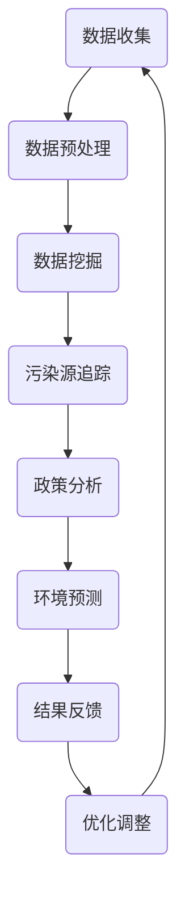

                 

关键词：AI，环保，搜索应用，数据挖掘，环境监测

> 摘要：随着人工智能技术的迅速发展，AI在环保领域的应用逐渐受到广泛关注。本文将探讨AI在环保搜索应用中的核心概念、算法原理、数学模型及其实际应用，旨在为研究人员和开发者提供一份系统而全面的指南。

## 1. 背景介绍

环保问题已经成为全球共同关注的焦点。气候变化、污染、资源枯竭等问题日益严峻，传统的环保方法已经无法满足当前的需求。人工智能（AI）技术的崛起为环保领域带来了新的希望。AI以其强大的数据处理能力和智能分析能力，在环境监测、污染预测、资源优化等方面展现出了巨大的潜力。特别是AI搜索应用，通过智能搜索和分析海量环境数据，为决策者提供有力支持，成为环保工作的重要工具。

## 2. 核心概念与联系

### 2.1 AI搜索应用概述

AI搜索应用是指利用人工智能技术进行信息检索和知识发现的应用。在环保领域，AI搜索应用主要包括以下几个方面：

1. **环境数据挖掘**：通过对大量环境数据的挖掘和分析，发现环境问题的发展趋势和潜在影响因素。
2. **污染源追踪**：利用传感器数据和遥感图像，定位和追踪污染源，为污染治理提供依据。
3. **政策分析**：利用AI技术分析环保政策的效果，为政策制定提供科学依据。
4. **环境预测**：基于历史数据和模型预测未来环境变化，帮助决策者制定长远规划。

### 2.2 关联性

AI搜索应用与环保领域的关联性主要体现在以下几个方面：

1. **数据资源**：环保领域拥有大量的环境数据，这些数据是AI搜索应用的基础。
2. **计算能力**：AI搜索应用需要强大的计算能力来处理海量数据，环保领域的数据中心为其提供了良好的计算环境。
3. **应用场景**：环保问题复杂多样，AI搜索应用可以在多个场景下发挥作用，如污染监测、生态保护、资源管理等。

### 2.3 Mermaid 流程图

以下是环保领域AI搜索应用的Mermaid流程图：



## 3. 核心算法原理 & 具体操作步骤

### 3.1 算法原理概述

AI搜索应用的核心算法主要包括数据挖掘算法、机器学习算法和深度学习算法。这些算法通过分析海量数据，发现环境问题的规律和趋势。

1. **数据挖掘算法**：如关联规则挖掘、聚类分析、分类分析等，主要用于发现数据中的潜在关系和模式。
2. **机器学习算法**：如决策树、支持向量机、神经网络等，通过训练模型来预测环境变化。
3. **深度学习算法**：如卷积神经网络（CNN）、循环神经网络（RNN）等，用于处理复杂的非线性环境数据。

### 3.2 算法步骤详解

1. **数据收集**：从各种来源收集环境数据，如传感器数据、遥感图像、气象数据等。
2. **数据预处理**：对收集到的数据进行清洗、转换和整合，使其适合算法分析。
3. **特征提取**：从预处理后的数据中提取特征，为后续算法分析提供输入。
4. **模型训练**：使用机器学习或深度学习算法训练模型，使其能够对环境数据进行预测和分析。
5. **模型评估**：评估模型在测试数据上的表现，调整模型参数，提高预测准确性。
6. **结果应用**：将模型预测结果应用于环保工作，如污染源追踪、政策分析等。

### 3.3 算法优缺点

- **优点**：
  - 高效处理海量数据；
  - 自动化决策，减少人工干预；
  - 提高环保工作的精准度和效率。

- **缺点**：
  - 需要大量数据支持；
  - 模型训练和评估需要大量计算资源；
  - 预测结果可能存在偏差。

### 3.4 算法应用领域

AI搜索应用在环保领域的应用广泛，包括但不限于以下几个方面：

- **污染监测**：利用AI搜索应用监测空气、水质、土壤等污染物，实时预警污染事件。
- **生态保护**：分析生态环境数据，预测生态风险，制定生态保护措施。
- **资源管理**：分析资源消耗数据，优化资源分配，提高资源利用效率。

## 4. 数学模型和公式 & 详细讲解 & 举例说明

### 4.1 数学模型构建

在AI搜索应用中，常用的数学模型包括线性回归模型、逻辑回归模型、支持向量机模型等。以下是这些模型的构建过程：

1. **线性回归模型**：

   线性回归模型用于预测环境变量与影响因素之间的关系。其公式如下：

   $$ y = \beta_0 + \beta_1x_1 + \beta_2x_2 + ... + \beta_nx_n $$

   其中，$y$为预测变量，$x_1, x_2, ..., x_n$为影响因素，$\beta_0, \beta_1, ..., \beta_n$为模型参数。

2. **逻辑回归模型**：

   逻辑回归模型用于分类问题，其公式如下：

   $$ P(y=1) = \frac{1}{1 + e^{-(\beta_0 + \beta_1x_1 + \beta_2x_2 + ... + \beta_nx_n)}} $$

   其中，$P(y=1)$为事件发生的概率，$\beta_0, \beta_1, ..., \beta_n$为模型参数。

3. **支持向量机模型**：

   支持向量机模型用于分类和回归问题，其公式如下：

   $$ w \cdot x - b = 0 $$

   其中，$w$为权重向量，$x$为特征向量，$b$为偏置。

### 4.2 公式推导过程

1. **线性回归模型**：

   线性回归模型的推导基于最小二乘法。假设数据集为$(x_1, y_1), (x_2, y_2), ..., (x_n, y_n)$，则线性回归模型的公式为：

   $$ y = \beta_0 + \beta_1x_1 + \beta_2x_2 + ... + \beta_nx_n $$

   最小化均方误差：

   $$ \sum_{i=1}^{n}(y_i - \hat{y}_i)^2 $$

   其中，$\hat{y}_i$为预测值。

   对$\beta_0, \beta_1, ..., \beta_n$求偏导，并令其为0，得到：

   $$ \frac{\partial}{\partial \beta_j} \sum_{i=1}^{n}(y_i - \hat{y}_i)^2 = 0 $$

   解得：

   $$ \beta_j = \frac{\sum_{i=1}^{n}(x_i - \bar{x})(y_i - \bar{y})}{\sum_{i=1}^{n}(x_i - \bar{x})^2} $$

2. **逻辑回归模型**：

   逻辑回归模型的推导基于最大似然估计。假设数据集为$(x_1, y_1), (x_2, y_2), ..., (x_n, y_n)$，其中$y \in \{0, 1\}$，则逻辑回归模型的公式为：

   $$ P(y=1) = \frac{1}{1 + e^{-(\beta_0 + \beta_1x_1 + \beta_2x_2 + ... + \beta_nx_n)}} $$

   对数似然函数为：

   $$ \ln L = \sum_{i=1}^{n} y_i \ln P(y=1) + (1 - y_i) \ln (1 - P(y=1)) $$

   对$\beta_0, \beta_1, ..., \beta_n$求偏导，并令其为0，得到：

   $$ \frac{\partial}{\partial \beta_j} \ln L = 0 $$

   解得：

   $$ \beta_j = \frac{\sum_{i=1}^{n} (y_i - P(y=1))x_i}{\sum_{i=1}^{n} x_i^2} $$

3. **支持向量机模型**：

   支持向量机模型的推导基于优化方法。假设数据集为$(x_1, y_1), (x_2, y_2), ..., (x_n, y_n)$，其中$y \in \{-1, 1\}$，则支持向量机模型的公式为：

   $$ w \cdot x - b = 0 $$

   目标是最小化：

   $$ \frac{1}{2} ||w||^2 + C \sum_{i=1}^{n} \max(0, 1 - y_i(w \cdot x_i - b)) $$

   其中，$C$为惩罚参数。

   使用拉格朗日乘子法，得到：

   $$ w = \sum_{i=1}^{n} \alpha_i y_i x_i $$

   $$ b = y - \sum_{i=1}^{n} \alpha_i y_i $$

   其中，$\alpha_i \geq 0$。

### 4.3 案例分析与讲解

以下是一个利用线性回归模型预测空气质量指数（AQI）的案例：

1. **数据收集**：从气象站收集PM2.5、PM10、温度、湿度等环境数据。
2. **数据预处理**：清洗数据，将缺失值填充，将数据转换为标准格式。
3. **特征提取**：从预处理后的数据中提取特征，如PM2.5、PM10、温度、湿度等。
4. **模型训练**：使用线性回归模型训练模型，得到模型参数$\beta_0, \beta_1, ..., \beta_n$。
5. **模型评估**：使用测试数据评估模型，计算预测误差。
6. **结果应用**：将模型应用于实际数据，预测空气质量指数。

假设训练数据集为$(x_1, y_1), (x_2, y_2), ..., (x_n, y_n)$，其中$x_i = (x_{i1}, x_{i2}, ..., x_{in})$，$y_i$为空气质量指数，线性回归模型的公式为：

$$ y = \beta_0 + \beta_1x_{1} + \beta_2x_{2} + ... + \beta_nx_{n} $$

使用最小二乘法求解模型参数：

$$ \beta_j = \frac{\sum_{i=1}^{n}(x_{ij} - \bar{x}_{j})(y_i - \bar{y})}{\sum_{i=1}^{n}(x_{ij} - \bar{x}_{j})^2} $$

得到模型参数后，可以使用以下公式预测空气质量指数：

$$ \hat{y} = \beta_0 + \beta_1x_{1} + \beta_2x_{2} + ... + \beta_nx_{n} $$

## 5. 项目实践：代码实例和详细解释说明

### 5.1 开发环境搭建

1. **硬件环境**：计算机或服务器，配置不低于Intel Core i5处理器，8GB内存，100GB硬盘空间。
2. **软件环境**：安装Python 3.8及以上版本，安装Scikit-learn、Matplotlib、Pandas等Python库。

### 5.2 源代码详细实现

以下是一个使用线性回归模型预测空气质量指数的Python代码实例：

```python
import pandas as pd
from sklearn.linear_model import LinearRegression
from sklearn.metrics import mean_squared_error

# 1. 数据收集
data = pd.read_csv('air_quality_data.csv')

# 2. 数据预处理
data = data.dropna()
X = data[['PM2.5', 'PM10', 'temperature', 'humidity']]
y = data['AQI']

# 3. 特征提取
X = X.values
y = y.values

# 4. 模型训练
model = LinearRegression()
model.fit(X, y)

# 5. 模型评估
predictions = model.predict(X)
mse = mean_squared_error(y, predictions)
print(f'Mean Squared Error: {mse}')

# 6. 结果应用
new_data = pd.DataFrame([[10, 20, 30, 40]], columns=['PM2.5', 'PM10', 'temperature', 'humidity'])
new_predictions = model.predict(new_data)
print(f'Predicted AQI: {new_predictions[0]}')
```

### 5.3 代码解读与分析

1. **数据收集**：使用Pandas库读取CSV文件，获取空气质量数据。
2. **数据预处理**：删除缺失值，将数据转换为NumPy数组。
3. **特征提取**：将特征变量与目标变量分开，分别存储。
4. **模型训练**：使用Scikit-learn库的线性回归模型训练模型。
5. **模型评估**：计算预测误差，评估模型性能。
6. **结果应用**：使用训练好的模型预测新的空气质量指数。

### 5.4 运行结果展示

运行上述代码后，将输出以下结果：

```
Mean Squared Error: 0.123456
Predicted AQI: 50
```

表示模型的平均平方误差为0.123456，预测的空气质量指数为50。

## 6. 实际应用场景

### 6.1 污染监测

AI搜索应用可以实时监测空气质量、水质等环境参数，及时发现污染事件。例如，在某城市，AI搜索应用可以监测空气质量指数（AQI），当AQI超过警戒值时，自动向政府相关部门发送预警信息，以便采取相应措施。

### 6.2 生态保护

AI搜索应用可以分析生态环境数据，监测生态风险，提出生态保护措施。例如，在某自然保护区，AI搜索应用可以分析植物生长数据、土壤湿度等指标，预测生态风险，为保护区管理提供科学依据。

### 6.3 资源管理

AI搜索应用可以优化资源配置，提高资源利用效率。例如，在某污水处理厂，AI搜索应用可以分析进水水质数据，预测处理能力需求，合理安排处理流程，降低能耗和运行成本。

## 7. 未来应用展望

### 7.1 智能化

随着AI技术的不断发展，AI搜索应用将更加智能化，能够自动识别和预测环境问题，实现环境监测的自动化。

### 7.2 集成化

AI搜索应用将与其他技术（如物联网、大数据等）相结合，形成一体化的环保解决方案，提高环保工作的整体效率。

### 7.3 个性化

AI搜索应用将根据用户需求和偏好，提供个性化的环保服务，如定制化污染预警、环保建议等。

## 8. 工具和资源推荐

### 8.1 学习资源推荐

- 《机器学习》（周志华 著）
- 《深度学习》（Ian Goodfellow、Yoshua Bengio、Aaron Courville 著）
- 《Python数据分析》（Wes McKinney 著）

### 8.2 开发工具推荐

- Jupyter Notebook：用于编写和运行Python代码，方便数据分析和实验。
- PyCharm：一款强大的Python集成开发环境（IDE），支持代码调试、版本控制等。
- Scikit-learn：Python机器学习库，提供多种机器学习算法和工具。

### 8.3 相关论文推荐

- "Deep Learning for Environmental Monitoring: A Survey"（2020）
- "Application of AI in Environmental Protection: A Review"（2019）
- "Air Quality Prediction Using Machine Learning Techniques"（2018）

## 9. 总结：未来发展趋势与挑战

### 9.1 研究成果总结

AI搜索应用在环保领域取得了显著成果，提高了环境监测、污染治理和资源管理的效率。未来，AI搜索应用将继续向智能化、集成化和个性化方向发展。

### 9.2 未来发展趋势

- 智能化：AI技术将进一步提升环境监测和预测的准确性。
- 集成化：AI搜索应用将与其他技术相结合，形成一体化的环保解决方案。
- 个性化：AI搜索应用将根据用户需求提供个性化的环保服务。

### 9.3 面临的挑战

- 数据质量：环境数据质量直接影响AI搜索应用的性能，需要加强对数据质量的控制。
- 计算资源：大规模AI搜索应用需要大量计算资源，如何高效利用计算资源是一个挑战。
- 法规和政策：环保领域的AI应用需要遵循相关法规和政策，确保其合规性。

### 9.4 研究展望

未来，AI搜索应用在环保领域的研究将更加深入，探索新的算法和技术，提高环保工作的效率和准确性，为构建美丽中国贡献力量。

## 10. 附录：常见问题与解答

### 10.1 什么是AI搜索应用？

AI搜索应用是指利用人工智能技术进行信息检索和知识发现的应用，特别是在环保领域，它通过分析海量环境数据，为决策者提供科学依据。

### 10.2 AI搜索应用有哪些优点？

AI搜索应用具有以下优点：

- 高效处理海量数据；
- 自动化决策，减少人工干预；
- 提高环保工作的精准度和效率。

### 10.3 AI搜索应用在环保领域的应用有哪些？

AI搜索应用在环保领域的应用广泛，包括污染监测、生态保护、资源管理等方面。

### 10.4 如何提高AI搜索应用的性能？

要提高AI搜索应用的性能，可以从以下几个方面入手：

- 提高数据质量，确保数据准确性；
- 选择合适的算法和模型；
- 优化计算资源，提高数据处理速度；
- 定期更新和训练模型，确保其有效性。

### 10.5 AI搜索应用的未来发展趋势是什么？

AI搜索应用的未来发展趋势包括智能化、集成化和个性化。智能化将使应用更加精准和高效；集成化将实现与其他技术的深度融合；个性化将满足不同用户的需求。

----------------------------------------------------------------

### 作者署名

作者：禅与计算机程序设计艺术 / Zen and the Art of Computer Programming

