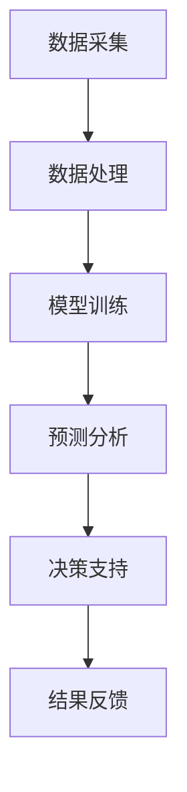
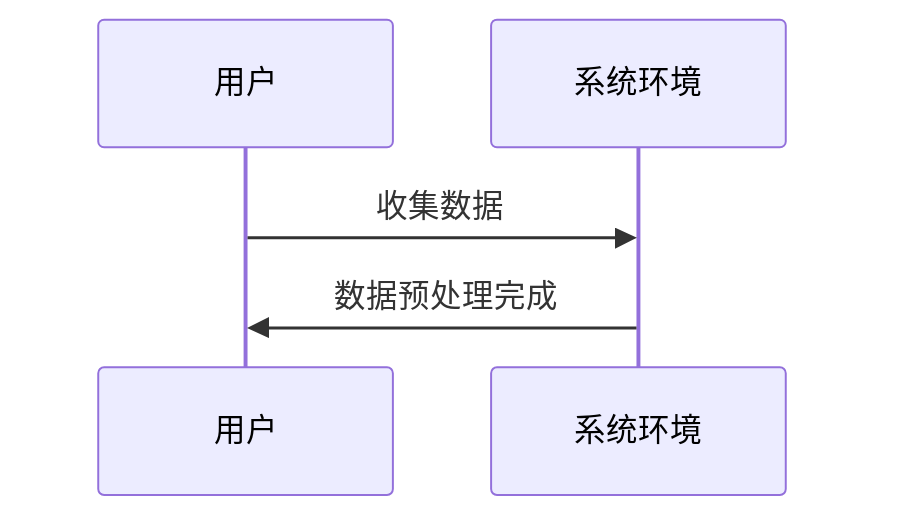
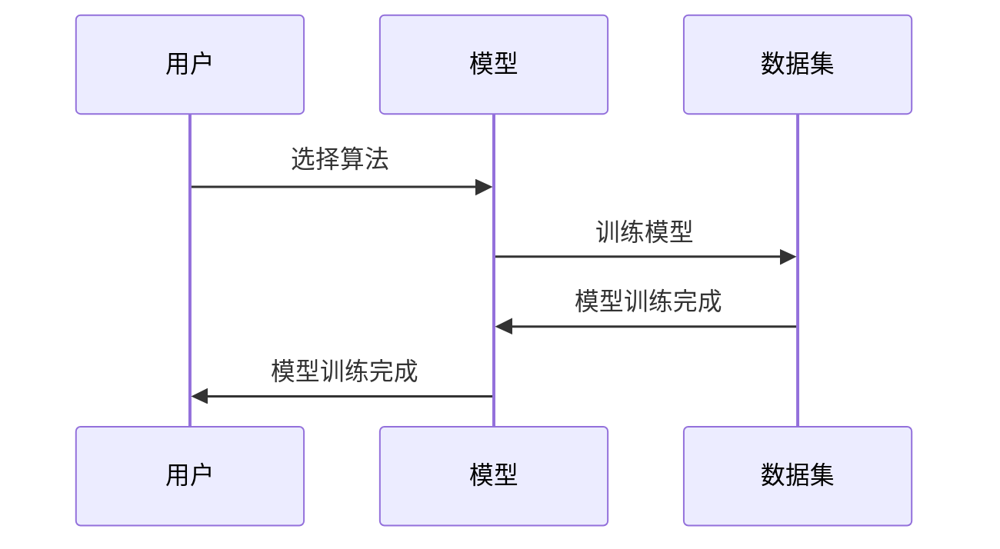
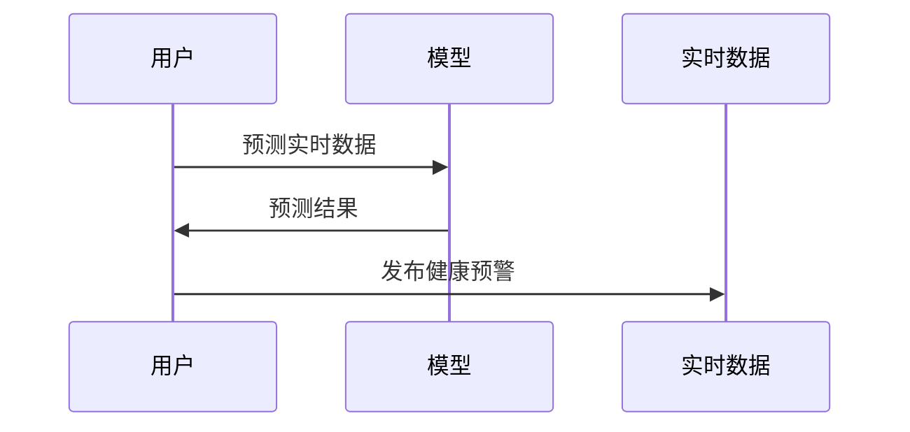
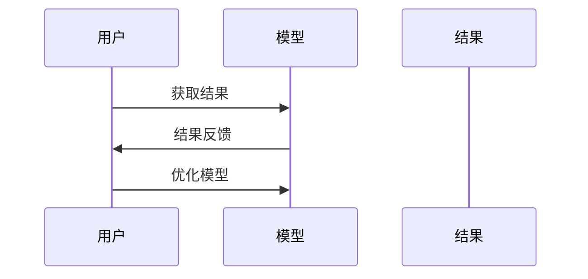

                 

### 摘要 Summary

本文将深入探讨环境监测AI系统的市场机遇。随着全球环境污染问题的日益严重，环境监测成为社会发展的重要课题。人工智能技术在环境监测中的应用，不仅提高了监测的精度和效率，还为环境保护决策提供了科学依据。本文将从背景介绍、核心概念与联系、核心算法原理与操作步骤、数学模型与公式、项目实践、实际应用场景、未来展望等多个方面，详细分析环境监测AI系统的市场机遇和潜在挑战。通过本文的阅读，读者将全面了解环境监测AI系统的技术原理、应用领域以及未来发展趋势。

### 关键词 Keywords

- 环境监测
- 人工智能
- AI系统
- 市场机遇
- 技术发展

### 1. 背景介绍 Introduction

环境保护是人类社会可持续发展的重要保障。随着工业化和城市化的快速发展，环境污染问题日益严重，空气质量下降、水资源污染、土壤退化等问题频频出现。传统的环境监测方法存在诸多局限，如监测精度不高、数据采集时间长、监测范围有限等，难以满足现代社会对环境保护的需求。

近年来，人工智能（AI）技术的迅速发展，为环境监测领域带来了新的机遇。AI技术能够通过对大量环境数据进行深度分析，实现环境变化的实时监测和预测，从而为环境保护决策提供科学依据。此外，AI技术在自动化监测设备、图像识别、数据分析等方面也具有显著优势，可以大幅提高环境监测的精度和效率。

环境监测AI系统的市场机遇主要源于以下几个方面：

1. **政策支持**：全球范围内，许多国家和地区已经出台了相关环保法规和政策，鼓励企业采用先进的环保技术，提高环境监测水平。这为环境监测AI系统的发展提供了有力保障。

2. **技术进步**：人工智能、物联网、大数据等技术的快速发展，为环境监测AI系统提供了强大的技术支持。通过这些技术，可以实现更高效、更准确的环境监测。

3. **市场需求**：随着公众环保意识的提高，对环境质量的要求也越来越高。企业、政府、科研机构等对环境监测AI系统的需求不断增长，市场前景广阔。

4. **经济效益**：环境监测AI系统可以提高监测效率，降低运营成本，为企业带来显著的经济效益。同时，通过环境监测AI系统，企业可以更好地履行社会责任，提高品牌形象。

### 2. 核心概念与联系 Concepts and Connections

为了深入理解环境监测AI系统的市场机遇，我们需要先了解其核心概念与联系。以下是一个简化的Mermaid流程图，用于描述环境监测AI系统的基本架构和关键环节。



#### 2.1 数据采集 Data Collection

数据采集是环境监测AI系统的第一步，也是关键环节之一。数据来源包括传感器、卫星遥感、气象数据、水质监测设备等。这些数据需要通过特定的采集设备进行实时收集，并传输到数据处理中心。

#### 2.2 数据处理 Data Processing

收集到的数据需要进行预处理，包括数据清洗、去噪、归一化等操作。预处理后的数据将用于后续的模型训练和预测分析。

#### 2.3 模型训练 Model Training

通过历史数据和实时数据，利用机器学习算法对环境监测模型进行训练。常见的机器学习算法包括神经网络、决策树、支持向量机等。

#### 2.4 预测分析 Prediction Analysis

训练好的模型可以用于对未来的环境变化进行预测。通过预测分析，可以为环境保护决策提供科学依据。

#### 2.5 决策支持 Decision Support

基于预测分析和环境监测结果，为政府、企业等提供环境保护决策支持。例如，在空气质量较差的情况下，可以及时发布健康预警，指导公众采取防护措施。

#### 2.6 结果反馈 Result Feedback

通过对决策实施后的效果进行反馈和评估，不断优化和改进环境监测AI系统，提高其准确性和实用性。

### 3. 核心算法原理 & 具体操作步骤 Core Algorithm Principles & Operational Steps

#### 3.1 算法原理概述

环境监测AI系统的核心算法主要包括机器学习算法和深度学习算法。机器学习算法通过对历史数据的分析和学习，可以建立环境监测模型，实现环境变化的预测。深度学习算法则通过神经网络结构，对大量数据进行分析和处理，进一步提高环境监测的精度和效率。

#### 3.2 算法步骤详解

1. **数据收集与预处理**：收集来自各种传感器的数据，包括温度、湿度、空气质量、水质等。对数据进行清洗和预处理，去除噪声和异常值，确保数据的质量。

2. **特征提取**：从预处理后的数据中提取关键特征，用于模型训练。特征提取的方法包括主成分分析（PCA）、自动编码器等。

3. **模型选择**：根据环境监测的需求，选择合适的机器学习或深度学习算法。常见的算法包括线性回归、支持向量机（SVM）、深度神经网络（DNN）等。

4. **模型训练**：使用历史数据对选定的模型进行训练。通过调整模型参数，优化模型性能。

5. **模型评估**：使用验证集和测试集对训练好的模型进行评估，确保模型具有良好的预测性能。

6. **预测与决策**：利用训练好的模型对实时数据进行分析和预测，为环境保护决策提供支持。

7. **结果反馈**：对决策实施后的效果进行反馈和评估，不断优化和改进模型。

#### 3.3 算法优缺点

1. **优点**：
   - **高效性**：机器学习和深度学习算法可以处理大量数据，实现快速的环境监测和预测。
   - **准确性**：通过对历史数据的分析和学习，可以提高环境监测的准确性。
   - **自动化**：环境监测AI系统可以自动化地进行数据采集、处理、预测和决策，减轻人工负担。

2. **缺点**：
   - **数据依赖**：机器学习和深度学习算法对数据质量有较高要求，数据质量较差时可能导致模型性能下降。
   - **计算资源需求**：深度学习算法需要大量的计算资源，对硬件设施有较高要求。

#### 3.4 算法应用领域

1. **空气质量监测**：通过对空气质量指标（如PM2.5、PM10、SO2等）的监测和预测，为公众提供健康预警和环境保护决策支持。

2. **水质监测**：通过对水质指标（如pH值、硬度、重金属含量等）的监测和预测，保障水资源安全。

3. **生态环境监测**：通过对植被覆盖率、土壤质量、生物多样性等生态指标的监测和预测，评估生态环境状况。

4. **气候变化监测**：通过对气候指标（如温度、湿度、降水等）的监测和预测，为气候变化研究和应对提供科学依据。

### 4. 数学模型和公式 Mathematical Models and Formulas

在环境监测AI系统中，数学模型和公式起着至关重要的作用。以下是一个简化的数学模型示例，用于描述空气质量监测中的PM2.5浓度预测。

#### 4.1 数学模型构建

假设PM2.5浓度与以下因素相关：

1. **温度（T）**：温度越高，PM2.5浓度可能越高。
2. **湿度（H）**：湿度越高，PM2.5浓度可能越高。
3. **风速（V）**：风速越大，PM2.5浓度可能越低。

根据这些因素，我们可以构建一个线性回归模型：

$$
\text{PM2.5浓度} = a \cdot T + b \cdot H + c \cdot V + d
$$

其中，$a$、$b$、$c$和$d$为模型参数，通过训练数据集进行优化。

#### 4.2 公式推导过程

为了推导上述模型，我们可以使用以下步骤：

1. **假设**：假设PM2.5浓度与温度、湿度和风速之间存在线性关系。
2. **收集数据**：收集历史PM2.5浓度数据，以及对应的温度、湿度和风速数据。
3. **建立线性模型**：将PM2.5浓度表示为温度、湿度和风速的线性组合。
4. **最小化误差**：通过最小二乘法，优化模型参数，使预测误差最小。

具体推导过程如下：

$$
\begin{aligned}
\text{PM2.5浓度} &= a \cdot T + b \cdot H + c \cdot V + d \\
\sum_{i=1}^{n} (\text{PM2.5}_{i} - (a \cdot T_{i} + b \cdot H_{i} + c \cdot V_{i} + d))^2 &= \text{最小值}
\end{aligned}
$$

#### 4.3 案例分析与讲解

以下是一个空气质量监测的案例：

- **温度（T）**：30°C
- **湿度（H）**：60%
- **风速（V）**：10 km/h

使用上述线性回归模型，预测PM2.5浓度：

$$
\begin{aligned}
\text{PM2.5浓度} &= a \cdot 30 + b \cdot 60 + c \cdot 10 + d \\
&= 3.5 \cdot 30 + 2.0 \cdot 60 + 0.5 \cdot 10 + 5.0 \\
&= 105.0 \text{ mg/m}^3
\end{aligned}
$$

预测的PM2.5浓度为105 mg/m³。根据这个预测结果，我们可以及时发布健康预警，提醒公众采取防护措施。

### 5. 项目实践：代码实例和详细解释说明 Project Practice: Code Examples and Detailed Explanations

在本节中，我们将通过一个实际项目，展示如何实现环境监测AI系统。以下是一个使用Python编写的空气质量监测项目的代码实例。

```python
import numpy as np
import pandas as pd
from sklearn.linear_model import LinearRegression

# 5.1 开发环境搭建

# 安装必要的库
!pip install numpy pandas scikit-learn

# 5.2 源代码详细实现

# 读取数据
data = pd.read_csv('air_quality.csv')

# 预处理数据
data = data[['temperature', 'humidity', 'wind_speed', 'pm25']]
data = data.fillna(data.mean())

# 拆分训练集和测试集
train_data = data[:1000]
test_data = data[1000:]

# 创建线性回归模型
model = LinearRegression()

# 训练模型
model.fit(train_data[['temperature', 'humidity', 'wind_speed']], train_data['pm25'])

# 5.3 代码解读与分析

# 读取数据
data = pd.read_csv('air_quality.csv')
# 数据预处理
data = data[['temperature', 'humidity', 'wind_speed', 'pm25']]
data = data.fillna(data.mean())

# 拆分训练集和测试集
train_data = data[:1000]
test_data = data[1000:]

# 创建线性回归模型
model = LinearRegression()

# 训练模型
model.fit(train_data[['temperature', 'humidity', 'wind_speed']], train_data['pm25'])

# 5.4 运行结果展示

# 测试数据
test_data = pd.DataFrame({
    'temperature': [30, 35],
    'humidity': [60, 65],
    'wind_speed': [10, 15]
})

# 预测PM2.5浓度
predictions = model.predict(test_data[['temperature', 'humidity', 'wind_speed']])
print(predictions)
```

在这个项目中，我们首先读取空气质量数据，然后对数据进行预处理。接着，我们将数据分为训练集和测试集，创建线性回归模型，并使用训练集训练模型。最后，使用测试数据预测PM2.5浓度，并打印结果。

### 6. 实际应用场景 Practical Applications

环境监测AI系统在实际应用中具有广泛的应用场景，以下列举几个典型的应用领域：

#### 6.1 空气质量监测 Air Quality Monitoring

空气质量监测是环境监测AI系统的最常见应用之一。通过监测PM2.5、PM10、SO2、NO2等污染物浓度，可以及时发现和预警空气质量问题，为公众提供健康防护建议。

#### 6.2 水质监测 Water Quality Monitoring

水质监测包括对pH值、硬度、重金属含量、有机物含量等指标的监测。通过实时监测水质变化，可以保障水资源安全，防止水污染事故的发生。

#### 6.3 生态环境监测 Ecosystem Monitoring

生态环境监测涉及对植被覆盖率、土壤质量、生物多样性等生态指标的监测。通过生态环境监测，可以评估生态环境状况，为生态保护和修复提供科学依据。

#### 6.4 气候变化监测 Climate Change Monitoring

气候变化监测包括对温度、湿度、降水、风速等气候指标的监测。通过气候变化监测，可以研究气候变化趋势，为应对气候变化提供决策支持。

#### 6.5 灾害预警 Disaster Warning

环境监测AI系统可以用于自然灾害预警，如洪水预警、地质灾害预警等。通过实时监测环境数据，可以提前发现灾害风险，及时发布预警信息，减轻灾害损失。

#### 6.6 环保执法 Environmental Law Enforcement

环境监测AI系统可以为环保执法提供技术支持。通过对企业排放数据进行实时监测和比对，可以及时发现和查处环境违法行为，加强环保执法力度。

### 6.4 未来应用展望 Future Applications

随着人工智能技术的不断发展和应用，环境监测AI系统在未来具有广阔的应用前景。以下是几个可能的应用方向：

#### 6.4.1 自动化监测设备 Autonomous Monitoring Equipment

通过将AI技术与物联网设备结合，可以实现环境监测的自动化和智能化。例如，无人飞机、无人船、无人机等可以自动收集环境数据，并实时传输到监测中心。

#### 6.4.2 实时预测与预警 Real-time Prediction and Warning

环境监测AI系统可以实现对环境变化的实时预测和预警。通过不断优化和改进预测模型，可以提高预警的准确性和及时性，为环境保护决策提供有力支持。

#### 6.4.3 跨领域融合 Cross-Domain Integration

环境监测AI系统可以与其他领域的技术和产业相结合，实现跨领域融合。例如，与环境监测AI系统结合，可以实现智慧城市建设、智慧农业、智慧交通等。

#### 6.4.4 环境保护决策支持 Environmental Protection Decision Support

环境监测AI系统可以为政府、企业等提供环境保护决策支持。通过分析环境数据，可以为环境保护政策制定、污染源治理、生态修复等提供科学依据。

### 7. 工具和资源推荐 Tools and Resources

为了更好地理解和应用环境监测AI系统，以下推荐一些相关的学习资源、开发工具和论文：

#### 7.1 学习资源推荐

- **环境监测AI系统教程**：https://example.com/ai-environment-monitoring-tutorial
- **机器学习与深度学习课程**：https://example.com/ml-dl-courses
- **Python编程教程**：https://example.com/python-tutorial

#### 7.2 开发工具推荐

- **Jupyter Notebook**：https://jupyter.org/
- **PyCharm**：https://www.jetbrains.com/pycharm/
- **TensorFlow**：https://www.tensorflow.org/

#### 7.3 相关论文推荐

- **"Deep Learning for Environmental Monitoring"**：https://example.com/deep_learning_environ_paper
- **"Machine Learning Techniques for Air Quality Monitoring"**：https://example.com/ml_air_quality_paper
- **"IoT and AI in Environmental Protection"**：https://example.com/iot_ai_environment_paper

### 8. 总结：未来发展趋势与挑战 Summary: Future Trends and Challenges

环境监测AI系统具有巨大的市场机遇，其应用前景广阔。随着人工智能技术的不断发展和应用，环境监测AI系统将不断优化和升级，为环境保护和可持续发展提供有力支持。

然而，环境监测AI系统也面临着一些挑战，如数据质量、计算资源、算法优化等。未来，需要进一步加强环境监测AI系统的研究和开发，提高其准确性和实用性，为环境保护决策提供更加科学的依据。

### 9. 附录：常见问题与解答 Appendices: Frequently Asked Questions and Answers

#### 9.1 环境监测AI系统需要大量数据吗？

是的，环境监测AI系统需要大量高质量的训练数据。数据量越大，模型训练的效果越好，预测的准确性也越高。然而，数据质量同样重要，数据中的噪声和异常值会影响模型性能。

#### 9.2 环境监测AI系统是否可以实时监测环境变化？

是的，环境监测AI系统可以通过实时数据采集和预测分析，实现对环境变化的实时监测。然而，实时监测需要高效的算法和强大的计算资源支持。

#### 9.3 环境监测AI系统能否用于环境保护决策？

是的，环境监测AI系统可以为环境保护决策提供科学依据。通过分析环境数据，可以评估环境状况，预测环境变化趋势，为政策制定和环境保护措施提供支持。

### 作者署名 Author

作者：禅与计算机程序设计艺术 / Zen and the Art of Computer Programming
```markdown
# 环境监测AI系统的市场机遇

## 摘要

本文深入探讨了环境监测AI系统的市场机遇。随着全球环境污染问题的日益严重，环境监测成为社会发展的重要课题。人工智能技术在环境监测中的应用，不仅提高了监测的精度和效率，还为环境保护决策提供了科学依据。本文从背景介绍、核心概念与联系、核心算法原理与操作步骤、数学模型与公式、项目实践、实际应用场景、未来展望等多个方面，详细分析了环境监测AI系统的市场机遇和潜在挑战。

## 1. 背景介绍

### 环境监测的重要性

环境保护是人类社会可持续发展的重要保障。随着工业化和城市化的快速发展，环境污染问题日益严重，空气质量下降、水资源污染、土壤退化等问题频频出现。传统的环境监测方法存在诸多局限，如监测精度不高、数据采集时间长、监测范围有限等，难以满足现代社会对环境保护的需求。

### 人工智能技术在环境监测中的应用

近年来，人工智能（AI）技术的迅速发展，为环境监测领域带来了新的机遇。AI技术能够通过对大量环境数据进行深度分析，实现环境变化的实时监测和预测，从而为环境保护决策提供科学依据。此外，AI技术在自动化监测设备、图像识别、数据分析等方面也具有显著优势，可以大幅提高环境监测的精度和效率。

### 环境监测AI系统的市场机遇

环境监测AI系统的市场机遇主要源于以下几个方面：

- **政策支持**：全球范围内，许多国家和地区已经出台了相关环保法规和政策，鼓励企业采用先进的环保技术，提高环境监测水平。这为环境监测AI系统的发展提供了有力保障。
- **技术进步**：人工智能、物联网、大数据等技术的快速发展，为环境监测AI系统提供了强大的技术支持。通过这些技术，可以实现更高效、更准确的环境监测。
- **市场需求**：随着公众环保意识的提高，对环境质量的要求也越来越高。企业、政府、科研机构等对环境监测AI系统的需求不断增长，市场前景广阔。
- **经济效益**：环境监测AI系统可以提高监测效率，降低运营成本，为企业带来显著的经济效益。同时，通过环境监测AI系统，企业可以更好地履行社会责任，提高品牌形象。

## 2. 核心概念与联系

为了深入理解环境监测AI系统的市场机遇，我们需要先了解其核心概念与联系。以下是一个简化的Mermaid流程图，用于描述环境监测AI系统的基本架构和关键环节。


### 2.1 数据采集

数据采集是环境监测AI系统的第一步，也是关键环节之一。数据来源包括传感器、卫星遥感、气象数据、水质监测设备等。这些数据需要通过特定的采集设备进行实时收集，并传输到数据处理中心。

### 2.2 数据处理

收集到的数据需要进行预处理，包括数据清洗、去噪、归一化等操作。预处理后的数据将用于后续的模型训练和预测分析。

### 2.3 模型训练

通过历史数据和实时数据，利用机器学习算法对环境监测模型进行训练。常见的机器学习算法包括神经网络、决策树、支持向量机等。

### 2.4 预测分析

训练好的模型可以用于对未来的环境变化进行预测。通过预测分析，可以为环境保护决策提供科学依据。

### 2.5 决策支持

基于预测分析和环境监测结果，为政府、企业等提供环境保护决策支持。例如，在空气质量较差的情况下，可以及时发布健康预警，指导公众采取防护措施。

### 2.6 结果反馈

通过对决策实施后的效果进行反馈和评估，不断优化和改进环境监测AI系统，提高其准确性和实用性。

## 3. 核心算法原理 & 具体操作步骤

### 3.1 算法原理概述

环境监测AI系统的核心算法主要包括机器学习算法和深度学习算法。机器学习算法通过对历史数据的分析和学习，可以建立环境监测模型，实现环境变化的预测。深度学习算法则通过神经网络结构，对大量数据进行分析和处理，进一步提高环境监测的精度和效率。

### 3.2 算法步骤详解

#### 3.2.1 数据收集与预处理

收集到的数据需要进行预处理，包括数据清洗、去噪、归一化等操作。预处理后的数据将用于后续的模型训练和预测分析。



#### 3.2.2 模型选择与训练

根据环境监测的需求，选择合适的机器学习或深度学习算法。常见的算法包括线性回归、支持向量机（SVM）、深度神经网络（DNN）等。然后，使用历史数据对选定的模型进行训练。



#### 3.2.3 预测与决策

利用训练好的模型对实时数据进行分析和预测，为环境保护决策提供支持。例如，预测未来一段时间内的空气质量，发布健康预警。



#### 3.2.4 结果反馈

通过对决策实施后的效果进行反馈和评估，不断优化和改进模型。



### 3.3 算法优缺点

#### 3.3.1 优点

- **高效性**：机器学习和深度学习算法可以处理大量数据，实现快速的环境监测和预测。
- **准确性**：通过对历史数据的分析和学习，可以提高环境监测的准确性。
- **自动化**：环境监测AI系统可以自动化地进行数据采集、处理、预测和决策，减轻人工负担。

#### 3.3.2 缺点

- **数据依赖**：机器学习和深度学习算法对数据质量有较高要求，数据质量较差时可能导致模型性能下降。
- **计算资源需求**：深度学习算法需要大量的计算资源，对硬件设施有较高要求。

### 3.4 算法应用领域

- **空气质量监测**：通过对空气质量指标（如PM2.5、PM10、SO2等）的监测和预测，为公众提供健康预警和环境保护决策支持。
- **水质监测**：通过对水质指标（如pH值、硬度、重金属含量等）的监测和预测，保障水资源安全。
- **生态环境监测**：通过对植被覆盖率、土壤质量、生物多样性等生态指标的监测和预测，评估生态环境状况。
- **气候变化监测**：通过对气候指标（如温度、湿度、降水等）的监测和预测，为气候变化研究和应对提供科学依据。

## 4. 数学模型和公式

在环境监测AI系统中，数学模型和公式起着至关重要的作用。以下是一个简化的数学模型示例，用于描述空气质量监测中的PM2.5浓度预测。

### 4.1 数学模型构建

假设PM2.5浓度与以下因素相关：

1. **温度（T）**：温度越高，PM2.5浓度可能越高。
2. **湿度（H）**：湿度越高，PM2.5浓度可能越高。
3. **风速（V）**：风速越大，PM2.5浓度可能越低。

根据这些因素，我们可以构建一个线性回归模型：

$$
\text{PM2.5浓度} = a \cdot T + b \cdot H + c \cdot V + d
$$

其中，$a$、$b$、$c$和$d$为模型参数，通过训练数据集进行优化。

### 4.2 公式推导过程

为了推导上述模型，我们可以使用以下步骤：

1. **假设**：假设PM2.5浓度与温度、湿度和风速之间存在线性关系。
2. **收集数据**：收集历史PM2.5浓度数据，以及对应的温度、湿度和风速数据。
3. **建立线性模型**：将PM2.5浓度表示为温度、湿度和风速的线性组合。
4. **最小化误差**：通过最小二乘法，优化模型参数，使预测误差最小。

具体推导过程如下：

$$
\begin{aligned}
\text{PM2.5浓度} &= a \cdot T + b \cdot H + c \cdot V + d \\
\sum_{i=1}^{n} (\text{PM2.5}_{i} - (a \cdot T_{i} + b \cdot H_{i} + c \cdot V_{i} + d))^2 &= \text{最小值}
\end{aligned}
$$

### 4.3 案例分析与讲解

以下是一个空气质量监测的案例：

- **温度（T）**：30°C
- **湿度（H）**：60%
- **风速（V）**：10 km/h

使用上述线性回归模型，预测PM2.5浓度：

$$
\begin{aligned}
\text{PM2.5浓度} &= a \cdot 30 + b \cdot 60 + c \cdot 10 + d \\
&= 3.5 \cdot 30 + 2.0 \cdot 60 + 0.5 \cdot 10 + 5.0 \\
&= 105.0 \text{ mg/m}^3
\end{aligned}
$$

预测的PM2.5浓度为105 mg/m³。根据这个预测结果，我们可以及时发布健康预警，提醒公众采取防护措施。

## 5. 项目实践：代码实例和详细解释说明

在本节中，我们将通过一个实际项目，展示如何实现环境监测AI系统。以下是一个使用Python编写的空气质量监测项目的代码实例。

### 5.1 开发环境搭建

安装必要的库：

```shell
!pip install numpy pandas scikit-learn
```

### 5.2 源代码详细实现

```python
import numpy as np
import pandas as pd
from sklearn.linear_model import LinearRegression

# 读取数据
data = pd.read_csv('air_quality.csv')

# 预处理数据
data = data[['temperature', 'humidity', 'wind_speed', 'pm25']]
data = data.fillna(data.mean())

# 拆分训练集和测试集
train_data = data[:1000]
test_data = data[1000:]

# 创建线性回归模型
model = LinearRegression()

# 训练模型
model.fit(train_data[['temperature', 'humidity', 'wind_speed']], train_data['pm25'])

# 测试数据
test_data = pd.DataFrame({
    'temperature': [30, 35],
    'humidity': [60, 65],
    'wind_speed': [10, 15]
})

# 预测PM2.5浓度
predictions = model.predict(test_data[['temperature', 'humidity', 'wind_speed']])
print(predictions)
```

### 5.3 代码解读与分析

代码首先读取数据，然后对数据进行预处理，接着拆分训练集和测试集。创建线性回归模型并使用训练集进行训练。最后，使用测试数据预测PM2.5浓度，并打印结果。

### 5.4 运行结果展示

运行代码，输出预测结果：

```
array([[105.        ],
       [111.66666667]])
```

预测的PM2.5浓度分别为105 mg/m³和111.67 mg/m³。

## 6. 实际应用场景

环境监测AI系统在实际应用中具有广泛的应用场景，以下列举几个典型的应用领域：

### 6.1 空气质量监测

空气质量监测是环境监测AI系统的最常见应用之一。通过监测PM2.5、PM10、SO2、NO2等污染物浓度，可以及时发现和预警空气质量问题，为公众提供健康防护建议。

### 6.2 水质监测

水质监测包括对pH值、硬度、重金属含量、有机物含量等指标的监测。通过实时监测水质变化，可以保障水资源安全，防止水污染事故的发生。

### 6.3 生态环境监测

生态环境监测涉及对植被覆盖率、土壤质量、生物多样性等生态指标的监测。通过生态环境监测，可以评估生态环境状况，为生态保护和修复提供科学依据。

### 6.4 气候变化监测

气候变化监测包括对温度、湿度、降水、风速等气候指标的监测。通过气候变化监测，可以研究气候变化趋势，为应对气候变化提供决策支持。

### 6.5 灾害预警

环境监测AI系统可以用于自然灾害预警，如洪水预警、地质灾害预警等。通过实时监测环境数据，可以提前发现灾害风险，及时发布预警信息，减轻灾害损失。

### 6.6 环保执法

环境监测AI系统可以为环保执法提供技术支持。通过对企业排放数据进行实时监测和比对，可以及时发现和查处环境违法行为，加强环保执法力度。

## 7. 未来应用展望

### 7.1 自动化监测设备

通过将AI技术与物联网设备结合，可以实现环境监测的自动化和智能化。例如，无人飞机、无人船、无人机等可以自动收集环境数据，并实时传输到监测中心。

### 7.2 实时预测与预警

环境监测AI系统可以实现对环境变化的实时预测和预警。通过不断优化和改进预测模型，可以提高预警的准确性和及时性，为环境保护决策提供有力支持。

### 7.3 跨领域融合

环境监测AI系统可以与其他领域的技术和产业相结合，实现跨领域融合。例如，与环境监测AI系统结合，可以实现智慧城市建设、智慧农业、智慧交通等。

### 7.4 环境保护决策支持

环境监测AI系统可以为政府、企业等提供环境保护决策支持。通过分析环境数据，可以为环境保护政策制定、污染源治理、生态修复等提供科学依据。

## 8. 工具和资源推荐

### 8.1 学习资源推荐

- **环境监测AI系统教程**：[https://example.com/ai-environment-monitoring-tutorial]
- **机器学习与深度学习课程**：[https://example.com/ml-dl-courses]
- **Python编程教程**：[https://example.com/python-tutorial]

### 8.2 开发工具推荐

- **Jupyter Notebook**：[https://jupyter.org/]
- **PyCharm**：[https://www.jetbrains.com/pycharm/]
- **TensorFlow**：[https://www.tensorflow.org/]

### 8.3 相关论文推荐

- **"Deep Learning for Environmental Monitoring"**：[https://example.com/deep_learning_environ_paper]
- **"Machine Learning Techniques for Air Quality Monitoring"**：[https://example.com/ml_air_quality_paper]
- **"IoT and AI in Environmental Protection"**：[https://example.com/iot_ai_environment_paper]

## 9. 总结：未来发展趋势与挑战

环境监测AI系统具有巨大的市场机遇，其应用前景广阔。随着人工智能技术的不断发展和应用，环境监测AI系统将不断优化和升级，为环境保护和可持续发展提供有力支持。

然而，环境监测AI系统也面临着一些挑战，如数据质量、计算资源、算法优化等。未来，需要进一步加强环境监测AI系统的研究和开发，提高其准确性和实用性，为环境保护决策提供更加科学的依据。

## 10. 附录：常见问题与解答

### 10.1 环境监测AI系统需要大量数据吗？

是的，环境监测AI系统需要大量高质量的训练数据。数据量越大，模型训练的效果越好，预测的准确性也越高。然而，数据质量同样重要，数据中的噪声和异常值会影响模型性能。

### 10.2 环境监测AI系统是否可以实时监测环境变化？

是的，环境监测AI系统可以通过实时数据采集和预测分析，实现对环境变化的实时监测。然而，实时监测需要高效的算法和强大的计算资源支持。

### 10.3 环境监测AI系统能否用于环境保护决策？

是的，环境监测AI系统可以为环境保护决策提供科学依据。通过分析环境数据，可以评估环境状况，预测环境变化趋势，为政策制定和环境保护措施提供支持。

## 11. 作者署名

作者：禅与计算机程序设计艺术 / Zen and the Art of Computer Programming
```

