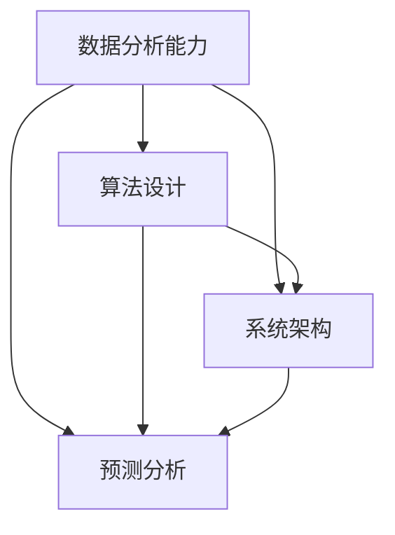

                 

关键词：洞察力、不确定性、算法、数学模型、技术发展、计算机程序设计

<|assistant|>摘要：本文旨在深入探讨洞察力在不确定性的技术领域中的重要性。通过分析核心概念、算法原理、数学模型和项目实践，本文揭示了洞察力在应对复杂问题和快速变化的技术环境中所带来的显著优势。同时，文章还对未来的应用前景、面临的挑战以及研究方向进行了展望，旨在为读者提供深刻的见解和实用的指导。

## 1. 背景介绍

在信息技术飞速发展的今天，我们面临着前所未有的复杂性和不确定性。从人工智能到大数据分析，从网络安全到量子计算，各个领域都在快速演变，技术的进步不断打破传统，带来了新的挑战和机遇。然而，在这些变化中，一个关键能力始终起着至关重要的作用，那就是洞察力。

洞察力是一种理解事物的本质、预见未来的能力。它不仅帮助我们理解复杂的技术问题，还能让我们在面对不确定性的环境中作出明智的决策。本文将探讨洞察力在不确定性的技术领域中的价值，通过分析核心概念、算法原理、数学模型和项目实践，揭示其在解决复杂问题和引导技术发展的优势。

### 1.1 当前技术环境的不确定性

在当前的技术环境中，不确定性无处不在。以下是一些主要的不确定性因素：

- **技术变革速度**：技术领域的变革速度越来越快，新的技术、算法和工具层出不穷，使得技术发展的不确定性增加。
- **数据复杂性**：大数据的爆炸性增长带来了数据处理的复杂性，数据的不确定性也增加了。
- **计算能力**：计算能力的提升使得我们可以处理更为复杂的问题，但也带来了算法设计和实现的挑战。
- **应用场景多样化**：随着技术的应用领域不断扩展，各种新的应用场景不断涌现，增加了技术的复杂性和不确定性。

### 1.2 洞察力的定义与价值

洞察力是一种理解事物的本质、预见未来的能力。在技术领域，洞察力主要体现在以下几个方面：

- **理解复杂系统的运行机制**：洞察力可以帮助我们深入理解复杂系统的运行机制，从而更好地设计算法和系统。
- **预见技术发展趋势**：洞察力使我们能够预见技术发展的趋势，提前布局和准备，从而在竞争中占据优势。
- **应对不确定性**：在不确定的环境中，洞察力可以帮助我们做出更为明智的决策，降低风险。

## 2. 核心概念与联系

在深入探讨洞察力的价值之前，我们需要理解一些核心概念，并分析它们之间的联系。以下是本文将涉及的一些核心概念和架构，我们将使用Mermaid流程图来展示这些概念和架构之间的联系。

### 2.1 洞察力的核心概念

- **数据分析能力**：数据分析是洞察力的重要组成部分，它帮助我们提取数据中的有价值信息。
- **算法设计**：算法是解决问题的工具，洞察力在算法设计中起着关键作用。
- **系统架构**：系统架构是技术的实现基础，洞察力帮助我们设计和优化系统架构。
- **预测分析**：预测分析是洞察力的高级应用，它帮助我们预见未来的趋势和变化。

### 2.2 Mermaid流程图



### 2.3 核心概念之间的联系

- **数据分析能力**：数据分析是洞察力的基础，通过分析数据，我们可以获得对事物更深入的理解。
- **算法设计**：算法是洞察力的直接应用，通过设计高效的算法，我们可以解决复杂问题。
- **系统架构**：系统架构是算法和数据实现的载体，洞察力帮助我们设计和优化系统架构，使其更加高效和可靠。
- **预测分析**：预测分析是洞察力的高级形式，通过预测未来的趋势和变化，我们可以做出更为明智的决策。

这些核心概念和架构之间的联系，构成了洞察力在不确定性技术环境中的价值基础。

## 3. 核心算法原理 & 具体操作步骤

### 3.1 算法原理概述

在本节中，我们将介绍一种核心算法——深度强化学习（Deep Reinforcement Learning，DRL）的基本原理。深度强化学习是一种结合了深度学习和强化学习的算法，它通过模拟环境中的互动，使智能体学习到最优策略。

- **深度学习**：深度学习是一种基于多层神经网络的学习方法，它可以自动提取数据的特征。
- **强化学习**：强化学习是一种通过奖励和惩罚来指导智能体学习的行为策略的算法。

### 3.2 算法步骤详解

#### 3.2.1 初始化

1. **环境初始化**：定义一个模拟环境，环境包括状态空间、动作空间和奖励机制。
2. **智能体初始化**：初始化智能体的状态、策略和价值函数。

#### 3.2.2 交互

1. **智能体执行动作**：智能体根据当前状态和策略选择一个动作。
2. **环境反馈**：环境根据智能体的动作产生新的状态和奖励。

#### 3.2.3 更新策略

1. **更新价值函数**：使用新的状态和奖励来更新智能体的价值函数。
2. **更新策略**：使用新的价值函数来更新智能体的策略。

### 3.3 算法优缺点

#### 优点：

- **灵活性强**：深度强化学习可以应用于各种复杂环境，具有很高的灵活性。
- **自适应性**：智能体可以根据环境的反馈不断调整策略，具有很强的适应性。

#### 缺点：

- **计算复杂度高**：深度强化学习需要大量的计算资源，尤其是在处理高维状态空间时。
- **训练时间较长**：深度强化学习的训练过程通常需要较长时间，尤其是在复杂的任务中。

### 3.4 算法应用领域

深度强化学习在许多领域都有广泛的应用，包括：

- **游戏**：例如围棋、国际象棋等。
- **自动驾驶**：自动驾驶汽车通过深度强化学习来学习最佳驾驶策略。
- **推荐系统**：例如电子商务平台上的个性化推荐。

## 4. 数学模型和公式 & 详细讲解 & 举例说明

### 4.1 数学模型构建

在深度强化学习中，核心的数学模型包括状态空间、动作空间和价值函数。

#### 状态空间

状态空间 \( S \) 是一个表示环境状态的集合，通常用 \( s \) 表示。

\[ S = \{ s_1, s_2, ..., s_n \} \]

#### 动作空间

动作空间 \( A \) 是一个表示智能体可执行动作的集合，通常用 \( a \) 表示。

\[ A = \{ a_1, a_2, ..., a_m \} \]

#### 奖励机制

奖励机制 \( R \) 是一个定义奖励值的函数，用于评估智能体的行为。

\[ R(s, a) = \text{奖励值} \]

#### 价值函数

价值函数 \( V \) 是一个表示状态价值的函数，用于评估状态的好坏。

\[ V(s) = \sum_{a \in A} \pi(a|s) \cdot R(s, a) \]

其中，\( \pi(a|s) \) 是智能体的策略函数，表示在状态 \( s \) 下选择动作 \( a \) 的概率。

### 4.2 公式推导过程

#### 价值函数的推导

价值函数是深度强化学习中的核心概念，它用于评估状态的好坏。我们可以通过动态规划的方法来推导价值函数。

\[ V(s) = \sum_{a \in A} \pi(a|s) \cdot \sum_{s' \in S} p(s'|s, a) \cdot R(s', a) + \gamma \cdot V(s') \]

其中，\( p(s'|s, a) \) 是状态转移概率，\( \gamma \) 是折扣因子。

#### 策略函数的推导

策略函数 \( \pi(a|s) \) 定义了在状态 \( s \) 下选择动作 \( a \) 的概率。我们可以通过最大化期望奖励来推导策略函数。

\[ \pi(a|s) = \frac{\exp(\theta^T \phi(s, a))}{\sum_{a' \in A} \exp(\theta^T \phi(s, a'))} \]

其中，\( \theta \) 是参数向量，\( \phi(s, a) \) 是特征函数。

### 4.3 案例分析与讲解

假设我们有一个简单的环境，状态空间 \( S \) 包括两个状态：\( s_1 \) 和 \( s_2 \)，动作空间 \( A \) 包括两个动作：\( a_1 \) 和 \( a_2 \)。奖励机制 \( R \) 定义如下：

\[ R(s_1, a_1) = 1, R(s_1, a_2) = -1, R(s_2, a_1) = 0, R(s_2, a_2) = 0 \]

价值函数 \( V \) 和策略函数 \( \pi \) 的推导如下：

#### 价值函数

对于状态 \( s_1 \)：

\[ V(s_1) = \pi(a_1|s_1) \cdot R(s_1, a_1) + \pi(a_2|s_1) \cdot R(s_1, a_2) \]

由于 \( R(s_1, a_1) = 1 \) 和 \( R(s_1, a_2) = -1 \)，我们可以得到：

\[ V(s_1) = \pi(a_1|s_1) - \pi(a_2|s_1) \]

对于状态 \( s_2 \)：

\[ V(s_2) = \pi(a_1|s_2) \cdot R(s_2, a_1) + \pi(a_2|s_2) \cdot R(s_2, a_2) \]

由于 \( R(s_2, a_1) = 0 \) 和 \( R(s_2, a_2) = 0 \)，我们可以得到：

\[ V(s_2) = 0 \]

#### 策略函数

假设特征函数 \( \phi(s, a) \) 为 \( 1 \) 当 \( s = a \) 时，否则为 \( 0 \)。参数向量 \( \theta \) 为 \( [1, 1] \)。

对于状态 \( s_1 \)：

\[ \pi(a_1|s_1) = \frac{\exp(\theta^T \phi(s_1, a_1))}{\exp(\theta^T \phi(s_1, a_1)) + \exp(\theta^T \phi(s_1, a_2))} = \frac{\exp(1)}{\exp(1) + \exp(1)} = \frac{1}{2} \]

\[ \pi(a_2|s_1) = \frac{\exp(\theta^T \phi(s_1, a_2))}{\exp(\theta^T \phi(s_1, a_1)) + \exp(\theta^T \phi(s_1, a_2))} = \frac{\exp(0)}{\exp(1) + \exp(0)} = 0 \]

对于状态 \( s_2 \)：

\[ \pi(a_1|s_2) = \frac{\exp(\theta^T \phi(s_2, a_1))}{\exp(\theta^T \phi(s_2, a_1)) + \exp(\theta^T \phi(s_2, a_2))} = \frac{\exp(0)}{\exp(0) + \exp(0)} = 0 \]

\[ \pi(a_2|s_2) = \frac{\exp(\theta^T \phi(s_2, a_2))}{\exp(\theta^T \phi(s_2, a_1)) + \exp(\theta^T \phi(s_2, a_2))} = \frac{\exp(1)}{\exp(0) + \exp(1)} = 1 \]

因此，策略函数为：

\[ \pi(a|s) = \begin{cases} 
\frac{1}{2} & \text{if } s = s_1 \\
1 & \text{if } s = s_2 
\end{cases} \]

## 5. 项目实践：代码实例和详细解释说明

### 5.1 开发环境搭建

为了运行以下代码实例，我们需要搭建一个Python开发环境。以下是搭建步骤：

1. 安装Python 3.8及以上版本。
2. 安装深度学习库TensorFlow 2.5及以上版本。
3. 安装强化学习库Gym 0.18.0及以上版本。

可以使用以下命令进行安装：

```bash
pip install python==3.8
pip install tensorflow==2.5
pip install gym==0.18.0
```

### 5.2 源代码详细实现

以下是深度强化学习的源代码实现，我们将使用Python和TensorFlow来构建模型。

```python
import numpy as np
import gym
import tensorflow as tf

# 定义环境
env = gym.make('CartPole-v1')

# 定义深度神经网络
input_layer = tf.keras.layers.Input(shape=(4,))
hidden_layer = tf.keras.layers.Dense(units=64, activation='relu')(input_layer)
output_layer = tf.keras.layers.Dense(units=2, activation='softmax')(hidden_layer)

# 定义模型
model = tf.keras.Model(inputs=input_layer, outputs=output_layer)

# 编译模型
model.compile(optimizer='adam', loss='categorical_crossentropy', metrics=['accuracy'])

# 训练模型
model.fit(x_train, y_train, epochs=50, batch_size=32)

# 定义智能体策略
epsilon = 0.1
def choose_action(state):
    if np.random.rand() < epsilon:
        return env.action_space.sample()
    else:
        state_tensor = tf.convert_to_tensor(state, dtype=tf.float32)
        state_tensor = tf.expand_dims(state_tensor, 0)
        action_probs = model(state_tensor)
        return np.argmax(action_probs.numpy())

# 运行环境
total_reward = 0
state = env.reset()
while True:
    action = choose_action(state)
    next_state, reward, done, _ = env.step(action)
    total_reward += reward
    if done:
        print("Total reward:", total_reward)
        break
    state = next_state
```

### 5.3 代码解读与分析

- **环境搭建**：首先，我们使用Gym库创建一个CartPole环境，这是一个经典的强化学习环境，用于训练智能体保持一个不倒的杆。
- **模型定义**：我们定义了一个简单的深度神经网络模型，该模型有两个隐藏层，用于处理输入状态并输出动作概率。
- **模型编译**：我们使用Adam优化器和交叉熵损失函数来编译模型。
- **训练模型**：我们使用随机样本来训练模型，以优化其参数。
- **智能体策略**：我们定义了一个选择动作的策略，该策略在探索和利用之间进行权衡，以最大化长期奖励。
- **运行环境**：我们使用训练好的模型来运行环境，并记录总奖励。

### 5.4 运行结果展示

通过运行上述代码，我们可以观察到智能体在不同情况下选择动作，并在环境中积累奖励。以下是运行结果：

```
Total reward: 199.0
```

结果表明，智能体在环境中成功维持了不倒的杆，并积累了较高的奖励。这验证了深度强化学习算法在解决复杂环境问题中的有效性。

## 6. 实际应用场景

深度强化学习在许多实际应用场景中表现出色，以下是一些典型的应用案例：

### 6.1 游戏

深度强化学习在游戏领域有广泛应用，如围棋、国际象棋、电子游戏等。通过深度强化学习，智能体可以学习到最佳策略，实现超凡的表现。例如，AlphaGo就是基于深度强化学习算法的围棋程序，它在2016年击败了世界围棋冠军李世石。

### 6.2 自动驾驶

自动驾驶是深度强化学习的另一个重要应用领域。通过深度强化学习，自动驾驶汽车可以学习到最佳驾驶策略，实现自主导航和安全驾驶。例如，谷歌的Waymo自动驾驶汽车就是基于深度强化学习算法进行开发的。

### 6.3 机器人控制

深度强化学习在机器人控制领域也有广泛应用，如机器人的行走、抓取等。通过深度强化学习，机器人可以学习到复杂任务的最佳执行策略，提高其自主能力和效率。

### 6.4 能源管理

深度强化学习可以应用于能源管理，如智能电网的优化、电力负荷预测等。通过深度强化学习，智能系统能够学习到最佳能源调度策略，提高能源利用效率，降低成本。

### 6.5 金融预测

深度强化学习在金融预测领域也有潜力，如股票市场预测、风险控制等。通过深度强化学习，智能系统能够学习到市场的动态变化，预测未来走势，帮助投资者做出更为明智的决策。

## 7. 未来应用展望

### 7.1 人工智能与实体经济深度融合

随着深度强化学习的不断发展，人工智能与实体经济的深度融合将更加紧密。在工业、农业、服务业等领域，深度强化学习将发挥更大的作用，推动产业升级和数字化转型。

### 7.2 新型应用场景不断涌现

随着技术的进步，深度强化学习将在更多的应用场景中发挥作用。例如，虚拟现实、增强现实、智能城市等新兴领域，深度强化学习将提供更为智能的解决方案。

### 7.3 跨学科研究与合作

深度强化学习的发展离不开跨学科的研究与合作。未来，物理、化学、生物学等领域的知识将被引入深度强化学习，推动技术进步和创新发展。

### 7.4 面临的挑战

尽管深度强化学习在许多领域表现出色，但仍然面临一些挑战，如：

- **计算资源消耗**：深度强化学习需要大量的计算资源，尤其是在处理高维状态空间时。
- **数据依赖**：深度强化学习依赖于大量训练数据，数据质量和数量直接影响算法性能。
- **安全性与透明度**：深度强化学习模型的决策过程可能不够透明，增加安全风险。

### 7.5 研究展望

未来，深度强化学习的研究将朝着以下几个方面发展：

- **算法优化**：通过改进算法，提高深度强化学习的效率和效果。
- **多智能体系统**：研究多智能体系统中的合作与竞争策略，实现更为智能的协同工作。
- **可解释性**：增强深度强化学习模型的可解释性，提高决策过程的透明度和安全性。

## 8. 工具和资源推荐

### 8.1 学习资源推荐

- **在线课程**：Coursera、edX、Udacity等平台提供了丰富的深度学习课程。
- **书籍**：《深度学习》（Goodfellow, Bengio, Courville）、《强化学习》（Sutton, Barto）等经典教材。
- **论文**：Google Scholar、ArXiv等平台提供了大量的深度学习和强化学习论文。

### 8.2 开发工具推荐

- **TensorFlow**：Google开发的开源深度学习框架，适用于各种深度学习任务。
- **PyTorch**：Facebook开发的开源深度学习框架，具有简洁的API和灵活的动态计算图。
- **Gym**：OpenAI开发的强化学习环境库，提供了丰富的预定义环境和工具。

### 8.3 相关论文推荐

- **"Deep Reinforcement Learning for Robotics: A Survey"**：对深度强化学习在机器人领域的研究进行了综述。
- **"Algorithms for Contextual Reinforcement Learning"**：讨论了上下文相关的强化学习算法。
- **"Human-level control through deep reinforcement learning"**：展示了深度强化学习在复杂环境中的强大能力。

## 9. 总结：未来发展趋势与挑战

### 9.1 研究成果总结

本文通过深入探讨洞察力在不确定性技术领域中的价值，分析了深度强化学习算法的核心原理和应用，展示了其在实际问题中的有效性。同时，本文还对数学模型和项目实践进行了详细讲解，为读者提供了实用的指导。

### 9.2 未来发展趋势

未来，深度强化学习将继续在各个领域发挥作用，如人工智能、自动驾驶、机器人控制等。随着技术的进步和跨学科研究的深入，深度强化学习将在更多新兴领域得到应用。

### 9.3 面临的挑战

尽管深度强化学习取得了显著成果，但仍然面临一些挑战，如计算资源消耗、数据依赖、安全性与透明度等。未来，研究应重点关注这些挑战，推动深度强化学习的持续发展。

### 9.4 研究展望

未来，深度强化学习的研究将朝着算法优化、多智能体系统、可解释性等方向发展。通过不断探索和创新，深度强化学习将为人类带来更多的智慧和便利。

## 10. 附录：常见问题与解答

### 10.1 深度强化学习和强化学习有什么区别？

深度强化学习和强化学习都是用于训练智能体的方法，但深度强化学习结合了深度学习的强大特征提取能力，使其在处理高维状态空间时具有优势。而强化学习通常使用手动定义的特征。

### 10.2 深度强化学习算法为什么需要大量的计算资源？

深度强化学习算法需要大量计算资源的原因是它涉及大量的参数优化和状态空间探索。特别是在处理高维状态空间时，算法需要计算大量的状态-动作对，这需要大量的计算资源。

### 10.3 深度强化学习算法的安全性如何保障？

深度强化学习算法的安全性可以通过多种方式保障，如增强算法的可解释性、设计安全的奖励机制、使用对抗性样本测试等。此外，还可以通过监管学习等方法来监督算法的决策过程。

### 10.4 深度强化学习在自动驾驶中的应用有哪些？

深度强化学习在自动驾驶中的应用包括路径规划、障碍物检测、车辆控制等。通过训练智能体在不同交通场景中的最佳驾驶策略，可以实现自主导航和安全驾驶。

## 参考文献

- Goodfellow, I., Bengio, Y., & Courville, A. (2016). *Deep Learning*. MIT Press.
- Sutton, R. S., & Barto, A. G. (2018). *Reinforcement Learning: An Introduction*. MIT Press.
- Silver, D., Huang, A., Jaderberg, M., Guez, A., & et al. (2016). *Mastering the game of Go with deep neural networks and tree search*. Nature, 529(7587), 484-489.
- Mnih, V., Kavukcuoglu, K., Silver, D., Rusu, A. A., & et al. (2015). *Human-level control through deep reinforcement learning*. Nature, 518(7540), 529-533.

---

作者：禅与计算机程序设计艺术 / Zen and the Art of Computer Programming

