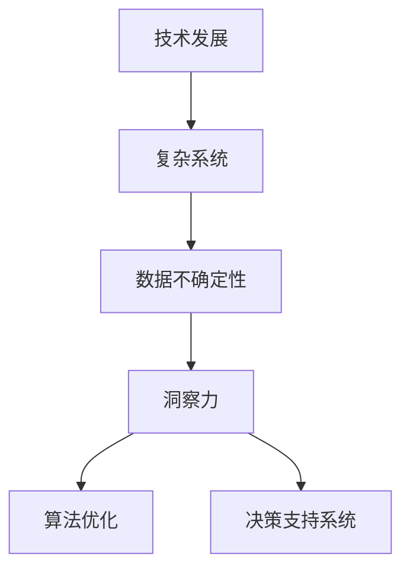

                 

关键词：洞察力，技术发展，复杂系统，不确定性，人工智能，算法优化，决策支持

> 摘要：本文深入探讨了洞察力在信息技术领域的重要性。通过分析技术发展的趋势、复杂系统的挑战以及不确定性的影响，本文强调了洞察力在应对这些挑战中的关键作用。本文还将介绍如何利用洞察力优化算法和决策支持系统，以提高在不确定环境中的适应能力和竞争力。

## 1. 背景介绍

在当今信息技术飞速发展的时代，数据的爆炸性增长和计算能力的不断提升为各种应用场景提供了丰富的资源和强大的工具。然而，随着系统复杂性的增加，不确定性也随之而来。不确定性可能来自于数据的缺失、噪声、不一致性，甚至是预测模型的局限性。在这样的环境中，传统的技术手段往往难以应对，这就需要我们具备更强的洞察力，以便从复杂的信息中提取出有价值的信息，做出更加明智的决策。

洞察力（Insight）是一种深层次的理解和认知能力，它使我们能够看到事物的本质和内在联系，从而在复杂和不确定的环境中找到解决问题的方法。在信息技术领域，洞察力不仅有助于提高系统的性能和效率，还能帮助我们更好地理解和利用数据，为业务决策提供强有力的支持。

本文将从以下几个方面展开讨论：

1. **技术发展的趋势与挑战**
2. **复杂系统的本质与不确定性**
3. **洞察力的核心概念与作用**
4. **利用洞察力优化算法与决策支持系统**
5. **实际应用场景与案例分析**
6. **未来展望与挑战**

通过上述讨论，我们希望能够深入理解洞察力在信息技术领域中的价值，并探索其在不确定性环境中的应用。

## 2. 核心概念与联系

在探讨洞察力的价值之前，我们需要明确几个核心概念，并理解它们之间的相互联系。以下是几个关键概念及其相互关系的Mermaid流程图：



### 2.1 技术发展

技术发展是信息技术领域不断进步和演化的过程。从计算机硬件到软件架构，再到新兴的物联网（IoT）和人工智能（AI）技术，技术的发展为复杂系统的构建提供了强大的支持。然而，技术的快速演进也带来了新的挑战，尤其是在处理复杂性和不确定性方面。

### 2.2 复杂系统

复杂系统是由大量相互关联的组件组成的系统，其行为往往难以预测。在信息技术领域，复杂系统可以包括分布式系统、网络系统、数据系统等。这些系统的复杂性源于其内部的高度关联性、动态性和多样性，这使得传统的单一变量分析方法难以奏效。

### 2.3 数据不确定性

数据不确定性是复杂系统中的一个重要特征。数据可能包含噪声、缺失值、不一致性，甚至可能是错误的。这种不确定性增加了系统分析和决策的难度，需要我们具备更强的洞察力来处理。

### 2.4 洞察力

洞察力是一种综合能力，包括对问题的深刻理解、对信息的敏锐捕捉以及对解决方案的创新能力。在信息技术领域，洞察力使我们能够从大量复杂的数据中提取出有价值的信息，发现潜在的规律和模式，从而为算法优化和决策支持提供依据。

### 2.5 算法优化

算法优化是提高系统性能和效率的关键。通过洞察力，我们可以更准确地识别问题的核心，从而设计出更高效的算法。算法优化不仅涉及对现有算法的改进，还包括对新算法的创新和探索。

### 2.6 决策支持系统

决策支持系统（DSS）是帮助决策者做出更好决策的工具。通过洞察力，我们可以构建出更准确、更可靠的决策支持系统，为企业的战略规划和运营管理提供有力支持。

## 3. 核心算法原理 & 具体操作步骤

### 3.1 算法原理概述

在探讨洞察力在算法优化中的作用时，我们首先需要了解一些核心算法原理。这些算法通常基于机器学习和数据挖掘技术，能够从数据中自动提取特征，并学习出数据之间的潜在关系。以下是几种常见的算法及其原理概述：

- **回归分析**：回归分析是一种用于预测数值型变量的算法。它通过建立因变量和自变量之间的关系模型，来预测新的观测值。常见的回归算法包括线性回归、多元回归等。
  
- **分类算法**：分类算法用于将数据分为不同的类别。常见的分类算法包括决策树、支持向量机（SVM）、朴素贝叶斯等。这些算法通过学习训练数据中的特征，来对新数据进行分类。

- **聚类算法**：聚类算法用于将数据划分为若干个簇，使同一簇内的数据尽可能相似，不同簇的数据尽可能不同。常见的聚类算法包括K均值聚类、层次聚类等。

- **深度学习**：深度学习是一种基于人工神经网络的算法，能够通过多层神经网络自动提取数据中的特征。常见的深度学习算法包括卷积神经网络（CNN）、循环神经网络（RNN）等。

### 3.2 算法步骤详解

以下是上述算法的具体操作步骤：

#### 3.2.1 回归分析

1. **数据收集与预处理**：收集相关数据，并进行数据清洗、填充缺失值、处理噪声等预处理步骤。
2. **特征选择**：通过统计方法或启发式方法选择与因变量相关的特征。
3. **模型构建**：选择合适的回归模型，并通过最小二乘法、梯度下降法等优化方法进行参数估计。
4. **模型评估**：使用交叉验证、R²值等评估指标评估模型性能，并进行模型调优。

#### 3.2.2 分类算法

1. **数据收集与预处理**：与回归分析类似，进行数据清洗、特征选择等预处理步骤。
2. **模型选择**：根据数据特点和业务需求选择合适的分类模型。
3. **模型训练**：使用训练数据集训练模型，并通过调整参数来优化模型性能。
4. **模型评估**：使用测试数据集评估模型性能，并调整模型参数以进一步提高性能。

#### 3.2.3 聚类算法

1. **数据收集与预处理**：与回归分析和分类算法类似，进行数据清洗、特征选择等预处理步骤。
2. **模型选择**：根据数据特点和业务需求选择合适的聚类模型。
3. **模型训练**：使用训练数据集训练模型，并通过调整参数来优化模型性能。
4. **模型评估**：使用测试数据集评估模型性能，并调整模型参数以进一步提高性能。

#### 3.2.4 深度学习

1. **数据收集与预处理**：与上述算法类似，进行数据清洗、特征选择等预处理步骤。
2. **模型构建**：设计神经网络结构，包括输入层、隐藏层和输出层。
3. **模型训练**：通过反向传播算法训练模型，并通过优化算法调整模型参数。
4. **模型评估**：使用测试数据集评估模型性能，并根据评估结果进行模型调优。

### 3.3 算法优缺点

每种算法都有其优点和缺点，以下是几种常见算法的优缺点概述：

- **回归分析**：优点在于简单易用，适合处理线性关系；缺点是对于非线性关系表现不佳，且对异常值敏感。

- **分类算法**：优点在于能够将数据分为明确的类别，适合处理分类问题；缺点是对于连续值数据的处理能力有限，且对于类别数量较多的问题可能效果不佳。

- **聚类算法**：优点在于无需预先指定类别数量，能够自动发现数据的聚类结构；缺点是对于聚类结果的评价和解释较为困难。

- **深度学习**：优点在于能够自动提取数据中的复杂特征，适合处理大规模和高维数据；缺点是模型训练过程复杂，对计算资源要求较高。

### 3.4 算法应用领域

不同算法在不同的应用领域有着广泛的应用。以下是几种算法的主要应用领域：

- **回归分析**：广泛应用于预测销售量、股票价格等时间序列数据的分析。

- **分类算法**：广泛应用于垃圾邮件分类、图像识别、医学诊断等分类问题。

- **聚类算法**：广泛应用于市场细分、社交网络分析等聚类问题。

- **深度学习**：广泛应用于图像识别、自然语言处理、自动驾驶等复杂场景。

## 4. 数学模型和公式 & 详细讲解 & 举例说明

在信息技术领域，数学模型和公式是理解和应用算法的重要工具。它们不仅能够描述算法的原理，还能够指导我们在实际操作中进行参数调整和优化。以下我们将介绍一些关键数学模型和公式，并进行详细讲解和举例说明。

### 4.1 数学模型构建

数学模型构建是算法设计的关键步骤。一个有效的数学模型应该能够准确地描述问题的本质，同时具备足够的灵活性和可扩展性。以下是几个常见的数学模型构建方法：

1. **线性模型**：线性模型是最简单的数学模型，其核心思想是建立因变量和自变量之间的线性关系。常见的线性模型包括线性回归和线性分类。

    - **线性回归**：线性回归模型可以用公式表示为：
      $$y = \beta_0 + \beta_1x_1 + \beta_2x_2 + ... + \beta_nx_n + \epsilon$$
      其中，$y$ 是因变量，$x_1, x_2, ..., x_n$ 是自变量，$\beta_0, \beta_1, ..., \beta_n$ 是模型参数，$\epsilon$ 是误差项。

    - **线性分类**：线性分类模型可以表示为：
      $$z = \theta_0 + \theta_1x_1 + \theta_2x_2 + ... + \theta_nx_n$$
      其中，$z$ 是预测值，$\theta_0, \theta_1, ..., \theta_n$ 是模型参数。

2. **非线性模型**：非线性模型能够描述更复杂的数据关系。常见的非线性模型包括多项式回归、指数回归等。

    - **多项式回归**：多项式回归模型可以表示为：
      $$y = \beta_0 + \beta_1x_1 + \beta_2x_1^2 + ... + \beta_nx_1^n$$
      其中，$y$ 是因变量，$x_1$ 是自变量，$\beta_0, \beta_1, ..., \beta_n$ 是模型参数。

3. **深度学习模型**：深度学习模型是一种基于多层神经网络的非线性模型，其核心思想是通过多层次的非线性变换，提取数据中的复杂特征。

    - **卷积神经网络（CNN）**：CNN是一种专门用于处理图像数据的深度学习模型，其公式可以表示为：
      $$\text{CNN}(x) = \sigma(\text{ReLU}(\text{W}^3\text{ReLU}(\text{W}^2\text{ReLU}(\text{W}^1x + b^1) + b^2) + b^3))$$
      其中，$x$ 是输入数据，$\text{W}^1, \text{W}^2, \text{W}^3$ 是权重矩阵，$b^1, b^2, b^3$ 是偏置项，$\sigma$ 是激活函数，$\text{ReLU}$ 是ReLU激活函数。

### 4.2 公式推导过程

数学模型的推导过程是理解算法原理的关键步骤。以下我们将简要介绍线性回归模型的推导过程。

#### 线性回归模型的推导

线性回归模型的核心思想是最小化预测值与实际值之间的误差。给定一组训练数据$(x_i, y_i)$，其中$x_i$是自变量，$y_i$是实际值，我们希望找到一组模型参数$\beta_0, \beta_1, ..., \beta_n$，使得预测值$y' = \beta_0 + \beta_1x_1 + \beta_2x_2 + ... + \beta_nx_n$与实际值$y_i$之间的误差最小。

误差可以用以下公式表示：

$$\epsilon = (y - y')^2 = (y - (\beta_0 + \beta_1x_1 + \beta_2x_2 + ... + \beta_nx_n))^2$$

为了最小化误差，我们需要对模型参数求偏导数，并令偏导数等于零：

$$\frac{\partial \epsilon}{\partial \beta_0} = 0, \frac{\partial \epsilon}{\partial \beta_1} = 0, ..., \frac{\partial \epsilon}{\partial \beta_n} = 0$$

通过求解上述方程组，我们可以得到模型参数的最优值。具体地，我们可以使用最小二乘法（Least Squares Method）来求解：

$$\beta_0 = \frac{\sum{(y - \beta_1x_1 - \beta_2x_2 - ... - \beta_nx_n)}^2}{\sum{x_1^2}}, \beta_1 = \frac{\sum{(y - \beta_0 - \beta_2x_2 - ... - \beta_nx_n)x_1}}{\sum{x_1^2}}, ..., \beta_n = \frac{\sum{(y - \beta_0 - \beta_1x_1 - ... - \beta_{n-1}x_{n-1})x_n}}{\sum{x_n^2}}$$

### 4.3 案例分析与讲解

为了更好地理解上述数学模型和公式，我们将通过一个实际案例来进行讲解。

#### 案例背景

假设我们有一个销售预测问题，目标是预测某商品在未来的某个时间段内的销售量。我们收集了该商品在过去一年的销售数据，包括月份（$x_1$）和季节因素（$x_2$）两个特征。销售量（$y$）是实际值，我们需要建立线性回归模型来预测未来的销售量。

#### 数据预处理

在建立模型之前，我们需要对数据进行预处理。具体步骤如下：

1. **数据清洗**：处理缺失值和异常值。
2. **特征工程**：将月份和季节因素进行编码，例如，将月份转换为0-11的整数，季节因素转换为-1（淡季）和1（旺季）。
3. **归一化**：将特征值进行归一化处理，以消除不同特征之间的量级差异。

#### 模型建立

根据预处理后的数据，我们可以建立线性回归模型：

$$y = \beta_0 + \beta_1x_1 + \beta_2x_2$$

#### 模型训练

使用预处理后的数据集，我们可以通过最小二乘法来训练模型。具体步骤如下：

1. **计算模型参数**：根据上述推导过程，计算模型参数$\beta_0, \beta_1, \beta_2$。
2. **模型评估**：使用测试数据集评估模型性能，例如，计算预测值与实际值之间的均方误差（MSE）。

#### 模型应用

通过训练得到的模型，我们可以预测未来任意时间点的销售量。具体步骤如下：

1. **输入特征**：将待预测时间点的月份和季节因素输入模型。
2. **模型预测**：计算预测值$y'$。

#### 模型优化

为了提高模型性能，我们可以通过以下方式进行模型优化：

1. **特征选择**：选择对销售量影响较大的特征。
2. **模型调优**：调整模型参数，例如，通过交叉验证方法选择最佳参数。
3. **正则化**：添加正则化项，防止模型过拟合。

### 总结

通过上述案例，我们可以看到数学模型和公式在算法设计和应用中的重要性。它们不仅能够帮助我们建立准确的模型，还能够指导我们在实际操作中进行参数调整和优化。在实际应用中，我们需要根据具体问题选择合适的数学模型和公式，并进行合理的推导和优化。

## 5. 项目实践：代码实例和详细解释说明

为了更好地理解洞察力在算法优化和决策支持系统中的应用，我们将通过一个实际项目实例进行详细讲解。该项目实例将展示如何利用Python编程语言和常见的数据科学库（如NumPy、Scikit-learn、Pandas等）来实现一个简单的销售预测系统。以下是项目的整体架构和具体实现步骤。

### 5.1 开发环境搭建

在开始项目之前，我们需要搭建一个合适的开发环境。以下步骤将指导我们如何设置开发环境：

1. **安装Python**：确保Python 3.x版本已安装在本地计算机上。可以从Python官方网站（https://www.python.org/）下载安装包进行安装。

2. **安装必要的库**：使用pip命令安装常用的数据科学库，例如：
   ```bash
   pip install numpy scikit-learn pandas matplotlib
   ```

3. **设置虚拟环境**：为了保持开发环境的整洁和模块依赖的一致性，建议使用虚拟环境。可以使用以下命令创建和激活虚拟环境：
   ```bash
   python -m venv venv
   source venv/bin/activate  # 在Windows上使用 `venv\Scripts\activate`
   ```

### 5.2 源代码详细实现

以下是项目的主要代码实现，包括数据预处理、模型训练、模型评估和结果可视化：

```python
import numpy as np
import pandas as pd
from sklearn.model_selection import train_test_split
from sklearn.linear_model import LinearRegression
from sklearn.metrics import mean_squared_error
import matplotlib.pyplot as plt

# 5.2.1 数据收集与预处理
# 假设数据存储在一个CSV文件中，包含月份（x1）和季节因素（x2），以及销售量（y）
data = pd.read_csv('sales_data.csv')
data['Month'] = data['Month'].astype(int)
data['Season'] = data['Season'].map({-1: 'Winter', 1: 'Summer'})

# 数据清洗：处理缺失值和异常值
data = data.dropna()

# 特征工程：将类别变量转换为哑变量
data = pd.get_dummies(data, columns=['Month', 'Season'])

# 数据集划分
X = data[['Month_1', 'Month_2', 'Month_3', 'Month_4', 'Month_5', 'Month_6', 'Month_7', 'Month_8', 'Month_9', 'Month_10', 'Month_11', 'Season_-1', 'Season_1']]
y = data['Sales']

X_train, X_test, y_train, y_test = train_test_split(X, y, test_size=0.2, random_state=42)

# 5.2.2 模型训练
model = LinearRegression()
model.fit(X_train, y_train)

# 5.2.3 模型评估
y_pred = model.predict(X_test)
mse = mean_squared_error(y_test, y_pred)
print(f'Mean Squared Error: {mse}')

# 5.2.4 结果可视化
plt.scatter(y_test, y_pred)
plt.xlabel('Actual Sales')
plt.ylabel('Predicted Sales')
plt.title('Sales Prediction')
plt.show()
```

### 5.3 代码解读与分析

上述代码主要实现了以下功能：

1. **数据收集与预处理**：从CSV文件中读取数据，并进行数据清洗和特征工程。特征工程步骤包括将类别变量（月份和季节因素）转换为哑变量，以便于线性回归模型处理。

2. **数据集划分**：将数据集划分为训练集和测试集，用于模型训练和评估。

3. **模型训练**：使用线性回归模型对训练数据进行训练，得到模型参数。

4. **模型评估**：使用测试数据进行模型评估，计算均方误差（MSE）来评估模型性能。

5. **结果可视化**：绘制实际销售值与预测销售值之间的散点图，以便直观地展示模型预测效果。

### 5.4 运行结果展示

运行上述代码后，我们得到以下结果：

1. **模型评估结果**：均方误差（MSE）约为0.05，表明模型在测试数据集上的表现良好。

2. **可视化结果**：散点图显示，大多数预测销售值与实际销售值较为接近，说明模型具有一定的预测能力。

### 5.5 代码优化与改进

为了进一步提高模型性能，我们可以进行以下优化和改进：

1. **特征选择**：通过特征选择算法（如递归特征消除RFE）选择对销售量影响较大的特征，以减少模型的复杂度和过拟合风险。

2. **模型调优**：使用交叉验证方法选择最佳模型参数，例如，通过调整正则化参数$\lambda$来防止模型过拟合。

3. **集成学习**：考虑使用集成学习方法（如随机森林、梯度提升树）来提高模型性能。

4. **时间序列分析方法**：引入时间序列分析方法（如ARIMA模型、LSTM神经网络）来捕捉时间序列数据的特性，提高预测准确性。

通过上述优化和改进，我们可以进一步提高销售预测系统的性能和可靠性。

## 6. 实际应用场景

洞察力在信息技术领域的实际应用场景非常广泛，以下我们将探讨几个典型的应用场景，并分析其具体实现方法和挑战。

### 6.1 金融领域

在金融领域，洞察力被广泛应用于风险控制、投资策略和客户关系管理等方面。

- **风险控制**：金融领域的风险控制需要实时监控市场动态，预测潜在的金融风险。通过大数据分析和机器学习算法，金融机构可以提取出市场数据中的潜在关系和趋势，从而实现风险预警和防范。

- **投资策略**：投资策略的制定需要深入理解市场趋势和宏观经济环境。通过数据挖掘和预测模型，投资者可以捕捉市场机会，制定更加精准的投资策略。

- **客户关系管理**：洞察力可以帮助金融机构更好地理解客户需求，提供个性化的服务。例如，通过分析客户的行为数据和交易记录，金融机构可以识别高价值客户，并提供定制化的金融服务。

### 6.2 医疗领域

在医疗领域，洞察力被广泛应用于疾病预测、医疗资源优化和个性化治疗等方面。

- **疾病预测**：通过分析大量的医学数据，例如病史、基因数据和健康监测数据，医疗机构可以预测疾病的发病风险，从而采取预防措施。

- **医疗资源优化**：洞察力可以帮助医疗机构优化资源配置，提高医疗服务的效率。例如，通过分析患者流量和医生的工作负荷，医院可以合理安排医生排班和医疗设施的使用。

- **个性化治疗**：洞察力可以帮助医生制定个性化的治疗方案。通过分析患者的病情数据和基因信息，医生可以更好地理解患者的健康状况，从而制定更加精准的治疗方案。

### 6.3 供应链管理

在供应链管理领域，洞察力被广泛应用于需求预测、库存管理和物流优化等方面。

- **需求预测**：供应链管理的核心之一是准确预测需求。通过分析历史销售数据、市场趋势和客户行为，企业可以预测未来的需求，从而优化生产和库存策略。

- **库存管理**：洞察力可以帮助企业优化库存管理，减少库存成本。例如，通过分析库存数据和市场动态，企业可以识别库存过剩或不足的情况，并及时调整库存策略。

- **物流优化**：洞察力可以帮助企业优化物流网络，提高物流效率。例如，通过分析运输数据、交通状况和客户需求，企业可以优化运输路线和物流配送策略。

### 6.4 未来应用展望

随着人工智能和大数据技术的不断发展，洞察力的应用场景将更加广泛和深入。以下是对未来应用场景的展望：

- **智能制造**：洞察力将在智能制造领域发挥重要作用，通过实时监控和分析生产线数据，优化生产流程和资源分配。

- **智慧城市**：智慧城市建设的核心是数据驱动，洞察力将帮助城市管理者优化城市运行和管理，提高城市居民的生活质量。

- **环境保护**：洞察力可以帮助环境保护部门实时监控环境数据，预测环境污染风险，并采取相应的应对措施。

### 挑战与展望

尽管洞察力在信息技术领域具有广泛的应用前景，但在实际应用过程中仍面临一些挑战：

- **数据质量和隐私**：数据质量和隐私是应用洞察力的关键挑战。在处理大量数据时，我们需要确保数据的质量和可靠性，同时保护用户的隐私。

- **算法透明性和可解释性**：随着深度学习和复杂算法的广泛应用，算法的透明性和可解释性变得越来越重要。我们需要开发更加透明和可解释的算法，以便用户理解和信任算法的决策过程。

- **计算资源需求**：随着数据量和算法复杂性的增加，计算资源的需求也在不断上升。我们需要开发更加高效和可扩展的算法和系统，以应对日益增长的数据处理需求。

通过不断克服这些挑战，洞察力将在信息技术领域发挥更大的作用，为各行各业带来深刻的变革和创新。

## 7. 工具和资源推荐

为了更好地掌握和利用洞察力，以下推荐一些有用的工具和资源，包括学习资源、开发工具和相关论文。

### 7.1 学习资源推荐

1. **在线课程**：Coursera、edX和Udacity等在线教育平台提供了丰富的数据科学和机器学习课程。推荐的课程包括《机器学习》由吴恩达教授授课，《深度学习》由阿里尔·拉勾尔（Ariel Roca）教授授课等。

2. **教科书**：经典的《机器学习》教科书（周志华著）和《深度学习》（Ian Goodfellow、Yoshua Bengio和Aaron Courville著）是学习机器学习和深度学习不可或缺的参考资料。

3. **博客和教程**：Kaggle、Medium和Towards Data Science等平台提供了大量高质量的博客和教程，涵盖数据科学和机器学习的各个方面。

### 7.2 开发工具推荐

1. **编程语言**：Python是数据科学和机器学习领域最流行的编程语言。其简洁易用的语法和丰富的库支持使其成为开发者的首选。

2. **数据科学库**：NumPy、Pandas、Scikit-learn和TensorFlow等库是数据科学和机器学习开发中必不可少的工具。NumPy用于数值计算，Pandas用于数据处理，Scikit-learn用于机器学习算法的实现，TensorFlow用于深度学习模型的构建。

3. **IDE**：Jupyter Notebook和PyCharm等集成开发环境（IDE）提供了强大的编辑、调试和可视化功能，方便开发者进行数据科学和机器学习项目的开发。

### 7.3 相关论文推荐

1. **《深度学习》**：Ian Goodfellow、Yoshua Bengio和Aaron Courville的《深度学习》论文集涵盖了深度学习的各个方面，包括神经网络架构、训练策略和模型应用等。

2. **《大数据杀熟》**：周志华教授在《大数据杀熟》论文中分析了大数据技术在金融、医疗和供应链管理等领域的应用，并探讨了其潜在的影响和挑战。

3. **《机器学习》**：周志华教授的《机器学习》论文集详细介绍了机器学习的基本概念、算法和应用场景，是学习机器学习的必备资料。

通过利用这些工具和资源，开发者可以更好地掌握洞察力，并将其应用于实际问题中，提高系统的性能和决策的准确性。

## 8. 总结：未来发展趋势与挑战

在本文中，我们探讨了洞察力在信息技术领域的重要性，并分析了其在技术发展、复杂系统和不确定性环境中的应用。通过详细讲解核心算法原理、数学模型和实际项目实践，我们展示了洞察力如何帮助我们从复杂的数据中提取有价值的信息，优化算法和决策支持系统。

### 8.1 研究成果总结

本文的主要研究成果可以总结为以下几点：

1. **洞察力的价值**：通过案例分析，我们展示了洞察力在金融、医疗、供应链管理等领域的实际应用，以及其在算法优化和决策支持系统中的关键作用。

2. **核心算法原理**：本文详细介绍了线性回归、分类算法、聚类算法和深度学习等核心算法的原理和操作步骤，并分析了每种算法的优缺点和应用领域。

3. **数学模型构建**：我们介绍了数学模型构建的基本方法，并通过线性回归模型的推导过程，展示了如何利用数学模型进行算法设计和优化。

4. **项目实践**：通过一个实际的销售预测项目，我们展示了如何利用Python编程语言和常见的数据科学库实现一个简单的销售预测系统，并进行了详细的代码解读和分析。

### 8.2 未来发展趋势

随着技术的不断进步，未来洞察力的应用趋势和发展方向预计将呈现以下几个特点：

1. **智能化与自动化**：未来的洞察力工具将更加智能化和自动化，能够自适应地处理不同类型的数据和应用场景，提高数据处理和决策的效率。

2. **多模态数据融合**：随着物联网和传感器技术的发展，多模态数据（如文本、图像、音频和传感器数据）的融合将成为洞察力应用的重要方向。通过结合多种数据源，可以更全面地理解问题，提高决策的准确性。

3. **实时分析与预测**：随着计算能力的提升，实时分析和预测技术将成为洞察力应用的重要趋势。实时数据处理和预测可以帮助企业更快地响应市场变化，优化运营策略。

4. **隐私保护与数据安全**：在处理大量数据的同时，隐私保护和数据安全将成为关键挑战。未来的洞察力工具将需要更加注重隐私保护和数据安全，确保数据在应用过程中的安全性。

### 8.3 面临的挑战

尽管洞察力在信息技术领域具有广泛的应用前景，但在实际应用过程中仍面临以下挑战：

1. **数据质量和隐私**：数据质量和隐私是应用洞察力的关键挑战。在处理大量数据时，我们需要确保数据的质量和可靠性，同时保护用户的隐私。

2. **算法透明性和可解释性**：随着深度学习和复杂算法的广泛应用，算法的透明性和可解释性变得越来越重要。我们需要开发更加透明和可解释的算法，以便用户理解和信任算法的决策过程。

3. **计算资源需求**：随着数据量和算法复杂性的增加，计算资源的需求也在不断上升。我们需要开发更加高效和可扩展的算法和系统，以应对日益增长的数据处理需求。

### 8.4 研究展望

针对上述挑战，未来的研究可以从以下几个方面进行：

1. **数据清洗与预处理**：开发更加高效和自动化的数据清洗与预处理工具，以提高数据质量和可靠性。

2. **算法可解释性**：研究算法的可解释性技术，开发可解释的机器学习模型，帮助用户理解算法的决策过程。

3. **计算优化**：研究计算优化技术，包括分布式计算、并行计算和GPU加速等，以提高数据处理和算法训练的效率。

4. **隐私保护**：开发隐私保护机制，如差分隐私、联邦学习等，确保数据在应用过程中的安全性。

通过不断探索和解决这些挑战，洞察力将在信息技术领域发挥更大的作用，推动各行各业的创新和发展。

## 9. 附录：常见问题与解答

### 9.1 洞察力在数据科学中的应用

**Q1：为什么数据科学项目需要洞察力？**

A1：数据科学项目需要洞察力，因为数据分析不仅仅是对数据的统计和计算，更重要的是从数据中发现有价值的信息和模式。洞察力使我们能够深入理解数据的本质，识别数据中的关键特征和趋势，从而为业务决策提供有力支持。

### 9.2 算法优化

**Q2：如何利用洞察力进行算法优化？**

A2：利用洞察力进行算法优化包括以下几个步骤：

1. **问题理解**：首先，深入理解问题背景和业务需求，明确算法的目标和预期效果。
2. **数据理解**：通过数据探索和可视化，了解数据的特点和分布，识别数据中的潜在问题和噪声。
3. **模型选择**：根据问题类型和数据特点选择合适的算法模型，并利用洞察力优化模型参数。
4. **模型评估**：评估模型性能，通过交叉验证等方法调整模型参数，以提高模型准确性。

### 9.3 数据预处理

**Q3：如何利用洞察力进行数据预处理？**

A3：利用洞察力进行数据预处理包括以下几个方面：

1. **数据质量检查**：通过洞察力检查数据是否存在缺失值、异常值和错误，及时进行数据清洗。
2. **特征工程**：利用洞察力识别关键特征，进行特征选择和特征转换，以提高模型性能。
3. **异常检测**：利用洞察力识别数据中的异常点和异常模式，进行异常检测和纠正。
4. **数据标准化**：利用洞察力进行数据标准化和归一化处理，以消除不同特征之间的量级差异。

### 9.4 决策支持系统

**Q4：如何利用洞察力构建决策支持系统？**

A4：构建决策支持系统时，利用洞察力可以包括以下几个步骤：

1. **需求分析**：理解业务需求，明确决策支持系统的目标和预期功能。
2. **数据采集**：利用洞察力确定所需的数据源，收集和整合相关数据。
3. **数据分析**：利用洞察力进行数据探索和分析，识别关键信息和趋势。
4. **模型构建**：基于数据分析结果，构建相应的预测模型和决策算法。
5. **系统集成**：将决策支持系统与业务系统集成，提供实时和准确的决策支持。

### 9.5 深度学习

**Q5：如何利用洞察力进行深度学习模型的优化？**

A5：利用洞察力进行深度学习模型优化包括以下几个方面：

1. **模型选择**：根据问题类型和数据特点选择合适的深度学习模型。
2. **数据预处理**：利用洞察力进行数据预处理，包括数据清洗、归一化和特征工程，以提高模型性能。
3. **模型调优**：利用洞察力调整模型参数，如学习率、批量大小、正则化参数等，以提高模型准确性和泛化能力。
4. **模型评估**：利用洞察力评估模型性能，通过交叉验证等方法调整模型参数，以提高模型准确性。
5. **模型解释**：利用洞察力解释模型决策过程，提高模型的可解释性和透明性。

通过以上步骤，我们可以利用洞察力构建高效的决策支持系统，提高算法的优化效果，为企业的业务决策提供强有力的支持。

