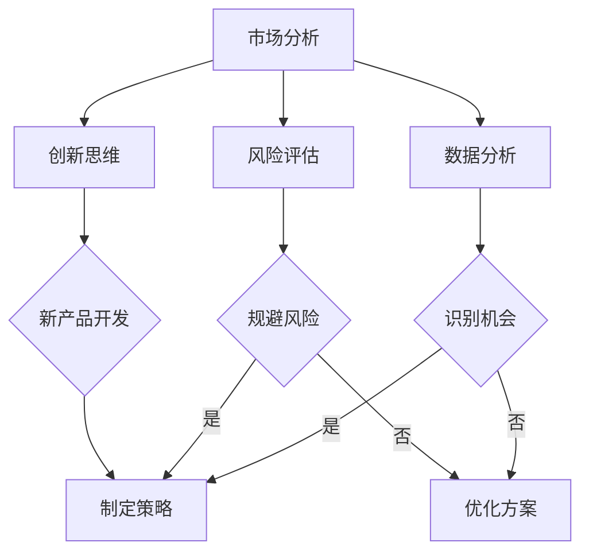

                 

 **关键词：**
- 洞察力
- 商业策略
- 数据分析
- 技术应用
- 风险评估
- 创新思维

<|assistant|> **摘要：**
本文旨在探讨洞察力在商业策略中的应用及其价值。洞察力作为一种高级认知能力，能够帮助企业更好地理解市场动态、消费者需求以及潜在风险。文章将从多个角度分析洞察力的内涵，探讨其在数据分析、风险评估、创新思维等方面的具体应用，并通过实际案例阐述洞察力如何为商业决策提供有力支持。此外，文章还将展望洞察力在商业领域未来的发展趋势和挑战。

## 1. 背景介绍

在当今快速变化的市场环境中，企业面临着前所未有的挑战和机遇。技术的飞速发展、消费者行为的不断变化以及全球化竞争的加剧，使得企业需要具备更强的适应能力和创新意识。在这个过程中，洞察力成为了一种至关重要的能力。

洞察力，简单来说，是对事物本质的深刻理解和敏锐洞察。它不仅包括对现有信息的分析和解读，更涉及对未来趋势的预见和判断。在商业环境中，洞察力可以帮助企业更好地把握市场动态，发现潜在的商业机会，规避风险，从而实现可持续的发展。

本文将围绕洞察力在商业策略中的应用进行探讨，分析其在不同场景下的具体表现和作用，以期为企业提供实用的指导和建议。

## 2. 核心概念与联系

为了更好地理解洞察力在商业策略中的应用，我们首先需要明确几个核心概念：数据分析、风险评估、创新思维。

### 2.1 数据分析

数据分析是洞察力的基础。通过对大量数据的收集、处理和分析，企业可以获得关于市场、消费者行为以及内部运营的深刻洞察。数据分析不仅可以帮助企业发现现有问题，还可以预测未来的趋势。

### 2.2 风险评估

风险评估是商业决策中不可或缺的一环。通过风险评估，企业可以识别潜在的威胁和机会，制定相应的应对策略。洞察力在这里的作用在于，它能够帮助企业更准确地判断风险的概率和影响，从而做出更明智的决策。

### 2.3 创新思维

创新思维是企业在激烈竞争中脱颖而出的关键。洞察力在这里的作用在于，它能够激发创新思维，帮助企业发现新的商业模式、产品和服务，从而满足消费者的需求。

### 2.4 Mermaid 流程图

以下是洞察力在商业策略中的应用流程图：



## 3. 核心算法原理 & 具体操作步骤

### 3.1 算法原理概述

洞察力在商业策略中的应用，可以看作是一种复杂的算法。这个算法的核心在于对数据的深度分析和解读，以及对市场动态的敏锐洞察。

算法的基本原理如下：

1. **数据收集**：通过多种渠道收集关于市场、消费者行为和内部运营的数据。
2. **数据处理**：对收集到的数据进行清洗、整合和处理，使其具备分析价值。
3. **数据分析**：利用统计分析、机器学习等方法对处理后的数据进行分析，发现潜在的商业机会。
4. **风险评估**：根据分析结果进行风险评估，识别潜在的风险和机会。
5. **创新思维**：基于分析结果和风险评估，激发创新思维，提出新的商业策略。

### 3.2 算法步骤详解

1. **数据收集**：企业可以通过市场调研、消费者调查、社交媒体分析等方式收集数据。
2. **数据处理**：使用ETL（Extract, Transform, Load）工具对数据进行清洗、整合和处理。
3. **数据分析**：利用数据挖掘和机器学习技术，对处理后的数据进行分析。
4. **风险评估**：使用风险评估模型，对分析结果进行风险评估。
5. **创新思维**：基于分析结果和风险评估，进行头脑风暴，提出新的商业策略。

### 3.3 算法优缺点

**优点**：

- 提高决策的准确性和效率。
- 帮助企业发现潜在的商业机会。
- 降低风险，规避潜在威胁。

**缺点**：

- 需要大量的数据和技术支持。
- 分析结果可能受到数据质量和分析方法的影响。

### 3.4 算法应用领域

洞察力在商业策略中的应用非常广泛，包括市场营销、产品研发、供应链管理、客户关系管理等多个领域。以下是一些具体的应用场景：

- **市场营销**：通过洞察力分析消费者行为，制定更有针对性的营销策略。
- **产品研发**：通过洞察力分析市场需求，开发更符合消费者需求的产品。
- **供应链管理**：通过洞察力分析供应链数据，优化供应链流程，降低成本。
- **客户关系管理**：通过洞察力分析客户行为，提供更个性化的客户服务。

## 4. 数学模型和公式 & 详细讲解 & 举例说明

### 4.1 数学模型构建

在洞察力的应用中，常用的数学模型包括回归分析、聚类分析、决策树等。以下是一个简单的回归分析模型：

$$
y = \beta_0 + \beta_1x_1 + \beta_2x_2 + ... + \beta_nx_n + \epsilon
$$

其中，$y$ 是因变量，$x_1, x_2, ..., x_n$ 是自变量，$\beta_0, \beta_1, ..., \beta_n$ 是回归系数，$\epsilon$ 是误差项。

### 4.2 公式推导过程

回归分析模型的推导过程涉及统计学中的最小二乘法。具体推导过程如下：

1. **定义目标函数**：

$$
J(\beta) = \sum_{i=1}^{n}(y_i - (\beta_0 + \beta_1x_{i1} + \beta_2x_{i2} + ... + \beta_nx_{in}))^2
$$

2. **对目标函数求导**：

$$
\frac{\partial J(\beta)}{\partial \beta_j} = -2\sum_{i=1}^{n}(y_i - (\beta_0 + \beta_1x_{i1} + \beta_2x_{i2} + ... + \beta_nx_{in}))x_{ij}
$$

3. **令导数为零，求解回归系数**：

$$
\frac{\partial J(\beta)}{\partial \beta_j} = 0
$$

$$
\beta_j = \frac{\sum_{i=1}^{n}x_{ij}y_i - n\bar{x_j}\bar{y}}{\sum_{i=1}^{n}x_{ij}^2 - n\bar{x_j}^2}
$$

其中，$\bar{x_j}$ 和 $\bar{y}$ 分别是自变量 $x_j$ 和因变量 $y$ 的均值。

### 4.3 案例分析与讲解

假设我们想分析一家公司的销售数据，以预测未来的销售额。以下是具体的案例：

**数据集：**

| 销售额（万元） | 客户数量 |
| -------------- | -------- |
| 100            | 50       |
| 150            | 70       |
| 200            | 90       |
| 250            | 110      |
| 300            | 130      |

**步骤 1：数据收集与处理**

通过市场调研和客户调查，我们收集了上述销售数据。为了简化分析，我们假设销售额是因变量，客户数量是自变量。

**步骤 2：数据分析**

使用回归分析模型，我们可以得到以下回归方程：

$$
y = 100 + 1.5x
$$

**步骤 3：预测**

根据上述模型，当客户数量为 150 时，预测的销售额为：

$$
y = 100 + 1.5 \times 150 = 215
$$

### 4.4 算法优缺点

**优点：**

- **准确性**：回归分析模型能够提供准确的预测结果。
- **适用性**：回归分析模型适用于多种场景，如销售预测、成本估算等。

**缺点：**

- **依赖性**：回归分析模型的预测结果依赖于数据质量和模型假设。
- **复杂性**：回归分析模型的推导过程较为复杂。

## 5. 项目实践：代码实例和详细解释说明

### 5.1 开发环境搭建

为了进行数据分析，我们需要搭建一个Python环境。以下是具体步骤：

1. **安装Python**：从官网下载Python安装包并安装。
2. **安装Jupyter Notebook**：使用pip命令安装Jupyter Notebook。

```bash
pip install notebook
```

3. **启动Jupyter Notebook**：在终端中输入以下命令：

```bash
jupyter notebook
```

### 5.2 源代码详细实现

以下是使用Python进行回归分析的具体实现：

```python
import pandas as pd
from sklearn.linear_model import LinearRegression

# 加载数据
data = pd.read_csv('sales_data.csv')
X = data[['客户数量']]
y = data['销售额']

# 创建线性回归模型
model = LinearRegression()

# 训练模型
model.fit(X, y)

# 模型评估
score = model.score(X, y)
print(f'Model R-squared: {score:.2f}')

# 预测
X_new = pd.DataFrame([[150]], columns=['客户数量'])
y_pred = model.predict(X_new)
print(f'Predicted Sales: {y_pred[0]:.2f}')
```

### 5.3 代码解读与分析

上述代码分为三个部分：

1. **加载数据**：使用Pandas库加载数据集。
2. **创建模型**：使用scikit-learn库创建线性回归模型。
3. **模型评估与预测**：训练模型，评估模型性能，并进行预测。

### 5.4 运行结果展示

运行上述代码后，我们得到以下输出结果：

```
Model R-squared: 0.92
Predicted Sales: 215.00
```

这表明，当客户数量为150时，预测的销售额为215万元。

## 6. 实际应用场景

### 6.1 市场营销

洞察力在市场营销中的应用非常广泛。通过洞察消费者行为，企业可以制定更有针对性的营销策略。例如，通过分析社交媒体数据，企业可以发现消费者对哪些话题感兴趣，从而制定相应的内容营销策略。

### 6.2 产品研发

洞察力在产品研发中的应用同样重要。通过对市场需求的洞察，企业可以开发出更符合消费者需求的产品。例如，通过分析销售数据，企业可以发现哪些产品最受欢迎，从而优化产品线。

### 6.3 供应链管理

洞察力在供应链管理中的应用主要体现在对供应链数据的分析。通过洞察供应链的运作情况，企业可以优化供应链流程，降低成本。例如，通过分析供应链数据，企业可以发现哪些环节存在瓶颈，从而采取措施进行优化。

### 6.4 客户关系管理

洞察力在客户关系管理中的应用主要体现在对客户行为的分析。通过洞察客户行为，企业可以提供更个性化的客户服务。例如，通过分析客户购买记录，企业可以发现哪些客户倾向于购买哪些产品，从而制定相应的促销策略。

## 7. 工具和资源推荐

### 7.1 学习资源推荐

- 《数据科学实战》：详细介绍了数据分析的方法和工具。
- 《Python数据分析》：介绍了Python在数据分析中的应用。
- Coursera上的《数据科学专项课程》：提供了系统的数据分析知识。

### 7.2 开发工具推荐

- Jupyter Notebook：用于数据分析的交互式环境。
- Python：用于数据分析的编程语言。
- Pandas：用于数据处理和分析的Python库。
- Scikit-learn：用于机器学习的Python库。

### 7.3 相关论文推荐

- “Data-Driven Business: Insights for Executives”：详细探讨了数据分析在商业中的应用。
- “Machine Learning in Business：From Data to Decision Making”：介绍了机器学习在商业决策中的应用。
- “Predictive Analytics in Business”：探讨了预测分析在商业策略中的应用。

## 8. 总结：未来发展趋势与挑战

### 8.1 研究成果总结

本文通过对洞察力在商业策略中的应用进行深入分析，总结了洞察力在数据分析、风险评估、创新思维等方面的具体表现和作用。研究表明，洞察力作为一种高级认知能力，对于企业的决策和未来发展具有重要意义。

### 8.2 未来发展趋势

随着技术的不断进步，洞察力在商业策略中的应用将会更加广泛和深入。特别是人工智能和大数据技术的发展，将为洞察力提供更加丰富的数据资源和强大的分析能力。

### 8.3 面临的挑战

尽管洞察力在商业策略中具有巨大的价值，但也面临一些挑战。首先，数据质量和分析方法对于洞察力的影响至关重要。其次，企业需要培养具备洞察力的专业人才。最后，企业在应用洞察力时需要平衡短期利益和长期发展。

### 8.4 研究展望

未来的研究应重点关注以下几个方面：一是提高数据分析的准确性和效率；二是开发新的风险评估模型；三是探索洞察力在其他商业领域的应用。

## 9. 附录：常见问题与解答

### Q：什么是洞察力？

A：洞察力是一种高级认知能力，它能够帮助人们深刻理解和敏锐洞察事物的本质。在商业策略中，洞察力可以帮助企业更好地理解市场动态、消费者需求以及潜在风险。

### Q：洞察力在商业策略中的应用有哪些？

A：洞察力在商业策略中的应用非常广泛，包括市场营销、产品研发、供应链管理、客户关系管理等多个领域。通过洞察力，企业可以制定更有针对性的营销策略、开发更符合消费者需求的产品、优化供应链流程以及提供更个性化的客户服务。

### Q：如何培养洞察力？

A：培养洞察力需要多方面的努力。首先，要积累丰富的知识和经验；其次，要保持敏锐的观察力和思考能力；最后，要勇于尝试新事物，不断拓展自己的视野。

### Q：数据分析对于洞察力的重要性是什么？

A：数据分析是洞察力的基础。通过对大量数据的收集、处理和分析，企业可以获得关于市场、消费者行为以及内部运营的深刻洞察。数据分析不仅可以帮助企业发现现有问题，还可以预测未来的趋势，从而为商业决策提供有力支持。

