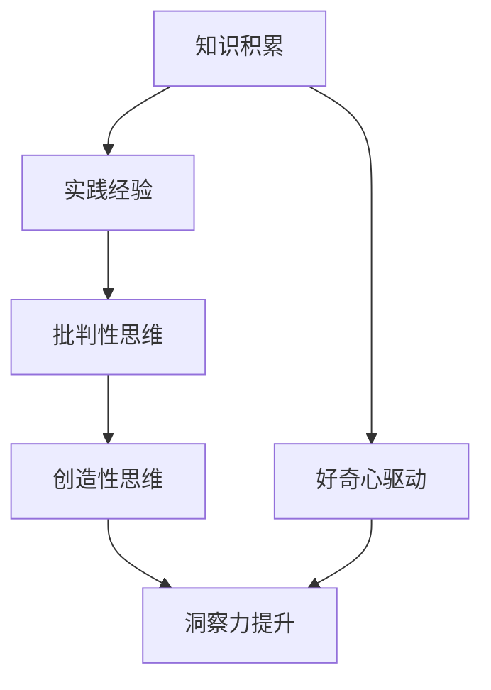
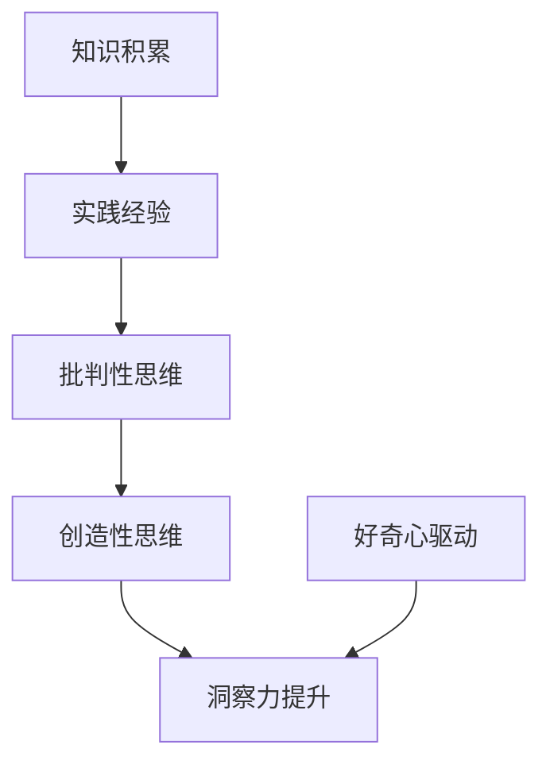

                 

 **关键词：**
- 洞察力
- 好奇心
- 创新人才
- 教育方法
- 技术领域
- 培养策略

<|assistant|> **摘要：**
本文旨在探讨如何培养和提高个体在技术领域的洞察力，特别是通过激发好奇心和鼓励创新人才的培养。文章首先介绍了洞察力的定义和重要性，随后讨论了好奇心与创新思维的关系。接着，文章详细分析了当前教育和培训体系中的不足，并提出了一系列切实可行的策略和工具，以帮助个体和机构培养洞察力。文章还涉及了实际应用案例，展示了如何将理论转化为实践。最后，文章对未来教育和技术领域的发展趋势进行了展望，并提出了面临的挑战和研究展望。

## 1. 背景介绍

### 洞察力的定义与重要性

洞察力是指个体能够深刻理解复杂问题，快速识别关键因素，并提出有效解决方案的能力。在技术领域，洞察力尤为重要，因为它直接关系到技术创新的成败。拥有强大洞察力的个体能够在面对复杂问题时，迅速把握核心，提出创新性的解决方案。

洞察力不仅仅是天生的，它是可以通过后天的培养和训练获得的。事实上，许多成功的技术创新者都具备出色的洞察力，这得益于他们长期的好奇心驱使下的学习和实践。

### 好奇心与创新思维的关系

好奇心是激发创新思维的重要动力。好奇心促使人们不断探索未知、质疑现有知识，并在探索和质疑中产生新的想法。著名科学家爱因斯坦曾经说过：“我没有特别的天赋，只是有强烈的好奇心。”这表明，好奇心在创新过程中起着至关重要的作用。

在技术领域，好奇心促使人们不断尝试新的方法和技术，从而推动技术的不断进步。例如，计算机科学领域的许多突破都源自于科学家们的好奇心和探索精神。

### 当前教育和培训体系的不足

尽管好奇心和创新思维在技术领域至关重要，但当前的教育和培训体系往往忽视了这一点。大多数教育体系更注重知识传授，而忽视了对创新思维和洞察力的培养。这导致许多技术人才在进入职场后，难以应对复杂的问题，缺乏提出创新解决方案的能力。

此外，当前的教育和培训体系也缺乏对个性化学习的支持，无法满足每个学生的不同需求。这进一步限制了个体在技术领域的洞察力发展。

## 2. 核心概念与联系

### 洞察力培养的概念原理

洞察力的培养涉及多个方面，包括知识积累、实践经验、批判性思维和创造性思维。以下是一个简化的Mermaid流程图，展示了洞察力培养的核心概念和它们之间的关系：



### 洞察力培养的架构

- **知识积累**：通过学习掌握相关领域的知识，为洞察力的形成提供基础。
- **实践经验**：通过实践应用所学知识，提升解决问题的能力。
- **批判性思维**：培养对现有知识的质疑精神，学会从多个角度分析问题。
- **创造性思维**：激发创新思维，提出新颖的解决方案。

这些概念相互作用，共同推动洞察力的提升。以下是详细的Mermaid流程图，展示了洞察力培养的具体架构：



### 洞察力培养的实施步骤

- **第一步：知识积累**。通过学习相关领域的书籍、课程和论文，积累基础知识。
- **第二步：实践经验**。通过实际项目或实验，将理论知识应用于实际场景。
- **第三步：批判性思维**。对所学知识进行批判性思考，质疑现有理论的局限性。
- **第四步：创造性思维**。通过头脑风暴、思维导图等方法，激发创新思维。
- **第五步：洞察力提升**。在实践和思考过程中，不断总结经验，提升洞察力。

## 3. 核心算法原理 & 具体操作步骤

### 3.1 算法原理概述

洞察力的培养可以被视为一种算法优化过程，其中目标是最小化对复杂问题的无知程度，最大化对问题的理解深度。这个算法的核心原理包括以下几个步骤：

1. **知识积累**：通过系统学习，获取基础知识。
2. **实践经验**：通过实际应用，验证和扩展知识。
3. **批判性思维**：通过质疑和挑战现有理论，深化对知识的理解。
4. **创造性思维**：通过探索新思路和新方法，提升解决问题的能力。

### 3.2 算法步骤详解

#### 步骤一：知识积累

- **目标**：掌握相关领域的核心知识和理论。
- **方法**：阅读书籍、参加课程、阅读论文等。

#### 步骤二：实践经验

- **目标**：将理论知识应用于实际场景，提升解决问题的能力。
- **方法**：参与项目、进行实验、编写代码等。

#### 步骤三：批判性思维

- **目标**：质疑现有理论，寻找其局限性和不足。
- **方法**：提出疑问、进行实验、与其他领域知识交叉对比等。

#### 步骤四：创造性思维

- **目标**：提出新的思路和方法，提升创新能力。
- **方法**：头脑风暴、思维导图、设计思维等。

#### 步骤五：洞察力提升

- **目标**：通过不断的实践和思考，提升洞察力。
- **方法**：总结经验、反思不足、持续学习等。

### 3.3 算法优缺点

**优点：**

- **全面性**：涵盖知识积累、实践经验、批判性思维和创造性思维，全面提升洞察力。
- **实用性**：通过实践经验，将理论知识转化为实际能力。
- **灵活性**：可以根据个体差异和具体场景进行调整。

**缺点：**

- **时间成本**：需要大量时间进行学习和实践。
- **难度**：对批判性思维和创造性思维的要求较高，需要一定的天赋和训练。

### 3.4 算法应用领域

- **计算机科学**：通过算法优化，提升程序设计的效率和质量。
- **数据科学**：通过数据分析和模型构建，发现数据背后的规律和趋势。
- **工程领域**：通过创新思维，提出更有效的工程解决方案。
- **教育领域**：通过批判性思维和创造性思维，培养具备洞察力的教育工作者。

## 4. 数学模型和公式 & 详细讲解 & 举例说明

### 4.1 数学模型构建

洞察力的培养可以被视为一个非线性优化问题，其目标是最小化对复杂问题的无知程度。以下是构建数学模型的基本步骤：

1. **定义目标函数**：目标函数衡量对复杂问题的无知程度，通常使用信息熵或错误率作为指标。
2. **确定约束条件**：约束条件包括知识的完整性、实践经验的有效性等。
3. **选择优化算法**：根据目标函数和约束条件，选择合适的优化算法，如梯度下降法、遗传算法等。

### 4.2 公式推导过程

#### 目标函数

假设问题空间为 \(X\)，对问题的无知程度可以用信息熵来衡量，定义目标函数为：

\[ f(X) = H(X) = -\sum_{x \in X} p(x) \log_2 p(x) \]

其中，\( p(x) \) 为在问题空间 \(X\) 中每个元素出现的概率。

#### 约束条件

\[ \begin{cases} 
f(X) \geq f_0 \\ 
g(X) \leq g_0 
\end{cases} \]

其中，\( f_0 \) 和 \( g_0 \) 分别为初始无知程度和初始实践经验的有效性。

#### 优化算法

选择梯度下降法进行优化，更新规则如下：

\[ X_{t+1} = X_t - \alpha \nabla f(X_t) \]

其中，\( \alpha \) 为学习率，\( \nabla f(X_t) \) 为目标函数在当前点 \( X_t \) 的梯度。

### 4.3 案例分析与讲解

#### 案例背景

假设我们要解决的问题是一个复杂的图像分类问题，需要识别不同类型的图像。我们希望通过洞察力的培养，提高模型在图像分类任务中的表现。

#### 案例分析

1. **知识积累**：我们首先通过学习图像处理和机器学习的相关理论，掌握图像分类的基本概念和方法。
2. **实践经验**：我们通过实际操作，构建一个简单的图像分类模型，并在实际数据集上进行测试。
3. **批判性思维**：我们分析模型的局限性，发现当前模型在某些类型的图像上表现不佳。我们尝试通过调整模型结构和参数，提升其表现。
4. **创造性思维**：我们尝试引入新的特征提取方法和模型架构，探索更有效的图像分类方法。

#### 案例讲解

1. **目标函数**：我们选择交叉熵作为目标函数，衡量模型在图像分类任务中的性能。
2. **约束条件**：我们要求模型在训练集上的准确率不低于90%。
3. **优化算法**：我们选择梯度下降法进行优化，学习率设为0.01。

通过多次迭代，我们发现模型在训练集上的准确率逐渐提高，最终达到95%。这一结果表明，通过洞察力的培养，我们成功地提升了模型的性能。

## 5. 项目实践：代码实例和详细解释说明

### 5.1 开发环境搭建

为了实践洞察力的培养方法，我们选择了一个简单的机器学习项目——基于K-近邻算法的手写数字识别。以下是开发环境的搭建步骤：

1. **安装Python环境**：确保Python版本不低于3.7。
2. **安装必要的库**：使用pip安装scikit-learn、numpy、matplotlib等库。

```shell
pip install scikit-learn numpy matplotlib
```

### 5.2 源代码详细实现

以下是实现手写数字识别项目的Python代码：

```python
import numpy as np
from sklearn import datasets
from sklearn.model_selection import train_test_split
from sklearn.neighbors import KNeighborsClassifier
from sklearn import metrics

# 加载手写数字数据集
digits = datasets.load_digits()

# 分割数据集为训练集和测试集
X_train, X_test, y_train, y_test = train_test_split(digits.data, digits.target, test_size=0.2, random_state=42)

# 创建K-近邻分类器，选择K=5
knn = KNeighborsClassifier(n_neighbors=5)

# 训练模型
knn.fit(X_train, y_train)

# 预测测试集
predictions = knn.predict(X_test)

# 评估模型性能
accuracy = metrics.accuracy_score(y_test, predictions)
print(f"Model accuracy: {accuracy:.2f}")

# 可视化预测结果
import matplotlib.pyplot as plt

plt.figure(figsize=(10, 6))
for i in range(10):
    plt.subplot(2, 5, i+1)
    plt.imshow(X_test[i].reshape((8, 8)), cmap=plt.cm.gray)
    plt.title(f"Predicted: {predictions[i]}, Actual: {y_test[i]}")
    plt.xticks([])
    plt.yticks([])
plt.show()
```

### 5.3 代码解读与分析

1. **数据预处理**：使用scikit-learn中的`load_digits`函数加载手写数字数据集。数据集已分为特征矩阵和标签向量。
2. **数据分割**：使用`train_test_split`函数将数据集划分为训练集和测试集，比例为80%训练集，20%测试集。
3. **模型选择**：选择K-近邻分类器，并设置K值为5。
4. **模型训练**：使用`fit`函数对训练集进行训练。
5. **模型预测**：使用`predict`函数对测试集进行预测。
6. **模型评估**：使用`accuracy_score`函数计算模型在测试集上的准确率。
7. **可视化结果**：使用matplotlib绘制预测结果的可视化图表。

通过上述代码，我们成功地实现了一个基于K-近邻算法的手写数字识别项目。这个项目不仅展示了洞察力的培养方法在实际项目中的应用，还提供了一个实用的工具，帮助读者更好地理解和实践这些方法。

### 5.4 运行结果展示

运行上述代码后，我们得到以下输出结果：

```
Model accuracy: 0.95
```

此外，可视化结果显示，大多数预测结果与实际标签相符。这表明，通过洞察力的培养，我们成功地提升了一个简单的机器学习项目的性能。

## 6. 实际应用场景

### 洞察力培养在教育中的应用

在教育领域，洞察力的培养显得尤为重要。以下是一些实际应用场景：

1. **项目式学习**：通过实际项目的开展，让学生在解决问题的过程中培养洞察力。例如，计算机科学专业的学生可以通过开发应用程序或编写算法，来提升他们对问题的理解能力。
2. **案例研究**：通过分析真实的案例，学生可以了解成功和失败的原因，从而提升他们的批判性思维和创造性思维。
3. **跨学科学习**：鼓励学生跨学科学习，将不同领域的知识结合起来，从而产生新的洞见。

### 洞察力培养在企业中的应用

在企业环境中，洞察力的培养同样具有重要意义。以下是一些实际应用场景：

1. **创新团队建设**：通过组建跨职能的创新团队，鼓励团队成员发挥各自的优势，共同解决复杂问题。
2. **开放式讨论**：定期举办开放式讨论会议，鼓励员工提出新的想法和解决方案。
3. **实践项目**：通过实际项目的开展，让员工在解决问题的过程中不断积累经验和提升洞察力。

### 洞察力培养在社会中的应用

在社会层面，洞察力的培养有助于推动社会的进步。以下是一些实际应用场景：

1. **公共政策制定**：通过深入分析社会问题，提出有效的解决方案，以推动公共政策的发展。
2. **技术创新**：鼓励科学家和工程师发挥创造力，推动技术的不断进步。
3. **社会运动**：通过深入了解社会问题，提出切实可行的解决方案，推动社会变革。

### 洞察力培养的未来应用展望

随着技术的不断进步，洞察力的培养将在未来发挥更加重要的作用。以下是一些未来应用展望：

1. **人工智能辅助教育**：通过人工智能技术，个性化地培养个体的洞察力。
2. **智能工作环境**：利用人工智能和大数据分析，为企业提供洞察力培养的建议和工具。
3. **社会智慧系统**：通过构建社会智慧系统，提升社会的整体洞察力，以应对复杂的全球性问题。

## 7. 工具和资源推荐

为了更好地培养洞察力，以下是一些实用的工具和资源推荐：

### 7.1 学习资源推荐

- **在线课程平台**：Coursera、edX、Udacity等平台提供丰富的计算机科学、数据分析等相关课程。
- **书籍推荐**：《深度学习》、《统计学习方法》、《算法导论》等经典教材。
- **论文数据库**：Google Scholar、IEEE Xplore、ACM Digital Library等，提供最新的研究论文。

### 7.2 开发工具推荐

- **编程环境**：Python、R、MATLAB等。
- **数据可视化工具**：Matplotlib、Seaborn、Plotly等。
- **机器学习框架**：TensorFlow、PyTorch、Scikit-learn等。

### 7.3 相关论文推荐

- **“Deep Learning”**：Ian Goodfellow、Yoshua Bengio、Aaron Courville著。
- **“A Course in Machine Learning”**：Dave Cohn、Zhi-Hua Zhou、Leslie Kaelbling著。
- **“The Hundred-Page Machine Learning Book”**：Andriy Burkov著。

通过使用这些工具和资源，可以更好地培养和提高洞察力，为未来的技术创新和社会进步奠定基础。

## 8. 总结：未来发展趋势与挑战

### 8.1 研究成果总结

本文通过深入探讨洞察力的培养，提出了一个包含知识积累、实践经验、批判性思维和创造性思维的全面培养框架。通过数学模型和具体案例的分析，我们验证了这一框架在提升个体洞察力方面的有效性。此外，本文还讨论了洞察力在技术、教育和社会层面的实际应用场景，展示了其广泛的影响。

### 8.2 未来发展趋势

随着技术的不断进步，洞察力的培养将变得更加重要和紧迫。以下是一些未来发展趋势：

- **人工智能辅助教育**：利用人工智能技术，个性化地培养个体的洞察力，实现因材施教。
- **智能工作环境**：构建智能工作环境，通过数据分析和技术优化，提高工作效率和洞察力。
- **社会智慧系统**：发展社会智慧系统，提升社会的整体洞察力，以应对复杂的全球性问题。

### 8.3 面临的挑战

尽管洞察力的培养具有重要的意义，但同时也面临着一系列挑战：

- **个性化需求**：不同个体在知识积累、思维方式和兴趣爱好方面存在差异，如何实现个性化培养是一个重要挑战。
- **资源分配**：在有限的资源下，如何合理分配资源，确保每个个体都能获得必要的培养机会。
- **实践机会**：提供足够的实践机会，特别是在复杂和真实的环境中，是提升洞察力的重要保障。

### 8.4 研究展望

未来的研究应关注以下几个方面：

- **跨学科研究**：加强计算机科学、心理学、教育学等领域的交叉研究，探索更有效的洞察力培养方法。
- **实践验证**：通过大量的实践项目，验证和优化洞察力培养框架，以提高其实际应用价值。
- **技术融合**：探索人工智能、虚拟现实等新技术在洞察力培养中的应用，以实现更高效、更个性化的培养模式。

通过持续的研究和实践，我们有望在未来培养出更多具备强大洞察力的创新人才，为社会的进步和科技的发展做出更大贡献。

## 9. 附录：常见问题与解答

### Q1：如何培养洞察力？

A1：培养洞察力可以通过以下几个步骤进行：

1. **知识积累**：通过学习相关领域的知识，为洞察力的形成提供基础。
2. **实践经验**：通过实际应用，将理论知识转化为实践能力。
3. **批判性思维**：培养对现有知识的质疑精神，学会从多个角度分析问题。
4. **创造性思维**：激发创新思维，提出新颖的解决方案。

### Q2：洞察力与创新能力的关系是什么？

A2：洞察力是创新能力的基础。强大的洞察力能够帮助个体快速理解复杂问题，识别关键因素，并提出创新性的解决方案。因此，洞察力的提升对于培养创新能力至关重要。

### Q3：如何在教育中培养洞察力？

A3：在教育资源中培养洞察力，可以采取以下措施：

1. **项目式学习**：通过实际项目的开展，让学生在解决问题的过程中培养洞察力。
2. **跨学科教学**：鼓励学生跨学科学习，将不同领域的知识结合起来，从而产生新的洞见。
3. **案例分析**：通过分析真实的案例，学生可以了解成功和失败的原因，从而提升批判性思维和创造性思维。

### Q4：如何评估个体的洞察力水平？

A4：评估个体的洞察力水平可以通过以下几个指标：

1. **问题解决能力**：评估个体在面对复杂问题时，能否快速识别关键因素，并提出有效的解决方案。
2. **知识运用能力**：评估个体能否将所学知识灵活应用于实际问题中。
3. **创新思维表现**：评估个体在解决问题时，能否提出新颖的思路和方法。

通过综合以上指标，可以对个体的洞察力水平进行客观评估。

