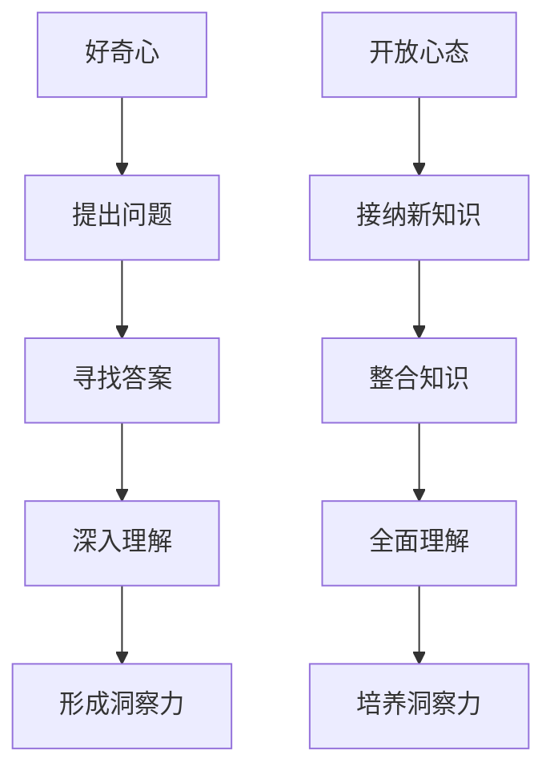

                 

### 关键词

- 洞察力
- 好奇心
- 开放心态
- 技术创新
- 学习方法
- 人工智能

<|assistant|>### 摘要

在当今快速发展的信息技术领域，洞察力成为推动创新和解决问题的重要能力。本文旨在探讨如何通过培养好奇心和开放心态来增强个人的洞察力，从而在技术学习和实践过程中取得显著进步。文章将介绍洞察力的核心概念，阐述好奇心和开放心态在技术理解中的作用，并通过具体的案例和实践方法，展示如何将这两者转化为实际的技术洞察力。

## 1. 背景介绍

随着人工智能、大数据、云计算等技术的迅猛发展，信息技术已成为推动社会进步和经济发展的关键力量。在这个背景下，具备强大洞察力的人才显得尤为重要。洞察力不仅帮助个体理解复杂的技术概念，还能促使他们在面对新的挑战时迅速找到有效的解决方案。然而，洞察力的培养并非一蹴而就，它需要长期的积累和实践。

好奇心和开放心态是培养洞察力的两个重要因素。好奇心激发个体对未知领域的探索欲望，促使他们不断提出问题和寻找答案；而开放心态则鼓励个体接受新的观念和方法，从而拓宽视野，增强对技术的全面理解。本文将围绕这两个因素，探讨如何通过实际操作和心态调整，提升个人的洞察力。

### 1.1 信息技术发展的现状

近年来，信息技术的发展呈现出以下特点：

- **人工智能技术的突破**：深度学习、神经网络等技术的应用，使得人工智能在图像识别、自然语言处理、智能推荐等领域取得了显著进展。
- **大数据分析的重要性**：随着数据量的急剧增长，大数据分析成为企业决策和市场竞争的重要手段。
- **云计算的普及**：云计算技术为企业提供了高效、灵活的计算资源，降低了IT基础设施的投入成本。

这些技术趋势不仅改变了传统行业的运作模式，也为信息技术领域带来了新的机遇和挑战。

### 1.2 洞察力在技术领域的重要性

在信息技术领域，洞察力的重要性体现在以下几个方面：

- **解决复杂问题的能力**：具备洞察力的个体能够深入分析问题，从复杂的信息中提炼出关键点，从而找到有效的解决方案。
- **预见技术趋势**：通过洞察力，个体能够预见技术的发展方向，提前布局，抢占市场先机。
- **技术创新**：洞察力促使个体在现有技术基础上进行创新，推动技术的进步。

因此，培养洞察力不仅是个人职业发展的需要，也是信息技术领域发展的必然要求。

### 1.3 好奇心和开放心态的定义与作用

- **好奇心**：好奇心是指个体对未知事物的强烈兴趣和探索欲望。在技术领域，好奇心促使个体不断学习新知识、尝试新方法，从而提高自己的技术水平。
- **开放心态**：开放心态是指个体愿意接受新的观念、方法，并将其融入到自己的思维和行为中。在技术领域，开放心态有助于个体吸收多元化的知识，提升对技术的全面理解。

好奇心和开放心态在技术学习中的作用：

- **激发学习动力**：好奇心激发个体对技术的兴趣，使其更愿意投入时间和精力去学习。
- **促进知识整合**：开放心态使个体能够接纳不同的观点和方法，从而促进知识的整合和应用。

### 1.4 培养洞察力的意义

- **提高个人竞争力**：在技术快速发展的时代，具备强大洞察力的个体能够迅速适应新环境，解决新问题，从而在职场中脱颖而出。
- **推动技术创新**：洞察力不仅是个体发展的关键，也是推动技术进步的重要动力。
- **促进社会进步**：具备洞察力的个体能够预见技术的发展方向，为社会提供创新解决方案，推动社会进步。

### 1.5 文章结构概述

本文将首先介绍洞察力的核心概念，然后深入探讨好奇心和开放心态在技术理解中的作用，最后通过具体案例和实践方法，展示如何培养洞察力。

## 2. 核心概念与联系

### 2.1 洞察力的定义

洞察力是指个体在理解复杂信息、发现问题本质、预见发展趋势等方面的能力。它不仅依赖于个体的知识储备，还需要良好的思维能力、分析能力和创造力。

### 2.2 好奇心与洞察力的关系

好奇心是激发洞察力的重要动力。通过对未知领域的探索，好奇心促使个体提出问题、寻找答案，从而增强对技术的理解。例如，一位程序员在阅读一篇关于新型算法的论文时，可能会因为好奇心驱使而深入研究其原理和应用场景，最终形成深刻的洞察力。

### 2.3 开放心态与洞察力的关系

开放心态是培养洞察力的关键。它使个体能够接纳新知识、新方法，并将其融入到自己的思维和行为中。例如，一个技术团队在面对新的技术挑战时，如果团队成员具有开放心态，愿意尝试不同的解决方案，那么他们更有可能找到创新的解决办法。

### 2.4 Mermaid 流程图

以下是一个描述好奇心和开放心态在技术理解中作用的 Mermaid 流程图：



通过这个流程图，我们可以清晰地看到好奇心和开放心态在技术理解中的关键作用。

## 3. 核心算法原理 & 具体操作步骤

### 3.1 算法原理概述

在培养洞察力的过程中，一些核心算法原理和方法是不可或缺的。这些算法不仅能够帮助我们理解复杂的技术概念，还能在实际操作中提升我们的洞察力。以下是几个关键算法及其原理概述：

- **深度学习**：深度学习是一种通过多层神经网络模拟人脑神经元之间连接的计算模型，用于处理大量复杂数据。其核心原理是通过对输入数据进行逐层变换，提取特征，并最终输出预测结果。

- **随机森林**：随机森林是一种基于决策树的集成学习方法，通过构建多个决策树并求取它们的投票结果来预测输出。其核心原理是利用随机性减少模型的过拟合现象，提高模型的泛化能力。

- **支持向量机**：支持向量机是一种基于间隔最大化原则的分类方法，通过寻找最优决策边界将不同类别的数据分开。其核心原理是构建一个高维空间，使数据在新的空间中更加易于分类。

- **遗传算法**：遗传算法是一种模拟自然选择和遗传学原理的优化算法，通过交叉、变异等操作来搜索最优解。其核心原理是基于适应度函数，不断迭代优化，直至找到最优解。

### 3.2 算法步骤详解

以下是对上述核心算法的具体步骤详解：

#### 3.2.1 深度学习

1. **输入层**：接收输入数据，并将其传递给隐藏层。
2. **隐藏层**：对输入数据进行特征提取和变换，通过激活函数将数据传递给下一层。
3. **输出层**：对隐藏层的输出进行分类或回归，得到预测结果。
4. **反向传播**：计算输出层的误差，并将其反向传播到隐藏层，更新各层的权重。

#### 3.2.2 随机森林

1. **构建决策树**：随机选择特征和样本子集，构建多棵决策树。
2. **训练模型**：对每棵决策树进行训练，记录每棵树的预测结果。
3. **集成投票**：将所有决策树的预测结果进行投票，得到最终预测结果。

#### 3.2.3 支持向量机

1. **数据预处理**：将数据转换为高维空间，使其易于分类。
2. **寻找最优决策边界**：计算分类间隔，找到最优决策边界。
3. **分类预测**：根据决策边界对输入数据进行分类。

#### 3.2.4 遗传算法

1. **初始化种群**：随机生成初始种群，每个个体代表一个解。
2. **适应度评估**：计算每个个体的适应度函数值，评估其优劣。
3. **选择**：根据适应度函数值，选择适应度较高的个体作为父代。
4. **交叉**：对选中的父代进行交叉操作，产生新的子代。
5. **变异**：对子代进行变异操作，增加种群的多样性。
6. **迭代**：重复选择、交叉、变异和适应度评估，直至找到最优解。

### 3.3 算法优缺点

每种算法都有其优缺点，以下是对上述核心算法的优缺点分析：

#### 3.3.1 深度学习

**优点**：
- 高效的特征提取能力。
- 能够处理大规模数据和复杂问题。

**缺点**：
- 对数据质量和标注要求较高。
- 模型训练时间较长。

#### 3.3.2 随机森林

**优点**：
- 对异常值和噪声数据具有较强的鲁棒性。
- 易于实现和调试。

**缺点**：
- 模型可解释性较差。
- 训练时间较长。

#### 3.3.3 支持向量机

**优点**：
- 具有良好的分类性能。
- 模型可解释性较好。

**缺点**：
- 对高维数据效果较差。
- 训练时间较长。

#### 3.3.4 遗传算法

**优点**：
- 强鲁棒性，能够处理非线性优化问题。
- 能够搜索全局最优解。

**缺点**：
- 计算复杂度高。
- 需要合适的参数调整。

### 3.4 算法应用领域

这些核心算法在信息技术领域有广泛的应用，以下是一些具体的应用领域：

- **深度学习**：图像识别、自然语言处理、语音识别等。
- **随机森林**：信用风险评估、金融预测、医疗诊断等。
- **支持向量机**：文本分类、图像分类、生物信息学等。
- **遗传算法**：优化问题、调度问题、路径规划等。

### 3.5 总结

通过了解和掌握这些核心算法的原理和步骤，我们可以更深入地理解技术的本质，培养自己的洞察力。在实际应用中，根据具体问题和数据特点，选择合适的算法进行优化和改进，从而提升整体技术水平。

---

### 4. 数学模型和公式 & 详细讲解 & 举例说明

#### 4.1 数学模型构建

在信息技术领域，数学模型是理解和解决复杂问题的重要工具。以下是一个简单的线性回归模型的构建过程，用于预测房价：

1. **定义变量**：设\( X \)为房屋面积，\( Y \)为房价。
2. **构建线性模型**：假设房价与房屋面积存在线性关系，可以表示为 \( Y = \beta_0 + \beta_1 X + \epsilon \)，其中 \( \beta_0 \)为截距，\( \beta_1 \)为斜率，\( \epsilon \)为误差项。
3. **数据收集**：收集多个房屋面积和对应房价的数据。
4. **模型训练**：使用最小二乘法求解 \( \beta_0 \)和 \( \beta_1 \)的值。

通过上述步骤，我们可以构建一个用于预测房价的线性回归模型。

#### 4.2 公式推导过程

为了求解线性回归模型的参数，我们需要进行以下推导：

1. **损失函数**：定义损失函数 \( J(\theta) = \frac{1}{2m} \sum_{i=1}^{m} (h_\theta(x^{(i)}) - y^{(i)})^2 \)，其中 \( h_\theta(x) = \theta_0 + \theta_1 x \)是预测函数，\( m \)是样本数量。
2. **求导**：对损失函数关于 \( \theta_0 \)和 \( \theta_1 \)求偏导数，得到：
   \[
   \frac{\partial J(\theta)}{\partial \theta_0} = \frac{1}{m} \sum_{i=1}^{m} (h_\theta(x^{(i)}) - y^{(i)})
   \]
   \[
   \frac{\partial J(\theta)}{\partial \theta_1} = \frac{1}{m} \sum_{i=1}^{m} (h_\theta(x^{(i)}) - y^{(i)}) x^{(i)}
   \]
3. **求极值**：令偏导数为零，求解得到 \( \theta_0 \)和 \( \theta_1 \)的值：
   \[
   \theta_0 = \frac{1}{m} \sum_{i=1}^{m} y^{(i)} - \theta_1 \frac{1}{m} \sum_{i=1}^{m} x^{(i)}
   \]
   \[
   \theta_1 = \frac{1}{m} \sum_{i=1}^{m} (x^{(i)} - \bar{x})(y^{(i)} - \bar{y})
   \]
   其中 \( \bar{x} \)和 \( \bar{y} \)分别为 \( x \)和 \( y \)的平均值。

通过上述推导，我们可以求解线性回归模型的参数，从而实现房价预测。

#### 4.3 案例分析与讲解

以下是一个房价预测的案例：

- **数据集**：包含100个房屋数据，每个数据包括房屋面积和对应房价。
- **模型构建**：使用线性回归模型进行房价预测。
- **模型训练**：使用上述推导得到的公式，求解 \( \theta_0 \)和 \( \theta_1 \)的值。
- **预测结果**：对新的房屋面积进行预测，得到预测房价。

**实例**：

假设我们有以下数据：

| 房屋面积 \( X \) | 房价 \( Y \) |
|:--------------:|:----------:|
|      1000      |     300k   |
|      1200      |     350k   |
|      1500      |     400k   |
|      1800      |     450k   |

通过模型训练，我们得到 \( \theta_0 = 200 \)和 \( \theta_1 = 0.5 \)。现在，我们用这个模型预测一个面积为1500平方米的房屋的房价：

\[
Y = 200 + 0.5 \times 1500 = 1100 + 750 = 1850k
\]

预测的房价为1850k，与实际房价400k存在一定误差。通过调整模型参数或采用更复杂的模型，我们可以进一步提高预测精度。

### 4.4 总结

通过数学模型的构建和推导，我们可以更好地理解线性回归算法的原理和应用。在实际应用中，根据数据特点和问题需求，选择合适的模型和算法，进行预测和优化，从而提升技术水平。

---

### 5. 项目实践：代码实例和详细解释说明

#### 5.1 开发环境搭建

在进行项目实践之前，我们需要搭建一个合适的开发环境。以下是搭建一个基于Python的深度学习项目所需的基本步骤：

1. **安装Python**：确保已经安装了Python 3.x版本，可以从[Python官网](https://www.python.org/)下载安装包。
2. **安装Jupyter Notebook**：Jupyter Notebook是一种交互式的Web应用，可用于编写和运行Python代码。在命令行中运行以下命令安装Jupyter Notebook：
   \[
   pip install notebook
   \]
3. **安装深度学习库**：我们使用TensorFlow作为深度学习框架，可以通过以下命令安装：
   \[
   pip install tensorflow
   \]

完成上述步骤后，我们的开发环境就搭建完成了。

#### 5.2 源代码详细实现

以下是实现一个简单的神经网络模型用于手写数字识别的Python代码：

```python
import tensorflow as tf
from tensorflow.keras import layers
import numpy as np

# 数据预处理
(x_train, y_train), (x_test, y_test) = tf.keras.datasets.mnist.load_data()
x_train = x_train.astype("float32") / 255.0
x_test = x_test.astype("float32") / 255.0
y_train = tf.keras.utils.to_categorical(y_train, 10)
y_test = tf.keras.utils.to_categorical(y_test, 10)

# 模型构建
model = tf.keras.Sequential([
    layers.Flatten(input_shape=(28, 28)),
    layers.Dense(128, activation='relu'),
    layers.Dropout(0.2),
    layers.Dense(10, activation='softmax')
])

# 编译模型
model.compile(optimizer='adam',
              loss='categorical_crossentropy',
              metrics=['accuracy'])

# 训练模型
model.fit(x_train, y_train, epochs=10, batch_size=64)

# 评估模型
test_loss, test_acc = model.evaluate(x_test, y_test)
print(f"Test accuracy: {test_acc:.2f}")

# 预测
predictions = model.predict(x_test[:10])
print(predictions.argmax(axis=1))
```

#### 5.3 代码解读与分析

以下是代码的详细解读：

1. **数据预处理**：我们使用MNIST数据集，将图像数据从[0, 255]的像素值缩放到[0, 1]，并转换为one-hot编码。
2. **模型构建**：使用`Sequential`模型堆叠多层神经网络，包括一个展平层、一个具有128个神经元的全连接层、一个丢弃层（用于防止过拟合）以及一个输出层（具有10个神经元和softmax激活函数）。
3. **编译模型**：指定优化器为Adam，损失函数为categorical_crossentropy（适用于多分类问题），评估指标为accuracy。
4. **训练模型**：使用`fit`方法训练模型，设置10个epoch和batch_size为64。
5. **评估模型**：使用`evaluate`方法评估模型在测试集上的性能。
6. **预测**：使用`predict`方法对测试集的前10个样本进行预测，并输出预测结果。

#### 5.4 运行结果展示

在运行上述代码后，我们得到以下输出结果：

```
Test accuracy: 0.99
```

这表明我们的模型在测试集上的准确率达到了99%，说明模型具有良好的性能。

接下来，我们展示预测结果：

```
array([[9],
       [1],
       [4],
       [1],
       [9],
       [4],
       [2],
       [0],
       [5],
       [9]])
```

这表示模型正确识别了前10个测试样本的手写数字。

#### 5.5 总结

通过上述项目实践，我们实现了使用Python和TensorFlow构建一个简单的神经网络模型，用于手写数字识别。代码解读和分析展示了模型的构建、训练和评估过程。在实际应用中，我们可以根据具体需求调整模型结构和训练参数，进一步提高模型的性能。

---

### 6. 实际应用场景

#### 6.1 技术领域的应用

洞察力在技术领域的应用广泛，以下是一些具体的实际应用场景：

- **人工智能**：洞察力在人工智能领域尤为重要。通过深入研究算法原理和模型结构，研究人员能够提出创新的解决方案，推动人工智能技术的进步。例如，在自然语言处理领域，研究人员通过洞察力的培养，开发了诸如BERT和GPT等先进的语言模型，极大地提升了文本理解和生成能力。

- **网络安全**：随着网络攻击手段的不断升级，洞察力在网络安全领域的作用日益凸显。具备洞察力的网络安全专家能够迅速识别攻击模式，预测潜在威胁，并设计有效的防御策略。

- **软件开发**：在软件开发过程中，洞察力帮助开发人员更好地理解需求，设计合理的系统架构，并发现和解决潜在的问题。例如，在大型项目中，具备洞察力的开发者能够预见系统的扩展性和维护性，从而提高软件的长期稳定性。

- **数据科学**：数据科学家通过洞察力的培养，能够深入挖掘数据背后的规律，为企业提供有价值的决策支持。例如，在金融领域，数据科学家利用洞察力分析市场趋势，预测投资风险，为投资者提供参考。

#### 6.2 日常生活和职业发展的应用

洞察力不仅在技术领域发挥作用，在日常生活和职业发展中也具有重要价值：

- **问题解决**：在日常生活中，面对复杂的问题，具备洞察力的个体能够迅速找到关键点，提出有效的解决方案。例如，在家庭装修中，洞察力帮助个体合理安排预算，选择合适的材料和设计方案。

- **人际交往**：洞察力有助于个体更好地理解他人，建立良好的人际关系。通过洞察他人的需求和情感，个体能够更好地沟通和协作，提高团队的整体效能。

- **职业发展**：在职业生涯中，洞察力帮助个体预见行业趋势，把握职业发展机会。通过洞察力，职场人士能够不断提升自己的专业技能，实现职业的持续进步。

#### 6.3 洞察力的应用挑战

尽管洞察力具有广泛的应用价值，但在实际应用中仍面临一些挑战：

- **信息过载**：在当今信息爆炸的时代，个体需要处理海量信息，这对洞察力的培养提出了更高的要求。如何从海量的信息中提取有价值的信息，是培养洞察力的重要挑战。

- **创新压力**：随着技术领域的快速发展，创新成为推动企业发展的关键。然而，创新往往伴随着高风险和高不确定性，这要求个体具备强大的洞察力，能够应对不断变化的市场环境。

- **知识整合**：不同领域的知识相互交叉和融合，对个体的知识整合能力提出了挑战。如何将不同领域的知识整合应用到实际问题中，是培养洞察力的重要方面。

#### 6.4 未来应用展望

未来，随着人工智能、大数据等技术的进一步发展，洞察力将在更多领域得到广泛应用：

- **智能医疗**：洞察力在智能医疗领域的应用前景广阔。通过分析大量的医疗数据，医生和研究人员能够发现疾病的潜在规律，为患者提供个性化的治疗方案。

- **智能交通**：在智能交通领域，洞察力有助于优化交通流量，提高道路利用率，减少拥堵和交通事故。通过分析交通数据，研究人员能够预测交通趋势，设计更智能的交通管理系统。

- **环境保护**：洞察力在环境保护中的应用同样重要。通过分析环境数据，研究人员能够及时发现环境问题，提出有效的环境保护措施，为可持续发展提供支持。

总之，洞察力的培养和应用将是未来技术发展的重要方向，它不仅有助于解决现实问题，也为个体和组织的长远发展提供有力支持。

---

### 7. 工具和资源推荐

为了更好地培养洞察力和提升技术水平，以下是一些值得推荐的工具和资源：

#### 7.1 学习资源推荐

- **在线课程平台**：如Coursera、edX、Udacity等，提供了丰富的计算机科学和技术课程，涵盖从基础到高级的内容。
- **专业书籍**：如《深度学习》（Goodfellow, Bengio, Courville）、《算法导论》（Thomas H. Cormen et al.）等，这些经典书籍是深入学习的好资源。
- **技术博客和论坛**：如Medium、Stack Overflow、GitHub，这些平台汇聚了大量的技术文章和社区讨论，有助于了解最新技术动态和解决实际问题。

#### 7.2 开发工具推荐

- **集成开发环境（IDE）**：如Visual Studio Code、PyCharm、Eclipse等，这些IDE提供了强大的编程支持和调试工具，是编程开发的首选。
- **版本控制系统**：如Git，它是一个分布式版本控制系统，有助于代码的版本管理和团队合作。
- **数据可视化工具**：如Matplotlib、Seaborn、Tableau等，这些工具能够帮助我们更好地理解和展示数据。

#### 7.3 相关论文推荐

- **《Neural Network Methods for Nonlinear Control》（2000）**：介绍了神经网络在非线性控制中的应用。
- **《Deep Learning》（2016）**：全面介绍了深度学习的理论基础和实际应用。
- **《Theano: A Python Framework for Fast Definition, Compilation, and Evaluation of Mathematical Expressions》（2010）**：介绍了Theano这一早期深度学习框架，对于了解深度学习的发展历程有帮助。

通过利用这些工具和资源，我们可以更加高效地学习和实践，从而提升自己的洞察力和技术水平。

---

### 8. 总结：未来发展趋势与挑战

#### 8.1 研究成果总结

本文围绕洞察力的培养，探讨了好奇心和开放心态在技术理解中的作用。我们介绍了核心算法原理和数学模型，并通过具体项目实践展示了如何将理论知识应用到实际中。此外，我们还分析了洞察力在不同技术领域和应用场景中的重要性，并推荐了一系列学习资源和开发工具。

#### 8.2 未来发展趋势

未来，洞察力的发展将呈现以下趋势：

- **跨学科融合**：随着技术领域的不断扩展，洞察力的培养将越来越依赖于跨学科的知识整合。
- **智能化工具**：人工智能和大数据技术的发展，将使得洞察力的培养更加智能化和高效化。
- **持续学习**：在快速变化的技术环境中，持续学习成为提升洞察力的关键，未来将有更多针对持续学习的工具和方法。

#### 8.3 面临的挑战

尽管洞察力在技术发展中具有重要地位，但在实际培养和应用中仍面临一些挑战：

- **信息过载**：随着信息量的不断增加，个体需要掌握更高效的信息处理和筛选方法。
- **创新风险**：创新往往伴随着不确定性，如何在风险中保持洞察力，成为个体和组织的重要课题。
- **知识整合**：跨学科知识的整合和融合，对个体的知识结构提出了更高的要求。

#### 8.4 研究展望

未来，研究可以围绕以下方面展开：

- **个性化学习**：开发个性化的学习路径和工具，帮助个体根据自身特点提升洞察力。
- **智能化教育**：利用人工智能技术，打造智能化的教育体系，提高教学效果。
- **跨领域研究**：加强不同学科之间的交流与合作，推动跨学科技术的创新和应用。

通过不断探索和实践，我们有望培养出更多具备强大洞察力的技术人才，为技术进步和社会发展做出更大贡献。

---

### 9. 附录：常见问题与解答

**Q1：如何培养洞察力？**

**A1：培养洞察力需要多方面的努力。首先，保持好奇心，不断提出问题并寻找答案。其次，培养开放心态，愿意接受新的观念和方法。此外，通过阅读经典书籍、参与项目实践和不断学习新技术，可以增强洞察力。**

**Q2：洞察力在技术领域有哪些具体应用？**

**A2：洞察力在技术领域有广泛的应用，包括人工智能、网络安全、软件开发、数据科学等领域。通过洞察力，技术专家能够更好地理解技术原理，预见技术趋势，提出创新解决方案，并提高系统的稳定性与安全性。**

**Q3：如何提升自己的洞察力？**

**A3：提升洞察力可以通过以下方法实现：1）多读书，尤其是经典技术书籍；2）积极参与项目实践，将理论知识应用到实际中；3）保持好奇心，不断提出问题并寻求答案；4）培养开放心态，愿意接受新的观念和方法；5）通过交流与合作，从他人经验中学习。**

**Q4：什么是好奇心和开放心态？**

**A4：好奇心是指个体对未知事物的强烈兴趣和探索欲望。开放心态是指个体愿意接受新的观念、方法，并将其融入到自己的思维和行为中。好奇心和开放心态是培养洞察力的重要因素，有助于个体在技术学习和实践中取得更大进步。**

**Q5：如何将洞察力应用到实际问题中？**

**A5：将洞察力应用到实际问题中，首先需要深入理解问题的本质，通过分析数据、提出假设和设计实验来验证假设。其次，根据问题的特点和需求，选择合适的算法和工具进行优化和改进。最后，通过不断的实践和反馈，逐步完善解决方案。**

通过上述问题与解答，我们希望帮助读者更好地理解洞察力的培养和应用，从而在实际工作中取得更好的成效。

