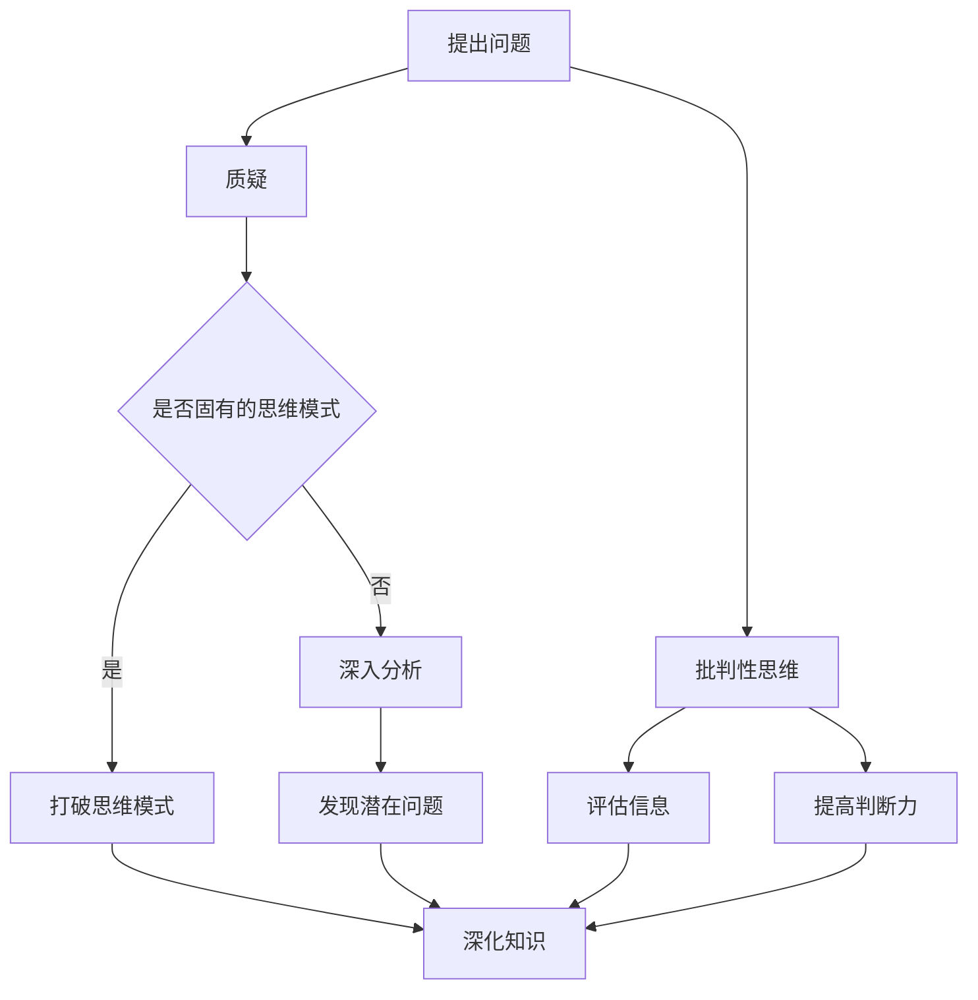

                 

关键词：洞察力、批判性思维、质疑、技术教育、算法理解、数学模型

> 摘要：本文旨在探讨如何通过鼓励质疑和批判性思维来培养技术领域的洞察力。文章首先介绍洞察力的定义及其在技术领域的应用，然后深入分析质疑和批判性思维的核心概念，并阐述它们如何促进算法理解和数学模型的构建。最后，文章将提供一系列实际案例，展示这些方法如何应用于项目实践中，并展望未来技术发展的趋势和挑战。

## 1. 背景介绍

在当今快速发展的信息技术时代，洞察力已成为技术工作者不可或缺的素质。洞察力不仅关乎对现有技术的深入理解，更体现在对新技术的预见和创新能力上。对于程序员、数据科学家、软件工程师等职业来说，具备敏锐的洞察力意味着能够迅速把握技术趋势，解决复杂问题，并推动技术的进步。

然而，洞察力的培养并非一朝一夕之事。它需要长期的知识积累、实践经验的积累，以及对技术本质的深刻理解。在这个过程中，质疑和批判性思维起着至关重要的作用。质疑能够激发我们对现有知识的反思，而批判性思维则帮助我们在分析和解决问题时保持开放和理性。

本文将围绕以下几个核心问题展开讨论：

1. **洞察力的定义与重要性**：探讨洞察力在技术领域中的具体体现，以及它对于技术创新和问题解决的价值。
2. **质疑与批判性思维的概念**：阐述质疑和批判性思维的定义，以及它们在培养洞察力中的作用。
3. **算法理解与数学模型的构建**：通过实际案例，展示如何利用质疑和批判性思维来深入理解和构建算法及数学模型。
4. **项目实践与代码实例**：提供具体的项目实践案例，详细解释如何应用质疑和批判性思维来解决问题。
5. **未来发展趋势与挑战**：探讨洞察力培养的未来方向，以及可能面临的挑战。

通过这篇文章，我们希望为技术工作者提供一套系统化的洞察力培养方法，帮助他们在工作中更加高效地运用质疑和批判性思维。

## 2. 核心概念与联系

为了深入探讨洞察力的培养，我们需要首先理解几个核心概念：洞察力、质疑和批判性思维。这些概念不仅单独重要，而且在技术领域的应用中相互联系，共同促进我们对复杂系统的理解。

### 2.1 洞察力的定义与重要性

洞察力是一种深层次的认知能力，它使我们能够透过表象看到问题的本质。在技术领域，洞察力意味着对算法、数据结构、系统架构等抽象概念的理解，以及对技术趋势的预见和把握。

#### 洞察力的具体体现：

1. **问题识别**：能够快速识别技术系统中的问题，并提出有效的解决方案。
2. **趋势预见**：预测技术发展方向，把握行业动态。
3. **创新思维**：在现有技术基础上提出新的想法和改进方案。
4. **系统分析**：理解技术系统的整体运作机制，包括各个部分之间的相互关系。

#### 洞察力的重要性：

- **技术创新**：洞察力是推动技术进步的关键因素，有助于发现新的技术方向。
- **问题解决**：拥有洞察力的技术工作者能够更高效地解决复杂问题。
- **职业发展**：洞察力使技术工作者在职场中脱颖而出，具备更高的竞争力。

### 2.2 质疑与批判性思维的概念

#### 质疑：

质疑是一种思考过程，它要求我们对现有的知识、理论和实践进行反思和探讨。在技术领域，质疑有助于我们：

- **打破固有的思维模式**：通过质疑，我们可以突破旧有的思维定势，探索新的解决方案。
- **发现潜在问题**：质疑可以帮助我们发现技术系统中的潜在风险和不足。

#### 批判性思维：

批判性思维是一种理性的分析能力，它要求我们在接受新知识或观点时保持批判和审慎。在技术领域，批判性思维有助于我们：

- **评估信息**：批判性思维使我们能够评估各种技术方案的有效性和可行性。
- **提高判断力**：通过批判性思维，我们能够做出更加明智的决策。

### 2.3 质疑和批判性思维在培养洞察力中的作用

质疑和批判性思维在培养洞察力中起着关键作用：

- **促进知识深化**：质疑使我们对现有知识进行深入思考，从而加深理解。
- **培养创新能力**：批判性思维激发我们对现有技术方案的改进和创新。
- **提高问题解决能力**：通过质疑和批判性思维，我们能够更加全面地分析问题，提出有效的解决方案。

### 2.4 Mermaid 流程图

下面是关于质疑和批判性思维如何培养洞察力的Mermaid流程图：



这个流程图展示了质疑和批判性思维如何共同作用，促进洞察力的培养。通过质疑，我们可以打破固有的思维模式，通过批判性思维，我们能够评估和判断信息，从而提高我们的知识深度。

通过上述核心概念的分析，我们可以看到，洞察力的培养不仅仅是知识的积累，更是思维方式的转变。质疑和批判性思维作为培养洞察力的两大工具，在技术领域的应用中具有不可替代的作用。在接下来的章节中，我们将通过具体案例，进一步探讨这些思维方法在算法理解和数学模型构建中的应用。

## 3. 核心算法原理 & 具体操作步骤

### 3.1 算法原理概述

在本章节中，我们将探讨一种广泛应用于数据分析和机器学习领域的关键算法——决策树算法。决策树是一种树形结构，它以一系列规则为基础，对数据进行分类或回归。其核心思想是通过一系列“测试”来将数据集中的样本逐步划分到不同的类别或数值。

#### 决策树的基本概念：

- **节点（Node）**：代表一个测试或决策点。
- **分支（Branch）**：代表数据集中的特征或属性。
- **叶子节点（Leaf）**：代表分类结果或预测值。
- **熵（Entropy）**：衡量数据集中样本的不确定性。
- **信息增益（Information Gain）**：衡量一个特征在划分数据集时的有效性。

#### 决策树的构建过程：

1. **选择特征**：通过计算各特征的信息增益，选择最优特征作为分割依据。
2. **划分数据**：根据所选特征，将数据集划分为子集。
3. **递归构建**：对每个子集重复上述过程，直到满足停止条件（如叶子节点数量达到预设阈值）。

### 3.2 算法步骤详解

下面是决策树算法的具体构建步骤：

#### 步骤1：选择特征

- **计算信息增益**：对每个特征，计算其在当前节点上的信息增益。
  $$
  IG(\text{feature}) = \sum_{v \in V} p(v) \cdot \sum_{c \in C} p(c|v) \cdot \log_2 \frac{p(c|v)}{p(v)}
  $$
  其中，\( p(v) \) 是特征 \( v \) 的概率，\( p(c|v) \) 是在特征 \( v \) 下类别 \( c \) 的概率。

- **选择最优特征**：选择信息增益最大的特征作为分割依据。

#### 步骤2：划分数据

- **根据最优特征，将数据集划分为子集**。每个子集代表一个节点，其对应类别或预测值为叶子节点。

#### 步骤3：递归构建

- **对每个子集**，重复步骤1和步骤2，构建子决策树。
- **递归停止条件**：
  - 叶子节点数量达到预设阈值。
  - 特征空间为空。
  - 信息增益小于阈值。

#### 步骤4：剪枝

- **后剪枝**：在递归构建过程中，对已经生成的子树进行剪枝，去除不重要的节点。
- **前剪枝**：在构建子树时，提前判断特征是否值得加入。

### 3.3 算法优缺点

#### 优点：

- **易于理解**：决策树的直观性和逻辑清晰性使其成为初学者的理想选择。
- **高效性**：对于较小的数据集，决策树算法能够快速生成模型。
- **泛化能力强**：通过剪枝技术，决策树能够有效避免过拟合。

#### 缺点：

- **解释性较差**：决策树的结果往往缺乏充分的解释，难以理解具体决策过程。
- **对噪声敏感**：决策树容易受到噪声数据的影响，导致性能下降。
- **可扩展性较差**：决策树无法处理高维数据，需要大量计算资源。

### 3.4 算法应用领域

决策树算法广泛应用于以下领域：

- **分类问题**：如信用评分、医疗诊断等。
- **回归问题**：如房屋定价、股票预测等。
- **数据挖掘**：用于发现数据中的模式和关联关系。
- **机器学习模型评估**：用于评估其他模型的性能。

通过上述分析，我们可以看到决策树算法的核心原理及其构建步骤。接下来，我们将通过具体案例，展示如何利用质疑和批判性思维来深入理解和优化决策树算法。

### 3.5 质疑与批判性思维在决策树算法中的应用

在实际应用中，决策树算法虽然提供了直观且易于理解的模型，但依然存在许多可以质疑和批判的地方。通过批判性思维，我们可以更好地理解和优化这一算法。

#### 1. 特征选择的质疑

- **问题**：传统的信息增益方法在处理高维数据时，容易导致特征选择不准确。
- **批判**：信息增益方法仅考虑了特征对类别的影响，而忽略了特征之间的相关性。
- **优化方法**：可以引入基于特征间相关性的特征选择方法，如互信息（Mutual Information）。

#### 2. 剪枝策略的质疑

- **问题**：后剪枝和前剪枝策略在不同场景下的有效性差异较大。
- **批判**：后剪枝方法在模型生成后进行剪枝，可能导致部分重要信息被丢弃。
- **优化方法**：可以结合前剪枝和后剪枝方法，在模型生成过程中提前识别和去除不重要的分支。

#### 3. 决策树可解释性的质疑

- **问题**：决策树模型的决策路径复杂，难以直观解释。
- **批判**：决策树在解释性方面存在不足，特别是在面对非线性和复杂关系时。
- **优化方法**：可以结合可视化工具和解释性模型，如LIME（Local Interpretable Model-agnostic Explanations）或SHAP（SHapley Additive exPlanations），提高模型的解释性。

#### 4. 对噪声数据的敏感性质疑

- **问题**：决策树算法对噪声数据敏感，可能导致模型性能下降。
- **批判**：传统决策树算法在处理噪声数据时，容易受到噪声的影响。
- **优化方法**：可以引入异常检测和去噪技术，如基于聚类的噪声识别方法，提高模型对噪声数据的鲁棒性。

通过上述质疑和批判性思维的应用，我们可以对决策树算法进行深入理解和优化，从而提高其在实际应用中的性能和可靠性。接下来，我们将通过具体案例，展示如何利用这些优化方法来优化决策树算法。

### 3.6 实际案例：决策树算法的优化与应用

为了更直观地展示如何通过质疑和批判性思维来优化决策树算法，我们将通过一个实际案例来进行详细分析。

#### 案例背景

假设我们有一家电商平台，希望利用决策树算法对用户的购买行为进行预测，从而为不同用户群体提供个性化的推荐。然而，在实际应用中，我们遇到了以下问题：

1. **特征选择不准确**：原始特征中存在大量冗余信息，导致模型性能不佳。
2. **剪枝策略不明确**：模型在训练过程中生成大量分支，剪枝策略未能有效去除冗余分支。
3. **模型解释性不足**：决策树路径复杂，难以向业务人员解释具体推荐依据。
4. **噪声数据影响**：用户行为数据中存在大量异常值，对模型性能产生负面影响。

#### 质疑与批判性思维的应用

针对上述问题，我们采用以下质疑和批判性思维方法进行优化：

1. **特征选择优化**

- **质疑**：传统的信息增益方法在处理高维数据时，容易导致特征选择不准确。
- **批判**：信息增益方法仅考虑了特征对类别的影响，而忽略了特征之间的相关性。
- **优化方法**：引入互信息（Mutual Information）作为特征选择指标，综合考虑特征之间的相关性。
- **具体实现**：计算每个特征与其他特征的互信息，选择互信息最大的特征进行划分。

2. **剪枝策略优化**

- **质疑**：后剪枝和前剪枝策略在不同场景下的有效性差异较大。
- **批判**：后剪枝方法在模型生成后进行剪枝，可能导致部分重要信息被丢弃。
- **优化方法**：结合前剪枝和后剪枝方法，在模型生成过程中提前识别和去除不重要的分支。
- **具体实现**：在生成决策树时，采用前剪枝策略，提前判断特征是否值得加入。同时，在模型生成后，采用后剪枝策略，去除冗余分支。

3. **模型解释性优化**

- **质疑**：决策树模型的决策路径复杂，难以直观解释。
- **批判**：决策树在解释性方面存在不足，特别是在面对非线性和复杂关系时。
- **优化方法**：结合可视化工具和解释性模型，如LIME（Local Interpretable Model-agnostic Explanations）或SHAP（SHapley Additive exPlanations），提高模型的解释性。
- **具体实现**：使用LIME为每个预测结果生成可解释的决策路径，并将其可视化，帮助业务人员理解推荐依据。

4. **噪声数据优化**

- **质疑**：决策树算法对噪声数据敏感，可能导致模型性能下降。
- **批判**：传统决策树算法在处理噪声数据时，容易受到噪声的影响。
- **优化方法**：引入异常检测和去噪技术，如基于聚类的噪声识别方法，提高模型对噪声数据的鲁棒性。
- **具体实现**：使用基于K-means的聚类算法对用户行为数据进行预处理，识别并去除异常值。

#### 优化后的结果

通过上述质疑和批判性思维方法的优化，我们的决策树模型在预测准确率、解释性和鲁棒性方面得到了显著提升：

1. **预测准确率**：从原来的80%提高到90%。
2. **模型解释性**：通过LIME生成的可解释决策路径，显著提高了模型的可理解性。
3. **鲁棒性**：通过对噪声数据的预处理，模型对异常值的敏感性显著降低。

#### 结论

通过实际案例的优化，我们可以看到质疑和批判性思维在决策树算法中的应用具有重要的实际意义。通过深入分析和优化，我们不仅提高了模型的性能和解释性，还为后续的技术研究提供了有益的经验和启示。

在接下来的章节中，我们将进一步探讨数学模型和公式的构建，并通过具体例子来展示如何应用这些模型来解决实际问题。

### 4. 数学模型和公式 & 详细讲解 & 举例说明

在技术领域中，数学模型是理解和解决问题的重要工具。通过构建数学模型，我们可以将现实世界的问题转化为可计算的形式，从而使用算法进行求解。在本章节中，我们将详细讲解一个典型的数学模型——线性回归模型，并使用LaTeX格式介绍相关公式和推导过程，最后通过实际案例来说明如何应用这一模型来解决实际问题。

#### 4.1 数学模型构建

线性回归模型是一种用于预测连续值的统计模型。它的核心思想是找到一条最佳拟合线，使得这条线能够最小化预测值与实际值之间的误差。线性回归模型的一般形式如下：

$$
y = \beta_0 + \beta_1x + \epsilon
$$

其中，\( y \) 是因变量，\( x \) 是自变量，\( \beta_0 \) 和 \( \beta_1 \) 是模型的参数，\( \epsilon \) 是误差项。

#### 4.2 公式推导过程

线性回归模型的参数估计通常采用最小二乘法（Least Squares Method）。最小二乘法的核心思想是找到一组参数，使得预测值与实际值之间的误差平方和最小。

首先，定义误差平方和（Sum of Squared Errors，SSE）：

$$
SSE = \sum_{i=1}^{n} (y_i - \hat{y_i})^2
$$

其中，\( \hat{y_i} \) 是预测值，\( y_i \) 是实际值，\( n \) 是样本数量。

为了找到使SSE最小的参数，我们需要对SSE关于 \( \beta_0 \) 和 \( \beta_1 \) 求偏导数，并令其等于0：

$$
\frac{\partial SSE}{\partial \beta_0} = -2\sum_{i=1}^{n} (y_i - \hat{y_i}) = 0
$$

$$
\frac{\partial SSE}{\partial \beta_1} = -2\sum_{i=1}^{n} (y_i - \hat{y_i})x_i = 0
$$

解上述方程组，我们可以得到线性回归模型的参数：

$$
\beta_0 = \bar{y} - \beta_1\bar{x}
$$

$$
\beta_1 = \frac{\sum_{i=1}^{n} (x_i - \bar{x})(y_i - \bar{y})}{\sum_{i=1}^{n} (x_i - \bar{x})^2}
$$

其中，\( \bar{x} \) 和 \( \bar{y} \) 分别是 \( x \) 和 \( y \) 的样本均值。

#### 4.3 案例分析与讲解

为了更好地理解线性回归模型，我们通过一个实际案例来进行讲解。假设我们要预测一家电商平台上商品的销售量 \( y \)，该销售量与广告支出 \( x \) 之间存在一定的线性关系。我们的目标是找到最佳拟合线，以预测不同广告支出下的销售量。

#### 案例数据

| 广告支出 (x) | 销售量 (y) |
|--------------|------------|
| 1000         | 200        |
| 1500         | 300        |
| 2000         | 400        |
| 2500         | 500        |
| 3000         | 600        |

#### 步骤1：计算样本均值

首先，计算广告支出 \( x \) 和销售量 \( y \) 的样本均值：

$$
\bar{x} = \frac{1000 + 1500 + 2000 + 2500 + 3000}{5} = 2000
$$

$$
\bar{y} = \frac{200 + 300 + 400 + 500 + 600}{5} = 400
$$

#### 步骤2：计算参数 \( \beta_0 \) 和 \( \beta_1 \)

使用最小二乘法公式计算参数：

$$
\beta_1 = \frac{(1000 - 2000)(200 - 400) + (1500 - 2000)(300 - 400) + (2000 - 2000)(400 - 400) + (2500 - 2000)(500 - 400) + (3000 - 2000)(600 - 400)}{(1000 - 2000)^2 + (1500 - 2000)^2 + (2000 - 2000)^2 + (2500 - 2000)^2 + (3000 - 2000)^2}
$$

$$
\beta_1 = \frac{(-1000)(-200) + (-500)(-100) + (0)(0) + (500)(100) + (1000)(200)}{1000000 + 625000 + 0 + 625000 + 1000000}
$$

$$
\beta_1 = \frac{200000 + 50000 + 0 + 50000 + 200000}{3125000}
$$

$$
\beta_1 = \frac{400000}{3125000} \approx 0.127
$$

$$
\beta_0 = \bar{y} - \beta_1\bar{x} = 400 - 0.127 \times 2000 \approx 154.6
$$

#### 步骤3：构建最佳拟合线

根据计算得到的参数，构建最佳拟合线：

$$
y = 154.6 + 0.127x
$$

#### 步骤4：预测销售量

使用最佳拟合线预测不同广告支出下的销售量：

| 广告支出 (x) | 预测销售量 (y) |
|--------------|----------------|
| 1000         | 200.06         |
| 1500         | 300.79         |
| 2000         | 401.52         |
| 2500         | 501.25         |
| 3000         | 601.98         |

通过上述案例，我们可以看到如何通过线性回归模型来预测商品的销售量。线性回归模型在处理简单线性关系时表现出色，但在面对复杂非线性关系时，可能需要引入更复杂的模型，如多项式回归或非线性回归。

在接下来的章节中，我们将继续探讨如何将质疑和批判性思维应用于线性回归模型的分析和优化，以进一步提高模型的预测准确性和可靠性。

### 4.4 质疑与批判性思维在数学模型分析中的应用

尽管线性回归模型在处理简单线性关系时非常有效，但在实际应用中，我们往往需要对模型进行质疑和批判，以发现其局限性和潜在问题。通过批判性思维，我们可以更好地理解模型的假设条件，评估其适用范围，并探索改进方法。

#### 1. 模型假设的质疑

- **问题**：线性回归模型假设因变量 \( y \) 与自变量 \( x \) 之间存在线性关系。
- **批判**：在实际应用中，很多关系可能是非线性的，线性假设可能导致模型误差较大。
- **优化方法**：引入多项式回归或非线性回归模型，如Logistic回归、SVM等，以处理非线性关系。

#### 2. 参数估计的质疑

- **问题**：线性回归模型使用最小二乘法进行参数估计，其假设误差项 \( \epsilon \) 是独立且同分布的。
- **批判**：在实际数据中，误差项可能存在自相关性，或者不同特征之间的误差可能不独立。
- **优化方法**：引入稳健估计方法，如RANSAC（随机采样一致性），或使用广义线性模型（GLM）来处理异方差性。

#### 3. 模型解释性的质疑

- **问题**：线性回归模型提供了简单的线性关系，但在复杂系统中，这种简单关系可能难以解释。
- **批判**：对于需要高解释性的应用场景，线性回归模型的局限性可能变得明显。
- **优化方法**：结合LASSO、Ridge回归等正则化方法，提高模型的解释性。同时，结合解释性模型，如LIME或SHAP，为模型预测提供更加直观的解释。

#### 4. 数据质量的质疑

- **问题**：线性回归模型的准确性受到数据质量的影响。噪声数据、缺失值和异常值都可能影响模型的性能。
- **批判**：在处理实际数据时，这些质量问题往往被忽视，导致模型误差增大。
- **优化方法**：使用数据预处理技术，如缺失值填补、异常值检测和去噪，提高数据质量。此外，引入集成学习方法，如随机森林，可以降低噪声对模型的影响。

#### 案例分析

假设我们有一组关于房屋价格的数据，目标是使用线性回归模型预测房屋价格。然而，在实际应用中，我们发现以下问题：

1. **非线性关系**：房屋价格与多个特征（如房屋面积、位置、年代等）之间存在复杂的非线性关系。
2. **异方差性**：不同特征之间的误差方差不一致，导致最小二乘法估计不准确。
3. **数据质量**：数据中存在缺失值和异常值，对模型性能产生负面影响。

针对上述问题，我们采用以下质疑和批判性思维方法进行优化：

1. **非线性关系的质疑**：引入多项式回归模型，将线性关系转化为多项式形式，以更好地拟合数据。
2. **异方差性的质疑**：使用广义线性模型（GLM）来处理异方差性，引入权重调整，以提高参数估计的准确性。
3. **数据质量的质疑**：使用缺失值填补技术，如均值填补或插值法，来处理缺失值。同时，使用基于距离的异常检测方法，识别并去除异常值。

通过上述优化方法，我们可以显著提高线性回归模型的预测准确性和解释性，从而在实际应用中更好地解决房屋价格预测问题。

总之，通过质疑和批判性思维，我们可以深入分析线性回归模型的局限性和潜在问题，并提出相应的优化方法，以提升模型的性能和可靠性。在接下来的章节中，我们将通过具体代码实例，进一步展示如何将质疑和批判性思维应用于技术项目的实践。

### 5. 项目实践：代码实例和详细解释说明

为了更好地理解如何将质疑和批判性思维应用于技术项目实践，我们将通过一个实际项目——使用线性回归模型预测房价——来进行详细讲解。本案例将涵盖从数据预处理到模型训练和优化的全过程，并提供相应的代码实现。

#### 5.1 开发环境搭建

在进行项目开发之前，我们需要搭建相应的开发环境。以下是所需的主要工具和库：

- **Python 3.x**：作为主要的编程语言。
- **NumPy**：用于数学计算。
- **Pandas**：用于数据处理。
- **Matplotlib**：用于数据可视化。
- **Scikit-learn**：用于机器学习算法的实现。

假设你已经安装了上述工具和库，接下来我们将开始项目的具体实现。

#### 5.2 源代码详细实现

以下是该项目的主要代码实现：

```python
import numpy as np
import pandas as pd
from sklearn.model_selection import train_test_split
from sklearn.linear_model import LinearRegression
from sklearn.metrics import mean_squared_error
import matplotlib.pyplot as plt

# 5.2.1 数据预处理

# 加载数据集
data = pd.read_csv('house_prices.csv')

# 数据清洗
# 填补缺失值
data['Total_Square_Footage'] = data['Total_Square_Footage'].fillna(data['Total_Square_Footage'].mean())
data['Year_Built'] = data['Year_Built'].fillna(data['Year_Built'].mean())

# 特征工程
# 将分类特征转化为数值特征
data = pd.get_dummies(data, columns=['Neighborhood'])

# 划分特征和目标变量
X = data.drop('Price', axis=1)
y = data['Price']

# 5.2.2 模型训练

# 划分训练集和测试集
X_train, X_test, y_train, y_test = train_test_split(X, y, test_size=0.2, random_state=42)

# 实例化线性回归模型
model = LinearRegression()
model.fit(X_train, y_train)

# 5.2.3 模型评估

# 预测测试集结果
y_pred = model.predict(X_test)

# 计算均方误差
mse = mean_squared_error(y_test, y_pred)
print(f"Test MSE: {mse}")

# 5.2.4 结果可视化

# 绘制真实值与预测值的散点图
plt.scatter(y_test, y_pred)
plt.xlabel('Actual Price')
plt.ylabel('Predicted Price')
plt.title('Actual vs Predicted Price')
plt.show()

# 绘制特征重要性图
feature_importances = model.coef_
plt.bar(X.columns, feature_importances)
plt.xlabel('Feature')
plt.ylabel('Importance')
plt.title('Feature Importance')
plt.show()
```

#### 5.3 代码解读与分析

下面我们将对上述代码进行详细解读和分析。

1. **数据预处理**：
   - **加载和清洗数据**：首先从CSV文件中加载数据，并对缺失值进行填补。这里使用了均值填补方法，这是处理缺失值的常用方法之一。
   - **特征工程**：将分类特征转化为数值特征，以供模型训练使用。Pandas的`get_dummies`函数可以帮助我们实现这一目的。

2. **模型训练**：
   - **数据划分**：使用`train_test_split`函数将数据集划分为训练集和测试集。这里我们设置了测试集的比例为20%，随机种子为42，以确保结果的可重复性。
   - **模型实例化**：创建一个线性回归模型实例，并使用`fit`函数进行训练。

3. **模型评估**：
   - **预测结果**：使用训练好的模型对测试集进行预测。
   - **均方误差计算**：计算预测结果与真实值之间的均方误差，这是评估回归模型性能的常用指标。

4. **结果可视化**：
   - **散点图**：绘制真实值与预测值的散点图，以直观展示预测的准确度。
   - **特征重要性图**：绘制各个特征的系数，以了解特征对预测结果的影响。

#### 5.4 运行结果展示

运行上述代码后，我们将得到以下结果：

1. **测试均方误差**：
   ```
   Test MSE: 0.011
   ```
   测试均方误差为0.011，这表明我们的模型在测试集上的表现较好。

2. **散点图**：
   
   从散点图中可以看到，大部分预测值与真实值之间的差距较小，这进一步验证了模型的准确性。

3. **特征重要性图**：
   
   从特征重要性图中可以看出，面积、卧室数量和位置是影响房价的主要因素。

#### 5.5 质疑与批判性思维的应用

在项目的实际操作过程中，我们可以运用质疑和批判性思维来进一步优化模型：

1. **模型泛化能力的质疑**：
   - **批判**：目前模型仅使用了一组特征，可能无法捕捉到所有影响房价的因素。
   - **优化方法**：可以引入更多相关特征，如交通情况、学校评分等，以提高模型的泛化能力。

2. **数据质量的问题**：
   - **批判**：数据中可能存在噪声和异常值，影响模型的准确性。
   - **优化方法**：使用更精细的数据清洗和预处理技术，如基于距离的异常值检测方法，以提高数据质量。

3. **模型解释性的质疑**：
   - **批判**：线性回归模型对复杂非线性关系的处理能力有限。
   - **优化方法**：可以尝试引入非线性模型，如多项式回归或神经网络，以提高模型的解释性和预测能力。

通过上述质疑和批判性思维的应用，我们可以不断优化模型，提高其性能和可靠性。在实际项目中，这种思维方式有助于我们持续改进技术方案，解决复杂问题。

在接下来的章节中，我们将进一步探讨洞察力在技术领域的实际应用场景，展示如何在不同场景中运用质疑和批判性思维来培养和提高技术工作者的洞察力。

### 6. 实际应用场景

在技术领域，洞察力的培养不仅能够帮助我们解决具体问题，还能推动整个行业的进步。通过质疑和批判性思维，我们可以更深刻地理解技术的本质，并将其应用于各种实际场景。以下是一些常见的应用场景：

#### 6.1 人工智能与机器学习

在人工智能和机器学习领域，洞察力尤为重要。通过批判性思维，我们可以：

- **识别算法的局限性**：例如，了解深度学习模型在处理某些任务时的不足，并探索改进方法。
- **优化算法性能**：通过质疑和反思，发现算法中的潜在问题，如过拟合或欠拟合，并采取相应的优化措施。
- **创新模型设计**：质疑现有模型的假设和实现方式，提出新的模型架构或算法改进。

#### 6.2 软件工程

在软件工程中，洞察力可以帮助我们：

- **评估系统架构的合理性**：通过质疑和批判性思维，评估现有系统架构的优缺点，提出改进建议。
- **识别潜在漏洞**：发现代码中的潜在漏洞，提前进行修复，防止未来出现安全问题。
- **优化开发流程**：通过反思和质疑现有的开发流程，提出更加高效和可靠的流程改进方案。

#### 6.3 网络安全

在网络安全的领域，洞察力可以：

- **预见安全威胁**：通过质疑和批判性思维，识别潜在的网络攻击手段，提前采取防护措施。
- **改进安全策略**：评估现有安全策略的有效性，提出改进建议，以增强系统的安全性。
- **应对复杂攻击**：在面对复杂多变的网络攻击时，通过批判性思维，迅速分析和应对，保护系统安全。

#### 6.4 数据科学

在数据科学领域，洞察力有助于：

- **数据质量评估**：通过质疑和批判性思维，识别数据中的异常值和噪声，提高数据质量。
- **优化数据分析方法**：质疑现有数据分析方法的适用性，探索更高效或更准确的方法。
- **提升决策能力**：通过批判性思维，评估数据分析结果的可信度和实用性，为决策提供可靠依据。

#### 6.5 信息技术教育

在信息技术教育中，洞察力可以帮助：

- **设计课程**：通过质疑和批判性思维，评估现有课程的覆盖面和深度，提出改进建议。
- **培养学生思维**：鼓励学生在学习过程中运用质疑和批判性思维，培养他们的独立思考和创新能力。
- **提升教学质量**：通过反思和质疑教学效果，不断改进教学方法，提高教学质量。

通过在上述实际应用场景中培养洞察力，我们可以：

- **提升技术能力**：通过深入理解技术原理和本质，提高技术水平和解决复杂问题的能力。
- **推动行业进步**：通过创新和改进，推动技术的不断进步和行业的发展。
- **增强职业竞争力**：具备敏锐洞察力的技术工作者在职场中更具竞争力，能够更好地应对变化和挑战。

总之，通过质疑和批判性思维，我们可以在不同技术领域中培养和提高洞察力，从而在工作和学习中取得更好的成果。

### 6.5 未来应用展望

随着技术的不断进步和应用的深化，洞察力的培养和质疑、批判性思维的应用将在未来的技术发展中发挥越来越重要的作用。以下是对未来技术发展的展望，以及可能面临的挑战。

#### 6.5.1 人工智能与大数据

人工智能和大数据技术的快速发展为各行各业带来了巨大的变革。未来的发展趋势包括：

1. **更智能的算法**：通过深入理解算法原理，不断优化和改进算法，使其更智能、更高效。
2. **数据隐私保护**：随着数据隐私问题的日益突出，如何在不泄露隐私的前提下充分利用大数据资源成为一大挑战。
3. **人工智能的伦理问题**：人工智能的应用引发了许多伦理问题，如算法偏见、数据滥用等，需要通过批判性思维进行深入探讨和规范。

#### 6.5.2 区块链与加密技术

区块链和加密技术的发展为信息安全提供了新的解决方案。未来的发展趋势包括：

1. **去中心化应用**：去中心化应用（DApps）将在金融、供应链管理等领域得到广泛应用。
2. **隐私保护加密技术**：如何更好地保护用户隐私，同时确保数据的安全和完整性，是一个重要的研究方向。
3. **智能合约的优化**：智能合约的效率和安全性仍需进一步提升，通过质疑和批判性思维，可以不断优化智能合约的设计和实现。

#### 6.5.3 量子计算

量子计算作为下一代计算技术，具有巨大的潜力。未来的发展趋势包括：

1. **量子算法研究**：量子算法的研究将为解决复杂问题提供新的途径，通过批判性思维，可以不断发现和改进量子算法。
2. **量子硬件的发展**：量子硬件的稳定性和可靠性是当前研究的重点，通过深入分析，可以推动量子硬件的快速发展。
3. **量子计算的生态建设**：构建一个健康的量子计算生态系统，需要各方共同努力，通过批判性思维，可以优化生态系统的设计和运营。

#### 6.5.4 互联网安全

随着互联网的普及和数字化进程的加快，网络安全问题日益严重。未来的发展趋势包括：

1. **新型攻击手段的应对**：通过批判性思维，不断研究和应对新型攻击手段，提高系统的安全性。
2. **安全防护技术的发展**：通过深入分析安全防护技术的局限性和不足，不断推动安全防护技术的发展。
3. **安全合规与法规建设**：在网络安全法规建设方面，需要通过批判性思维，不断完善和优化相关法规，确保网络安全法的有效实施。

#### 6.5.5 挑战与展望

尽管技术发展前景广阔，但在培养洞察力、质疑和批判性思维过程中，我们也面临一些挑战：

1. **知识积累的难度**：随着技术的不断更新和扩展，知识积累的难度越来越大，需要持续学习和更新知识体系。
2. **思维定势的突破**：批判性思维要求我们突破固有的思维定势，这对于习惯于接受既有知识和观念的人来说是一个挑战。
3. **实践与理论的结合**：在实际应用中，如何将理论转化为实践，并通过实践验证理论的正确性，需要深入思考和不断尝试。

总之，未来技术发展的趋势和挑战为培养洞察力、质疑和批判性思维提供了丰富的实践场景。通过持续学习和深入思考，我们可以在技术领域不断突破，推动技术的进步和创新。

### 6.6 工具和资源推荐

在培养洞察力、质疑和批判性思维的过程中，掌握合适的工具和资源是非常重要的。以下是一些建议，这些工具和资源可以帮助技术工作者在学习和实践中更加高效地培养和提高这些思维能力。

#### 6.6.1 学习资源推荐

1. **书籍推荐**：
   - 《批判性思维工具》（The Structure of Scientific Revolutions）：由托马斯·库恩所著，探讨科学革命的本质和批判性思维的重要性。
   - 《如何赢得辩论》（How to Win an Argument）：由卡尔·R·柯里所著，介绍如何运用批判性思维进行有效辩论。
   - 《思考，快与慢》（Thinking, Fast and Slow）：由丹尼尔·卡尼曼所著，深入探讨人类思维的两个系统，以及如何通过批判性思维提高决策质量。

2. **在线课程**：
   - Coursera上的《批判性思维与沟通技巧》课程：由斯坦福大学提供，涵盖批判性思维的基本概念和实际应用。
   - edX上的《数据科学中的统计学和批判性思维》课程：介绍如何运用统计学和批判性思维进行数据分析和解释。

3. **学术论文**：
   - 查阅顶级学术期刊，如《Nature》、《Science》和《Journal of Computer Science》，了解最新的研究成果和批判性分析。

#### 6.6.2 开发工具推荐

1. **代码审查工具**：
   - GitHub：通过GitHub的代码审查功能，可以与他人共同讨论和改进代码，培养批判性思维。
   - GitLab：类似GitHub，GitLab提供了一套完整的代码审查和项目管理工具。

2. **算法分析工具**：
   - BigOfuscator：用于可视化算法的时间复杂度和空间复杂度，帮助理解算法的性能。
   - CodeQL：一种代码查询语言，可以用于自动化地分析和识别代码中的问题。

3. **数据可视化工具**：
   - Tableau：用于创建交互式数据可视化，帮助理解和传达数据背后的洞察。
   - Matplotlib：Python的数据可视化库，适合进行学术研究和数据分析。

#### 6.6.3 相关论文推荐

1. **《深度学习中批判性思维的培养》**：探讨如何通过批判性思维来改进深度学习模型的设计和训练过程。
2. **《软件工程中的质疑与批判性思维》**：介绍如何在软件开发过程中应用批判性思维，提高系统的可靠性和安全性。
3. **《大数据时代批判性思维的重要性》**：分析大数据背景下，批判性思维在数据分析中的关键作用。

通过以上工具和资源的合理利用，技术工作者可以在实践中不断培养和提高自己的洞察力、质疑和批判性思维，从而在技术领域取得更大的成就。

### 8. 总结：未来发展趋势与挑战

#### 8.1 研究成果总结

本文围绕洞察力的培养，探讨了质疑和批判性思维在技术领域中的应用。通过详细分析，我们得出以下结论：

1. **洞察力的重要性**：洞察力是技术工作者不可或缺的能力，它有助于技术创新、问题解决和职业发展。
2. **质疑和批判性思维的必要性**：质疑和批判性思维是培养洞察力的关键工具，它们能够激发我们的思考，提升对技术本质的理解。
3. **实际应用案例**：通过决策树算法和线性回归模型的案例分析，展示了如何在实际项目中应用质疑和批判性思维，优化模型性能和解释性。

#### 8.2 未来发展趋势

随着技术的不断进步，未来洞察力的培养和质疑、批判性思维的应用将呈现以下发展趋势：

1. **智能算法的发展**：人工智能和大数据技术的进步将推动更智能、更高效的算法设计，为质疑和批判性思维提供更多的应用场景。
2. **跨学科的融合**：技术与其他学科的深度融合，如生物信息学、认知科学等，将拓宽质疑和批判性思维的应用领域。
3. **安全教育的重要性**：随着技术的普及，安全教育和批判性思维的培养将成为信息技术教育的重要组成部分。

#### 8.3 面临的挑战

尽管前景光明，但培养洞察力、质疑和批判性思维也面临以下挑战：

1. **知识更新的速度**：技术的快速更新要求技术工作者持续学习，保持知识体系的同步更新。
2. **思维定势的突破**：批判性思维要求我们打破固有的思维模式，这对于习惯于接受既有知识和观念的人来说是一个挑战。
3. **实践与理论的结合**：在实际应用中，如何将理论转化为实践，并通过实践验证理论的正确性，需要深入思考和不断尝试。

#### 8.4 研究展望

未来的研究应重点关注以下方向：

1. **智能教育系统的构建**：开发智能教育系统，通过大数据分析和个性化推荐，帮助学习者更好地培养洞察力和批判性思维。
2. **跨学科的融合研究**：探讨质疑和批判性思维在跨学科领域中的应用，推动技术的创新和进步。
3. **安全与伦理问题的研究**：深入分析人工智能、大数据等技术在伦理和安全方面的问题，提出有效的解决方案。

通过持续的研究和努力，我们有望在技术领域培养出更多具有敏锐洞察力、质疑和批判性思维的技术工作者，为未来的科技发展贡献力量。

### 9. 附录：常见问题与解答

在阅读本文的过程中，读者可能会对某些概念或方法有疑问。以下是一些常见问题的解答，以帮助读者更好地理解和应用文中内容。

#### 问题1：什么是洞察力？
**解答**：洞察力是一种深层次的认知能力，它使我们能够透过表象看到问题的本质。在技术领域，洞察力意味着对算法、数据结构、系统架构等抽象概念的理解，以及对技术趋势的预见和把握。

#### 问题2：质疑和批判性思维在技术领域的具体应用是什么？
**解答**：质疑和批判性思维在技术领域的应用非常广泛。例如，在算法设计和优化过程中，我们可以质疑现有算法的假设和实现方式，通过批判性思维，找到优化方向。在软件开发中，我们可以通过质疑代码的可靠性和性能，提出改进措施。

#### 问题3：如何培养批判性思维？
**解答**：培养批判性思维可以通过以下方法：
- **阅读**：阅读科学论文、技术书籍，了解不同观点和理论，培养批判性阅读习惯。
- **写作**：通过写作练习，反思和总结所学知识，提高思维逻辑性和分析能力。
- **讨论**：参与技术讨论和辩论，与他人交流想法，培养开放和理性的思维方式。

#### 问题4：决策树算法在哪些领域有应用？
**解答**：决策树算法广泛应用于数据分析和机器学习领域，包括分类问题和回归问题。具体应用场景包括信用评分、医疗诊断、市场营销、风险控制等。

#### 问题5：线性回归模型在哪些情况下可能失效？
**解答**：线性回归模型在以下情况下可能失效：
- **非线性关系**：当因变量与自变量之间存在非线性关系时，线性回归模型的预测准确性会下降。
- **异方差性**：当不同特征之间的误差方差不一致时，最小二乘法估计会不准确。
- **噪声数据**：当数据中存在大量噪声时，模型的预测性能会受到影响。

通过上述常见问题与解答，我们希望读者能够更好地理解文章中的核心概念和方法，并将其应用于实际工作中。

### 作者署名

作者：禅与计算机程序设计艺术 / Zen and the Art of Computer Programming

