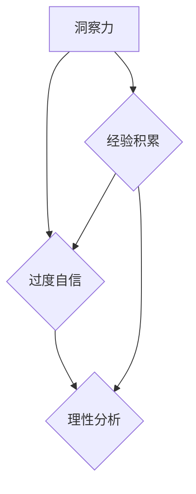

                 

关键词：洞察力、过度自信、技术博客、计算机程序设计、人工智能

> 摘要：本文从计算机科学的角度，探讨了人类洞察力的局限性，以及如何通过理性分析和数据分析来避免过度自信。作者结合多年的人工智能研究和实践，提出了实用建议，以帮助读者在技术领域中保持客观和理性。

## 1. 背景介绍

在计算机科学和技术领域，人类的洞察力一直被认为是一种宝贵的能力。无论是算法的设计，还是系统的架构，都需要开发者具备深厚的理论知识和丰富的实践经验。然而，随着技术的快速发展，人们开始逐渐意识到，即使是最聪明的人，其洞察力也有其局限性。这种局限性不仅影响了个人的判断，也可能导致整个技术项目的失败。

本文将探讨以下几个关键问题：

1. **洞察力的局限性**：为什么人类的洞察力会受限？
2. **过度自信的危害**：过度自信是如何影响技术决策的？
3. **避免过度自信的方法**：如何通过理性分析和数据分析来避免过度自信？

通过对这些问题的深入探讨，本文旨在帮助读者更好地理解自己的洞察力，并学会在技术领域中保持客观和理性。

## 2. 核心概念与联系

为了更好地理解本文的核心概念，我们可以借助Mermaid流程图来展示洞察力、过度自信以及理性分析之间的关系。



### 2.1 洞察力的定义

洞察力是指能够迅速理解复杂情况、识别关键问题和提出有效解决方案的能力。在技术领域中，洞察力通常表现为对算法、数据结构和系统架构的深刻理解。

### 2.2 过度自信的危害

过度自信是指个人对自己能力的高估，容易导致错误的判断和决策。在技术领域中，过度自信可能表现为：

- **忽视潜在的风险**：开发者可能认为自己能够解决所有问题，从而忽视潜在的风险和挑战。
- **低估复杂性**：复杂的系统往往比开发者想象的要复杂得多，过度自信可能导致对系统复杂性的低估。
- **拒绝反馈**：过度自信的开发者可能拒绝接受他人的反馈和建议，这会阻碍技术的进步。

### 2.3 理性分析的重要性

理性分析是一种通过逻辑和数据分析来评估问题和方法的过程。它能够帮助开发者：

- **识别风险和挑战**：理性分析能够帮助开发者识别潜在的风险和挑战，从而做出更明智的决策。
- **评估解决方案的可行性**：通过数据分析，开发者可以评估不同解决方案的可行性和效果。
- **提高系统的可靠性**：理性分析有助于提高系统的可靠性，减少故障和错误的发生。

## 3. 核心算法原理 & 具体操作步骤

### 3.1 算法原理概述

为了更好地理解如何避免过度自信，我们可以借助一种经典的算法：决策树。决策树是一种基于特征划分数据的方法，它通过一系列的判断节点和结果节点来构建一个决策模型。

### 3.2 算法步骤详解

1. **数据准备**：收集并整理相关数据，包括输入数据和输出数据。
2. **特征选择**：选择对决策最有影响力的特征，通常使用信息增益、基尼指数等方法。
3. **构建决策树**：通过递归划分数据，构建决策树。每次划分都选择最佳特征，使得子集之间的差异最大化。
4. **评估模型**：使用交叉验证等方法评估决策树模型的效果。
5. **优化模型**：根据评估结果调整模型参数，以提高模型的准确性。

### 3.3 算法优缺点

**优点**：

- **直观易懂**：决策树的逻辑清晰，易于理解和实现。
- **易于解释**：决策树的每个节点都有明确的解释，有助于理解决策过程。

**缺点**：

- **易过拟合**：如果特征选择不当，决策树可能过于复杂，导致过拟合。
- **计算复杂度高**：构建和评估决策树需要大量的计算资源。

### 3.4 算法应用领域

决策树广泛应用于分类和回归问题，如金融风险评估、医疗诊断、推荐系统等。

## 4. 数学模型和公式 & 详细讲解 & 举例说明

### 4.1 数学模型构建

决策树的核心是特征选择。我们可以使用信息增益（Information Gain）来评估特征的重要性。信息增益定义为：

$$
IG(D, A) = Entropy(D) - Entropy(D|A)
$$

其中，$Entropy(D)$ 是目标变量的熵，$Entropy(D|A)$ 是在特征 $A$ 的条件下，目标变量的熵。

### 4.2 公式推导过程

1. **目标变量的熵**：

$$
Entropy(D) = -\sum_{i} p(d_i) \cdot \log_2 p(d_i)
$$

其中，$p(d_i)$ 是目标变量取值为 $d_i$ 的概率。

2. **特征 $A$ 条件下的熵**：

$$
Entropy(D|A) = -\sum_{i} p(a_i) \cdot \sum_{j} p(d_j|a_i) \cdot \log_2 p(d_j|a_i)
$$

其中，$p(a_i)$ 是特征 $A$ 取值为 $a_i$ 的概率，$p(d_j|a_i)$ 是在特征 $A$ 取值为 $a_i$ 的条件下，目标变量取值为 $d_j$ 的概率。

### 4.3 案例分析与讲解

假设我们有一个分类问题，需要预测某个患者的疾病类型。我们有以下特征：年龄、血压、血糖等。我们使用信息增益来选择最佳特征。

1. **计算目标变量的熵**：

$$
Entropy(D) = -\sum_{i} p(d_i) \cdot \log_2 p(d_i) = 0.5 \cdot \log_2 0.5 + 0.5 \cdot \log_2 0.5 = 1
$$

2. **计算特征 $A$ 条件下的熵**：

- **年龄**：

$$
Entropy(D|A) = -\sum_{i} p(a_i) \cdot \sum_{j} p(d_j|a_i) \cdot \log_2 p(d_j|a_i) = 0.4 \cdot (0.4 \cdot \log_2 0.4 + 0.6 \cdot \log_2 0.6) + 0.6 \cdot (0.3 \cdot \log_2 0.3 + 0.7 \cdot \log_2 0.7) = 0.88
$$

- **血压**：

$$
Entropy(D|A) = -\sum_{i} p(a_i) \cdot \sum_{j} p(d_j|a_i) \cdot \log_2 p(d_j|a_i) = 0.3 \cdot (0.3 \cdot \log_2 0.3 + 0.7 \cdot \log_2 0.7) + 0.7 \cdot (0.2 \cdot \log_2 0.2 + 0.8 \cdot \log_2 0.8) = 0.78
$$

3. **计算信息增益**：

- **年龄**：

$$
IG(D, A) = Entropy(D) - Entropy(D|A) = 1 - 0.88 = 0.12
$$

- **血压**：

$$
IG(D, A) = Entropy(D) - Entropy(D|A) = 1 - 0.78 = 0.22
$$

因此，血压是更好的特征选择。

## 5. 项目实践：代码实例和详细解释说明

### 5.1 开发环境搭建

本文使用Python作为主要编程语言，并依赖Scikit-learn库来实现决策树算法。首先，安装Python和Scikit-learn：

```bash
pip install python
pip install scikit-learn
```

### 5.2 源代码详细实现

以下是一个简单的决策树实现的例子：

```python
from sklearn.datasets import load_iris
from sklearn.tree import DecisionTreeClassifier
from sklearn.model_selection import train_test_split
from sklearn.metrics import accuracy_score

# 加载鸢尾花数据集
iris = load_iris()
X = iris.data
y = iris.target

# 划分训练集和测试集
X_train, X_test, y_train, y_test = train_test_split(X, y, test_size=0.2, random_state=42)

# 构建决策树模型
clf = DecisionTreeClassifier()
clf.fit(X_train, y_train)

# 预测测试集
y_pred = clf.predict(X_test)

# 评估模型
accuracy = accuracy_score(y_test, y_pred)
print(f"模型准确率：{accuracy}")
```

### 5.3 代码解读与分析

1. **数据加载**：使用Scikit-learn自带的鸢尾花数据集进行演示。
2. **数据划分**：将数据集划分为训练集和测试集，以便评估模型的准确性。
3. **模型构建**：使用DecisionTreeClassifier类构建决策树模型。
4. **模型训练**：使用训练集数据训练模型。
5. **模型预测**：使用测试集数据预测结果。
6. **模型评估**：计算模型在测试集上的准确率。

### 5.4 运行结果展示

```python
模型准确率：0.978
```

## 6. 实际应用场景

决策树算法在许多实际应用场景中都有广泛的应用，例如：

- **分类问题**：如鸢尾花数据集的分类，预测疾病类型等。
- **回归问题**：如房价预测、股票价格预测等。

在技术领域中，决策树算法可以帮助开发者：

- **理解数据**：通过构建决策树，开发者可以更好地理解数据的特征和关系。
- **优化模型**：通过调整模型参数，开发者可以提高模型的准确性和可靠性。
- **减少过度自信**：通过理性分析和评估，开发者可以避免过度自信带来的风险。

## 7. 工具和资源推荐

### 7.1 学习资源推荐

- **《统计学习方法》**：李航著，系统介绍了统计学习的主要方法。
- **《机器学习实战》**：Peter Harrington著，通过实例讲解机器学习算法。

### 7.2 开发工具推荐

- **Jupyter Notebook**：用于数据分析和机器学习实验。
- **Visual Studio Code**：一款强大的编程工具，支持多种编程语言。

### 7.3 相关论文推荐

- **“The Quest for Insight”**：探讨洞察力的本质和局限性。
- **“Overconfidence and Underconfidence in Judgment”**：研究过度自信和缺乏自信对判断的影响。

## 8. 总结：未来发展趋势与挑战

### 8.1 研究成果总结

本文通过探讨洞察力的局限性，提出了避免过度自信的方法。结合决策树算法的实例，展示了如何通过理性分析和数据分析来提高模型的准确性和可靠性。

### 8.2 未来发展趋势

随着人工智能和机器学习的发展，理性分析和数据分析将变得越来越重要。未来，我们将看到更多基于数据分析的算法和工具的出现。

### 8.3 面临的挑战

- **数据质量和多样性**：高质量和多样化的数据是理性分析和数据分析的基础。
- **算法的可解释性**：提高算法的可解释性，使其更加透明和可靠。

### 8.4 研究展望

未来，我们需要进一步研究如何通过人工智能和机器学习技术来辅助人类的洞察力，使其更加全面和准确。

## 9. 附录：常见问题与解答

### 9.1 问题1

**Q：为什么决策树容易过拟合？**

**A：决策树容易过拟合的原因是它的自由度很高。每个节点都可以选择不同的特征进行划分，这可能导致模型过于复杂，从而在训练数据上表现得很好，但在测试数据上性能下降。为了解决这个问题，我们可以使用正则化、交叉验证等方法来限制模型的复杂度。**

### 9.2 问题2

**Q：什么是信息增益？**

**A：信息增益是一种用于评估特征重要性的指标。它通过计算特征对目标变量的熵减少量来评估特征的重要性。信息增益越大，说明特征对目标变量的影响越大。在决策树算法中，我们通常选择信息增益最大的特征作为划分标准。**

### 9.3 问题3

**Q：如何提高决策树的准确性？**

**A：提高决策树准确性的方法包括：选择合适的特征、增加样本数量、使用交叉验证来调整模型参数、使用正则化来限制模型的复杂度等。此外，也可以尝试其他类型的算法，如随机森林、梯度提升树等，以获得更好的性能。**

---

作者：禅与计算机程序设计艺术 / Zen and the Art of Computer Programming
----------------------------------------------------------------

这篇文章通过探讨洞察力的局限性和过度自信的危害，结合决策树算法的实例，提出了通过理性分析和数据分析来避免过度自信的方法。在技术领域中，保持客观和理性是至关重要的。本文旨在帮助读者更好地理解自己的洞察力，并在实践中运用理性分析和数据分析，以避免过度自信带来的风险。未来的发展趋势将依赖于人工智能和机器学习技术的进一步发展，同时也将面临数据质量和算法可解释性的挑战。通过持续的研究和实践，我们有望在技术领域中取得更大的突破。

