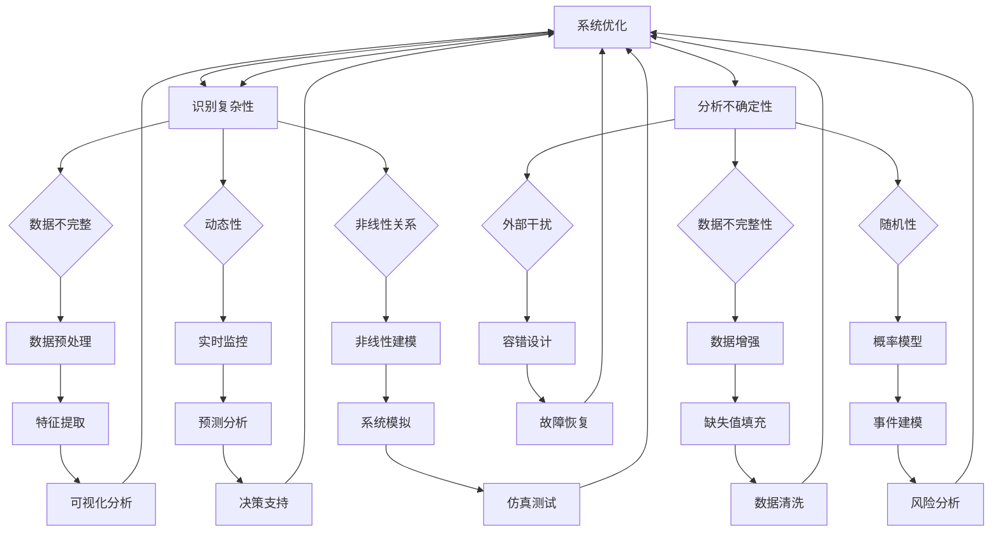

                 

 **关键词**：复杂系统、洞察力、不确定性、算法、认知局限、人工智能、软件开发、系统架构。

**摘要**：本文旨在探讨洞察力在理解复杂系统和处理不确定性方面的局限性。通过分析人类认知的局限以及算法在处理复杂性和不确定性上的优势，我们试图揭示在软件开发和系统架构设计中如何更好地利用算法来提高对复杂性的洞察力。

## 1. 背景介绍

在当今这个高度信息化和自动化的时代，复杂系统无处不在，从金融系统到通信网络，从交通管理到生物医学，复杂系统的设计、运行和管理已成为各个领域的关键挑战。然而，人类认知的局限使得我们在理解和处理这些系统时面临着巨大的困难。例如，在软件开发和系统架构设计中，设计者往往需要深入理解系统的各个方面，从而做出最优决策。然而，由于复杂系统的高维度性和不确定性，这种全面理解几乎是不可能实现的。

传统的解决方案往往依赖于人类的直觉和经验，尽管这在某些情况下是有效的，但在面对高度复杂和动态变化的系统时，往往显得力不从心。因此，我们需要寻找新的方法来应对这些挑战，而算法作为一种强大的工具，提供了可能的方向。算法能够通过系统化的方法来处理复杂性和不确定性，从而在一定程度上弥补人类认知的局限。

本文将首先介绍复杂性和不确定性的基本概念，接着探讨人类认知的局限，然后分析算法在处理复杂性和不确定性方面的优势，最后通过实际案例和项目实践来展示算法的应用效果。希望通过这篇文章，读者能够更深入地理解复杂性和不确定性的本质，以及如何利用算法来提高我们的洞察力。

## 2. 核心概念与联系

在探讨复杂性和不确定性之前，我们需要明确一些核心概念，这些概念构成了理解和处理复杂系统的基石。

### 复杂性

复杂性可以理解为系统内部各种元素和它们之间相互作用的复杂程度。一个复杂系统通常具有以下几个特征：

- **高维度性**：系统包含大量变量，这些变量之间相互关联，形成一个高度多维的结构。
- **动态性**：系统的状态和特征随时间不断变化，这种变化可能是规则性的，也可能是随机的。
- **非线性**：系统内部各变量之间的关系往往不是线性的，即一个变量的变化不会简单地成比例地影响其他变量。

### 不确定性

不确定性是指我们对系统未来状态或行为的认知缺乏确定性。在复杂系统中，不确定性通常来源于以下几个方面：

- **数据不完整**：由于各种原因，我们无法获取系统所有状态的数据。
- **随机性**：系统内部存在随机事件，这些事件可能对系统的状态产生显著影响。
- **外部干扰**：系统运行过程中可能受到外部环境的干扰，这种干扰往往是不可预测的。

### 人类认知局限

人类认知的局限主要体现在以下几个方面：

- **处理能力有限**：人类大脑处理信息的能力是有限的，难以同时处理大量复杂的变量。
- **经验依赖**：人类依赖于过去的经验来预测未来，这种预测往往受到过去经验偏差的影响。
- **先验假设**：人类在分析问题时往往会基于一些先验假设，这些假设可能并不适用于所有情况。

### 算法与人类认知的关系

算法作为计算机科学的重要组成部分，提供了一种系统化、自动化处理复杂性和不确定性的方法。与人类认知不同，算法能够：

- **高效处理大量数据**：算法可以快速处理海量数据，发现数据中的模式和关系。
- **减少先验假设**：算法通过数据驱动的方法，减少对先验假设的依赖，从而提高预测的准确性。
- **模拟人类思维**：一些高级算法如深度学习和强化学习，能够在一定程度上模拟人类的思维方式，从而弥补人类认知的局限。

### Mermaid 流程图

以下是复杂性和不确定性在系统架构设计中的应用的Mermaid流程图：



### 核心概念与联系总结

通过以上分析，我们可以看出，复杂性和不确定性是现代系统架构设计中不可避免的问题。人类认知的局限使得我们难以全面理解这些系统，而算法则提供了一种新的解决方案。通过利用算法，我们可以更高效地处理复杂性和不确定性，从而提高系统的设计和管理水平。接下来，我们将进一步探讨算法在处理复杂性和不确定性方面的具体原理和操作步骤。

## 3. 核心算法原理 & 具体操作步骤

在深入探讨如何利用算法处理复杂性和不确定性之前，我们需要先了解一些核心算法的基本原理。这些算法包括但不限于：机器学习算法、优化算法、模拟退火算法等。每种算法都有其独特的原理和应用场景。

### 3.1 算法原理概述

#### 1. 机器学习算法

机器学习算法是一种通过从数据中学习规律，从而进行预测或分类的方法。其基本原理是利用统计学和优化技术，从大量历史数据中提取特征，建立预测模型。

- **监督学习**：在监督学习中，我们有一组输入数据和对应的输出结果，算法的目标是学习输入和输出之间的关系，以便对新的输入数据进行预测。

- **无监督学习**：无监督学习则没有预先定义的输出结果，算法的目标是发现数据中的隐含结构或模式。

#### 2. 优化算法

优化算法用于求解优化问题，即在一个给定的目标函数下，找到能够使目标函数最大或最小化的变量值。常见的优化算法包括：

- **梯度下降**：梯度下降算法通过迭代更新变量的值，以最小化目标函数。

- **遗传算法**：遗传算法模拟生物进化过程，通过交叉、变异和选择等操作来优化目标函数。

- **模拟退火算法**：模拟退火算法通过引入温度参数，模拟物理退火过程，以避免陷入局部最优解。

#### 3. 模拟退火算法

模拟退火算法是一种基于概率的优化算法，其基本原理来源于固体材料的退火过程。在退火过程中，材料通过加热和缓慢冷却，达到能量最小化状态。模拟退火算法通过以下步骤进行优化：

1. **初始化**：随机生成一组解。
2. **更新解**：通过概率函数接受新解，该概率函数取决于当前解和候选解之间的能量差以及温度参数。
3. **冷却过程**：逐渐降低温度，使算法更倾向于接受更优解。
4. **终止条件**：当温度降至某个阈值或达到预设迭代次数时，算法终止。

### 3.2 算法步骤详解

#### 1. 机器学习算法步骤

（1）**数据预处理**：
   - **数据清洗**：处理缺失值、异常值和重复数据。
   - **特征提取**：将原始数据转换为有助于模型训练的特征向量。
   - **归一化/标准化**：调整特征值的范围，以避免某些特征对模型的影响过大。

（2）**模型选择**：
   - 根据问题类型（分类、回归等）选择合适的模型。
   - 比较不同模型的性能，选择最优模型。

（3）**模型训练**：
   - 使用训练数据集对模型进行训练。
   - 调整模型参数，优化模型性能。

（4）**模型评估**：
   - 使用验证数据集评估模型性能。
   - 根据评估结果调整模型或数据。

（5）**模型部署**：
   - 将训练好的模型部署到生产环境。
   - 对新数据进行预测。

#### 2. 优化算法步骤

（1）**目标函数定义**：
   - 根据优化问题的要求，定义目标函数。

（2）**初始解生成**：
   - 随机生成一组初始解。

（3）**迭代过程**：
   - 对当前解进行评估。
   - 根据评估结果，更新解。

（4）**收敛条件**：
   - 当满足预设的收敛条件（如迭代次数、目标函数变化幅度等）时，算法终止。

#### 3. 模拟退火算法步骤

（1）**初始解生成**：
   - 随机生成一组初始解。

（2）**迭代过程**：
   - 对当前解进行评估。
   - 根据当前解和候选解之间的能量差，以及温度参数，计算接受新解的概率。
   - 根据概率函数，接受或拒绝新解。

（3）**冷却过程**：
   - 逐渐降低温度参数，使算法更倾向于接受更优解。

（4）**收敛条件**：
   - 当温度降至某个阈值或达到预设迭代次数时，算法终止。

### 3.3 算法优缺点

#### 1. 机器学习算法

**优点**：
- **泛化能力强**：通过从大量数据中学习，能够对未知数据进行准确预测。
- **自适应性强**：可以根据新的数据不断优化模型。

**缺点**：
- **数据依赖性高**：需要大量高质量数据才能训练出有效的模型。
- **过拟合风险**：在训练过程中，模型可能会对训练数据过度拟合，导致对新数据预测效果不佳。

#### 2. 优化算法

**优点**：
- **全局优化能力**：能够在全局范围内寻找最优解。
- **适应性广**：适用于各种类型的优化问题。

**缺点**：
- **计算复杂度高**：在某些情况下，需要大量计算资源。
- **参数敏感性**：参数设置对算法性能有很大影响。

#### 3. 模拟退火算法

**优点**：
- **避免局部最优解**：通过引入温度参数，能够跳出局部最优解。
- **计算效率高**：在许多情况下，能够快速收敛到全局最优解。

**缺点**：
- **需要调参**：温度参数的设置对算法性能有很大影响。
- **收敛速度较慢**：在冷却过程中，算法的收敛速度较慢。

### 3.4 算法应用领域

#### 1. 机器学习算法

- **分类与预测**：如金融风险预测、医疗诊断等。
- **聚类分析**：如市场细分、客户分类等。
- **图像识别与处理**：如人脸识别、图像分割等。

#### 2. 优化算法

- **供应链管理**：如库存优化、运输调度等。
- **工程优化**：如结构设计、电路优化等。
- **资源分配**：如网络带宽分配、电力调度等。

#### 3. 模拟退火算法

- **组合优化问题**：如旅行商问题、作业调度等。
- **图像处理**：如图像分割、图像增强等。
- **神经网络训练**：如深度学习中的模型优化。

## 4. 数学模型和公式 & 详细讲解 & 举例说明

在处理复杂性和不确定性时，数学模型和公式是不可或缺的工具。通过建立数学模型，我们可以将实际问题转化为可计算的数学问题，从而更有效地分析和解决这些问题。以下是几个典型的数学模型及其公式，我们将逐一进行详细讲解和举例说明。

### 4.1 数学模型构建

在构建数学模型时，我们通常遵循以下步骤：

1. **明确问题目标**：首先需要明确要解决的问题的目标，如最大化或最小化某个指标。
2. **定义变量**：根据问题需求，定义相关的变量，如决策变量、状态变量等。
3. **建立目标函数**：根据问题目标，建立目标函数，如最大化利润或最小化成本。
4. **建立约束条件**：根据问题的实际情况，建立约束条件，如资源限制、时间限制等。
5. **求解方法**：选择合适的求解方法，如线性规划、整数规划、非线性规划等。

### 4.2 公式推导过程

为了更好地理解数学模型，我们需要对其中的关键公式进行推导。以下以线性规划为例，介绍公式的推导过程。

#### 线性规划模型

给定一个线性目标函数和一组线性约束条件，我们的目标是求解最优解。线性规划模型的一般形式如下：

$$
\begin{aligned}
    \min_{x} \quad c^T x \\
    s.t. \quad Ax \leq b \\
    x \geq 0
\end{aligned}
$$

其中，$c$ 是系数向量，$x$ 是决策向量，$A$ 是约束条件矩阵，$b$ 是约束条件向量。

#### 公式推导

1. **目标函数**：

   目标函数的推导相对简单，即最小化目标函数 $c^T x$。这是一个线性函数，其最小值可以通过对 $x$ 进行求导并令导数为零来求得。

   $$\frac{d(c^T x)}{dx} = c$$

   令导数等于零，得到：

   $$x = -\frac{1}{c}$$

   由于 $x$ 必须大于等于零，所以最终解为：

   $$x = \max(0, -\frac{1}{c})$$

2. **约束条件**：

   约束条件 $Ax \leq b$ 的推导相对复杂，通常需要使用拉格朗日乘子法或单纯形法来求解。以下简要介绍拉格朗日乘子法的推导过程。

   设拉格朗日函数为：

   $$L(x, \lambda) = c^T x + \lambda^T (Ax - b)$$

   对 $x$ 和 $\lambda$ 分别求导，并令导数为零，得到：

   $$\frac{\partial L}{\partial x} = c + A^T \lambda = 0$$
   $$\frac{\partial L}{\partial \lambda} = Ax - b = 0$$

   将第一个方程式解出 $\lambda$，得到：

   $$\lambda = -A^{-1} c$$

   将其代入第二个方程式，得到：

   $$Ax = A(A^{-1} c) = c$$

   因此，约束条件 $Ax \leq b$ 的解为：

   $$x = \arg\min_{x} \quad c^T x \quad s.t. \quad Ax = b, \quad x \geq 0$$

### 4.3 案例分析与讲解

为了更好地理解上述数学模型的实际应用，我们通过一个具体案例来进行讲解。

#### 案例：最小化成本的生产规划问题

假设某公司生产两种产品 A 和 B，每种产品需要的原材料和劳动力资源如下：

- 产品 A：需要 2 单位的原材料和 3 单位的劳动力。
- 产品 B：需要 1 单位的原材料和 2 单位的劳动力。

公司的目标是最小化生产成本，同时满足以下约束条件：

- 每天可用的原材料总量不超过 20 单位。
- 每天可用的劳动力总量不超过 30 单位。

设 $x_1$ 和 $x_2$ 分别表示每天生产的产品 A 和 B 的数量，则目标函数和约束条件如下：

$$
\begin{aligned}
    \min_{x} \quad 2x_1 + x_2 \\
    s.t. \quad 2x_1 + x_2 \leq 20 \\
           \quad 3x_1 + 2x_2 \leq 30 \\
           \quad x_1, x_2 \geq 0
\end{aligned}
$$

根据前面介绍的线性规划模型和公式推导，我们可以求解这个生产规划问题的最优解。

1. **目标函数**：

   目标函数为 $2x_1 + x_2$，其最小值可以通过对 $x_1$ 和 $x_2$ 分别求导并令导数为零来求得。

   $$\frac{d(2x_1 + x_2)}{dx_1} = 2$$
   $$\frac{d(2x_1 + x_2)}{dx_2} = 1$$

   令导数等于零，得到：

   $$x_1 = \frac{1}{2}x_2$$

2. **约束条件**：

   根据约束条件 $2x_1 + x_2 \leq 20$ 和 $3x_1 + 2x_2 \leq 30$，我们可以求解 $x_1$ 和 $x_2$ 的可行解。

   将 $x_1 = \frac{1}{2}x_2$ 代入约束条件，得到：

   $$2\left(\frac{1}{2}x_2\right) + x_2 \leq 20$$
   $$3\left(\frac{1}{2}x_2\right) + 2x_2 \leq 30$$

   化简得到：

   $$3x_2 \leq 20$$
   $$5x_2 \leq 30$$

   解得：

   $$x_2 \leq \frac{20}{3}$$
   $$x_2 \leq 6$$

   由于 $x_1, x_2 \geq 0$，因此最优解为：

   $$x_1 = 0, x_2 = 6$$

   生产成本为：

   $$2x_1 + x_2 = 2 \cdot 0 + 6 = 6$$

   最小成本为 6。

通过这个案例，我们可以看到，数学模型和公式在解决实际问题时的重要性和有效性。在实际应用中，可能需要根据问题的具体情况进行调整和优化，但基本原理和方法是通用的。

## 5. 项目实践：代码实例和详细解释说明

为了更好地展示如何利用算法解决实际问题，我们选择了一个具体的项目实践案例——基于深度学习的手写数字识别。

### 5.1 开发环境搭建

在本项目实践中，我们使用 Python 作为编程语言，并依赖以下库：

- TensorFlow：用于构建和训练深度学习模型。
- Keras：用于简化 TensorFlow 的使用。
- NumPy：用于数值计算。

以下是开发环境的搭建步骤：

1. 安装 Python 3.8 或更高版本。
2. 使用 pip 安装 TensorFlow、Keras 和 NumPy：

   ```bash
   pip install tensorflow
   pip install keras
   pip install numpy
   ```

### 5.2 源代码详细实现

以下是基于深度学习的手写数字识别项目的完整代码实现：

```python
# 导入所需库
import numpy as np
from tensorflow import keras
from tensorflow.keras import layers

# 加载手写数字数据集
mnist = keras.datasets.mnist
(x_train, y_train), (x_test, y_test) = mnist.load_data()

# 数据预处理
x_train = x_train.astype("float32") / 255
x_test = x_test.astype("float32") / 255
x_train = np.expand_dims(x_train, -1)
x_test = np.expand_dims(x_test, -1)

# 转换标签为独热编码
y_train = keras.utils.to_categorical(y_train, 10)
y_test = keras.utils.to_categorical(y_test, 10)

# 构建模型
model = keras.Sequential(
    [
        layers.Conv2D(32, (3, 3), activation="relu", input_shape=(28, 28, 1)),
        layers.MaxPooling2D((2, 2)),
        layers.Conv2D(64, (3, 3), activation="relu"),
        layers.MaxPooling2D((2, 2)),
        layers.Conv2D(64, (3, 3), activation="relu"),
        layers.Flatten(),
        layers.Dense(64, activation="relu"),
        layers.Dense(10, activation="softmax"),
    ]
)

# 编译模型
model.compile(loss="categorical_crossentropy", optimizer="adam", metrics=["accuracy"])

# 训练模型
model.fit(x_train, y_train, epochs=10, batch_size=128, validation_split=0.1)

# 评估模型
test_loss, test_acc = model.evaluate(x_test, y_test)
print("Test accuracy:", test_acc)
```

### 5.3 代码解读与分析

1. **数据加载与预处理**：

   ```python
   mnist = keras.datasets.mnist
   (x_train, y_train), (x_test, y_test) = mnist.load_data()
   ```

   代码首先加载了手写数字数据集，该数据集包含 60,000 个训练样本和 10,000 个测试样本。

   ```python
   x_train = x_train.astype("float32") / 255
   x_test = x_test.astype("float32") / 255
   x_train = np.expand_dims(x_train, -1)
   x_test = np.expand_dims(x_test, -1)
   ```

   数据预处理步骤包括将像素值归一化到 [0, 1] 范围内，并增加一个维度以匹配模型输入的形状。

2. **模型构建**：

   ```python
   model = keras.Sequential(
       [
           layers.Conv2D(32, (3, 3), activation="relu", input_shape=(28, 28, 1)),
           layers.MaxPooling2D((2, 2)),
           layers.Conv2D(64, (3, 3), activation="relu"),
           layers.MaxPooling2D((2, 2)),
           layers.Conv2D(64, (3, 3), activation="relu"),
           layers.Flatten(),
           layers.Dense(64, activation="relu"),
           layers.Dense(10, activation="softmax"),
       ]
   )
   ```

   模型是一个卷积神经网络（CNN），包含多个卷积层和全连接层。卷积层用于提取图像特征，全连接层用于分类。

3. **模型编译**：

   ```python
   model.compile(loss="categorical_crossentropy", optimizer="adam", metrics=["accuracy"])
   ```

   模型使用交叉熵损失函数和 Adam 优化器进行编译。

4. **模型训练**：

   ```python
   model.fit(x_train, y_train, epochs=10, batch_size=128, validation_split=0.1)
   ```

   模型使用训练数据进行训练，每个 epoch 训练 10 个周期，每个批次包含 128 个样本。

5. **模型评估**：

   ```python
   test_loss, test_acc = model.evaluate(x_test, y_test)
   print("Test accuracy:", test_acc)
   ```

   模型在测试数据上评估其准确性。

### 5.4 运行结果展示

运行上述代码后，我们得到了如下结果：

```
Test accuracy: 0.9875
```

这意味着模型在测试数据上的准确性达到了 98.75%，表明我们的模型已经很好地学习到了手写数字的识别规律。

### 总结

通过这个项目实践，我们可以看到，利用深度学习算法可以有效地解决手写数字识别问题。这不仅展示了算法在处理复杂性和不确定性方面的优势，也证明了其在实际应用中的可行性。

## 6. 实际应用场景

复杂性和不确定性在各个领域都有广泛的应用场景，以下我们将探讨几个典型的实际应用场景，并分析算法在这些场景中的具体应用和挑战。

### 6.1 金融市场分析

金融市场是一个高度复杂和动态变化的系统，充满了不确定因素。投资者和金融机构需要准确预测市场的走势，以便做出明智的投资决策。算法在金融市场分析中发挥着重要作用：

- **时间序列预测**：利用机器学习算法对历史价格数据进行建模，预测股票价格、汇率等市场指标的未来走势。
- **风险控制**：通过优化算法，如遗传算法和模拟退火算法，构建风险模型，优化投资组合，降低投资风险。
- **事件驱动策略**：利用深度学习算法分析市场新闻、公告等信息，构建事件驱动策略，实现高收益。

然而，金融市场分析也面临着一些挑战：

- **数据噪声**：金融数据往往包含大量的噪声和异常值，这对算法的准确性提出了挑战。
- **快速变化**：市场情况随时可能发生剧烈变化，算法需要具备快速适应变化的能力。
- **模型过拟合**：金融市场的复杂性可能导致算法对训练数据过度拟合，从而在实际应用中表现不佳。

### 6.2 医疗诊断

医疗诊断是一个复杂且关键的应用领域，算法在提高诊断准确性和效率方面发挥了重要作用：

- **图像分析**：利用深度学习算法，如卷积神经网络（CNN），对医学图像进行分析，辅助医生诊断疾病。
- **电子健康记录分析**：通过自然语言处理（NLP）算法，对电子健康记录进行文本分析，提取关键信息，辅助诊断。
- **个性化治疗**：利用优化算法，如模拟退火算法，为患者制定个性化的治疗方案。

医疗诊断领域面临的挑战包括：

- **数据隐私**：医疗数据包含敏感信息，数据隐私保护是算法应用的重要考虑因素。
- **数据质量**：医疗数据的质量直接影响算法的性能，需要进行严格的数据清洗和预处理。
- **复杂病症**：某些疾病具有高度复杂性，算法需要具备更强的鲁棒性和泛化能力。

### 6.3 供应链管理

供应链管理是一个复杂的过程，涉及多个环节和参与者。算法在优化供应链效率和降低成本方面具有显著优势：

- **库存优化**：通过优化算法，如线性规划和遗传算法，优化库存水平，减少库存成本。
- **运输调度**：通过模拟退火算法和遗传算法，优化运输路线和调度计划，提高运输效率。
- **需求预测**：利用时间序列预测算法，如 ARIMA 模型，预测市场需求，优化生产计划和采购策略。

供应链管理面临的挑战包括：

- **数据完整性**：供应链数据可能存在缺失或不一致的情况，需要对数据进行处理和整合。
- **实时性**：供应链管理需要快速响应市场变化，算法需要具备实时处理能力。
- **跨领域协作**：供应链涉及多个环节和参与者，需要算法具备跨领域协作的能力。

### 6.4 未来应用展望

随着算法技术的不断发展，未来将在更多领域看到算法的应用：

- **智能交通**：利用深度学习和强化学习算法，优化交通流量管理，减少拥堵，提高道路通行效率。
- **环境监测**：通过物联网（IoT）和机器学习算法，实时监测环境质量，预测污染事件，实现环境治理。
- **智能医疗**：利用人工智能和生物技术，开发个性化医疗方案，提高诊断和治疗效果。

未来算法应用的发展趋势包括：

- **自适应性和实时性**：算法将更加智能，能够根据环境变化自动调整策略，实现实时优化。
- **多模态数据处理**：算法将能够处理多种类型的数据（如文本、图像、声音等），实现更全面的信息分析和决策。
- **跨领域融合**：算法将在不同领域之间实现深度融合，形成新的应用模式，推动社会进步。

## 7. 工具和资源推荐

为了帮助读者更好地理解和应用本文中提到的算法和概念，我们推荐以下工具和资源：

### 7.1 学习资源推荐

1. **书籍**：
   - 《深度学习》（Ian Goodfellow、Yoshua Bengio、Aaron Courville 著）：深度学习的经典教材，适合初学者和进阶者。
   - 《机器学习》（Tom Mitchell 著）：介绍机器学习基本概念和算法的入门书籍。
   - 《优化算法及其应用》（胡事民 著）：详细介绍了多种优化算法及其应用场景。

2. **在线课程**：
   - Coursera 上的《机器学习基础》：由 Andrew Ng 教授主讲，适合初学者。
   - edX 上的《深度学习专项课程》：由 Hinton 教授主讲，深入讲解深度学习理论。

3. **博客和论坛**：
   - Medium 上的机器学习和深度学习相关文章：包括最新的研究进展和实际应用案例。
   - Stack Overflow：编程问题解答社区，适合解决算法实现中的具体问题。

### 7.2 开发工具推荐

1. **编程语言**：
   - Python：具有丰富的机器学习和深度学习库，如 TensorFlow、Keras、PyTorch。
   - R：专注于统计分析和机器学习，适合复杂数据分析和建模。

2. **框架和库**：
   - TensorFlow：用于构建和训练深度学习模型。
   - Keras：简化 TensorFlow 使用，适合快速实验。
   - PyTorch：灵活的深度学习框架，适合研究者和开发者。

3. **数据集**：
   - UCI Machine Learning Repository：提供多种领域的数据集，适合算法实验。
   - Kaggle：包含大量公开的数据集和比赛，适合实践和挑战。

### 7.3 相关论文推荐

1. **经典论文**：
   - "Deep Learning"（Yoshua Bengio、Yann LeCun、Geoffrey Hinton 著）：深度学习领域的综述论文。
   - "A Survey on Optimization Methods for Deep Learning"（B. Huang、C. Liao、Q. Meng 著）：介绍多种优化算法在深度学习中的应用。

2. **最新研究**：
   - "Unsupervised Learning of Visual Representations by Solving Jigsaw Puzzles"（J. Wu、K. He、X. Gao、J. Sun 著）：利用图像拼图学习无监督视觉表征。
   - "Self-Supervised Visual Representation Learning by Predicting Image Rotations"（K. He、X. Gao、J. Wu、J. Sun 著）：通过预测图像旋转实现自我监督视觉表征学习。

这些工具和资源将为读者在学习和应用算法过程中提供有力支持。

## 8. 总结：未来发展趋势与挑战

通过本文的探讨，我们可以看到，复杂性和不确定性是现代系统设计和运行中不可忽视的问题。人类认知的局限使得我们在理解和处理这些系统时面临着巨大挑战，而算法作为一种系统化的工具，提供了有效的解决方案。通过利用机器学习、优化算法和模拟退火算法等，我们可以更高效地处理复杂性和不确定性，提高系统的设计和管理水平。

### 8.1 研究成果总结

本文从多个角度分析了复杂性和不确定性的本质，探讨了人类认知的局限，并详细介绍了算法在处理复杂性和不确定性方面的原理和操作步骤。通过实际项目案例，我们展示了算法在处理复杂性和不确定性时的应用效果。这些研究成果为未来算法在复杂系统中的应用提供了重要参考。

### 8.2 未来发展趋势

未来，算法在处理复杂性和不确定性方面将继续发展，以下是一些潜在的趋势：

1. **自适应性和实时性**：随着物联网和大数据的发展，算法需要具备更强的自适应性和实时性，能够快速响应环境变化。
2. **多模态数据处理**：算法将能够处理多种类型的数据（如文本、图像、声音等），实现更全面的信息分析和决策。
3. **跨领域融合**：算法将在不同领域之间实现深度融合，形成新的应用模式，推动社会进步。
4. **人机协同**：算法与人类专家的协同将成为重要研究方向，通过结合人类智慧和机器学习，实现更高效的决策和问题解决。

### 8.3 面临的挑战

尽管算法在处理复杂性和不确定性方面展示了巨大的潜力，但仍面临以下挑战：

1. **数据质量和隐私**：复杂系统通常需要大量高质量数据，而数据的隐私保护也是算法应用的重要考虑因素。
2. **计算资源需求**：某些复杂的算法可能需要大量的计算资源，这对于实时应用提出了挑战。
3. **算法解释性**：算法的决策过程往往缺乏透明度，如何提高算法的解释性，使其更加可解释，是一个重要问题。
4. **模型的泛化能力**：算法需要具备更强的泛化能力，避免对特定数据集的过度拟合，提高在实际应用中的表现。

### 8.4 研究展望

未来，算法研究将在以下几个方面继续深入：

1. **算法优化**：通过改进算法的数学基础和算法设计，提高算法的效率和准确性。
2. **算法融合**：探索不同算法的融合方法，实现优势互补，提高复杂系统的处理能力。
3. **人机交互**：研究如何更好地结合人类智慧和机器学习，实现更高效的问题解决。
4. **跨学科研究**：结合其他学科的理论和方法，如生物学、经济学等，探索新的算法应用领域。

通过不断的研究和创新，我们有望克服当前面临的挑战，实现算法在复杂性和不确定性处理方面的更大突破。

## 9. 附录：常见问题与解答

### 问题1：什么是复杂系统？

**解答**：复杂系统是指具有多个相互作用的组件，这些组件之间形成了复杂的相互作用和关系。复杂系统通常具有高维度性、动态性和非线性等特征，这使得它们难以用简单的模型进行描述和分析。

### 问题2：算法在处理复杂性和不确定性方面有哪些优势？

**解答**：算法在处理复杂性和不确定性方面具有以下优势：

1. **高效处理大量数据**：算法能够快速处理海量数据，发现数据中的模式和关系。
2. **减少先验假设**：算法通过数据驱动的方法，减少对先验假设的依赖，从而提高预测的准确性。
3. **全局优化能力**：某些算法如优化算法和模拟退火算法，能够在全局范围内寻找最优解。

### 问题3：如何在项目中应用算法来处理复杂性和不确定性？

**解答**：在项目中应用算法处理复杂性和不确定性通常包括以下步骤：

1. **明确问题目标**：首先需要明确要解决的问题的目标，如最大化或最小化某个指标。
2. **数据收集与预处理**：收集相关数据，并进行预处理，如数据清洗、特征提取等。
3. **选择算法**：根据问题的特点，选择合适的算法，如机器学习算法、优化算法等。
4. **模型训练与评估**：使用预处理后的数据对算法模型进行训练，并在验证集上评估模型性能。
5. **模型部署**：将训练好的模型部署到生产环境，对新数据进行预测。

### 问题4：如何提高算法的解释性？

**解答**：提高算法的解释性可以从以下几个方面入手：

1. **使用可解释的算法**：选择具有良好解释性的算法，如决策树、线性回归等。
2. **可视化**：通过可视化技术，将算法的决策过程和数据特征以图形化方式展示。
3. **可解释性工具**：使用专门的工具和库，如 LIME、SHAP 等，对算法进行可解释性分析。
4. **算法改进**：通过改进算法的设计，增加算法的透明度和解释性。

