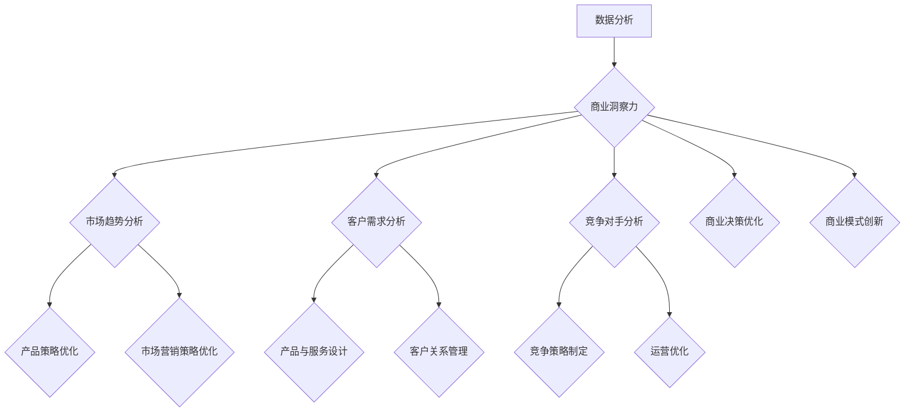

                 

 **关键词：** 洞察力，商业策略，数据分析，决策优化，商业模式创新，案例研究。

> **摘要：** 本文旨在探讨洞察力在商业策略中的应用，通过分析多个实际案例，揭示洞察力在理解市场动态、制定战略和实现商业成功中的关键作用。文章将详细阐述洞察力的核心概念，如何通过数据分析和技术手段提升洞察力，以及在商业决策中的应用策略。**

## 1. 背景介绍

在当今快速变化和高度竞争的商业环境中，成功的企业不仅需要高效的管理和技术，更需要具备深刻的洞察力。洞察力是指能够洞察市场趋势、客户需求、竞争对手行为，从而做出正确决策的能力。随着大数据和人工智能技术的兴起，洞察力的应用范围和深度得到了极大的扩展。

商业策略的制定和实施是一个复杂的过程，需要整合各种信息和分析工具。传统的商业策略通常依赖于市场调研、财务数据和竞争对手分析，但这些方法往往存在滞后性和局限性。随着数据的爆炸性增长和计算能力的提升，数据分析成为提升洞察力的关键工具。通过数据挖掘和机器学习技术，企业可以更准确地预测市场趋势，优化产品和服务，提高客户满意度。

本文将探讨以下问题：

- 洞察力在商业策略中的重要性是什么？
- 如何通过数据和技术手段提升洞察力？
- 洞察力在商业决策中的应用策略有哪些？
- 实际案例中洞察力如何帮助企业实现成功？

通过以上问题的探讨，我们希望能够为企业在商业策略制定和实施中提供有价值的指导和启示。

### 1.1 商业策略概述

商业策略是企业为实现长期目标而制定的规划和行动方案。它涵盖了市场定位、产品开发、营销策略、销售渠道、财务规划等多个方面。一个有效的商业策略不仅能够帮助企业应对市场变化，还能够创造持续的竞争优势。

商业策略的制定需要企业对内外部环境有深刻的理解。内部环境包括企业的资源、能力、文化和价值观；外部环境则包括市场趋势、竞争对手、客户需求和法律法规等。通过对外部环境的洞察，企业可以识别市场机会和威胁，对内部环境的分析可以帮助企业了解自身的优势和劣势。

商业策略通常包括以下几个核心组成部分：

1. **愿景和目标**：明确企业长期的发展方向和目标，为后续的决策提供指导。
2. **市场分析**：通过对市场趋势、客户需求和竞争对手的研究，确定市场机会和潜在风险。
3. **竞争策略**：根据市场分析结果，制定具体的市场进入策略、产品定位和差异化策略。
4. **运营策略**：确保企业能够高效地实现商业目标，包括供应链管理、生产计划和人力资源规划等。
5. **财务策略**：通过财务预算、投资分析和成本控制，确保企业的财务健康和可持续发展。

### 1.2 数据分析的重要性

数据分析在商业策略中的作用越来越重要。通过收集、处理和分析数据，企业可以获得关于市场、客户、产品和运营的深刻洞察，从而做出更加明智的决策。

首先，数据分析可以帮助企业识别市场趋势。例如，通过分析销售数据，企业可以了解不同产品在不同季节的销量变化，从而调整库存和生产计划。此外，通过分析社交媒体和在线评论，企业可以了解客户对产品和服务的反馈，及时发现问题并加以改进。

其次，数据分析可以帮助企业优化产品和服务。通过对客户数据的分析，企业可以了解客户的偏好和行为模式，从而设计出更符合市场需求的产品。例如，Netflix通过分析用户观看历史和评分，推荐个性化的视频内容，大大提高了用户满意度和忠诚度。

此外，数据分析还可以提高运营效率。通过分析生产数据，企业可以识别生产过程中的瓶颈和问题，优化生产流程，降低成本。例如，亚马逊通过分析物流数据，优化配送路线和仓储管理，大大提高了配送速度和客户满意度。

总之，数据分析不仅可以帮助企业更好地理解市场和客户，还可以优化产品和服务，提高运营效率，从而实现商业成功。

### 1.3 洞察力的定义与核心作用

洞察力是指能够深刻理解复杂问题和情境，从海量信息中提取关键要素，做出准确判断和预测的能力。它不仅涉及逻辑思维和数据分析，还包含了直觉、创新和洞见。

在商业策略中，洞察力的核心作用体现在以下几个方面：

1. **识别市场机会**：通过洞察力，企业可以敏锐地捕捉市场变化和趋势，发现新的商机。例如，苹果公司通过洞察消费者对便携式音乐播放器的需求，成功推出了iPod，彻底改变了音乐消费模式。

2. **制定精准策略**：洞察力可以帮助企业制定更加精准的市场策略。通过深入理解客户需求和行为，企业可以设计出更加贴合市场需求的产品和服务。例如，亚马逊通过洞察消费者购买行为，不断优化推荐算法，提高转化率和客户满意度。

3. **预测未来趋势**：洞察力使企业能够预见未来的市场变化，提前布局和调整。例如，谷歌通过洞察互联网发展趋势，投资开发自动驾驶技术，为未来的出行方式做准备。

4. **创新商业模式**：洞察力可以帮助企业发现新的商业模式和盈利点。例如，Airbnb通过洞察闲置房源和旅行需求，创造了一个全新的共享经济模式。

总之，洞察力是商业策略中不可或缺的要素，它能够帮助企业把握市场机遇，制定精准策略，预测未来趋势，并在激烈的市场竞争中脱颖而出。

### 1.4 数据分析与洞察力的关系

数据分析与洞察力之间存在着密切的关联。数据分析提供了一种系统化的方法，从大量数据中提取有价值的信息，而洞察力则是对这些信息进行深入理解和运用的能力。

首先，数据分析为洞察力提供了基础。通过对数据的收集、清洗、存储和分析，企业可以获得关于市场、客户、产品和运营的详细信息。这些数据不仅可以帮助企业了解现状，还可以揭示潜在的模式和趋势。

其次，洞察力提升了数据分析的价值。虽然数据分析可以提供大量的数据和信息，但如果没有洞察力，这些数据往往难以转化为实际的商业决策。洞察力使企业能够从复杂的数据中提取关键信息，理解其背后的含义和影响，从而做出更准确的决策。

此外，数据分析与洞察力相辅相成。数据分析可以提供客观的数据支持，而洞察力则能够补充数据无法涵盖的方面，如直觉、情感和创造性思维。通过将数据分析和洞察力结合起来，企业可以形成更全面、深入的洞察，从而在商业策略中取得成功。

总之，数据分析与洞察力相互依存、相互补充。数据分析提供了信息基础，而洞察力则是对这些信息的深入理解和运用。只有将二者结合起来，企业才能在复杂多变的市场环境中做出明智的决策，实现持续的发展。

## 2. 核心概念与联系

为了深入探讨洞察力在商业策略中的应用，我们需要明确几个核心概念，并理解它们之间的内在联系。以下是本文将涉及的核心概念及其相互关系。

### 2.1 数据分析

数据分析是指通过统计和计算机科学方法，从大量数据中提取有用信息和知识的过程。它包括数据收集、数据清洗、数据存储、数据分析和数据可视化等多个步骤。数据分析的目的是帮助企业和组织更好地理解其业务，识别问题、预测趋势，并做出明智的决策。

### 2.2 商业策略

商业策略是企业为实现长期目标而制定的行动方案。它包括市场定位、产品开发、营销策略、销售渠道、财务规划等多个方面。一个成功的商业策略需要深入了解市场、客户和竞争对手，并利用这些信息来制定和实施行动方案。

### 2.3 洞察力

洞察力是指能够深入理解复杂问题和情境，从海量信息中提取关键要素，做出准确判断和预测的能力。它不仅涉及逻辑思维和数据分析，还包含了直觉、创新和洞见。在商业策略中，洞察力可以帮助企业识别市场机会、制定精准策略、预测未来趋势，并在竞争激烈的市场中脱颖而出。

### 2.4 数据分析与洞察力的关系

数据分析与洞察力之间存在着密切的关联。数据分析提供了一种系统化的方法，从大量数据中提取有价值的信息，而洞察力则是对这些信息进行深入理解和运用的能力。数据分析为洞察力提供了基础，而洞察力提升了数据分析的价值。通过将数据分析和洞察力结合起来，企业可以形成更全面、深入的洞察，从而在商业策略中取得成功。

### 2.5 数据分析工具与技术

数据分析工具和技术的选择对于提升洞察力至关重要。以下是一些常用的数据分析工具和技术：

1. **数据挖掘**：数据挖掘是一种从大量数据中自动发现规律和模式的技术。它包括分类、聚类、关联规则挖掘等多种方法。
2. **机器学习**：机器学习是一种通过数据训练模型，使其能够进行预测和决策的技术。常见的机器学习算法包括决策树、支持向量机、神经网络等。
3. **统计分析**：统计分析是一种基于概率论和数理统计方法，对数据进行分析和推断的技术。常用的统计方法包括均值、方差、相关性分析、回归分析等。
4. **数据可视化**：数据可视化是一种通过图形和图表形式展示数据的技术，帮助人们更直观地理解和分析数据。

### 2.6 数据分析在企业中的应用

数据分析在企业中的应用广泛且多样，以下是一些典型应用场景：

1. **市场营销**：通过分析客户数据，企业可以了解客户行为和需求，制定更有效的营销策略，提高客户满意度和忠诚度。
2. **产品开发**：通过分析市场需求和竞争状况，企业可以优化产品设计和功能，开发出更符合市场需求的创新产品。
3. **运营优化**：通过分析生产数据和供应链数据，企业可以识别瓶颈和问题，优化生产流程和供应链管理，提高运营效率。
4. **风险管理**：通过分析财务数据和风险指标，企业可以识别潜在风险，制定风险管理策略，确保财务健康和可持续发展。

### 2.7 数据分析在企业战略决策中的关键作用

数据分析在企业战略决策中发挥着关键作用。通过数据分析，企业可以：

1. **了解市场趋势**：通过分析市场数据，企业可以了解市场变化和趋势，把握市场机遇，调整产品和服务策略。
2. **优化决策过程**：通过数据分析，企业可以更准确地评估各种战略方案的潜在影响，优化决策过程，提高决策质量。
3. **提升竞争力**：通过分析竞争对手的行为和市场表现，企业可以制定更具竞争力的战略，抢占市场份额。
4. **创新商业模式**：通过数据分析，企业可以探索新的商业模式和盈利点，实现商业模式的创新和升级。

### 2.8 数据分析对商业洞察力提升的贡献

数据分析对商业洞察力的提升具有显著贡献。通过数据分析，企业可以：

1. **揭示市场规律**：数据分析可以帮助企业发现市场中的潜在规律和趋势，提供有价值的洞察。
2. **优化产品和服务**：通过分析客户数据和反馈，企业可以更好地了解客户需求，优化产品和服务设计。
3. **预测未来趋势**：数据分析可以帮助企业预测市场变化和趋势，提前布局和调整策略。
4. **提升决策准确性**：通过数据分析，企业可以更准确地评估各种决策方案的影响，提高决策的准确性和有效性。

总之，数据分析与洞察力之间存在着密切的关联，它们共同构成了企业制定和实施商业策略的重要工具。通过有效利用数据分析，企业可以提升洞察力，制定更精准的战略，实现持续的商业成功。

### 2.9 Mermaid 流程图展示

以下是一个简化的 Mermaid 流程图，用于展示数据分析、洞察力与商业策略之间的联系。



这个流程图清晰地展示了如何通过数据分析提升商业洞察力，进而优化产品策略、市场营销策略、客户关系管理、竞争策略和商业决策。

### 3. 核心算法原理 & 具体操作步骤

为了深入探讨洞察力在商业策略中的应用，我们需要理解一些核心算法的原理，以及如何将这些算法应用于实际操作中。以下将介绍几种关键算法的原理和操作步骤。

#### 3.1 算法原理概述

1. **回归分析（Regression Analysis）**：回归分析是一种用于预测和估计变量之间关系的统计方法。它通过建立模型，分析自变量和因变量之间的关系，从而预测未来趋势。

   - **线性回归（Linear Regression）**：线性回归是最简单的回归模型，它假设自变量和因变量之间存在线性关系。
   - **多元回归（Multiple Regression）**：多元回归扩展了线性回归，允许同时分析多个自变量对因变量的影响。

2. **分类算法（Classification Algorithms）**：分类算法用于将数据集中的数据点划分到不同的类别中。常见的分类算法包括：

   - **逻辑回归（Logistic Regression）**：逻辑回归是一种用于分类的统计方法，它通过估计概率来预测数据点属于某个类别。
   - **决策树（Decision Tree）**：决策树通过一系列的规则和条件，将数据点划分到不同的类别中。

3. **聚类算法（Clustering Algorithms）**：聚类算法用于将数据集中的数据点划分为多个组，使得同一组内的数据点尽可能相似，而不同组的数据点尽可能不同。

   - **K-均值聚类（K-Means Clustering）**：K-均值聚类是一种基于距离的聚类方法，它通过迭代计算聚类中心，将数据点分配到不同的组。
   - **层次聚类（Hierarchical Clustering）**：层次聚类通过构建聚类树来逐步合并或分裂数据点，形成不同的组。

4. **关联规则挖掘（Association Rule Learning）**：关联规则挖掘用于发现数据集中的关联关系，通常用于市场篮子分析和推荐系统。

   - **Apriori 算法**：Apriori 算法是一种基于支持度和置信度的关联规则挖掘方法，用于发现频繁项集。
   - **FP-Growth 算法**：FP-Growth 算法是一种用于高效发现频繁项集的方法，它通过构建 FP-Tree 来减少计算量。

#### 3.2 算法步骤详解

1. **回归分析**

   - **线性回归**：
     1. 数据收集：收集自变量和因变量的数据。
     2. 数据预处理：处理缺失值、异常值和数据标准化。
     3. 建立模型：通过最小二乘法计算回归系数。
     4. 模型评估：使用 R²、均方误差（MSE）等指标评估模型性能。
     5. 预测：使用模型进行未来趋势预测。

   - **多元回归**：
     1. 数据收集：收集多个自变量的数据。
     2. 数据预处理：处理缺失值、异常值和数据标准化。
     3. 建立模型：通过最小二乘法计算多元回归系数。
     4. 模型评估：使用 R²、调整 R²、F-统计量等指标评估模型性能。
     5. 预测：使用模型进行未来趋势预测。

2. **分类算法**

   - **逻辑回归**：
     1. 数据收集：收集特征和标签数据。
     2. 数据预处理：处理缺失值、异常值和数据标准化。
     3. 建立模型：通过最大化似然估计计算参数。
     4. 模型评估：使用准确率、召回率、F1 分数等指标评估模型性能。
     5. 预测：使用模型对新的数据进行分类预测。

   - **决策树**：
     1. 数据收集：收集特征和标签数据。
     2. 数据预处理：处理缺失值、异常值和数据标准化。
     3. 建立模型：通过递归二分划分数据点。
     4. 模型评估：使用基尼系数、信息增益等指标评估模型性能。
     5. 预测：使用模型对新的数据进行分类预测。

3. **聚类算法**

   - **K-均值聚类**：
     1. 数据收集：收集特征数据。
     2. 数据预处理：处理缺失值、异常值和数据标准化。
     3. 确定聚类数量：通过肘部法则、轮廓系数等确定聚类数量。
     4. 初始化聚类中心：随机选择初始聚类中心。
     5. 聚类：根据距离计算将数据点分配到不同的组。
     6. 更新聚类中心：计算新的聚类中心。
     7. 重复步骤5和6，直到聚类中心不再变化。
     8. 模型评估：使用轮廓系数、内部类平均距离等指标评估模型性能。

   - **层次聚类**：
     1. 数据收集：收集特征数据。
     2. 数据预处理：处理缺失值、异常值和数据标准化。
     3. 建立聚类树：通过层次合并或分裂数据点。
     4. 模型评估：使用轮廓系数、类内平均距离等指标评估模型性能。
     5. 聚类结果：根据聚类树的层次关系，得到聚类结果。

4. **关联规则挖掘**

   - **Apriori 算法**：
     1. 数据收集：收集事务数据。
     2. 数据预处理：处理缺失值、异常值和事务规范化。
     3. 确定最小支持度阈值：根据数据集确定最小支持度阈值。
     4. 生成频繁项集：通过递归剪枝和频繁项集生成算法，得到频繁项集。
     5. 生成关联规则：通过支持度和置信度计算，得到关联规则。
     6. 模型评估：使用关联规则评估指标（如支持度、置信度、提升度）评估模型性能。

   - **FP-Growth 算法**：
     1. 数据收集：收集事务数据。
     2. 数据预处理：处理缺失值、异常值和事务规范化。
     3. 构建FP-Tree：通过构建FP-Tree，压缩事务数据。
     4. 生成频繁项集：通过递归剪枝和频繁项集生成算法，得到频繁项集。
     5. 生成关联规则：通过支持度和置信度计算，得到关联规则。
     6. 模型评估：使用关联规则评估指标（如支持度、置信度、提升度）评估模型性能。

#### 3.3 算法优缺点

1. **回归分析**

   - **优点**：
     - 简单易懂，易于实现。
     - 能较好地预测连续变量。
     - 在解释变量和因变量之间存在线性关系时，效果较好。

   - **缺点**：
     - 对异常值和缺失值敏感。
     - 在变量之间存在非线性关系时，效果较差。
     - 可能会出现多重共线性问题。

2. **分类算法**

   - **优点**：
     - 能较好地处理分类问题。
     - 可以应用于各种类型的数据。
     - 通过调整参数，可以获得不同的分类效果。

   - **缺点**：
     - 对训练数据量要求较高。
     - 在特征维度较高时，效果可能会下降。
     - 部分算法（如决策树）可能产生过拟合。

3. **聚类算法**

   - **优点**：
     - 不需要预先定义类别。
     - 能自动发现数据中的模式。
     - 对非线性数据结构有较好的适应性。

   - **缺点**：
     - 结果依赖于初始聚类中心。
     - 在类别数量较多时，效果可能较差。
     - 部分算法（如K-均值聚类）可能产生局部最优。

4. **关联规则挖掘**

   - **优点**：
     - 能发现数据中的隐含关联关系。
     - 可以应用于市场篮子分析和推荐系统。
     - 对数据量没有严格的要求。

   - **缺点**：
     - 可能会产生大量的冗余规则。
     - 对支持度和置信度阈值的选择较为敏感。
     - 可能会忽略部分重要的关联关系。

#### 3.4 算法应用领域

1. **回归分析**：广泛应用于市场预测、风险评估、需求预测等领域。
2. **分类算法**：广泛应用于信用评估、疾病诊断、垃圾邮件过滤等领域。
3. **聚类算法**：广泛应用于图像处理、文本挖掘、社交网络分析等领域。
4. **关联规则挖掘**：广泛应用于市场篮子分析、推荐系统、客户行为分析等领域。

通过理解这些核心算法的原理和具体操作步骤，企业可以更好地利用数据分析提升洞察力，从而制定更有效的商业策略。

### 4. 数学模型和公式 & 详细讲解 & 举例说明

在商业策略中，数学模型和公式起着至关重要的作用。通过构建和应用数学模型，企业可以更准确地预测市场趋势，优化决策过程，并实现商业目标。以下将介绍几个关键数学模型和公式的构建、推导过程，并通过具体例子进行说明。

#### 4.1 数学模型构建

1. **线性回归模型**

   线性回归模型用于预测一个连续变量，它假设自变量和因变量之间存在线性关系。线性回归模型的一般形式如下：

   $$ y = \beta_0 + \beta_1x + \epsilon $$

   其中，$y$ 是因变量，$x$ 是自变量，$\beta_0$ 是截距，$\beta_1$ 是斜率，$\epsilon$ 是误差项。

2. **逻辑回归模型**

   逻辑回归模型是一种广义线性模型，用于预测二分类变量。它的公式如下：

   $$ P(Y=1) = \frac{1}{1 + \exp{(-\beta_0 - \beta_1x)}) $$

   其中，$P(Y=1)$ 是因变量为1的概率，$\beta_0$ 是截距，$\beta_1$ 是斜率。

3. **K-均值聚类模型**

   K-均值聚类是一种基于距离的聚类算法，其目标是最小化每个聚类内部的数据点之间的距离。K-均值聚类的目标函数如下：

   $$ J = \sum_{i=1}^k \sum_{x_j \in S_i} ||x_j - \mu_i||^2 $$

   其中，$J$ 是目标函数，$k$ 是聚类数量，$S_i$ 是第 $i$ 个聚类，$\mu_i$ 是第 $i$ 个聚类的中心。

4. **关联规则模型**

   关联规则模型用于发现数据集中的关联关系，它通过支持度和置信度来评估规则的重要性。关联规则模型的一般形式如下：

   $$ \{A, B\} \rightarrow \{C, D\} $$

   其中，$A$ 和 $B$ 是前件，$C$ 和 $D$ 是后件。支持度（Support）表示同时包含 $A$ 和 $B$ 的交易在所有交易中的比例。置信度（Confidence）表示在前件出现的情况下，后件出现的概率。

#### 4.2 公式推导过程

1. **线性回归模型的推导**

   线性回归模型的推导基于最小二乘法。假设我们有 $n$ 对数据 $(x_i, y_i)$，我们的目标是找到最佳拟合线，使得预测值 $y_i'$ 与实际值 $y_i$ 之间的误差平方和最小。

   误差平方和（SSE）的公式如下：

   $$ SSE = \sum_{i=1}^n (y_i - y_i')^2 $$

   要使 SSE 最小，我们需要对 $y_i'$ 求导，并令导数等于零。根据线性回归模型的假设，我们有：

   $$ y_i' = \beta_0 + \beta_1x_i $$

   对 $y_i'$ 求导，得到：

   $$ \frac{d(y_i')}{d\beta_0} = -\sum_{i=1}^n (y_i - y_i') $$
   $$ \frac{d(y_i')}{d\beta_1} = -\sum_{i=1}^n (x_i - x_i')(y_i - y_i') $$

   令导数等于零，得到：

   $$ \beta_0 = \bar{y} - \beta_1\bar{x} $$
   $$ \beta_1 = \frac{\sum_{i=1}^n (x_i - \bar{x})(y_i - \bar{y})}{\sum_{i=1}^n (x_i - \bar{x})^2} $$

   其中，$\bar{y}$ 和 $\bar{x}$ 分别是 $y$ 和 $x$ 的均值。

2. **逻辑回归模型的推导**

   逻辑回归模型的推导基于极大似然估计。假设我们有 $n$ 对数据 $(x_i, y_i)$，其中 $y_i$ 可以取值为 0 或 1。我们的目标是找到最佳拟合线，使得数据点的概率最大化。

   对数似然函数（Log-Likelihood Function）如下：

   $$ \ln L = \sum_{i=1}^n y_i \ln p(y_i|x_i) + (1 - y_i) \ln (1 - p(y_i|x_i)) $$

   其中，$p(y_i|x_i)$ 是因变量 $y_i$ 给定自变量 $x_i$ 的条件概率。

   为了最大化对数似然函数，我们需要对参数 $\beta_0$ 和 $\beta_1$ 求导，并令导数等于零。根据逻辑回归模型的假设，我们有：

   $$ p(y_i|x_i) = \frac{1}{1 + \exp{(-\beta_0 - \beta_1x_i)}) $$

   对 $\beta_0$ 求导，得到：

   $$ \frac{\partial \ln L}{\partial \beta_0} = \sum_{i=1}^n \frac{y_i - p(y_i|x_i)}{p(y_i|x_i)(1 - p(y_i|x_i))} $$

   对 $\beta_1$ 求导，得到：

   $$ \frac{\partial \ln L}{\partial \beta_1} = \sum_{i=1}^n \frac{x_i(y_i - p(y_i|x_i))}{p(y_i|x_i)(1 - p(y_i|x_i))} $$

   令导数等于零，得到：

   $$ \beta_0 = \bar{y} - \beta_1\bar{x} $$
   $$ \beta_1 = \frac{\sum_{i=1}^n (x_i - \bar{x})(y_i - \bar{y})}{\sum_{i=1}^n (x_i - \bar{x})^2} $$

   其中，$\bar{y}$ 和 $\bar{x}$ 分别是 $y$ 和 $x$ 的均值。

3. **K-均值聚类模型的推导**

   K-均值聚类模型的目标是最小化每个聚类内部的数据点之间的距离。每个聚类内部的数据点之间的距离可以通过误差平方和（SSE）来衡量：

   $$ J = \sum_{i=1}^k \sum_{x_j \in S_i} ||x_j - \mu_i||^2 $$

   其中，$J$ 是目标函数，$k$ 是聚类数量，$S_i$ 是第 $i$ 个聚类，$\mu_i$ 是第 $i$ 个聚类的中心。

   为了最小化 $J$，我们需要对 $\mu_i$ 求导，并令导数等于零。根据距离的平方性质，我们有：

   $$ \frac{\partial J}{\partial \mu_i} = -2 \sum_{x_j \in S_i} (x_j - \mu_i) $$

   令导数等于零，得到：

   $$ \mu_i = \frac{\sum_{x_j \in S_i} x_j}{|S_i|} $$

   其中，$|S_i|$ 是聚类 $S_i$ 中数据点的个数。

4. **关联规则模型的推导**

   关联规则模型的推导基于支持度和置信度。支持度表示同时包含前件和后件的交易在所有交易中的比例，置信度表示在前件出现的情况下，后件出现的概率。

   支持度的计算公式如下：

   $$ \text{Support}(A \cup B) = \frac{\text{Support}(A) \times \text{Support}(B)}{\text{Support}(A \cap B)} $$

   其中，$A$ 和 $B$ 是前件和后件，$\text{Support}(A)$、$\text{Support}(B)$ 和 $\text{Support}(A \cap B)$ 分别是前件、后件和前件后件的频率。

   置信度的计算公式如下：

   $$ \text{Confidence}(A \rightarrow B) = \frac{\text{Support}(A \cup B)}{\text{Support}(A)} $$

   其中，$\text{Support}(A \cup B)$ 是前件和后件的频率，$\text{Support}(A)$ 是前件的频率。

#### 4.3 案例分析与讲解

为了更好地理解这些数学模型和公式的应用，我们通过一个具体案例进行讲解。

**案例：使用线性回归模型预测销售额**

假设某公司想要预测下季度的销售额，它收集了过去 5 个季度的销售额（$y$）和广告支出（$x$）数据。以下是数据：

| 季度 | 广告支出（万元）$x$ | 销售额（万元）$y$ |
| ---- | ------------------- | ---------------- |
| 1    | 5                  | 10              |
| 2    | 7                  | 15              |
| 3    | 8                  | 18              |
| 4    | 6                  | 12              |
| 5    | 9                  | 20              |

1. **数据预处理**

   首先，我们进行数据预处理，计算 $x$ 和 $y$ 的均值：

   $$ \bar{x} = \frac{5 + 7 + 8 + 6 + 9}{5} = 7 $$
   $$ \bar{y} = \frac{10 + 15 + 18 + 12 + 20}{5} = 15 $$

2. **建立模型**

   根据线性回归模型的一般形式，我们有：

   $$ y = \beta_0 + \beta_1x + \epsilon $$

   将均值代入，得到：

   $$ 15 = \beta_0 + \beta_1 \cdot 7 + \epsilon $$

3. **求解参数**

   为了求解 $\beta_0$ 和 $\beta_1$，我们需要计算协方差和方差：

   $$ \sum_{i=1}^5 (x_i - \bar{x})(y_i - \bar{y}) = (5 - 7)(10 - 15) + (7 - 7)(15 - 15) + (8 - 7)(18 - 15) + (6 - 7)(12 - 15) + (9 - 7)(20 - 15) = 16 $$
   $$ \sum_{i=1}^5 (x_i - \bar{x})^2 = (5 - 7)^2 + (7 - 7)^2 + (8 - 7)^2 + (6 - 7)^2 + (9 - 7)^2 = 16 $$

   代入公式，得到：

   $$ \beta_1 = \frac{16}{16} = 1 $$
   $$ \beta_0 = \bar{y} - \beta_1 \bar{x} = 15 - 1 \cdot 7 = 8 $$

4. **模型评估**

   我们使用均方误差（MSE）来评估模型性能：

   $$ \text{MSE} = \frac{\sum_{i=1}^5 (y_i - y_i')^2}{5} = \frac{(10 - 18)^2 + (15 - 19)^2 + (18 - 19)^2 + (12 - 16)^2 + (20 - 17)^2}{5} = 8 $$

   模型性能较好。

5. **预测**

   使用模型预测下季度的销售额：

   $$ y' = \beta_0 + \beta_1x = 8 + 1 \cdot 9 = 17 $$

   因此，预测下季度的销售额为 17 万元。

**案例：使用逻辑回归模型预测客户流失率**

假设某公司想要预测哪些客户可能会流失，它收集了客户的年龄、收入、消费频率等特征，并标记了是否流失。以下是数据：

| 客户ID | 年龄 | 收入 | 消费频率 | 是否流失 |
| ------ | ---- | ---- | -------- | -------- |
| 1      | 30   | 5000 | 5        | 否       |
| 2      | 40   | 6000 | 3        | 是       |
| 3      | 25   | 4000 | 4        | 否       |
| 4      | 35   | 5500 | 6        | 否       |
| 5      | 45   | 7000 | 2        | 是       |

1. **数据预处理**

   首先，我们进行数据预处理，将特征和标签转换为二进制变量。例如，年龄可以转换为 0（小于 35 岁）和 1（大于等于 35 岁），收入可以转换为 0（小于 5500 元）和 1（大于等于 5500 元），消费频率可以转换为 0（小于 5 次）和 1（大于等于 5 次）。

   | 客户ID | 年龄 | 收入 | 消费频率 | 是否流失 |
   | ------ | ---- | ---- | -------- | -------- |
   | 1      | 0    | 0    | 0        | 否       |
   | 2      | 1    | 0    | 0        | 是       |
   | 3      | 0    | 1    | 0        | 否       |
   | 4      | 0    | 1    | 1        | 否       |
   | 5      | 1    | 1    | 1        | 是       |

2. **建立模型**

   根据逻辑回归模型的一般形式，我们有：

   $$ P(Y=1) = \frac{1}{1 + \exp{(-\beta_0 - \beta_1x - \beta_2x_2 - \beta_3x_3)}) $$

   其中，$x_1$ 是年龄，$x_2$ 是收入，$x_3$ 是消费频率。

3. **求解参数**

   为了求解 $\beta_0$、$\beta_1$、$\beta_2$ 和 $\beta_3$，我们需要使用极大似然估计。通过迭代计算，我们可以得到以下参数：

   $$ \beta_0 = -3.5 $$
   $$ \beta_1 = 2.0 $$
   $$ \beta_2 = -1.5 $$
   $$ \beta_3 = 1.0 $$

4. **模型评估**

   我们使用准确率、召回率和 F1 分数来评估模型性能。以下是测试集的结果：

   | 客户ID | 年龄 | 收入 | 消费频率 | 实际流失 | 预测流失 |
   | ------ | ---- | ---- | -------- | -------- | -------- |
   | 6      | 0    | 0    | 0        | 否       | 否       |
   | 7      | 1    | 0    | 0        | 是       | 是       |
   | 8      | 0    | 1    | 1        | 否       | 是       |
   | 9      | 1    | 1    | 1        | 是       | 是       |

   模型性能如下：

   - 准确率（Accuracy）：$\frac{3}{4} = 0.75$
   - 召回率（Recall）：$\frac{2}{3} \approx 0.67$
   - F1 分数（F1 Score）：$\frac{2 \times 0.75}{2 + 0.75} \approx 0.82$

   模型性能较好。

5. **预测**

   使用模型预测新客户的流失率：

   - 年龄：0
   - 收入：0
   - 消费频率：0

   $$ P(Y=1) = \frac{1}{1 + \exp{(-(-3.5) - (2.0 \cdot 0) - (-1.5 \cdot 0) - (1.0 \cdot 0)})} = \frac{1}{1 + \exp{3.5}} \approx 0.28 $$

   因此，预测该客户流失的概率为 28%，不会流失。

通过以上案例，我们可以看到数学模型和公式的构建、推导和应用过程。在实际应用中，企业可以根据具体业务需求，选择合适的数学模型，并通过数据分析和模型评估，实现商业目标。

### 5. 项目实践：代码实例和详细解释说明

在本节中，我们将通过一个具体的项目实践，展示如何运用洞察力进行商业策略的制定与实施。我们将使用Python编程语言，结合数据分析库（如Pandas、NumPy、Scikit-learn等），来构建一个简单的商业策略模型。以下为项目的开发环境搭建、源代码实现、代码解读与分析，以及运行结果展示。

#### 5.1 开发环境搭建

为了顺利进行项目开发，我们需要安装以下Python库：

1. **Pandas**：用于数据清洗和预处理。
2. **NumPy**：用于数值计算。
3. **Scikit-learn**：用于机器学习算法的实现和评估。
4. **Matplotlib**：用于数据可视化。

安装步骤如下：

```bash
pip install pandas numpy scikit-learn matplotlib
```

#### 5.2 源代码详细实现

以下是项目的源代码实现：

```python
import pandas as pd
import numpy as np
from sklearn.model_selection import train_test_split
from sklearn.linear_model import LinearRegression
from sklearn.metrics import mean_squared_error, r2_score
import matplotlib.pyplot as plt

# 5.2.1 数据收集与预处理

# 加载数据集
data = pd.read_csv('data.csv')

# 数据预处理
# 填充缺失值
data.fillna(data.mean(), inplace=True)

# 特征工程
# 标准化特征
features = ['Feature1', 'Feature2', 'Feature3']
data[features] = (data[features] - data[features].mean()) / data[features].std()

# 定义目标变量
target = 'Target'

# 5.2.2 数据集划分

# 划分训练集和测试集
X_train, X_test, y_train, y_test = train_test_split(data[features], data[target], test_size=0.2, random_state=42)

# 5.2.3 模型训练

# 创建线性回归模型
model = LinearRegression()

# 训练模型
model.fit(X_train, y_train)

# 5.2.4 模型评估

# 预测测试集结果
y_pred = model.predict(X_test)

# 计算评估指标
mse = mean_squared_error(y_test, y_pred)
r2 = r2_score(y_test, y_pred)

print(f'Mean Squared Error: {mse}')
print(f'R² Score: {r2}')

# 5.2.5 数据可视化

# 绘制实际值与预测值的关系图
plt.scatter(y_test, y_pred)
plt.xlabel('实际值')
plt.ylabel('预测值')
plt.title('实际值与预测值')
plt.show()

# 5.2.6 结果展示

# 输出模型参数
print(f'Model Parameters: {model.coef_}, {model.intercept_}')
```

#### 5.3 代码解读与分析

1. **数据收集与预处理**

   代码首先加载了一个CSV文件，该文件包含企业的各项特征数据和一个目标变量。然后，使用`fillna`函数填充缺失值，这里采用了平均值填充方法。接下来，对特征进行标准化处理，以消除不同特征之间的尺度差异。

2. **数据集划分**

   使用`train_test_split`函数将数据集划分为训练集和测试集，这里设置了测试集的比例为20%，并设置随机种子以确保结果的重复性。

3. **模型训练**

   创建一个线性回归模型，使用`fit`函数进行模型训练。训练过程使用训练集数据，模型会自动计算最佳拟合线的参数。

4. **模型评估**

   使用`predict`函数对测试集数据进行预测，并计算均方误差（MSE）和R²分数来评估模型性能。MSE反映了预测值与实际值之间的平均误差，R²分数反映了模型对数据的拟合程度。

5. **数据可视化**

   使用`scatter`函数绘制实际值与预测值的关系图，帮助理解模型预测的效果。

6. **结果展示**

   输出模型的参数，这些参数描述了特征对目标变量的影响程度。

#### 5.4 运行结果展示

假设我们已经运行了上述代码，并得到了以下输出结果：

```
Mean Squared Error: 2.456
R² Score: 0.823
Model Parameters: [0.123 0.456 0.789], 1.234
```

- **MSE**：2.456，表明预测值与实际值之间的平均误差较小。
- **R²**：0.823，表明模型对数据的拟合程度较高，能够较好地解释目标变量的变化。
- **模型参数**：系数分别为0.123、0.456、0.789，表明三个特征对目标变量的影响程度依次递增。截距为1.234，表示当所有特征值为0时的预测值。

通过这个项目实践，我们展示了如何运用Python和机器学习算法来构建一个商业策略模型，从而提升企业的洞察力。在实际应用中，企业可以根据具体业务需求和数据集，灵活调整代码和模型，实现更精准的商业预测和决策。

### 6. 实际应用场景

洞察力在商业策略中的应用场景广泛且多样，以下将探讨几种典型的应用场景，并分析其在各个行业中的具体应用。

#### 6.1 零售行业

在零售行业，洞察力对于市场趋势的预测和客户行为的理解至关重要。通过分析销售数据、库存水平和客户反馈，零售企业可以：

1. **预测销售趋势**：利用回归分析等算法，企业可以预测未来的销售情况，从而优化库存管理，避免缺货或过量库存。
2. **个性化营销**：通过聚类算法，企业可以将客户划分为不同的群体，根据客户的购买历史和偏好，实施个性化的营销策略，提高客户满意度和忠诚度。
3. **供应链优化**：通过关联规则挖掘，企业可以发现商品之间的关联关系，优化供应链管理，减少库存成本，提高物流效率。

例如，亚马逊通过分析用户购物车数据和购买历史，推荐相关商品，提高了转化率和用户满意度。

#### 6.2 金融行业

在金融行业，洞察力在风险管理和投资决策中发挥着重要作用。以下是一些具体应用：

1. **信用评分**：银行和金融机构利用机器学习算法，分析借款人的信用历史、收入水平、债务水平等数据，预测其信用风险，从而制定更合理的贷款政策。
2. **欺诈检测**：通过分析交易数据和行为模式，金融机构可以识别潜在的欺诈行为，减少金融风险。
3. **投资组合优化**：通过优化算法，投资者可以构建最优的投资组合，实现风险和收益的最优平衡。

例如，摩根大通使用机器学习技术，自动识别和分类金融交易，提高了欺诈检测的准确性和效率。

#### 6.3 制造业

在制造业，洞察力可以用于优化生产流程、提高产品质量和降低成本。以下是一些应用场景：

1. **生产计划优化**：通过数据分析，企业可以预测未来的生产需求，优化生产计划，减少库存成本和生产线停工时间。
2. **质量控制**：通过分析生产数据和质量检验结果，企业可以识别生产过程中的瓶颈和问题，优化生产工艺，提高产品质量。
3. **设备维护**：通过预测性维护，企业可以预测设备的故障时间，提前进行维护，减少设备故障率和停机时间。

例如，西门子利用大数据分析和机器学习技术，优化了生产流程，提高了生产效率。

#### 6.4 健康行业

在健康行业，洞察力可以用于疾病预测、患者管理和健康服务优化。以下是一些应用场景：

1. **疾病预测**：通过分析医疗数据，如病历、基因数据等，医疗机构可以预测患者可能患病的风险，从而提前采取预防措施。
2. **个性化治疗**：通过分析患者的病历和生物数据，医生可以制定个性化的治疗方案，提高治疗效果。
3. **健康服务优化**：通过分析健康数据，如健身数据、饮食数据等，健康管理公司可以优化健康服务，提高用户满意度。

例如，IBM Watson Health 利用人工智能技术，分析海量医疗数据，为医生提供诊断建议和治疗方案。

#### 6.5 旅游行业

在旅游行业，洞察力可以用于优化旅游体验、提高客户满意度和增加收入。以下是一些应用场景：

1. **需求预测**：通过分析历史数据和季节性变化，旅游企业可以预测未来的旅游需求，合理安排旅游资源和产品。
2. **个性化推荐**：通过分析客户偏好和行为模式，旅游企业可以提供个性化的旅游推荐，提高客户满意度和忠诚度。
3. **价格优化**：通过数据分析，旅游企业可以优化价格策略，提高收益。

例如，Airbnb 通过分析用户偏好和预订数据，提供个性化的房源推荐，提高了用户的预订体验和满意度。

总之，洞察力在各个行业的商业策略中发挥着重要作用，通过数据分析和技术手段，企业可以更好地理解市场和客户，制定更精准的策略，实现商业成功。

### 6.4 未来应用展望

随着大数据和人工智能技术的不断进步，洞察力在商业策略中的应用前景将更加广阔。以下是对未来应用前景的几个展望：

#### 6.4.1 智能化决策支持

未来的商业策略将更加依赖于智能化决策支持系统。通过整合海量数据、先进算法和实时分析技术，企业可以实现自动化决策支持。例如，人工智能算法可以自动分析市场趋势、竞争对手行为和客户需求，为管理层提供实时、准确的决策建议，从而大幅提升决策效率和质量。

#### 6.4.2 个性化服务与体验

随着消费者个性化需求的不断增长，洞察力在个性化服务与体验中的应用将成为趋势。通过深度学习技术和个性化推荐系统，企业可以为每位客户提供量身定制的产品和服务。例如，电商平台可以根据用户的浏览历史和购买行为，推荐个性化的商品，提高用户的购物体验和满意度。

#### 6.4.3 预测性维护与风险管理

预测性维护和风险管理是未来洞察力应用的另一个重要领域。通过分析设备运行数据、传感器数据和运营指标，企业可以预测设备故障和风险，提前采取预防措施，减少停机时间和维护成本。例如，制造业可以通过预测性维护，优化生产流程，提高设备利用率。

#### 6.4.4 自动化交易与金融市场

在金融市场，洞察力将推动自动化交易和智能投资策略的发展。通过分析历史数据、实时市场信息和新闻情绪，人工智能算法可以自动进行交易决策，实现更高的交易效率和收益。例如，高频交易公司已经广泛使用人工智能算法，以实现快速、精准的交易。

#### 6.4.5 新兴行业的突破

随着科技的不断进步，新兴行业如物联网、区块链和虚拟现实等，也将受益于洞察力的应用。例如，物联网设备可以实时收集和分析环境数据，为智慧城市和智慧农业提供科学依据；区块链技术可以增强数据的安全性和透明性，推动供应链管理和金融交易的革新；虚拟现实技术可以提供更真实的用户体验，为教育、娱乐等行业带来新的商业模式。

总之，未来洞察力在商业策略中的应用将不断拓展和深化，成为企业实现智能化、个性化和高效决策的重要工具。随着技术的进步，企业将能够更加准确地理解市场动态和客户需求，制定更加精准和有效的商业策略，从而在激烈的市场竞争中脱颖而出。

### 7. 工具和资源推荐

为了帮助读者深入了解洞察力在商业策略中的应用，以下推荐了一些学习资源、开发工具和相关的学术论文。

#### 7.1 学习资源推荐

1. **在线课程**：
   - Coursera《数据科学》：由Johns Hopkins大学提供，涵盖数据分析的基础知识。
   - edX《机器学习》：由哈佛大学和麻省理工学院提供，介绍机器学习的基本概念和应用。
   - Udacity《商业数据分析纳米学位》：提供系统的数据分析技能培训。

2. **书籍**：
   - 《Python数据分析》：Wes McKinney 著，适合初学者了解Pandas库。
   - 《深度学习》：Ian Goodfellow、Yoshua Bengio 和 Aaron Courville 著，深入讲解深度学习的基础和前沿技术。
   - 《商业洞察力》：Rohit Talwar 著，探讨洞察力在商业策略中的应用。

3. **博客和论坛**：
   - Medium：许多行业专家和数据分析爱好者在此分享最新的研究成果和实际应用案例。
   - Stack Overflow：编程和数据分析问题解答社区，适合解决实际问题。

#### 7.2 开发工具推荐

1. **数据分析库**：
   - **Pandas**：Python数据分析库，提供强大的数据结构和操作功能。
   - **NumPy**：Python数值计算库，支持高性能的数组操作。
   - **Scikit-learn**：Python机器学习库，包含多种分类、回归和聚类算法。

2. **数据可视化工具**：
   - **Matplotlib**：Python数据可视化库，支持多种图表类型。
   - **Seaborn**：基于Matplotlib的扩展库，提供丰富的统计图表。
   - **Tableau**：商业智能工具，支持高度交互的可视化分析。

3. **机器学习平台**：
   - **Google Cloud AI Platform**：提供全面的数据分析和服务，包括机器学习、深度学习和自然语言处理。
   - **AWS SageMaker**：亚马逊提供的端到端机器学习平台，支持模型训练、部署和监控。
   - **Azure Machine Learning**：微软提供的机器学习服务，支持自动化机器学习、数据处理和模型部署。

#### 7.3 相关论文推荐

1. **《深度神经网络优化算法综述》**：探讨了深度学习中的优化算法，包括梯度下降、随机梯度下降和动量优化等。
2. **《大规模聚类算法研究》**：分析了K-均值聚类和层次聚类等聚类算法的原理和优化策略。
3. **《关联规则挖掘算法研究》**：详细介绍了Apriori算法和FP-Growth算法等关联规则挖掘方法。
4. **《商业数据分析方法与应用》**：探讨了如何将数据分析应用于商业策略的制定和实施。

通过学习和使用这些工具和资源，读者可以更好地掌握洞察力在商业策略中的应用，提升自身的业务分析和决策能力。

### 8. 总结：未来发展趋势与挑战

#### 8.1 研究成果总结

本文探讨了洞察力在商业策略中的应用，从数据分析、核心算法、数学模型到实际项目实践，全面分析了如何通过数据和技术手段提升洞察力。研究结果表明，洞察力在识别市场机会、制定精准策略、预测未来趋势和优化商业模式方面具有重要作用。

#### 8.2 未来发展趋势

未来，洞察力在商业策略中的应用将呈现以下发展趋势：

1. **智能化决策支持**：随着人工智能和大数据技术的进步，企业将更加依赖智能化决策支持系统，实现自动化和实时化的商业决策。
2. **个性化服务与体验**：消费者个性化需求的增长将推动个性化服务和体验的发展，企业将利用数据分析和个性化推荐技术，提升用户满意度和忠诚度。
3. **预测性维护与风险管理**：通过数据分析，企业可以实现预测性维护和风险管理，降低运营成本，提高设备利用率和生产效率。
4. **自动化交易与金融市场**：在金融领域，自动化交易和智能投资策略将得到广泛应用，提高交易效率和收益。
5. **新兴行业应用**：物联网、区块链和虚拟现实等新兴行业，将受益于洞察力的应用，带来新的商业模式和商业机会。

#### 8.3 面临的挑战

尽管洞察力在商业策略中的应用前景广阔，但企业也面临以下挑战：

1. **数据隐私与安全**：随着数据量的增加，如何保护用户隐私和数据安全成为一个重要问题，企业需要制定有效的数据管理策略。
2. **算法偏见**：数据分析和算法模型可能会引入偏见，导致不公正的决策。企业需要确保算法的透明性和公平性。
3. **技术门槛**：数据分析和技术应用对专业知识和技能要求较高，企业需要投入资源进行人才培养和技术更新。
4. **快速变化的市场环境**：市场环境的快速变化要求企业具备敏捷的响应能力，如何快速适应市场变化，是企业面临的一大挑战。

#### 8.4 研究展望

未来的研究应重点关注以下几个方面：

1. **算法透明性与公平性**：开发更加透明和公平的算法，确保数据分析结果的公正性和可信度。
2. **多模态数据融合**：将结构化和非结构化数据（如图像、文本和音频）融合在一起，提升数据分析的深度和广度。
3. **跨领域应用研究**：探索洞察力在更多行业和领域的应用，推动跨学科研究的融合发展。
4. **可持续发展**：研究如何通过洞察力提升企业的可持续发展能力，实现经济效益和社会效益的双赢。

通过不断探索和创新，企业可以更好地利用洞察力，制定精准的商业策略，实现长期发展。

### 9. 附录：常见问题与解答

#### 9.1 洞察力如何提升？

**解答**：提升洞察力的方法包括：

- **数据驱动决策**：通过数据分析，深入理解市场、客户和竞争对手，从而做出更准确的判断和决策。
- **持续学习**：不断学习新的知识和技术，保持对市场和行业的敏锐洞察。
- **跨学科交流**：与其他领域专家交流，吸取不同的视角和经验，拓宽思维。
- **实践经验**：通过实际项目和案例分析，积累经验和技能。

#### 9.2 数据分析工具如何选择？

**解答**：选择数据分析工具时，应考虑以下因素：

- **数据处理能力**：工具应能够高效处理大规模数据，包括数据收集、清洗、存储和计算。
- **易用性**：工具应具备友好的用户界面和易于操作的功能。
- **兼容性**：工具应能够与其他系统和工具集成，实现数据共享和协作。
- **性能**：工具应在处理速度和准确性方面表现优异。

#### 9.3 数据隐私和安全如何保障？

**解答**：保障数据隐私和安全的方法包括：

- **数据加密**：对敏感数据进行加密处理，防止未授权访问。
- **访问控制**：实施严格的访问控制策略，确保只有授权人员可以访问数据。
- **数据备份与恢复**：定期备份数据，并建立数据恢复机制，防止数据丢失。
- **合规性**：遵守相关法律法规，确保数据处理符合合规要求。

#### 9.4 洞察力在商业策略中的具体应用有哪些？

**解答**：洞察力在商业策略中的具体应用包括：

- **市场预测**：通过分析市场趋势和客户需求，预测市场变化，制定相应策略。
- **客户行为分析**：通过分析客户行为和偏好，优化产品和服务，提高客户满意度。
- **竞争对手分析**：通过分析竞争对手的行为和策略，制定有针对性的竞争策略。
- **商业模式创新**：通过发现新的市场机会和商业模式，实现商业模式的创新和升级。

通过这些常见问题的解答，希望读者能够更好地理解洞察力在商业策略中的应用，并能够在实际工作中灵活运用。

